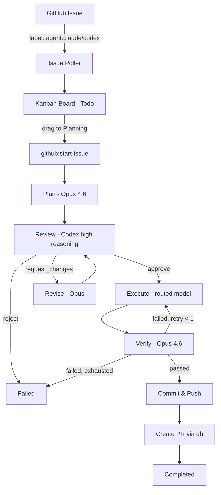

# 2026-04-07 — ShipCode: Full product build from CrossCode foundation

## Session 1: Autonomous Pipeline + Multi-App Restructure

**Status:** Complete

### System Flow

### Affected Components

| Layer | Components |
|-------|------------|
| Pipeline | `packages/pipeline/` — extracted state machine with PipelineEmitter abstraction |
| Agents | `packages/agents/` — GhCli, IssuePoller, model router, verification prompt, shipping prompt |
| Database | `packages/db/` — schema v1-v3, VerificationQueries, GitHubIssueQueries, status label tracking |
| Shared | `packages/shared/` — 12+ new types, Zod schemas, constants, IPC channels |
| Git | `packages/git/` — getDiffFromSha, worktree default branch fix |
| UI | `packages/ui/` — KanbanBoard with dnd-kit, VerificationViewer, IssueCard, StatusMappingEditor |
| Desktop | `apps/desktop/` — pipeline-bridge, settings panel, kanban integration, IPC handlers |
| CLI | `apps/cli/` — new app with commander (status, run, start commands) |
| Docs | `apps/docs/` — new Nextra site with architecture + pipeline + CLI docs |

### What was done

- [x] Found CrossCode project at `/Users/decod3rs/www/vincentshipsit/apps/shipcode/`
- [x] Designed autonomous pipeline plan with 10 decision threads
- [x] Ran 13 rounds of Codex adversarial review against the pipeline plan
- [x] Built Phase 1: Foundation types, schemas, DB migration v2, new query classes
- [x] Built Phase 2: Verification pipeline phase, stream parser, verification prompt
- [x] Built Phase 3: Autonomous review loop (max 2 rounds, conditional force-approve)
- [x] Built Phase 4: GitHub integration (GhCli, IssuePoller, model router, PR body builder)
- [x] Built Phase 5: UI components (KanbanBoard, VerificationViewer, IssueCard)
- [x] Fixed Electron PATH resolution for CLI binaries (shell env caching)
- [x] Fixed worktree default branch detection
- [x] Pushed initial release to github.com/shipshitdev/shipcode
- [x] Fetched all GitHub issues (not just labeled ones)
- [x] Designed restructure plan: rename, extract pipeline, kanban DnD, CLI, docs
- [x] Ran 13 rounds of Codex adversarial review against restructure plan
- [x] Phase 0: Renamed @crosscode → @shipcode across 54 files
- [x] Phase 1: Extracted pipeline to `packages/pipeline` with PipelineEmitter abstraction
- [x] Phase 2a: Added `todo` status, migration v3, StatusLabelMapping
- [x] Phase 2b: KanbanBoard rewrite with @dnd-kit drag-and-drop (todo→planning triggers pipeline)
- [x] Phase 2c: Implemented `github:start-issue` IPC handler with idempotency
- [x] Phase 2d: Settings panel with StatusMappingEditor
- [x] Phase 3: CLI app with status/run/start commands
- [x] Phase 4: Nextra docs site scaffolded

### Files changed

**New packages (3):**
- `packages/pipeline/` — extracted state machine (pipeline.ts, types.ts, index.ts)
- `apps/cli/` — CLI app (index.ts, commands/run.ts, commands/start.ts, commands/status.ts, adapters/cli-emitter.ts)
- `apps/docs/` — Nextra docs (7 MDX pages, config files)

**New files in existing packages:**
- `packages/agents/src/github/gh-cli.ts` — GH CLI wrapper
- `packages/agents/src/github/issue-poller.ts` — polling mechanism
- `packages/agents/src/github/model-router.ts` — label-to-model routing
- `packages/agents/src/prompts/verification-prompt.ts` — spec verification prompt
- `packages/agents/src/prompts/shipping-prompt.ts` — PR body builder
- `packages/db/src/queries/verifications.ts` — VerificationQueries class
- `packages/db/src/queries/github-issues.ts` — GitHubIssueQueries class
- `packages/ui/src/KanbanBoard.tsx` — rewritten with dnd-kit
- `packages/ui/src/VerificationViewer.tsx` — verification display
- `packages/ui/src/IssueCard.tsx` — issue card component
- `packages/ui/src/StatusMappingEditor.tsx` — settings editor
- `apps/desktop/src/main/pipeline-bridge.ts` — Electron emitter adapter
- `apps/desktop/src/renderer/components/SettingsPanel.tsx` — settings UI

**Modified (key files):**
- `packages/shared/src/types.ts` — 12+ new types/interfaces
- `packages/shared/src/constants.ts` — new constants, DEFAULT_STATUS_LABEL_MAPPINGS
- `packages/shared/src/schemas.ts` — verification Zod schema
- `packages/shared/src/ipc-channels.ts` — 9 new IPC channels
- `packages/db/src/schema.ts` — migrateV2 + migrateV3
- `packages/db/src/queries/threads.ts` — 6 new methods
- `packages/db/src/queries/settings.ts` — statusLabelMappings persistence
- `packages/agents/src/stream-parser.ts` — extractVerification()
- `packages/agents/src/prompts/review-prompt.ts` — autonomous mode
- `packages/agents/src/health-check.ts` — added gh CLI check
- `packages/agents/src/process-manager.ts` — shell PATH resolution
- `packages/git/src/worktree.ts` — default branch fix
- `packages/git/src/git-service.ts` — getDiffFromSha()
- `apps/desktop/src/main/index.ts` — wired new queries + pipeline bridge
- `apps/desktop/src/main/ipc.ts` — github:start-issue + verification handlers
- `apps/desktop/src/renderer/stores/app-store.ts` — verification, issues, settings state
- `apps/desktop/src/renderer/App.tsx` — settings toggle
- 54 files renamed @crosscode → @shipcode

### Key decisions

- **Decision:** Use `gh` CLI for all GitHub operations, not GitHub API SDK
  - **Context:** Desktop app needs GitHub integration without OAuth complexity
  - **Rationale:** Auth already handled, no token management, `child_process.execFile` for short-lived commands

- **Decision:** Extract pipeline to shared package with PipelineEmitter abstraction
  - **Context:** CLI needs same pipeline logic without Electron dependency
  - **Rationale:** Typed PipelineEvent union + adapter pattern. Desktop wraps BrowserWindow, CLI wraps stdout.

- **Decision:** Drag-and-drop kanban triggers pipeline (not manual button)
  - **Context:** User wants visual, direct control over issue lifecycle
  - **Rationale:** Only todo→planning and failed→todo are user-draggable. All other transitions are pipeline-driven.

- **Decision:** Adversarial multi-model review (Opus plans, Codex critiques)
  - **Context:** Single-model self-review produces rubber-stamp approvals
  - **Rationale:** Different model families have different blind spots. Max 2 rounds, conditional force-approve.

- **Decision:** Conditional force-approve after 2 review rounds
  - **Context:** Infinite loops worse than imperfect plans
  - **Rationale:** Force-approve only if remaining findings are minor/nit. Critical/major → fail and escalate.

- **Decision:** Per-issue `last_status_label` tracking in DB, not `status:*` pattern matching
  - **Context:** Users can configure custom label names that don't follow `status:*` pattern
  - **Rationale:** DB-tracked approach supports arbitrary labels, clean removal on transitions

- **Decision:** Single DB at `~/.shipcode/data/shipcode.db` for both desktop and CLI
  - **Context:** Prevents state fragmentation between apps
  - **Rationale:** Same `getDatabase()` function, legacy path migration for old Electron location

### Mistakes and fixes

- **Mistake:** Agents package didn't rebuild after adding new files (Turbo cache) -> **Fix:** `rm -rf .turbo packages/agents/dist` to force clean rebuild
- **Mistake:** `SystemHealth` type extended with `gh` field but health-check.ts not updated -> **Fix:** Added `checkCli('gh')` to `checkSystemHealth()`
- **Mistake:** Thread mapper missing new fields after extending Thread interface -> **Fix:** Added all 10 new fields to `mapThread()` with null defaults
- **Mistake:** `window.crosscode` references survived initial rename -> **Fix:** Multiple sed passes to catch all variants (fence tags, schema names, bridge name, worktree dir)
- **Mistake:** Codex adversarial review kept finding revision-log wording inconsistencies -> **Fix:** Accepted after round 13 that these are spec-level details resolved during implementation

### Next steps

- [ ] Fix duplicate thread creation: `startFromGitHubIssue` should accept existing threadId
- [ ] Add `GhCli.ensureLabel()` method for auto-creating labels on GitHub
- [ ] Implement actual label sync in pipeline phase transitions
- [ ] Add boot-time recovery for orphaned threads
- [ ] Add heartbeat for long-running pipeline phases
- [ ] Test full E2E: label GitHub issue → pipeline runs → PR created
- [ ] Add tests (none exist currently)
- [ ] Deploy docs site to Vercel
- [ ] Consider: is this better as a CLI daemon + GitHub as UI, or keep the desktop app?
- [ ] Evaluate OpenHands as potential execution engine vs building from scratch

> **Deferred:** CLI terminal live-monitor (TUI/watch mode) — see shipshitdev/shipcode#7
