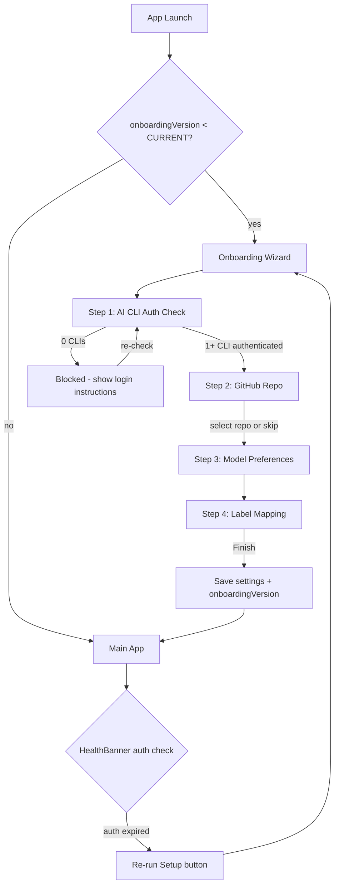
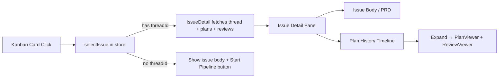

# 2026-04-08 — ShipCode: Onboarding Wizard + SQLite Migration + Issue Detail Panel

## Session 1: Full onboarding wizard (desktop + CLI)

**Status:** Complete

### System Flow

### Affected Components

| Layer | Components |
|-------|------------|
| Shared | `packages/shared/` — extended CliHealth with `authenticated`, added GhAuthStatus, OnboardingStep, CURRENT_ONBOARDING_VERSION |
| Agents | `packages/agents/` — checkClaudeAuth, checkCodexAuth, checkGhAuth, checkSystemHealthWithAuth |
| Database | `packages/db/` — onboardingVersion in settings query |
| Desktop | `apps/desktop/` — OnboardingWizard (4 step components), App.tsx gate, upgraded HealthBanner, SettingsPanel re-run button |
| CLI | `apps/cli/` — setup command, onboarding guard |

### What was done

- [x] Designed onboarding wizard plan with 8 implementation steps
- [x] Ran 2 rounds of Codex adversarial review (15 findings R1, 8 findings R2)
- [x] Step 1: Extended CliHealth with `authenticated` field, added GhAuthStatus/OnboardingStep types, typed DEFAULT_SETTINGS
- [x] Step 2: Auth verification functions (claude auth status + credential files, codex env var via shell spawn + config files, gh auth status)
- [x] Step 3: Added onboarding:check-auth and onboarding:list-repos IPC channels
- [x] Step 4: Added onboardingVersion to settings query
- [x] Step 5: Added IPC handlers + updated health:check to use checkSystemHealthWithAuth
- [x] Step 6: Built 5 React components (OnboardingWizard, StepAuthCheck, StepGitHubProject, StepModelPrefs, StepLabelMapping) + CSS + App.tsx gate
- [x] Step 7: CLI setup command with interactive flow + onboarding guard for run/start commands
- [x] Step 8: Upgraded HealthBanner with auth warnings + "Re-run Setup" button, added re-run to SettingsPanel

### Files changed

**New files:**
- `apps/desktop/src/renderer/components/onboarding/OnboardingWizard.tsx` — wizard container with step navigation
- `apps/desktop/src/renderer/components/onboarding/StepAuthCheck.tsx` — CLI auth status + re-check
- `apps/desktop/src/renderer/components/onboarding/StepGitHubProject.tsx` — repo picker (skippable)
- `apps/desktop/src/renderer/components/onboarding/StepModelPrefs.tsx` — planner/reviewer config
- `apps/desktop/src/renderer/components/onboarding/StepLabelMapping.tsx` — wraps StatusMappingEditor
- `apps/cli/src/commands/setup.ts` — interactive CLI setup wizard
- `apps/cli/src/commands/guard.ts` — onboarding guard for CLI commands

**Modified:**
- `packages/shared/src/types.ts` — CliHealth.authenticated, GhAuthStatus, OnboardingStep, AppSettings.onboardingVersion
- `packages/shared/src/constants.ts` — typed DEFAULT_SETTINGS, onboardingVersion: 0, CURRENT_ONBOARDING_VERSION
- `packages/shared/src/ipc-channels.ts` — 2 new onboarding IPC channels
- `packages/agents/src/health-check.ts` — rewritten with auth verification (no API credit burn)
- `packages/agents/src/index.ts` — new exports
- `packages/db/src/queries/settings.ts` — onboardingVersion in get()
- `apps/desktop/src/main/ipc.ts` — onboarding handlers + health:check uses auth-aware function
- `apps/desktop/src/renderer/App.tsx` — onboarding gate
- `apps/desktop/src/renderer/components/HealthBanner.tsx` — auth warnings + re-run button
- `apps/desktop/src/renderer/components/SettingsPanel.tsx` — re-run setup button
- `apps/desktop/src/renderer/styles/global.css` — onboarding + health-banner styles
- `apps/cli/src/index.ts` — registered setup command
- `apps/cli/src/commands/run.ts` — onboarding guard

### Key decisions

- **Decision:** Extend CliHealth instead of creating new CliAuthStatus type
  - **Context:** Codex review caught type duplication
  - **Rationale:** Single type hierarchy, no parallel types for same domain concept

- **Decision:** Require only 1 AI CLI, not both
  - **Context:** Codex review noted pipeline:skip-review already supports single-agent mode
  - **Rationale:** Don't block adoption for users with only one AI subscription

- **Decision:** Use credential file detection instead of API calls for auth checks
  - **Context:** Existing checkClaudeAuth() burned API credits on every check
  - **Rationale:** `claude auth status` + `~/.claude/.credentials.json` fallback. For Codex: `printenv OPENAI_API_KEY` via shell spawn (Electron Dock launch doesn't inherit shell env)

- **Decision:** onboardingVersion number instead of boolean
  - **Context:** Codex review noted boolean is fragile for future steps
  - **Rationale:** When CURRENT_ONBOARDING_VERSION increments, existing users see new steps only

- **Decision:** GitHub step is skippable
  - **Context:** Users may want ShipCode without GitHub integration
  - **Rationale:** githubPollingEnabled defaults to false anyway

### Mistakes and fixes

- **Mistake:** Initial plan used `codex -q "ok" --full-auto` which is not a real Codex CLI command -> **Fix:** Codex adversarial review caught this. Changed to env var check via shell spawn + config file detection
- **Mistake:** Initial plan used `process.env.OPENAI_API_KEY` directly -> **Fix:** Codex review noted Electron apps from Dock don't inherit shell env. Changed to `execAsync('printenv OPENAI_API_KEY')`
- **Mistake:** Plan had `SystemHealth & { gh: GhAuthStatus }` type intersection conflict -> **Fix:** Changed to `ghAuth` key to avoid overriding `SystemHealth.gh: CliHealth`

### Next steps

- [ ] Test full E2E: fresh install → wizard → pipeline runs
- [ ] Add unit tests for auth check functions
- [ ] Upgrade CLI setup to use @inquirer/prompts for richer UX
- [ ] Add search/filter to repo picker for users with 100+ repos
- [ ] Support org/collaborator repos in repo picker
- [ ] Add periodic background auth health checks
- [ ] Fix pre-existing CSS module type error in main.tsx (global.css import)

## Session 2: Replace better-sqlite3 with node:sqlite + Kanban UI + Issue Detail Panel

**Status:** Complete

### System Flow

### Affected Components

| Layer | Components |
|-------|------------|
| Database | `packages/db/` — migrated from `better-sqlite3` to `node:sqlite`, added plan list/review batch queries, transaction helper, plan version numbering |
| Pipeline | `packages/pipeline/` — fixed double thread creation, version numbering, accepts threadId |
| IPC | `apps/desktop/src/main/ipc.ts` — fixed thread creation ownership, added 3 new handlers, scoped events |
| Frontend | `apps/desktop/src/renderer/` — new `IssueDetail` component, store wiring, kanban layout + CSS, split view |
| UI | `packages/ui/` — fixed kanban column mapping (`queued` → Todo) |
| Config | Root `package.json`, `.gitignore`, `vite.config.ts` — removed native rebuild, updated externals |

### What was done

- [x] Fixed `.gitignore` — added `.next/`, `.vercel/`, `bun.lock`, `pnpm-lock.yaml`, `next-env.d.ts`
- [x] Added `esbuild` to root devDependencies (bun hoisting fix)
- [x] **Migrated `packages/db/` from `better-sqlite3` to `node:sqlite`** — 17 files, zero native modules
- [x] Added full kanban board CSS (was completely missing)
- [x] Fixed kanban layout — full-width via `thread-panel--kanban`
- [x] Fixed issue column mapping — `queued` → Todo column
- [x] Made kanban the default view
- [x] **Fixed double thread creation** — pipeline accepts threadId
- [x] **Added `ThreadQueries.setGithubIssue()`**
- [x] **Scoped IPC events by threadId** in useIpc hook
- [x] **Fixed plan version numbering** — `getMaxVersion()` instead of hardcoded `1`
- [x] **Added IPC handlers** — `github:get-issue`, `plan:list`, `review:list-by-plans`
- [x] **Added DB queries** — `PlanQueries.list()`, `getMaxVersion()`, `ReviewQueries.listByPlanIds()`
- [x] **Wired kanban card click** — `activeIssue` + `selectIssue()` in store
- [x] **Created `IssueDetail` component** — issue body/PRD, plan history timeline, pipeline info
- [x] **Split view layout** — kanban + IssueDetail side by side

### Files changed

**New:** `packages/db/src/utils.ts`, `apps/desktop/src/renderer/components/IssueDetail.tsx`
**Deleted:** `scripts/rebuild-native.js`
**Modified (24 files):** `packages/db/src/` (10 files), `packages/pipeline/src/pipeline.ts`, `packages/ui/src/KanbanBoard.tsx`, `apps/desktop/src/main/index.ts`, `apps/desktop/src/main/ipc.ts`, `apps/desktop/src/renderer/App.tsx`, `apps/desktop/src/renderer/stores/app-store.ts`, `apps/desktop/src/renderer/hooks/useIpc.ts`, `apps/desktop/src/renderer/components/ThreadPanel.tsx`, `apps/desktop/src/renderer/components/ActiveThread.tsx`, `apps/desktop/src/renderer/styles/global.css`, `apps/desktop/vite.config.ts`, `apps/desktop/package.json`, `packages/db/package.json`, `package.json`, `.gitignore`

### Key decisions

- **Decision:** Replace better-sqlite3 with node:sqlite
  - **Context:** Native module rebuild broke on every `bun install` due to bun's isolated module paths
  - **Rationale:** node:sqlite is built into Node v24 (Electron 41), zero native modules, zero rebuilds

- **Decision:** IPC handler owns thread creation, not pipeline
  - **Context:** Double thread creation bug — both IPC and pipeline created threads
  - **Rationale:** Single source of truth. IPC creates, sets github fields, passes threadId to pipeline.

- **Decision:** IssueDetail as separate component, not overloading ActiveThread
  - **Context:** Codex review flagged ActiveThread is thread-centric
  - **Rationale:** IssueDetail owns its own useQuery data fetching, avoids hydration conflicts

- **Decision:** Store full issue object in `activeIssue`, not just ID
  - **Context:** Codex review found identity inconsistency
  - **Rationale:** Full object avoids extra fetch, provides all data to IssueDetail

### Mistakes and fixes

- **Mistake:** `cd` into native module dir persisted, `bun install` ran in wrong dir → **Fix:** Returned to project root
- **Mistake:** Kanban CSS completely missing → **Fix:** Added full kanban layout CSS
- **Mistake:** Kanban squeezed into 300px panel → **Fix:** `thread-panel--kanban` with `flex: 1`
- **Mistake:** All issues in "Planning" column → **Fix:** Moved `queued` to Todo column

### Next steps

- [ ] Visual test: verify IssueDetail renders correctly
- [ ] Test kanban card click → issue detail opens
- [ ] Test "Start Pipeline" button on unstarted issues
- [ ] Add markdown rendering for issue body
- [ ] Wire pipeline controls in IssueDetail (approve/reject)
- [ ] Keep issue pipeline_status in sync across pipeline phases
- [ ] Add issue creation modal
