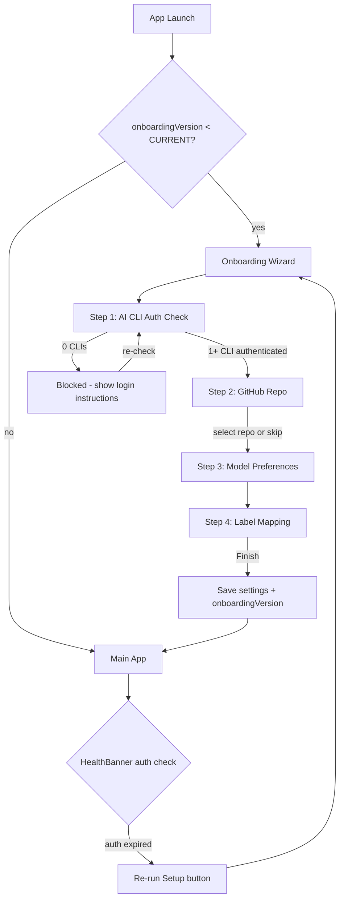
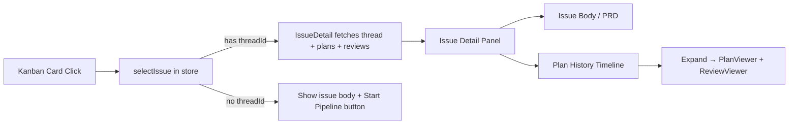
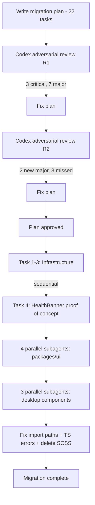

# 2026-04-08 — ShipCode: Onboarding Wizard + SQLite Migration + Issue Detail Panel + Test Infrastructure + Tailwind Migration

## Session 1: Full onboarding wizard (desktop + CLI)

**Status:** Complete

### System Flow



### Affected Components

| Layer | Components |
|-------|------------|
| Shared | `packages/shared/` — extended CliHealth with `authenticated`, added GhAuthStatus, OnboardingStep, CURRENT_ONBOARDING_VERSION |
| Agents | `packages/agents/` — checkClaudeAuth, checkCodexAuth, checkGhAuth, checkSystemHealthWithAuth |
| Database | `packages/db/` — onboardingVersion in settings query |
| Desktop | `apps/desktop/` — OnboardingWizard (4 step components), App.tsx gate, upgraded HealthBanner, SettingsPanel re-run button |
| CLI | `apps/cli/` — setup command, onboarding guard |

### What was done

- [x] Designed onboarding wizard plan with 8 implementation steps
- [x] Ran 2 rounds of Codex adversarial review (15 findings R1, 8 findings R2)
- [x] Step 1: Extended CliHealth with `authenticated` field, added GhAuthStatus/OnboardingStep types, typed DEFAULT_SETTINGS
- [x] Step 2: Auth verification functions (claude auth status + credential files, codex env var via shell spawn + config files, gh auth status)
- [x] Step 3: Added onboarding:check-auth and onboarding:list-repos IPC channels
- [x] Step 4: Added onboardingVersion to settings query
- [x] Step 5: Added IPC handlers + updated health:check to use checkSystemHealthWithAuth
- [x] Step 6: Built 5 React components (OnboardingWizard, StepAuthCheck, StepGitHubProject, StepModelPrefs, StepLabelMapping) + CSS + App.tsx gate
- [x] Step 7: CLI setup command with interactive flow + onboarding guard for run/start commands
- [x] Step 8: Upgraded HealthBanner with auth warnings + "Re-run Setup" button, added re-run to SettingsPanel

### Files changed

**New files:**
- `apps/desktop/src/renderer/components/onboarding/OnboardingWizard.tsx` — wizard container with step navigation
- `apps/desktop/src/renderer/components/onboarding/StepAuthCheck.tsx` — CLI auth status + re-check
- `apps/desktop/src/renderer/components/onboarding/StepGitHubProject.tsx` — repo picker (skippable)
- `apps/desktop/src/renderer/components/onboarding/StepModelPrefs.tsx` — planner/reviewer config
- `apps/desktop/src/renderer/components/onboarding/StepLabelMapping.tsx` — wraps StatusMappingEditor
- `apps/cli/src/commands/setup.ts` — interactive CLI setup wizard
- `apps/cli/src/commands/guard.ts` — onboarding guard for CLI commands

**Modified:**
- `packages/shared/src/types.ts` — CliHealth.authenticated, GhAuthStatus, OnboardingStep, AppSettings.onboardingVersion
- `packages/shared/src/constants.ts` — typed DEFAULT_SETTINGS, onboardingVersion: 0, CURRENT_ONBOARDING_VERSION
- `packages/shared/src/ipc-channels.ts` — 2 new onboarding IPC channels
- `packages/agents/src/health-check.ts` — rewritten with auth verification (no API credit burn)
- `packages/agents/src/index.ts` — new exports
- `packages/db/src/queries/settings.ts` — onboardingVersion in get()
- `apps/desktop/src/main/ipc.ts` — onboarding handlers + health:check uses auth-aware function
- `apps/desktop/src/renderer/App.tsx` — onboarding gate
- `apps/desktop/src/renderer/components/HealthBanner.tsx` — auth warnings + re-run button
- `apps/desktop/src/renderer/components/SettingsPanel.tsx` — re-run setup button
- `apps/desktop/src/renderer/styles/global.css` — onboarding + health-banner styles
- `apps/cli/src/index.ts` — registered setup command
- `apps/cli/src/commands/run.ts` — onboarding guard

### Key decisions

- **Decision:** Extend CliHealth instead of creating new CliAuthStatus type
  - **Context:** Codex review caught type duplication
  - **Rationale:** Single type hierarchy, no parallel types for same domain concept

- **Decision:** Require only 1 AI CLI, not both
  - **Context:** Codex review noted pipeline:skip-review already supports single-agent mode
  - **Rationale:** Don't block adoption for users with only one AI subscription

- **Decision:** Use credential file detection instead of API calls for auth checks
  - **Context:** Existing checkClaudeAuth() burned API credits on every check
  - **Rationale:** `claude auth status` + `~/.claude/.credentials.json` fallback. For Codex: `printenv OPENAI_API_KEY` via shell spawn (Electron Dock launch doesn't inherit shell env)

- **Decision:** onboardingVersion number instead of boolean
  - **Context:** Codex review noted boolean is fragile for future steps
  - **Rationale:** When CURRENT_ONBOARDING_VERSION increments, existing users see new steps only

- **Decision:** GitHub step is skippable
  - **Context:** Users may want ShipCode without GitHub integration
  - **Rationale:** githubPollingEnabled defaults to false anyway

### Mistakes and fixes

- **Mistake:** Initial plan used `codex -q "ok" --full-auto` which is not a real Codex CLI command -> **Fix:** Codex adversarial review caught this. Changed to env var check via shell spawn + config file detection
- **Mistake:** Initial plan used `process.env.OPENAI_API_KEY` directly -> **Fix:** Codex review noted Electron apps from Dock don't inherit shell env. Changed to `execAsync('printenv OPENAI_API_KEY')`
- **Mistake:** Plan had `SystemHealth & { gh: GhAuthStatus }` type intersection conflict -> **Fix:** Changed to `ghAuth` key to avoid overriding `SystemHealth.gh: CliHealth`

### Next steps

- [ ] Test full E2E: fresh install → wizard → pipeline runs
- [ ] Add unit tests for auth check functions
- [ ] Upgrade CLI setup to use @inquirer/prompts for richer UX
- [ ] Add search/filter to repo picker for users with 100+ repos
- [ ] Support org/collaborator repos in repo picker
- [ ] Add periodic background auth health checks
- [ ] Fix pre-existing CSS module type error in main.tsx (global.css import)

## Session 2: Replace better-sqlite3 with node:sqlite + Kanban UI + Issue Detail Panel

**Status:** Complete

### System Flow



### Affected Components

| Layer | Components |
|-------|------------|
| Database | `packages/db/` — migrated from `better-sqlite3` to `node:sqlite`, added plan list/review batch queries, transaction helper, plan version numbering |
| Pipeline | `packages/pipeline/` — fixed double thread creation, version numbering, accepts threadId |
| IPC | `apps/desktop/src/main/ipc.ts` — fixed thread creation ownership, added 3 new handlers, scoped events |
| Frontend | `apps/desktop/src/renderer/` — new `IssueDetail` component, store wiring, kanban layout + CSS, split view |
| UI | `packages/ui/` — fixed kanban column mapping (`queued` → Todo) |
| Config | Root `package.json`, `.gitignore`, `vite.config.ts` — removed native rebuild, updated externals |

### What was done

- [x] Fixed `.gitignore` — added `.next/`, `.vercel/`, `bun.lock`, `pnpm-lock.yaml`, `next-env.d.ts`
- [x] Added `esbuild` to root devDependencies (bun hoisting fix)
- [x] **Migrated `packages/db/` from `better-sqlite3` to `node:sqlite`** — 17 files, zero native modules
- [x] Added full kanban board CSS (was completely missing)
- [x] Fixed kanban layout — full-width via `thread-panel--kanban`
- [x] Fixed issue column mapping — `queued` → Todo column
- [x] Made kanban the default view
- [x] **Fixed double thread creation** — pipeline accepts threadId
- [x] **Added `ThreadQueries.setGithubIssue()`**
- [x] **Scoped IPC events by threadId** in useIpc hook
- [x] **Fixed plan version numbering** — `getMaxVersion()` instead of hardcoded `1`
- [x] **Added IPC handlers** — `github:get-issue`, `plan:list`, `review:list-by-plans`
- [x] **Added DB queries** — `PlanQueries.list()`, `getMaxVersion()`, `ReviewQueries.listByPlanIds()`
- [x] **Wired kanban card click** — `activeIssue` + `selectIssue()` in store
- [x] **Created `IssueDetail` component** — issue body/PRD, plan history timeline, pipeline info
- [x] **Split view layout** — kanban + IssueDetail side by side

### Files changed

**New:** `packages/db/src/utils.ts`, `apps/desktop/src/renderer/components/IssueDetail.tsx`
**Deleted:** `scripts/rebuild-native.js`
**Modified (24 files):** `packages/db/src/` (10 files), `packages/pipeline/src/pipeline.ts`, `packages/ui/src/KanbanBoard.tsx`, `apps/desktop/src/main/index.ts`, `apps/desktop/src/main/ipc.ts`, `apps/desktop/src/renderer/App.tsx`, `apps/desktop/src/renderer/stores/app-store.ts`, `apps/desktop/src/renderer/hooks/useIpc.ts`, `apps/desktop/src/renderer/components/ThreadPanel.tsx`, `apps/desktop/src/renderer/components/ActiveThread.tsx`, `apps/desktop/src/renderer/styles/global.css`, `apps/desktop/vite.config.ts`, `apps/desktop/package.json`, `packages/db/package.json`, `package.json`, `.gitignore`

### Key decisions

- **Decision:** Replace better-sqlite3 with node:sqlite
  - **Context:** Native module rebuild broke on every `bun install` due to bun's isolated module paths
  - **Rationale:** node:sqlite is built into Node v24 (Electron 41), zero native modules, zero rebuilds

- **Decision:** IPC handler owns thread creation, not pipeline
  - **Context:** Double thread creation bug — both IPC and pipeline created threads
  - **Rationale:** Single source of truth. IPC creates, sets github fields, passes threadId to pipeline.

- **Decision:** IssueDetail as separate component, not overloading ActiveThread
  - **Context:** Codex review flagged ActiveThread is thread-centric
  - **Rationale:** IssueDetail owns its own useQuery data fetching, avoids hydration conflicts

- **Decision:** Store full issue object in `activeIssue`, not just ID
  - **Context:** Codex review found identity inconsistency
  - **Rationale:** Full object avoids extra fetch, provides all data to IssueDetail

### Mistakes and fixes

- **Mistake:** `cd` into native module dir persisted, `bun install` ran in wrong dir → **Fix:** Returned to project root
- **Mistake:** Kanban CSS completely missing → **Fix:** Added full kanban layout CSS
- **Mistake:** Kanban squeezed into 300px panel → **Fix:** `thread-panel--kanban` with `flex: 1`
- **Mistake:** All issues in "Planning" column → **Fix:** Moved `queued` to Todo column

### Next steps

- [ ] Visual test: verify IssueDetail renders correctly
- [ ] Test kanban card click → issue detail opens
- [ ] Test "Start Pipeline" button on unstarted issues
- [ ] Add markdown rendering for issue body
- [ ] Wire pipeline controls in IssueDetail (approve/reject)
- [ ] Keep issue pipeline_status in sync across pipeline phases
- [ ] Add issue creation modal

## Session 3: Test Infrastructure + Initial Test Suite (158 tests)

**Status:** Complete

### System Flow

```mermaid
flowchart LR
    TURBO[turbo run test] --> SHARED[@shipcode/shared]
    TURBO --> AGENTS[@shipcode/agents]
    TURBO --> DB[@shipcode/db]
    SHARED --> S1[schemas.test.ts — 64 tests]
    AGENTS --> A1[stream-parser.test.ts — 33 tests]
    DB --> D1[schema.test.ts — 5]
    DB --> D2[utils.test.ts — 3]
    DB --> D3[projects.test.ts — 7]
    DB --> D4[threads.test.ts — 10]
    DB --> D5[plans.test.ts — 10]
    DB --> D6[reviews.test.ts — 5]
    DB --> D7[settings.test.ts — 5]
    DB --> D8[verifications.test.ts — 4]
    DB --> D9[github-issues.test.ts — 12]
```

### Affected Components

| Layer | Components |
|-------|------------|
| Root | `vitest.workspace.ts`, `turbo.json` (test task), `package.json` (test script, vitest dep) |
| Shared | `packages/shared/` — vitest config, schemas.test.ts (64 tests for all Zod schemas) |
| Agents | `packages/agents/` — vitest config, stream-parser.test.ts (33 tests for StreamParser class) |
| Database | `packages/db/` — vitest config, test-helpers.ts, 9 test files (61 tests for all query classes + schema + utils) |

### What was done

- [x] Installed Vitest 4.1.3 as root devDependency
- [x] Created `vitest.workspace.ts` aggregating shared, agents, db packages
- [x] Added `test` task to `turbo.json` with `^build` dependency
- [x] Added `test` script to root `package.json`
- [x] Created per-package `vitest.config.ts` for shared, agents, db
- [x] Added `test` scripts to each package's `package.json`
- [x] **Shared tests (64):** All 8 Zod schemas — shipCodePlanSchema, planStepSchema, planFileChangeSchema, planReviewSchema, reviewFindingSchema, verificationResultSchema, criteriaCheckSchema, verificationIssueSchema
- [x] **Agents tests (33):** StreamParser — feed/reset/getRawOutput, extractPlan (fenced + fallback + failures), extractReview, extractVerification, detectError (all 7 patterns + ANSI stripping), getTimeSinceLastOutput (fake timers)
- [x] **DB tests (61):** test-helpers.ts (in-memory SQLite factory), transaction() (commit/rollback/nested), schema migrations (idempotency), ProjectQueries (7), ThreadQueries (10), PlanQueries (10), ReviewQueries (5), SettingsQueries (5), VerificationQueries (4), GitHubIssueQueries (12)
- [x] Verified all 158 tests pass via `turbo run test`

### Files changed

**New files (16):**
- `vitest.workspace.ts` — root workspace aggregating 3 packages
- `packages/shared/vitest.config.ts` — vitest config
- `packages/shared/src/schemas.test.ts` — 64 tests for Zod schemas
- `packages/agents/vitest.config.ts` — vitest config
- `packages/agents/src/stream-parser.test.ts` — 33 tests for StreamParser
- `packages/db/vitest.config.ts` — vitest config
- `packages/db/src/test-helpers.ts` — createTestDb() with in-memory SQLite
- `packages/db/src/utils.test.ts` — 3 tests for transaction helper
- `packages/db/src/schema.test.ts` — 5 tests for migrations
- `packages/db/src/queries/projects.test.ts` — 7 tests
- `packages/db/src/queries/threads.test.ts` — 10 tests
- `packages/db/src/queries/plans.test.ts` — 10 tests
- `packages/db/src/queries/reviews.test.ts` — 5 tests
- `packages/db/src/queries/settings.test.ts` — 5 tests
- `packages/db/src/queries/verifications.test.ts` — 4 tests
- `packages/db/src/queries/github-issues.test.ts` — 12 tests

**Modified (4):**
- `package.json` (root) — added vitest devDependency + test script
- `turbo.json` — added test task
- `packages/shared/package.json` — added test script
- `packages/agents/package.json` — added test script
- `packages/db/package.json` — added test script

### Key decisions

- **Decision:** Vitest over Jest
  - **Context:** Need a test framework compatible with ESNext modules, TypeScript 6, and the existing Vite toolchain
  - **Rationale:** Native ESM, built-in TypeScript via esbuild, aligns with Vite already used in desktop app. Single dependency, no config overhead.

- **Decision:** Real SQLite (in-memory) for DB tests, not mocks
  - **Context:** Query classes are thin SQL wrappers; mocking would test nothing
  - **Rationale:** In-memory `:memory:` databases are sub-millisecond per test. Tests actual SQL correctness, column mapping, cascading deletes, constraint enforcement.

- **Decision:** Per-package vitest configs with root workspace
  - **Context:** Packages will diverge (ui needs jsdom, pipeline needs different timeouts)
  - **Rationale:** Each package owns its test config. Root workspace enables `turbo run test` across all.

- **Decision:** Collocated `*.test.ts` files, not `__tests__/` directories
  - **Context:** Project convention uses flat src/ layout
  - **Rationale:** Tests next to source, easier navigation, no path mapping needed

### Mistakes and fixes

- **Mistake:** Test files were already committed in a prior commit on the `feat/scss-command-palette` branch (commit `2605864`) — the parallel agents wrote files matching what was already tracked -> **Fix:** No new commit needed for test files; verified all 158 tests pass with current state

### Next steps

- [ ] Add tests for `packages/agents/health-check.ts` (needs exec mocking)
- [ ] Add tests for `packages/agents/github/gh-cli.ts` (needs subprocess mocking)
- [ ] Add tests for `packages/pipeline/pipeline.ts` (needs process manager mocking)
- [ ] Add tests for `packages/git/git-service.ts` (needs simple-git mocking)
- [ ] Add coverage reporting (`@vitest/coverage-v8`)
- [ ] Add test step to CI pipeline
- [ ] Consider adding `packages/ui` tests with jsdom environment

## Session 4: Tailwind v4 + shadcn/ui Migration (full SCSS removal)

**Status:** Complete

### System Flow



### Affected Components

| Layer | Components |
|-------|------------|
| packages/ui | 11 new shadcn primitives (Button, Input, Badge, Card, Alert, Label, Textarea, Switch, Dialog, Command, Select), cn() utility, all 9 domain components migrated |
| apps/desktop | All 13 renderer components migrated, app.css with @theme tokens, postcss.config.mjs, all 21 SCSS partials deleted |
| Build | @tailwindcss/postcss added, sass removed, PostCSS config added |

### What was done

- [x] Wrote 22-task migration plan with file structure, task ordering, shadcn component mapping
- [x] Ran 2 rounds of Codex adversarial review (18 findings R1, 5 new R2)
- [x] Fixed all critical/major findings: @tailwindcss/postcss over vite plugin, manual shadcn copy, Radix deps, path resolution, CSP check
- [x] Task 1: Installed Tailwind v4 + PostCSS + Radix deps, removed sass
- [x] Task 2: Created cn() utility, app.css with @theme tokens + legacy aliases + Electron @utility
- [x] Task 3: Created 6 shadcn primitives (button, input, badge, card, alert, label)
- [x] Task 4: Migrated HealthBanner as proof of concept (shadcn Alert + Button)
- [x] Tasks 5-12: Dispatched 4 parallel subagents for 9 packages/ui components
- [x] Tasks 13-22: Dispatched 3 parallel subagents for 13 desktop components + 5 new primitives
- [x] Fixed import paths (../lib/utils → ./lib/utils across all components)
- [x] Fixed Badge variant mismatches ("secondary"/"destructive" → valid variants)
- [x] Fixed VerificationViewer severity type ("critical" → "blocker")
- [x] Deleted all 21 SCSS partials + main.scss, removed SCSS import from main.tsx
- [x] Final typecheck: zero errors

### Files changed

**New files (17):**
- `packages/ui/src/lib/utils.ts` — cn() utility (clsx + tailwind-merge)
- `packages/ui/src/primitives/button.tsx` — CVA variants matching existing .btn styles
- `packages/ui/src/primitives/input.tsx`, `textarea.tsx`, `badge.tsx`, `card.tsx`, `alert.tsx`, `label.tsx`, `switch.tsx`, `dialog.tsx`, `command.tsx`, `select.tsx` — 11 shadcn primitives total
- `apps/desktop/src/renderer/styles/app.css` — Tailwind entry point with @theme + @utility
- `apps/desktop/postcss.config.mjs` — @tailwindcss/postcss plugin

**Modified (22+ files):**
- All 9 `packages/ui/src/*.tsx` domain components — BEM → Tailwind + shadcn
- All 13 `apps/desktop/src/renderer/components/**/*.tsx` — BEM → Tailwind + shadcn
- `packages/ui/src/index.ts` — exports for cn + 11 primitives
- `packages/ui/package.json` — added tailwind-merge, clsx, cva, radix, lucide-react, cmdk; updated exports
- `apps/desktop/package.json` — added tailwindcss, @tailwindcss/postcss; removed sass, cmdk
- `apps/desktop/src/renderer/main.tsx` — import app.css only

**Deleted (22 files):**
- All 21 SCSS partials in `apps/desktop/src/renderer/styles/_*.scss`
- `apps/desktop/src/renderer/styles/main.scss`

### Key decisions

- **Decision:** Use @tailwindcss/postcss instead of @tailwindcss/vite
  - **Context:** Codex R1 review caught that vite-plugin-electron builds 3 targets (main, preload, renderer) — @tailwindcss/vite would interfere with non-CSS builds
  - **Rationale:** PostCSS approach matches the working apps/web setup and avoids electron multi-build interference

- **Decision:** Copy shadcn components manually instead of using CLI
  - **Context:** Codex R1 review caught that `npx shadcn add` doesn't work in monorepo shared packages
  - **Rationale:** shadcn components are just source files, no runtime package. Manual copy gives full control over import paths and customization

- **Decision:** Legacy CSS variable aliases in app.css during migration
  - **Context:** Codex R2 review caught that some JSX uses `var(--success)` inline while Tailwind uses `--color-success`
  - **Rationale:** Dual aliases bridge the gap. Cleaned up in final pass.

- **Decision:** Parallel subagent execution (7 agents total for 22 tasks)
  - **Context:** Components are independent — no shared mutable state between migrations
  - **Rationale:** 4 agents for packages/ui + 3 agents for desktop = massive parallelism, finished in ~5 minutes wall clock

### Mistakes and fixes

- **Mistake:** Subagents used `../lib/utils` imports instead of `./lib/utils` (components are in `src/`, not a subdirectory) → **Fix:** Batch sed to fix all import paths
- **Mistake:** Subagent used Badge variant `"secondary"` which doesn't exist in our Badge → **Fix:** Changed to `"default"` / `"success"` / `"warning"` as appropriate
- **Mistake:** VerificationViewer checked `severity === 'critical'` but type is `'blocker' | 'warning'` → **Fix:** Changed to `'blocker'`
- **Mistake:** Cleanup subagent deleted app.css along with SCSS files → **Fix:** Recreated app.css

### Next steps

- [ ] Visual QA: run `bun run dev` and walk through every screen
- [ ] Verify Tailwind classes render correctly in Electron
- [ ] Check @source path resolves for packages/ui components
- [ ] Remove legacy CSS variable aliases from app.css once all inline var() references are cleaned up
- [ ] Add more shadcn primitives as needed (Tooltip, Popover, Tabs, etc.)
- [ ] Consider extracting desktop-specific components into packages/ui where reusable
