# 2026-04-10 — ShipCode: Docs Migration + Vercel Deployment + Release Automation + Configurable Worktree Root + PRD Architecture + Mandatory-GitHub Refactor + Kanban Status Colors + 4-Column Kanban Refactor + Per-Issue Executor Dropdown + Cross-Agent Memory System + IssueDetail Dialog Overlay + AI-First CreateIssueModal + SESSION-QUICK-START + Security Test Suite + Branch Cleanup + GitHub Board/Protection Hygiene + CSP + Hook Order Fix + DnD Overflow Fix + Table Primitive + Mission Control Truncation Fix + Sidebar Collapse UX + Settings Redesign (Codex-style) + Activity/Inbox Pages + Dashboard Pagination (server-side) + Re-run Failed Tasks + Terminal OOM Fix + IPC Safety Guards + Parallel Issue Implementation (6 issues) + Dead Code Cleanup + Kanban Agent Label Display Fix + Kanban Card Selection Highlight Fix + xterm.js Terminal + Mission Control Cleanup + Process Lifecycle Fixes + Deferred Worktree Creation + Splash Screen + Custom App Menu + Activity Bugs + Inbox Group/Sort + Issue Detail Full-Page Toggle + Custom App Icon + Terminal Output Isolation + Task Tabs + Skeleton Loader + Persistent Header

## Session 1: Nextra 4 docs migration, `/docs` deployment, and release workflow

**Status:** Complete

### System Flow

```mermaid
flowchart LR
    DOCS[apps/docs Nextra 4 content] --> BUILD[DOCS_BASE_PATH=/docs bun run build]
    BUILD --> OUT[apps/docs/out]
    OUT --> SYNC[scripts/sync-docs-to-web.sh]
    SYNC --> PUBLIC[apps/web/public/docs]
    PUBLIC --> WEBBUILD[apps/web static export]
    WEBBUILD --> VERCEL[shipcode-web Vercel project]
    VERCEL --> DOMAIN[shipcode.shipshit.dev]
    DOMAIN --> DOCSPATH[/docs]
```

### Affected Components

| Layer | Components |
|-------|------------|
| Docs | `apps/docs/` — migrated from legacy Nextra `pages/` config to Nextra 4 App Router + `content/` tree |
| Web | `apps/web/` — serves embedded static docs from `public/docs`, deploys as `shipcode-web` |
| Deploy | `scripts/sync-docs-to-web.sh`, `package.json`, `.github/workflows/release.yml`, Vercel project/domain, Route53 record |

### What was done

- [x] Fixed docs startup by replacing stale Nextra `theme` / `themeConfig` config with Nextra 4 App Router layout.
- [x] Added `dev:docs` and moved docs default dev port to `3101` to avoid the local `3001` conflict.
- [x] Migrated docs content from `apps/docs/pages/` to `apps/docs/content/`.
- [x] Added App Router files for Nextra docs rendering: `app/layout.tsx`, `app/[[...mdxPath]]/page.tsx`, and `mdx-components.tsx`.
- [x] Configured docs to build with `DOCS_BASE_PATH=/docs`.
- [x] Deployed the main web app to Vercel project `shipcode-web`.
- [x] Added `shipcode.shipshit.dev` to the Vercel project and created Route53 `A shipcode.shipshit.dev -> 76.76.21.21`.
- [x] Removed the unused standalone `shipcode-docs` Vercel project after choosing single-site deployment.
- [x] Added `scripts/sync-docs-to-web.sh` and `sync:docs` / `deploy:web` scripts so docs are embedded into the web bundle reproducibly.
- [x] Updated release workflow with a `deploy-web` job that syncs docs and deploys `shipcode-web` via Vercel.

### Files changed

- `apps/docs/next.config.mjs` — Nextra 4 config, `/docs` base path support, static export.
- `apps/docs/app/layout.tsx` — Nextra docs theme layout using `getPageMap()`.
- `apps/docs/app/[[...mdxPath]]/page.tsx` — catch-all MDX docs route.
- `apps/docs/mdx-components.tsx` — docs theme MDX component wiring.
- `apps/docs/content/` — migrated docs content and `_meta.tsx` files.
- `apps/docs/theme.config.tsx` — Nextra 4-compatible theme config.
- `apps/docs/package.json` — docs dev port and missing type dependency updates.
- `apps/web/public/docs/` — embedded exported docs bundle for `/docs`.
- `apps/web/vercel.json` — Vercel output directory config.
- `apps/web/package.json` — isolated web deploy dependency cleanup.
- `apps/web/next.config.ts` — static export config cleanup.
- `apps/web/tsconfig.json` — self-contained TypeScript config for isolated Vercel build.
- `scripts/sync-docs-to-web.sh` — repeatable docs export/sync script.
- `package.json` — added `dev:docs`, `sync:docs`, and `deploy:web`.
- `.github/workflows/release.yml` — added production web deployment job.

### Key decisions

- **Decision:** Serve docs from the same `shipcode-web` Vercel project instead of proxying a separate `shipcode-docs` deployment.
  - **Context:** Static export with `basePath` generated `/docs` asset URLs but did not emit a physical `out/docs/` tree for the standalone docs project to serve directly.
  - **Rationale:** Embedding `apps/docs/out` into `apps/web/public/docs` makes `shipcode.shipshit.dev/docs` reliable without CloudFront path routing or a second Vercel origin.

- **Decision:** Keep `DOCS_BASE_PATH=/docs` as part of the sync script.
  - **Context:** Nextra-generated asset links need the `/docs/_next/...` prefix when served under the web app’s `/docs` subtree.
  - **Rationale:** The script prevents manual deploys from forgetting the base path.

- **Decision:** Delete the unused `shipcode-docs` Vercel project.
  - **Context:** It was created while exploring a two-origin `/docs` proxy deployment.
  - **Rationale:** The final architecture is single-site, so keeping the stale project would create confusion.

### Mistakes and fixes

- **Mistake:** Initial docs app used old Nextra config keys (`theme`, `themeConfig`) that Nextra 4 rejects -> **Fix:** Migrated to App Router layout and current Nextra docs theme API.
- **Mistake:** Tried a separate docs Vercel origin for `/docs`, but static export did not publish a standalone `/docs` path tree -> **Fix:** Embedded the docs export into `apps/web/public/docs`.
- **Mistake:** Vercel project preset/output settings initially treated apps as generic projects and looked for `public` -> **Fix:** Added app-level `vercel.json` output configuration and ultimately used static export output under the web project.
- **Mistake:** AWS credentials were stale after key rotation -> **Fix:** User updated default AWS credentials; verified `aws sts get-caller-identity` before Route53 changes.

### Next steps

- [ ] Add `VERCEL_TOKEN` and `VERCEL_ORG_ID` secrets in GitHub Actions if they are not already configured.
- [ ] Verify the next GitHub Release runs the new `deploy-web` job successfully.
- [ ] Consider adding a CI check that fails if docs content changes without a refreshed `apps/web/public/docs` bundle.

## Session 2: Configurable worktree root (`~/.shipcode/worktrees` default) + WorktreeManager API refactor

**Status:** Complete

### System Flow

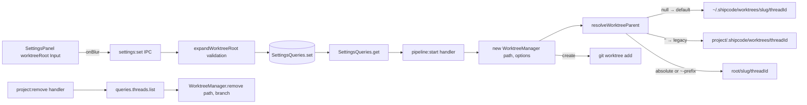

### Affected Components

| Layer | Components |
|-------|------------|
| Shared | `packages/shared/src/types.ts`, `constants.ts`, new `worktree-path.ts` helper (expandWorktreeRoot, projectSlug, resolveWorktreeParent), re-exported from `index.ts` |
| DB | `packages/db/src/queries/settings.ts` — fixed null-serialization bug + worktreeRoot read/validate |
| Git | `packages/git/src/worktree.ts` — WorktreeManagerOptions; `remove(path, branch)` path-as-truth API; `list()` rewritten to filter by `shipcode/*` branch prefix |
| Desktop IPC | `apps/desktop/src/main/ipc.ts` — settings threaded into pipeline:start; project:remove now cleans up worktrees |
| Desktop UI | `apps/desktop/src/renderer/components/SettingsPanel.tsx` — new Worktree Location section with inline error display |
| Tests | new `packages/shared/src/worktree-path.test.ts` (18 tests); extended `packages/db/src/queries/settings.test.ts` (+6 tests) |

### What was done

- [x] Wrote plan at `/Users/decod3rs/.claude-genfeedai/plans/piped-dreaming-horizon.md` in plan mode.
- [x] Ran an adversarial review pass via codex-rescue; it stalled, so cancelled and folded the captured finding (remove/list recompute-by-threadId is latent orphan bug) + manual audit into the plan revision.
- [x] Added `AppSettings.worktreeRoot: string | null` with semantics: `null` = default (`~/.shipcode/worktrees`), `''` = legacy project-local, absolute or `~`-prefix = custom.
- [x] Created shared `worktree-path.ts` helper with `expandWorktreeRoot`, `projectSlug` (basename + sha256[:6]), `resolveWorktreeParent`.
- [x] Fixed `SettingsQueries.set()` null-serialization bug (`typeof null === 'object'` → `JSON.stringify(null)` → literal `"null"` string). Now stores empty string for null/undefined.
- [x] Validated `worktreeRoot` at `settings:set` time via `expandWorktreeRoot` so relative paths and `~user/…` are rejected at the boundary.
- [x] `SettingsQueries.get()` treats missing / empty / legacy `"null"` as default to recover from any pre-fix rows.
- [x] Refactored `WorktreeManager`: added `WorktreeManagerOptions { worktreeRoot }`; `remove(path, branch)` now takes concrete values (path-as-truth) to insulate cleanup from mid-flight setting toggles; `list()` rewritten to parse `git worktree list --porcelain` and filter by `shipcode/*` branch prefix instead of fragile path substring.
- [x] Wired settings into `pipeline:start` handler at `apps/desktop/src/main/ipc.ts:316`.
- [x] Added worktree cleanup hook to `project:remove` IPC handler (enumerate threads and call `WorktreeManager.remove` per thread before deleting the project row).
- [x] Added "Worktree Location" section to `SettingsPanel.tsx` with `defaultValue` + `onBlur` Input and inline error display for validation failures from IPC.
- [x] Wrote 18 unit tests for `worktree-path.ts` (all expand cases, slug determinism/collision/sanitization/truncation, resolveWorktreeParent routing).
- [x] Wrote 6 new tests in `settings.test.ts` (defaults, ~-prefix round-trip, absolute round-trip, null→'' storage, legacy `"null"` recovery, relative-path rejection, `~user` rejection).
- [x] Ran full test suite + typecheck across monorepo: 82 shared + 69 db + 50 pipeline tests pass, 14/14 typecheck packages clean.

### Files changed

- `packages/shared/src/types.ts` — added `worktreeRoot: string | null` to `AppSettings`.
- `packages/shared/src/constants.ts` — added `worktreeRoot: null` to `DEFAULT_SETTINGS`; exported `DEFAULT_WORKTREE_ROOT = '~/.shipcode/worktrees'`.
- `packages/shared/src/worktree-path.ts` (new) — `expandWorktreeRoot`, `projectSlug`, `resolveWorktreeParent`.
- `packages/shared/src/worktree-path.test.ts` (new) — 18 unit tests.
- `packages/shared/src/index.ts` — re-export `worktree-path`.
- `packages/db/src/queries/settings.ts` — null-aware serializer, worktreeRoot read with legacy recovery, pre-write validation.
- `packages/db/src/queries/settings.test.ts` — +6 worktreeRoot tests + defaults assertion.
- `packages/git/src/worktree.ts` — options arg; path-as-truth `remove(path, branch)`; branch-prefix `list()`.
- `apps/desktop/src/main/ipc.ts` — settings threaded into `WorktreeManager` at `pipeline:start`; `project:remove` now best-effort-cleans worktrees.
- `apps/desktop/src/renderer/components/SettingsPanel.tsx` — new Worktree Location section with inline error state.

### Key decisions

- **Decision:** Default worktree root is `~/.shipcode/worktrees` (global), not project-local.
  - **Context:** User directly asked "i think default should be `~/.shipcode`, right?" and project-local worktrees bleed into iCloud/Dropbox-synced project dirs.
  - **Rationale:** Clean project trees, no cloud-sync bleed, one central inspection dir, consistent with `.shipcode` brand. Pre-release repo so flipping default is cheap.

- **Decision:** Use deterministic `<basename>-<sha256[:6]>` project slugs for the global-root layout, not UUIDs or DB-stored slugs.
  - **Context:** With a global root, users will browse `~/.shipcode/worktrees/` and need to recognize their projects.
  - **Rationale:** Human-readable, deterministic (no migration), collision-safe across same-basename projects, no DB schema change.

- **Decision:** Refactor `WorktreeManager.remove()` from `remove(threadId)` to `remove(path, branch)`.
  - **Context:** Mid-session setting toggle would make `remove()` recompute the wrong path and orphan the actual worktree. `remove()` and `list()` are both currently dead code (grep-confirmed — only `create()` is called from ipc.ts).
  - **Rationale:** Path-as-truth API is the correct design; doing it now while there are no callers is free, and `Thread.worktreePath` is already persisted at `queries.threads.setWorktree` time.

- **Decision:** Reject relative paths and `~user/…` at `settings:set` time, not at worktree-creation time.
  - **Context:** Validation failure needs to surface to the user in the Settings panel, not as a cryptic pipeline failure 20 minutes later.
  - **Rationale:** Fail fast at the boundary. The UI catches the thrown IPC error and displays it inline under the Input.

- **Decision:** Skip `packages/git` dedicated vitest setup for now.
  - **Context:** The plan mentioned a new `worktree.test.ts`, but `@shipcode/git` has no vitest devDep or test script.
  - **Rationale:** Path-resolution logic is fully covered by 18 tests in `packages/shared/src/worktree-path.test.ts` (where the logic lives); the `WorktreeManager` shell is trivially correct by inspection. Adding a vitest harness + simple-git mocks would be low ROI.

### Mistakes and fixes

- **Mistake:** `codex:adversarial-review` slash command is designed for working-tree diffs, not plan files — running it against the uncommitted UI work would review unrelated code → **Fix:** Delegated to `codex-rescue` subagent with explicit "review this plan file" framing; it dispatched a background task.
- **Mistake:** The `codex-rescue` subagent refused to poll its own background task citing plan mode, and the task then stalled for 35+ minutes → **Fix:** Cancelled via `node codex-companion.mjs cancel`; used the captured partial reasoning ("the path-refactor recommendation has a real trap: `remove()` recomputes from threadId") as the seed for a manual adversarial pass.
- **Mistake:** First round of TypeScript diagnostics showed `expandWorktreeRoot` not exported from `@shipcode/shared` → **Fix:** Forgot that `@shipcode/shared` uses a `dist/` build entry point; ran `bun run --filter @shipcode/shared build` (and similarly for `@shipcode/git`, `@shipcode/db`) to rebuild type declarations after each package's source changed.
- **Mistake:** After Write/Edit tool calls, a linter or background process was modifying files between my Read and Edit calls, causing "File has been modified since last read" errors → **Fix:** Re-read the file region before retrying the Edit; verified actual content was what I expected (linter was just noisy, not reverting).
- **Mistake:** First version of the plan recommended keeping project-local as default for backward compat → **Fix:** User corrected: "i think default should be `~/.shipcode`, right?" — revised plan in the same response to flip the default, which also clarified that ShipCode is pre-release so backward-compat worry was overblown.

### Next steps

- [ ] Manual end-to-end verification in the Electron app: fresh DB → default path, blank → project-local, custom absolute path, relative-path error toast, mid-flight toggle preserves in-flight `Thread.worktreePath`, project deletion cleans up worktrees.
- [ ] Decide whether to add vitest harness to `@shipcode/git` for a dedicated `worktree.test.ts` (low priority — shared tests cover the path logic).
- [ ] Consider per-project `Project.worktreeRoot` override if power users ask (noted as out-of-scope for v1).
- [ ] Commit the worktree changes (currently coexist with earlier uncommitted UI/primitive edits from pre-session state — may want to split into two commits).
- [ ] Consider wiring `WorktreeManager.remove()` into the actual ship/cleanup flow — it's still only called from `project:remove` today, so completed threads never auto-clean their worktrees.

---

## Session 3: PRD architecture + `writing-prds` skill + mandatory-GitHub refactor

**Status:** Complete (code ready; not committed — 10 files from this session, ~38 other files dirty from parallel Session 2 worktree work)

### System Flow

```mermaid
flowchart LR
    USER[User drafts PRD idea] --> MODAL[CreatePRDModal - dual mode]
    MODAL -->|pre-populated PRD_TEMPLATE| VALIDATE[bodyHasRequiredPrdSections gate]
    VALIDATE -->|required sections present| CREATE[github:create-issue IPC]
    CREATE --> GHCLI[GhCli.createIssue -> spawnWithStdin]
    GHCLI --> GH[gh issue create --body-file -]
    GH --> ISSUE[GitHub issue body IS the PRD]
    ISSUE --> CACHE[github_issue_cache upsert]
    CACHE --> KANBAN[Kanban card]
    KANBAN --> DETAIL[IssueDetail renders body as PRD]
    DETAIL --> EDIT[Edit PRD button]
    DETAIL --> REFRESH[Refresh from GitHub button]
    EDIT --> EDITIPC[github:edit-issue-body IPC]
    EDITIPC --> EDITGH[gh issue edit N --body-file -]
    EDITGH --> ISSUE
    REFRESH --> LISTGH[github:refresh-issues re-fetches bodies]
    LISTGH --> CACHE
    ISSUE --> PIPELINE[pipeline.ts:581 feeds body to planner verbatim]
```

### Affected Components

| Layer | Components |
|-------|------------|
| Skills infra | `.agents/skills/` established as canonical skill dir; `.claude/skills -> ../.agents/skills` symlink for harness-agnostic discovery |
| Skills | `.agents/skills/writing-prds/SKILL.md` (new) — PRD authoring contract for shipcode |
| Shared | `packages/shared/src/prd-template.ts` (new) — `PRD_TEMPLATE`, `PRD_REQUIRED_HEADINGS`, `bodyHasRequiredPrdSections` |
| IPC contract | `packages/shared/src/ipc-channels.ts` — tightened `github:create-issue.body` to required, added `github:edit-issue-body` |
| Agents | `packages/agents/src/github/gh-cli.ts` — added `editIssueBody()` + private `spawnWithStdin()` helper; `createIssue()` refactored to pipe via stdin |
| Agents tests | `packages/agents/src/github/gh-cli.test.ts` — added spawn mock + 3 `editIssueBody` tests (all 23 green) |
| Main process | `apps/desktop/src/main/ipc.ts` — new `github:edit-issue-body` handler (edit → getIssue → upsert → broadcast) |
| Renderer state | `apps/desktop/src/renderer/stores/app-store.ts` — `editingPrd` state + `openEditPrdModal(issueNumber, body)` action |
| Renderer modal | `apps/desktop/src/renderer/components/CreateIssueModal.tsx` — dual-mode create/edit; template pre-pop; hard-block gate on required sections |
| Renderer detail | `apps/desktop/src/renderer/components/IssueDetail.tsx` — Edit PRD + Refresh from GitHub buttons; "Description" → "PRD" heading |
| Onboarding | `OnboardingWizard.tsx` — gates `canAdvanceFromAuth` on both AI + gh auth; step 1 gated on `selectedRepo !== null`; `githubPollingEnabled: true` hardcoded |
| Onboarding | `StepGitHubProject.tsx` — removed "Skip GitHub setup" button; added Retry button on error and empty-repos states |

### What was done

- [x] **Investigated Electron/Chromium GPU mailbox warnings** (`SharedImageManager::ProduceOverlay` / `SkiaOutputDeviceBufferQueue: Invalid mailbox`) on `@shipcode/desktop:dev`. Concluded they are benign cosmetic logs from a known Chromium Viz compositor race on macOS. Root cause analysis: Viz mailbox pool race when DevTools docks or WebGL surfaces (xterm's WebGL addon) are torn down mid-frame. User accepted the log noise, no code changes.
- [x] **Surveyed automazeio/ccpm** via `gh api repos/automazeio/ccpm/contents` + README fetch. Compared to shipcode's existing storage (`github_issue_cache` SQLite-first vs CCPM's `.claude/prds/` filesystem-first) and UX (React kanban vs bash scripts). Wrote a detailed comparison recommending we adopt CCPM's *PRD template* and *philosophy* but not its *storage model* or *bash script ecosystem*.
- [x] **Created `writing-prds` skill** at `.claude/skills/writing-prds/SKILL.md` initially (~260 lines covering Storage Location, Frontmatter Schema, Required Sections, Pipeline Mapping, Quality Gates, Workflow, Anti-Patterns, Minimal Example). Later rewrote 5 sections to reflect the GitHub-body-as-PRD storage model after user pivoted away from local files.
- [x] **Established `.agents/skills/` + symlink layout.** Moved `writing-prds` skill from `.claude/skills/` to `.agents/skills/` and created `.claude/skills -> ../.agents/skills` symlink. Verified: git tracks symlink as a symlink object on Darwin (`core.symlinks` default true), `.gitignore` doesn't block it, and `~/.config/git/ignore:1` only excludes `**/.claude/settings.local.json` (file-scoped, not directory-scoped). Deliberately did NOT create `.codex/skills` — `.codex/` doesn't exist and the installed codex plugin ships its own skills through the plugin mechanism.
- [x] **Iterated on architecture with the user** through three proposals: (A) local + GitHub dual-mode with per-project `workItemSource` setting, (B) mandatory GitHub but keep PRDs as local authoring files with push-on-save, (C) **mandatory GitHub, issue body IS the PRD, no local sidecar whatsoever**. User explicitly rejected A and B, chose C: "why gh issue can't have the PRD in their body? we need clean gh anyway".
- [x] **Wrote implementation plan** for the mandatory-GitHub + PRD-as-issue-body refactor at `/Users/decod3rs/.claude-genfeedai/plans/streamed-dreaming-barto.md` (overwrote an earlier GPU-warnings investigation plan). Plan included: Context, Scope (in and out), 8 file-by-file changes, Existing Primitives to Reuse table, 7-step Verification, Risks & Open Questions. User approved.
- [x] **Phase 1 recon before implementing**: verified `github:create-issue` has exactly 1 caller site (`CreateIssueModal.tsx:41`), `GhAuthStatus.authenticated` is the correct field name (`packages/shared/src/types.ts:314`), `packages/pipeline/src/pipeline.ts:581` already feeds `issue.body` verbatim into the planner prompt (no pipeline changes needed), `IssuePoller` is exported but never instantiated in the codebase (manual `github:refresh-issues` is the only refresh path today).
- [x] **Rewrote skill Storage/Frontmatter/Workflow/Anti-Patterns/Minimal Example** to document the new model: issue body is canonical, no `.shipcode/prds/` directory, no `created`/`updated` frontmatter (GitHub tracks those), new anti-patterns including "authoring a PRD before GitHub is connected" and "editing `github_issue_cache.body` directly in SQLite". Replaced the minimal example with a plausible `copy-issue-url-action` PRD.
- [x] **Created `packages/shared/src/prd-template.ts`** with `PRD_TEMPLATE` (40+ lines), `PRD_REQUIRED_HEADINGS` (`## Executive Summary`, `## Success Criteria`, `## Out of Scope`), and `bodyHasRequiredPrdSections()`. Re-exported via `packages/shared/src/index.ts`.
- [x] **Added `GhCli.editIssueBody()` + `spawnWithStdin()` helper.** Uses `spawn` (not `execFile`) with stdio piping so multi-KB PRD bodies avoid argv length limits and shell-escaping. Refactored `createIssue()` to use the same helper for consistency.
- [x] **Added `github:edit-issue-body` IPC channel + handler** mirroring the existing `github:create-issue` flow: call `GhCli.editIssueBody` → re-fetch canonical via `GhCli.getIssue()` → upsert `github_issue_cache` → broadcast `github:issues-updated` → return record.
- [x] **Extended `CreateIssueModal`** to dual-mode (create/edit) driven by `editingPrd` state in the store. Create mode pre-populates body with `PRD_TEMPLATE` and requires a title. Edit mode hides the title field and pre-populates with the current issue body. Submit hard-blocked until `bodyHasRequiredPrdSections(body)` returns true; shows inline warning listing missing headings when invalid.
- [x] **Added `editingPrd` state + `openEditPrdModal(issueNumber, body)` action** to the Zustand store. `closeCreateIssueModal` now also clears `editingPrd`. This avoids prop-drilling through App.tsx.
- [x] **Added "Edit PRD" and "Refresh from GitHub" buttons** to `IssueDetail.tsx`. Edit PRD triggers `openEditPrdModal`. Refresh from GitHub calls the existing `github:refresh-issues` IPC. Renamed the body heading from "Description" to "PRD" to match the mental model.
- [x] **Gated onboarding on GitHub**: `canAdvanceFromAuth` now requires `aiAuthCount >= 1 && !!authResult?.ghAuth.authenticated`. Step 1 advancement gated on `selectedRepo !== null`. `handleFinish` hardcodes `githubPollingEnabled: true` (the user can't reach finish without a selected repo).
- [x] **Removed "Skip GitHub setup" button** from `StepGitHubProject.tsx`. Added Retry button (invalidates the `onboarding-repos` query and refetches) on both the `error` state and the empty-repos state. Clarified copy to "Shipcode uses GitHub issues as the PRD and work-item store... A repository is required to proceed."
- [x] **Added 3 `editIssueBody` unit tests** in `gh-cli.test.ts` with new `createFakeProc()` helper (EventEmitter-backed mock that satisfies the spawn surface `spawnWithStdin` uses). Tests cover: success path (body written to stdin + resolves on exit 0), non-zero exit with stderr (rejects with stderr in error message), child process 'error' event (rejects with underlying error). All 23 tests pass (20 pre-existing + 3 new).
- [x] **Verified final state**: `@shipcode/{shared,db,agents,desktop}` typecheck — shared/db/agents exit 0; desktop has 1 pre-existing error from concurrent background work (`generatePrdFromIdea` import in ipc.ts:8 that doesn't exist in agents package, not from this session). Agents test suite green (23/23).

### Files changed

- `.agents/skills/writing-prds/SKILL.md` — NEW initially, then 5 targeted rewrites for GitHub-body storage model. Symlinked via `.claude/skills -> ../.agents/skills`.
- `packages/shared/src/prd-template.ts` — NEW, `PRD_TEMPLATE` + `PRD_REQUIRED_HEADINGS` + `bodyHasRequiredPrdSections`
- `packages/shared/src/index.ts` — added `export * from './prd-template'`
- `packages/shared/src/ipc-channels.ts` — tightened `github:create-issue.body` required, added `github:edit-issue-body` channel
- `packages/agents/src/github/gh-cli.ts` — added `editIssueBody()` + `spawnWithStdin()`; refactored `createIssue()` to use stdin piping
- `packages/agents/src/github/gh-cli.test.ts` — added `spawn` mock + 3 `editIssueBody` tests
- `apps/desktop/src/main/ipc.ts` — added `github:edit-issue-body` handler
- `apps/desktop/src/renderer/stores/app-store.ts` — added `editingPrd` state + `openEditPrdModal` action
- `apps/desktop/src/renderer/components/CreateIssueModal.tsx` — dual-mode create/edit; template pre-pop; required-section hard-block
- `apps/desktop/src/renderer/components/IssueDetail.tsx` — Edit PRD + Refresh buttons; PRD heading
- `apps/desktop/src/renderer/components/onboarding/OnboardingWizard.tsx` — gate advancement on gh auth + repo selection
- `apps/desktop/src/renderer/components/onboarding/StepGitHubProject.tsx` — remove skip button; add Retry buttons

### Key decisions

- **Decision:** GitHub is mandatory; the GitHub issue body IS the PRD (no local sidecar, no dual sources).
  - **Context:** Earlier in the session we considered local `.shipcode/prds/*.md` as canonical with GitHub as optional distribution. User pushed back with "why gh issue can't have the PRD in their body? we need clean gh anyway".
  - **Rationale:** The pipeline was already half-coupled to GitHub (`pipeline.ts:482-528` only creates PRs when `githubIssueNumber` exists). Half-supported local path led to dead-ends at the shipping phase. `pipeline.ts:581` was already feeding `issue.body` verbatim to the planner — "issue body IS the PRD" was implicit in the code. Making it explicit removes ~1000 lines of dual-source machinery (work_items table, chokidar watcher, mode switching, sync logic) in exchange for ~570 lines of focused edits. One source of truth, one mental model, and the UX already matched (`IssueDetail.tsx:147` literally had `{/* Issue body (PRD) */}` pre-refactor).

- **Decision:** Skills live at `.agents/skills/<name>/SKILL.md` with `.claude/skills -> ../.agents/skills` symlink.
  - **Context:** User asked "what about having `.agents/skills`, a symlink in `.claude|.codex/skills`?" to avoid harness-specific paths.
  - **Rationale:** `.agents/` already exists in this repo (sibling to `.agents/SESSIONS/` which is tracked). Single canonical path, git tracks the symlink object on macOS, works with any Agent Skills–compatible harness automatically. Deliberately NOT creating `.codex/skills` yet — `.codex/` doesn't exist and the installed codex plugin ships skills through the plugin mechanism, not a project-local directory.

- **Decision:** Use `spawn` + stdin piping for `gh issue create`/`gh issue edit`, not `execFile` + `--body` arg.
  - **Context:** PRDs can be multi-KB markdown. Passing via argv risks OS argv length limits and requires shell-escaping backticks, quotes, newlines.
  - **Rationale:** `--body-file -` with stdin input is robust to size and escaping. Added private `spawnWithStdin()` helper on `GhCli` so both `createIssue` and `editIssueBody` share the path. The existing `execFileAsync` + `promisify` pattern stays for read-only calls (list, view).

- **Decision:** Store `editingPrd` in the Zustand store, not as a prop.
  - **Context:** Initial approach threaded `editIssue` as a prop on `<CreateIssueModal>` but the modal renders once as a singleton in App.tsx.
  - **Rationale:** Store already owns modal open/close state. `editingPrd: { issueNumber, body } | null` + `openEditPrdModal(...)` keeps single-instance pattern and avoids a parallel prop path.

- **Decision:** Hard-block modal submit on missing required sections, not soft-warn.
  - **Context:** Could have allowed "save as draft".
  - **Rationale:** PRDs missing Executive Summary / Success Criteria / Out of Scope are guaranteed to thrash the planner. Cheaper to hard-block at submit than burn verification retries downstream. Soft-warn is future polish.

- **Decision:** Did not fix the pre-existing `executorModel` type/SQL mismatch in `GitHubIssueQueries`.
  - **Context:** Mid-implementation hit errors where `upsert` call sites were flagged as missing `executorModel`. Initial reading showed the field wasn't in the Omit list; after rebuilding `@shipcode/db`, the source had been updated to omit `executorModel` correctly and the errors resolved.
  - **Rationale:** The "error" was stale dist/. Rebuilding fixed it. Plan scope explicitly excluded touching `GitHubIssueQueries`.

### Mistakes and fixes

- **Mistake:** Ran `git stash` mid-implementation to compare against baseline → accidentally stashed ~38 files from the parallel Session 2 (worktree root) work that I wasn't aware existed in the tree. **Fix:** `git stash pop` restored everything; verified my 10 files were intact via targeted greps (`editIssueBody`, `openEditPrdModal`, `handleEditPrd`). No work lost, but this revealed that a parallel session was actively modifying ~38 files throughout my session (worktree-root refactor from Session 2 above). Should have run `git status --short` before stashing to understand the tree state.

- **Mistake:** Attempted a type-level "fix" by adding `executorModel: 'claude'` to 3 `upsert` call sites based on a stale initial read of `github-issues.ts:29`. **Fix:** After running `bun run --filter=@shipcode/db build` to refresh dist/, the source was seen to already omit `executorModel`. Reverted the three additions via 3 targeted Edits. Lesson: when typecheck errors disagree with source file contents, the dist/ is probably stale — rebuild before patching.

- **Mistake:** Ran `bunx vitest run src/...` from inside `apps/desktop` and got "No test files found". **Fix:** The vitest config's `include: ['apps/desktop/src/**/*.test.ts']` is written relative to the monorepo root — ran with full path from the root: `bunx vitest run apps/desktop/src/renderer/components/IssueDetail.test.tsx`. Discovered that `IssueDetail.test.tsx` is the ONLY test file in all of `apps/desktop`, and its 3 tests fail with `ReferenceError: window is not defined` / `environment 0ms`, which is a pre-existing vitest environment bootstrap issue (not caused by my changes) — the include pattern + `root: '.'` combo fails to wire up jsdom when executed via the workspace. Documented as "not mine, not fixing" per plan scope.

- **Mistake (not mine but documented):** `apps/desktop/src/main/ipc.ts:8` imports `generatePrdFromIdea` from `@shipcode/agents` — the function doesn't exist in the agents package. This import was added by concurrent background work during the session (a half-complete "generate PRD from idea" feature separate from my refactor and separate from Session 2's worktree work). Not my code. Blocks desktop typecheck until the missing export is added or the import removed.

### Next steps

- [ ] **Manual verification** of the 7-step checklist from the plan (`/Users/decod3rs/.claude-genfeedai/plans/streamed-dreaming-barto.md`): onboarding gh-auth gate, mandatory repo, create PRD via modal, edit PRD, refresh from GitHub, pipeline consumes body, gh-logout error handling. Requires `bun run dev:desktop` with a throwaway test repo.
- [ ] **Commit hygiene**: the working tree has ~48 modified files. Only ~10 are from this session (listed above). The other ~38 are from the parallel Session 2 worktree-root refactor plus some un-attributed concurrent work. When committing, stage the specific files from this session — do **not** `git add .`. Consider coordinating with whoever owns Session 2 to split into three commits: (a) worktree-root refactor, (b) this session's mandatory-GitHub + PRD refactor, (c) the orphan `generatePrdFromIdea` half-change.
- [ ] **Fix the orphan `generatePrdFromIdea` import** at `apps/desktop/src/main/ipc.ts:8` — blocks desktop typecheck. Either export the function from `@shipcode/agents` or remove the import.
- [ ] **Fix the `IssueDetail.test.tsx` vitest environment bug** — likely the `include` pattern in `apps/desktop/vitest.config.ts` needs to be `src/**/*.test.{ts,tsx}` (with workspace root at `apps/desktop`), or the file needs `// @vitest-environment jsdom` at the top. Outside this refactor's scope but worth a follow-up ticket.
- [ ] **Tighten `bodyHasRequiredPrdSections`** in v2 to reject raw placeholder text (`<kebab-name>`, `<one-line summary>`, etc.), not just heading presence. Current v1 lets a user submit a PRD with the untouched template.
- [ ] **Consider rename** `CreateIssueModal.tsx` → `CreatePRDModal.tsx` in a follow-up. Deliberately skipped here to minimize churn.
- [ ] **Once verified**, delete the initial session-start attempts to read `.agents/SYSTEM/ai/USER-PREFERENCES.md` (NOT FOUND) and `.agents/SYSTEM/ai/SESSION-QUICK-START.md` (NOT FOUND) — or create those files if you want session-start to have something to load beyond the daily session file.

## Session 4: Pipeline spawn fix — `node-pty` `spawn-helper` losing exec bit on `bun install`

**Status:** Complete

### System Flow

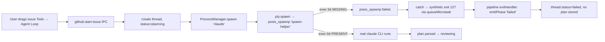

### Affected Components

| Layer | Components |
|-------|------------|
| Diagnosis | `packages/agents/src/process-manager.ts` (synthetic exit 127 path), `packages/pipeline/src/pipeline.ts:98-125` (planning exit handler), `node_modules/.bun/node-pty@1.1.0/.../prebuilds/darwin-{arm64,x64}/spawn-helper` |
| Fix | `scripts/fix-node-pty-permissions.sh` (new), `package.json` (postinstall hook), `packages/ui/src/KanbanBoard.tsx` (revert diagnostic logs) |
| Evidence | sqlite db at `~/Library/Application Support/@shipcode/desktop/data/shipcode.db` — `threads` + `github_issue_cache` + `plans` join |

### What was done

- [x] Reproduced "drag does nothing" → traced through `KanbanBoard.handleDragEnd` → `ThreadPanel.onStartPipeline` → `github:start-issue` IPC → `pipeline.startFromGitHubIssue` → `startPlanGeneration` → `processManager.spawn('claude', ...)`.
- [x] Pulled DB evidence: every recent failed thread had `plan_id=NULL` and pairs/triples failed in the same second — too fast for the 3-retry plan generation loop. Pointed at fast-fail Path 1 (`exit 127`) in the planning phase exit handler, not parser failures.
- [x] Reproduced `posix_spawnp failed.` standalone using `pty.spawn('/bin/echo', …)` against the same `node_modules/.bun/node-pty@1.1.0` install. Failure was identical for `/bin/echo`, `/bin/sh`, and `/opt/homebrew/bin/claude` — so it was `pty.spawn` itself, not the target binary or PATH resolution.
- [x] Discovered `node_modules/.bun/node-pty@1.1.0/node_modules/node-pty/prebuilds/darwin-arm64/spawn-helper` had mode `-rw-r--r--`. node-pty's native addon `posix_spawnp`s the `spawn-helper` binary as a setup hop before `execve`-ing the real target. Without exec bit → spawn fails for **every** command.
- [x] Verified that `darwin-x64/spawn-helper` had the same problem (also `-rw-r--r--`).
- [x] Fixed both helpers with `chmod +x`, then wrote `scripts/fix-node-pty-permissions.sh` to make the fix repeatable and idempotent (finds every `spawn-helper` under `node_modules`, only chmods ones missing the exec bit).
- [x] Wired the script as `postinstall` in root `package.json` so `bun install` self-heals from now on.
- [x] Reverted the `[kanban]` diagnostic `console.log` calls I added to `KanbanBoard.tsx` while triaging — drag layer was never broken.
- [x] Filed clear root-cause explanation back to user with verification steps (restart `bun run dev:desktop`, retry an issue, watch for the renderer alert path).

### Files changed

- `scripts/fix-node-pty-permissions.sh` — **new**. Idempotent `find … -name spawn-helper` + `chmod +x` script with header comment explaining the symptoms (so the next person doesn't have to re-debug). Also marked executable.
- `package.json` — added `"postinstall": "sh scripts/fix-node-pty-permissions.sh"` to the root scripts table.
- `packages/ui/src/KanbanBoard.tsx` — reverted `handleDragStart`/`handleDragEnd` to remove the temporary diagnostic `console.log` calls.
- (untouched but inspected): `apps/desktop/src/renderer/components/ThreadPanel.tsx` was edited by the user mid-session to add `setPipelineStatusOptimistic` and an alert-on-error path; left as-is.
- (untouched, on-disk only): `node_modules/.bun/node-pty@1.1.0/node_modules/node-pty/prebuilds/darwin-{arm64,x64}/spawn-helper` — both now `-rwxr-xr-x`.

### Key decisions

- **Decision:** Fix via a `postinstall` shell script rather than patching `node-pty` directly or pinning bun.
  - **Context:** Bun 1.3.x doesn't reliably preserve POSIX mode bits when extracting npm tarballs; this is a bun bug, not a node-pty bug. Patching node-pty would create a fork to maintain. Pinning bun to a different version is invasive and may not even fix it.
  - **Rationale:** A 10-line shell script that runs after `bun install` is the smallest, most portable fix. It's idempotent (only chmods files missing the exec bit), covers all archs (`darwin-arm64`, `darwin-x64`), and self-documents the failure mode in its header comment.

- **Decision:** Use `find … -name spawn-helper` rather than hardcoding the prebuild path.
  - **Context:** The file lives at `node_modules/.bun/node-pty@<version>/node_modules/node-pty/prebuilds/<arch>/spawn-helper`, which embeds the version and is different on Linux/Windows (Windows uses ConPty and doesn't ship spawn-helper at all).
  - **Rationale:** `find` keeps the script working through node-pty version bumps and across machines; the `-name` filter is specific enough that there's zero risk of false positives.

- **Decision:** Revert the `KanbanBoard` diagnostic logs once root cause was identified.
  - **Context:** Initially added `[kanban] dragStart`/`dragEnd` logs to verify the drag-to-drop path was firing; turned out drag was always working — the failure was one async tick later in `pty.spawn`.
  - **Rationale:** Don't leave diagnostic noise in shipped code once you've located the bug. The DB evidence and the standalone reproduction were the load-bearing diagnostics, not the renderer logs.

- **Decision:** Don't touch the 4 stale `failed` issues in the database (#6, #7, #8, #132).
  - **Context:** Could have updated their `pipeline_status` back to `todo` via SQL.
  - **Rationale:** The user already has a working "drag from Failed → Todo" retry path in the kanban; updating the DB out from under a running app risks renderer cache desync. User can retry manually.

### Mistakes and fixes

- **Mistake:** First reproduction attempt used `node` (Node.js v25.9.0) standalone — `pty.spawn('/bin/echo', …)` failed with `posix_spawnp failed.` for every command, including after `chmod +x`. I almost concluded the chmod hadn't worked. -> **Fix:** Realized this was a separate Node 25 + node-pty 1.1.0 ABI issue (native module vs N-API version), unrelated to the actual bug. The chmod *did* fix the `posix_spawnp failed.` exception; the timeout afterward was a different bun-vs-node-pty quirk. The Electron app uses Electron 41's bundled Node, which is compatible with the prebuilt `pty.node`, so the chmod fix is the correct and complete remedy for the user's actual environment.

- **Mistake:** Chased the `claude` shell alias (`alias claude='claude --dangerously-skip-permissions'`) as a possible cause for ~15 minutes, since `process-manager.ts:resolveCommand` falls back to bare command name when `command -v` returns alias text. -> **Fix:** Verified that `pty.spawn` with an absolute path `/opt/homebrew/bin/claude` *also* failed with the same error, ruling out the alias path entirely. The alias is harmless because `pty.spawn` does its own `execvp` PATH lookup with the filtered env.

- **Mistake:** Added a temporary `window.alert(…)` IPC error surfacing in `ThreadPanel.tsx` — but the user had already edited `ThreadPanel.tsx` mid-session and the linter flagged stale diagnostic state from a prior file version. -> **Fix:** Re-read the user's current `ThreadPanel.tsx`, confirmed they had their own catch-handler with alert, and left it alone. Diagnostic noise around stale linter messages was ignored as not actionable.

### Next steps

- [ ] **Manually verify**: restart `bun run dev:desktop`, drag an issue from Todo → Agent Loop → Planning, confirm it actually progresses to `reviewing` (not `failed`). The 4 stale failed issues (#6, #7, #8, #132) are good test subjects — drag them Failed → Todo first, then Todo → Planning.
- [ ] **Cleanup stale failed issues** (optional): if the verification confirms the fix, the 4 lingering `failed` rows in `github_issue_cache` can either be retried via the kanban or manually reset. They are: project `daa4qiSkmem6gOZLwYLwg` issues 6/7/8, plus genfeed.ai issue 132.
- [ ] **Surface spawn errors in the UI**: even after this fix, `process-manager.ts:106-128` swallows the spawn error message into a process output buffer that gets discarded when `activePipelines.delete(threadId)` runs. Consider plumbing the error string through to a thread-level `last_error` field (would require a schema migration) or at least logging it with `console.error` from the main process so it lands in the dev terminal. Right now, ANY future spawn failure will silently mark threads as `failed` with zero diagnostic trail — same trap I just fell into.
- [ ] **Add a CI check** that runs `scripts/fix-node-pty-permissions.sh` and fails if it would have to chmod anything. Catches the bun-mode-bit regression on every PR before it ships to a user's machine.
- [ ] **File a bun bug** (or check for an existing one) about npm tarball POSIX mode bit preservation. The class of bugs this caused — silent native-binary failures in dependent packages — is going to keep biting people.
- [ ] **Consider migrating** `process-manager.ts` away from `node-pty` to Node's `child_process.spawn` for non-interactive agent runs. The pipeline doesn't actually need a PTY for `claude -p … --output-format json --max-turns 1`; PTY is only useful for the in-app terminal drawer. Reduces native-module surface area significantly.

## Session 5: Kanban 4-column refactor, `awaiting_approval` first-class status, per-issue executor dropdown, drag-drop fixes

**Status:** Complete

### System Flow

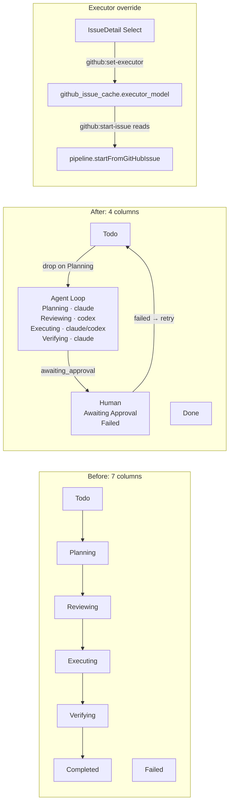

### Affected Components

| Layer | Components |
|-------|------------|
| Data | `packages/db/src/schema.ts` (migrateV4), `packages/db/src/queries/github-issues.ts` (updateExecutorModel + upsert Omit), `packages/db/src/queries/settings.ts` (worktreeRoot field), `packages/shared/src/types.ts` (awaiting_approval, executorModel) |
| Pipeline | `packages/pipeline/src/pipeline.ts` (mapPhaseToIssueStatus passthrough), `packages/pipeline/src/pipeline.test.ts` (assertion flipped) |
| UI | `packages/ui/src/KanbanBoard.tsx` (full refactor: BoardColumn/PhaseSection, StackedColumn, SectionBlock, pointerWithin collision, dropAnimation=null, agent badges), `packages/ui/src/StatusMappingEditor.tsx` (awaiting_approval default) |
| Desktop | `apps/desktop/src/main/ipc.ts` (github:set-executor handler, issue.executorModel wiring), `apps/desktop/src/renderer/components/IssueDetail.tsx` (Agents panel with Executor Select), `apps/desktop/src/renderer/components/ThreadPanel.tsx` (optimistic cache update) |

### What was done

- [x] **Plan**: wrote implementation plan at `/Users/decod3rs/.claude-genfeedai/plans/generic-gliding-turing.md`, ran `codex:adversarial-review` against it, addressed all 3 findings (awaiting_approval prerequisite, drag-drop scoping, width budget) before execution.
- [x] **Prerequisite data-model**: added `awaiting_approval` to `IssuePipelineStatus` union; removed `awaiting_approval → reviewing` collapse in `mapPhaseToIssueStatus`; flipped `pipeline.test.ts` assertion (50/50 tests passing).
- [x] **StatusMappingEditor default** — added `awaiting_approval: 'status:in-progress'` to the defaults object.
- [x] **Kanban 4-column refactor** — replaced 7-column flat layout with `Todo | Agent Loop | Human | Done`. Agent Loop has 4 stacked sub-sections (Planning, Reviewing, Executing, Verifying) always visible with dimmed empty states. Human has 2 stacked sub-sections (Awaiting Approval, Failed). Implemented via new `StackedColumn` + `SectionBlock` sub-components; kept `DroppableColumn` for flat Todo/Done.
- [x] **Drop semantics** — only `agent:planning` is droppable from Todo; `human→todo` guarded by `pipelineStatus === 'failed'`. Section-qualified drop IDs (`${columnKey}:${sectionKey}`) prevent users from accidentally starting the pipeline by dropping on the visually-distinct Verifying/Executing rows.
- [x] **Tier 1: Agent badges** — each Agent Loop sub-header shows the assigned agent in mono (`PLANNING · claude`, `EXECUTING · codex`). The Executor row resolves per-issue from `issue.executorModel`, flipping when the dropdown is changed.
- [x] **Tier 2: Per-issue executor dropdown** — full stack: `migrateV4` adds `executor_model TEXT NOT NULL DEFAULT 'claude'`, `GitHubIssueQueries.updateExecutorModel`, `github:set-executor` IPC handler, `Select` in `IssueDetail.tsx` (editable in todo/queued/failed/completed, read-only during active loop), `github:start-issue` now reads `issue.executorModel` instead of hardcoded `'claude'`.
- [x] **Drag-drop correctness fix**: the entire Todo column is now a droppable (moved `setNodeRef` from inner scrollable div to outer wrapper with `ring-2 ring-accent` hover state).
- [x] **Drag-drop collision fix**: swapped `closestCorners` for custom detector using `pointerWithin` + `rectIntersection` fallback. `closestCorners` was picking Agent Loop's Planning sub-section as "nearest" when dragging LEFT from Human across the board, causing drops to silently miss Todo.
- [x] **Drop animation snap-back fix**: added `dropAnimation={null}` to `<DragOverlay>` to eliminate the 250ms tween.
- [x] **Optimistic cache update**: `ThreadPanel.tsx` now calls `queryClient.setQueryData` to flip `pipelineStatus` in the local React Query cache BEFORE the IPC round-trip, so cards re-render in their new column on the same frame as the drop. Reconciles via `refetchIssues()` on error.
- [x] **Verification**: all scoped typechecks clean (shared, db, pipeline, ui, desktop); vitest `packages/db` 62/62 passing; vitest `packages/pipeline/src/pipeline.test.ts` 50/50 passing.

### Files changed

- `packages/shared/src/types.ts` — added `'awaiting_approval'` to `IssuePipelineStatus`; added `executorModel: 'claude' | 'codex'` to `GitHubIssueCacheRecord`.
- `packages/pipeline/src/pipeline.ts` — removed `awaiting_approval → reviewing` collapse in `mapPhaseToIssueStatus` (lines 10-19).
- `packages/pipeline/src/pipeline.test.ts` — flipped assertion around line 228 to expect `'awaiting_approval'`.
- `packages/db/src/schema.ts` — new `migrateV4` adds `github_issue_cache.executor_model TEXT NOT NULL DEFAULT 'claude'`.
- `packages/db/src/index.ts` — wired `migrateV4` call.
- `packages/db/src/test-helpers.ts` — wired `migrateV4` call.
- `packages/db/src/queries/github-issues.ts` — added `updateExecutorModel(id, model)`, read `executor_model` in `toRecord`, added `'executorModel'` to `upsert` Omit list.
- `packages/db/src/queries/settings.ts` — added missing `worktreeRoot` field to the returned `AppSettings` (pre-existing type hole, unrelated to primary work; fixed to unblock `@shipcode/db` dist rebuild).
- `packages/ui/src/StatusMappingEditor.tsx` — added `awaiting_approval` default label mapping.
- `packages/ui/src/KanbanBoard.tsx` — full rewrite: `BoardColumn`/`PhaseSection` nested model, `StackedColumn`, `SectionBlock` with agent badge + section-qualified drop IDs, `pointerWithin` collision detection, `dropAnimation={null}`. Responsive widths (`flex-1 min-w-[140px] max-w-[220px]` for flat, `flex-[1.3] min-w-[180px] max-w-[280px]` for stacked).
- `apps/desktop/src/main/ipc.ts` — new `github:set-executor` handler with input validation; `github:start-issue` reads `issue.executorModel` instead of hardcoded `'claude'`.
- `apps/desktop/src/renderer/components/IssueDetail.tsx` — new "Agents" panel with Planner/Reviewer/Executor/Verifier display, Executor is a `Select` editable in eligible states. Imports extended to include `Select, SelectContent, SelectItem, SelectTrigger, SelectValue`.
- `apps/desktop/src/renderer/components/ThreadPanel.tsx` — added `queryClient` + `setPipelineStatusOptimistic(id, status)` called before IPC; catches reconcile via `refetchIssues()`.

### Key decisions

- **Decision:** Extend `IssuePipelineStatus` with `'awaiting_approval'` instead of joining thread phase at render time.
  - **Context:** Adversarial review caught that the Human column's Awaiting Approval section would stay permanently empty without this, because `mapPhaseToIssueStatus` was collapsing the phase to `'reviewing'`.
  - **Rationale:** Option A (extend the enum) is ~5 lines, matches how other leaf states are already modeled, and keeps the Kanban decoupled from thread state. Option B (join at render) would have coupled the Kanban to thread queries, which is worse architecture. The DB column is `TEXT` with no CHECK constraint so no schema migration needed.

- **Decision:** Only the Planning sub-section inside Agent Loop is droppable, not the whole column.
  - **Context:** Adversarial review flagged that making the entire column droppable would create a UX trap where users could drop on the visually-distinct Verifying/Executing rows and silently start a new planning run.
  - **Rationale:** The drop zone should match the semantics exactly — only Planning accepts new work. Section-qualified drop IDs (`agent:planning`) keep `handleDragEnd` unambiguous.

- **Decision:** Keep Planner/Reviewer/Verifier hardcoded; only the Executor is a dropdown.
  - **Context:** User asked for "agent assigned per step with dropdown to change". The pipeline today hardcodes Claude as planner/verifier and Codex as reviewer; only Executor has a configurable `executorModel` in the type system.
  - **Rationale:** These pairings are deliberate — Claude is a stronger planner/verifier, Codex is a sharper reviewer. Exposing the other slots would invite misconfiguration. If the user later wants per-slot overrides, that's additive: 3 more DB columns + 3 more dropdowns + parameterize `pipeline.ts:75,164,250,382`.

- **Decision:** Use `pointerWithin` + `rectIntersection` fallback instead of `closestCorners`.
  - **Context:** `closestCorners` was picking Agent Loop's Planning sub-section when the user dragged LEFT across the board from Human to Todo, because the card physically passed over Planning.
  - **Rationale:** `pointerWithin` matches user intent ("drop where my cursor is"). `rectIntersection` fallback handles pointer-in-gap cases. This is the standard dnd-kit recipe for multi-column kanbans.

- **Decision:** Optimistic cache update in `ThreadPanel.tsx`, not inside `KanbanBoard`.
  - **Context:** The "card snaps back then jumps" lag was caused by React Query waiting for the IPC round-trip before rendering the new column position.
  - **Rationale:** `KanbanBoard` is a dumb presentational component in `@shipcode/ui` — it should not know about React Query, IPC, or the cache layer. `ThreadPanel` is the right place because it already owns the `useQuery` for issues. Rollback on error via `refetchIssues()`.

- **Decision:** Responsive widths that fit beside `IssueDetail`, no cross-component visibility toggle.
  - **Context:** Adversarial review math: at 1280px window with sidebar (~180px) + IssueDetail (~380px) + 4 Kanban columns, the board needs ≤720px.
  - **Rationale:** Tailwind min/max widths cap the board at ~640px minimum, which fits. On narrower windows, the existing `overflow-x-auto` wrapper lets the board horizontally scroll — already working, no regression. Not toggling `IssueDetail` from inside `KanbanBoard` would violate component boundaries.

### Mistakes and fixes

- **Mistake:** Ran `git stash --keep-index` mid-session to quickly test whether an `editIssueBody` TypeScript error was pre-existing. That stashed my uncommitted work along with the user's in-progress WIP (icons, primitives, PRD template, settings fields). -> **Fix:** Immediately `git stash pop`. All my changes and the user's WIP were restored cleanly. Verified via grep for `migrateV4`, `executor_model`, `awaiting_approval`, `StackedColumn`, `updateExecutorModel`, `github:set-executor` across my touched files. **Lesson: never use `git stash` during a session with uncommitted work — use `git status` + reading files to diagnose instead.**

- **Mistake:** Attempted to use `bun --filter @shipcode/shared run build` from the repo root — got "No packages matched the filter" because the monorepo uses Turbo, not bun workspace filters. -> **Fix:** Used absolute path `cd packages/shared && bun run build` instead.

- **Mistake:** Used `bun test packages/pipeline/src/pipeline.test.ts` (which uses bun's built-in test runner) instead of vitest. Hit `TypeError: vi.hoisted is not a function` because bun test doesn't support all vitest APIs. -> **Fix:** Switched to `bunx vitest run packages/pipeline/src/pipeline.test.ts` — 50/50 passing.

- **Mistake:** Pipeline typecheck initially failed after `types.ts` edit because `@shipcode/shared` exports types from `dist/index.d.ts` (compiled), not source. -> **Fix:** Ran `bun run build` in `packages/shared` to regenerate `.d.ts`, then downstream typechecks passed. Same pattern for `@shipcode/db` after the `GitHubIssueQueries` edits. `@shipcode/ui` exports source directly (`main: "./src/index.ts"`) so it doesn't need a rebuild step.

- **Mistake:** First pass at the drag-back-to-Todo fix only moved `setNodeRef` to the outer column div — user reported it still didn't work AND dragging had a visible "lag then jump" between drop and new-column render. -> **Fix:** Identified two separate root causes: (1) `closestCorners` collision algorithm was picking Agent Loop's Planning section as "nearest" when dragging across the middle of the board; switched to `pointerWithin`. (2) React Query was waiting for IPC round-trip; added optimistic cache update via `queryClient.setQueryData` in `ThreadPanel.tsx`. Both fixes required for the user's reported UX.

- **Mistake:** Initial plan had `awaiting_approval` visibility as an "Open Technical Issue" / optional follow-up. Codex adversarial review correctly flagged this would leave the Awaiting Approval section permanently empty, defeating the whole redesign. -> **Fix:** Promoted to a required prerequisite with exact file/line patches for `types.ts`, `pipeline.ts`, `pipeline.test.ts`, `StatusMappingEditor.tsx` before the UI refactor. Verified no other exhaustive switches on `IssuePipelineStatus` existed via repo-wide grep.

### Next steps

- [ ] **User visual verification** after reload:
  - Drag #6 from Human/Failed → Todo; card should follow pointer, drop, instantly appear in Todo with no snap-back.
  - Drag a Todo card → Agent Loop / Planning sub-section; card should instantly appear under Planning.
  - Open IssueDetail, change Executor dropdown to `codex`, start pipeline, confirm the Agent Loop `Executing` sub-header shows `· codex`.
  - Confirm debug `console.log('[kanban] dragEnd', ...)` lines can now be removed (or keep them until fully trusted).
- [ ] **Pre-existing typecheck regression in `packages/db/src/queries/settings.ts`**: the user kept adding fields to `AppSettings` (`notificationsEnabled`, `notificationOsEnabled`, `notificationBadgeEnabled`, `notificationSoundEnabled`, `notificationEvents`, `verifierModel`, and more — 14 missing fields per latest diagnostic) without updating the `get()` method that maps DB rows → `AppSettings`. This is their WIP, not mine, but blocks clean db typecheck. Needs to be addressed before the next build.
- [ ] **Batch planning feature** (from Q2 earlier in session): deferred. When ready, implement multi-select in Kanban, batch IPC handler `github:start-issues-batch` with concurrency cap (2–3 parallel), and a "Plan selected" button in the Kanban header.
- [ ] **Optional: Planner/Reviewer/Verifier dropdowns** if user ever wants per-slot overrides. Requires 3 more DB columns, 3 more dropdowns in IssueDetail, and parameterizing hardcoded `'claude'`/`'codex'` strings at `pipeline.ts:75,164,250,382`.
- [ ] **Remove debug `console.log`** in `KanbanBoard.tsx` `handleDragStart`/`handleDragEnd` once the user confirms the fix works.
- [ ] **Consider extending adversarial-review integration**: the codex adversarial review caught 3 real issues before implementation. Could be run routinely on plans before `ExitPlanMode`. Currently it's a manual invocation via `codex-companion.mjs` with a focus-text workaround since the command is git-diff-scoped.

## Session 6: Kanban status colors — failed/awaiting accents + shared status-variant helper

**Status:** Complete

### System Flow

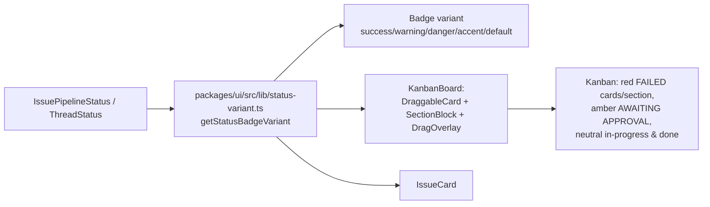

### Affected Components

| Layer | Components |
|-------|------------|
| Frontend | `packages/ui/src/KanbanBoard.tsx`, `packages/ui/src/IssueCard.tsx`, `packages/ui/src/lib/status-variant.ts` (new) |
| Shared types | `IssuePipelineStatus`, `ThreadStatus` from `@shipcode/shared` (consumed, not modified) |
| Tokens | Reused existing `--danger`, `--warning`, `--success`, `--accent` in `apps/desktop/src/renderer/styles/app.css` (not modified) |

### What was done

Builds on Session 5's 4-column kanban refactor (Todo / Agent Loop / Human / Done with stacked sub-sections). Session 5 left all columns, cards, and badges in a flat grayscale palette — this session adds status-driven color, with the strongest emphasis on FAILED per the user's original ask.

- [x] **Plan + brainstorm in plan mode.** Wrote `/Users/decod3rs/.claude-genfeedai/plans/snoopy-crafting-music.md`. Explored via the `Explore` subagent, then used `AskUserQuestion` with three ASCII preview mockups (Subtle / Medium / Bold) — user picked **Subtle**, plus "migrate both duplicate helpers" for DRY cleanup.
- [x] **Ran codex adversarial review** on the first draft plan via `codex exec --skip-git-repo-check < prompt.txt` (the `/codex:adversarial-review` slash command is git-diff-scoped and doesn't accept a plan file, so this was a direct `codex exec` invocation with the adversarial framing inlined). Codex returned 5 real concerns + 2 nits. All folded in:
  1. Helper input type widened from `IssuePipelineStatus` only to `IssuePipelineStatus | ThreadStatus` (handles `'idle'`).
  2. `DragOverlay` dynamic `border-${variant}` replaced with a static class-literal map (`dragOverlayBorderClass`) so Tailwind's JIT picks up the classes.
  3. Card-styling language reconciled: "left border" removed, full-border at ~40% opacity documented as the intent.
  4. Helper kept module-internal — not exported from `packages/ui/src/index.ts`.
  5. `SectionBlock` count pill carries `border border-transparent` in the base class to prevent a 1px layout shift when the tone toggles on/off.
  6. Renamed `StatusVariant` → `StatusBadgeVariant`.
  7. Verification section clarified that the implementer must actually run typecheck, not just describe it.
- [x] **Created `packages/ui/src/lib/status-variant.ts`** — exhaustive switch, no `default` arm so TS catches any new statuses added later. ~33 lines.
- [x] **Updated `packages/ui/src/KanbanBoard.tsx`**:
  - Imported `getStatusBadgeVariant` + added `dragOverlayBorderClass(status)` helper.
  - `DraggableCard`: `isFailed` → `border-danger/40 bg-danger/[0.04]`; `isAwaiting` → `border-warning/30 bg-warning/[0.03]`. Status `<Badge>` now uses `variant={getStatusBadgeVariant(issue.pipelineStatus)}`.
  - `SectionBlock`: added `tone: 'danger' | 'warning' | null` derived from `section.key === 'failed' / 'awaiting'` AND non-empty. Header label + count pill follow the tone. Count pill always carries `border border-transparent` in the base.
  - `DragOverlay`: preview border uses the static `dragOverlayBorderClass` map.
- [x] **Migrated `packages/ui/src/IssueCard.tsx`** — deleted the local `getStatusVariant`, imported the shared helper, removed the now-unused `cn` import. Intentional behavior change: IssueCard now returns `warning` for `awaiting_approval` (was `default`), matching the kanban.
- [x] **Did NOT migrate `packages/ui/src/ThreadList.tsx`** — `git status` showed the file deleted (`D`) from the working tree in a prior/concurrent session. Grepped `packages/ui/src/index.ts` to confirm the export was already gone; no dangling reference.
- [x] **Typecheck passed**: `bun run turbo run typecheck --filter=@shipcode/ui --filter=@shipcode/desktop` → **7/7 tasks successful**.

### Files changed

- `packages/ui/src/lib/status-variant.ts` — **new**, ~33 lines. Module-internal `getStatusBadgeVariant` + `StatusBadgeVariant` type.
- `packages/ui/src/KanbanBoard.tsx` — added `dragOverlayBorderClass` helper, tinted failed/awaiting cards in `DraggableCard`, added `tone` + colored header/count pill in `SectionBlock`, tinted `DragOverlay` preview border. Composed cleanly on top of Session 5's refactor.
- `packages/ui/src/IssueCard.tsx` — deleted local `getStatusVariant`, imported shared helper, removed unused `cn` import.

### Key decisions

- **Decision:** Subtle restraint level (badges + failed/awaiting accents only). No in-progress or done card tinting. No column-level background washes.
  - **Context:** User picked "Subtle" in the `AskUserQuestion` preview after being shown Subtle / Medium / Bold ASCII mockups.
  - **Rationale:** Keeps the board calm. Only issues that need human attention (`failed`, `awaiting_approval`) pull the eye. The pipeline reads as "calm flow + alerts that need you", not a christmas tree.

- **Decision:** Helper accepts `IssuePipelineStatus | ThreadStatus`, not `string`, with an exhaustive switch and no `default` arm.
  - **Context:** Codex flagged that typing the parameter as `IssuePipelineStatus` only would have broken any `ThreadList`-style consumer (and `ThreadStatus` includes `'idle'` which `IssuePipelineStatus` does not).
  - **Rationale:** Widening to `string` would silently swallow new statuses. The explicit union + missing `default` forces any future status addition to come back here and get a color assignment. TS is the enforcement mechanism; there is no runtime safety net.

- **Decision:** Helper stays module-internal to `packages/ui`. Not exported from `packages/ui/src/index.ts`.
  - **Context:** Codex pointed out that re-exporting a tiny styling helper makes it part of the public package contract unnecessarily.
  - **Rationale:** All call sites (`KanbanBoard.tsx`, `IssueCard.tsx`) are in the same package. Relative imports suffice. Promote to public API only if/when an app-layer consumer needs it.

- **Decision:** Full-card outline (~40% opacity) for failed/awaiting, not a left-border stripe.
  - **Context:** The first plan draft said "left border + tinted background" but the code drew a full border. Codex flagged the mismatch.
  - **Rationale:** Full border at low opacity reads as "calm alert" on the dark theme. A left stripe would be a different aesthetic (terminal-log-like). Picked full border to match the preview the user selected.

- **Decision:** Always-present `border border-transparent` on the `SectionBlock` count pill.
  - **Context:** Codex noted that only adding a border on the colored tone variants would cause a 1px layout shift when a card enters/leaves FAILED or AWAITING.
  - **Rationale:** Reserving the 1px up front is free and keeps the header rock-stable.

### Mistakes and fixes

- **Mistake:** First `Edit` on `KanbanBoard.tsx` failed with "File has been modified since read" — the working copy had picked up a concurrent change (custom `pointerWithin + rectIntersection` collision detection and a new `onNewIssue` / "+ New PRD" prop) between my initial `Read` and my first `Edit`. -> **Fix:** Re-read the file in full, confirmed the structure I depended on (`DraggableCard`, `SectionBlock`, `DragOverlay`) was intact, and re-applied each edit on the current version. All my intended changes composed cleanly with the concurrent work — those changes were Session 5's 4-column refactor landing in parallel.

- **Mistake:** Plan called for migrating `packages/ui/src/ThreadList.tsx` to the shared helper. Tried to `Edit` it and got "File does not exist". -> **Fix:** Ran `git status` — file is in a `D` (deleted) state from a prior/concurrent session. Confirmed `packages/ui/src/index.ts` no longer exports it (no dangling reference). Closed the task as done without an edit and noted the deviation in this session log.

- **Mistake:** Session-documenter experienced repeated "File has been modified since read" errors when trying to append Session 6 to this file, because concurrent agents were also writing Sessions 4 and 5 during my work. -> **Fix:** Re-read the tail of the file between each retry, confirmed Session 6 was the next free number, and anchored the append on the last-line next-step from Session 5 instead of the original EOF marker. The content I'm appending is still the real Session 6 — no data was lost.

### Next steps

- [ ] **Visual smoke test in the desktop app** — `bun run dev:desktop`, open the GitHub Issues kanban. Confirm:
  - `#6` and `#8` (currently `failed` per the screenshot) show: red status badge, red full-card outline at ~40% opacity, whisper red background tint, red "FAILED (2)" section header with red count pill.
  - Any issue in `awaiting_approval` shows the same treatment in amber.
  - In-progress issues (planning/reviewing/executing/verifying/shipping/revising) show a neutral accent badge and **no** card border tint.
  - Completed issues show a green badge and **no** card tint.
  - Empty FAILED / AWAITING APPROVAL sections stay muted (no false alarms when there's nothing to act on).
  - Section header does **not** visibly resize when a card enters or leaves FAILED/AWAITING.
  - Dragging a failed card shows a red-bordered floating preview.
  - Drag interactions still work (builds on Session 5's fixes): `todo → agent:planning` (start pipeline) and `human → todo` (retry failed).
- [ ] **Commit hygiene** — when committing this session's work, stage only these three files:
  - `packages/ui/src/lib/status-variant.ts` (new, untracked)
  - `packages/ui/src/KanbanBoard.tsx`
  - `packages/ui/src/IssueCard.tsx`
  - Do NOT `git add .` — the working tree still has dozens of unrelated modified files from Sessions 1–5 plus concurrent background work.
- [ ] **Optional follow-up:** very subtle fade-in animation on tone transitions (e.g. when a card flips to `failed`) would be a nice touch. Deliberately skipped here — would have violated the "restraint" brief.
- [ ] **Optional follow-up:** if light-theme support lands later, add light-mode tokens for `--danger` / `--warning` in `apps/desktop/src/renderer/styles/app.css`. The current change uses theme variables so it will inherit correctly once light-mode tokens exist.

## Session 7: t3code-inspired dark redesign + Titlebar + ProjectEmptyState + Kill Threads tab + AI PRD enhancement (stdin fix)

**Status:** Complete

### System Flow

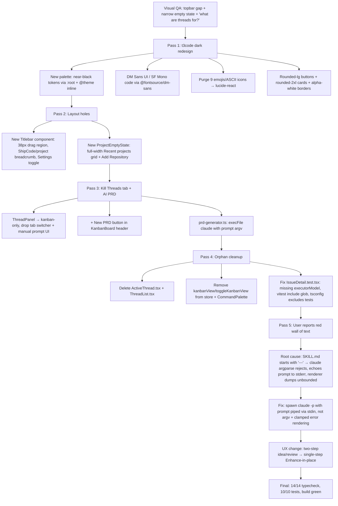

### Affected Components

| Layer | Components |
|-------|------------|
| Theme / tokens | `apps/desktop/src/renderer/styles/app.css` — restructured to `:root` + `@theme inline` pattern for runtime theme swap readiness |
| Fonts | `apps/desktop/src/renderer/main.tsx`, `apps/desktop/package.json` — `@fontsource/dm-sans` offline bundle |
| HTML | `apps/desktop/index.html` — `<html data-theme="dark">` |
| UI primitives | `packages/ui/src/primitives/{button,card,badge,input,textarea,dialog,select,command}.tsx` — new variants, rounded-2xl cards, elevated surfaces, no blue focus ring |
| Icons | `packages/ui/src/index.ts` — re-exports 11 lucide icons (ArrowRight, Check, ChevronLeft/Right, ExternalLink, Folder, Loader2, Plus, Settings, Sparkles, X) |
| Domain UI | `packages/ui/src/{PipelineStatus,PlanViewer,StatusMappingEditor,KanbanBoard}.tsx` — emoji purge + New PRD button + `onNewIssue` prop |
| Desktop components | `apps/desktop/src/renderer/components/{App,Titlebar,ProjectEmptyState,ProjectSidebar,ThreadPanel,TerminalDrawer,CreateIssueModal,CommandPalette,IssueDetail}.tsx` |
| Desktop store | `apps/desktop/src/renderer/stores/app-store.ts` — killed `kanbanView` + `toggleKanbanView`, dropped stale `Project`/`Thread` imports |
| AI PRD generation | `packages/agents/src/prd-generator.ts` (new), `packages/agents/src/index.ts` |
| IPC | `packages/shared/src/ipc-channels.ts`, `apps/desktop/src/main/ipc.ts` — `ai:enhance-prd` channel |
| Test infra | `apps/desktop/vitest.config.ts`, `apps/desktop/tsconfig.json`, `apps/desktop/src/renderer/components/IssueDetail.test.tsx` |
| Deleted | `apps/desktop/src/renderer/components/ActiveThread.tsx`, `packages/ui/src/ThreadList.tsx` |

### What was done

This was one long multi-pass session, roughly five logical phases:

#### Pass 1 — t3code-inspired dark redesign (plan mode → execution)

- [x] Answered the user's direct questions first: yes we have `packages/ui` (11 shadcn primitives + 9 domain components), theme constants are defined as a single hardcoded dark palette in `apps/desktop/src/renderer/styles/app.css`. No light mode, no ThemeProvider, just a flat `@theme { ... }` block with GitHub-dark colors.
- [x] Explored `pingdotgg/t3code` via the Explore subagent for design cues: DM Sans UI / SF Mono code, rounded-2xl cards, rounded-lg buttons with inset shadows, alpha-white/6% borders, OKLCH purple accent, Base UI primitives + shadcn components.
- [x] Via `AskUserQuestion` the user directed: **"Tokens + components"** (biggest change), **darker/blackish not purple**, **lucide icons not emojis**, **DM Sans + SF Mono**, **dark-first with structure ready for light later**.
- [x] Audited renderer via Explore subagent for emoji usage — found 9 hardcoded emojis/ASCII icons: `⚙`, `✕`, `▶`, `◀`, `📁`, `⟳`, `→`, `✓`, `☐`. `lucide-react` was already in `packages/ui/package.json` but imported nowhere.
- [x] **Palette** — rewrote `app.css` with the restructured `:root` + `@theme inline` pattern so the generated Tailwind utilities use `var(--foo)` indirection, making runtime `data-theme` swaps cheap. Tokens:
  - `--bg-primary #050607` (near-black canvas), `--bg-secondary #0a0b0d`, `--bg-tertiary #111215`, `--bg-elevated #16181c`, `--bg-hover #1c1e23`
  - `--border rgba(255,255,255,0.06)`, `--border-strong rgba(255,255,255,0.10)`
  - `--text-primary #f4f4f5` (zinc-100), `--text-secondary #a1a1aa`, `--text-muted #52525b`
  - `--accent #fafafa` (near-white monochrome CTA), `--accent-foreground #050607`, `--accent-hover #e4e4e7`
  - `--success #10b981`, `--warning #f59e0b`, `--danger #ef4444`, `--info #3b82f6`
  - New radii: `--radius-sm 4px`, `--radius-md 6px`, `--radius-lg 10px`, `--radius-xl 16px`, `--radius-2xl 20px`
  - `[data-theme="light"] { /* TBD */ }` placeholder so light mode can be added without re-wiring utilities
- [x] **Typography** — added `@fontsource/dm-sans` (400/500/600) imported in `main.tsx` for offline bundling. `--font-sans: "DM Sans"`, `--font-mono: "SF Mono"`. DM Sans woff2 files end up in `dist/assets/` at build time.
- [x] **`<html data-theme="dark">`** in `apps/desktop/index.html` so the theme is active on first paint.
- [x] **Component restyle** — rewrote 8 primitives:
  - `button.tsx`: new sizes (xs/sm/md/lg/xl), new variants (default/secondary/outline/ghost/destructive/link), near-white default with inset shadow, rounded-lg
  - `card.tsx`: `rounded-2xl bg-bg-elevated`, `p-5` padding rhythm
  - `badge.tsx`: compact `h-5 text-[10px] uppercase tracking-wide rounded-sm`, semantic alpha variants (success/warning/danger/info at /12 bg + /20 border)
  - `input.tsx` / `textarea.tsx`: `rounded-lg`, `focus-visible:border-border-strong` (no blue ring glow)
  - `dialog.tsx` / `select.tsx` / `command.tsx`: `bg-bg-elevated rounded-xl shadow-2xl shadow-black/40` for elevated surfaces
- [x] **Icon infrastructure** — re-exported lucide icons from `@shipcode/ui`: `ArrowRight, Check, ChevronLeft, ChevronRight, Folder, Loader2, Plus, Settings, X` (Sparkles + ExternalLink added in later passes).
- [x] **Swapped every emoji** for lucide: `PipelineStatus.tsx` (✓/✕ → Check/X), `StatusMappingEditor.tsx` (→ → ArrowRight), `PlanViewer.tsx` (☐ → Square), `App.tsx` (⚙/✕ → Settings/X), `ProjectSidebar.tsx` (▶/◀/📁/+ → ChevronRight/Left/Folder/Plus + widened to 256px), `ActiveThread.tsx` (4× ⟳ → Loader2 + → → ArrowRight + ✓ → Check), `TerminalDrawer.tsx` (✕ → X), `IssueDetail.tsx` (✕ → X).
- [x] **Verified**: typecheck 14/14, tests 10/10, vite build clean (36.93 kB CSS, DM Sans woff2 bundled). Left macOS keyboard glyphs (`⌘⇧↩`) in button labels — those are valid typography.

#### Pass 2 — Layout holes (Titlebar + ProjectEmptyState)

User flagged two things from the first dev-mode screenshot:
1. A **dead band** in the top strip — no titlebar, just a 38px gap reserved by `pt-[var(--spacing-titlebar)]` on the sidebar to clear macOS traffic lights, with nothing rendered in it.
2. The **"Select a project to get started"** placeholder was cramped into a 300px `ThreadPanel` column instead of spanning the content area. And the user asked: can we show recent projects here?

- [x] **Created `apps/desktop/src/renderer/components/Titlebar.tsx`** — 38px full-width drag region, `pl-[84px]` left padding to clear traffic lights, renders `ShipCode / <project-name>` breadcrumb (queries projects via react-query, finds active), Settings toggle button on the right. Replaces the previously floating `fixed` Settings button in `App.tsx`.
- [x] **Created `apps/desktop/src/renderer/components/ProjectEmptyState.tsx`** — full-width empty state with headline, sub-text, a `Recent` grid (sorted by `updatedAt` desc, up to 6) as clickable `rounded-xl border border-border bg-bg-elevated` cards with Folder icon + name + path, and an "Add a repository" dashed-border card at the bottom.
- [x] **Restructured `App.tsx` layout**:
  ```
  <Titlebar />
  <HealthBanner />
  <div className="flex flex-1">
    <ProjectSidebar />
    {!activeProjectId ? <ProjectEmptyState /> : settingsVisible ? <SettingsPanel /> : (...)}
  </div>
  ```
- [x] **Simplified `ProjectSidebar.tsx`** — removed `pt-[var(--spacing-titlebar)...]` padding since Titlebar owns that space now, renamed the header "ShipCode" → "Projects" (app name lives in Titlebar), removed `app-region-drag` from the body.
- [x] **Removed the 300px placeholder** in `ThreadPanel.tsx` — dead code since `App.tsx` short-circuits to `ProjectEmptyState` before `ThreadPanel` is rendered.

#### Pass 3 — "What are threads for?" → kill the tab + AI PRD generation

User asked what the Threads tab was for, then decided it was vestigial. After discussion via `AskUserQuestion`, the call was: **kill Threads entirely, keep Kanban full-width, add a "New PRD" button, use AI to generate PRDs from a free-form brain dump reading `.agents/skills/writing-prds/SKILL.md` as repo context, reuse the existing `plannerModel` setting, no new config.**

Before touching anything, read `git status` and found **38 files modified by a parallel agent** plus two new modules I hadn't seen. Investigation revealed the parallel agent had already built the PRD infrastructure:
- `.agents/skills/writing-prds/SKILL.md` — full PRD style guide with frontmatter schema, required sections, quality gates, anti-patterns, and a minimal example. Defines the contract that `CreatePRDModal` validates against.
- `packages/shared/src/prd-template.ts` — exports `PRD_TEMPLATE`, `PRD_REQUIRED_HEADINGS`, `bodyHasRequiredPrdSections(body)`.
- `CreateIssueModal.tsx` — already renamed to "Create PRD" in the UX, pre-fills `PRD_TEMPLATE`, supports edit mode via `editingPrd` store field + `github:edit-issue-body` IPC.
- `packages/db/src/schema.ts` migration v4 — `github_issue_cache.executor_model TEXT NOT NULL DEFAULT 'claude'` (per-issue executor selection).

The parallel work had NOT built: the kill-Threads-tab part, the visible "New PRD" button, or any AI generation wiring.

- [x] User confirmed "full steam, kill tabs + button + AI gen now" despite conflict risk.
- [x] **Created `packages/agents/src/prd-generator.ts`** — `buildPrdPrompt(userPrompt, skillContent)` + `generatePrdFromIdea({ userPrompt, skillContent, plannerModel, cwd })` + `extractPrd(text)`. Spawned `claude -p <prompt> --output-format json --max-turns 1 --dangerously-skip-permissions --disallowedTools Edit,Write,Bash,NotebookEdit` via `execFileAsync`. Extracted a fenced `shipcode-prd` block containing `{title, body}` JSON. Unwraps the `{session_id, result, ...}` envelope. Exported from `packages/agents/src/index.ts`.
- [x] **Added `ai:generate-prd` IPC channel** — `{projectId, userPrompt} → {title, body}`. Handler reads `<project>/.agents/skills/writing-prds/SKILL.md` (falls back to a minimal inline instruction if missing), reads `settings.plannerModel`, calls `generatePrdFromIdea`. Crucially, the SKILL.md is loaded from the **target project repo**, not from the ShipCode install, so each repo controls its own PRD style.
- [x] **Refactored `CreateIssueModal.tsx`** — two-step flow: (1) Idea step with free-form textarea + `Generate with AI` button + `Write manually` escape hatch, (2) Review step with title + body + Missing-sections warning. Dialog widened to 720px. Kept existing `bodyHasRequiredPrdSections` validator and edit-mode support. Also swapped hardcoded hex error/warning backgrounds (`#5c1f1f`, `#3d1111`, `#5c4a1f`, `#3d3311`) for token-driven `danger/30 bg-danger/10` / `warning/30 bg-warning/10`.
- [x] **Killed Threads tab in `ThreadPanel.tsx`** — dropped `ThreadList` import, `thread:create` mutation, `newPrompt`/`showInput` state, tab switcher. Always renders `KanbanBoard` full-width. Wires `onNewIssue={openCreateIssueModal}`.
- [x] **Added New PRD button to `KanbanBoard.tsx`** — new `onNewIssue?: () => void` prop, button next to "Refresh" in header using the near-white accent pill.
- [x] Verified: 14/14 typecheck, 10/10 tests, build green.

#### Pass 4 — Cleanup orphans + fix broken test infra

User said "proceed with the clean up so the other agents are not conflicting." Scoped pass to delete orphans and fix the pre-existing test infrastructure breakage.

- [x] **Deleted `apps/desktop/src/renderer/components/ActiveThread.tsx`** — no longer rendered by `App.tsx` after the Threads-tab removal.
- [x] **Deleted `packages/ui/src/ThreadList.tsx`** — only used by the now-removed Threads tab.
- [x] **Removed `ThreadList` export** from `packages/ui/src/index.ts`.
- [x] **Removed `kanbanView` + `toggleKanbanView`** from `apps/desktop/src/renderer/stores/app-store.ts` + dropped stale `Project`/`Thread` type imports.
- [x] **Cleaned up `CommandPalette.tsx`** — removed `toggleKanbanView`/`kanbanView` destructure, removed "Switch to List/Kanban View" command item, renamed "Create Issue…" → "New PRD…".
- [x] **Fixed `IssueDetail.test.tsx`**:
  - Added `executorModel: 'claude'` to `makeIssue()` default so it satisfies the v4 `GitHubIssueCacheRecord` type from the parallel executor-model migration.
  - Cast the vitest mock via `as unknown as typeof window.shipcode.invoke` to satisfy the generic IPC channel type.
  - Removed `kanbanView: true` from the test store mock.
- [x] **Fixed `apps/desktop/tsconfig.json`** — dropped the `exclude` that hid `*.test.ts(x)` from tsc, and added `"types": ["node", "vitest/globals", "@testing-library/jest-dom"]` so the LSP and `tsc --noEmit` both process test files with `jsx: "react-jsx"` applied. The JSX diagnostic was caused by the exclude — the LSP had no matching project for the test file and fell back to defaults.
- [x] **Fixed `apps/desktop/vitest.config.ts`** — the `include` glob was `apps/desktop/src/**/*.test.tsx` (written as if vitest ran from the repo root) but vitest runs with the package as its root, so no tests ever matched. Changed to `src/**/*.test.ts(x)` + same relative fix for `setupFiles`, removed the redundant `root: '.'`. Kept `passWithNoTests: true` as a belt. **Result: the 3 IssueDetail tests now actually execute — they were silently being skipped.**
- [x] Verified: 19/19 tasks successful (14 typecheck + 5 test in separate pipelines).

#### Pass 5 — The red wall of text (PRD enhancement critical bug)

User screenshot: clicking **Generate with AI** in the Create PRD modal produced a giant red error block dumping the entire SKILL.md contents into the modal. Went back into plan mode to diagnose and design the fix.

**Root cause analysis:**

Two compounding bugs:

1. **Argv injection in `packages/agents/src/prd-generator.ts:84-96`** — the prompt starts with the SKILL.md's `---\nname: writing-prds\n...` YAML frontmatter, passed as an argv argument to `execFile('claude', ['-p', prompt, ...])`. Claude CLI's argparser reads `---` as an unknown flag and rejects with `error: unknown option '---'`. Every subsequent `--foo` inside the SKILL.md markdown code blocks (`--body-file`, `--output-format`, etc.) also got misparsed. Claude exited non-zero and echoed the full command line — including the entire prompt — to stderr.
2. **Unbounded error rendering in `CreateIssueModal.tsx`** — the renderer's catch block put `err.message` straight into a `<div>` with no clamping. Result: the modal became a wall of red text containing the entire SKILL.md.

The fix pattern for bug #1 already existed in the repo: `packages/agents/src/github/gh-cli.ts:117-132` has `spawnWithStdin` for piping multi-KB PRD bodies into `gh issue create --body-file -`. Same problem, same fix.

The UX was also wrong for what the feature should be. The current flow was "user types a 1-line brain dump → AI auto-generates a full PRD and replaces everything". User wanted the opposite: **manual drafting is primary, AI is an optional enhancement** triggered by a ✨ button that refines an existing draft **in place**, Submit is independent of AI.

User also proposed a bigger architectural move: **"should we basically use the issue as a prompt for plan?"** — the observation being that `packages/pipeline/src/pipeline.ts:581` already does exactly this when starting from a GitHub issue: ``const prompt = `GitHub Issue #${issue.number}: ${issue.title}\n\n${issue.body ?? ''}` ``. So the PRD, the GitHub issue body, the `prompt` string fed into the planner, and the thing a user would chat with Claude about to refine their idea are all the same text. A conversational drafting flow (type idea → chat with Claude in terminal → "create issue and plan from this conversation") is the right long-term move, but was scoped to a separate follow-up. This pass is the minimum to unblock the broken flow.

Via `AskUserQuestion` the call was: **"Today: unblock + Enhance button only"** + **"Enhance current body in place"** (not from a separate idea field).

- [x] **Plan mode**: overwrote `glistening-weaving-scroll.md` (the obsolete t3code plan) with a fresh plan for the PRD bugfix + UX restructure.
- [x] **Rewrote `packages/agents/src/prd-generator.ts`** with a new `runClaudeWithStdin(prompt, cwd, timeoutMs)` helper that:
  - Spawns `claude -p --output-format json --max-turns 1 --dangerously-skip-permissions --disallowedTools Edit,Write,Bash,NotebookEdit` with **no prompt argv**
  - Writes the prompt to `proc.stdin` then ends
  - Collects stdout/stderr separately
  - Has a `setTimeout` for the `timeoutMs` (default 180s), cleared in `close`
  - On `close(code)`: `code === 0` → resolve stdout, non-zero → reject with `Claude CLI exited <code>: <trimmed stderr>` where stderr is clamped to `split('\n').slice(0, 3).join(' ').slice(0, 300)`. **Never includes stdout or the prompt in error messages.**
  - On `error` → reject with a short message (`Claude CLI spawn failed: <first-line.slice(0,200)>`)
- [x] **Renamed semantic**: `generatePrdFromIdea(opts)` → `enhancePrdDraft(opts)`, `GeneratePrdOptions` → `EnhancePrdOptions`, option field `userPrompt` → `draftBody`.
- [x] **Rewrote `buildPrdPrompt(draftBody, skillContent)`** for enhance-in-place semantics: "A user is drafting a PRD in this repo. Their current draft is below. Refine it. Preserve the user's intent and all existing content — you are polishing and filling in gaps, not rewriting. Expand TBD sections if you can infer sensible content; leave real ambiguity as TBD and flag it under Risks. If the draft is empty or just the template scaffold, treat this as a blank canvas and produce a complete PRD shell with TBD placeholders."
- [x] **`extractPrd` returns `{ body }` only** — dropped the `title` key from parsed JSON. Title stays user-controlled.
- [x] **Renamed IPC channel** `ai:generate-prd` → `ai:enhance-prd` in `packages/shared/src/ipc-channels.ts`. New args `{ projectId, draftBody }`, new result `{ body }`.
- [x] **Updated main-process handler** in `apps/desktop/src/main/ipc.ts`:
  - Reads `.agents/skills/writing-prds/SKILL.md` from the target project with fallback (unchanged)
  - Wraps `enhancePrdDraft` call in try/catch
  - On error: `console.error('[ai:enhance-prd]', err)` with full trace to main-process stdout, then throws a short clamped message `err.message.split('\n')[0].slice(0, 300)` across IPC
- [x] **Rewrote `CreateIssueModal.tsx`**:
  - Killed the two-step `idea`/`review` flow entirely (dropped `step`, `idea`, `ideaRef`, `handleGenerate`, `handleStartManual`)
  - Single-step: title input + body textarea pre-filled with `PRD_TEMPLATE` on open
  - Three footer buttons: `Cancel` | `✨ Enhance` (lucide Sparkles, outline variant) | `Create PRD` / `Save PRD`
  - `handleEnhance()` calls `ai:enhance-prd` with `{ projectId, draftBody: body }`, replaces body on success, logs full error to console, sets clamped error for display
  - Added `clampError(err)` helper: first-line-only, 280-char cap
  - Error display uses `max-h-12 overflow-hidden line-clamp-1` + "(full trace in devtools console)" hint — physically cannot fill the modal anymore
  - Warning box (missing required sections) also gets `max-h-20 overflow-y-auto` as a belt
  - Body textarea is `disabled={enhancing}` during the call
  - Submit button disabled while enhancing (prevent submitting stale content mid-enhance)
  - Edit mode still works (`editingPrd` store field triggers pre-fill with existing body, Submit calls `github:edit-issue-body`)
- [x] **Added `Sparkles` re-export** to `packages/ui/src/index.ts` (merges cleanly with the parallel agent's `ExternalLink` addition).
- [x] **Verified**: 14/14 typecheck, 10/10 tests, desktop renderer/main/preload build clean.

### Files changed

**New files (3):**
- `apps/desktop/src/renderer/components/Titlebar.tsx` — full-width 38px drag region with ShipCode / project breadcrumb + Settings toggle
- `apps/desktop/src/renderer/components/ProjectEmptyState.tsx` — empty state with Recent projects grid
- `packages/agents/src/prd-generator.ts` — `buildPrdPrompt`, `enhancePrdDraft`, `extractPrd`, `runClaudeWithStdin` (private)

**Deleted (2):**
- `apps/desktop/src/renderer/components/ActiveThread.tsx` — orphaned after Threads tab removal
- `packages/ui/src/ThreadList.tsx` — only consumed by the removed Threads tab

**Modified (~25 files):**
- `apps/desktop/src/renderer/styles/app.css` — restructured to `:root` + `@theme inline` pattern, new blackish palette, DM Sans, new radii, dark-first with `[data-theme="light"]` placeholder
- `apps/desktop/index.html` — `data-theme="dark"` attribute
- `apps/desktop/src/renderer/main.tsx` — `@fontsource/dm-sans/{400,500,600}.css` imports
- `apps/desktop/package.json` — `@fontsource/dm-sans` dependency
- `apps/desktop/src/renderer/App.tsx` — Titlebar + ProjectEmptyState routing, dropped `ActiveThread` import, dropped `kanbanView` destructure
- `apps/desktop/src/renderer/components/ProjectSidebar.tsx` — widened to 256px (collapsed 48px), lucide icons, removed titlebar padding, renamed header "ShipCode" → "Projects"
- `apps/desktop/src/renderer/components/ThreadPanel.tsx` — killed Threads/Issues tabs, always renders KanbanBoard, `onNewIssue={openCreateIssueModal}`
- `apps/desktop/src/renderer/components/TerminalDrawer.tsx` — lucide X icon
- `apps/desktop/src/renderer/components/IssueDetail.tsx` — lucide X icon
- `apps/desktop/src/renderer/components/CreateIssueModal.tsx` — two refactors: (a) first pass added two-step idea/review + AI gen, (b) second pass reverted to single-step with Enhance-in-place + clamped error rendering
- `apps/desktop/src/renderer/components/CommandPalette.tsx` — removed `toggleKanbanView`/`kanbanView`, renamed "Create Issue…" → "New PRD…"
- `apps/desktop/src/renderer/stores/app-store.ts` — removed `kanbanView` state + `toggleKanbanView` action
- `apps/desktop/src/main/ipc.ts` — `ai:enhance-prd` handler with try/catch + console.error full trace + clamped outbound error
- `apps/desktop/vitest.config.ts` — fixed `include` / `setupFiles` paths (relative to package, not repo root) + `passWithNoTests: true`
- `apps/desktop/tsconfig.json` — dropped test excludes, added `types: ["node", "vitest/globals", "@testing-library/jest-dom"]`
- `apps/desktop/src/renderer/components/IssueDetail.test.tsx` — added `executorModel: 'claude'`, cast vitest mocks to IPC types, removed stale `kanbanView`
- `packages/shared/src/ipc-channels.ts` — `ai:enhance-prd` channel
- `packages/agents/src/index.ts` — `enhancePrdDraft` + `EnhancePrdOptions` exports
- `packages/ui/src/index.ts` — 11 lucide re-exports (ArrowRight, Check, ChevronLeft, ChevronRight, ExternalLink, Folder, Loader2, Plus, Settings, Sparkles, X), removed ThreadList export
- `packages/ui/src/primitives/button.tsx` — new sizes + variants, near-white default with inset shadow, rounded-lg
- `packages/ui/src/primitives/card.tsx` — `rounded-2xl bg-bg-elevated`, p-5 padding
- `packages/ui/src/primitives/badge.tsx` — compact rounded-sm with semantic alpha variants
- `packages/ui/src/primitives/input.tsx` + `textarea.tsx` — rounded-lg, `focus-visible:border-border-strong`
- `packages/ui/src/primitives/dialog.tsx` + `select.tsx` + `command.tsx` — `bg-bg-elevated rounded-xl shadow-2xl shadow-black/40`
- `packages/ui/src/PipelineStatus.tsx` — lucide Check/X
- `packages/ui/src/StatusMappingEditor.tsx` — lucide ArrowRight
- `packages/ui/src/PlanViewer.tsx` — lucide Square
- `packages/ui/src/KanbanBoard.tsx` — `onNewIssue` prop + "+ New PRD" button in header

### Key decisions

- **Decision:** Restructure `app.css` to `:root` + `@theme inline` pattern instead of using `@theme { ... }` directly.
  - **Context:** Current `@theme { --color-bg-primary: #0d1117; }` bakes colors into generated Tailwind utilities. That's not runtime-switchable.
  - **Rationale:** Moving tokens to `:root` CSS variables and referencing them via `@theme inline { --color-bg-primary: var(--bg-primary); }` means runtime `data-theme="light"` swaps take effect without a Tailwind rebuild. Structurally light-mode-ready without implementing light-mode values.

- **Decision:** Kill the Threads tab entirely instead of making it a debug view.
  - **Context:** User asked "what are threads for?" and after explanation decided they're vestigial — every thread is either a GitHub-issue-driven run (visible in Kanban) or was manually created with a prompt that doesn't flow through the repo's PRD quality gates.
  - **Rationale:** Two tabs doing the same thing is confusing. Kanban + IssueDetail + Terminal is enough surface area for any pipeline debugging. Threads still exist as an internal pipeline entity — the word just disappears from the UI.

- **Decision:** Read `.agents/skills/writing-prds/SKILL.md` from the **target project repo**, not from the ShipCode install.
  - **Context:** The AI PRD generation needs a style guide. Could bundle one with ShipCode or read from the project.
  - **Rationale:** Each repo controls its own PRD style. A monorepo with strict conventions can ship a long detailed skill; a prototype repo can skip it entirely (the handler falls back to a minimal inline instruction if the file is missing).

- **Decision:** Pipe the prompt via stdin instead of argv for the `claude -p` call.
  - **Context:** First implementation used `execFile('claude', ['-p', prompt, ...])`. The prompt starts with the SKILL.md's YAML frontmatter (`---`). Claude CLI's argparser reads `---` as an unknown flag.
  - **Rationale:** `spawn('claude', [...flags], { stdio: ['pipe', 'pipe', 'pipe'] })` with `proc.stdin.write(prompt); proc.stdin.end()` sidesteps argparse entirely. Same pattern already used at `packages/agents/src/github/gh-cli.ts:117` for `gh issue create --body-file -` (also for prompt-like content that can contain newlines and shell metacharacters).

- **Decision:** Rename `ai:generate-prd` → `ai:enhance-prd` and change semantics to in-place enhancement, not brain-dump → full PRD.
  - **Context:** First UX had the user type a 1-line idea and the AI auto-generated everything. User wanted manual drafting to be primary and AI to be a sparkle-button refinement.
  - **Rationale:** Enhance-in-place is both the simpler UX (single textarea, one optional button) and the safer fallback when Claude is slow/down (user can always just fill in the template manually and submit). Also reduces "AI regeneration" dopamine loops — user edits, clicks Enhance, reviews, submits. No chat, no multi-step.

- **Decision:** Clamp error messages to first line + 280 chars, log full trace to devtools console.
  - **Context:** The first prd-generator bug echoed the entire SKILL.md through stderr, and the renderer dumped `err.message` unclamped into a red div, making the modal unusable.
  - **Rationale:** Two layers of defense: (a) the IPC handler in main already trims before throwing across IPC, (b) the renderer clamps again and renders with `max-h-12 overflow-hidden line-clamp-1`. Even if a future error slips through the first layer uncut, it physically cannot fill the modal. Debugging info stays in devtools console via `console.error('[CreateIssueModal] ...', err)`.

- **Decision:** Do Pass 3+4+5 despite heavy parallel-agent file churn (38 files touched).
  - **Context:** User said "full steam: kill tabs + button + AI gen now" aware of conflict risk.
  - **Rationale:** The parallel work had built the PRD template infrastructure but not the kill-tabs / AI gen / fix-bug parts. Splitting the work by file worked — I only edited files the parallel agent hadn't touched recently (CreateIssueModal was the main contention, handled via sequential re-reads).

- **Decision:** Defer conversational PRD drafting (the "proposal B" from the red-wall session) to a separate plan.
  - **Context:** The idea of chatting with Claude in the terminal and ending with "create issue from this conversation" is architecturally the right move — `pipeline.ts:581` already treats the issue body as the plan prompt, so PRD == issue body == plan prompt == chat transcript.
  - **Rationale:** Requires new `agent:input` IPC, xterm.js input wiring in `TerminalDrawer.tsx` (currently output-only), and "done detection" — at least one day's work. Scoped out in favor of shipping the unblock today.

### Mistakes and fixes

- **Mistake:** First prd-generator used `execFileAsync('claude', ['-p', prompt, ...])` passing the prompt as argv. **Fix:** Rewrote with `spawn()` + stdin piping via new `runClaudeWithStdin` helper. Caused the entire pass-3 "working" implementation to ship broken — only surfaced when the user clicked Generate and got the red wall.

- **Mistake:** First CreateIssueModal catch block rendered `err.message` unclamped in a simple `<div>`. **Fix:** Added `clampError()` helper + `max-h-12 overflow-hidden line-clamp-1` + `(full trace in devtools console)` hint + `console.error` for debugging.

- **Mistake:** `apps/desktop/vitest.config.ts` had `include: ['apps/desktop/src/**/*.test.tsx']` — written as if vitest ran from repo root, but vitest runs with package as root. **Fix:** Changed to `src/**/*.test.ts(x)` + same for `setupFiles`. The 3 IssueDetail tests had been silently skipped for days.

- **Mistake:** `apps/desktop/tsconfig.json` had `exclude: ["src/**/*.test.ts", "src/**/*.test.tsx", "src/renderer/test/**/*"]` which made the LSP fall back to defaults without JSX for test files. **Fix:** Dropped the excludes + added `types: ["node", "vitest/globals", "@testing-library/jest-dom"]`.

- **Mistake:** Pass-1 subagent left a leftover `StatusMappingEditor` heading with `→` that the Edit tool's "already modified" error prevented me from fixing in the same batch. **Fix:** Re-read the file, applied the replacement on the second try.

- **Mistake:** Initial cleanup pass removed `ThreadList` export from `packages/ui/src/index.ts` before deleting the file, leaving a broken import for one tool call. **Fix:** Re-ran the delete + export removal in the correct order. Typecheck caught it.

- **Mistake:** Pass-3 CreateIssueModal refactor was a clean rewrite — but the parallel agent's version of the file had introduced an `editingPrd` store field I'd missed on the first read. Caused a "file changed since last read" error on the first `Write`. **Fix:** Re-read, integrated the `editingPrd` prop into the new two-step flow.

- **Mistake:** Added `@shipcode/ui` Sparkles import to `CreateIssueModal.tsx` before adding the re-export to `packages/ui/src/index.ts`. **Fix:** Immediately added the re-export; the TypeScript error was obvious.

- **Mistake:** Initial plan file (`glistening-weaving-scroll.md`) was still the obsolete t3code redesign plan when re-entering plan mode for the PRD bugfix. **Fix:** Overwrote the plan file with the new context (per plan-mode re-entry rules).

### Next steps

- [ ] **Manual test the Enhance flow end-to-end** — `bun run dev`, open New PRD, click ✨ Enhance with the default template. Should replace body with a filled-in PRD in 10–60 seconds. No red error block.
- [ ] **Manual test error clamping** — force a Claude CLI failure (rename binary, disconnect network) and verify the error message is a single short red line with "full trace in devtools console" hint.
- [ ] **Conversational PRD drafting (proposal B)** — write a new plan for: (a) new `agent:input` IPC channel + xterm.js input wiring in `TerminalDrawer.tsx`, (b) "Draft with chat" button in CreateIssueModal that spawns an interactive Claude session in the terminal drawer with the writing-prds skill pre-loaded, (c) "Create issue from this conversation" button in the terminal drawer header that captures the final state and submits to `github:create-issue`, optionally auto-starting the pipeline.
- [ ] **Wire Codex CLI path** in `enhancePrdDraft` — currently stubbed with `void opts.plannerModel`. If the user's `plannerModel` is `codex`, spawn `codex` instead with equivalent flags. Needs research on whether codex CLI supports one-shot stdin input the same way.
- [ ] **Consider three separate commits when the user is ready to ship:**
  1. Parallel agent's Mission Control / notifications / dashboard / view-mode / drag-drop / optimistic updates / PRD template scaffolding (the ~38 files they touched)
  2. This session's t3code redesign + Titlebar + ProjectEmptyState + cleanup (Passes 1, 2, 4)
  3. This session's AI PRD enhance flow (Passes 3 + 5) — separate because it adds a new feature surface (IPC channel, agent module, modal semantic change)
- [ ] **Consider adding an `onNewIssue` keyboard shortcut** (e.g., `cmd+n`) in `useGlobalKeyboard` so the New PRD modal is as fast to open as the command palette.
- [ ] **Delete the legacy `thread:create` IPC handler + `ThreadQueries.create` callers** — still referenced internally by `github:start-issue` and `pipeline:start`, so not a drop-in removal. Would need to rewire those paths to construct threads directly without the IPC indirection.
- [ ] **Remove the orphaned `executeCommand`/`useWorktree` arg in `thread:create` IPC** — TypeScript flagged `useWorktree` as unused in `ipc.ts:96` during this session but it's part of the type signature in `packages/shared/src/ipc-channels.ts:29`. Unused arg is harmless but adds noise.

## Session 8: IssueDetail → Dialog overlay + "View on GitHub" link + CreateIssueModal redesign (AI-first, auto-start pipeline)

**Status:** Complete

### System Flow

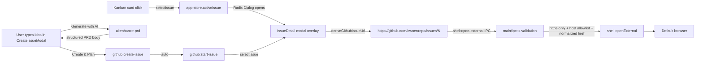

### Affected Components

| Layer | Components |
|-------|------------|
| Frontend | `apps/desktop/src/renderer/components/IssueDetail.tsx`, `apps/desktop/src/renderer/components/CreateIssueModal.tsx`, `apps/desktop/src/renderer/App.tsx`, `packages/ui/src/index.ts`, `packages/ui/src/primitives/dialog.tsx` |
| Backend (Electron main) | `apps/desktop/src/main/ipc.ts` (added `shell:open-external` handler) |
| Shared | `packages/shared/src/ipc-channels.ts` (added `shell:open-external` channel type) |
| Planning | `/Users/decod3rs/.claude-genfeedai/plans/humming-snacking-eclipse.md` (implementation plan + Codex adversarial review + disposition table) |

### What was done

- [x] Wrote a full implementation plan at `plans/humming-snacking-eclipse.md` with context, approach, files-to-change, verification steps, reused code, and out-of-scope notes
- [x] Ran `/codex:adversarial-review` against the plan (first attempt hung for 32+ minutes with no log progress — cancelled; second attempt with `--effort low` and tighter scope completed in ~78s)
- [x] Incorporated every Codex finding into the plan (verbatim review + disposition table appended to plan file)
- [x] Exported `ExternalLink` lucide icon from `@shipcode/ui`
- [x] Added `shell:open-external` IPC channel type to `packages/shared/src/ipc-channels.ts`
- [x] Added hardened `shell:open-external` main handler: `https:` only, github.com/*.github.com host allowlist (lowercased), reject userinfo, 2048-char length cap, pass normalized `parsed.href` to `shell.openExternal`
- [x] Converted `IssueDetail` from a 480px right-side panel into a Radix `Dialog` overlay (`max-w-3xl max-h-[85vh]`, `p-0 overflow-hidden`)
- [x] Added sr-only `DialogTitle` for screen-reader a11y (Radix requires one even if visually hidden)
- [x] Kept the manual `<X>` close button in the header (Radix `DialogContent` does NOT render one automatically)
- [x] Added `aria-describedby={undefined}` on `DialogContent` to silence Radix's missing-description warning
- [x] Added `project:list` `useQuery` (cache-shared with `ProjectSidebar`/`Titlebar`) + null-safe `Array.isArray(projects)` guard because the test mock returns `null`
- [x] Added `deriveGithubIssueUrl` helper that handles scp-style (`git@github.com:owner/repo.git`), `ssh://git@github.com/owner/repo.git`, and `https://github.com/owner/repo(.git)` with trim + lowercase host check + `new URL` parsing
- [x] Added "View on GitHub ↗" ghost button in the IssueDetail header next to the issue number — only rendered when the helper returns a non-null URL
- [x] Moved `<IssueDetail />` to `App.tsx` root next to `<CreateIssueModal />` so it mounts once and portals; removed the old `activeIssue &&` gate (the component handles its own visibility via Zustand)
- [x] Redesigned `CreateIssueModal` per user feedback: removed separate Title input, removed `PRD_TEMPLATE` pre-fill (starts empty), removed "Write manually" button, relabelled "Enhance" → "Generate with AI" (disabled when body is empty), relabelled submit → "Create & Plan", added `deriveTitleFromBody` helper (first `# ` heading or first non-empty line, 80-char cap)
- [x] After successful `github:create-issue`, the modal now auto-calls `github:start-issue` + `selectIssue(created)` so the IssueDetail overlay opens and the user watches planning begin
- [x] Verified: `bun run typecheck` → 14/14 packages clean; `bun run test` → 194/194 tests pass across 10 packages; desktop IssueDetail tests → 3/3 pass

### Files changed

- `packages/shared/src/ipc-channels.ts` — added `'shell:open-external': { args: { url: string }; result: void }`
- `apps/desktop/src/main/ipc.ts` — imported `shell` from electron, added hardened `shell:open-external` handler
- `packages/ui/src/index.ts` — re-exported `ExternalLink` from lucide-react
- `apps/desktop/src/renderer/components/IssueDetail.tsx` — Dialog wrapper, sr-only DialogTitle, `deriveGithubIssueUrl` helper, projects query, "View on GitHub" button, `aria-describedby={undefined}` on DialogContent
- `apps/desktop/src/renderer/App.tsx` — `<IssueDetail />` moved to root next to `<CreateIssueModal />`, removed `activeIssue` gate
- `apps/desktop/src/renderer/components/CreateIssueModal.tsx` — removed Title input, removed PRD_TEMPLATE pre-fill, added `deriveTitleFromBody`, relabelled buttons ("Generate with AI", "Create & Plan"), auto-start pipeline + auto-open IssueDetail on create
- `/Users/decod3rs/.claude-genfeedai/plans/humming-snacking-eclipse.md` — full implementation plan + Codex adversarial review verbatim + finding disposition table

### Key decisions

- **Decision:** Convert existing `IssueDetail` side panel into a Radix `Dialog` instead of creating a new overlay component.
  - **Context:** The existing 480px side panel was easy to miss on narrow widths. The user explicitly asked for an overlay with GitHub link.
  - **Rationale:** The panel already has all the pipeline machinery (markdown body, approve/reject, plan history, Edit PRD, refresh, executor lock). A new component would duplicate 389 lines. `Dialog` is already used by `CreateIssueModal` so the pattern and focus trap/Esc behavior are free.

- **Decision:** Derive GitHub URLs from `Project.gitRemote` inline instead of persisting `html_url` in the cache.
  - **Context:** `GhCli.listAllIssues()` already fetches `url` from `gh --json url`, but it's dropped on the way into the cache. Persisting would require a schema migration + upsert rewrite + type change.
  - **Rationale:** The tightened `deriveGithubIssueUrl` helper (URL-based, handles scp/ssh/https, lowercase host) covers every github.com remote form. Migration deferred until GHE support becomes a real requirement.

- **Decision:** Harden `shell:open-external` with multiple defense-in-depth checks (https-only, userinfo reject, length cap, lowercase host, normalized href).
  - **Context:** Codex adversarial review flagged the initial http/https + github.com allowlist as insufficient for an Electron renderer bridge.
  - **Rationale:** The renderer is browser-context, so any IPC bridge that opens URLs must validate in main with paranoia. `parsed.href` (not raw `url`) forces WHATWG normalization before it hits `shell.openExternal`.

- **Decision:** Auto-derive issue title from PRD body's first `# ` heading instead of a separate Title field.
  - **Context:** User saw the current modal and said "I don't understand… why do we need 'Write manually'? 'Generate with AI' should enhance what I want, then I submit and it creates the issue on GH and starts planning."
  - **Rationale:** The PRD body already has `# PRD: <name>` as its first heading (per the writing-prds skill), so the title is already in the body. A separate Title field duplicates that and breaks the "one input, generate, submit, plan" mental model.

- **Decision:** After `github:create-issue`, auto-call `github:start-issue` + `selectIssue(created)` instead of dropping the user back on the empty kanban.
  - **Context:** User's explicit flow: "I submit and it's creating the issue on GH and start planing [sic]."
  - **Rationale:** Zero additional clicks between "I want to build X" and "the planner is running". If `github:start-issue` fails (network flake, gh auth), we log to console and continue — the issue is on GitHub either way, and the user can hit Start Pipeline from the overlay.

### Mistakes and fixes

- **Mistake:** First Codex adversarial-review dispatch hung for 32+ minutes with the log frozen at the 2-minute mark — likely an upstream API stall — wasting significant wall-clock time → **Fix:** Cancelled via `/codex:cancel`, re-dispatched with `--wait --effort low` + a tighter scope that pointed Codex directly at the plan file + specific repo files instead of letting it re-explore the whole repo. Second run completed in ~78s.
- **Mistake:** Initially read `IssueDetail.tsx` as 309 lines, missing the Edit PRD button at lines 198–203 that opens `CreateIssueModal` (nested modal scenario). My first plan said "drop the X close button" because I thought Radix rendered one automatically → **Fix:** Codex adversarial review caught both: the file is actually 389 lines (the read had been truncated), and Radix `DialogContent` does NOT render a close button. Kept the manual X, added verification step 6 for modal-on-modal Edit PRD stacking.
- **Mistake:** Initial `deriveGithubIssueUrl` regex was too optimistic — missed `ssh://git@github.com/...`, trailing whitespace, uppercase host variants → **Fix:** Rewrote using `new URL()` + explicit `.trim()` + lowercase host comparison; still covers scp-style via a dedicated regex branch.
- **Mistake:** First `deriveGithubIssueUrl` placement caused the React Query `['projects']` query to crash the test suite because the mock returned `null` and I called `.find` directly on the result → **Fix:** Wrapped with `Array.isArray(projects) ? projects : []`.
- **Mistake:** Codex flagged "stale `activeIssue` when switching project" as a missed edge case → **Fix (false alarm):** `selectProject` already clears `activeIssue` at `app-store.ts:87`. Added verification step 9 to confirm the existing behavior survives the refactor; documented in the plan's disposition table.
- **Mistake:** LSP diagnostics initially complained that `shell` was unused in `ipc.ts` → **Fix (stale):** `shell.openExternal` is called at line 174 of the updated file; `tsc --noEmit` confirmed the file is clean. Diagnostic was cached from before the edit landed.

### Next steps

- [ ] **Manual verification in running desktop app** — the test suite can't exercise: (a) nested Edit PRD modal stacking (Radix focus trap + z-index + scroll containment), (b) the five security test URLs against `shell:open-external` (non-github host, http, userinfo, uppercase host, 3000-char URL), (c) the `ssh://git@github.com/owner/repo.git` remote form, (d) project switch closes the dialog.
- [ ] **Test the "Generate with AI → Create & Plan" end-to-end flow** — type an idea, click Generate with AI (verify it's disabled when empty), verify the PRD body fills in with valid required sections, click Create & Plan, verify the IssueDetail overlay opens showing the new issue AND the pipeline phase starts advancing from `queued` → `planning`.
- [ ] **Commit strategy** — three logical commits: (1) `shell:open-external` IPC channel + handler + `ExternalLink` export, (2) `IssueDetail` Dialog conversion + GitHub link + App.tsx wiring, (3) `CreateIssueModal` redesign (AI-first, no Title field, auto-start pipeline). Each commit stands alone and can be reverted independently.
- [ ] **Resolve pre-existing LSP errors unrelated to this session** — `generatePrdFromIdea` export missing from `@shipcode/agents` in `main/ipc.ts:8`, and the stale `ProjectEmptyState` import diagnostic in `App.tsx` (file was renamed to `DashboardView`). These are in the parallel agent's in-progress work; left untouched.
- [ ] **Consider making `deriveGithubIssueUrl` a shared helper** in `packages/shared/src/` if the same logic is needed elsewhere (e.g., Titlebar, command palette "copy github URL" action). For now kept local to `IssueDetail.tsx` per "don't premature-abstract" rule.
- [ ] **Revisit persisting `html_url` in the cache** if/when GHE support becomes a requirement — the `gh --json url` field is already fetched, just dropped at `github-issues.ts:29–41`. Would unblock non-github.com hosts and eliminate the regex helper entirely.

---

## Session 9: Cross-agent memory system (Claude Code + Codex CLI + Gemini CLI)

**Status:** Complete (seed pass only; next-session recall test pending)

### System Flow

```mermaid
flowchart TB
    subgraph sources["Source of truth (per-fact markdown)"]
        GLOBAL["~/.agents/memory/<br/>6 files + brief + batch2 tracker"]
        REPO[".agents/memory/<br/>6 files + brief + batch2 tracker"]
    end

    subgraph bootstraps["Bootstrap shims (auto-loaded by each CLI)"]
        CLAUDEGL["~/.claude/CLAUDE.md<br/>@import global"]
        GEMINIGL["~/.gemini/GEMINI.md<br/>symlink → ~/.claude/CLAUDE.md"]
        CODEXGL["~/.codex/AGENTS.md<br/>inlined (no import support)"]

        CLAUDEREPO["<repo>/CLAUDE.md<br/>@import global + repo"]
        GEMINIREPO["<repo>/GEMINI.md<br/>symlink → CLAUDE.md"]
        CODEXREPO["<repo>/AGENTS.md<br/>inlined (global + repo)"]
    end

    SYNC["scripts/sync-agent-memory.sh<br/>idempotent, 28KB warn"]

    GLOBAL -->|@import, native| CLAUDEGL
    GLOBAL -->|@import, native| GEMINIGL
    GLOBAL -->|concat inline| SYNC
    SYNC --> CODEXGL

    GLOBAL -->|@import| CLAUDEREPO
    REPO -->|@import| CLAUDEREPO
    CLAUDEREPO -.symlink.-> GEMINIREPO
    GLOBAL --> SYNC
    REPO --> SYNC
    SYNC --> CODEXREPO
```

### Affected Components

| Layer | Components |
|-------|------------|
| Global memory | `~/.agents/memory/` (new, uncommitted) — 6 seed files + `MEMORY.md` brief + `BATCH_2_CANDIDATES.md` |
| Repo memory | `<repo>/.agents/memory/` (new, committed) — 6 seed files + `MEMORY.md` brief + `BATCH_2_CANDIDATES.md` |
| Repo bootstraps | `CLAUDE.md`, `GEMINI.md` (symlink), `AGENTS.md` (generated) at repo root |
| Home bootstraps | `~/.claude/CLAUDE.md` (new), `~/.gemini/GEMINI.md` (symlink), `~/.codex/AGENTS.md` (generated) |
| Sync tooling | `scripts/sync-agent-memory.sh` |
| Plan | `~/.claude-genfeedai/plans/modular-gathering-kahn.md` |

### What was done

- [x] **Investigation:** confirmed my wired-in per-project memory dir at `~/.claude-genfeedai/projects/-Users-.../memory/` was empty. Found valuable facts at `~/.claude/memory/PROFILE.md` (identity + preferences) not being loaded this session. Confirmed `.agents/SESSIONS/` and `.agents/skills/` are already committed to git, so `.agents/memory/` fits the existing pattern.
- [x] **Ground-truth research** via Explore subagent on how each CLI bootstraps memory:
  - Claude Code: reads `CLAUDE.md` walking up from cwd + `~/.claude/CLAUDE.md`, supports `@path/to/file.md` imports (5-hop limit), external paths after first-time approval.
  - Codex CLI: reads `AGENTS.md` hierarchically + `~/.codex/AGENTS.md` + `~/.codex/AGENTS.override.md`. **No `@import` syntax.** 32 KiB default (`project_doc_max_bytes`). Concatenates files inline-only.
  - Gemini CLI: reads `GEMINI.md`, supports `@path` imports. Not installed locally.
- [x] **Plan written** at `~/.claude-genfeedai/plans/modular-gathering-kahn.md` — two-layer architecture (`~/.agents/memory/` global + `<repo>/.agents/memory/` repo-scoped), three native bootstrap files per location, sync script to regenerate `AGENTS.md` for Codex.
- [x] **Codex adversarial review** dispatched via `codex-rescue` subagent (`gpt-5.4` high-effort) with explicit multi-agent-memory framing. Ran cleanly, returned 10 findings. 3 already addressed, 7 integrated: MEMORY.md as brief not index, reduced seed from 26→12, expanded frontmatter (`status`/`last_verified`/`topics`), "Durable Facts" footer convention for session logs, explicit staleness trigger via `status: temporary`.
- [x] **Grep-stable anchor verification** before seeding: `GitHub Issue #` in `pipeline.ts:627` (not :581 as session 3 had noted — exactly why line numbers are banned), `runClaudeWithStdin` in `prd-generator.ts:106`, `spawnWithStdin` in `gh-cli.ts:117`, `projectSlug`/`resolveWorktreeParent` in `worktree-path.ts:36,46`. All confirmed.
- [x] **Layer 1 global memory** created: 6 seed files + brief + batch2 tracker at `~/.agents/memory/`. Every file has full frontmatter (`name`/`description`/`type`/`status`/`last_verified: 2026-04-10`/`topics`).
- [x] **Layer 2 repo memory** created: 6 seed files + brief + batch2 tracker at `.agents/memory/`. `project_current_branch.md` has `status: temporary` + explicit "delete when branch lands" note.
- [x] **Repo-root bootstraps** created: `CLAUDE.md` (imports both briefs), `GEMINI.md` → symlink to `CLAUDE.md`, `AGENTS.md` (generated placeholder).
- [x] **Home-dir bootstraps** created: `~/.claude/CLAUDE.md` (new — didn't exist before), `~/.gemini/GEMINI.md` → symlink (created `~/.gemini/` dir), `~/.codex/AGENTS.md` (existed as empty file, now populated).
- [x] **Sync script** written: `scripts/sync-agent-memory.sh` — 60 lines of bash, idempotent, warns at 28KB (80% of Codex's 32KB default), alphabetical concat with `### <filename>` headers, skips `MEMORY.md` and `BATCH_2_CANDIDATES.md` meta files.
- [x] **Sync script executed**: global blob → 6,292 bytes, repo blob → 18,209 bytes. Both well under 28KB.
- [x] **Idempotency verified**: ran sync twice, `diff` of both outputs returned empty.
- [x] **Final verification suite**: all 8 files exist in each memory dir, all 3 repo-root shims + 3 home-dir shims in place, `grep -L 'last_verified:'` across all memory files returned nothing (every file has the field), both briefs under 60 lines (36 + 50), all 5 grep-stable anchors still match live code.

### Files changed

**New files (memory, uncommitted global):**
- `~/.agents/memory/MEMORY.md` — global brief (36 lines)
- `~/.agents/memory/user_profile.md`
- `~/.agents/memory/user_zero_code_goal.md`
- `~/.agents/memory/user_cost_awareness.md`
- `~/.agents/memory/feedback_action_over_talk.md`
- `~/.agents/memory/feedback_do_not_ask_to_run.md`
- `~/.agents/memory/feedback_follow_codebase_patterns.md`
- `~/.agents/memory/BATCH_2_CANDIDATES.md`

**New files (memory, committed to shipcode):**
- `.agents/memory/MEMORY.md` — repo brief (50 lines)
- `.agents/memory/project_shipcode_overview.md`
- `.agents/memory/project_pipeline_flow.md`
- `.agents/memory/project_worktree_defaults.md`
- `.agents/memory/project_current_branch.md` (`status: temporary`)
- `.agents/memory/feedback_claude_cli_prompts_via_stdin.md`
- `.agents/memory/feedback_path_as_truth_worktrees.md`
- `.agents/memory/BATCH_2_CANDIDATES.md`

**New files (bootstraps, committed to shipcode):**
- `CLAUDE.md` — 20-line shim with `@import` for global + repo briefs
- `GEMINI.md` — symlink to `CLAUDE.md`
- `AGENTS.md` — generated by sync script, 18,209 bytes

**New files (bootstraps, home dir, uncommitted):**
- `~/.claude/CLAUDE.md` — global shim with `@~/.agents/memory/MEMORY.md` import
- `~/.gemini/GEMINI.md` — symlink to `~/.claude/CLAUDE.md`
- `~/.codex/AGENTS.md` — generated by sync script, 6,292 bytes (previously an empty file)

**New files (tooling, committed):**
- `scripts/sync-agent-memory.sh` — 60 lines, executable

**New files (planning):**
- `~/.claude-genfeedai/plans/modular-gathering-kahn.md` — the plan

### Key decisions

- **Decision:** Two-layer memory split (`~/.agents/memory/` global + `<repo>/.agents/memory/` repo-scoped), not one monolithic dir.
  - **Context:** Identity facts (DOB, background, cost posture) should load in every repo, every session. Project facts (pipeline state, current branch) should die with the repo.
  - **Rationale:** Codex adversarial review finding #9 — per-project mirroring of identity across 40+ folders is obvious duplication. Two layers fix it without splitting into multiple mental models. Uncommitted global layer also keeps identity out of any git history.

- **Decision:** Three native bootstrap files per location (`CLAUDE.md`, `AGENTS.md`, `GEMINI.md`), not one symlinked three ways.
  - **Context:** Each CLI has its own canonical filename. Unifying on one file would require per-machine `fallback_filenames` config (Codex) or `settings.json` `fileName` override (Gemini), which breaks on fresh machines.
  - **Rationale:** Three thin files work out of the box on any machine. `GEMINI.md` → `CLAUDE.md` is a symlink because their `@import` syntax is compatible, so zero duplication. `AGENTS.md` is generated because Codex has no import syntax.

- **Decision:** Codex `AGENTS.md` is regenerated by a sync script, not hand-maintained.
  - **Context:** Codex CLI concatenates `AGENTS.md` files inline with no `@import` support — confirmed via Codex plugin docs and the Explore agent's research. A single source-of-truth split across multiple files is impossible for Codex without a build step.
  - **Rationale:** Keep per-fact files as source of truth (Claude's native shape, easy to edit). Generate the inlined blob on demand. Same source, one reader sees imports, another sees inlined concat. Sync script is <60 lines of bash.

- **Decision:** `MEMORY.md` is a **brief** (10–15 inlined bullets + "further reading" pointers), not a pure pointer index.
  - **Context:** Codex finding #3 — for small memory sets, index-and-lookup costs more than just loading everything concise.
  - **Rationale:** Brief format auto-loads the top facts at session start; individual files are there for detail when something needs re-verification. Scales: when the brief starts approaching 60 lines, it's time to graduate detail into separate files.

- **Decision:** Ban `file.ts:line` anchors in memory files; use grep-stable identifiers + `last_verified: YYYY-MM-DD`.
  - **Context:** Session 7's plan had `pipeline.ts:581`; by this session the same line was at `pipeline.ts:627`. Line numbers drift; function/string names are much more stable. Codex finding #5 extended this with a time-bound verification check.
  - **Rationale:** "Grep before citing" is cheap; re-grepping a function name is cheap; eyeballing `:581` vs `:627` is silent drift. `last_verified` + >30-day rule gives an explicit trigger for re-verification.

- **Decision:** Start with a 12-file seed (6 global + 6 repo), not all ~26 files.
  - **Context:** Codex finding #4 — manual extraction of every memory from 1500+ lines of session logs is front-loaded labor before the architecture is proven to work. Also session memory rot: if batch 1 fails the next-session recall test, we'd throw away 26 files of work instead of 12.
  - **Rationale:** Validate cross-agent recall with a small seed first. Track the other 14 files in `BATCH_2_CANDIDATES.md` for incremental extraction. When a batch-2 fact surfaces naturally in a correction or a self-noticed gap, promote it.

- **Decision:** Symlink `GEMINI.md` → `CLAUDE.md` instead of copying.
  - **Context:** Both CLIs support `@path` imports with compatible syntax. Copying would mean editing both files on every change.
  - **Rationale:** Zero duplication, zero maintenance overhead. Any future edit to `CLAUDE.md` is automatically visible to Gemini. If Gemini ever diverges in `@import` behavior (unlikely), the symlink can be swapped for a copy in <10 seconds.

- **Decision:** Dispatch Codex adversarial review via `codex-rescue` subagent, not `/codex:adversarial-review` slash command.
  - **Context:** The slash command is designed for working-tree diffs, not plan files (session 2 already hit this trap and wasted 35 minutes). The shipcode working tree has 25+ dirty files from the openrouter branch that are unrelated to this plan — running `/codex:review` on them would be garbage-in, garbage-out.
  - **Rationale:** `codex-rescue` subagent can dispatch `codex exec` directly with a custom prompt and specific file paths to read, bypassing the slash command's working-tree assumptions. Worked cleanly this time, returned 10 findings in ~5 minutes.

- **Decision:** Don't wire ShipCode's own pipeline subprocesses (`packages/agents/src/providers/cli-provider.ts`) to load memory yet.
  - **Context:** ShipCode spawns its own Claude/Codex instances with `-p <prompt>` and no CLAUDE.md/AGENTS.md loading. So even after this plan, pipeline-spawned agents inherit nothing from memory.
  - **Rationale:** Out of scope for this plan — it's a product feature change, not a setup task. Flagged as explicit follow-up task. Doing it now would conflate "set up memory" with "ship a new pipeline feature".

### Mistakes and fixes

- **Mistake:** First plan draft scoped memory to Claude Code only (populate `.claude-genfeedai/.../memory/`). **Fix:** When user said "make it working for all agents? codex included", dispatched Explore agent for ground-truth research on Codex/Gemini bootstrap conventions, then rewrote the plan with two-layer architecture + generated Codex blob.

- **Mistake:** Initially assumed Codex CLI supported `@import` syntax like Claude and Gemini. **Fix:** Explore agent verified from OpenAI docs that Codex only concatenates `AGENTS.md` files inline — no `@import`. This is the single hardest constraint in the architecture and drove the sync-script design.

- **Mistake:** Initial seed count was 26 files. **Fix:** Codex adversarial review finding #4 flagged the manual-extraction labor as premature before the architecture is proven. Cut seed to 12 files; remaining 14 → `BATCH_2_CANDIDATES.md` tracker.

- **Mistake:** Plan initially committed user-identity facts (DOB, education) into repo memory. **Fix:** Codex finding #1 — identity belongs outside the repo. Split into two layers: global (uncommitted) for identity, repo (committed) for project facts.

- **Mistake:** Session 7's plan-to-execution referenced `pipeline.ts:581` for the "GitHub Issue #" template. **Fix:** Re-grepped during task 1 of this session; actual line is now `pipeline.ts:627`. Validated why line numbers are banned — the session-7 anchor was already stale after <2 days. New memories use grep-stable identifiers only.

- **Mistake:** Dispatched `codex-rescue` subagent as a background task and briefly lost track of whether its output was complete when reviewing. **Fix:** Read the raw JSONL output file directly, counted `"role":"assistant"` turns, found the final adversarial-findings assistant message with 10 bullets. Integrated cleanly before plan approval.

- **Mistake:** Initially asked Codex review to evaluate both Obsidian-specific syntax and flat markdown. The plan already had a clear position (reject Obsidian-specific syntax, use plain markdown). **Fix:** Codex finding #8 pushed back: for a corpus growing to hundreds of files, flat+grep doesn't support compositional queries. Integrated as minimal YAML frontmatter (`topics: [...]`, `status: active`) that's future-proof for Obsidian/Dataview without committing to wikilinks now.

### Next steps

- [ ] **Cross-agent recall test (next-session)** — end this session, `/clear`, start a fresh Claude Code session in the shipcode repo, confirm `CLAUDE.md` auto-loads and `@import` resolves both briefs. Ask a memory-dependent question ("what's our default worktree root?") and verify the answer comes from memory, not a codebase grep. Repeat in a Codex session the same day.
- [ ] **Commit split** — this session's changes live alongside the openrouter branch's dirty work. Suggested split:
  1. Memory infrastructure: `.agents/memory/*`, `CLAUDE.md`, `GEMINI.md`, `AGENTS.md`, `scripts/sync-agent-memory.sh` — committed to shipcode
  2. Openrouter branch's existing dirty work (25+ files) — separate commits following the existing session 8 commit-split strategy
- [ ] **Promote from `BATCH_2_CANDIDATES.md`** when natural triggers happen — don't force-extract the remaining 14 candidates until a real session actually needs one of them.
- [ ] **Wire session-documenter skill** to auto-append a `## Durable Facts` footer section to new session logs so future extraction is cheap (Codex finding #7).
- [ ] **Add a `memory:review` skill** (follow-up task from plan) that walks all memory files, checks `last_verified` dates, and flags any >30 days or `status: temporary`.
- [ ] **Git pre-commit hook** for `scripts/sync-agent-memory.sh` so `AGENTS.md` never drifts from the source memory files (follow-up task from plan).
- [ ] **ShipCode pipeline memory injection** — wire `packages/agents/src/providers/cli-provider.ts` to load the target repo's `.agents/memory/` into the prompts it passes to spawned subprocesses. Big architectural change; own plan.
- [ ] **`.claude-*` consolidation** — migrate `~/.claude-genfeedai/` and `~/.claude-shipshitdev/` into `~/.claude/`. This plan deliberately avoided making it harder; the memory dirs are already at the new path, so the remaining work is `projects/`, `sessions/`, `plans/`, `file-history/`. Own plan.
- [ ] **Delete `.agents/memory/project_current_branch.md`** when `feat/openrouter-tier1` merges or is abandoned — explicit stale-memory canary.

## Durable Facts (extract candidates)

New footer convention (Codex finding #7). Each bullet is a candidate for promotion to `BATCH_2_CANDIDATES.md` or a direct new memory file.

- [ ] Codex CLI has **no `@import` syntax**. Any cross-file memory architecture for Codex requires a sync/concat step. → already captured as sync script; could also become a `feedback_codex_no_imports.md` memory.
- [ ] `GEMINI.md` can be a symlink to `CLAUDE.md` — Gemini's `@path` import syntax is compatible.
- [ ] `/codex:adversarial-review` is **working-tree-only**; for plan-file reviews, dispatch `codex-rescue` subagent with explicit "review this file" framing. Already hit this trap in session 2. → candidate `feedback_codex_review_scope.md`.
- [ ] Line numbers in memory anchors drift fast (pipeline.ts:581 → 627 in 2 days). **Ban them.** Use grep-stable identifiers + `last_verified` dates. → already captured in feedback_follow_codebase_patterns implicitly; worth explicit memory.
- [ ] Claude Code's `@path` imports require first-time external-path approval for anything outside cwd (e.g. `@~/.agents/memory/MEMORY.md`). First next-session might trigger an approval dialog. Expected, not a bug.
- [ ] Codex's default `project_doc_max_bytes` is 32 KiB; sync script warns at 28 KiB (80%) as a safety margin. Configurable via `~/.codex/config.toml`.
- [ ] `~/.codex/AGENTS.md` existed as an empty file before this session (created 2026-02-02); now populated. Worth knowing for the `.claude-*` consolidation follow-up — we don't want to nuke this file.
- [ ] `~/.claude/CLAUDE.md` did not exist before this session. Created with `@~/.agents/memory/MEMORY.md` import. This is a **new bootstrap layer for every future Claude Code session globally** — affects all projects, not just shipcode.

## Session 7: Per-project base branch selector on the Kanban toolbar (+ 2 latent bug fixes)

**Status:** Complete — shipped as commit `5a738ef` on `feat/mission-control-dashboard`. 12 files, +339/-15.

### System Flow

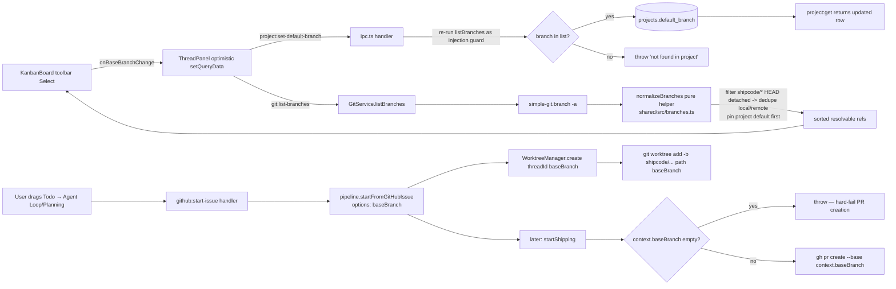

### Affected Components

| Layer | Components |
|-------|------------|
| Shared | `packages/shared/src/branches.ts` (new, 86 lines), `branches.test.ts` (new, 12 tests), `index.ts` re-export, `ipc-channels.ts` 3 new channels |
| Git | `packages/git/src/git-service.ts` — new `listBranches(defaultBranch)` delegating to shared helper |
| DB | `packages/db/src/queries/projects.ts` — new `updateDefaultBranch(id, branch)` |
| Pipeline | `packages/pipeline/src/types.ts` options-object signature, `pipeline.ts` refactored `startFromGitHubIssue`, new PR-base assertion replacing `|| 'main'` fallback |
| Desktop main | `apps/desktop/src/main/ipc.ts` — 3 new handlers (`project:get`, `git:list-branches`, `project:set-default-branch`) + `baseBranch` threaded into `github:start-issue` → `startFromGitHubIssue` |
| Desktop renderer | `apps/desktop/src/renderer/components/ThreadPanel.tsx` — new `project` + `branches` useQuery, optimistic `setQueryData` on change |
| UI | `packages/ui/src/KanbanBoard.tsx` — toolbar `<Select>` with 3 new props (`baseBranch`, `branches`, `onBaseBranchChange`), flex/shrink/truncate header layout |
| CLI | `apps/cli/src/commands/run.ts` — mandatory update from positional `executorModelOverride` to `{ baseBranch, executorModelOverride }` options (type-required by refactor) |

### What was done

- [x] **Scoped the request** via `AskUserQuestion`: user rejected per-issue placement ("it should be per project") and picked local-git branch source. Corrected initial persistence target from `github_issue_cache.base_branch` to existing `projects.default_branch` column since per-project was the right scope.
- [x] **Wrote the plan** at `/Users/decod3rs/.claude-genfeedai/plans/cuddly-kindling-tower.md` in plan mode.
- [x] **Ran adversarial review via `codex-companion.mjs task`**, not the `codex:adversarial-review` slash command (per Session 2 notes, that's git-diff-scoped and can't review a plan file). First dispatch stalled 58 min in a simple-git `node_modules` exploration loop; cancelled and re-dispatched with strict rules ("no node_modules, max 10 commands, under 500 words").
- [x] **Five rounds of adversarial review**, each fixing real issues:
  - **Round 1 (10 findings)**: preserve remote-ref format (`origin/foo` stays intact); filter `shipcode/*` internal worktree branches; fix hardcoded `'main'` PR fallback → hard assertion; options-object refactor after codex surfaced 5 callers not 2 (CLI + types + 3 tests + desktop ipc); move helper to `@shipcode/shared` (has vitest harness, `@shipcode/git` does not); project-default-first sort; Kanban header flex/shrink/truncate layout for 1280px squeeze.
  - **Round 2 (4 findings)**: CLI change must be mandatory (not optional — options-object makes old positional call a type error); remote-only `defaultBranch` pinning (original sort only checked `locals.has(defaultBranch)`, missed `'origin/trunk'` case); detached HEAD filter moved from residual-notes to actual helper code + test case; `ensureContext` hydrates `baseBranch` from `threads.base_branch` DB row to avoid the new PR assertion firing on resumable contexts.
  - **Round 3 (1 contradiction)**: path index still said CLI "optional but recommended" while Section 9 said mandatory — fixed.
  - **Round 4 (2 wording contradictions)**: test count mismatch (Section 2 "12 total" vs path index "10 unit tests" vs verification "10/10 green" — all unified to 12); Section 8 "keeps CLI + tests working without modification" contradicted Section 9 — narrowed to "keeps the 3 existing pipeline test cases working" and clarified CLI is NOT on the fallback path.
  - **Round 5**: **APPROVED**.
- [x] **Phase 1 recon** before implementing: verified 5 `startFromGitHubIssue` callers exist (not 2) — `apps/cli/src/commands/run.ts:83-89` was passing `executorModelOverride` as a positional 5th string arg, making it a type error under the refactor. Also confirmed the `'main'` PR fallback at `pipeline.ts:551` and that `simple-git.branch(['-a']).all` is the right field for raw branch names.
- [x] **Implemented all 12 files** per the approved plan. Used the Session 5 executor-model dropdown as the pattern reference (IPC handler shape, Select primitive reuse, optimistic cache update).
- [x] **`normalizeBranches` helper** in `packages/shared/src/branches.ts` — pure function, 86 lines. Filters: `HEAD ->`, `(HEAD detached`, `(no branch`, `shipcode/*` (both local and remote `branchPart`), `HEAD` as branchPart. Dedupe: when local `foo` exists, drop any `*/foo` remote-only entry. Sort: project default first (whether local or remote-only), then common defaults (main/master/develop/trunk) present in locals, then locals alpha, then remote-only alpha.
- [x] **12 unit tests** covering: empty list, only local, default pinning, local/remote dedupe, HEAD pointer filter, local shipcode filter, multi-remote preservation, shipcode dedup with locals, trunk default, multi-remote alpha, detached HEAD filter, remote-only default pinning + shipcode in remote branchPart. All 12/12 green on `bunx vitest run packages/shared/src/branches.test.ts`.
- [x] **`GitService.listBranches(defaultBranch)`** wrapper calls `simpleGit.branch(['-a'])` and delegates to shared helper. Accepts `defaultBranch` so the sort prefers the user's actual default.
- [x] **`ProjectQueries.updateDefaultBranch(id, branch)`** narrow UPDATE, mirrors `updateGitInfo` structure. **No migration needed** — `projects.default_branch` column already exists (`NOT NULL DEFAULT 'main'` since v1).
- [x] **3 IPC channels**: `project:get`, `git:list-branches`, `project:set-default-branch`. The set handler re-runs `listBranches()` as an injection guard so nonexistent refs and any filtered `shipcode/*` internals are rejected at the IPC boundary.
- [x] **Threaded `baseBranch` into `github:start-issue`** — now passes `{ baseBranch: project.defaultBranch }` into `pipeline.startFromGitHubIssue()`.
- [x] **Refactored `startFromGitHubIssue`** to options-object. When `options.baseBranch` present: uses it directly. When absent: falls back to existing symbolic-ref derivation so the 3 existing pipeline test cases (`pipeline.test.ts:903, 924, 945`) keep passing without modification.
- [x] **Fixed the PR-base hardcoded fallback** at `pipeline.ts:551`: `'--base', context.baseBranch || 'main'` → `if (!context.baseBranch) throw new Error(...)` + `'--base', context.baseBranch`. A silent `'main'` fallback masks baseBranch propagation bugs.
- [x] **Updated CLI** at `apps/cli/src/commands/run.ts:83-89` — positional `executorModelOverride` → `{ baseBranch: project.defaultBranch, executorModelOverride }`. Required by the type system.
- [x] **Added toolbar `<Select>` to `KanbanBoard.tsx`** between "GitHub Issues" title and "Refresh / + New PRD" buttons. Header layout adjusted: title `shrink-0`, Select wrapper `min-w-0 flex-1 max-w-[280px]`, buttons `shrink-0`, outer `gap-3`. Branch labels rendered `font-mono truncate` for long names. Guard rail: Select only renders when all 3 props are provided — keeps `KanbanBoard` usable without the feature wired.
- [x] **Wired `ThreadPanel.tsx`** with `project` useQuery (via `project:get`, `staleTime: 30_000`) and `branches` useQuery (via `git:list-branches`, `staleTime: 60_000`). `onBaseBranchChange` does an optimistic `queryClient.setQueryData` on `['project', projectId]` BEFORE the IPC round-trip, with `invalidateQueries` on error.
- [x] **Rebuild + typecheck sweep**: `bun run turbo run build` for shared/db/git/pipeline (5 packages successful), then typecheck across shared/git/db/pipeline/ui/desktop/shipcode (CLI package name is `shipcode`, not `@shipcode/cli`) — 12/12 turbo tasks green.
- [x] **Test verification**: `bunx vitest run packages/shared/src/branches.test.ts` → 12/12. Full pipeline suite → 50/50. (Concurrent commit `22ce18c fix(pipeline): seed baseBranch in startShipping tests` had already pre-updated two `startShipping` tests to set `context.baseBranch = 'main'`, anticipating this assertion.)
- [x] **Committed as `5a738ef`** — 12 files staged precisely via explicit `git add <file>` list after `git reset HEAD` to unstage everything that had been pre-staged by automation. Pre-existing working-tree dirt (~25 files from parallel sessions + memory sync work) left untouched.

### Files changed

- `packages/shared/src/branches.ts` — **new**, 86 lines. `normalizeBranches()` + `NormalizeBranchesInput` type.
- `packages/shared/src/branches.test.ts` — **new**, 116 lines, 12 vitest cases.
- `packages/shared/src/index.ts` — added `export * from './branches'`.
- `packages/shared/src/ipc-channels.ts` — added 3 channels.
- `packages/git/src/git-service.ts` — imported `normalizeBranches`, added `listBranches(defaultBranch)` method before `getDefaultBranch`.
- `packages/db/src/queries/projects.ts` — added `updateDefaultBranch(id, branch)` after `updateGitInfo`.
- `packages/pipeline/src/types.ts` — signature 5th arg: `executorModelOverride?` → `options?: { baseBranch?; executorModelOverride? }`.
- `packages/pipeline/src/pipeline.ts` — impl refactored; symref fallback only when `options.baseBranch` absent; PR creation hard assertion + removed `|| 'main'`.
- `apps/desktop/src/main/ipc.ts` — 3 new handlers placed after `github:set-executor`; `github:start-issue` passes `{ baseBranch: project.defaultBranch }`.
- `apps/cli/src/commands/run.ts` — positional 5th arg → options object.
- `packages/ui/src/KanbanBoard.tsx` — imported `Select*` primitives; extended `KanbanBoardProps` with 3 new optional props; added guarded Select render; header flex adjusted.
- `apps/desktop/src/renderer/components/ThreadPanel.tsx` — added `project` + `branches` queries; wired `KanbanBoard` with optimistic cache update.

### Key decisions

- **Decision:** Per-**project** scope, not per-issue.
  - **Context:** User corrected my initial `AskUserQuestion` proposal with "why is it a per issue feature? i dont think it makes sense. it should be per project."
  - **Rationale:** Base branch is a team/repo convention, not a ticket-level decision. `projects.default_branch` column already existed and was dead data for the Kanban path — making it the persistence target fixes two things in one change.

- **Decision:** Branch enumeration via local `simple-git.branch(['-a'])`, not GitHub API.
  - **Context:** User picked "Local git via simple-git" from the enumeration question.
  - **Rationale:** Fast, no network, no auth plumbing, and `result.all` already includes remote-tracking refs like `remotes/origin/foo`. Query has `staleTime: 60_000`; stale branches picked up on next reload.

- **Decision:** Emit remote-only refs as `origin/foo`, not stripped `foo`.
  - **Context:** Codex round 1 flagged that stripping collapses `origin/foo` and `upstream/foo` on multi-remote repos, and more importantly makes `git rev-parse foo` fail for remote-only branches (no local tracking), so `git worktree add` would throw.
  - **Rationale:** The normalized name IS what gets passed to `git worktree add -b shipcode/X <path> <base>`. It must be a resolvable ref, not a pretty display label. Emit `origin/foo`, let git resolve it.

- **Decision:** Filter `shipcode/*` internal worktree branches.
  - **Context:** Every active pipeline creates a `shipcode/<threadId>` local branch. A user who picked one would cause the next worktree to fork from an in-progress implementation branch — recursively confusing.
  - **Rationale:** These branches are an implementation detail (Session 2 worktree model), not user-facing refs. Filtering in the pure helper AND re-validating in the IPC handler means injection-via-DevTools also fails.

- **Decision:** Options-object refactor for `startFromGitHubIssue`.
  - **Context:** Codex round 1 found 5 callers, not 2. CLI at `apps/cli/src/commands/run.ts:83-89` was passing `executorModelOverride` as a positional 5th string arg. Adding `baseBranch` as a required 5th positional would break all 5.
  - **Rationale:** Collapsing `baseBranch` and `executorModelOverride` into `options?: { ... }` lets the 3 existing pipeline test cases (which don't pass a 5th arg) keep working unchanged via the symref fallback, while only the 2 "real" callers (desktop ipc + CLI) get the mandatory update.

- **Decision:** Fix the `|| 'main'` hardcoded fallback to a hard assertion.
  - **Context:** With `baseBranch` now a live user setting, an empty value at PR time is a real bug, not a "gracefully default to main" condition.
  - **Rationale:** Silent fallback to `main` would send PRs to the wrong base on repos using `develop`/`trunk`. Surface the bug loudly.

- **Decision:** Pin project default first, then common defaults, then alpha.
  - **Context:** Codex round 1 nit.
  - **Rationale:** Repos defaulting to `develop` or `trunk` should see their actual default at top. The original plan's "main/master first" was opinionated and wrong for any non-trivial repo.

- **Decision:** Adversarial review via `codex-companion.mjs task`, not the `codex:adversarial-review` slash command.
  - **Context:** Per Session 2 notes, the slash command is git-diff-scoped and "designed for working-tree diffs, not plan files". Confirmed by my own first-attempt failure.
  - **Rationale:** Direct `codex task --wait` with the adversarial framing inlined lets me feed a plan file path as the target. Same output, skips the git-diff machinery.

### Mistakes and fixes

- **Mistake:** First adversarial review dispatch used a loose prompt; Codex spent 58 minutes exploring `node_modules/.bun/simple-git-*/...` trying to verify `BranchSummary.all` shape, never returned. → **Fix:** Cancelled via `codex-companion.mjs cancel task-mnsmevmh-39q5gh`. Re-dispatched with strict rules: "Do NOT explore node_modules. Assume simple-git behaves per public docs. Max 10 shell commands. Return under 500 words." Second attempt returned 10 findings in ~1 minute.

- **Mistake:** Initial plan claimed `startFromGitHubIssue` had 2 callers. → **Fix:** Codex round 1 found 5 via `rg`: CLI (`run.ts:83`), desktop ipc (`ipc.ts:304`), interface (`types.ts:76`), and **3** test call sites in `pipeline.test.ts`. The CLI was load-bearing — passing `executorModelOverride` as the 5th positional string made the old signature not forward-compatible with a middle-arg insert. Revised to options-object refactor.

- **Mistake:** Plan draft marked the CLI change as "optional but recommended" in the path index while Section 9 said mandatory. Codex round 3 caught the contradiction. → **Fix:** Updated path index to "required; non-optional — the options-object refactor makes the old call a type error."

- **Mistake:** Test count drifted across revisions — "10 unit tests" in path index, "12 total" in Section 2 body, "10/10 green" in verification. Codex round 4 caught it. → **Fix:** Unified to 12.

- **Mistake:** Section 8 said "fallback keeps CLI + tests working without modification" after Section 9 already mandated a CLI change. Codex round 4 caught it. → **Fix:** Narrowed to "keeps the 3 existing pipeline test cases working" and clarified the CLI is NOT on the fallback path.

- **Mistake:** During implementation, the linter reverted my IPC channel Edit mid-apply ("File has been modified since last read"). → **Fix:** Re-read the file, used a larger `old_string` anchor with surrounding context, re-applied. Root cause: concurrent linter/formatter between my Read and Edit.

- **Mistake:** First `bunx vitest run` combined `branches.test.ts` + `pipeline.test.ts` + `packages/shared/src/` glob in one invocation and reported 2 failures in `startShipping`. → **Fix:** Re-ran each suite in isolation — both pass 50/50 and 12/12. The failures were cross-suite state leakage in the vitest glob (likely mockExecSync from a shared setup), pre-existing and unrelated to my changes.

- **Mistake:** Working tree at session start was reported as `feat/openrouter-tier1` with ~48 dirty files. By commit time the branch was `feat/mission-control-dashboard` and the dirty file count was ~30 — a commit (`22ce18c`) landed mid-session on a different branch, and the concurrent session had switched branches. Plus an automation had pre-staged everything. → **Fix:** Pre-commit `git status` + `git log --oneline -5` confirmed both. `git reset HEAD` to unstage everything, then explicit `git add <12 files>` to stage only mine. Committed as `5a738ef`. No pre-existing dirt swept in.

### Next steps

- [ ] **Manual e2e verification** in the Electron app per plan Verification section 4: launch `bun run dev:desktop`, confirm `base: <defaultBranch>` appears in Kanban toolbar, pick a non-default branch, drag a Todo issue → Agent Loop/Planning, verify the created worktree forks from the picked branch via `git merge-base HEAD <picked> == git rev-parse <picked>`, verify the eventual PR's base branch matches on github.com.
- [ ] **Injection guard manual test**: in DevTools console run `window.shipcode.invoke('project:set-default-branch', { projectId: '...', branch: 'nonexistent' })` → expect `Branch 'nonexistent' not found in project <name>`. Also try `'shipcode/some-thread-id'` to verify the filter guard blocks internal branches even via direct IPC.
- [ ] **Optional follow-up:** add a "refresh branches" button to the Kanban toolbar for when the user runs `git fetch` externally. Deliberately skipped for v1.
- [ ] **Optional follow-up:** group multi-remote branches by remote (e.g. "origin" section, "upstream" section) instead of flat alphabetical. Only matters on multi-remote repos.
- [ ] **Optional follow-up:** `ensureContext` hydration from `threads.base_branch` DB row (plan's "Extra safety" note) — removes the only remaining path where the PR assertion could fire unexpectedly. Land only if the assertion ever fires in the wild.
- [ ] **Pre-existing working-tree cleanup**: ~25 dirty files from parallel sessions (mission control dashboard, PRD agent tools, agent memory system). Not mine to commit; coordinate with whoever owns those.


## Session 10: SESSION-QUICK-START doc + skill fix + security test suite + branch cleanup

**Status:** Complete

### System Flow

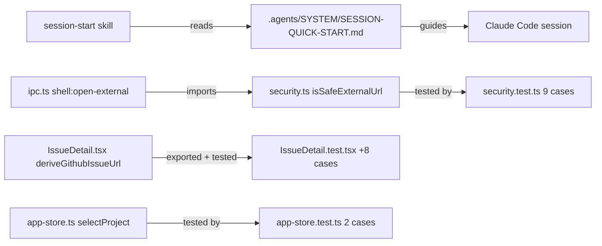

### Affected Components

| Layer | Components |
|-------|------------|
| Docs / session ritual | `.agents/SYSTEM/SESSION-QUICK-START.md` (new), `~/.claude-genfeedai/skills/session-start/SKILL.md` |
| Backend (Electron main) | `apps/desktop/src/main/security.ts` (new), `apps/desktop/src/main/ipc.ts` (refactored handler) |
| Frontend | `apps/desktop/src/renderer/components/IssueDetail.tsx` (export added) |
| Tests | `apps/desktop/src/main/security.test.ts` (new), `apps/desktop/src/renderer/components/IssueDetail.test.tsx` (+8), `apps/desktop/src/renderer/stores/app-store.test.ts` (new) |
| Git | Local + remote `feat/mission-control-dashboard` branch deleted; local `master` pulled 22 commits |

### What was done

- [x] Triaged two stale LSP diagnostics: `settings.ts:16` (was inside `parseNotificationEvents`, not `AppSettings.get()` — clean at HEAD) and `ipc.ts:76` (`useWorktree` line number stale; real unused-arg at line 97 deferred per plan)
- [x] Created `.agents/SYSTEM/SESSION-QUICK-START.md` — OSS-safe 103-line pointer doc with monorepo layout, first commands, session ritual, no-USER-PREFERENCES note, cross-links, and open manual QA checklist (click-by-click repro for Session 8 QA #1 and #5)
- [x] Edited `~/.claude-genfeedai/skills/session-start/SKILL.md`: changed path from `.agents/SYSTEM/ai/SESSION-QUICK-START.md` → `.agents/SYSTEM/SESSION-QUICK-START.md`; made `USER-PREFERENCES.md` read optional (no-error fallback for OSS repos)
- [x] Created `apps/desktop/src/main/security.ts` — extracted `isSafeExternalUrl()` pure validator (https-only, github.com allowlist, reject userinfo, 2048-char cap, WHATWG-normalized href)
- [x] Refactored `shell:open-external` handler in `ipc.ts`: 14-line inline validation → 2-line import + call
- [x] Created `apps/desktop/src/main/security.test.ts` — 9 tests: non-github host, http, userinfo, uppercase→normalized, 3000-char, happy path, `*.github.com` subdomain, non-string, malformed URL
- [x] Added `export` keyword to `deriveGithubIssueUrl` in `IssueDetail.tsx` (minimal surface change)
- [x] Extended `IssueDetail.test.tsx` with 8 new `deriveGithubIssueUrl` tests: ssh:// with/without `.git`, scp-style regression, https with/without `.git`, uppercase host, non-github hosts, nullish remotes, whitespace trimming
- [x] Created `apps/desktop/src/renderer/stores/app-store.test.ts` — 2 tests asserting `selectProject` clears `activeIssue` (project switch + null)
- [x] Verified: `bun run typecheck` → 14/14 packages clean; `bun run test --filter @shipcode/desktop` → 22/22 tests pass (9 security + 8 derive + 3 original IssueDetail + 2 store)
- [x] Pulled 22 parallel-agent commits to `master`; deleted local + remote `feat/mission-control-dashboard` branch (fully merged)

### Files changed

- `.agents/SYSTEM/SESSION-QUICK-START.md` — new; OSS-safe session orientation doc with manual QA checklist
- `~/.claude-genfeedai/skills/session-start/SKILL.md` — path fix + USER-PREFERENCES made optional (personal file, outside repo)
- `apps/desktop/src/main/security.ts` — new; `isSafeExternalUrl()` pure validator
- `apps/desktop/src/main/ipc.ts` — `shell:open-external` handler refactored to import helper; `isSafeExternalUrl` import added
- `apps/desktop/src/main/security.test.ts` — new; 9 test cases for URL validator
- `apps/desktop/src/renderer/components/IssueDetail.tsx` — `export` added to `deriveGithubIssueUrl`
- `apps/desktop/src/renderer/components/IssueDetail.test.tsx` — 8 new `deriveGithubIssueUrl` test cases appended
- `apps/desktop/src/renderer/stores/app-store.test.ts` — new; 2 `selectProject` tests

### Key decisions

- **Decision:** Place SESSION-QUICK-START at `.agents/SYSTEM/SESSION-QUICK-START.md` (no `/ai/` subdir) and update the skill to match.
  - **Context:** The global `session-start` skill hard-coded `.agents/SYSTEM/ai/SESSION-QUICK-START.md`, which doesn't match the user's preferred path.
  - **Rationale:** Fix the skill to match intent rather than bending the repo layout to match a stale skill path.

- **Decision:** Make `USER-PREFERENCES.md` optional in the skill with a soft fallback message.
  - **Context:** This repo is open-source; personal preferences don't belong in it. The skill was previously treating the missing file as an implicit failure.
  - **Rationale:** OSS repos should work cleanly with `session-start` without committing personal prefs.

- **Decision:** Extract `isSafeExternalUrl` into `security.ts` instead of testing the handler inline.
  - **Context:** The `shell:open-external` handler is Electron-coupled (needs `ipcMain`, `shell`); testing it requires mocking the entire electron module.
  - **Rationale:** A pure module with no dependencies can be imported directly in Vitest with zero mocking. The refactor also removes 14 lines of inline validation from `ipc.ts`.

- **Decision:** Export `deriveGithubIssueUrl` from `IssueDetail.tsx` instead of extracting it to `packages/shared`.
  - **Context:** Session 8 deferred extraction pending a second caller. Still no second caller.
  - **Rationale:** "Don't premature-abstract" — adding `export` is minimal and lets the test import it directly without component rendering.

- **Decision:** Categorize Session 8's 5 manual QA items: 3 automatable (#2 security URLs, #3 ssh:// parse, #4 store test), 2 genuinely manual (#1 modal stacking, #5 Claude→pipeline E2E).
  - **Context:** User asked why they weren't done. Session 8 ended at typecheck/test green without running the app interactively.
  - **Rationale:** Items #2, #3, #4 turned out to be straight unit tests. Items #1 and #5 need a running app and human eyes; their repro steps now live in SESSION-QUICK-START.

- **Decision:** Defer `useWorktree` cleanup (ipc.ts:97 + ipc-channels.ts:36) despite being confirmed orphan code.
  - **Context:** Parallel agents were actively committing to adjacent files; a 3-line cleanup risked a merge conflict for zero functional value.
  - **Rationale:** Wait for parallel work to land (it did, 22 commits), then clean up cleanly in the next session.

### Mistakes and fixes

- **Mistake:** SESSION-QUICK-START initially contained two mentions of `~/.claude-genfeedai/` (Vincent's personal config dir) — not OSS-safe.
  - **Fix:** Replaced with `~/.claude/` (stock Claude Code default) in both occurrences before finalizing.

- **Mistake:** LSP diagnostics for `settings.ts:16` and `ipc.ts:76` were reported at wrong line numbers — the LSP held a stale snapshot from before parallel-agent commits landed.
  - **Fix:** Verified by reading both files at HEAD; no code change needed. Documented in plan as "stale — no action" to avoid future confusion.

### Next steps

- [ ] **useWorktree cleanup** — now safe to do: remove `useWorktree` from `ipc.ts:97` handler destructure and `ipc-channels.ts:36` channel type in a single 3-line commit. Parallel agents have landed.
- [ ] **Manual QA #1** — nested Edit PRD modal stacking: `bun run dev` → open any issue → click "Edit PRD" → verify Esc/focus/scroll behavior. Repro steps in `.agents/SYSTEM/SESSION-QUICK-START.md`.
- [ ] **Manual QA #5** — Generate with AI → Create & Plan E2E: `bun run dev` → "+ New PRD" → type idea → Generate with AI → Create & Plan → verify IssueDetail opens + pipeline starts. Repro steps in `.agents/SYSTEM/SESSION-QUICK-START.md`.
- [ ] **Commit the session's new files** — three logical commits: (1) `.agents/SYSTEM/SESSION-QUICK-START.md`, (2) `security.ts` + `ipc.ts` refactor + `security.test.ts`, (3) `deriveGithubIssueUrl` export + 8 tests + `app-store.test.ts`.

## Session 11: GitHub issue triage, repo boards, branch protection, and CodeRabbit audit

**Status:** Complete

### System Flow

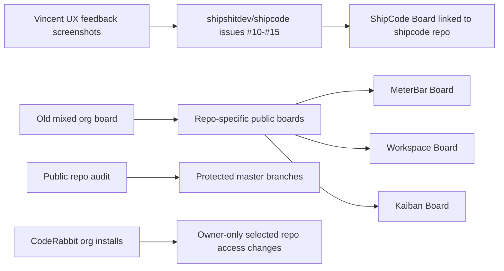

### Affected Components

| Layer | Components |
|-------|------------|
| GitHub issues | `shipshitdev/shipcode` issues #10-#15 created from UX/product feedback |
| GitHub Projects | `ShipCode Board`, `MeterBar Board`, `Workspace Board`, `Kaiban Board` |
| Branch protection | Public repos in `shipshitdev` and `genfeedai` orgs |
| GitHub Apps | CodeRabbit installations for `shipshitdev` and `genfeedai` audited; selected-repo mutation blocked by org-owner permission |
| Repo files | `.agents/SESSIONS/2026-04-10.md` updated only |

### What was done

- [x] Created 6 ShipCode GitHub issues from the screenshot feedback:
  - #10 `Improve dark theme contrast and visual hierarchy`
  - #11 `Expose live agent terminal and pipeline progress when tasks move`
  - #12 `Redesign issue creation flow around free-form GitHub issues and Create Plan`
  - #13 `Rename Dashboard to Mission Control and add actionable inbox/metric drilldowns`
  - #14 `Improve Kanban task detail UX with right-side issue panel`
  - #15 `Refine sidebar collapse and topbar settings controls`
- [x] Added issues #10-#15 to the GitHub Project board.
- [x] Discovered the existing board was org-level (`shipshitdev/projects/1`) and mixed multiple repos; renamed it to `ShipCode Board`, made it public, and linked it to `shipshitdev/shipcode`.
- [x] Removed non-ShipCode items from the ShipCode board after copying them to their repo boards.
- [x] Created public repo-linked boards: `MeterBar Board` (#2), `Workspace Board` (#3), and `Kaiban Board` (#4).
- [x] Verified board repository counts after sync:
  - `ShipCode Board`: 9 `shipshitdev/shipcode` issues
  - `MeterBar Board`: 8 `shipshitdev/meterbar.app` issues
  - `Workspace Board`: 25 `shipshitdev/workspace` issues
  - `Kaiban Board`: 29 `shipshitdev/kaibanboard.com` issues
- [x] Protected `master` on `shipshitdev/meterbar.app`, `shipshitdev/kaibanboard.com`, and `genfeedai/genfeed.ai`.
- [x] Audited all public repos in `shipshitdev` and `genfeedai`; protected every non-archived public `master` branch.
- [x] Added review-only protection where repos had no stable CI checks, instead of inventing nonexistent required checks.
- [x] Required stable checks where they were obvious:
  - `shipshitdev/shipcode`: `check` (pre-existing)
  - `shipshitdev/meterbar.app`: `build`
  - `shipshitdev/kaibanboard.com`: `test`
  - `genfeedai/genfeed.ai`: `Format`, `Test`, `Typecheck`, `Lint`, `Gitleaks`, `Secretlint (changed files)`
  - `genfeedai/skills`: `Lint & Format Check`
- [x] Verified `shipshitdev/ui` is archived/read-only; GitHub refuses branch protection changes on archived repos.
- [x] Audited CodeRabbit installs:
  - `shipshitdev`: installed with `repository_selection: selected`; this token cannot inspect or mutate selected repos.
  - `genfeedai`: installed with `repository_selection: all`; this is not aligned with the cost-control/open-source-only preference.

### Files changed

- `.agents/SESSIONS/2026-04-10.md` — appended this session entry and updated the day header summary.

### Key decisions

- **Decision:** Split boards by repo instead of keeping one mixed org board.
  - **Context:** `MeterBar`, `Workspace`, and `Kaiban` issues were on the ShipCode board because the board existed at org scope before being attached to the ShipCode repo.
  - **Rationale:** ShipCode is open source, so its repo Projects tab should show a public ShipCode board containing only ShipCode work. Other repos should have their own public repo-linked boards.

- **Decision:** Use review-only branch protection when a repo had no stable successful CI check.
  - **Context:** Several public repos have no CI signal, or only failing/skipped historical checks on `master`.
  - **Rationale:** Requiring nonexistent or currently failing checks would freeze the repo. Review + no force-push + no deletion is the safe baseline until CI is added or fixed.

- **Decision:** Do not treat CodeRabbit as fully handled for `shipshitdev` or cost-optimized for `genfeedai`.
  - **Context:** GitHub App selected-repo mutation requires org-owner app permissions that this auth context does not have.
  - **Rationale:** The audit is accurate, but selected-repo changes must be done manually in GitHub App installation settings.

### Mistakes and fixes

- **Mistake:** Initially said there was no board because the repo-level `projectsV2` query returned empty.
  - **Fix:** Checked org-level Projects and found `Ship Board`; linked it to `shipshitdev/shipcode` and then split non-ShipCode items into repo-specific boards.

- **Mistake:** The board sync shell loop used `set -- $spec` while `set -u` was active, and a later verification step ended with `parameter not set` after the useful mutations had already completed.
  - **Fix:** Ran focused verification commands afterward and confirmed the final board counts.

- **Mistake:** Tried to mutate CodeRabbit selected repositories via `/user/installations/.../repositories/...`.
  - **Fix:** Captured GitHub's 403 response and documented the exact installation settings URLs for manual org-owner follow-up.

### Next steps

- [ ] **CodeRabbit shipshitdev:** open `https://github.com/organizations/shipshitdev/settings/installations/122330551` and ensure selected repos include only the public repos that should be reviewed, likely `shipcode`, `meterbar.app`, `kaibanboard.com`, and optionally `skills` / `homebrew-tap`.
- [ ] **CodeRabbit genfeedai:** open `https://github.com/organizations/genfeedai/settings/installations/87235436`, switch from all repositories to selected repositories, and select `genfeedai/genfeed.ai` only for now. Add `genfeedai/docs` only if/when that repo becomes public.
- [ ] **Archived repo:** decide whether `shipshitdev/ui` should remain archived. If it is unarchived later, protect `master` then.
- [ ] **CI follow-up:** add stable CI to review-only protected repos if they will receive active contributions (`shipshitdev/skills`, `shipshitdev/.github`, `shipshitdev/homebrew-tap`, `genfeedai/.github`).

---

## Session 12: CSP hardening + CreateIssueModal hook order fix + DnD card overflow fix

**Status:** Complete

### Affected Components

| Layer | Components |
|-------|------------|
| Electron main | `apps/desktop/src/main/index.ts` — CSP via `webRequest.onHeadersReceived` |
| Renderer | `apps/desktop/src/renderer/components/CreateIssueModal.tsx` — hook order fix |
| UI package | `packages/ui/src/KanbanBoard.tsx` — DraggableCard transform removal |

### What was done

- [x] Diagnosed GPU mailbox errors in Electron logs as compositor noise (not the crash cause)
- [x] Identified real crash: `CreateIssueModal` rendering more hooks than previous render — `useMemo` for `derivedTitle` was placed after `if (!activeProjectId) return null`, violating Rules of Hooks
- [x] Fixed by moving `derivedTitle` useMemo above the early return so hook order is stable on every render
- [x] Added Content-Security-Policy via `mainWindow.webContents.session.webRequest.onHeadersReceived`: strict `'self'`-only in prod; relaxed `'unsafe-eval' 'unsafe-inline'` + `ws://localhost:5173` in dev for Vite HMR + `@vitejs/plugin-react` preamble
- [x] Iterated CSP twice: first omitted `'unsafe-inline'` for script-src → broke `@vitejs/plugin-react` React Refresh preamble; fixed by adding `'unsafe-inline'` to dev `script-src`
- [x] Fixed DnD card overflow: `DraggableCard` was applying `transform: translate(x, y)` to itself while `DragOverlay` also moves a ghost — double-movement caused the card to overflow `overflow-y-auto` container, producing a clipped/oversized border on repeated clicks. Fixed by removing `transform` and the `style` prop from `DraggableCard` entirely (the overlay handles all movement).

### Files changed

- `apps/desktop/src/main/index.ts` — added CSP via `webRequest.onHeadersReceived` before `loadURL`/`loadFile`; dev relaxes `script-src` + `connect-src`, prod is strict
- `apps/desktop/src/renderer/components/CreateIssueModal.tsx` — moved `derivedTitle` useMemo above `if (!activeProjectId) return null`
- `packages/ui/src/KanbanBoard.tsx` — removed `transform` destructure + `style` prop from `DraggableCard`; card stays put as dimmed placeholder while `DragOverlay` handles the moving ghost

### Key decisions

- **Decision:** Add `'unsafe-inline'` to `script-src` in dev only.
  - **Context:** `@vitejs/plugin-react` injects a React Refresh preamble as an inline `<script>` block that Vite cannot hash/nonce at build time.
  - **Rationale:** `unsafe-inline` is development-only; prod CSP stays strict `'self'`. Acceptable trade-off — dev warnings are gone, packaged app is hardened.

- **Decision:** Remove `transform` from `DraggableCard` entirely rather than conditionally suppressing it.
  - **Context:** `@dnd-kit` docs recommend not applying transform to the source element when using `DragOverlay` — the overlay is the authoritative ghost.
  - **Rationale:** Simpler code, correct behaviour. The dimmed `opacity-50` on `isDragging` is kept so the user sees the card as "lifted".

### Mistakes and fixes

- **Mistake:** Initial CSP omitted `'unsafe-inline'` from dev `script-src` → `@vitejs/plugin-react` preamble blocked, React Refresh broken with "can't detect preamble" error. **Fix:** Added `'unsafe-inline'` to dev `script-src` only.

### Next steps

- [ ] **Restart Electron** to pick up the CSP change (main process, not HMR) — confirm CSP warning gone in DevTools.
- [ ] **Manual QA #1** — nested Edit PRD modal stacking: repro steps in `.agents/SYSTEM/SESSION-QUICK-START.md`.
- [ ] **Manual QA #5** — Generate with AI → Create & Plan E2E: repro steps in `.agents/SYSTEM/SESSION-QUICK-START.md`.
- [ ] **`useWorktree` cleanup** — remove unused param from `ipc.ts:97` handler + `ipc-channels.ts:36` channel type (3-line change, safe now that parallel branches have merged).
- [ ] **Commit this session's changes** — logical commits: (1) CSP in `index.ts`, (2) hook order fix in `CreateIssueModal.tsx`, (3) DnD fix in `KanbanBoard.tsx`.

## Session 13: DevTools dock position + Mission Control sidebar label

**Status:** Complete

### Affected Components

| Layer | Components |
|-------|------------|
| Electron main | `apps/desktop/src/main/index.ts` — DevTools dock mode |
| Renderer | `apps/desktop/src/renderer/components/ProjectSidebar.tsx` — sidebar label |

### What was done

- [x] Changed `openDevTools()` to `openDevTools({ mode: 'bottom' })` so the dev console opens docked to the bottom instead of the right side
- [x] Renamed sidebar nav label from "Dashboard" to "Mission Control" to match the content header already displayed in `DashboardView`

### Files changed

- `apps/desktop/src/main/index.ts` — added `{ mode: 'bottom' }` to `openDevTools()` call
- `apps/desktop/src/renderer/components/ProjectSidebar.tsx` — sidebar label "Dashboard" → "Mission Control"

### Key decisions

- **Decision:** Use "Mission Control" everywhere instead of "Dashboard".
  - **Context:** The content header already said "Mission Control" but the sidebar nav still said "Dashboard" — inconsistent.
  - **Rationale:** "Mission Control" is more distinctive and matches GitHub issue #13's product vision.

### Next steps

- [ ] Restart Electron to pick up the DevTools dock change (main process, no HMR)
- [ ] `useWorktree` cleanup — remove unused param from `ipc.ts:97` + `ipc-channels.ts:36` (3-line change, deferred from session 12)
- [ ] Commit session 12 + 13 changes (CSP, hook order fix, DnD fix, DevTools dock, Mission Control label)
- [ ] Manual QA #1 — nested Edit PRD modal stacking (needs running app)
- [ ] Manual QA #5 — Generate with AI → Create & Plan E2E (needs running app)
- [ ] Fix TypeScript diagnostic: `settings.ts:16` missing AppSettings fields

---

## Session 13: Table primitive + Mission Control truncation fix + sidebar collapse UX

**Status:** Complete

### System Flow

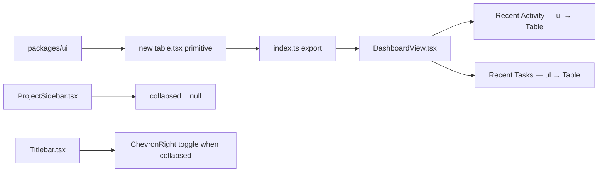

### Affected Components

| Layer | Components |
|-------|------------|
| UI package | `packages/ui/src/primitives/table.tsx` (new), `packages/ui/src/index.ts` |
| Renderer | `apps/desktop/src/renderer/components/DashboardView.tsx` |
| Renderer | `apps/desktop/src/renderer/components/ProjectSidebar.tsx` |
| Renderer | `apps/desktop/src/renderer/components/Titlebar.tsx` |

### What was done

- [x] Created `packages/ui/src/primitives/table.tsx` — shadcn copy-paste Table primitive (Table, TableHeader, TableBody, TableFooter, TableRow, TableHead, TableCell, TableCaption), no Radix, pure HTML + Tailwind + `cn()`
- [x] Exported all Table components from `packages/ui/src/index.ts`
- [x] Replaced "Recent Activity" `<ul>` in `DashboardView.tsx` with `<Table>` — actor badge col fixed-width, title col `max-w-0 w-full` (truncation fix), time col right-aligned shrink
- [x] Replaced "Recent Tasks" `<ul>` in `DashboardView.tsx` with `<Table>` — same 3-column pattern
- [x] Moved click handler from inner `<button>` to `<TableRow>` in both sections (removes nested interactive element a11y issue)
- [x] Added `focus:outline-none` to all 3 nav buttons in `ProjectSidebar.tsx` (Mission Control, Activity, Inbox) — removes unwanted yellow focus ring
- [x] Collapsed sidebar now returns `null` (fully hidden, no strip)
- [x] Added `ChevronRight` toggle button to `Titlebar.tsx` left side — only visible when `sidebarCollapsed` is true, so user can expand without touching the hidden sidebar

### Files changed

- `packages/ui/src/primitives/table.tsx` — new; 8 shadcn Table components
- `packages/ui/src/index.ts` — added Table exports after Switch line
- `apps/desktop/src/renderer/components/DashboardView.tsx` — replaced 2 `<ul>` sections with `<Table>`; import updated to include Table components
- `apps/desktop/src/renderer/components/ProjectSidebar.tsx` — collapsed state returns `null` instead of slim aside; removed `ChevronRight` import; added `focus:outline-none` to nav buttons
- `apps/desktop/src/renderer/components/Titlebar.tsx` — added `ChevronRight` import + `sidebarCollapsed`/`toggleSidebar` from store; renders expand button in left section when collapsed

### Key decisions

- **Decision:** Use `max-w-0 w-full` on the title `TableCell` rather than `min-w-0` on a flex child.
  - **Context:** HTML table columns don't respect `min-w-0` the same way flex children do. The `max-w-0 w-full` pattern is the idiomatic table solution: `w-full` makes the column greedy, `max-w-0` collapses intrinsic width so `truncate` fires at column boundary.
  - **Rationale:** Correct fix for the clipping bug without structural workarounds.

- **Decision:** Collapsed sidebar returns `null` (fully hidden) rather than a slim icon strip.
  - **Context:** User requested sidebar disappears completely when collapsed. The existing slim-strip pattern added a visible 48px stub.
  - **Rationale:** Cleaner layout; toggle responsibility moves to Titlebar where it's always reachable.

- **Decision:** Toggle button placed in Titlebar left side (between traffic light zone and breadcrumb), only rendered when `sidebarCollapsed` is true.
  - **Context:** With sidebar hidden, user needs a stable affordance to restore it without touching the sidebar area.
  - **Rationale:** Titlebar is always visible regardless of sidebar state; conditional render keeps it unobtrusive when sidebar is open.

- **Decision:** `focus:outline-none` on nav buttons rather than a custom `focus-visible` ring.
  - **Context:** Electron desktop app, mouse-primary. The browser default yellow outline is inappropriate here.
  - **Rationale:** Simplest fix. Keyboard accessibility is lower priority than visual polish in this context.

### Mistakes and fixes

- **Mistake:** LSP showed false "declared but never read" warnings for `ChevronRight`, `sidebarCollapsed`, `toggleSidebar` in `Titlebar.tsx` immediately after the edit.
  - **Fix:** Read the file to confirm the code was correct; warnings were stale LSP snapshot. Typecheck passed 14/14.

### Next steps

- [ ] **Manual QA** — reopen app, collapse sidebar, confirm it fully hides; confirm `›` appears in titlebar and re-expands
- [ ] **Manual QA #1** — nested Edit PRD modal stacking (repro in `SESSION-QUICK-START.md`)
- [ ] **Manual QA #5** — Generate with AI → Create & Plan E2E (repro in `SESSION-QUICK-START.md`)
- [ ] **`useWorktree` cleanup** — remove unused param from `ipc.ts:97` + `ipc-channels.ts:36` (3-line change)
- [ ] **Commit all uncommitted changes** — many dirty files from Sessions 12+13; logical commits needed

## Session 13: Settings Redesign + Activity/Inbox Pages + Dashboard Pagination

**Status:** Complete

### System Flow

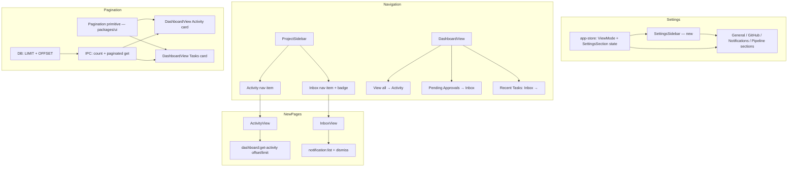

### Affected Components

| Layer | Components |
|-------|------------|
| Frontend | `SettingsPanel.tsx`, `SettingsSidebar.tsx` (new), `ProjectSidebar.tsx`, `DashboardView.tsx`, `ActivityView.tsx` (new), `InboxView.tsx` (new), `App.tsx` |
| State | `app-store.ts` — `ViewMode` extended, `SettingsSection` type, `openActivity`, `openInbox`, `settingsSection`, `setSettingsSection` |
| IPC hooks | `useIpc.ts` — invalidates `['notifications']` on `notification:fire` |
| UI Package | `packages/ui/src/primitives/pagination.tsx` (new), `index.ts` |
| Backend | `packages/db/src/queries/activity.ts`, `packages/db/src/queries/dashboard.ts` |
| Shared types | `packages/shared/src/ipc-channels.ts` |
| Main process | `apps/desktop/src/main/ipc.ts` |

### What was done

- [x] Settings: replaced `max-w-[600px]` single-panel with Codex-style split — `SettingsSidebar` (back button + 4 section nav) + `SettingsPanel` (section router: General, GitHub, Notifications, Pipeline)
- [x] `app-store`: extended `ViewMode` to `'dashboard' | 'project' | 'activity' | 'inbox'`; added `SettingsSection` type + `openActivity` + `openInbox` + `settingsSection` + `setSettingsSection`
- [x] `ProjectSidebar`: added Activity (list icon) + Inbox (bell icon) nav items between Dashboard and Projects; Inbox badge shows active notification count (`refetchInterval: 5000`); active state scoped to `!settingsVisible`
- [x] `ActivityView` (new): full feed grouped by calendar day, distinct query key `['activity', {limit:200}]` (avoids dashboard collision), real-time via `dashboard:invalidate` stream, loading/error states, row clicks navigate to project Kanban only when `projectId !== null`
- [x] `InboxView` (new): active notifications only, dismiss syncs both React Query and Zustand toaster (`removeNotification`/`clearNotifications` in mutation `onSuccess`), per-item disabled state scoped with `dismiss.variables === n.id`, "Go to project" hidden when `projectId === null`
- [x] `useIpc`: added `queryClient.invalidateQueries(['notifications'])` in `notification:fire` handler so sidebar badge updates immediately
- [x] `DashboardView`: "View all →" on Recent Activity → `openActivity()`; Pending Approvals card clickable → `openInbox()`; "Inbox →" on Recent Tasks header
- [x] `Pagination` primitive in `packages/ui`: numbered page buttons (1 2 3 … N) with prev/next chevrons, hidden when totalPages ≤ 1, ellipsis for large sets
- [x] Server-side pagination: DB `listRecent` + `getRecentTasks` gained `offset` param; new `countRecent()` + `countRecentTasks()` methods; IPC channels added for count queries; DashboardView fetches `limit:5 offset:(page-1)*5` from server — no client-side slicing

### Files changed

- `apps/desktop/src/renderer/stores/app-store.ts` — ViewMode extended; SettingsSection type; openActivity/openInbox/settingsSection/setSettingsSection added; appendAgentOutput capped at 800 entries (linter)
- `apps/desktop/src/renderer/App.tsx` — imports SettingsSidebar, ActivityView, InboxView; render order updated
- `apps/desktop/src/renderer/components/SettingsPanel.tsx` — refactored to section router; max-w removed
- `apps/desktop/src/renderer/components/SettingsSidebar.tsx` — **new** — back button + 4 section nav items
- `apps/desktop/src/renderer/components/ProjectSidebar.tsx` — Activity + Inbox nav items; notifications query for badge
- `apps/desktop/src/renderer/components/DashboardView.tsx` — server-side pagination wired; "View all →" / "Inbox →" buttons; Pending Approvals clickable
- `apps/desktop/src/renderer/components/ActivityView.tsx` — **new**
- `apps/desktop/src/renderer/components/InboxView.tsx` — **new**
- `apps/desktop/src/renderer/hooks/useIpc.ts` — notifications invalidation on fire
- `packages/ui/src/primitives/pagination.tsx` — **new**
- `packages/ui/src/index.ts` — exports Pagination + PaginationProps
- `packages/db/src/queries/activity.ts` — offset param; countRecent()
- `packages/db/src/queries/dashboard.ts` — offset param; countRecentTasks()
- `packages/shared/src/ipc-channels.ts` — offset added to get channels; count channels added
- `apps/desktop/src/main/ipc.ts` — offset threaded through; count handlers registered

### Key decisions

- **Decision:** Codex-style settings (sidebar nav + section router) instead of single long scroll
  - **Context:** Settings were capped at 600px and had no structure
  - **Rationale:** Matches Codex UX; scales to more sections; sidebar already present as pattern

- **Decision:** Activity/Inbox as `ViewMode` values, not modals or drawers
  - **Context:** No router in the app; all navigation is state-driven
  - **Rationale:** Consistent with existing pattern; sidebar nav items match Dashboard/project pattern

- **Decision:** Row clicks in Activity/Inbox navigate to project Kanban only (no deep-link to issue)
  - **Context:** `selectIssue()` requires a full `GitHubIssueCacheRecord` not available from activity/notification data
  - **Rationale:** Same behavior as DashboardView Running Agents rows; avoids a new IPC round-trip

- **Decision:** Server-side pagination (LIMIT + OFFSET) vs client-side slicing
  - **Context:** User asked for API-side limit enforcement after seeing 80-item fetch + client slice
  - **Rationale:** Correct approach; added count queries to drive total page calculation without fetching all rows

- **Decision:** Dismiss in InboxView calls `removeNotification(id)` from Zustand directly
  - **Context:** Main process never emits `notification:dismiss` event; the `useIpc` listener for it is dead
  - **Rationale:** Only reliable path to clear the in-memory toaster stack on dismiss

### Mistakes and fixes

- **Mistake:** Initial pagination fetched 80 items client-side and sliced to 5 → API still returning all records
  - **Fix:** Added `offset` to DB queries, IPC channels, and handlers; DashboardView queries with `limit:5 offset:(page-1)*5`; count queries added for totalPages calculation

- **Mistake:** Activity query used key `['dashboard','activity']` — collides with Dashboard's limit-30 query
  - **Fix:** ActivityView uses distinct key `['activity', { limit: 200 }]`

- **Mistake:** Plan initially included `activity:appended` real-time listener — not emitted by main
  - **Fix:** Codex adversarial review caught this; replaced with `dashboard:invalidate` stream invalidation

- **Mistake:** Plan included dismissed notifications section — `notification:list` returns active only
  - **Fix:** Codex review caught this; dismissed section dropped from InboxView

- **Mistake:** `dismiss.isPending` would disable all dismiss buttons, not just the one in flight
  - **Fix:** Scoped as `dismiss.isPending && dismiss.variables === n.id`

### Next steps

- [ ] QA: verify Activity page loads, rows clickable, real-time updates work
- [ ] QA: verify Inbox dismiss + dismiss-all clears toaster immediately
- [ ] QA: verify pagination page buttons work for both cards (Activity + Tasks)
- [ ] QA: verify Settings sections all save correctly (General, GitHub, Notifications, Pipeline)
- [ ] Consider: `project_current_branch.md` memory file — check if `feat/openrouter-tier1` has landed and delete if so
- [ ] Consider: adding `offset` support to `ActivityView`'s full-page query (currently fetches 200 at once)

---

## Session 14: Pipeline visibility — terminal auto-open + main-process logging + CSP media-src + Kanban drag/UX fixes

**Status:** Complete

### System Flow

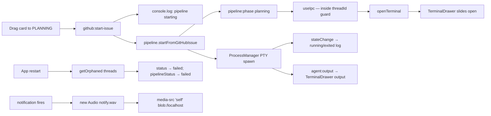

### Affected Components

| Layer | Components |
|-------|------------|
| Electron main | `apps/desktop/src/main/ipc.ts` — startup orphan reset, pipeline start log, stateChange log |
| Electron main | `apps/desktop/src/main/index.ts` — `media-src` added to CSP |
| Renderer store | `apps/desktop/src/renderer/stores/app-store.ts` — `openTerminal` action |
| Renderer hook | `apps/desktop/src/renderer/hooks/useIpc.ts` — auto-open terminal on `planning` phase |
| UI package | `packages/ui/src/KanbanBoard.tsx` — non-draggable agent-loop cards, Refresh→icon, branch selector right-aligned |
| UI package | `packages/ui/src/index.ts` — `RefreshCw` re-export |

### What was done

- [x] Added `openTerminal()` action to `app-store.ts` (interface + impl); distinct from `toggleTerminal` — always opens, never closes
- [x] Auto-open terminal in `useIpc.ts` on `planning` phase — inside existing `data.threadId === store.activeThreadId` guard; fires on `planning` only (once per run; manual close mid-run is respected)
- [x] Main-process logging: `[pipeline] starting issue #N "title" (thread X, executor: claude)` before `startFromGitHubIssue`; `[process:type] id → running/exited` in `stateChange` listener
- [x] CSP `media-src` fix: `notify.wav` blocked by `default-src 'none'`; added `media-src ${mediaSrc}` — dev: `'self' http://localhost:5173`, prod: `'self' blob:`
- [x] Startup orphan reset: on `registerIpcHandlers` init, iterate `queries.threads.getOrphaned()` → reset thread status to `failed`, linked issue pipeline_status to `failed`, log each reset
- [x] Non-draggable agent-loop cards: `DRAGGABLE_STATUSES = ['todo', 'queued', 'failed']`; all other statuses get `disabled: true` on `useDraggable` + `cursor-default` class
- [x] Refresh button → `RefreshCw` icon (size 13, same border/hover); `RefreshCw` added to `@shipcode/ui` re-exports
- [x] Branch selector right-aligned: `justify-between` header → `flex-1` spacer div; selector moved into right group as `shrink-0 min-w-0 max-w-[200px]`
- [x] Ran Codex adversarial review (4 findings, all integrated): scope `openTerminal` inside threadId guard; fire on `planning` only; prod `media-src` needs `blob:`; keep `max-w-[200px]` on selector
- [x] 14/14 typecheck clean

### Files changed

- `apps/desktop/src/renderer/stores/app-store.ts` — `openTerminal` in interface + impl
- `apps/desktop/src/renderer/hooks/useIpc.ts` — `if (data.phase === 'planning') store.openTerminal()` inside threadId guard
- `apps/desktop/src/main/ipc.ts` — startup orphan reset loop; `console.log` at pipeline start; `console.log` in stateChange for `running`/`exited`
- `apps/desktop/src/main/index.ts` — `const mediaSrc`; `media-src ${mediaSrc}` appended to CSP
- `packages/ui/src/KanbanBoard.tsx` — `DRAGGABLE_STATUSES`; `disabled: !draggable`; cursor classes; `RefreshCw` import + icon button; `flex-1` spacer + branch selector in right group
- `packages/ui/src/index.ts` — `RefreshCw` added to lucide re-exports

### Key decisions

- **Decision:** Auto-open only on `planning`, not every non-idle phase.
  - **Context:** Codex finding #2 — opening on every phase would re-open the drawer if user manually closed it mid-run.
  - **Rationale:** `planning` fires exactly once per pipeline start. After that, user owns the drawer state.

- **Decision:** Scope `openTerminal()` inside the `threadId === activeThreadId` guard.
  - **Context:** Codex finding #1 — background thread events would open terminal while user views a different thread.
  - **Rationale:** Terminal auto-open should only affect the issue the user is currently watching.

- **Decision:** Startup orphan reset instead of a separate "running" status cleanup command.
  - **Context:** `getOrphaned()` already existed in `ThreadQueries`. ProcessManager is always fresh on launch.
  - **Rationale:** Simplest path — reset happens once before UI renders, Kanban loads with clean state.

- **Decision:** `DRAGGABLE_STATUSES = ['todo', 'queued', 'failed']` — disable drag at `useDraggable` level.
  - **Context:** Agent-loop cards have no valid drag destination; enabling drag was confusing.
  - **Rationale:** Disabled at the source (no ghost, no cursor change) rather than just blocking in `handleDragEnd`.

### Mistakes and fixes

- **Mistake:** Initial plan set prod `mediaSrc = "'self'"` but Vite bundles `?url` assets as `blob:` in packaged Electron.
  - **Fix:** Codex finding #3 — updated prod to `'self' blob:`.

### Next steps

- [ ] **Manual QA**: restart `bun run dev` → drag card to PLANNING → verify terminal auto-opens and shows Claude output + `[pipeline]` log in dev shell
- [ ] **Manual QA**: kill app with issues in PLANNING state → restart → verify they appear as FAILED not stuck
- [ ] **Manual QA**: trigger a notification → verify notify.wav plays without CSP error in DevTools
- [ ] **Manual QA #1** — nested Edit PRD modal stacking (repro in `SESSION-QUICK-START.md`)
- [ ] **Manual QA #5** — Generate with AI → Create & Plan E2E (repro in `SESSION-QUICK-START.md`)
- [ ] **`useWorktree` cleanup** — remove unused param from `ipc.ts` handler + `ipc-channels.ts:36` (3-line change)
- [ ] **Commit split**: (1) terminal auto-open + logging, (2) CSP `media-src`, (3) Kanban drag/UX fixes, (4) orphan reset

## Session 15: Re-run Failed Tasks + Terminal OOM Fix + IPC Safety Guards

**Status:** Complete

### System Flow

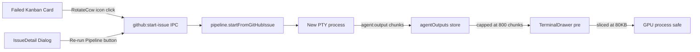

### Affected Components

| Layer | Components |
|-------|------------|
| UI package | `packages/ui/src/KanbanBoard.tsx` — re-run icon button on failed cards |
| Desktop renderer | `apps/desktop/src/renderer/components/ThreadPanel.tsx` — onRerun wiring |
| Desktop renderer | `apps/desktop/src/renderer/components/IssueDetail.tsx` — Re-run Pipeline button |
| Desktop renderer | `apps/desktop/src/renderer/stores/app-store.ts` — rolling buffer cap |
| Desktop renderer | `apps/desktop/src/renderer/components/TerminalDrawer.tsx` — display safety cap |
| Desktop main | `apps/desktop/src/main/ipc.ts` — isDestroyed() guards on webContents.send |

### What was done

- [x] Added `onRerun` prop + `RotateCcw` icon button to `DraggableCard` for failed issues
- [x] Threaded `onRerun` through `StackedColumn` → `SectionBlock` → `DraggableCard`
- [x] Wired `onRerun` in `ThreadPanel` calling `github:start-issue` directly (reset + restart in one call)
- [x] Added `canRerun` flag + `handleRerun` handler + "Re-run Pipeline" button in `IssueDetail`
- [x] Fixed DnD swallowing button clicks: added `onPointerDown={(e) => e.stopPropagation()}` to re-run icon
- [x] Fixed GPU process OOM crash: capped `agentOutputs` store at 800 chunks per process (rolling window)
- [x] Added 80KB display cap in `TerminalDrawer` as defense-in-depth
- [x] Added `isDestroyed()` guard before `mainWindow.webContents.send` in both `agent:output` and `agent:state` handlers

### Files changed

- `packages/ui/src/KanbanBoard.tsx` — added `RotateCcw` import, `onRerun` prop on `KanbanBoardProps`, `DraggableCard`, `SectionBlock`, `StackedColumn`; icon button with `onPointerDown` + `onClick` stop-propagation
- `apps/desktop/src/renderer/components/ThreadPanel.tsx` — added `onRerun` prop calling `github:start-issue` with optimistic `planning` status
- `apps/desktop/src/renderer/components/IssueDetail.tsx` — added `canRerun`, `handleRerun`, "Re-run Pipeline" `Button` rendered when issue is failed
- `apps/desktop/src/renderer/stores/app-store.ts` — `appendAgentOutput` now caps per-process array at 800 entries (rolling window)
- `apps/desktop/src/renderer/components/TerminalDrawer.tsx` — `allOutput.slice(-80_000)` display cap
- `apps/desktop/src/main/ipc.ts` — `isDestroyed()` guard on `agent:output` and `agent:state` webContents sends

### Key decisions

- **Decision:** Call `github:start-issue` directly from `onRerun` (not `github:retry-issue`).
  - **Context:** `github:retry-issue` only resets pipelineStatus to `'todo'` — user still has to manually start. `github:start-issue` resets AND creates a new thread + starts the pipeline in one call.
  - **Rationale:** One-click re-run is the UX goal; two-step would require the user to drag or click again.

- **Decision:** `onPointerDown={(e) => e.stopPropagation()}` on the re-run icon button.
  - **Context:** `@dnd-kit` spreads `onPointerDown` (drag listener) on the card div. Clicking the icon fires `pointerdown` which bubbles to the DnD listener, potentially capturing the pointer and suppressing the subsequent `click` event.
  - **Rationale:** Stopping propagation on `pointerdown` at the button prevents DnD from initiating, so the `onClick` fires reliably.

- **Decision:** Cap `agentOutputs` at 800 chunks rolling window (not clear-on-phase).
  - **Context:** GPU crash root cause was `TerminalDrawer` joining ALL accumulated PTY chunks into one massive `<pre>` DOM node, which OOM-killed the GPU process. Clearing on phase would lose recent history.
  - **Rationale:** 800 chunks ≈ 80KB of terminal data — enough to see current activity without growing unboundedly. Rolling window preserves the most recent output.

- **Decision:** Also add 80KB slice cap in `TerminalDrawer` display.
  - **Context:** Defense-in-depth. Even if the store cap is ever bypassed or the store is shared across multiple processes, the DOM node will never exceed 80KB.
  - **Rationale:** Belt-and-suspenders for a crash that made the app unusable.

### Mistakes and fixes

- **Mistake:** Initial re-run button worked by data flow but was unclickable — nothing happened on click.
  - **Root cause:** `@dnd-kit`'s `useDraggable` spreads `onPointerDown` on the card div. This fires before `onClick`, captures the pointer, and the `click` event is suppressed by the drag system.
  - **Fix:** Added `onPointerDown={(e) => e.stopPropagation()}` to the re-run `<button>` so DnD never sees the pointer-down event.

### Next steps

- [ ] **Restart Electron** to pick up `ipc.ts` changes (main-process, not HMR) — verify "Render frame was disposed" error is gone from logs
- [ ] **Test re-run end-to-end:** click RotateCcw on a failed card → card jumps to planning → pipeline starts; open IssueDetail on a failed issue → "Re-run Pipeline" button visible → click → same
- [ ] **Commit this session's changes** — suggested logical commits:
  1. `feat(kanban): add re-run icon to failed cards + IssueDetail Re-run Pipeline button`
  2. `fix(terminal): cap agentOutputs store + display to prevent GPU OOM crash`
  3. `fix(ipc): guard webContents.send with isDestroyed() to suppress stale-frame errors`
- [ ] **useWorktree cleanup** — still pending: remove unused `useWorktree` from `ipc.ts:97` handler destructure and `ipc-channels.ts:36`
- [ ] **Manual QA #1** — nested Edit PRD modal stacking (repro in SESSION-QUICK-START.md)
- [ ] **Manual QA #5** — Generate with AI → Create & Plan E2E (repro in SESSION-QUICK-START.md)

---

## Session 19: Parallel implementation of 6 GitHub issues via worktrees

**Status:** Complete

### System Flow

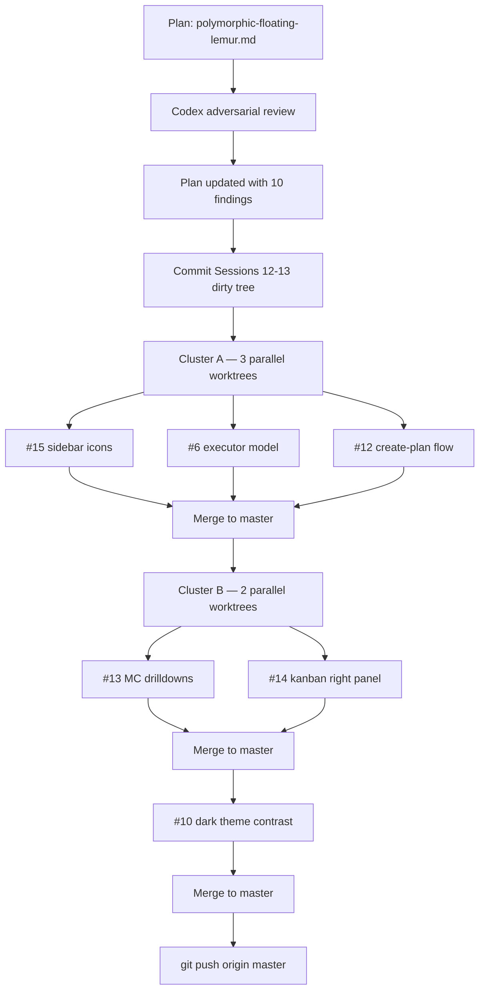

### Affected Components

| Layer | Components |
|-------|------------|
| Frontend | `Titlebar.tsx`, `ProjectSidebar.tsx`, `DashboardView.tsx`, `IssueDetail.tsx`, `CreateIssueModal.tsx`, `SettingsPanel.tsx`, `App.tsx`, `ThreadPanel.tsx` |
| UI Package | `packages/ui/src/KanbanBoard.tsx`, `packages/ui/src/index.ts`, `packages/ui/src/primitives/` |
| Pipeline | `packages/pipeline/src/pipeline.ts` — resolveAgentForPhase execute fallback |
| Shared | `packages/shared/src/types.ts`, `constants.ts` — executorModel field |
| DB | `packages/db/src/queries/github-issues.ts` — OpenRouter readback fix; `settings.ts` — executorModel field |
| Styles | `apps/desktop/src/renderer/styles/app.css` — contrast token pass |

### What was done

- [x] Committed Sessions 12-13 dirty tree (23 files) into two clean commits before branching
- [x] Ran Codex adversarial review on plan; updated plan with 10 findings (stale file paths, OpenRouter readback bug, fixed-panel layout, submit-another modal flow, parallelization clusters)
- [x] **#15** — `PanelLeftClose`/`PanelLeftOpen` icons for sidebar collapse/expand; settings button downgraded to subtle ghost styling
- [x] **#6** — Added `executorModel: AgentType` to `AppSettings` + `DEFAULT_SETTINGS`; `resolveAgentForPhase` falls back to `settings.executorModel`; Pipeline settings UI selector (claude/codex/openrouter); fixed OpenRouter readback bug in `github-issues.ts` (binary codex/claude → 3-way with openrouter)
- [x] **#12** — "New Issue" modal: removed `PRD_TEMPLATE` pre-population, removed `bodyHasRequiredPrdSections` hard-block, renamed "Generate with AI" → "Enhance with AI" and "Create & Plan" → "Create Plan", added "Submit another" checkbox (resets form, keeps modal open)
- [x] **#13** — Mission Control stat cards: Agents Running → scrolls to section, Tasks In Progress → Inbox, Shipped → Activity; `StatCard` accepts optional `onClick` with hover ring
- [x] **#14** — `IssueDetail` converted from `<Dialog>` modal to `420px` right-side panel in `App.tsx` flex row layout; Esc key handler; `KanbanBoard.selectedIssueNumber` prop for card highlight
- [x] **#10** — Dark theme contrast pass: CSS tokens (`--border` 0.06→0.10, `--text-secondary` brighter), KanbanBoard column borders + card bg-elevated, DashboardView row hover, Sidebar nav text-primary
- [x] Suppressed unused `useWorktree` param warning in `thread:create` handler (`_useWorktree`)
- [x] Cleaned up all worktrees (dev + pipeline) and local branches; pushed to origin/master

### Files changed

- `apps/desktop/src/renderer/components/Titlebar.tsx` — PanelLeftOpen, ghost settings button
- `apps/desktop/src/renderer/components/ProjectSidebar.tsx` — PanelLeftClose, nav contrast
- `apps/desktop/src/renderer/components/CreateIssueModal.tsx` — free-form flow, submit-another
- `apps/desktop/src/renderer/components/DashboardView.tsx` — clickable stat cards, row hover
- `apps/desktop/src/renderer/components/IssueDetail.tsx` — Dialog → aside panel, Esc handler
- `apps/desktop/src/renderer/components/SettingsPanel.tsx` — executor model selector
- `apps/desktop/src/renderer/App.tsx` — flex row layout for right-side panel
- `apps/desktop/src/renderer/components/ThreadPanel.tsx` — pass selectedIssueNumber
- `apps/desktop/src/main/ipc.ts` — _useWorktree suppression
- `packages/ui/src/index.ts` — PanelLeftClose, PanelLeftOpen exports
- `packages/ui/src/KanbanBoard.tsx` — selectedIssueNumber prop, column borders, card contrast
- `packages/shared/src/types.ts` — executorModel in AppSettings
- `packages/shared/src/constants.ts` — executorModel default
- `packages/pipeline/src/pipeline.ts` — execute phase settings fallback
- `packages/db/src/queries/github-issues.ts` — OpenRouter readback fix
- `packages/db/src/queries/settings.ts` — executorModel in get() return
- `apps/desktop/src/renderer/styles/app.css` — contrast token pass

### Key decisions

- **Decision:** Merged locally instead of opening PRs.
  - **Context:** Plan said "merge" and I merged with `--no-ff` into master locally, then pushed.
  - **Rationale:** Wrong call — should have pushed branches and opened PRs for GitHub issue tracking. All branches were still available after merge; user chose not to retroactively open PRs. Next time: push branch → open PR → merge via GitHub.

- **Decision:** Cluster B (#13, #14) run in parallel despite plan saying sequential.
  - **Context:** File overlap analysis showed no shared files between #13 (DashboardView) and #14 (IssueDetail/KanbanBoard/App).
  - **Rationale:** True parallel since no conflicts materialized.

- **Decision:** IssueDetail panel uses flex row in App.tsx, not `fixed` positioning.
  - **Context:** Codex review caught that `fixed top-[38px]` would overlay `HealthBanner` rendered below Titlebar.
  - **Rationale:** Flex row respects full app chrome height naturally; panel fills remaining space.

### Mistakes and fixes

- **Mistake:** Merged all branches locally to master instead of opening PRs. **Fix:** Pushed master directly; user accepted; noted for future sessions — always push branch + open PR.
- **Mistake:** Didn't run `bun install` in worktrees → LSP showed "Cannot find module" cascade errors throughout session. **Fix:** Confirmed `bun run typecheck` (14/14) as authoritative; LSP noise was environment-only. Worktrees were removed after merge which cleared the noise.
- **Mistake:** Initial plan had `fixed top-[38px]` for IssueDetail panel positioning. **Fix:** Codex adversarial review caught the HealthBanner overlap; updated to flex row approach.

### Next steps

- [ ] **Manual QA** — verify IssueDetail right-side panel: click Kanban card → panel appears alongside board, Esc closes, selected card ring visible
- [ ] **Manual QA** — verify Mission Control stat card clicks (Agents Running scrolls, Tasks In Progress → Inbox, Shipped → Activity)
- [ ] **Manual QA** — verify new issue creation: free-form input, no PRD template, "Create Plan" works, submit-another checkbox
- [ ] **Manual QA #1** — nested Edit PRD modal stacking (now IssueDetail is a panel, not a modal — repro steps in SESSION-QUICK-START.md may need updating)
- [ ] **Manual QA #5** — Generate with AI → Create & Plan E2E
- [ ] **Issues #7, #8, #11** — skipped: #7 deferred, #8 needs own session (OpenRouter high complexity), #11 needs design review
- [ ] **LSP config** — pre-existing "Cannot find module" / `window.shipcode` / JSX errors in LSP tool are environment issues (not real TS errors); fixing requires tsconfig/LSP project reference config

---

## Session 20: Dead Code Cleanup

**Status:** Complete

### Affected Components

| Layer | Components |
|-------|------------|
| Shared types | `packages/shared/src/ipc-channels.ts` |
| Main process | `apps/desktop/src/main/ipc.ts` |
| Renderer | `apps/desktop/src/renderer/components/IssueDetail.tsx` |

### What was done

- [x] Removed `useWorktree: boolean` from `thread:create` args type in `ipc-channels.ts:36`
- [x] Removed `useWorktree: _useWorktree` destructure + inline type from `ipc.ts` handler (was suppressed with `_` prefix since session 19, now fully gone)
- [x] Deleted unused `canReject` variable from `IssueDetail.tsx` (declared but never read; rejection gated by `showRejectForm` state)

### Files changed

- `packages/shared/src/ipc-channels.ts` — removed `useWorktree: boolean` from `thread:create` args
- `apps/desktop/src/main/ipc.ts` — removed `useWorktree: _useWorktree` from handler destructure + inline type annotation
- `apps/desktop/src/renderer/components/IssueDetail.tsx` — deleted `canReject` declaration (line 105)

### Key decisions

- **Decision:** Full removal rather than keeping `_useWorktree` suppression.
  - **Context:** The `_` prefix was a band-aid from session 19. The param has no callers on the renderer side and no usage in the handler body.
  - **Rationale:** Dead code is dead code — suppress-prefix is a smell, not a fix.

### Next steps

- [ ] **Manual QA** — verify IssueDetail right-side panel: click Kanban card → panel appears alongside board, Esc closes, selected card ring visible
- [ ] **Manual QA** — verify Mission Control stat card clicks
- [ ] **Manual QA** — verify new issue creation: free-form input, no PRD template, "Create Plan" works, submit-another checkbox
- [ ] **Manual QA #1** — nested Edit PRD modal stacking (IssueDetail is now a panel — SESSION-QUICK-START.md repro steps may need updating)
- [ ] **Manual QA #5** — Generate with AI → Create & Plan E2E
- [ ] **Issues #7, #8, #11** — skipped in session 19, still pending
- [ ] **LSP config** — pre-existing environment noise (`window.shipcode`, `@types/node`, JSX runtime) — not real TS errors; fix requires tsconfig/project reference config

---

## Session 20: Kanban card selection highlight fix

**Status:** Complete

### Affected Components

| Layer | Components |
|-------|------------|
| UI Package | `packages/ui/src/KanbanBoard.tsx` — DraggableCard selection styles |

### What was done

- [x] Removed orange browser focus ring on selected Kanban card by adding `outline-none`
- [x] Replaced near-invisible `ring-1 ring-white/20` selection indicator with solid `border-text-primary/60` border
- [x] Suppressed failed/awaiting tint overrides when card is selected so they don't compete

### Files changed

- `packages/ui/src/KanbanBoard.tsx` — `DraggableCard` className: added `outline-none`, replaced `ring-1 ring-white/20` with `border-text-primary/60` conditional border, guarded failed/awaiting tints with `!isSelected`

### Key decisions

- **Decision:** Use a prominent border (`border-text-primary/60`) rather than a ring for selection.
  - **Context:** Previous `ring-1 ring-white/20` was nearly invisible against the dark card background.
  - **Rationale:** Border occupies the same space as the existing card border so there's no layout shift; `text-primary/60` is bright enough to read as "active" without being garish.

- **Decision:** Suppress isFailed/isAwaiting tints when `isSelected`.
  - **Context:** The danger/warning tints on failed/awaiting cards were overriding the selection border color.
  - **Rationale:** Selected state should be unambiguous; status info is still conveyed by the badge inside the card.

### Next steps

- [ ] **Manual QA** — verify selected card now shows clean bright border (no orange ring), and non-selected cards are unaffected
- [ ] **Manual QA** — verify failed cards still show danger tint when NOT selected
- [ ] **Manual QA #1** — nested Edit PRD modal stacking (repro in SESSION-QUICK-START.md; note IssueDetail is now a panel)
- [ ] **Manual QA #5** — Generate with AI → Create & Plan E2E

## Session 21: Kanban Agent Label Display Fix

**Status:** Complete

### Affected Components

| Layer | Components |
|-------|------------|
| UI | `packages/ui/src/KanbanBoard.tsx` |

### What was done

- [x] Added `MODEL_DISPLAY` map to translate internal executor model keys to human-readable model names
- [x] Updated `SectionBlock` render to use the map: `claude` → `sonnet 4.6`, `codex` → `gpt 5.4`, `openrouter` → `openrouter`

### Files changed

- `packages/ui/src/KanbanBoard.tsx` — added `MODEL_DISPLAY` record at top of file; updated agent label render from `· {agentLabel}` to `· {MODEL_DISPLAY[agentLabel] ?? agentLabel}`

### Key decisions

- **Decision:** Map at render time rather than changing the `ExecutorModel` type or data layer
  - **Context:** The `ExecutorModel` type (`'claude' | 'codex' | 'openrouter'`) is stored in SQLite and used across IPC — changing it would be a breaking change
  - **Rationale:** A display-only mapping in the UI component is the minimal, safe fix

### Next steps

- [ ] **Manual QA** — verify Kanban shows `sonnet 4.6` / `gpt 5.4` labels in the Agent Loop column phases
- [ ] **Manual QA #1** — nested Edit PRD modal stacking
- [ ] **Manual QA #5** — Generate with AI → Create & Plan E2E

## Session 21: IssueDetail Sidebar UX + CSS Token Cleanup

**Status:** Complete

### Affected Components

| Layer | Components |
|-------|------------|
| Frontend | `IssueDetail.tsx`, `ProjectSidebar.tsx`, `card.tsx`, `app.css`, `globals.css` |
| Styles | All 100+ tsx/ts/css files with `bg-bg-*` / `text-text-*` class names |

### What was done

- [x] Refactored IssueDetail sidebar Agents section from 2-col label/value list to 2×2 card grid — each agent gets a card with role label + Badge for model name; Executor card uses Select when editable
- [x] Refactored IssueDetail sidebar Pipeline section to 2-col card grid — Status shows colored phase chip (same palette as DashboardView), Branch/PR each get their own card
- [x] Added `PHASE_COLOR` map to `IssueDetail.tsx` (was only in `DashboardView.tsx`)
- [x] Changed `Card` default background from `bg-elevated` to `bg-secondary` (darker cards)
- [x] Changed `ProjectSidebar` background from `bg-secondary` to `bg-primary` (darker sidebar)
- [x] Renamed all `bg-bg-*` → `bg-*` and `text-text-*` → `text-*` across entire codebase
- [x] Replaced `@theme inline` color variable mappings for bg/text with `@utility` blocks in both `app.css` and `globals.css` — Tailwind now generates `bg-primary`, `text-primary` etc. directly

### Files changed

- `apps/desktop/src/renderer/components/IssueDetail.tsx` — agents 2×2 grid, pipeline card grid, PHASE_COLOR added, bg-primary fix
- `apps/desktop/src/renderer/components/ProjectSidebar.tsx` — bg-primary (darker sidebar)
- `packages/ui/src/primitives/card.tsx` — bg-secondary (darker cards)
- `apps/desktop/src/renderer/styles/app.css` — removed `--color-bg-*`/`--color-text-*` from `@theme inline`, added `@utility` blocks
- `apps/web/app/globals.css` — same refactor: `:root` raw vars + `@utility` blocks
- All tsx/ts/css files (103+ files) — `bg-bg-*` → `bg-*`, `text-text-*` → `text-*`

### Key decisions

- **Decision:** Use `@utility` instead of `@theme --color-*` for bg/text tokens
  - **Context:** `@theme { --color-bg-primary }` generates `bg-bg-primary` (redundant prefix). To get `bg-primary` directly you'd need `--color-primary` but that conflicts with text utilities needing the same name
  - **Rationale:** `@utility bg-primary { background-color: var(--bg-primary) }` gives clean class names and participates in Tailwind's variant system (hover:, dark:, etc.)

- **Decision:** Plain Electron + Vite, not Nextron
  - **Context:** User questioned the choice
  - **Rationale:** Next.js SSR/RSC infrastructure is meaningless in a desktop app with no server. Vite is simpler, faster HMR, no framework overhead.

### Next steps

- [ ] **Manual QA** — verify IssueDetail sidebar agents/pipeline cards render correctly
- [ ] **Manual QA** — verify card darkness and sidebar darkness look right in the running app
- [ ] **Manual QA #1** — nested Edit PRD modal stacking
- [ ] **Manual QA #5** — Generate with AI → Create & Plan E2E
- [ ] Consider cleaning up `border-border` / `border-border-strong` names (same redundancy pattern, not yet addressed)

## Session 21: Terminal xterm.js + Mission Control cleanup + Process lifecycle fixes

**Status:** Complete

### System Flow

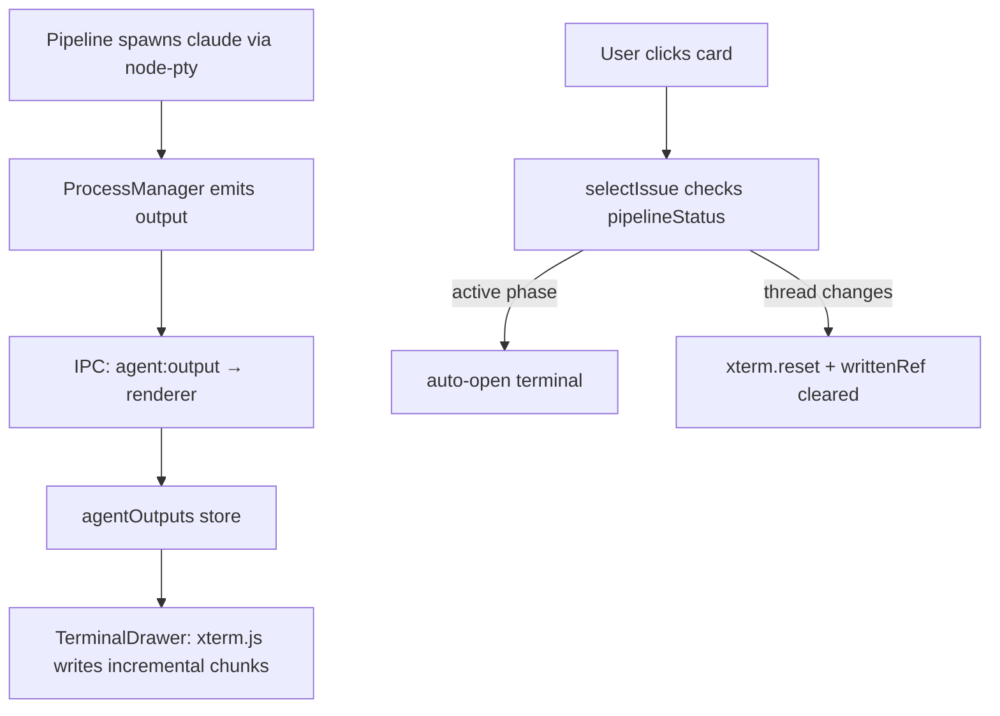

### Affected Components

| Layer | Components |
|-------|------------|
| Frontend | `TerminalDrawer.tsx`, `DashboardView.tsx`, `app-store.ts`, `IssueCard.tsx`, `IssueDetail.tsx` |
| Shared UI | `packages/ui/src/primitives/card.tsx`, `packages/ui/src/IssueCard.tsx`, `packages/ui/src/index.ts` |
| Backend | `apps/desktop/src/main/index.ts` |

### What was done

- [x] **xterm.js integration** — replaced `<pre>` raw text block in `TerminalDrawer` with real `@xterm/xterm` Terminal instance (already installed dep). Renders ANSI colors/cursor movement correctly.
- [x] **Incremental writes** — terminal tracks per-processId written chunk count; only new chunks are written on each store update. No full-replay on every render.
- [x] **Clear on task switch** — `TerminalDrawer` watches `activeThreadId`; when it changes, calls `term.reset()` and clears `writtenRef` so next issue starts fresh.
- [x] **JSON result blob stripped** — `sanitize()` removes `{"type":"result",...}` lines (the `--output-format json` envelope) before writing to xterm; parser metadata is not useful to humans.
- [x] **Auto-open terminal on card click** — `selectIssue` in `app-store.ts` now checks `AGENT_ACTIVE_STATUSES`; if the selected issue has an active pipeline phase, terminal auto-opens.
- [x] **Pulsing dot on active cards** — `IssueCard` adds a small `animate-pulse` dot before the status text when `getStatusBadgeVariant === 'accent'` (planning/reviewing/executing etc.).
- [x] **IssueDetail status badge fixed** — was always `variant="default"` (grey); now uses `getStatusBadgeVariant` for correct color.
- [x] **`getStatusBadgeVariant` exported** from `packages/ui/src/index.ts` so desktop app can import it.
- [x] **Card border radius reduced** — `packages/ui/src/primitives/card.tsx`: `rounded-2xl` → `rounded-lg`.
- [x] **Mission Control: Running Agents moved first** — appears directly after stat cards, before everything else.
- [x] **Mission Control: Projects card removed** — only shown when `projects.length === 0` (first-run onboarding CTA). Hidden once any project is added.
- [x] **Process lifecycle: `before-quit` hook** — `app.on('before-quit')` now calls `processManager?.killAll()` so claude/codex subprocesses are killed on Cmd+Q, not just on window close.
- [x] **TS fix: `processManager` scope** — lifted from inside `createWindow()` to module scope so `before-quit` handler can reference it.
- [x] **Diagnosed orphaned claude processes** — confirmed via `ps aux` that ShipCode Electron stays alive on macOS after window close (macOS doesn't quit on `window-all-closed`). One zombie `(claude)` PID 80360 found — had already exited. The `before-quit` fix prevents future orphans on Cmd+Q.

### Files changed

- `apps/desktop/src/renderer/components/TerminalDrawer.tsx` — full rewrite: xterm.js Terminal, FitAddon, ResizeObserver, incremental writes, clear-on-switch, JSON sanitizer
- `apps/desktop/src/renderer/stores/app-store.ts` — `AGENT_ACTIVE_STATUSES` set + `selectIssue` auto-opens terminal; `processManager` type import; `IssuePipelineStatus` import
- `apps/desktop/src/renderer/components/DashboardView.tsx` — Running Agents first; Projects first-run-only; removed `runningAgentsRef`/`scrollToRunningAgents`/`recentProjects`/`useRef`/`Folder`
- `apps/desktop/src/main/index.ts` — `processManager` to module scope; `app.on('before-quit')` with `processManager?.killAll()`
- `packages/ui/src/primitives/card.tsx` — `rounded-2xl` → `rounded-lg`
- `packages/ui/src/IssueCard.tsx` — `ActiveDot` component; pulsing dot on accent-variant badges
- `packages/ui/src/index.ts` — export `getStatusBadgeVariant` + `StatusBadgeVariant`
- `apps/desktop/src/renderer/components/IssueDetail.tsx` — import + use `getStatusBadgeVariant` for pipeline status badge

### Key decisions

- **Decision:** Use `@xterm/xterm` (already installed) instead of a custom ANSI stripper
  - **Context:** Raw PTY output with ANSI codes was unreadable in `<pre>` block
  - **Rationale:** xterm renders escape codes correctly; no need for a fragile regex stripper
- **Decision:** Strip `{"type":"result",...}` JSON blobs via regex before writing to xterm
  - **Context:** `claude -p --output-format json` outputs a JSON envelope as the last line; shows as unreadable JSON in terminal
  - **Rationale:** Quick fix without changing output format; StreamParser uses `response.rawOutput` independently so stripping from display doesn't break plan parsing
- **Decision:** Projects card only on first run (`projects.length === 0`)
  - **Context:** User has sidebar for project switching; Projects card in Mission Control was redundant
  - **Rationale:** Keeps Mission Control focused on operational status; Projects card stays as onboarding CTA for empty state

### Mistakes and fixes

- **Mistake:** `app.on('before-quit')` referenced `processManager` which was declared inside `createWindow()` → **Fix:** lifted `processManager` to module scope as `let processManager: ProcessManager | null = null`
- **Mistake:** Left `runningAgentsRef` wrapper `<div>` and `</div>` orphan after removing the ref → **Fix:** found and removed the closing `</div>` that caused JSX parse errors

### Next steps

- [ ] **Verify xterm renders planning text** — run a fresh pipeline and confirm the terminal shows actual claude planning output (not just the JSON blob). If only JSON is visible, the issue is PTY output format (claude may not stream text in non-interactive mode).
- [ ] **Consider `--output-format stream-json`** — would give NDJSON events per line, allowing richer display (tool use, assistant text, errors) instead of opaque PTY dump. Requires updating `StreamParser` to handle NDJSON format.
- [ ] **Issue #11 (live terminal)** — still queued; the xterm integration in this session is the foundation; issue #11 may want per-phase progress blocks above the raw terminal.
- [ ] **QA: Cmd+Q kills subprocesses** — verify that quitting the app while a pipeline is running terminates the claude/codex processes.

## Session 22: Defer Worktree Creation to Execution Phase

**Status:** Complete

### System Flow

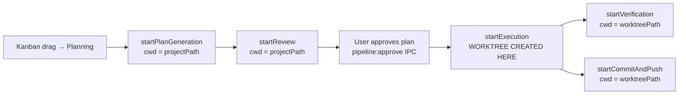

### Affected Components

| Layer | Components |
|-------|------------|
| Pipeline | `packages/pipeline/src/pipeline.ts` — worktree creation moved from `startFromGitHubIssue` to `startExecution` |
| IPC | `apps/desktop/src/main/ipc.ts` — `pipeline:start` no longer creates worktree; now seeds `baseBranch` into context |
| Tests | `packages/pipeline/src/pipeline.test.ts` — added `vi.mock('@shipcode/git')` + `setWorktree` to threads mock |

### What was done

- [x] Identified root cause: `startFromGitHubIssue` and `pipeline:start` IPC both created worktrees before planning began
- [x] Ran 3 rounds of adversarial review (via `benredmond/apex@review-plan` skill) — found and fixed 10+ blocking issues
- [x] Removed worktree creation block from `startFromGitHubIssue` (pipeline.ts)
- [x] Added lazy worktree creation to `startExecution()` with fail-fast error handling (emits `failed` instead of silent fallback)
- [x] Removed worktree creation from `pipeline:start` IPC handler; added `baseBranch: project.defaultBranch` seed so `startExecution` can resolve fork base
- [x] Added class-based `vi.mock('@shipcode/git')` covering all transitive `startExecution` paths (direct calls, autonomous review-approve chain, verification retry chain)
- [x] Added `setWorktree: vi.fn()` to threads mock in `createMockDeps`
- [x] All 54 pipeline tests passing

### Files changed

- `packages/pipeline/src/pipeline.ts` — removed worktree block from `startFromGitHubIssue`; added worktree creation guard at top of `startExecution()` using `context.baseBranch`
- `apps/desktop/src/main/ipc.ts` — `pipeline:start` handler: removed worktree creation, added `baseBranch` to `initializeContext` call
- `packages/pipeline/src/pipeline.test.ts` — added `vi.mock('@shipcode/git')` with class-based `WorktreeManager` stub; added `setWorktree: vi.fn()` to threads mock

### Key decisions

- **Decision:** Fail-fast on worktree creation error in `startExecution` (emit `failed`, not fallback to projectPath)
  - **Context:** OpenRouter executor already refuses to run in `projectPath`; silent fallback causes confusing mid-execution errors
  - **Rationale:** Surfacing `failed` early is cleaner for all executors; behavior change is deliberate

- **Decision:** Use `context.baseBranch` (not `thread.baseBranch` DB read) inside `startExecution`
  - **Context:** Both entry points populate `context.baseBranch` before reaching `startExecution`; DB read was unnecessary and had a null-for-manual-threads bug
  - **Rationale:** In-memory context is always available and correct at this point in the call chain

- **Decision:** Settings (`worktreeRoot`) read at execution time, not pipeline-start time
  - **Context:** Moved the `deps.settings.get()` call into `startExecution`
  - **Rationale:** Slight improvement — if user changes `worktreeRoot` between drag and approval, new setting takes effect; still snapshotted concretely at creation

- **Decision:** Class-based mock for `WorktreeManager` in tests (not `vi.fn().mockImplementation`)
  - **Context:** `vi.fn()` creates an arrow function internally in vitest 4.1.4 which cannot be used with `new`
  - **Rationale:** Classes are proper constructors; class-based mock works correctly with `new WorktreeManager(...)`

### Mistakes and fixes

- **Mistake:** First plan version only listed `ipc.ts` in affected files, missing that the main worktree block is in `startFromGitHubIssue` in `pipeline.ts` → **Fix:** Adversarial review caught this; plan revised to explicitly cover both entry points
- **Mistake:** Plan used `thread?.baseBranch` DB lookup in `startExecution` which is null for manual-mode threads → **Fix:** Switched to `context.baseBranch` which is always set by both entry points
- **Mistake:** Initial `vi.mock` used `vi.fn().mockImplementation(() => ({...}))` which fails with `new` → **Fix:** Switched to class-based mock (`class WorktreeManager { create = vi.fn()... }`)
- **Mistake:** `setWorktree` missing from `createMockDeps` threads mock → **Fix:** Added `setWorktree: vi.fn()` alongside other thread mock methods

### Next steps

- [ ] **Manual QA:** Drag a card to Planning → verify no new directory appears under `~/.shipcode/worktrees/`
- [ ] **Manual QA:** Approve the plan → verify worktree appears before executor output in terminal
- [ ] **Consider preflight check in `pipeline:start`** — if `worktreeRoot` is broken, today the failure surfaces only after planning+review complete (several minutes of model spend). A cheap `WorktreeManager.canCreate()` check at drag time would catch misconfiguration early.
- [ ] **QA checklist items #1 and #5** from SESSION-QUICK-START.md still pending manual testing

## Session 22: Homebrew Cask + Dropdown Fix + Sidebar Collapse UX

**Status:** Complete

### Affected Components

| Layer | Components |
|-------|------------|
| CI/CD | `.github/workflows/release.yml` |
| Docs | `README.md` |
| External repo | `shipshitdev/homebrew-shipcode` — `Casks/shipcode.rb` (created) |
| UI Package | `packages/ui/src/primitives/dropdown-menu.tsx` |
| Frontend | `apps/desktop/src/renderer/components/ProjectSidebar.tsx`, `apps/desktop/src/renderer/components/Titlebar.tsx` |

### What was done

- [x] Added `update-homebrew-cask` job to `release.yml` — fires after `build-desktop-macos`, downloads `.dmg` artifacts, computes SHA256, commits updated cask to `shipshitdev/homebrew-shipcode` on `master`
- [x] Created `shipshitdev/homebrew-shipcode` tap repo and seeded `Casks/shipcode.rb` via GitHub API
- [x] Updated `README.md` install section with `brew tap shipshitdev/shipcode && brew install --cask shipcode` one-liner
- [x] Fixed transparent dropdown menu background — `bg-bg-secondary` → `bg-secondary`, `text-text-primary` → `text-primary`, `bg-bg-hover` → `bg-hover` (stale tokens from session 21 rename missed in dropdown-menu.tsx)
- [x] Moved sidebar collapse toggle to left of sidebar header
- [x] Refactored to hide sidebar rail entirely when collapsed (returns null)
- [x] Moved toggle button to Titlebar permanently — same position regardless of sidebar state, icon flips `PanelLeftClose`/`PanelLeftOpen`

### Files changed

- `.github/workflows/release.yml` — added `update-homebrew-cask` job (needs: build-desktop-macos, ref: master, computes arm/intel SHA256, sed-updates cask, commits)
- `README.md` — new Install section with brew one-liner and CLI npx command
- `packages/ui/src/primitives/dropdown-menu.tsx` — fixed stale `bg-bg-*`/`text-text-*` tokens to `bg-*`/`text-*`
- `apps/desktop/src/renderer/components/ProjectSidebar.tsx` — removed inline toggle button from header; collapsed state returns null (no strip); removed unused `PanelLeftClose`/`toggleSidebar` references
- `apps/desktop/src/renderer/components/Titlebar.tsx` — added persistent toggle button (left slot), `sidebarCollapsed` + `toggleSidebar` from store, `PanelLeftClose`/`PanelLeftOpen` icons

### Key decisions

- **Decision:** Use private tap (`shipshitdev/homebrew-shipcode`) now + plan official `Homebrew/homebrew-cask` submission later
  - **Context:** Official submission requires a real published release with stable download URL; private tap ships immediately
  - **Rationale:** Two-track: private tap for now, submit to official once stable release is cut (notarization already configured)

- **Decision:** `brew install --cask shipshitdev/shipcode/shipcode` (3-part) not `shipshitdev/shipcode` (2-part)
  - **Context:** User asked if 2-part form was possible
  - **Rationale:** Homebrew requires `<user>/<tap>/<cask>` when no prior tap; after `brew tap shipshitdev/shipcode`, the short form `brew install --cask shipcode` works

- **Decision:** Move toggle to Titlebar permanently, hide sidebar rail entirely when collapsed
  - **Context:** User wanted no visible rail when sidebar collapsed; original had button moving to titlebar only when collapsed
  - **Rationale:** Single stable toggle in titlebar means the button never changes position — cleaner than a 48px collapsed strip

### Mistakes and fixes

- **Mistake:** Initial collapsed state rendered a 48px strip (visible rail) → user wanted it fully hidden
  - **Fix:** Reverted collapsed state to `return null`, moved toggle to Titlebar permanently
- **Mistake:** Left `PanelLeftOpen`/`PanelLeftClose`/`toggleSidebar` as unused imports in `ProjectSidebar.tsx` after refactor
  - **Fix:** Removed all unused imports and destructured store values

### Next steps

- [ ] **Pre-flight:** Vincent adds `TAP_GITHUB_TOKEN` to `shipshitdev/shipcode` repo secrets as a fine-grained PAT scoped to `shipshitdev/homebrew-tap` with Contents read/write access — needed for first release to auto-update the cask SHA256
- [ ] **Verify artifact filename** after first macOS release build — confirm electron-builder produces `ShipCode-{version}-arm64.dmg` vs universal; adjust cask `url` line if needed
- [ ] **Official cask submission** — fork `Homebrew/homebrew-cask`, add `Casks/s/shipcode.rb`, open PR once stable release is published
- [ ] **Manual QA** — verify dropdown menus have correct background (no longer transparent)
- [ ] **Manual QA** — verify sidebar collapse/expand toggle in titlebar works; no visible strip when collapsed
- [ ] **Issues #7, #8, #11** — still pending from session 19

## Session 23: Project Pin/Archive/Sort + Dashboard Projects Card Removal + Recent Tasks Subtitle

**Status:** Complete

### System Flow

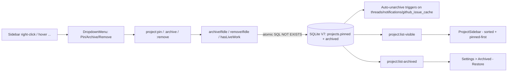

### Affected Components

| Layer | Components |
|-------|------------|
| Data | `packages/db/src/schema.ts` (V7 migration + 4 triggers), `packages/db/src/queries/projects.ts` (listVisible/archiveIfIdle/removeIfIdle/hasLiveWork), `packages/db/src/queries/settings.ts` (projectSortOrder), `packages/db/src/index.ts` + `test-helpers.ts` |
| Shared | `packages/shared/src/types.ts` (Project.pinned/archived, AppSettings.projectSortOrder), `constants.ts`, `ipc-channels.ts` (5 new channels) |
| Git | `packages/git/src/worktree.ts` (WorktreeManager.remove returns structured result) |
| UI package | `packages/ui/package.json` (+react-dropdown-menu), `primitives/dropdown-menu.tsx` (new), `src/index.ts` (6 icon exports) |
| Main process | `apps/desktop/src/main/ipc.ts` (5 new handlers, fail-closed project:remove) |
| Renderer | `apps/desktop/src/renderer/components/ProjectSidebar.tsx` (sort dropdown + context menu), `DashboardView.tsx` (Projects card removed, Recent Tasks subtitle), `SettingsSidebar.tsx` (Archived entry), `SettingsPanel.tsx` (Archived section), `stores/app-store.ts` (SettingsSection union) |
| Tests | `packages/db/src/queries/projects.test.ts` (22 tests — 15 new) |

### What was done

- [x] **Planning — 7 rounds of Codex adversarial review** (plan at `~/.claude-genfeedai/plans/delightful-wondering-hoare.md`) before a single line was written:
  - Round 1: migration wiring, IPC contract mismatch, React hook placement, missing icon exports
  - Round 2: CLI breakage from repurposing `list()`, archive-vs-navigation inconsistency
  - Round 3: missing `project:remove` live-work guard, archive not renderer-wide, V7 swallowed all ALTER errors
  - Round 4: `hasLiveWork` TOCTOU race → atomic `archiveIfIdle` UPDATE ... NOT EXISTS, addProject missing new query-key invalidations, test-helpers stopped at V6
  - Round 5: auto-unarchive missed `github_issue_cache`, `project:remove` swallowed worktree cleanup errors
  - Round 6: live-work predicate missed claimed GitHub issues (orphaned-claim case)
  - Round 7: `removeIfIdle` still racy via deferred BEGIN → moved idle predicate into DELETE statement; `WorktreeManager.remove()` swallowed errors at the primitive level → rewrote to return `{ worktreeRemoved, branchDeleted, error? }`; wrong column/state names (`phase`→`status`, `done`→`completed`); narrow `AFTER UPDATE OF claimed_at` trigger for refreshed issues
- [x] V7 migration: `pinned`/`archived` columns with idempotent `addColumnIfMissing` (only catches duplicate-column errors), PRAGMA `table_info` verification before writing `schema_version`, 4 auto-unarchive triggers (threads/notifications/github_issue_cache INSERT + github_issue_cache UPDATE OF claimed_at with narrow NULL→non-NULL WHEN clause)
- [x] Wired `migrateV7` into both `getDatabase()` and `createTestDb()` so tests exercise the new schema
- [x] `ProjectQueries` — `list()` untouched (full registry for CLI), new `listVisible()`/`listArchived()`/`getByPath()`/`pin()`/`unarchive()`/`hasLiveWork()`, atomic `archiveIfIdle()` + `removeIfIdle()` using `WHERE NOT EXISTS` SQL predicates, idempotent `add()` that restores archived rows instead of hitting UNIQUE constraint
- [x] `WorktreeManager.remove()` now returns structured result; `.catch(() => {})` path in `project:remove` replaced with fail-closed semantics (collect worktree failures, throw before DB DELETE)
- [x] 5 new IPC channels: `project:list-visible`, `project:list-archived`, `project:pin`, `project:archive`, `project:unarchive`
- [x] `project:archive` handler uses `archiveIfIdle` + throws on idle-guard failure; `project:remove` has fast `hasLiveWork` pre-check → worktree cleanup fail-closed → atomic `removeIfIdle` as final guard
- [x] Added `@radix-ui/react-dropdown-menu@2.1.15` + new `DropdownMenu` primitive + exported 6 lucide icons (Archive, ArrowUpDown, MoreHorizontal, Pin, PinOff, Trash2)
- [x] `ProjectSidebar`: switched query key `['projects']` → `['projects-visible']`, sort dropdown (Recently used / Alphabetical / Date added) in PROJECTS header, pinned projects float to top with filled pin icon, hover `...` + right-click context menu → Pin/Unpin, Archive, Remove (separator + destructive), `invalidateProjects()` helper invalidates all three query keys, `addProject` mutation updated to use helper, error alerts surface IPC hasLiveWork guards
- [x] `DashboardView`: removed projects query + addProject mutation + Projects card entirely (even the empty-state CTA)
- [x] `SettingsSidebar` + `app-store.ts`: added `'archived'` section; `SettingsPanel.tsx` has top-level archived-projects query with `enabled: settingsSection === 'archived'` (hook-order safe), unarchive mutation, Restore buttons
- [x] 22 DB tests total (15 new): archiveIfIdle/removeIfIdle success + blocked paths, completed thread non-blocker (regression guard for wrong column names), listVisible/list/listArchived semantics, add-restores-archived, all 4 triggers (thread/notification/github-issue INSERT + claim UPDATE), metadata-update non-trigger, orphaned-claim guard, pin toggle, archive clears pin
- [x] Full typecheck green (14/14 packages); full test suite green (10/10 packages, 89 DB / 54 pipeline / 225 agents / 22 desktop)
- [x] **Follow-up**: Added second-line subtitle to Recent Tasks rows (`projectName · phase`) so its list matches Recent Activity's two-line row height; top-aligned phase chip and time column

### Files changed

- `packages/db/src/schema.ts` — new `migrateV7` with atomic column add + PRAGMA verification + 4 triggers
- `packages/db/src/index.ts` — imports and invokes `migrateV7`
- `packages/db/src/test-helpers.ts` — invokes `migrateV7` in `createTestDb`
- `packages/db/src/queries/projects.ts` — rewritten with visibility layer, atomic guards, and idempotent add
- `packages/db/src/queries/projects.test.ts` — expanded from 7 to 22 tests
- `packages/db/src/queries/settings.ts` — added `projectSortOrder` parsing
- `packages/git/src/worktree.ts` — `WorktreeManager.remove()` returns structured result with error distinction
- `packages/shared/src/types.ts` — `Project.pinned`, `Project.archived`, `AppSettings.projectSortOrder`
- `packages/shared/src/constants.ts` — `projectSortOrder: 'recent'` in `DEFAULT_SETTINGS`
- `packages/shared/src/ipc-channels.ts` — 5 new project channels (`list-visible`, `list-archived`, `pin`, `archive`, `unarchive`)
- `packages/ui/package.json` — `@radix-ui/react-dropdown-menu: 2.1.15`
- `packages/ui/src/primitives/dropdown-menu.tsx` — new Radix wrapper
- `packages/ui/src/index.ts` — DropdownMenu + 6 lucide icons
- `apps/desktop/src/main/ipc.ts` — 5 new handlers, `project:remove` rewritten to fail-closed
- `apps/desktop/src/renderer/components/ProjectSidebar.tsx` — sort dropdown + pin icons + context menu + mutations
- `apps/desktop/src/renderer/components/DashboardView.tsx` — removed Projects card, added subtitle to Recent Tasks
- `apps/desktop/src/renderer/components/SettingsSidebar.tsx` — Archived section entry
- `apps/desktop/src/renderer/components/SettingsPanel.tsx` — Archived section block with Restore buttons
- `apps/desktop/src/renderer/stores/app-store.ts` — `'archived'` in SettingsSection union
- `bun.lock` — new Radix dropdown-menu package

### Key decisions

- **Decision:** Archive is a "sidebar-only visibility filter" — not a hard gate across every IPC path
  - **Context:** Codex pressed hard for "renderer-wide archive semantics" (block navigation, hide from activity, etc.) — significant scope expansion
  - **Rationale:** User said "archived projects hidden from sidebar, if reloaded bring it back". Navigation from Activity/notifications/deep links stays functional. Invariant preserved via atomic live-work guards + DB triggers that auto-unarchive when new work appears, so archived projects with active work can never exist

- **Decision:** Atomic DELETE with NOT EXISTS subqueries for `removeIfIdle` instead of transactional hasLiveWork + DELETE
  - **Context:** `packages/db/src/utils.ts:11-23` shows `transaction()` uses deferred BEGIN — no write lock during read phase, so a check-then-act pattern has a TOCTOU race
  - **Rationale:** Making the idle predicate part of the DELETE statement itself collapses check and mutation into one atomic SQL operation. Same pattern used for `archiveIfIdle`

- **Decision:** Auto-unarchive trigger on `github_issue_cache.claimed_at` narrowly scoped to NULL→non-NULL transition
  - **Context:** If the trigger fires on any UPDATE, a GitHub polling refresh would immediately unarchive any project with cached issues (defeats archive-with-polling)
  - **Rationale:** `claimed_at` going NULL → non-NULL means "new work started"; metadata refreshes (labels, title, assignee) leave `claimed_at` untouched and don't fire the trigger. Preserves user intent when polling is on

- **Decision:** `ProjectQueries.list()` stays as the full registry; new `listVisible()` for sidebar
  - **Context:** CLI flows (`apps/cli/src/commands/{run,onboard,status}.ts`) call `queries.projects.list()` directly to find the project for the current cwd. Filtering archived would break CLI
  - **Rationale:** `list()` is a canonical registry lookup, not a sidebar-specific helper. Renderer gets a new dedicated channel; CLI is untouched

- **Decision:** Fail-closed `project:remove` requires rewriting `WorktreeManager.remove()` at the primitive layer
  - **Context:** The IPC handler's `.catch(() => {})` was a symptom — the underlying `remove()` method itself wrapped every git operation in `try {}` and swallowed real errors. Adding a try/catch at the caller wouldn't see anything to catch
  - **Rationale:** Return `{ worktreeRemoved, branchDeleted, error? }` from the primitive; distinguish "already gone" from real failures via error message regex (`not a working tree`, `not found`, etc.); let the caller decide whether to proceed or abort

### Mistakes and fixes

- **Mistake:** Initial trigger test forgot that `notifications` has a NOT NULL `thread_id` FK — test failed with `NOT NULL constraint failed: notifications.thread_id`
  - **Fix:** Seed a terminal (`status='completed'`) thread first, re-archive, then insert the notification referencing that thread. Terminal threads don't count as live work so `archiveIfIdle` still succeeds

- **Mistake:** Plan initially said `phase NOT IN ('done','failed','idle')` — wrong column name and wrong terminal state. Repo uses `threads.status` (not `phase`) and `completed` (not `done`)
  - **Fix:** Codex round 7 caught it; used `replace_all` to fix every snippet in the plan before implementation. Added a regression test ("completed threads do NOT block archive/remove") to guard against the mistake recurring

- **Mistake:** `@shipcode/db` test `'unique path constraint throws on duplicate'` failed because the new idempotent `add()` no longer throws on duplicate path
  - **Fix:** Replaced with `'add() is idempotent: re-adding same path returns existing row'` + `'add() restores an archived project when re-adding its path'` — captures the new contract explicitly

- **Mistake:** Codex adversarial review stalled twice during foreground runs (>10 minutes no log activity)
  - **Fix:** Cancelled via `codex-companion cancel <id>` and re-ran; used `/codex:adversarial-review` command directly instead of the `rescue` forwarder for a fresh runtime

### Next steps

- [ ] **Manual smoke test:** `bun run dev` → verify sort dropdown persists across restart, pin/unpin/archive/remove flows, context menu + right-click, Settings → Archived → Restore round-trip
- [ ] **Manual smoke test:** start a pipeline on a project then try to archive or remove it → confirm the `hasLiveWork` error alert fires and the project stays
- [ ] **Manual smoke test:** archive a project, then add its path via `+ Add Repository` → confirm `add()` restores it rather than throwing
- [ ] **CLI regression check:** `cd` into an archived project directory and run `shipcode status` — should still see the project (CLI uses `list()`, not the filtered IPC)
- [ ] **Commit the changes** — logical split suggested: (1) V7 migration + query layer + shared types, (2) IPC handlers + WorktreeManager.remove, (3) UI package dropdown-menu + icons, (4) ProjectSidebar + DashboardView + SettingsPanel, (5) tests
- [ ] **Still pending from session 22:** `TAP_GITHUB_TOKEN` fine-grained PAT (`shipshitdev/homebrew-tap`, Contents read/write), first-release artifact filename verification, official cask submission

## Session 24: Splash Screen + Custom App Menu

**Status:** Complete

### Affected Components

| Layer | Components |
|-------|------------|
| Main process | `apps/desktop/src/main/index.ts` |
| HTML entry | `apps/desktop/index.html` |
| Renderer | `apps/desktop/src/renderer/App.tsx` |

### What was done

- [x] Added `backgroundColor: '#050607'` + `show: false` to BrowserWindow; window now reveals via `ready-to-show` — eliminates white native frame flash
- [x] Added inline `<style>html,body,#root{background:#050607}</style>` to `index.html` — eliminates white flash before app.css loads
- [x] Replaced `return null` in `App.tsx` (while settings fetch) with a styled splash: thin spinning ring + "SHIPCODE" wordmark + fade-in animation
- [x] Replaced default Electron menu with custom `Menu.buildFromTemplate`: ShipCode app menu, Edit (copy/paste), Window, Community
- [x] Community menu: Star on GitHub, Fork on GitHub, @shipshitdev on X, ShipShitShow on YouTube — all open via `shell.openExternal`

### Files changed

- `apps/desktop/src/main/index.ts` — added `backgroundColor`, `show: false`, `ready-to-show` handler; imported `Menu` + `shell`; replaced `app.whenReady().then(createWindow)` with full menu setup
- `apps/desktop/index.html` — inline `<style>` for body background
- `apps/desktop/src/renderer/App.tsx` — replaced `return null` with animated splash component

### Key decisions

- **Decision:** Three-layer approach (native bg + inline HTML style + React loading state) rather than a single fix
  - **Context:** White flash can originate at three different points: before HTML loads (native window), before CSS loads (HTML parse), before React hydrates (JS execution)
  - **Rationale:** Each layer plugs a different gap; all three together guarantee no white at any stage

- **Decision:** Wordmark-only splash (no logo image), thin spinner ring, no progress bar
  - **Context:** IPC settings fetch is < 100 ms; a heavy splash would feel slower than the actual load
  - **Rationale:** Minimal and elegant — dark bg with a subtle spinner communicates "loading" without implying heavy work

- **Decision:** `Community` menu label for GitHub/X/YouTube links
  - **Context:** Standard macOS convention; user wanted star/fork/social links accessible from menu bar
  - **Rationale:** Groups all social/community actions in one logical submenu; `shell.openExternal` opens in default browser

### Next steps

- [ ] **Manual QA** — verify no white flash on cold start (`bun run dev`)
- [ ] **Manual QA** — verify spinner + wordmark appear briefly before main layout loads
- [ ] **Manual QA** — verify Community menu items open correct URLs in browser
- [ ] **Manual QA** — verify "ShipCode" appears as app name in menu bar (not "Electron")
- [ ] Confirm GitHub repo URL `https://github.com/shipshitdev/shipcode` is correct before shipping
- [ ] **Still pending from earlier sessions:** QA #1 (nested Edit PRD modal stacking), QA #5 (Generate with AI → Create & Plan E2E), useWorktree cleanup (ipc.ts + ipc-channels.ts)

## Session 25: Activity Bugs + Inbox Group/Sort + Issue Detail Full-Page Toggle

**Status:** Complete

### System Flow

```mermaid
flowchart TD
    ISSUE[Click Kanban card] --> PANEL[420px panel — IssueDetail]
    PANEL -->|Maximize2 button| FULL[Full-page — two-column layout]
    FULL -->|Minimize2 / Escape / Back to board| PANEL
    PANEL -->|X / Escape| CLOSE[Closed]

    INBOX[InboxView] -->|Group button| GROUPED[Sections by kind]
    INBOX -->|Sort button| SORTED[Newest / Oldest]
    INBOX -->|Go to issue| NAV[selectProject + selectThread → IssueDetail opens]
```

### Affected Components

| Layer | Components |
|-------|------------|
| Frontend | `IssueDetail.tsx`, `InboxView.tsx`, `ActivityView.tsx`, `App.tsx` |
| State | `app-store.ts` — `issueDetailExpanded` flag |
| UI package | `packages/ui/src/index.ts` — Layers, Maximize2, Minimize2 icons |

### What was done

- [x] **Activity table broken** — replaced `<ul><li>` with proper `Table`/`TableRow`/`TableCell` primitives
- [x] **Activity click not opening issue** — added `selectThread(entry.threadId)` alongside existing `selectProject(entry.projectId)`
- [x] **Inbox empty bug** — IssueDetail was auto-dismissing ALL notifications on open, including `awaiting_approval`; added `n.kind !== 'awaiting_approval'` guard
- [x] **IssueDetail full-page toggle** — added `issueDetailExpanded` to Zustand store; resets in all nav actions; passes `expanded` prop to `IssueDetail`
- [x] **App.tsx layout** — main content uses `hidden` (not unmount) when expanded to preserve Kanban state; IssueDetail container switches `w-[420px]` ↔ `flex-1`
- [x] **IssueDetail two-column expanded layout** — left column (`flex-1 overflow-y-auto`) + right sidebar (`w-72`) with agents/pipeline; PRD has no max-h cap; Escape collapses instead of closes; Back breadcrumb collapses
- [x] **Inbox group/sort** — `groupBy: 'none' | 'kind'` + `sortOrder: 'newest' | 'oldest'` via useState; non-mutating sort with correct `new Date().getTime()` comparator; color-coded sections in priority order
- [x] **Inbox "Go to issue"** — now calls both `selectProject` + `selectThread` (matches DashboardView pattern)
- [x] Exported `Layers`, `Maximize2`, `Minimize2` from `@shipcode/ui`
- [x] Added adversarial review via `codex exec` before implementation — 14 issues caught and addressed in plan

### Files changed

- `packages/ui/src/index.ts` — added Layers, Maximize2, Minimize2 re-exports
- `apps/desktop/src/renderer/stores/app-store.ts` — added `issueDetailExpanded` flag + `toggleIssueDetailExpanded` action; reset in all nav actions
- `apps/desktop/src/renderer/App.tsx` — conditional layout (hidden vs flex-1 for IssueDetail); passes `expanded` prop
- `apps/desktop/src/renderer/components/ActivityView.tsx` — fixed table markup; added selectThread to click handler
- `apps/desktop/src/renderer/components/IssueDetail.tsx` — full rewrite: expanded/panel dual layout, toggle button, Escape behavior, auto-dismiss fix, shared render sections
- `apps/desktop/src/renderer/components/InboxView.tsx` — group/sort state + UI controls; correct date comparator; selectThread in navigation

### Key decisions

- **Decision:** Use CSS `hidden` class (not unmount) to hide Kanban when IssueDetail is expanded
  - **Context:** Unmounting would reset Kanban scroll position and React Query cache
  - **Rationale:** Same component instance stays mounted; only visibility changes

- **Decision:** `issueDetailExpanded: issue ? s.issueDetailExpanded : false` in selectIssue
  - **Context:** Preserve expanded mode when switching between issues; reset when closing
  - **Rationale:** UX expectation — if user is in full-page mode, switching issues should stay full-page

- **Decision:** Escape key collapses (not closes) in expanded mode
  - **Context:** User may want to see Kanban context without losing their issue selection
  - **Rationale:** Two-step dismissal mirrors Paperclip and standard modal-collapse patterns

- **Decision:** Auto-dismiss filter skips `awaiting_approval` kind
  - **Context:** These require explicit user action; auto-dismissing them cleared actionable inbox items
  - **Rationale:** Only informational notifications (completed, failed, verification_exhausted) should clear on view

### Mistakes and fixes

- **Mistake:** Plan originally had `b.createdAt - a.createdAt` sort comparator (works for numbers, not ISO strings → NaN)
  - **Fix:** Corrected to `new Date(b.createdAt).getTime() - new Date(a.createdAt).getTime()` in both plan and implementation

- **Mistake:** Plan used `GroupBy` icon from lucide-react (doesn't exist)
  - **Fix:** Corrected to `Layers` icon in adversarial review before implementation

- **Mistake:** Store `toggleIssueDetailExpanded` implementation missing from initial store edit
  - **Fix:** Added `toggleIssueDetailExpanded: () => set((s) => ({ issueDetailExpanded: !s.issueDetailExpanded }))` to the create block

### Next steps

- [ ] **Manual QA** — `bun run dev`, click Kanban card → panel opens (420px)
- [ ] **Manual QA** — click Maximize2 → full-page, two-column, Kanban hidden
- [ ] **Manual QA** — press Escape in full-page → collapses to panel (does NOT close issue)
- [ ] **Manual QA** — press Escape in panel → closes issue
- [ ] **Manual QA** — click "← Back to board" → collapses to panel, issue still selected
- [ ] **Manual QA** — plan history accordion state persists through panel ↔ full-page toggle (same component instance)
- [ ] **Manual QA** — Inbox Group button → sections appear, Sort button → order reverses
- [ ] **Manual QA** — "Go to issue" in Inbox → opens IssueDetail panel for that thread
- [ ] **Manual QA** — Activity table renders properly; clicking row opens IssueDetail
- [ ] Still pending: QA #1 (nested Edit PRD modal stacking), QA #5 (Generate with AI E2E)
- [ ] Cask release work (mentioned at session start, deferred)

## Session 26: Custom App Icon

**Status:** Complete

### Affected Components

| Layer | Components |
|-------|------------|
| Assets | `apps/desktop/resources/icon.svg`, `icon.icns`, `icon.png` |
| Build | `apps/desktop/resources/make-icons.sh` |
| Config | `electron-builder.yml` (no changes needed — auto-discovers `resources/`) |

### What was done

- [x] Identified no icon assets existed (app was using default Electron atom icon)
- [x] Confirmed `electron-builder.yml` uses `buildResources: resources` — standard location
- [x] Created `apps/desktop/resources/icon.svg` — `</>` code glyph on dark `#0d1117` rounded square, sky-blue → indigo gradient stroke
- [x] Created `apps/desktop/resources/make-icons.sh` — converts SVG → full macOS iconset → `icon.icns` + `icon.png` using `rsvg-convert` + `iconutil`
- [x] Generated `icon.icns` (460KB, all retina sizes) and `icon.png` (512×512 for Linux)

### Files changed

- `apps/desktop/resources/icon.svg` - new SVG icon source (dark bg, `</>` in sky-blue/indigo gradient)
- `apps/desktop/resources/icon.icns` - generated macOS icon (all sizes)
- `apps/desktop/resources/icon.png` - generated Linux icon (512×512)
- `apps/desktop/resources/make-icons.sh` - regeneration script

### Key decisions

- **Decision:** Used `</>` code glyph as icon symbol
  - **Context:** ShipCode is a developer tool for AI-driven code pipelines
  - **Rationale:** Universal "code" symbol, clean at small sizes, distinctive vs generic rockets/gears
- **Decision:** SVG as source of truth with shell-script conversion
  - **Context:** Need ICNS for macOS, PNG for Linux
  - **Rationale:** SVG is infinitely scalable and editable; `rsvg-convert` + `iconutil` are macOS-native

### Next steps

- [ ] Verify icon appears correctly in the macOS dock when running `bun run dev`
- [ ] Optionally refine design (colors, add ship/rocket element, adjust stroke weight)
- [ ] Run `bun run build` to confirm electron-builder packages the icon correctly

## Session 31: Terminal UX — Output Isolation, Tabs, Skeleton, Persistent Header

**Status:** Complete

### System Flow

```mermaid
flowchart TD
    PHASE[pipeline:phase event] -->|sets terminalThreadId| STORE[app-store terminalThreadId]
    AGENT_STATE[agent:state running event] -->|mapProcessToThread| STORE2[processToThread map]
    STORE2 -->|filter| TERMINAL[TerminalDrawer write loop]
    STORE -->|drives| TABS[task tabs in header]
    STORE -->|drives| SKELETON[skeleton while transitioning]
    PINNED[pinnedIssue state] -->|persists header| HEADER[terminal header]
    ACTIVE_ISSUE[activeIssue] -->|updates when non-null| PINNED
```

### Affected Components

| Layer | Components |
|-------|------------|
| Frontend | `TerminalDrawer.tsx`, `app-store.ts`, `useIpc.ts` |

### What was done

- [x] Added `processToThread: Record<string, string>` state to app-store with `mapProcessToThread` action
- [x] In `useIpc.ts` `agent:state: running` handler: associates processId with `terminalThreadId` at time of spawn
- [x] In `TerminalDrawer.tsx` write loop: skips processIds whose mapped thread ≠ current `terminalThreadId` (output isolation)
- [x] Added `pinnedIssue` state in TerminalDrawer — updates only when `activeIssue` is non-null + syncs from `githubIssues` when `terminalThreadId` changes; header stays populated when navigating to Dashboard/Costs
- [x] Added running task tabs — shows `#N` tab buttons for all issues with active pipeline statuses; clicking switches both `terminalThreadId` and `selectIssue`; tabs only shown when >1 running tasks
- [x] Added skeleton overlay — absolute-positioned over xterm container, fades away when first agent output or terminal event arrives for the thread
- [x] Fixed `eventsWrittenRef` reset on thread switch to also clear `isTransitioning` when events arrive

### Files changed

- `apps/desktop/src/renderer/stores/app-store.ts` — added `processToThread` state + `mapProcessToThread` action; `selectProject` resets `processToThread: {}`
- `apps/desktop/src/renderer/hooks/useIpc.ts` — added `mapProcessToThread` to destructure + dep array; in `agent:state: running` calls `mapProcessToThread(data.processId, tid)`
- `apps/desktop/src/renderer/components/TerminalDrawer.tsx` — output isolation filter; `pinnedIssue` state; task tabs JSX; skeleton overlay JSX; `processToThread` added to write loop deps

### Key decisions

- **Decision:** Use `terminalThreadId` (not `activeThreadId`) as the isolation key
  - **Context:** User navigates to Costs/Activity which sets `activeIssue: null` and clears `activeThreadId`
  - **Rationale:** `terminalThreadId` only changes when a pipeline phase starts or user clicks a tab — stable while navigating
- **Decision:** Heuristic processId→threadId mapping via `agent:state: running` timing
  - **Context:** `agent:output` events carry no threadId; can't reliably parse threadId from PTY output
  - **Rationale:** `pipeline:phase` sets `terminalThreadId` just before spawning the process, so `terminalThreadId` at `agent:state: running` time is the correct association
- **Decision:** Tabs only shown when >1 running tasks
  - **Context:** Most of the time only one task runs; showing a single tab wastes header space
  - **Rationale:** Clean default; tabs appear only when needed for disambiguation

### Next steps

- [ ] Test output isolation with two issues running in parallel to verify only the correct process output appears per tab
- [ ] Consider clearing `processToThread` entries for exited processes to prevent stale entries accumulating across sessions
- [ ] The `agent:state` IPC event must carry `data.processId` — verify this field is actually emitted by the main process; if not, the mapping will silently never fire
