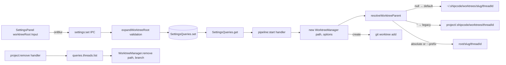
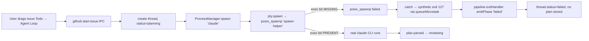
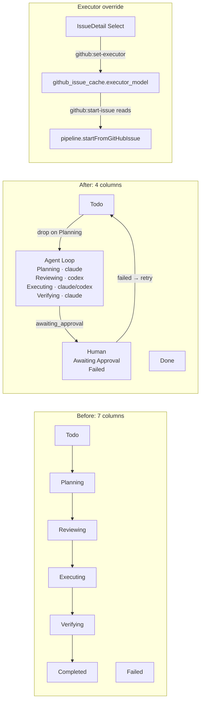
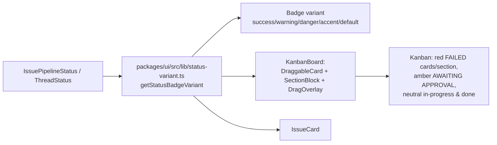
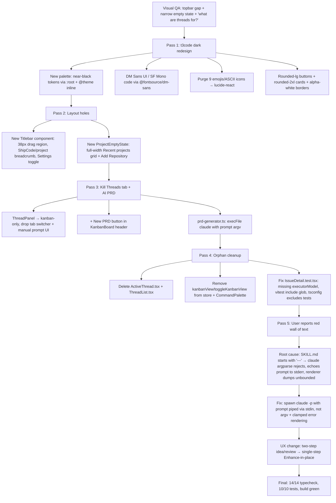
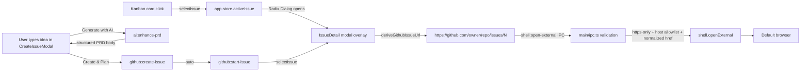

```mermaid
flowchart LR
    USER[User drafts PRD idea] --> MODAL[CreatePRDModal - dual mode]
    MODAL -->|pre-populated PRD_TEMPLATE| VALIDATE[bodyHasRequiredPrdSections gate]
    VALIDATE -->|required sections present| CREATE[github:create-issue IPC]
    CREATE --> GHCLI[GhCli.createIssue -> spawnWithStdin]
    GHCLI --> GH[gh issue create --body-file -]
    GH --> ISSUE[GitHub issue body IS the PRD]
    ISSUE --> CACHE[github_issue_cache upsert]
    CACHE --> KANBAN[Kanban card]
    KANBAN --> DETAIL[IssueDetail renders body as PRD]
    DETAIL --> EDIT[Edit PRD button]
    DETAIL --> REFRESH[Refresh from GitHub button]
    EDIT --> EDITIPC[github:edit-issue-body IPC]
    EDITIPC --> EDITGH[gh issue edit N --body-file -]
    EDITGH --> ISSUE
    REFRESH --> LISTGH[github:refresh-issues re-fetches bodies]
    LISTGH --> CACHE
    ISSUE --> PIPELINE[pipeline.ts:581 feeds body to planner verbatim]
```

# 2026-04-10 — ShipCode: Docs Migration + Vercel Deployment + Release Automation + Configurable Worktree Root + PRD Architecture + Mandatory-GitHub Refactor + Kanban Status Colors + 4-Column Kanban Refactor + Per-Issue Executor Dropdown + IssueDetail Dialog Overlay + AI-First CreateIssueModal

## Session 1: Nextra 4 docs migration, `/docs` deployment, and release workflow

**Status:** Complete

### System Flow

```mermaid
flowchart LR
    DOCS[apps/docs Nextra 4 content] --> BUILD[DOCS_BASE_PATH=/docs bun run build]
    BUILD --> OUT[apps/docs/out]
    OUT --> SYNC[scripts/sync-docs-to-web.sh]
    SYNC --> PUBLIC[apps/web/public/docs]
    PUBLIC --> WEBBUILD[apps/web static export]
    WEBBUILD --> VERCEL[shipcode-web Vercel project]
    VERCEL --> DOMAIN[shipcode.shipshit.dev]
    DOMAIN --> DOCSPATH[/docs]
```

### Affected Components

| Layer | Components |
|-------|------------|
| Docs | `apps/docs/` — migrated from legacy Nextra `pages/` config to Nextra 4 App Router + `content/` tree |
| Web | `apps/web/` — serves embedded static docs from `public/docs`, deploys as `shipcode-web` |
| Deploy | `scripts/sync-docs-to-web.sh`, `package.json`, `.github/workflows/release.yml`, Vercel project/domain, Route53 record |

### What was done

- [x] Fixed docs startup by replacing stale Nextra `theme` / `themeConfig` config with Nextra 4 App Router layout.
- [x] Added `dev:docs` and moved docs default dev port to `3101` to avoid the local `3001` conflict.
- [x] Migrated docs content from `apps/docs/pages/` to `apps/docs/content/`.
- [x] Added App Router files for Nextra docs rendering: `app/layout.tsx`, `app/[[...mdxPath]]/page.tsx`, and `mdx-components.tsx`.
- [x] Configured docs to build with `DOCS_BASE_PATH=/docs`.
- [x] Deployed the main web app to Vercel project `shipcode-web`.
- [x] Added `shipcode.shipshit.dev` to the Vercel project and created Route53 `A shipcode.shipshit.dev -> 76.76.21.21`.
- [x] Removed the unused standalone `shipcode-docs` Vercel project after choosing single-site deployment.
- [x] Added `scripts/sync-docs-to-web.sh` and `sync:docs` / `deploy:web` scripts so docs are embedded into the web bundle reproducibly.
- [x] Updated release workflow with a `deploy-web` job that syncs docs and deploys `shipcode-web` via Vercel.

### Files changed

- `apps/docs/next.config.mjs` — Nextra 4 config, `/docs` base path support, static export.
- `apps/docs/app/layout.tsx` — Nextra docs theme layout using `getPageMap()`.
- `apps/docs/app/[[...mdxPath]]/page.tsx` — catch-all MDX docs route.
- `apps/docs/mdx-components.tsx` — docs theme MDX component wiring.
- `apps/docs/content/` — migrated docs content and `_meta.tsx` files.
- `apps/docs/theme.config.tsx` — Nextra 4-compatible theme config.
- `apps/docs/package.json` — docs dev port and missing type dependency updates.
- `apps/web/public/docs/` — embedded exported docs bundle for `/docs`.
- `apps/web/vercel.json` — Vercel output directory config.
- `apps/web/package.json` — isolated web deploy dependency cleanup.
- `apps/web/next.config.ts` — static export config cleanup.
- `apps/web/tsconfig.json` — self-contained TypeScript config for isolated Vercel build.
- `scripts/sync-docs-to-web.sh` — repeatable docs export/sync script.
- `package.json` — added `dev:docs`, `sync:docs`, and `deploy:web`.
- `.github/workflows/release.yml` — added production web deployment job.

### Key decisions

- **Decision:** Serve docs from the same `shipcode-web` Vercel project instead of proxying a separate `shipcode-docs` deployment.
  - **Context:** Static export with `basePath` generated `/docs` asset URLs but did not emit a physical `out/docs/` tree for the standalone docs project to serve directly.
  - **Rationale:** Embedding `apps/docs/out` into `apps/web/public/docs` makes `shipcode.shipshit.dev/docs` reliable without CloudFront path routing or a second Vercel origin.

- **Decision:** Keep `DOCS_BASE_PATH=/docs` as part of the sync script.
  - **Context:** Nextra-generated asset links need the `/docs/_next/...` prefix when served under the web app’s `/docs` subtree.
  - **Rationale:** The script prevents manual deploys from forgetting the base path.

- **Decision:** Delete the unused `shipcode-docs` Vercel project.
  - **Context:** It was created while exploring a two-origin `/docs` proxy deployment.
  - **Rationale:** The final architecture is single-site, so keeping the stale project would create confusion.

### Mistakes and fixes

- **Mistake:** Initial docs app used old Nextra config keys (`theme`, `themeConfig`) that Nextra 4 rejects -> **Fix:** Migrated to App Router layout and current Nextra docs theme API.
- **Mistake:** Tried a separate docs Vercel origin for `/docs`, but static export did not publish a standalone `/docs` path tree -> **Fix:** Embedded the docs export into `apps/web/public/docs`.
- **Mistake:** Vercel project preset/output settings initially treated apps as generic projects and looked for `public` -> **Fix:** Added app-level `vercel.json` output configuration and ultimately used static export output under the web project.
- **Mistake:** AWS credentials were stale after key rotation -> **Fix:** User updated default AWS credentials; verified `aws sts get-caller-identity` before Route53 changes.

### Next steps

- [ ] Add `VERCEL_TOKEN` and `VERCEL_ORG_ID` secrets in GitHub Actions if they are not already configured.
- [ ] Verify the next GitHub Release runs the new `deploy-web` job successfully.
- [ ] Consider adding a CI check that fails if docs content changes without a refreshed `apps/web/public/docs` bundle.

## Session 2: Configurable worktree root (`~/.shipcode/worktrees` default) + WorktreeManager API refactor

**Status:** Complete

### System Flow



### Affected Components

| Layer | Components |
|-------|------------|
| Shared | `packages/shared/src/types.ts`, `constants.ts`, new `worktree-path.ts` helper (expandWorktreeRoot, projectSlug, resolveWorktreeParent), re-exported from `index.ts` |
| DB | `packages/db/src/queries/settings.ts` — fixed null-serialization bug + worktreeRoot read/validate |
| Git | `packages/git/src/worktree.ts` — WorktreeManagerOptions; `remove(path, branch)` path-as-truth API; `list()` rewritten to filter by `shipcode/*` branch prefix |
| Desktop IPC | `apps/desktop/src/main/ipc.ts` — settings threaded into pipeline:start; project:remove now cleans up worktrees |
| Desktop UI | `apps/desktop/src/renderer/components/SettingsPanel.tsx` — new Worktree Location section with inline error display |
| Tests | new `packages/shared/src/worktree-path.test.ts` (18 tests); extended `packages/db/src/queries/settings.test.ts` (+6 tests) |

### What was done

- [x] Wrote plan at `/Users/decod3rs/.claude-genfeedai/plans/piped-dreaming-horizon.md` in plan mode.
- [x] Ran an adversarial review pass via codex-rescue; it stalled, so cancelled and folded the captured finding (remove/list recompute-by-threadId is latent orphan bug) + manual audit into the plan revision.
- [x] Added `AppSettings.worktreeRoot: string | null` with semantics: `null` = default (`~/.shipcode/worktrees`), `''` = legacy project-local, absolute or `~`-prefix = custom.
- [x] Created shared `worktree-path.ts` helper with `expandWorktreeRoot`, `projectSlug` (basename + sha256[:6]), `resolveWorktreeParent`.
- [x] Fixed `SettingsQueries.set()` null-serialization bug (`typeof null === 'object'` → `JSON.stringify(null)` → literal `"null"` string). Now stores empty string for null/undefined.
- [x] Validated `worktreeRoot` at `settings:set` time via `expandWorktreeRoot` so relative paths and `~user/…` are rejected at the boundary.
- [x] `SettingsQueries.get()` treats missing / empty / legacy `"null"` as default to recover from any pre-fix rows.
- [x] Refactored `WorktreeManager`: added `WorktreeManagerOptions { worktreeRoot }`; `remove(path, branch)` now takes concrete values (path-as-truth) to insulate cleanup from mid-flight setting toggles; `list()` rewritten to parse `git worktree list --porcelain` and filter by `shipcode/*` branch prefix instead of fragile path substring.
- [x] Wired settings into `pipeline:start` handler at `apps/desktop/src/main/ipc.ts:316`.
- [x] Added worktree cleanup hook to `project:remove` IPC handler (enumerate threads and call `WorktreeManager.remove` per thread before deleting the project row).
- [x] Added "Worktree Location" section to `SettingsPanel.tsx` with `defaultValue` + `onBlur` Input and inline error display for validation failures from IPC.
- [x] Wrote 18 unit tests for `worktree-path.ts` (all expand cases, slug determinism/collision/sanitization/truncation, resolveWorktreeParent routing).
- [x] Wrote 6 new tests in `settings.test.ts` (defaults, ~-prefix round-trip, absolute round-trip, null→'' storage, legacy `"null"` recovery, relative-path rejection, `~user` rejection).
- [x] Ran full test suite + typecheck across monorepo: 82 shared + 69 db + 50 pipeline tests pass, 14/14 typecheck packages clean.

### Files changed

- `packages/shared/src/types.ts` — added `worktreeRoot: string | null` to `AppSettings`.
- `packages/shared/src/constants.ts` — added `worktreeRoot: null` to `DEFAULT_SETTINGS`; exported `DEFAULT_WORKTREE_ROOT = '~/.shipcode/worktrees'`.
- `packages/shared/src/worktree-path.ts` (new) — `expandWorktreeRoot`, `projectSlug`, `resolveWorktreeParent`.
- `packages/shared/src/worktree-path.test.ts` (new) — 18 unit tests.
- `packages/shared/src/index.ts` — re-export `worktree-path`.
- `packages/db/src/queries/settings.ts` — null-aware serializer, worktreeRoot read with legacy recovery, pre-write validation.
- `packages/db/src/queries/settings.test.ts` — +6 worktreeRoot tests + defaults assertion.
- `packages/git/src/worktree.ts` — options arg; path-as-truth `remove(path, branch)`; branch-prefix `list()`.
- `apps/desktop/src/main/ipc.ts` — settings threaded into `WorktreeManager` at `pipeline:start`; `project:remove` now best-effort-cleans worktrees.
- `apps/desktop/src/renderer/components/SettingsPanel.tsx` — new Worktree Location section with inline error state.

### Key decisions

- **Decision:** Default worktree root is `~/.shipcode/worktrees` (global), not project-local.
  - **Context:** User directly asked "i think default should be `~/.shipcode`, right?" and project-local worktrees bleed into iCloud/Dropbox-synced project dirs.
  - **Rationale:** Clean project trees, no cloud-sync bleed, one central inspection dir, consistent with `.shipcode` brand. Pre-release repo so flipping default is cheap.

- **Decision:** Use deterministic `<basename>-<sha256[:6]>` project slugs for the global-root layout, not UUIDs or DB-stored slugs.
  - **Context:** With a global root, users will browse `~/.shipcode/worktrees/` and need to recognize their projects.
  - **Rationale:** Human-readable, deterministic (no migration), collision-safe across same-basename projects, no DB schema change.

- **Decision:** Refactor `WorktreeManager.remove()` from `remove(threadId)` to `remove(path, branch)`.
  - **Context:** Mid-session setting toggle would make `remove()` recompute the wrong path and orphan the actual worktree. `remove()` and `list()` are both currently dead code (grep-confirmed — only `create()` is called from ipc.ts).
  - **Rationale:** Path-as-truth API is the correct design; doing it now while there are no callers is free, and `Thread.worktreePath` is already persisted at `queries.threads.setWorktree` time.

- **Decision:** Reject relative paths and `~user/…` at `settings:set` time, not at worktree-creation time.
  - **Context:** Validation failure needs to surface to the user in the Settings panel, not as a cryptic pipeline failure 20 minutes later.
  - **Rationale:** Fail fast at the boundary. The UI catches the thrown IPC error and displays it inline under the Input.

- **Decision:** Skip `packages/git` dedicated vitest setup for now.
  - **Context:** The plan mentioned a new `worktree.test.ts`, but `@shipcode/git` has no vitest devDep or test script.
  - **Rationale:** Path-resolution logic is fully covered by 18 tests in `packages/shared/src/worktree-path.test.ts` (where the logic lives); the `WorktreeManager` shell is trivially correct by inspection. Adding a vitest harness + simple-git mocks would be low ROI.

### Mistakes and fixes

- **Mistake:** `codex:adversarial-review` slash command is designed for working-tree diffs, not plan files — running it against the uncommitted UI work would review unrelated code → **Fix:** Delegated to `codex-rescue` subagent with explicit "review this plan file" framing; it dispatched a background task.
- **Mistake:** The `codex-rescue` subagent refused to poll its own background task citing plan mode, and the task then stalled for 35+ minutes → **Fix:** Cancelled via `node codex-companion.mjs cancel`; used the captured partial reasoning ("the path-refactor recommendation has a real trap: `remove()` recomputes from threadId") as the seed for a manual adversarial pass.
- **Mistake:** First round of TypeScript diagnostics showed `expandWorktreeRoot` not exported from `@shipcode/shared` → **Fix:** Forgot that `@shipcode/shared` uses a `dist/` build entry point; ran `bun run --filter @shipcode/shared build` (and similarly for `@shipcode/git`, `@shipcode/db`) to rebuild type declarations after each package's source changed.
- **Mistake:** After Write/Edit tool calls, a linter or background process was modifying files between my Read and Edit calls, causing "File has been modified since last read" errors → **Fix:** Re-read the file region before retrying the Edit; verified actual content was what I expected (linter was just noisy, not reverting).
- **Mistake:** First version of the plan recommended keeping project-local as default for backward compat → **Fix:** User corrected: "i think default should be `~/.shipcode`, right?" — revised plan in the same response to flip the default, which also clarified that ShipCode is pre-release so backward-compat worry was overblown.

### Next steps

- [ ] Manual end-to-end verification in the Electron app: fresh DB → default path, blank → project-local, custom absolute path, relative-path error toast, mid-flight toggle preserves in-flight `Thread.worktreePath`, project deletion cleans up worktrees.
- [ ] Decide whether to add vitest harness to `@shipcode/git` for a dedicated `worktree.test.ts` (low priority — shared tests cover the path logic).
- [ ] Consider per-project `Project.worktreeRoot` override if power users ask (noted as out-of-scope for v1).
- [ ] Commit the worktree changes (currently coexist with earlier uncommitted UI/primitive edits from pre-session state — may want to split into two commits).
- [ ] Consider wiring `WorktreeManager.remove()` into the actual ship/cleanup flow — it's still only called from `project:remove` today, so completed threads never auto-clean their worktrees.

---

## Session 3: PRD architecture + `writing-prds` skill + mandatory-GitHub refactor

**Status:** Complete (code ready; not committed — 10 files from this session, ~38 other files dirty from parallel Session 2 worktree work)

### System Flow



### Affected Components

| Layer | Components |
|-------|------------|
| Skills infra | `.agents/skills/` established as canonical skill dir; `.claude/skills -> ../.agents/skills` symlink for harness-agnostic discovery |
| Skills | `.agents/skills/writing-prds/SKILL.md` (new) — PRD authoring contract for shipcode |
| Shared | `packages/shared/src/prd-template.ts` (new) — `PRD_TEMPLATE`, `PRD_REQUIRED_HEADINGS`, `bodyHasRequiredPrdSections` |
| IPC contract | `packages/shared/src/ipc-channels.ts` — tightened `github:create-issue.body` to required, added `github:edit-issue-body` |
| Agents | `packages/agents/src/github/gh-cli.ts` — added `editIssueBody()` + private `spawnWithStdin()` helper; `createIssue()` refactored to pipe via stdin |
| Agents tests | `packages/agents/src/github/gh-cli.test.ts` — added spawn mock + 3 `editIssueBody` tests (all 23 green) |
| Main process | `apps/desktop/src/main/ipc.ts` — new `github:edit-issue-body` handler (edit → getIssue → upsert → broadcast) |
| Renderer state | `apps/desktop/src/renderer/stores/app-store.ts` — `editingPrd` state + `openEditPrdModal(issueNumber, body)` action |
| Renderer modal | `apps/desktop/src/renderer/components/CreateIssueModal.tsx` — dual-mode create/edit; template pre-pop; hard-block gate on required sections |
| Renderer detail | `apps/desktop/src/renderer/components/IssueDetail.tsx` — Edit PRD + Refresh from GitHub buttons; "Description" → "PRD" heading |
| Onboarding | `OnboardingWizard.tsx` — gates `canAdvanceFromAuth` on both AI + gh auth; step 1 gated on `selectedRepo !== null`; `githubPollingEnabled: true` hardcoded |
| Onboarding | `StepGitHubProject.tsx` — removed "Skip GitHub setup" button; added Retry button on error and empty-repos states |

### What was done

- [x] **Investigated Electron/Chromium GPU mailbox warnings** (`SharedImageManager::ProduceOverlay` / `SkiaOutputDeviceBufferQueue: Invalid mailbox`) on `@shipcode/desktop:dev`. Concluded they are benign cosmetic logs from a known Chromium Viz compositor race on macOS. Root cause analysis: Viz mailbox pool race when DevTools docks or WebGL surfaces (xterm's WebGL addon) are torn down mid-frame. User accepted the log noise, no code changes.
- [x] **Surveyed automazeio/ccpm** via `gh api repos/automazeio/ccpm/contents` + README fetch. Compared to shipcode's existing storage (`github_issue_cache` SQLite-first vs CCPM's `.claude/prds/` filesystem-first) and UX (React kanban vs bash scripts). Wrote a detailed comparison recommending we adopt CCPM's *PRD template* and *philosophy* but not its *storage model* or *bash script ecosystem*.
- [x] **Created `writing-prds` skill** at `.claude/skills/writing-prds/SKILL.md` initially (~260 lines covering Storage Location, Frontmatter Schema, Required Sections, Pipeline Mapping, Quality Gates, Workflow, Anti-Patterns, Minimal Example). Later rewrote 5 sections to reflect the GitHub-body-as-PRD storage model after user pivoted away from local files.
- [x] **Established `.agents/skills/` + symlink layout.** Moved `writing-prds` skill from `.claude/skills/` to `.agents/skills/` and created `.claude/skills -> ../.agents/skills` symlink. Verified: git tracks symlink as a symlink object on Darwin (`core.symlinks` default true), `.gitignore` doesn't block it, and `~/.config/git/ignore:1` only excludes `**/.claude/settings.local.json` (file-scoped, not directory-scoped). Deliberately did NOT create `.codex/skills` — `.codex/` doesn't exist and the installed codex plugin ships its own skills through the plugin mechanism.
- [x] **Iterated on architecture with the user** through three proposals: (A) local + GitHub dual-mode with per-project `workItemSource` setting, (B) mandatory GitHub but keep PRDs as local authoring files with push-on-save, (C) **mandatory GitHub, issue body IS the PRD, no local sidecar whatsoever**. User explicitly rejected A and B, chose C: "why gh issue can't have the PRD in their body? we need clean gh anyway".
- [x] **Wrote implementation plan** for the mandatory-GitHub + PRD-as-issue-body refactor at `/Users/decod3rs/.claude-genfeedai/plans/streamed-dreaming-barto.md` (overwrote an earlier GPU-warnings investigation plan). Plan included: Context, Scope (in and out), 8 file-by-file changes, Existing Primitives to Reuse table, 7-step Verification, Risks & Open Questions. User approved.
- [x] **Phase 1 recon before implementing**: verified `github:create-issue` has exactly 1 caller site (`CreateIssueModal.tsx:41`), `GhAuthStatus.authenticated` is the correct field name (`packages/shared/src/types.ts:314`), `packages/pipeline/src/pipeline.ts:581` already feeds `issue.body` verbatim into the planner prompt (no pipeline changes needed), `IssuePoller` is exported but never instantiated in the codebase (manual `github:refresh-issues` is the only refresh path today).
- [x] **Rewrote skill Storage/Frontmatter/Workflow/Anti-Patterns/Minimal Example** to document the new model: issue body is canonical, no `.shipcode/prds/` directory, no `created`/`updated` frontmatter (GitHub tracks those), new anti-patterns including "authoring a PRD before GitHub is connected" and "editing `github_issue_cache.body` directly in SQLite". Replaced the minimal example with a plausible `copy-issue-url-action` PRD.
- [x] **Created `packages/shared/src/prd-template.ts`** with `PRD_TEMPLATE` (40+ lines), `PRD_REQUIRED_HEADINGS` (`## Executive Summary`, `## Success Criteria`, `## Out of Scope`), and `bodyHasRequiredPrdSections()`. Re-exported via `packages/shared/src/index.ts`.
- [x] **Added `GhCli.editIssueBody()` + `spawnWithStdin()` helper.** Uses `spawn` (not `execFile`) with stdio piping so multi-KB PRD bodies avoid argv length limits and shell-escaping. Refactored `createIssue()` to use the same helper for consistency.
- [x] **Added `github:edit-issue-body` IPC channel + handler** mirroring the existing `github:create-issue` flow: call `GhCli.editIssueBody` → re-fetch canonical via `GhCli.getIssue()` → upsert `github_issue_cache` → broadcast `github:issues-updated` → return record.
- [x] **Extended `CreateIssueModal`** to dual-mode (create/edit) driven by `editingPrd` state in the store. Create mode pre-populates body with `PRD_TEMPLATE` and requires a title. Edit mode hides the title field and pre-populates with the current issue body. Submit hard-blocked until `bodyHasRequiredPrdSections(body)` returns true; shows inline warning listing missing headings when invalid.
- [x] **Added `editingPrd` state + `openEditPrdModal(issueNumber, body)` action** to the Zustand store. `closeCreateIssueModal` now also clears `editingPrd`. This avoids prop-drilling through App.tsx.
- [x] **Added "Edit PRD" and "Refresh from GitHub" buttons** to `IssueDetail.tsx`. Edit PRD triggers `openEditPrdModal`. Refresh from GitHub calls the existing `github:refresh-issues` IPC. Renamed the body heading from "Description" to "PRD" to match the mental model.
- [x] **Gated onboarding on GitHub**: `canAdvanceFromAuth` now requires `aiAuthCount >= 1 && !!authResult?.ghAuth.authenticated`. Step 1 advancement gated on `selectedRepo !== null`. `handleFinish` hardcodes `githubPollingEnabled: true` (the user can't reach finish without a selected repo).
- [x] **Removed "Skip GitHub setup" button** from `StepGitHubProject.tsx`. Added Retry button (invalidates the `onboarding-repos` query and refetches) on both the `error` state and the empty-repos state. Clarified copy to "Shipcode uses GitHub issues as the PRD and work-item store... A repository is required to proceed."
- [x] **Added 3 `editIssueBody` unit tests** in `gh-cli.test.ts` with new `createFakeProc()` helper (EventEmitter-backed mock that satisfies the spawn surface `spawnWithStdin` uses). Tests cover: success path (body written to stdin + resolves on exit 0), non-zero exit with stderr (rejects with stderr in error message), child process 'error' event (rejects with underlying error). All 23 tests pass (20 pre-existing + 3 new).
- [x] **Verified final state**: `@shipcode/{shared,db,agents,desktop}` typecheck — shared/db/agents exit 0; desktop has 1 pre-existing error from concurrent background work (`generatePrdFromIdea` import in ipc.ts:8 that doesn't exist in agents package, not from this session). Agents test suite green (23/23).

### Files changed

- `.agents/skills/writing-prds/SKILL.md` — NEW initially, then 5 targeted rewrites for GitHub-body storage model. Symlinked via `.claude/skills -> ../.agents/skills`.
- `packages/shared/src/prd-template.ts` — NEW, `PRD_TEMPLATE` + `PRD_REQUIRED_HEADINGS` + `bodyHasRequiredPrdSections`
- `packages/shared/src/index.ts` — added `export * from './prd-template'`
- `packages/shared/src/ipc-channels.ts` — tightened `github:create-issue.body` required, added `github:edit-issue-body` channel
- `packages/agents/src/github/gh-cli.ts` — added `editIssueBody()` + `spawnWithStdin()`; refactored `createIssue()` to use stdin piping
- `packages/agents/src/github/gh-cli.test.ts` — added `spawn` mock + 3 `editIssueBody` tests
- `apps/desktop/src/main/ipc.ts` — added `github:edit-issue-body` handler
- `apps/desktop/src/renderer/stores/app-store.ts` — added `editingPrd` state + `openEditPrdModal` action
- `apps/desktop/src/renderer/components/CreateIssueModal.tsx` — dual-mode create/edit; template pre-pop; required-section hard-block
- `apps/desktop/src/renderer/components/IssueDetail.tsx` — Edit PRD + Refresh buttons; PRD heading
- `apps/desktop/src/renderer/components/onboarding/OnboardingWizard.tsx` — gate advancement on gh auth + repo selection
- `apps/desktop/src/renderer/components/onboarding/StepGitHubProject.tsx` — remove skip button; add Retry buttons

### Key decisions

- **Decision:** GitHub is mandatory; the GitHub issue body IS the PRD (no local sidecar, no dual sources).
  - **Context:** Earlier in the session we considered local `.shipcode/prds/*.md` as canonical with GitHub as optional distribution. User pushed back with "why gh issue can't have the PRD in their body? we need clean gh anyway".
  - **Rationale:** The pipeline was already half-coupled to GitHub (`pipeline.ts:482-528` only creates PRs when `githubIssueNumber` exists). Half-supported local path led to dead-ends at the shipping phase. `pipeline.ts:581` was already feeding `issue.body` verbatim to the planner — "issue body IS the PRD" was implicit in the code. Making it explicit removes ~1000 lines of dual-source machinery (work_items table, chokidar watcher, mode switching, sync logic) in exchange for ~570 lines of focused edits. One source of truth, one mental model, and the UX already matched (`IssueDetail.tsx:147` literally had `{/* Issue body (PRD) */}` pre-refactor).

- **Decision:** Skills live at `.agents/skills/<name>/SKILL.md` with `.claude/skills -> ../.agents/skills` symlink.
  - **Context:** User asked "what about having `.agents/skills`, a symlink in `.claude|.codex/skills`?" to avoid harness-specific paths.
  - **Rationale:** `.agents/` already exists in this repo (sibling to `.agents/SESSIONS/` which is tracked). Single canonical path, git tracks the symlink object on macOS, works with any Agent Skills–compatible harness automatically. Deliberately NOT creating `.codex/skills` yet — `.codex/` doesn't exist and the installed codex plugin ships skills through the plugin mechanism, not a project-local directory.

- **Decision:** Use `spawn` + stdin piping for `gh issue create`/`gh issue edit`, not `execFile` + `--body` arg.
  - **Context:** PRDs can be multi-KB markdown. Passing via argv risks OS argv length limits and requires shell-escaping backticks, quotes, newlines.
  - **Rationale:** `--body-file -` with stdin input is robust to size and escaping. Added private `spawnWithStdin()` helper on `GhCli` so both `createIssue` and `editIssueBody` share the path. The existing `execFileAsync` + `promisify` pattern stays for read-only calls (list, view).

- **Decision:** Store `editingPrd` in the Zustand store, not as a prop.
  - **Context:** Initial approach threaded `editIssue` as a prop on `<CreateIssueModal>` but the modal renders once as a singleton in App.tsx.
  - **Rationale:** Store already owns modal open/close state. `editingPrd: { issueNumber, body } | null` + `openEditPrdModal(...)` keeps single-instance pattern and avoids a parallel prop path.

- **Decision:** Hard-block modal submit on missing required sections, not soft-warn.
  - **Context:** Could have allowed "save as draft".
  - **Rationale:** PRDs missing Executive Summary / Success Criteria / Out of Scope are guaranteed to thrash the planner. Cheaper to hard-block at submit than burn verification retries downstream. Soft-warn is future polish.

- **Decision:** Did not fix the pre-existing `executorModel` type/SQL mismatch in `GitHubIssueQueries`.
  - **Context:** Mid-implementation hit errors where `upsert` call sites were flagged as missing `executorModel`. Initial reading showed the field wasn't in the Omit list; after rebuilding `@shipcode/db`, the source had been updated to omit `executorModel` correctly and the errors resolved.
  - **Rationale:** The "error" was stale dist/. Rebuilding fixed it. Plan scope explicitly excluded touching `GitHubIssueQueries`.

### Mistakes and fixes

- **Mistake:** Ran `git stash` mid-implementation to compare against baseline → accidentally stashed ~38 files from the parallel Session 2 (worktree root) work that I wasn't aware existed in the tree. **Fix:** `git stash pop` restored everything; verified my 10 files were intact via targeted greps (`editIssueBody`, `openEditPrdModal`, `handleEditPrd`). No work lost, but this revealed that a parallel session was actively modifying ~38 files throughout my session (worktree-root refactor from Session 2 above). Should have run `git status --short` before stashing to understand the tree state.

- **Mistake:** Attempted a type-level "fix" by adding `executorModel: 'claude'` to 3 `upsert` call sites based on a stale initial read of `github-issues.ts:29`. **Fix:** After running `bun run --filter=@shipcode/db build` to refresh dist/, the source was seen to already omit `executorModel`. Reverted the three additions via 3 targeted Edits. Lesson: when typecheck errors disagree with source file contents, the dist/ is probably stale — rebuild before patching.

- **Mistake:** Ran `bunx vitest run src/...` from inside `apps/desktop` and got "No test files found". **Fix:** The vitest config's `include: ['apps/desktop/src/**/*.test.ts']` is written relative to the monorepo root — ran with full path from the root: `bunx vitest run apps/desktop/src/renderer/components/IssueDetail.test.tsx`. Discovered that `IssueDetail.test.tsx` is the ONLY test file in all of `apps/desktop`, and its 3 tests fail with `ReferenceError: window is not defined` / `environment 0ms`, which is a pre-existing vitest environment bootstrap issue (not caused by my changes) — the include pattern + `root: '.'` combo fails to wire up jsdom when executed via the workspace. Documented as "not mine, not fixing" per plan scope.

- **Mistake (not mine but documented):** `apps/desktop/src/main/ipc.ts:8` imports `generatePrdFromIdea` from `@shipcode/agents` — the function doesn't exist in the agents package. This import was added by concurrent background work during the session (a half-complete "generate PRD from idea" feature separate from my refactor and separate from Session 2's worktree work). Not my code. Blocks desktop typecheck until the missing export is added or the import removed.

### Next steps

- [ ] **Manual verification** of the 7-step checklist from the plan (`/Users/decod3rs/.claude-genfeedai/plans/streamed-dreaming-barto.md`): onboarding gh-auth gate, mandatory repo, create PRD via modal, edit PRD, refresh from GitHub, pipeline consumes body, gh-logout error handling. Requires `bun run dev:desktop` with a throwaway test repo.
- [ ] **Commit hygiene**: the working tree has ~48 modified files. Only ~10 are from this session (listed above). The other ~38 are from the parallel Session 2 worktree-root refactor plus some un-attributed concurrent work. When committing, stage the specific files from this session — do **not** `git add .`. Consider coordinating with whoever owns Session 2 to split into three commits: (a) worktree-root refactor, (b) this session's mandatory-GitHub + PRD refactor, (c) the orphan `generatePrdFromIdea` half-change.
- [ ] **Fix the orphan `generatePrdFromIdea` import** at `apps/desktop/src/main/ipc.ts:8` — blocks desktop typecheck. Either export the function from `@shipcode/agents` or remove the import.
- [ ] **Fix the `IssueDetail.test.tsx` vitest environment bug** — likely the `include` pattern in `apps/desktop/vitest.config.ts` needs to be `src/**/*.test.{ts,tsx}` (with workspace root at `apps/desktop`), or the file needs `// @vitest-environment jsdom` at the top. Outside this refactor's scope but worth a follow-up ticket.
- [ ] **Tighten `bodyHasRequiredPrdSections`** in v2 to reject raw placeholder text (`<kebab-name>`, `<one-line summary>`, etc.), not just heading presence. Current v1 lets a user submit a PRD with the untouched template.
- [ ] **Consider rename** `CreateIssueModal.tsx` → `CreatePRDModal.tsx` in a follow-up. Deliberately skipped here to minimize churn.
- [ ] **Once verified**, delete the initial session-start attempts to read `.agents/SYSTEM/ai/USER-PREFERENCES.md` (NOT FOUND) and `.agents/SYSTEM/ai/SESSION-QUICK-START.md` (NOT FOUND) — or create those files if you want session-start to have something to load beyond the daily session file.

## Session 4: Pipeline spawn fix — `node-pty` `spawn-helper` losing exec bit on `bun install`

**Status:** Complete

### System Flow



### Affected Components

| Layer | Components |
|-------|------------|
| Diagnosis | `packages/agents/src/process-manager.ts` (synthetic exit 127 path), `packages/pipeline/src/pipeline.ts:98-125` (planning exit handler), `node_modules/.bun/node-pty@1.1.0/.../prebuilds/darwin-{arm64,x64}/spawn-helper` |
| Fix | `scripts/fix-node-pty-permissions.sh` (new), `package.json` (postinstall hook), `packages/ui/src/KanbanBoard.tsx` (revert diagnostic logs) |
| Evidence | sqlite db at `~/Library/Application Support/@shipcode/desktop/data/shipcode.db` — `threads` + `github_issue_cache` + `plans` join |

### What was done

- [x] Reproduced "drag does nothing" → traced through `KanbanBoard.handleDragEnd` → `ThreadPanel.onStartPipeline` → `github:start-issue` IPC → `pipeline.startFromGitHubIssue` → `startPlanGeneration` → `processManager.spawn('claude', ...)`.
- [x] Pulled DB evidence: every recent failed thread had `plan_id=NULL` and pairs/triples failed in the same second — too fast for the 3-retry plan generation loop. Pointed at fast-fail Path 1 (`exit 127`) in the planning phase exit handler, not parser failures.
- [x] Reproduced `posix_spawnp failed.` standalone using `pty.spawn('/bin/echo', …)` against the same `node_modules/.bun/node-pty@1.1.0` install. Failure was identical for `/bin/echo`, `/bin/sh`, and `/opt/homebrew/bin/claude` — so it was `pty.spawn` itself, not the target binary or PATH resolution.
- [x] Discovered `node_modules/.bun/node-pty@1.1.0/node_modules/node-pty/prebuilds/darwin-arm64/spawn-helper` had mode `-rw-r--r--`. node-pty's native addon `posix_spawnp`s the `spawn-helper` binary as a setup hop before `execve`-ing the real target. Without exec bit → spawn fails for **every** command.
- [x] Verified that `darwin-x64/spawn-helper` had the same problem (also `-rw-r--r--`).
- [x] Fixed both helpers with `chmod +x`, then wrote `scripts/fix-node-pty-permissions.sh` to make the fix repeatable and idempotent (finds every `spawn-helper` under `node_modules`, only chmods ones missing the exec bit).
- [x] Wired the script as `postinstall` in root `package.json` so `bun install` self-heals from now on.
- [x] Reverted the `[kanban]` diagnostic `console.log` calls I added to `KanbanBoard.tsx` while triaging — drag layer was never broken.
- [x] Filed clear root-cause explanation back to user with verification steps (restart `bun run dev:desktop`, retry an issue, watch for the renderer alert path).

### Files changed

- `scripts/fix-node-pty-permissions.sh` — **new**. Idempotent `find … -name spawn-helper` + `chmod +x` script with header comment explaining the symptoms (so the next person doesn't have to re-debug). Also marked executable.
- `package.json` — added `"postinstall": "sh scripts/fix-node-pty-permissions.sh"` to the root scripts table.
- `packages/ui/src/KanbanBoard.tsx` — reverted `handleDragStart`/`handleDragEnd` to remove the temporary diagnostic `console.log` calls.
- (untouched but inspected): `apps/desktop/src/renderer/components/ThreadPanel.tsx` was edited by the user mid-session to add `setPipelineStatusOptimistic` and an alert-on-error path; left as-is.
- (untouched, on-disk only): `node_modules/.bun/node-pty@1.1.0/node_modules/node-pty/prebuilds/darwin-{arm64,x64}/spawn-helper` — both now `-rwxr-xr-x`.

### Key decisions

- **Decision:** Fix via a `postinstall` shell script rather than patching `node-pty` directly or pinning bun.
  - **Context:** Bun 1.3.x doesn't reliably preserve POSIX mode bits when extracting npm tarballs; this is a bun bug, not a node-pty bug. Patching node-pty would create a fork to maintain. Pinning bun to a different version is invasive and may not even fix it.
  - **Rationale:** A 10-line shell script that runs after `bun install` is the smallest, most portable fix. It's idempotent (only chmods files missing the exec bit), covers all archs (`darwin-arm64`, `darwin-x64`), and self-documents the failure mode in its header comment.

- **Decision:** Use `find … -name spawn-helper` rather than hardcoding the prebuild path.
  - **Context:** The file lives at `node_modules/.bun/node-pty@<version>/node_modules/node-pty/prebuilds/<arch>/spawn-helper`, which embeds the version and is different on Linux/Windows (Windows uses ConPty and doesn't ship spawn-helper at all).
  - **Rationale:** `find` keeps the script working through node-pty version bumps and across machines; the `-name` filter is specific enough that there's zero risk of false positives.

- **Decision:** Revert the `KanbanBoard` diagnostic logs once root cause was identified.
  - **Context:** Initially added `[kanban] dragStart`/`dragEnd` logs to verify the drag-to-drop path was firing; turned out drag was always working — the failure was one async tick later in `pty.spawn`.
  - **Rationale:** Don't leave diagnostic noise in shipped code once you've located the bug. The DB evidence and the standalone reproduction were the load-bearing diagnostics, not the renderer logs.

- **Decision:** Don't touch the 4 stale `failed` issues in the database (#6, #7, #8, #132).
  - **Context:** Could have updated their `pipeline_status` back to `todo` via SQL.
  - **Rationale:** The user already has a working "drag from Failed → Todo" retry path in the kanban; updating the DB out from under a running app risks renderer cache desync. User can retry manually.

### Mistakes and fixes

- **Mistake:** First reproduction attempt used `node` (Node.js v25.9.0) standalone — `pty.spawn('/bin/echo', …)` failed with `posix_spawnp failed.` for every command, including after `chmod +x`. I almost concluded the chmod hadn't worked. -> **Fix:** Realized this was a separate Node 25 + node-pty 1.1.0 ABI issue (native module vs N-API version), unrelated to the actual bug. The chmod *did* fix the `posix_spawnp failed.` exception; the timeout afterward was a different bun-vs-node-pty quirk. The Electron app uses Electron 41's bundled Node, which is compatible with the prebuilt `pty.node`, so the chmod fix is the correct and complete remedy for the user's actual environment.

- **Mistake:** Chased the `claude` shell alias (`alias claude='claude --dangerously-skip-permissions'`) as a possible cause for ~15 minutes, since `process-manager.ts:resolveCommand` falls back to bare command name when `command -v` returns alias text. -> **Fix:** Verified that `pty.spawn` with an absolute path `/opt/homebrew/bin/claude` *also* failed with the same error, ruling out the alias path entirely. The alias is harmless because `pty.spawn` does its own `execvp` PATH lookup with the filtered env.

- **Mistake:** Added a temporary `window.alert(…)` IPC error surfacing in `ThreadPanel.tsx` — but the user had already edited `ThreadPanel.tsx` mid-session and the linter flagged stale diagnostic state from a prior file version. -> **Fix:** Re-read the user's current `ThreadPanel.tsx`, confirmed they had their own catch-handler with alert, and left it alone. Diagnostic noise around stale linter messages was ignored as not actionable.

### Next steps

- [ ] **Manually verify**: restart `bun run dev:desktop`, drag an issue from Todo → Agent Loop → Planning, confirm it actually progresses to `reviewing` (not `failed`). The 4 stale failed issues (#6, #7, #8, #132) are good test subjects — drag them Failed → Todo first, then Todo → Planning.
- [ ] **Cleanup stale failed issues** (optional): if the verification confirms the fix, the 4 lingering `failed` rows in `github_issue_cache` can either be retried via the kanban or manually reset. They are: project `daa4qiSkmem6gOZLwYLwg` issues 6/7/8, plus genfeed.ai issue 132.
- [ ] **Surface spawn errors in the UI**: even after this fix, `process-manager.ts:106-128` swallows the spawn error message into a process output buffer that gets discarded when `activePipelines.delete(threadId)` runs. Consider plumbing the error string through to a thread-level `last_error` field (would require a schema migration) or at least logging it with `console.error` from the main process so it lands in the dev terminal. Right now, ANY future spawn failure will silently mark threads as `failed` with zero diagnostic trail — same trap I just fell into.
- [ ] **Add a CI check** that runs `scripts/fix-node-pty-permissions.sh` and fails if it would have to chmod anything. Catches the bun-mode-bit regression on every PR before it ships to a user's machine.
- [ ] **File a bun bug** (or check for an existing one) about npm tarball POSIX mode bit preservation. The class of bugs this caused — silent native-binary failures in dependent packages — is going to keep biting people.
- [ ] **Consider migrating** `process-manager.ts` away from `node-pty` to Node's `child_process.spawn` for non-interactive agent runs. The pipeline doesn't actually need a PTY for `claude -p … --output-format json --max-turns 1`; PTY is only useful for the in-app terminal drawer. Reduces native-module surface area significantly.

## Session 5: Kanban 4-column refactor, `awaiting_approval` first-class status, per-issue executor dropdown, drag-drop fixes

**Status:** Complete

### System Flow



### Affected Components

| Layer | Components |
|-------|------------|
| Data | `packages/db/src/schema.ts` (migrateV4), `packages/db/src/queries/github-issues.ts` (updateExecutorModel + upsert Omit), `packages/db/src/queries/settings.ts` (worktreeRoot field), `packages/shared/src/types.ts` (awaiting_approval, executorModel) |
| Pipeline | `packages/pipeline/src/pipeline.ts` (mapPhaseToIssueStatus passthrough), `packages/pipeline/src/pipeline.test.ts` (assertion flipped) |
| UI | `packages/ui/src/KanbanBoard.tsx` (full refactor: BoardColumn/PhaseSection, StackedColumn, SectionBlock, pointerWithin collision, dropAnimation=null, agent badges), `packages/ui/src/StatusMappingEditor.tsx` (awaiting_approval default) |
| Desktop | `apps/desktop/src/main/ipc.ts` (github:set-executor handler, issue.executorModel wiring), `apps/desktop/src/renderer/components/IssueDetail.tsx` (Agents panel with Executor Select), `apps/desktop/src/renderer/components/ThreadPanel.tsx` (optimistic cache update) |

### What was done

- [x] **Plan**: wrote implementation plan at `/Users/decod3rs/.claude-genfeedai/plans/generic-gliding-turing.md`, ran `codex:adversarial-review` against it, addressed all 3 findings (awaiting_approval prerequisite, drag-drop scoping, width budget) before execution.
- [x] **Prerequisite data-model**: added `awaiting_approval` to `IssuePipelineStatus` union; removed `awaiting_approval → reviewing` collapse in `mapPhaseToIssueStatus`; flipped `pipeline.test.ts` assertion (50/50 tests passing).
- [x] **StatusMappingEditor default** — added `awaiting_approval: 'status:in-progress'` to the defaults object.
- [x] **Kanban 4-column refactor** — replaced 7-column flat layout with `Todo | Agent Loop | Human | Done`. Agent Loop has 4 stacked sub-sections (Planning, Reviewing, Executing, Verifying) always visible with dimmed empty states. Human has 2 stacked sub-sections (Awaiting Approval, Failed). Implemented via new `StackedColumn` + `SectionBlock` sub-components; kept `DroppableColumn` for flat Todo/Done.
- [x] **Drop semantics** — only `agent:planning` is droppable from Todo; `human→todo` guarded by `pipelineStatus === 'failed'`. Section-qualified drop IDs (`${columnKey}:${sectionKey}`) prevent users from accidentally starting the pipeline by dropping on the visually-distinct Verifying/Executing rows.
- [x] **Tier 1: Agent badges** — each Agent Loop sub-header shows the assigned agent in mono (`PLANNING · claude`, `EXECUTING · codex`). The Executor row resolves per-issue from `issue.executorModel`, flipping when the dropdown is changed.
- [x] **Tier 2: Per-issue executor dropdown** — full stack: `migrateV4` adds `executor_model TEXT NOT NULL DEFAULT 'claude'`, `GitHubIssueQueries.updateExecutorModel`, `github:set-executor` IPC handler, `Select` in `IssueDetail.tsx` (editable in todo/queued/failed/completed, read-only during active loop), `github:start-issue` now reads `issue.executorModel` instead of hardcoded `'claude'`.
- [x] **Drag-drop correctness fix**: the entire Todo column is now a droppable (moved `setNodeRef` from inner scrollable div to outer wrapper with `ring-2 ring-accent` hover state).
- [x] **Drag-drop collision fix**: swapped `closestCorners` for custom detector using `pointerWithin` + `rectIntersection` fallback. `closestCorners` was picking Agent Loop's Planning sub-section as "nearest" when dragging LEFT from Human across the board, causing drops to silently miss Todo.
- [x] **Drop animation snap-back fix**: added `dropAnimation={null}` to `<DragOverlay>` to eliminate the 250ms tween.
- [x] **Optimistic cache update**: `ThreadPanel.tsx` now calls `queryClient.setQueryData` to flip `pipelineStatus` in the local React Query cache BEFORE the IPC round-trip, so cards re-render in their new column on the same frame as the drop. Reconciles via `refetchIssues()` on error.
- [x] **Verification**: all scoped typechecks clean (shared, db, pipeline, ui, desktop); vitest `packages/db` 62/62 passing; vitest `packages/pipeline/src/pipeline.test.ts` 50/50 passing.

### Files changed

- `packages/shared/src/types.ts` — added `'awaiting_approval'` to `IssuePipelineStatus`; added `executorModel: 'claude' | 'codex'` to `GitHubIssueCacheRecord`.
- `packages/pipeline/src/pipeline.ts` — removed `awaiting_approval → reviewing` collapse in `mapPhaseToIssueStatus` (lines 10-19).
- `packages/pipeline/src/pipeline.test.ts` — flipped assertion around line 228 to expect `'awaiting_approval'`.
- `packages/db/src/schema.ts` — new `migrateV4` adds `github_issue_cache.executor_model TEXT NOT NULL DEFAULT 'claude'`.
- `packages/db/src/index.ts` — wired `migrateV4` call.
- `packages/db/src/test-helpers.ts` — wired `migrateV4` call.
- `packages/db/src/queries/github-issues.ts` — added `updateExecutorModel(id, model)`, read `executor_model` in `toRecord`, added `'executorModel'` to `upsert` Omit list.
- `packages/db/src/queries/settings.ts` — added missing `worktreeRoot` field to the returned `AppSettings` (pre-existing type hole, unrelated to primary work; fixed to unblock `@shipcode/db` dist rebuild).
- `packages/ui/src/StatusMappingEditor.tsx` — added `awaiting_approval` default label mapping.
- `packages/ui/src/KanbanBoard.tsx` — full rewrite: `BoardColumn`/`PhaseSection` nested model, `StackedColumn`, `SectionBlock` with agent badge + section-qualified drop IDs, `pointerWithin` collision detection, `dropAnimation={null}`. Responsive widths (`flex-1 min-w-[140px] max-w-[220px]` for flat, `flex-[1.3] min-w-[180px] max-w-[280px]` for stacked).
- `apps/desktop/src/main/ipc.ts` — new `github:set-executor` handler with input validation; `github:start-issue` reads `issue.executorModel` instead of hardcoded `'claude'`.
- `apps/desktop/src/renderer/components/IssueDetail.tsx` — new "Agents" panel with Planner/Reviewer/Executor/Verifier display, Executor is a `Select` editable in eligible states. Imports extended to include `Select, SelectContent, SelectItem, SelectTrigger, SelectValue`.
- `apps/desktop/src/renderer/components/ThreadPanel.tsx` — added `queryClient` + `setPipelineStatusOptimistic(id, status)` called before IPC; catches reconcile via `refetchIssues()`.

### Key decisions

- **Decision:** Extend `IssuePipelineStatus` with `'awaiting_approval'` instead of joining thread phase at render time.
  - **Context:** Adversarial review caught that the Human column's Awaiting Approval section would stay permanently empty without this, because `mapPhaseToIssueStatus` was collapsing the phase to `'reviewing'`.
  - **Rationale:** Option A (extend the enum) is ~5 lines, matches how other leaf states are already modeled, and keeps the Kanban decoupled from thread state. Option B (join at render) would have coupled the Kanban to thread queries, which is worse architecture. The DB column is `TEXT` with no CHECK constraint so no schema migration needed.

- **Decision:** Only the Planning sub-section inside Agent Loop is droppable, not the whole column.
  - **Context:** Adversarial review flagged that making the entire column droppable would create a UX trap where users could drop on the visually-distinct Verifying/Executing rows and silently start a new planning run.
  - **Rationale:** The drop zone should match the semantics exactly — only Planning accepts new work. Section-qualified drop IDs (`agent:planning`) keep `handleDragEnd` unambiguous.

- **Decision:** Keep Planner/Reviewer/Verifier hardcoded; only the Executor is a dropdown.
  - **Context:** User asked for "agent assigned per step with dropdown to change". The pipeline today hardcodes Claude as planner/verifier and Codex as reviewer; only Executor has a configurable `executorModel` in the type system.
  - **Rationale:** These pairings are deliberate — Claude is a stronger planner/verifier, Codex is a sharper reviewer. Exposing the other slots would invite misconfiguration. If the user later wants per-slot overrides, that's additive: 3 more DB columns + 3 more dropdowns + parameterize `pipeline.ts:75,164,250,382`.

- **Decision:** Use `pointerWithin` + `rectIntersection` fallback instead of `closestCorners`.
  - **Context:** `closestCorners` was picking Agent Loop's Planning sub-section when the user dragged LEFT across the board from Human to Todo, because the card physically passed over Planning.
  - **Rationale:** `pointerWithin` matches user intent ("drop where my cursor is"). `rectIntersection` fallback handles pointer-in-gap cases. This is the standard dnd-kit recipe for multi-column kanbans.

- **Decision:** Optimistic cache update in `ThreadPanel.tsx`, not inside `KanbanBoard`.
  - **Context:** The "card snaps back then jumps" lag was caused by React Query waiting for the IPC round-trip before rendering the new column position.
  - **Rationale:** `KanbanBoard` is a dumb presentational component in `@shipcode/ui` — it should not know about React Query, IPC, or the cache layer. `ThreadPanel` is the right place because it already owns the `useQuery` for issues. Rollback on error via `refetchIssues()`.

- **Decision:** Responsive widths that fit beside `IssueDetail`, no cross-component visibility toggle.
  - **Context:** Adversarial review math: at 1280px window with sidebar (~180px) + IssueDetail (~380px) + 4 Kanban columns, the board needs ≤720px.
  - **Rationale:** Tailwind min/max widths cap the board at ~640px minimum, which fits. On narrower windows, the existing `overflow-x-auto` wrapper lets the board horizontally scroll — already working, no regression. Not toggling `IssueDetail` from inside `KanbanBoard` would violate component boundaries.

### Mistakes and fixes

- **Mistake:** Ran `git stash --keep-index` mid-session to quickly test whether an `editIssueBody` TypeScript error was pre-existing. That stashed my uncommitted work along with the user's in-progress WIP (icons, primitives, PRD template, settings fields). -> **Fix:** Immediately `git stash pop`. All my changes and the user's WIP were restored cleanly. Verified via grep for `migrateV4`, `executor_model`, `awaiting_approval`, `StackedColumn`, `updateExecutorModel`, `github:set-executor` across my touched files. **Lesson: never use `git stash` during a session with uncommitted work — use `git status` + reading files to diagnose instead.**

- **Mistake:** Attempted to use `bun --filter @shipcode/shared run build` from the repo root — got "No packages matched the filter" because the monorepo uses Turbo, not bun workspace filters. -> **Fix:** Used absolute path `cd packages/shared && bun run build` instead.

- **Mistake:** Used `bun test packages/pipeline/src/pipeline.test.ts` (which uses bun's built-in test runner) instead of vitest. Hit `TypeError: vi.hoisted is not a function` because bun test doesn't support all vitest APIs. -> **Fix:** Switched to `bunx vitest run packages/pipeline/src/pipeline.test.ts` — 50/50 passing.

- **Mistake:** Pipeline typecheck initially failed after `types.ts` edit because `@shipcode/shared` exports types from `dist/index.d.ts` (compiled), not source. -> **Fix:** Ran `bun run build` in `packages/shared` to regenerate `.d.ts`, then downstream typechecks passed. Same pattern for `@shipcode/db` after the `GitHubIssueQueries` edits. `@shipcode/ui` exports source directly (`main: "./src/index.ts"`) so it doesn't need a rebuild step.

- **Mistake:** First pass at the drag-back-to-Todo fix only moved `setNodeRef` to the outer column div — user reported it still didn't work AND dragging had a visible "lag then jump" between drop and new-column render. -> **Fix:** Identified two separate root causes: (1) `closestCorners` collision algorithm was picking Agent Loop's Planning section as "nearest" when dragging across the middle of the board; switched to `pointerWithin`. (2) React Query was waiting for IPC round-trip; added optimistic cache update via `queryClient.setQueryData` in `ThreadPanel.tsx`. Both fixes required for the user's reported UX.

- **Mistake:** Initial plan had `awaiting_approval` visibility as an "Open Technical Issue" / optional follow-up. Codex adversarial review correctly flagged this would leave the Awaiting Approval section permanently empty, defeating the whole redesign. -> **Fix:** Promoted to a required prerequisite with exact file/line patches for `types.ts`, `pipeline.ts`, `pipeline.test.ts`, `StatusMappingEditor.tsx` before the UI refactor. Verified no other exhaustive switches on `IssuePipelineStatus` existed via repo-wide grep.

### Next steps

- [ ] **User visual verification** after reload:
  - Drag #6 from Human/Failed → Todo; card should follow pointer, drop, instantly appear in Todo with no snap-back.
  - Drag a Todo card → Agent Loop / Planning sub-section; card should instantly appear under Planning.
  - Open IssueDetail, change Executor dropdown to `codex`, start pipeline, confirm the Agent Loop `Executing` sub-header shows `· codex`.
  - Confirm debug `console.log('[kanban] dragEnd', ...)` lines can now be removed (or keep them until fully trusted).
- [ ] **Pre-existing typecheck regression in `packages/db/src/queries/settings.ts`**: the user kept adding fields to `AppSettings` (`notificationsEnabled`, `notificationOsEnabled`, `notificationBadgeEnabled`, `notificationSoundEnabled`, `notificationEvents`, `verifierModel`, and more — 14 missing fields per latest diagnostic) without updating the `get()` method that maps DB rows → `AppSettings`. This is their WIP, not mine, but blocks clean db typecheck. Needs to be addressed before the next build.
- [ ] **Batch planning feature** (from Q2 earlier in session): deferred. When ready, implement multi-select in Kanban, batch IPC handler `github:start-issues-batch` with concurrency cap (2–3 parallel), and a "Plan selected" button in the Kanban header.
- [ ] **Optional: Planner/Reviewer/Verifier dropdowns** if user ever wants per-slot overrides. Requires 3 more DB columns, 3 more dropdowns in IssueDetail, and parameterizing hardcoded `'claude'`/`'codex'` strings at `pipeline.ts:75,164,250,382`.
- [ ] **Remove debug `console.log`** in `KanbanBoard.tsx` `handleDragStart`/`handleDragEnd` once the user confirms the fix works.
- [ ] **Consider extending adversarial-review integration**: the codex adversarial review caught 3 real issues before implementation. Could be run routinely on plans before `ExitPlanMode`. Currently it's a manual invocation via `codex-companion.mjs` with a focus-text workaround since the command is git-diff-scoped.

## Session 6: Kanban status colors — failed/awaiting accents + shared status-variant helper

**Status:** Complete

### System Flow



### Affected Components

| Layer | Components |
|-------|------------|
| Frontend | `packages/ui/src/KanbanBoard.tsx`, `packages/ui/src/IssueCard.tsx`, `packages/ui/src/lib/status-variant.ts` (new) |
| Shared types | `IssuePipelineStatus`, `ThreadStatus` from `@shipcode/shared` (consumed, not modified) |
| Tokens | Reused existing `--danger`, `--warning`, `--success`, `--accent` in `apps/desktop/src/renderer/styles/app.css` (not modified) |

### What was done

Builds on Session 5's 4-column kanban refactor (Todo / Agent Loop / Human / Done with stacked sub-sections). Session 5 left all columns, cards, and badges in a flat grayscale palette — this session adds status-driven color, with the strongest emphasis on FAILED per the user's original ask.

- [x] **Plan + brainstorm in plan mode.** Wrote `/Users/decod3rs/.claude-genfeedai/plans/snoopy-crafting-music.md`. Explored via the `Explore` subagent, then used `AskUserQuestion` with three ASCII preview mockups (Subtle / Medium / Bold) — user picked **Subtle**, plus "migrate both duplicate helpers" for DRY cleanup.
- [x] **Ran codex adversarial review** on the first draft plan via `codex exec --skip-git-repo-check < prompt.txt` (the `/codex:adversarial-review` slash command is git-diff-scoped and doesn't accept a plan file, so this was a direct `codex exec` invocation with the adversarial framing inlined). Codex returned 5 real concerns + 2 nits. All folded in:
  1. Helper input type widened from `IssuePipelineStatus` only to `IssuePipelineStatus | ThreadStatus` (handles `'idle'`).
  2. `DragOverlay` dynamic `border-${variant}` replaced with a static class-literal map (`dragOverlayBorderClass`) so Tailwind's JIT picks up the classes.
  3. Card-styling language reconciled: "left border" removed, full-border at ~40% opacity documented as the intent.
  4. Helper kept module-internal — not exported from `packages/ui/src/index.ts`.
  5. `SectionBlock` count pill carries `border border-transparent` in the base class to prevent a 1px layout shift when the tone toggles on/off.
  6. Renamed `StatusVariant` → `StatusBadgeVariant`.
  7. Verification section clarified that the implementer must actually run typecheck, not just describe it.
- [x] **Created `packages/ui/src/lib/status-variant.ts`** — exhaustive switch, no `default` arm so TS catches any new statuses added later. ~33 lines.
- [x] **Updated `packages/ui/src/KanbanBoard.tsx`**:
  - Imported `getStatusBadgeVariant` + added `dragOverlayBorderClass(status)` helper.
  - `DraggableCard`: `isFailed` → `border-danger/40 bg-danger/[0.04]`; `isAwaiting` → `border-warning/30 bg-warning/[0.03]`. Status `<Badge>` now uses `variant={getStatusBadgeVariant(issue.pipelineStatus)}`.
  - `SectionBlock`: added `tone: 'danger' | 'warning' | null` derived from `section.key === 'failed' / 'awaiting'` AND non-empty. Header label + count pill follow the tone. Count pill always carries `border border-transparent` in the base.
  - `DragOverlay`: preview border uses the static `dragOverlayBorderClass` map.
- [x] **Migrated `packages/ui/src/IssueCard.tsx`** — deleted the local `getStatusVariant`, imported the shared helper, removed the now-unused `cn` import. Intentional behavior change: IssueCard now returns `warning` for `awaiting_approval` (was `default`), matching the kanban.
- [x] **Did NOT migrate `packages/ui/src/ThreadList.tsx`** — `git status` showed the file deleted (`D`) from the working tree in a prior/concurrent session. Grepped `packages/ui/src/index.ts` to confirm the export was already gone; no dangling reference.
- [x] **Typecheck passed**: `bun run turbo run typecheck --filter=@shipcode/ui --filter=@shipcode/desktop` → **7/7 tasks successful**.

### Files changed

- `packages/ui/src/lib/status-variant.ts` — **new**, ~33 lines. Module-internal `getStatusBadgeVariant` + `StatusBadgeVariant` type.
- `packages/ui/src/KanbanBoard.tsx` — added `dragOverlayBorderClass` helper, tinted failed/awaiting cards in `DraggableCard`, added `tone` + colored header/count pill in `SectionBlock`, tinted `DragOverlay` preview border. Composed cleanly on top of Session 5's refactor.
- `packages/ui/src/IssueCard.tsx` — deleted local `getStatusVariant`, imported shared helper, removed unused `cn` import.

### Key decisions

- **Decision:** Subtle restraint level (badges + failed/awaiting accents only). No in-progress or done card tinting. No column-level background washes.
  - **Context:** User picked "Subtle" in the `AskUserQuestion` preview after being shown Subtle / Medium / Bold ASCII mockups.
  - **Rationale:** Keeps the board calm. Only issues that need human attention (`failed`, `awaiting_approval`) pull the eye. The pipeline reads as "calm flow + alerts that need you", not a christmas tree.

- **Decision:** Helper accepts `IssuePipelineStatus | ThreadStatus`, not `string`, with an exhaustive switch and no `default` arm.
  - **Context:** Codex flagged that typing the parameter as `IssuePipelineStatus` only would have broken any `ThreadList`-style consumer (and `ThreadStatus` includes `'idle'` which `IssuePipelineStatus` does not).
  - **Rationale:** Widening to `string` would silently swallow new statuses. The explicit union + missing `default` forces any future status addition to come back here and get a color assignment. TS is the enforcement mechanism; there is no runtime safety net.

- **Decision:** Helper stays module-internal to `packages/ui`. Not exported from `packages/ui/src/index.ts`.
  - **Context:** Codex pointed out that re-exporting a tiny styling helper makes it part of the public package contract unnecessarily.
  - **Rationale:** All call sites (`KanbanBoard.tsx`, `IssueCard.tsx`) are in the same package. Relative imports suffice. Promote to public API only if/when an app-layer consumer needs it.

- **Decision:** Full-card outline (~40% opacity) for failed/awaiting, not a left-border stripe.
  - **Context:** The first plan draft said "left border + tinted background" but the code drew a full border. Codex flagged the mismatch.
  - **Rationale:** Full border at low opacity reads as "calm alert" on the dark theme. A left stripe would be a different aesthetic (terminal-log-like). Picked full border to match the preview the user selected.

- **Decision:** Always-present `border border-transparent` on the `SectionBlock` count pill.
  - **Context:** Codex noted that only adding a border on the colored tone variants would cause a 1px layout shift when a card enters/leaves FAILED or AWAITING.
  - **Rationale:** Reserving the 1px up front is free and keeps the header rock-stable.

### Mistakes and fixes

- **Mistake:** First `Edit` on `KanbanBoard.tsx` failed with "File has been modified since read" — the working copy had picked up a concurrent change (custom `pointerWithin + rectIntersection` collision detection and a new `onNewIssue` / "+ New PRD" prop) between my initial `Read` and my first `Edit`. -> **Fix:** Re-read the file in full, confirmed the structure I depended on (`DraggableCard`, `SectionBlock`, `DragOverlay`) was intact, and re-applied each edit on the current version. All my intended changes composed cleanly with the concurrent work — those changes were Session 5's 4-column refactor landing in parallel.

- **Mistake:** Plan called for migrating `packages/ui/src/ThreadList.tsx` to the shared helper. Tried to `Edit` it and got "File does not exist". -> **Fix:** Ran `git status` — file is in a `D` (deleted) state from a prior/concurrent session. Confirmed `packages/ui/src/index.ts` no longer exports it (no dangling reference). Closed the task as done without an edit and noted the deviation in this session log.

- **Mistake:** Session-documenter experienced repeated "File has been modified since read" errors when trying to append Session 6 to this file, because concurrent agents were also writing Sessions 4 and 5 during my work. -> **Fix:** Re-read the tail of the file between each retry, confirmed Session 6 was the next free number, and anchored the append on the last-line next-step from Session 5 instead of the original EOF marker. The content I'm appending is still the real Session 6 — no data was lost.

### Next steps

- [ ] **Visual smoke test in the desktop app** — `bun run dev:desktop`, open the GitHub Issues kanban. Confirm:
  - `#6` and `#8` (currently `failed` per the screenshot) show: red status badge, red full-card outline at ~40% opacity, whisper red background tint, red "FAILED (2)" section header with red count pill.
  - Any issue in `awaiting_approval` shows the same treatment in amber.
  - In-progress issues (planning/reviewing/executing/verifying/shipping/revising) show a neutral accent badge and **no** card border tint.
  - Completed issues show a green badge and **no** card tint.
  - Empty FAILED / AWAITING APPROVAL sections stay muted (no false alarms when there's nothing to act on).
  - Section header does **not** visibly resize when a card enters or leaves FAILED/AWAITING.
  - Dragging a failed card shows a red-bordered floating preview.
  - Drag interactions still work (builds on Session 5's fixes): `todo → agent:planning` (start pipeline) and `human → todo` (retry failed).
- [ ] **Commit hygiene** — when committing this session's work, stage only these three files:
  - `packages/ui/src/lib/status-variant.ts` (new, untracked)
  - `packages/ui/src/KanbanBoard.tsx`
  - `packages/ui/src/IssueCard.tsx`
  - Do NOT `git add .` — the working tree still has dozens of unrelated modified files from Sessions 1–5 plus concurrent background work.
- [ ] **Optional follow-up:** very subtle fade-in animation on tone transitions (e.g. when a card flips to `failed`) would be a nice touch. Deliberately skipped here — would have violated the "restraint" brief.
- [ ] **Optional follow-up:** if light-theme support lands later, add light-mode tokens for `--danger` / `--warning` in `apps/desktop/src/renderer/styles/app.css`. The current change uses theme variables so it will inherit correctly once light-mode tokens exist.

## Session 7: t3code-inspired dark redesign + Titlebar + ProjectEmptyState + Kill Threads tab + AI PRD enhancement (stdin fix)

**Status:** Complete

### System Flow



### Affected Components

| Layer | Components |
|-------|------------|
| Theme / tokens | `apps/desktop/src/renderer/styles/app.css` — restructured to `:root` + `@theme inline` pattern for runtime theme swap readiness |
| Fonts | `apps/desktop/src/renderer/main.tsx`, `apps/desktop/package.json` — `@fontsource/dm-sans` offline bundle |
| HTML | `apps/desktop/index.html` — `<html data-theme="dark">` |
| UI primitives | `packages/ui/src/primitives/{button,card,badge,input,textarea,dialog,select,command}.tsx` — new variants, rounded-2xl cards, elevated surfaces, no blue focus ring |
| Icons | `packages/ui/src/index.ts` — re-exports 11 lucide icons (ArrowRight, Check, ChevronLeft/Right, ExternalLink, Folder, Loader2, Plus, Settings, Sparkles, X) |
| Domain UI | `packages/ui/src/{PipelineStatus,PlanViewer,StatusMappingEditor,KanbanBoard}.tsx` — emoji purge + New PRD button + `onNewIssue` prop |
| Desktop components | `apps/desktop/src/renderer/components/{App,Titlebar,ProjectEmptyState,ProjectSidebar,ThreadPanel,TerminalDrawer,CreateIssueModal,CommandPalette,IssueDetail}.tsx` |
| Desktop store | `apps/desktop/src/renderer/stores/app-store.ts` — killed `kanbanView` + `toggleKanbanView`, dropped stale `Project`/`Thread` imports |
| AI PRD generation | `packages/agents/src/prd-generator.ts` (new), `packages/agents/src/index.ts` |
| IPC | `packages/shared/src/ipc-channels.ts`, `apps/desktop/src/main/ipc.ts` — `ai:enhance-prd` channel |
| Test infra | `apps/desktop/vitest.config.ts`, `apps/desktop/tsconfig.json`, `apps/desktop/src/renderer/components/IssueDetail.test.tsx` |
| Deleted | `apps/desktop/src/renderer/components/ActiveThread.tsx`, `packages/ui/src/ThreadList.tsx` |

### What was done

This was one long multi-pass session, roughly five logical phases:

#### Pass 1 — t3code-inspired dark redesign (plan mode → execution)

- [x] Answered the user's direct questions first: yes we have `packages/ui` (11 shadcn primitives + 9 domain components), theme constants are defined as a single hardcoded dark palette in `apps/desktop/src/renderer/styles/app.css`. No light mode, no ThemeProvider, just a flat `@theme { ... }` block with GitHub-dark colors.
- [x] Explored `pingdotgg/t3code` via the Explore subagent for design cues: DM Sans UI / SF Mono code, rounded-2xl cards, rounded-lg buttons with inset shadows, alpha-white/6% borders, OKLCH purple accent, Base UI primitives + shadcn components.
- [x] Via `AskUserQuestion` the user directed: **"Tokens + components"** (biggest change), **darker/blackish not purple**, **lucide icons not emojis**, **DM Sans + SF Mono**, **dark-first with structure ready for light later**.
- [x] Audited renderer via Explore subagent for emoji usage — found 9 hardcoded emojis/ASCII icons: `⚙`, `✕`, `▶`, `◀`, `📁`, `⟳`, `→`, `✓`, `☐`. `lucide-react` was already in `packages/ui/package.json` but imported nowhere.
- [x] **Palette** — rewrote `app.css` with the restructured `:root` + `@theme inline` pattern so the generated Tailwind utilities use `var(--foo)` indirection, making runtime `data-theme` swaps cheap. Tokens:
  - `--bg-primary #050607` (near-black canvas), `--bg-secondary #0a0b0d`, `--bg-tertiary #111215`, `--bg-elevated #16181c`, `--bg-hover #1c1e23`
  - `--border rgba(255,255,255,0.06)`, `--border-strong rgba(255,255,255,0.10)`
  - `--text-primary #f4f4f5` (zinc-100), `--text-secondary #a1a1aa`, `--text-muted #52525b`
  - `--accent #fafafa` (near-white monochrome CTA), `--accent-foreground #050607`, `--accent-hover #e4e4e7`
  - `--success #10b981`, `--warning #f59e0b`, `--danger #ef4444`, `--info #3b82f6`
  - New radii: `--radius-sm 4px`, `--radius-md 6px`, `--radius-lg 10px`, `--radius-xl 16px`, `--radius-2xl 20px`
  - `[data-theme="light"] { /* TBD */ }` placeholder so light mode can be added without re-wiring utilities
- [x] **Typography** — added `@fontsource/dm-sans` (400/500/600) imported in `main.tsx` for offline bundling. `--font-sans: "DM Sans"`, `--font-mono: "SF Mono"`. DM Sans woff2 files end up in `dist/assets/` at build time.
- [x] **`<html data-theme="dark">`** in `apps/desktop/index.html` so the theme is active on first paint.
- [x] **Component restyle** — rewrote 8 primitives:
  - `button.tsx`: new sizes (xs/sm/md/lg/xl), new variants (default/secondary/outline/ghost/destructive/link), near-white default with inset shadow, rounded-lg
  - `card.tsx`: `rounded-2xl bg-bg-elevated`, `p-5` padding rhythm
  - `badge.tsx`: compact `h-5 text-[10px] uppercase tracking-wide rounded-sm`, semantic alpha variants (success/warning/danger/info at /12 bg + /20 border)
  - `input.tsx` / `textarea.tsx`: `rounded-lg`, `focus-visible:border-border-strong` (no blue ring glow)
  - `dialog.tsx` / `select.tsx` / `command.tsx`: `bg-bg-elevated rounded-xl shadow-2xl shadow-black/40` for elevated surfaces
- [x] **Icon infrastructure** — re-exported lucide icons from `@shipcode/ui`: `ArrowRight, Check, ChevronLeft, ChevronRight, Folder, Loader2, Plus, Settings, X` (Sparkles + ExternalLink added in later passes).
- [x] **Swapped every emoji** for lucide: `PipelineStatus.tsx` (✓/✕ → Check/X), `StatusMappingEditor.tsx` (→ → ArrowRight), `PlanViewer.tsx` (☐ → Square), `App.tsx` (⚙/✕ → Settings/X), `ProjectSidebar.tsx` (▶/◀/📁/+ → ChevronRight/Left/Folder/Plus + widened to 256px), `ActiveThread.tsx` (4× ⟳ → Loader2 + → → ArrowRight + ✓ → Check), `TerminalDrawer.tsx` (✕ → X), `IssueDetail.tsx` (✕ → X).
- [x] **Verified**: typecheck 14/14, tests 10/10, vite build clean (36.93 kB CSS, DM Sans woff2 bundled). Left macOS keyboard glyphs (`⌘⇧↩`) in button labels — those are valid typography.

#### Pass 2 — Layout holes (Titlebar + ProjectEmptyState)

User flagged two things from the first dev-mode screenshot:
1. A **dead band** in the top strip — no titlebar, just a 38px gap reserved by `pt-[var(--spacing-titlebar)]` on the sidebar to clear macOS traffic lights, with nothing rendered in it.
2. The **"Select a project to get started"** placeholder was cramped into a 300px `ThreadPanel` column instead of spanning the content area. And the user asked: can we show recent projects here?

- [x] **Created `apps/desktop/src/renderer/components/Titlebar.tsx`** — 38px full-width drag region, `pl-[84px]` left padding to clear traffic lights, renders `ShipCode / <project-name>` breadcrumb (queries projects via react-query, finds active), Settings toggle button on the right. Replaces the previously floating `fixed` Settings button in `App.tsx`.
- [x] **Created `apps/desktop/src/renderer/components/ProjectEmptyState.tsx`** — full-width empty state with headline, sub-text, a `Recent` grid (sorted by `updatedAt` desc, up to 6) as clickable `rounded-xl border border-border bg-bg-elevated` cards with Folder icon + name + path, and an "Add a repository" dashed-border card at the bottom.
- [x] **Restructured `App.tsx` layout**:
  ```
  <Titlebar />
  <HealthBanner />
  <div className="flex flex-1">
    <ProjectSidebar />
    {!activeProjectId ? <ProjectEmptyState /> : settingsVisible ? <SettingsPanel /> : (...)}
  </div>
  ```
- [x] **Simplified `ProjectSidebar.tsx`** — removed `pt-[var(--spacing-titlebar)...]` padding since Titlebar owns that space now, renamed the header "ShipCode" → "Projects" (app name lives in Titlebar), removed `app-region-drag` from the body.
- [x] **Removed the 300px placeholder** in `ThreadPanel.tsx` — dead code since `App.tsx` short-circuits to `ProjectEmptyState` before `ThreadPanel` is rendered.

#### Pass 3 — "What are threads for?" → kill the tab + AI PRD generation

User asked what the Threads tab was for, then decided it was vestigial. After discussion via `AskUserQuestion`, the call was: **kill Threads entirely, keep Kanban full-width, add a "New PRD" button, use AI to generate PRDs from a free-form brain dump reading `.agents/skills/writing-prds/SKILL.md` as repo context, reuse the existing `plannerModel` setting, no new config.**

Before touching anything, read `git status` and found **38 files modified by a parallel agent** plus two new modules I hadn't seen. Investigation revealed the parallel agent had already built the PRD infrastructure:
- `.agents/skills/writing-prds/SKILL.md` — full PRD style guide with frontmatter schema, required sections, quality gates, anti-patterns, and a minimal example. Defines the contract that `CreatePRDModal` validates against.
- `packages/shared/src/prd-template.ts` — exports `PRD_TEMPLATE`, `PRD_REQUIRED_HEADINGS`, `bodyHasRequiredPrdSections(body)`.
- `CreateIssueModal.tsx` — already renamed to "Create PRD" in the UX, pre-fills `PRD_TEMPLATE`, supports edit mode via `editingPrd` store field + `github:edit-issue-body` IPC.
- `packages/db/src/schema.ts` migration v4 — `github_issue_cache.executor_model TEXT NOT NULL DEFAULT 'claude'` (per-issue executor selection).

The parallel work had NOT built: the kill-Threads-tab part, the visible "New PRD" button, or any AI generation wiring.

- [x] User confirmed "full steam, kill tabs + button + AI gen now" despite conflict risk.
- [x] **Created `packages/agents/src/prd-generator.ts`** — `buildPrdPrompt(userPrompt, skillContent)` + `generatePrdFromIdea({ userPrompt, skillContent, plannerModel, cwd })` + `extractPrd(text)`. Spawned `claude -p <prompt> --output-format json --max-turns 1 --dangerously-skip-permissions --disallowedTools Edit,Write,Bash,NotebookEdit` via `execFileAsync`. Extracted a fenced `shipcode-prd` block containing `{title, body}` JSON. Unwraps the `{session_id, result, ...}` envelope. Exported from `packages/agents/src/index.ts`.
- [x] **Added `ai:generate-prd` IPC channel** — `{projectId, userPrompt} → {title, body}`. Handler reads `<project>/.agents/skills/writing-prds/SKILL.md` (falls back to a minimal inline instruction if missing), reads `settings.plannerModel`, calls `generatePrdFromIdea`. Crucially, the SKILL.md is loaded from the **target project repo**, not from the ShipCode install, so each repo controls its own PRD style.
- [x] **Refactored `CreateIssueModal.tsx`** — two-step flow: (1) Idea step with free-form textarea + `Generate with AI` button + `Write manually` escape hatch, (2) Review step with title + body + Missing-sections warning. Dialog widened to 720px. Kept existing `bodyHasRequiredPrdSections` validator and edit-mode support. Also swapped hardcoded hex error/warning backgrounds (`#5c1f1f`, `#3d1111`, `#5c4a1f`, `#3d3311`) for token-driven `danger/30 bg-danger/10` / `warning/30 bg-warning/10`.
- [x] **Killed Threads tab in `ThreadPanel.tsx`** — dropped `ThreadList` import, `thread:create` mutation, `newPrompt`/`showInput` state, tab switcher. Always renders `KanbanBoard` full-width. Wires `onNewIssue={openCreateIssueModal}`.
- [x] **Added New PRD button to `KanbanBoard.tsx`** — new `onNewIssue?: () => void` prop, button next to "Refresh" in header using the near-white accent pill.
- [x] Verified: 14/14 typecheck, 10/10 tests, build green.

#### Pass 4 — Cleanup orphans + fix broken test infra

User said "proceed with the clean up so the other agents are not conflicting." Scoped pass to delete orphans and fix the pre-existing test infrastructure breakage.

- [x] **Deleted `apps/desktop/src/renderer/components/ActiveThread.tsx`** — no longer rendered by `App.tsx` after the Threads-tab removal.
- [x] **Deleted `packages/ui/src/ThreadList.tsx`** — only used by the now-removed Threads tab.
- [x] **Removed `ThreadList` export** from `packages/ui/src/index.ts`.
- [x] **Removed `kanbanView` + `toggleKanbanView`** from `apps/desktop/src/renderer/stores/app-store.ts` + dropped stale `Project`/`Thread` type imports.
- [x] **Cleaned up `CommandPalette.tsx`** — removed `toggleKanbanView`/`kanbanView` destructure, removed "Switch to List/Kanban View" command item, renamed "Create Issue…" → "New PRD…".
- [x] **Fixed `IssueDetail.test.tsx`**:
  - Added `executorModel: 'claude'` to `makeIssue()` default so it satisfies the v4 `GitHubIssueCacheRecord` type from the parallel executor-model migration.
  - Cast the vitest mock via `as unknown as typeof window.shipcode.invoke` to satisfy the generic IPC channel type.
  - Removed `kanbanView: true` from the test store mock.
- [x] **Fixed `apps/desktop/tsconfig.json`** — dropped the `exclude` that hid `*.test.ts(x)` from tsc, and added `"types": ["node", "vitest/globals", "@testing-library/jest-dom"]` so the LSP and `tsc --noEmit` both process test files with `jsx: "react-jsx"` applied. The JSX diagnostic was caused by the exclude — the LSP had no matching project for the test file and fell back to defaults.
- [x] **Fixed `apps/desktop/vitest.config.ts`** — the `include` glob was `apps/desktop/src/**/*.test.tsx` (written as if vitest ran from the repo root) but vitest runs with the package as its root, so no tests ever matched. Changed to `src/**/*.test.ts(x)` + same relative fix for `setupFiles`, removed the redundant `root: '.'`. Kept `passWithNoTests: true` as a belt. **Result: the 3 IssueDetail tests now actually execute — they were silently being skipped.**
- [x] Verified: 19/19 tasks successful (14 typecheck + 5 test in separate pipelines).

#### Pass 5 — The red wall of text (PRD enhancement critical bug)

User screenshot: clicking **Generate with AI** in the Create PRD modal produced a giant red error block dumping the entire SKILL.md contents into the modal. Went back into plan mode to diagnose and design the fix.

**Root cause analysis:**

Two compounding bugs:

1. **Argv injection in `packages/agents/src/prd-generator.ts:84-96`** — the prompt starts with the SKILL.md's `---\nname: writing-prds\n...` YAML frontmatter, passed as an argv argument to `execFile('claude', ['-p', prompt, ...])`. Claude CLI's argparser reads `---` as an unknown flag and rejects with `error: unknown option '---'`. Every subsequent `--foo` inside the SKILL.md markdown code blocks (`--body-file`, `--output-format`, etc.) also got misparsed. Claude exited non-zero and echoed the full command line — including the entire prompt — to stderr.
2. **Unbounded error rendering in `CreateIssueModal.tsx`** — the renderer's catch block put `err.message` straight into a `<div>` with no clamping. Result: the modal became a wall of red text containing the entire SKILL.md.

The fix pattern for bug #1 already existed in the repo: `packages/agents/src/github/gh-cli.ts:117-132` has `spawnWithStdin` for piping multi-KB PRD bodies into `gh issue create --body-file -`. Same problem, same fix.

The UX was also wrong for what the feature should be. The current flow was "user types a 1-line brain dump → AI auto-generates a full PRD and replaces everything". User wanted the opposite: **manual drafting is primary, AI is an optional enhancement** triggered by a ✨ button that refines an existing draft **in place**, Submit is independent of AI.

User also proposed a bigger architectural move: **"should we basically use the issue as a prompt for plan?"** — the observation being that `packages/pipeline/src/pipeline.ts:581` already does exactly this when starting from a GitHub issue: ``const prompt = `GitHub Issue #${issue.number}: ${issue.title}\n\n${issue.body ?? ''}` ``. So the PRD, the GitHub issue body, the `prompt` string fed into the planner, and the thing a user would chat with Claude about to refine their idea are all the same text. A conversational drafting flow (type idea → chat with Claude in terminal → "create issue and plan from this conversation") is the right long-term move, but was scoped to a separate follow-up. This pass is the minimum to unblock the broken flow.

Via `AskUserQuestion` the call was: **"Today: unblock + Enhance button only"** + **"Enhance current body in place"** (not from a separate idea field).

- [x] **Plan mode**: overwrote `glistening-weaving-scroll.md` (the obsolete t3code plan) with a fresh plan for the PRD bugfix + UX restructure.
- [x] **Rewrote `packages/agents/src/prd-generator.ts`** with a new `runClaudeWithStdin(prompt, cwd, timeoutMs)` helper that:
  - Spawns `claude -p --output-format json --max-turns 1 --dangerously-skip-permissions --disallowedTools Edit,Write,Bash,NotebookEdit` with **no prompt argv**
  - Writes the prompt to `proc.stdin` then ends
  - Collects stdout/stderr separately
  - Has a `setTimeout` for the `timeoutMs` (default 180s), cleared in `close`
  - On `close(code)`: `code === 0` → resolve stdout, non-zero → reject with `Claude CLI exited <code>: <trimmed stderr>` where stderr is clamped to `split('\n').slice(0, 3).join(' ').slice(0, 300)`. **Never includes stdout or the prompt in error messages.**
  - On `error` → reject with a short message (`Claude CLI spawn failed: <first-line.slice(0,200)>`)
- [x] **Renamed semantic**: `generatePrdFromIdea(opts)` → `enhancePrdDraft(opts)`, `GeneratePrdOptions` → `EnhancePrdOptions`, option field `userPrompt` → `draftBody`.
- [x] **Rewrote `buildPrdPrompt(draftBody, skillContent)`** for enhance-in-place semantics: "A user is drafting a PRD in this repo. Their current draft is below. Refine it. Preserve the user's intent and all existing content — you are polishing and filling in gaps, not rewriting. Expand TBD sections if you can infer sensible content; leave real ambiguity as TBD and flag it under Risks. If the draft is empty or just the template scaffold, treat this as a blank canvas and produce a complete PRD shell with TBD placeholders."
- [x] **`extractPrd` returns `{ body }` only** — dropped the `title` key from parsed JSON. Title stays user-controlled.
- [x] **Renamed IPC channel** `ai:generate-prd` → `ai:enhance-prd` in `packages/shared/src/ipc-channels.ts`. New args `{ projectId, draftBody }`, new result `{ body }`.
- [x] **Updated main-process handler** in `apps/desktop/src/main/ipc.ts`:
  - Reads `.agents/skills/writing-prds/SKILL.md` from the target project with fallback (unchanged)
  - Wraps `enhancePrdDraft` call in try/catch
  - On error: `console.error('[ai:enhance-prd]', err)` with full trace to main-process stdout, then throws a short clamped message `err.message.split('\n')[0].slice(0, 300)` across IPC
- [x] **Rewrote `CreateIssueModal.tsx`**:
  - Killed the two-step `idea`/`review` flow entirely (dropped `step`, `idea`, `ideaRef`, `handleGenerate`, `handleStartManual`)
  - Single-step: title input + body textarea pre-filled with `PRD_TEMPLATE` on open
  - Three footer buttons: `Cancel` | `✨ Enhance` (lucide Sparkles, outline variant) | `Create PRD` / `Save PRD`
  - `handleEnhance()` calls `ai:enhance-prd` with `{ projectId, draftBody: body }`, replaces body on success, logs full error to console, sets clamped error for display
  - Added `clampError(err)` helper: first-line-only, 280-char cap
  - Error display uses `max-h-12 overflow-hidden line-clamp-1` + "(full trace in devtools console)" hint — physically cannot fill the modal anymore
  - Warning box (missing required sections) also gets `max-h-20 overflow-y-auto` as a belt
  - Body textarea is `disabled={enhancing}` during the call
  - Submit button disabled while enhancing (prevent submitting stale content mid-enhance)
  - Edit mode still works (`editingPrd` store field triggers pre-fill with existing body, Submit calls `github:edit-issue-body`)
- [x] **Added `Sparkles` re-export** to `packages/ui/src/index.ts` (merges cleanly with the parallel agent's `ExternalLink` addition).
- [x] **Verified**: 14/14 typecheck, 10/10 tests, desktop renderer/main/preload build clean.

### Files changed

**New files (3):**
- `apps/desktop/src/renderer/components/Titlebar.tsx` — full-width 38px drag region with ShipCode / project breadcrumb + Settings toggle
- `apps/desktop/src/renderer/components/ProjectEmptyState.tsx` — empty state with Recent projects grid
- `packages/agents/src/prd-generator.ts` — `buildPrdPrompt`, `enhancePrdDraft`, `extractPrd`, `runClaudeWithStdin` (private)

**Deleted (2):**
- `apps/desktop/src/renderer/components/ActiveThread.tsx` — orphaned after Threads tab removal
- `packages/ui/src/ThreadList.tsx` — only consumed by the removed Threads tab

**Modified (~25 files):**
- `apps/desktop/src/renderer/styles/app.css` — restructured to `:root` + `@theme inline` pattern, new blackish palette, DM Sans, new radii, dark-first with `[data-theme="light"]` placeholder
- `apps/desktop/index.html` — `data-theme="dark"` attribute
- `apps/desktop/src/renderer/main.tsx` — `@fontsource/dm-sans/{400,500,600}.css` imports
- `apps/desktop/package.json` — `@fontsource/dm-sans` dependency
- `apps/desktop/src/renderer/App.tsx` — Titlebar + ProjectEmptyState routing, dropped `ActiveThread` import, dropped `kanbanView` destructure
- `apps/desktop/src/renderer/components/ProjectSidebar.tsx` — widened to 256px (collapsed 48px), lucide icons, removed titlebar padding, renamed header "ShipCode" → "Projects"
- `apps/desktop/src/renderer/components/ThreadPanel.tsx` — killed Threads/Issues tabs, always renders KanbanBoard, `onNewIssue={openCreateIssueModal}`
- `apps/desktop/src/renderer/components/TerminalDrawer.tsx` — lucide X icon
- `apps/desktop/src/renderer/components/IssueDetail.tsx` — lucide X icon
- `apps/desktop/src/renderer/components/CreateIssueModal.tsx` — two refactors: (a) first pass added two-step idea/review + AI gen, (b) second pass reverted to single-step with Enhance-in-place + clamped error rendering
- `apps/desktop/src/renderer/components/CommandPalette.tsx` — removed `toggleKanbanView`/`kanbanView`, renamed "Create Issue…" → "New PRD…"
- `apps/desktop/src/renderer/stores/app-store.ts` — removed `kanbanView` state + `toggleKanbanView` action
- `apps/desktop/src/main/ipc.ts` — `ai:enhance-prd` handler with try/catch + console.error full trace + clamped outbound error
- `apps/desktop/vitest.config.ts` — fixed `include` / `setupFiles` paths (relative to package, not repo root) + `passWithNoTests: true`
- `apps/desktop/tsconfig.json` — dropped test excludes, added `types: ["node", "vitest/globals", "@testing-library/jest-dom"]`
- `apps/desktop/src/renderer/components/IssueDetail.test.tsx` — added `executorModel: 'claude'`, cast vitest mocks to IPC types, removed stale `kanbanView`
- `packages/shared/src/ipc-channels.ts` — `ai:enhance-prd` channel
- `packages/agents/src/index.ts` — `enhancePrdDraft` + `EnhancePrdOptions` exports
- `packages/ui/src/index.ts` — 11 lucide re-exports (ArrowRight, Check, ChevronLeft, ChevronRight, ExternalLink, Folder, Loader2, Plus, Settings, Sparkles, X), removed ThreadList export
- `packages/ui/src/primitives/button.tsx` — new sizes + variants, near-white default with inset shadow, rounded-lg
- `packages/ui/src/primitives/card.tsx` — `rounded-2xl bg-bg-elevated`, p-5 padding
- `packages/ui/src/primitives/badge.tsx` — compact rounded-sm with semantic alpha variants
- `packages/ui/src/primitives/input.tsx` + `textarea.tsx` — rounded-lg, `focus-visible:border-border-strong`
- `packages/ui/src/primitives/dialog.tsx` + `select.tsx` + `command.tsx` — `bg-bg-elevated rounded-xl shadow-2xl shadow-black/40`
- `packages/ui/src/PipelineStatus.tsx` — lucide Check/X
- `packages/ui/src/StatusMappingEditor.tsx` — lucide ArrowRight
- `packages/ui/src/PlanViewer.tsx` — lucide Square
- `packages/ui/src/KanbanBoard.tsx` — `onNewIssue` prop + "+ New PRD" button in header

### Key decisions

- **Decision:** Restructure `app.css` to `:root` + `@theme inline` pattern instead of using `@theme { ... }` directly.
  - **Context:** Current `@theme { --color-bg-primary: #0d1117; }` bakes colors into generated Tailwind utilities. That's not runtime-switchable.
  - **Rationale:** Moving tokens to `:root` CSS variables and referencing them via `@theme inline { --color-bg-primary: var(--bg-primary); }` means runtime `data-theme="light"` swaps take effect without a Tailwind rebuild. Structurally light-mode-ready without implementing light-mode values.

- **Decision:** Kill the Threads tab entirely instead of making it a debug view.
  - **Context:** User asked "what are threads for?" and after explanation decided they're vestigial — every thread is either a GitHub-issue-driven run (visible in Kanban) or was manually created with a prompt that doesn't flow through the repo's PRD quality gates.
  - **Rationale:** Two tabs doing the same thing is confusing. Kanban + IssueDetail + Terminal is enough surface area for any pipeline debugging. Threads still exist as an internal pipeline entity — the word just disappears from the UI.

- **Decision:** Read `.agents/skills/writing-prds/SKILL.md` from the **target project repo**, not from the ShipCode install.
  - **Context:** The AI PRD generation needs a style guide. Could bundle one with ShipCode or read from the project.
  - **Rationale:** Each repo controls its own PRD style. A monorepo with strict conventions can ship a long detailed skill; a prototype repo can skip it entirely (the handler falls back to a minimal inline instruction if the file is missing).

- **Decision:** Pipe the prompt via stdin instead of argv for the `claude -p` call.
  - **Context:** First implementation used `execFile('claude', ['-p', prompt, ...])`. The prompt starts with the SKILL.md's YAML frontmatter (`---`). Claude CLI's argparser reads `---` as an unknown flag.
  - **Rationale:** `spawn('claude', [...flags], { stdio: ['pipe', 'pipe', 'pipe'] })` with `proc.stdin.write(prompt); proc.stdin.end()` sidesteps argparse entirely. Same pattern already used at `packages/agents/src/github/gh-cli.ts:117` for `gh issue create --body-file -` (also for prompt-like content that can contain newlines and shell metacharacters).

- **Decision:** Rename `ai:generate-prd` → `ai:enhance-prd` and change semantics to in-place enhancement, not brain-dump → full PRD.
  - **Context:** First UX had the user type a 1-line idea and the AI auto-generated everything. User wanted manual drafting to be primary and AI to be a sparkle-button refinement.
  - **Rationale:** Enhance-in-place is both the simpler UX (single textarea, one optional button) and the safer fallback when Claude is slow/down (user can always just fill in the template manually and submit). Also reduces "AI regeneration" dopamine loops — user edits, clicks Enhance, reviews, submits. No chat, no multi-step.

- **Decision:** Clamp error messages to first line + 280 chars, log full trace to devtools console.
  - **Context:** The first prd-generator bug echoed the entire SKILL.md through stderr, and the renderer dumped `err.message` unclamped into a red div, making the modal unusable.
  - **Rationale:** Two layers of defense: (a) the IPC handler in main already trims before throwing across IPC, (b) the renderer clamps again and renders with `max-h-12 overflow-hidden line-clamp-1`. Even if a future error slips through the first layer uncut, it physically cannot fill the modal. Debugging info stays in devtools console via `console.error('[CreateIssueModal] ...', err)`.

- **Decision:** Do Pass 3+4+5 despite heavy parallel-agent file churn (38 files touched).
  - **Context:** User said "full steam: kill tabs + button + AI gen now" aware of conflict risk.
  - **Rationale:** The parallel work had built the PRD template infrastructure but not the kill-tabs / AI gen / fix-bug parts. Splitting the work by file worked — I only edited files the parallel agent hadn't touched recently (CreateIssueModal was the main contention, handled via sequential re-reads).

- **Decision:** Defer conversational PRD drafting (the "proposal B" from the red-wall session) to a separate plan.
  - **Context:** The idea of chatting with Claude in the terminal and ending with "create issue from this conversation" is architecturally the right move — `pipeline.ts:581` already treats the issue body as the plan prompt, so PRD == issue body == plan prompt == chat transcript.
  - **Rationale:** Requires new `agent:input` IPC, xterm.js input wiring in `TerminalDrawer.tsx` (currently output-only), and "done detection" — at least one day's work. Scoped out in favor of shipping the unblock today.

### Mistakes and fixes

- **Mistake:** First prd-generator used `execFileAsync('claude', ['-p', prompt, ...])` passing the prompt as argv. **Fix:** Rewrote with `spawn()` + stdin piping via new `runClaudeWithStdin` helper. Caused the entire pass-3 "working" implementation to ship broken — only surfaced when the user clicked Generate and got the red wall.

- **Mistake:** First CreateIssueModal catch block rendered `err.message` unclamped in a simple `<div>`. **Fix:** Added `clampError()` helper + `max-h-12 overflow-hidden line-clamp-1` + `(full trace in devtools console)` hint + `console.error` for debugging.

- **Mistake:** `apps/desktop/vitest.config.ts` had `include: ['apps/desktop/src/**/*.test.tsx']` — written as if vitest ran from repo root, but vitest runs with package as root. **Fix:** Changed to `src/**/*.test.ts(x)` + same for `setupFiles`. The 3 IssueDetail tests had been silently skipped for days.

- **Mistake:** `apps/desktop/tsconfig.json` had `exclude: ["src/**/*.test.ts", "src/**/*.test.tsx", "src/renderer/test/**/*"]` which made the LSP fall back to defaults without JSX for test files. **Fix:** Dropped the excludes + added `types: ["node", "vitest/globals", "@testing-library/jest-dom"]`.

- **Mistake:** Pass-1 subagent left a leftover `StatusMappingEditor` heading with `→` that the Edit tool's "already modified" error prevented me from fixing in the same batch. **Fix:** Re-read the file, applied the replacement on the second try.

- **Mistake:** Initial cleanup pass removed `ThreadList` export from `packages/ui/src/index.ts` before deleting the file, leaving a broken import for one tool call. **Fix:** Re-ran the delete + export removal in the correct order. Typecheck caught it.

- **Mistake:** Pass-3 CreateIssueModal refactor was a clean rewrite — but the parallel agent's version of the file had introduced an `editingPrd` store field I'd missed on the first read. Caused a "file changed since last read" error on the first `Write`. **Fix:** Re-read, integrated the `editingPrd` prop into the new two-step flow.

- **Mistake:** Added `@shipcode/ui` Sparkles import to `CreateIssueModal.tsx` before adding the re-export to `packages/ui/src/index.ts`. **Fix:** Immediately added the re-export; the TypeScript error was obvious.

- **Mistake:** Initial plan file (`glistening-weaving-scroll.md`) was still the obsolete t3code redesign plan when re-entering plan mode for the PRD bugfix. **Fix:** Overwrote the plan file with the new context (per plan-mode re-entry rules).

### Next steps

- [ ] **Manual test the Enhance flow end-to-end** — `bun run dev`, open New PRD, click ✨ Enhance with the default template. Should replace body with a filled-in PRD in 10–60 seconds. No red error block.
- [ ] **Manual test error clamping** — force a Claude CLI failure (rename binary, disconnect network) and verify the error message is a single short red line with "full trace in devtools console" hint.
- [ ] **Conversational PRD drafting (proposal B)** — write a new plan for: (a) new `agent:input` IPC channel + xterm.js input wiring in `TerminalDrawer.tsx`, (b) "Draft with chat" button in CreateIssueModal that spawns an interactive Claude session in the terminal drawer with the writing-prds skill pre-loaded, (c) "Create issue from this conversation" button in the terminal drawer header that captures the final state and submits to `github:create-issue`, optionally auto-starting the pipeline.
- [ ] **Wire Codex CLI path** in `enhancePrdDraft` — currently stubbed with `void opts.plannerModel`. If the user's `plannerModel` is `codex`, spawn `codex` instead with equivalent flags. Needs research on whether codex CLI supports one-shot stdin input the same way.
- [ ] **Consider three separate commits when the user is ready to ship:**
  1. Parallel agent's Mission Control / notifications / dashboard / view-mode / drag-drop / optimistic updates / PRD template scaffolding (the ~38 files they touched)
  2. This session's t3code redesign + Titlebar + ProjectEmptyState + cleanup (Passes 1, 2, 4)
  3. This session's AI PRD enhance flow (Passes 3 + 5) — separate because it adds a new feature surface (IPC channel, agent module, modal semantic change)
- [ ] **Consider adding an `onNewIssue` keyboard shortcut** (e.g., `cmd+n`) in `useGlobalKeyboard` so the New PRD modal is as fast to open as the command palette.
- [ ] **Delete the legacy `thread:create` IPC handler + `ThreadQueries.create` callers** — still referenced internally by `github:start-issue` and `pipeline:start`, so not a drop-in removal. Would need to rewire those paths to construct threads directly without the IPC indirection.
- [ ] **Remove the orphaned `executeCommand`/`useWorktree` arg in `thread:create` IPC** — TypeScript flagged `useWorktree` as unused in `ipc.ts:96` during this session but it's part of the type signature in `packages/shared/src/ipc-channels.ts:29`. Unused arg is harmless but adds noise.

## Session 8: IssueDetail → Dialog overlay + "View on GitHub" link + CreateIssueModal redesign (AI-first, auto-start pipeline)

**Status:** Complete

### System Flow



### Affected Components

| Layer | Components |
|-------|------------|
| Frontend | `apps/desktop/src/renderer/components/IssueDetail.tsx`, `apps/desktop/src/renderer/components/CreateIssueModal.tsx`, `apps/desktop/src/renderer/App.tsx`, `packages/ui/src/index.ts`, `packages/ui/src/primitives/dialog.tsx` |
| Backend (Electron main) | `apps/desktop/src/main/ipc.ts` (added `shell:open-external` handler) |
| Shared | `packages/shared/src/ipc-channels.ts` (added `shell:open-external` channel type) |
| Planning | `/Users/decod3rs/.claude-genfeedai/plans/humming-snacking-eclipse.md` (implementation plan + Codex adversarial review + disposition table) |

### What was done

- [x] Wrote a full implementation plan at `plans/humming-snacking-eclipse.md` with context, approach, files-to-change, verification steps, reused code, and out-of-scope notes
- [x] Ran `/codex:adversarial-review` against the plan (first attempt hung for 32+ minutes with no log progress — cancelled; second attempt with `--effort low` and tighter scope completed in ~78s)
- [x] Incorporated every Codex finding into the plan (verbatim review + disposition table appended to plan file)
- [x] Exported `ExternalLink` lucide icon from `@shipcode/ui`
- [x] Added `shell:open-external` IPC channel type to `packages/shared/src/ipc-channels.ts`
- [x] Added hardened `shell:open-external` main handler: `https:` only, github.com/*.github.com host allowlist (lowercased), reject userinfo, 2048-char length cap, pass normalized `parsed.href` to `shell.openExternal`
- [x] Converted `IssueDetail` from a 480px right-side panel into a Radix `Dialog` overlay (`max-w-3xl max-h-[85vh]`, `p-0 overflow-hidden`)
- [x] Added sr-only `DialogTitle` for screen-reader a11y (Radix requires one even if visually hidden)
- [x] Kept the manual `<X>` close button in the header (Radix `DialogContent` does NOT render one automatically)
- [x] Added `aria-describedby={undefined}` on `DialogContent` to silence Radix's missing-description warning
- [x] Added `project:list` `useQuery` (cache-shared with `ProjectSidebar`/`Titlebar`) + null-safe `Array.isArray(projects)` guard because the test mock returns `null`
- [x] Added `deriveGithubIssueUrl` helper that handles scp-style (`git@github.com:owner/repo.git`), `ssh://git@github.com/owner/repo.git`, and `https://github.com/owner/repo(.git)` with trim + lowercase host check + `new URL` parsing
- [x] Added "View on GitHub ↗" ghost button in the IssueDetail header next to the issue number — only rendered when the helper returns a non-null URL
- [x] Moved `<IssueDetail />` to `App.tsx` root next to `<CreateIssueModal />` so it mounts once and portals; removed the old `activeIssue &&` gate (the component handles its own visibility via Zustand)
- [x] Redesigned `CreateIssueModal` per user feedback: removed separate Title input, removed `PRD_TEMPLATE` pre-fill (starts empty), removed "Write manually" button, relabelled "Enhance" → "Generate with AI" (disabled when body is empty), relabelled submit → "Create & Plan", added `deriveTitleFromBody` helper (first `# ` heading or first non-empty line, 80-char cap)
- [x] After successful `github:create-issue`, the modal now auto-calls `github:start-issue` + `selectIssue(created)` so the IssueDetail overlay opens and the user watches planning begin
- [x] Verified: `bun run typecheck` → 14/14 packages clean; `bun run test` → 194/194 tests pass across 10 packages; desktop IssueDetail tests → 3/3 pass

### Files changed

- `packages/shared/src/ipc-channels.ts` — added `'shell:open-external': { args: { url: string }; result: void }`
- `apps/desktop/src/main/ipc.ts` — imported `shell` from electron, added hardened `shell:open-external` handler
- `packages/ui/src/index.ts` — re-exported `ExternalLink` from lucide-react
- `apps/desktop/src/renderer/components/IssueDetail.tsx` — Dialog wrapper, sr-only DialogTitle, `deriveGithubIssueUrl` helper, projects query, "View on GitHub" button, `aria-describedby={undefined}` on DialogContent
- `apps/desktop/src/renderer/App.tsx` — `<IssueDetail />` moved to root next to `<CreateIssueModal />`, removed `activeIssue` gate
- `apps/desktop/src/renderer/components/CreateIssueModal.tsx` — removed Title input, removed PRD_TEMPLATE pre-fill, added `deriveTitleFromBody`, relabelled buttons ("Generate with AI", "Create & Plan"), auto-start pipeline + auto-open IssueDetail on create
- `/Users/decod3rs/.claude-genfeedai/plans/humming-snacking-eclipse.md` — full implementation plan + Codex adversarial review verbatim + finding disposition table

### Key decisions

- **Decision:** Convert existing `IssueDetail` side panel into a Radix `Dialog` instead of creating a new overlay component.
  - **Context:** The existing 480px side panel was easy to miss on narrow widths. The user explicitly asked for an overlay with GitHub link.
  - **Rationale:** The panel already has all the pipeline machinery (markdown body, approve/reject, plan history, Edit PRD, refresh, executor lock). A new component would duplicate 389 lines. `Dialog` is already used by `CreateIssueModal` so the pattern and focus trap/Esc behavior are free.

- **Decision:** Derive GitHub URLs from `Project.gitRemote` inline instead of persisting `html_url` in the cache.
  - **Context:** `GhCli.listAllIssues()` already fetches `url` from `gh --json url`, but it's dropped on the way into the cache. Persisting would require a schema migration + upsert rewrite + type change.
  - **Rationale:** The tightened `deriveGithubIssueUrl` helper (URL-based, handles scp/ssh/https, lowercase host) covers every github.com remote form. Migration deferred until GHE support becomes a real requirement.

- **Decision:** Harden `shell:open-external` with multiple defense-in-depth checks (https-only, userinfo reject, length cap, lowercase host, normalized href).
  - **Context:** Codex adversarial review flagged the initial http/https + github.com allowlist as insufficient for an Electron renderer bridge.
  - **Rationale:** The renderer is browser-context, so any IPC bridge that opens URLs must validate in main with paranoia. `parsed.href` (not raw `url`) forces WHATWG normalization before it hits `shell.openExternal`.

- **Decision:** Auto-derive issue title from PRD body's first `# ` heading instead of a separate Title field.
  - **Context:** User saw the current modal and said "I don't understand… why do we need 'Write manually'? 'Generate with AI' should enhance what I want, then I submit and it creates the issue on GH and starts planning."
  - **Rationale:** The PRD body already has `# PRD: <name>` as its first heading (per the writing-prds skill), so the title is already in the body. A separate Title field duplicates that and breaks the "one input, generate, submit, plan" mental model.

- **Decision:** After `github:create-issue`, auto-call `github:start-issue` + `selectIssue(created)` instead of dropping the user back on the empty kanban.
  - **Context:** User's explicit flow: "I submit and it's creating the issue on GH and start planing [sic]."
  - **Rationale:** Zero additional clicks between "I want to build X" and "the planner is running". If `github:start-issue` fails (network flake, gh auth), we log to console and continue — the issue is on GitHub either way, and the user can hit Start Pipeline from the overlay.

### Mistakes and fixes

- **Mistake:** First Codex adversarial-review dispatch hung for 32+ minutes with the log frozen at the 2-minute mark — likely an upstream API stall — wasting significant wall-clock time → **Fix:** Cancelled via `/codex:cancel`, re-dispatched with `--wait --effort low` + a tighter scope that pointed Codex directly at the plan file + specific repo files instead of letting it re-explore the whole repo. Second run completed in ~78s.
- **Mistake:** Initially read `IssueDetail.tsx` as 309 lines, missing the Edit PRD button at lines 198–203 that opens `CreateIssueModal` (nested modal scenario). My first plan said "drop the X close button" because I thought Radix rendered one automatically → **Fix:** Codex adversarial review caught both: the file is actually 389 lines (the read had been truncated), and Radix `DialogContent` does NOT render a close button. Kept the manual X, added verification step 6 for modal-on-modal Edit PRD stacking.
- **Mistake:** Initial `deriveGithubIssueUrl` regex was too optimistic — missed `ssh://git@github.com/...`, trailing whitespace, uppercase host variants → **Fix:** Rewrote using `new URL()` + explicit `.trim()` + lowercase host comparison; still covers scp-style via a dedicated regex branch.
- **Mistake:** First `deriveGithubIssueUrl` placement caused the React Query `['projects']` query to crash the test suite because the mock returned `null` and I called `.find` directly on the result → **Fix:** Wrapped with `Array.isArray(projects) ? projects : []`.
- **Mistake:** Codex flagged "stale `activeIssue` when switching project" as a missed edge case → **Fix (false alarm):** `selectProject` already clears `activeIssue` at `app-store.ts:87`. Added verification step 9 to confirm the existing behavior survives the refactor; documented in the plan's disposition table.
- **Mistake:** LSP diagnostics initially complained that `shell` was unused in `ipc.ts` → **Fix (stale):** `shell.openExternal` is called at line 174 of the updated file; `tsc --noEmit` confirmed the file is clean. Diagnostic was cached from before the edit landed.

### Next steps

- [ ] **Manual verification in running desktop app** — the test suite can't exercise: (a) nested Edit PRD modal stacking (Radix focus trap + z-index + scroll containment), (b) the five security test URLs against `shell:open-external` (non-github host, http, userinfo, uppercase host, 3000-char URL), (c) the `ssh://git@github.com/owner/repo.git` remote form, (d) project switch closes the dialog.
- [ ] **Test the "Generate with AI → Create & Plan" end-to-end flow** — type an idea, click Generate with AI (verify it's disabled when empty), verify the PRD body fills in with valid required sections, click Create & Plan, verify the IssueDetail overlay opens showing the new issue AND the pipeline phase starts advancing from `queued` → `planning`.
- [ ] **Commit strategy** — three logical commits: (1) `shell:open-external` IPC channel + handler + `ExternalLink` export, (2) `IssueDetail` Dialog conversion + GitHub link + App.tsx wiring, (3) `CreateIssueModal` redesign (AI-first, no Title field, auto-start pipeline). Each commit stands alone and can be reverted independently.
- [ ] **Resolve pre-existing LSP errors unrelated to this session** — `generatePrdFromIdea` export missing from `@shipcode/agents` in `main/ipc.ts:8`, and the stale `ProjectEmptyState` import diagnostic in `App.tsx` (file was renamed to `DashboardView`). These are in the parallel agent's in-progress work; left untouched.
- [ ] **Consider making `deriveGithubIssueUrl` a shared helper** in `packages/shared/src/` if the same logic is needed elsewhere (e.g., Titlebar, command palette "copy github URL" action). For now kept local to `IssueDetail.tsx` per "don't premature-abstract" rule.
- [ ] **Revisit persisting `html_url` in the cache** if/when GHE support becomes a requirement — the `gh --json url` field is already fetched, just dropped at `github-issues.ts:29–41`. Would unblock non-github.com hosts and eliminate the regex helper entirely.
