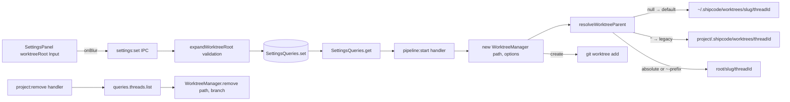

```mermaid
flowchart LR
    USER[User drafts PRD idea] --> MODAL[CreatePRDModal - dual mode]
    MODAL -->|pre-populated PRD_TEMPLATE| VALIDATE[bodyHasRequiredPrdSections gate]
    VALIDATE -->|required sections present| CREATE[github:create-issue IPC]
    CREATE --> GHCLI[GhCli.createIssue -> spawnWithStdin]
    GHCLI --> GH[gh issue create --body-file -]
    GH --> ISSUE[GitHub issue body IS the PRD]
    ISSUE --> CACHE[github_issue_cache upsert]
    CACHE --> KANBAN[Kanban card]
    KANBAN --> DETAIL[IssueDetail renders body as PRD]
    DETAIL --> EDIT[Edit PRD button]
    DETAIL --> REFRESH[Refresh from GitHub button]
    EDIT --> EDITIPC[github:edit-issue-body IPC]
    EDITIPC --> EDITGH[gh issue edit N --body-file -]
    EDITGH --> ISSUE
    REFRESH --> LISTGH[github:refresh-issues re-fetches bodies]
    LISTGH --> CACHE
    ISSUE --> PIPELINE[pipeline.ts:581 feeds body to planner verbatim]
```

# 2026-04-10 — ShipCode: Docs Migration + Vercel Deployment + Release Automation + Configurable Worktree Root + PRD Architecture + Mandatory-GitHub Refactor + Kanban Status Colors

## Session 1: Nextra 4 docs migration, `/docs` deployment, and release workflow

**Status:** Complete

### System Flow

```mermaid
flowchart LR
    DOCS[apps/docs Nextra 4 content] --> BUILD[DOCS_BASE_PATH=/docs bun run build]
    BUILD --> OUT[apps/docs/out]
    OUT --> SYNC[scripts/sync-docs-to-web.sh]
    SYNC --> PUBLIC[apps/web/public/docs]
    PUBLIC --> WEBBUILD[apps/web static export]
    WEBBUILD --> VERCEL[shipcode-web Vercel project]
    VERCEL --> DOMAIN[shipcode.shipshit.dev]
    DOMAIN --> DOCSPATH[/docs]
```

### Affected Components

| Layer | Components |
|-------|------------|
| Docs | `apps/docs/` — migrated from legacy Nextra `pages/` config to Nextra 4 App Router + `content/` tree |
| Web | `apps/web/` — serves embedded static docs from `public/docs`, deploys as `shipcode-web` |
| Deploy | `scripts/sync-docs-to-web.sh`, `package.json`, `.github/workflows/release.yml`, Vercel project/domain, Route53 record |

### What was done

- [x] Fixed docs startup by replacing stale Nextra `theme` / `themeConfig` config with Nextra 4 App Router layout.
- [x] Added `dev:docs` and moved docs default dev port to `3101` to avoid the local `3001` conflict.
- [x] Migrated docs content from `apps/docs/pages/` to `apps/docs/content/`.
- [x] Added App Router files for Nextra docs rendering: `app/layout.tsx`, `app/[[...mdxPath]]/page.tsx`, and `mdx-components.tsx`.
- [x] Configured docs to build with `DOCS_BASE_PATH=/docs`.
- [x] Deployed the main web app to Vercel project `shipcode-web`.
- [x] Added `shipcode.shipshit.dev` to the Vercel project and created Route53 `A shipcode.shipshit.dev -> 76.76.21.21`.
- [x] Removed the unused standalone `shipcode-docs` Vercel project after choosing single-site deployment.
- [x] Added `scripts/sync-docs-to-web.sh` and `sync:docs` / `deploy:web` scripts so docs are embedded into the web bundle reproducibly.
- [x] Updated release workflow with a `deploy-web` job that syncs docs and deploys `shipcode-web` via Vercel.

### Files changed

- `apps/docs/next.config.mjs` — Nextra 4 config, `/docs` base path support, static export.
- `apps/docs/app/layout.tsx` — Nextra docs theme layout using `getPageMap()`.
- `apps/docs/app/[[...mdxPath]]/page.tsx` — catch-all MDX docs route.
- `apps/docs/mdx-components.tsx` — docs theme MDX component wiring.
- `apps/docs/content/` — migrated docs content and `_meta.tsx` files.
- `apps/docs/theme.config.tsx` — Nextra 4-compatible theme config.
- `apps/docs/package.json` — docs dev port and missing type dependency updates.
- `apps/web/public/docs/` — embedded exported docs bundle for `/docs`.
- `apps/web/vercel.json` — Vercel output directory config.
- `apps/web/package.json` — isolated web deploy dependency cleanup.
- `apps/web/next.config.ts` — static export config cleanup.
- `apps/web/tsconfig.json` — self-contained TypeScript config for isolated Vercel build.
- `scripts/sync-docs-to-web.sh` — repeatable docs export/sync script.
- `package.json` — added `dev:docs`, `sync:docs`, and `deploy:web`.
- `.github/workflows/release.yml` — added production web deployment job.

### Key decisions

- **Decision:** Serve docs from the same `shipcode-web` Vercel project instead of proxying a separate `shipcode-docs` deployment.
  - **Context:** Static export with `basePath` generated `/docs` asset URLs but did not emit a physical `out/docs/` tree for the standalone docs project to serve directly.
  - **Rationale:** Embedding `apps/docs/out` into `apps/web/public/docs` makes `shipcode.shipshit.dev/docs` reliable without CloudFront path routing or a second Vercel origin.

- **Decision:** Keep `DOCS_BASE_PATH=/docs` as part of the sync script.
  - **Context:** Nextra-generated asset links need the `/docs/_next/...` prefix when served under the web app’s `/docs` subtree.
  - **Rationale:** The script prevents manual deploys from forgetting the base path.

- **Decision:** Delete the unused `shipcode-docs` Vercel project.
  - **Context:** It was created while exploring a two-origin `/docs` proxy deployment.
  - **Rationale:** The final architecture is single-site, so keeping the stale project would create confusion.

### Mistakes and fixes

- **Mistake:** Initial docs app used old Nextra config keys (`theme`, `themeConfig`) that Nextra 4 rejects -> **Fix:** Migrated to App Router layout and current Nextra docs theme API.
- **Mistake:** Tried a separate docs Vercel origin for `/docs`, but static export did not publish a standalone `/docs` path tree -> **Fix:** Embedded the docs export into `apps/web/public/docs`.
- **Mistake:** Vercel project preset/output settings initially treated apps as generic projects and looked for `public` -> **Fix:** Added app-level `vercel.json` output configuration and ultimately used static export output under the web project.
- **Mistake:** AWS credentials were stale after key rotation -> **Fix:** User updated default AWS credentials; verified `aws sts get-caller-identity` before Route53 changes.

### Next steps

- [ ] Add `VERCEL_TOKEN` and `VERCEL_ORG_ID` secrets in GitHub Actions if they are not already configured.
- [ ] Verify the next GitHub Release runs the new `deploy-web` job successfully.
- [ ] Consider adding a CI check that fails if docs content changes without a refreshed `apps/web/public/docs` bundle.

## Session 2: Configurable worktree root (`~/.shipcode/worktrees` default) + WorktreeManager API refactor

**Status:** Complete

### System Flow



### Affected Components

| Layer | Components |
|-------|------------|
| Shared | `packages/shared/src/types.ts`, `constants.ts`, new `worktree-path.ts` helper (expandWorktreeRoot, projectSlug, resolveWorktreeParent), re-exported from `index.ts` |
| DB | `packages/db/src/queries/settings.ts` — fixed null-serialization bug + worktreeRoot read/validate |
| Git | `packages/git/src/worktree.ts` — WorktreeManagerOptions; `remove(path, branch)` path-as-truth API; `list()` rewritten to filter by `shipcode/*` branch prefix |
| Desktop IPC | `apps/desktop/src/main/ipc.ts` — settings threaded into pipeline:start; project:remove now cleans up worktrees |
| Desktop UI | `apps/desktop/src/renderer/components/SettingsPanel.tsx` — new Worktree Location section with inline error display |
| Tests | new `packages/shared/src/worktree-path.test.ts` (18 tests); extended `packages/db/src/queries/settings.test.ts` (+6 tests) |

### What was done

- [x] Wrote plan at `/Users/decod3rs/.claude-genfeedai/plans/piped-dreaming-horizon.md` in plan mode.
- [x] Ran an adversarial review pass via codex-rescue; it stalled, so cancelled and folded the captured finding (remove/list recompute-by-threadId is latent orphan bug) + manual audit into the plan revision.
- [x] Added `AppSettings.worktreeRoot: string | null` with semantics: `null` = default (`~/.shipcode/worktrees`), `''` = legacy project-local, absolute or `~`-prefix = custom.
- [x] Created shared `worktree-path.ts` helper with `expandWorktreeRoot`, `projectSlug` (basename + sha256[:6]), `resolveWorktreeParent`.
- [x] Fixed `SettingsQueries.set()` null-serialization bug (`typeof null === 'object'` → `JSON.stringify(null)` → literal `"null"` string). Now stores empty string for null/undefined.
- [x] Validated `worktreeRoot` at `settings:set` time via `expandWorktreeRoot` so relative paths and `~user/…` are rejected at the boundary.
- [x] `SettingsQueries.get()` treats missing / empty / legacy `"null"` as default to recover from any pre-fix rows.
- [x] Refactored `WorktreeManager`: added `WorktreeManagerOptions { worktreeRoot }`; `remove(path, branch)` now takes concrete values (path-as-truth) to insulate cleanup from mid-flight setting toggles; `list()` rewritten to parse `git worktree list --porcelain` and filter by `shipcode/*` branch prefix instead of fragile path substring.
- [x] Wired settings into `pipeline:start` handler at `apps/desktop/src/main/ipc.ts:316`.
- [x] Added worktree cleanup hook to `project:remove` IPC handler (enumerate threads and call `WorktreeManager.remove` per thread before deleting the project row).
- [x] Added "Worktree Location" section to `SettingsPanel.tsx` with `defaultValue` + `onBlur` Input and inline error display for validation failures from IPC.
- [x] Wrote 18 unit tests for `worktree-path.ts` (all expand cases, slug determinism/collision/sanitization/truncation, resolveWorktreeParent routing).
- [x] Wrote 6 new tests in `settings.test.ts` (defaults, ~-prefix round-trip, absolute round-trip, null→'' storage, legacy `"null"` recovery, relative-path rejection, `~user` rejection).
- [x] Ran full test suite + typecheck across monorepo: 82 shared + 69 db + 50 pipeline tests pass, 14/14 typecheck packages clean.

### Files changed

- `packages/shared/src/types.ts` — added `worktreeRoot: string | null` to `AppSettings`.
- `packages/shared/src/constants.ts` — added `worktreeRoot: null` to `DEFAULT_SETTINGS`; exported `DEFAULT_WORKTREE_ROOT = '~/.shipcode/worktrees'`.
- `packages/shared/src/worktree-path.ts` (new) — `expandWorktreeRoot`, `projectSlug`, `resolveWorktreeParent`.
- `packages/shared/src/worktree-path.test.ts` (new) — 18 unit tests.
- `packages/shared/src/index.ts` — re-export `worktree-path`.
- `packages/db/src/queries/settings.ts` — null-aware serializer, worktreeRoot read with legacy recovery, pre-write validation.
- `packages/db/src/queries/settings.test.ts` — +6 worktreeRoot tests + defaults assertion.
- `packages/git/src/worktree.ts` — options arg; path-as-truth `remove(path, branch)`; branch-prefix `list()`.
- `apps/desktop/src/main/ipc.ts` — settings threaded into `WorktreeManager` at `pipeline:start`; `project:remove` now best-effort-cleans worktrees.
- `apps/desktop/src/renderer/components/SettingsPanel.tsx` — new Worktree Location section with inline error state.

### Key decisions

- **Decision:** Default worktree root is `~/.shipcode/worktrees` (global), not project-local.
  - **Context:** User directly asked "i think default should be `~/.shipcode`, right?" and project-local worktrees bleed into iCloud/Dropbox-synced project dirs.
  - **Rationale:** Clean project trees, no cloud-sync bleed, one central inspection dir, consistent with `.shipcode` brand. Pre-release repo so flipping default is cheap.

- **Decision:** Use deterministic `<basename>-<sha256[:6]>` project slugs for the global-root layout, not UUIDs or DB-stored slugs.
  - **Context:** With a global root, users will browse `~/.shipcode/worktrees/` and need to recognize their projects.
  - **Rationale:** Human-readable, deterministic (no migration), collision-safe across same-basename projects, no DB schema change.

- **Decision:** Refactor `WorktreeManager.remove()` from `remove(threadId)` to `remove(path, branch)`.
  - **Context:** Mid-session setting toggle would make `remove()` recompute the wrong path and orphan the actual worktree. `remove()` and `list()` are both currently dead code (grep-confirmed — only `create()` is called from ipc.ts).
  - **Rationale:** Path-as-truth API is the correct design; doing it now while there are no callers is free, and `Thread.worktreePath` is already persisted at `queries.threads.setWorktree` time.

- **Decision:** Reject relative paths and `~user/…` at `settings:set` time, not at worktree-creation time.
  - **Context:** Validation failure needs to surface to the user in the Settings panel, not as a cryptic pipeline failure 20 minutes later.
  - **Rationale:** Fail fast at the boundary. The UI catches the thrown IPC error and displays it inline under the Input.

- **Decision:** Skip `packages/git` dedicated vitest setup for now.
  - **Context:** The plan mentioned a new `worktree.test.ts`, but `@shipcode/git` has no vitest devDep or test script.
  - **Rationale:** Path-resolution logic is fully covered by 18 tests in `packages/shared/src/worktree-path.test.ts` (where the logic lives); the `WorktreeManager` shell is trivially correct by inspection. Adding a vitest harness + simple-git mocks would be low ROI.

### Mistakes and fixes

- **Mistake:** `codex:adversarial-review` slash command is designed for working-tree diffs, not plan files — running it against the uncommitted UI work would review unrelated code → **Fix:** Delegated to `codex-rescue` subagent with explicit "review this plan file" framing; it dispatched a background task.
- **Mistake:** The `codex-rescue` subagent refused to poll its own background task citing plan mode, and the task then stalled for 35+ minutes → **Fix:** Cancelled via `node codex-companion.mjs cancel`; used the captured partial reasoning ("the path-refactor recommendation has a real trap: `remove()` recomputes from threadId") as the seed for a manual adversarial pass.
- **Mistake:** First round of TypeScript diagnostics showed `expandWorktreeRoot` not exported from `@shipcode/shared` → **Fix:** Forgot that `@shipcode/shared` uses a `dist/` build entry point; ran `bun run --filter @shipcode/shared build` (and similarly for `@shipcode/git`, `@shipcode/db`) to rebuild type declarations after each package's source changed.
- **Mistake:** After Write/Edit tool calls, a linter or background process was modifying files between my Read and Edit calls, causing "File has been modified since last read" errors → **Fix:** Re-read the file region before retrying the Edit; verified actual content was what I expected (linter was just noisy, not reverting).
- **Mistake:** First version of the plan recommended keeping project-local as default for backward compat → **Fix:** User corrected: "i think default should be `~/.shipcode`, right?" — revised plan in the same response to flip the default, which also clarified that ShipCode is pre-release so backward-compat worry was overblown.

### Next steps

- [ ] Manual end-to-end verification in the Electron app: fresh DB → default path, blank → project-local, custom absolute path, relative-path error toast, mid-flight toggle preserves in-flight `Thread.worktreePath`, project deletion cleans up worktrees.
- [ ] Decide whether to add vitest harness to `@shipcode/git` for a dedicated `worktree.test.ts` (low priority — shared tests cover the path logic).
- [ ] Consider per-project `Project.worktreeRoot` override if power users ask (noted as out-of-scope for v1).
- [ ] Commit the worktree changes (currently coexist with earlier uncommitted UI/primitive edits from pre-session state — may want to split into two commits).
- [ ] Consider wiring `WorktreeManager.remove()` into the actual ship/cleanup flow — it's still only called from `project:remove` today, so completed threads never auto-clean their worktrees.

---

## Session 3: PRD architecture + `writing-prds` skill + mandatory-GitHub refactor

**Status:** Complete (code ready; not committed — 10 files from this session, ~38 other files dirty from parallel Session 2 worktree work)

### System Flow



### Affected Components

| Layer | Components |
|-------|------------|
| Skills infra | `.agents/skills/` established as canonical skill dir; `.claude/skills -> ../.agents/skills` symlink for harness-agnostic discovery |
| Skills | `.agents/skills/writing-prds/SKILL.md` (new) — PRD authoring contract for shipcode |
| Shared | `packages/shared/src/prd-template.ts` (new) — `PRD_TEMPLATE`, `PRD_REQUIRED_HEADINGS`, `bodyHasRequiredPrdSections` |
| IPC contract | `packages/shared/src/ipc-channels.ts` — tightened `github:create-issue.body` to required, added `github:edit-issue-body` |
| Agents | `packages/agents/src/github/gh-cli.ts` — added `editIssueBody()` + private `spawnWithStdin()` helper; `createIssue()` refactored to pipe via stdin |
| Agents tests | `packages/agents/src/github/gh-cli.test.ts` — added spawn mock + 3 `editIssueBody` tests (all 23 green) |
| Main process | `apps/desktop/src/main/ipc.ts` — new `github:edit-issue-body` handler (edit → getIssue → upsert → broadcast) |
| Renderer state | `apps/desktop/src/renderer/stores/app-store.ts` — `editingPrd` state + `openEditPrdModal(issueNumber, body)` action |
| Renderer modal | `apps/desktop/src/renderer/components/CreateIssueModal.tsx` — dual-mode create/edit; template pre-pop; hard-block gate on required sections |
| Renderer detail | `apps/desktop/src/renderer/components/IssueDetail.tsx` — Edit PRD + Refresh from GitHub buttons; "Description" → "PRD" heading |
| Onboarding | `OnboardingWizard.tsx` — gates `canAdvanceFromAuth` on both AI + gh auth; step 1 gated on `selectedRepo !== null`; `githubPollingEnabled: true` hardcoded |
| Onboarding | `StepGitHubProject.tsx` — removed "Skip GitHub setup" button; added Retry button on error and empty-repos states |

### What was done

- [x] **Investigated Electron/Chromium GPU mailbox warnings** (`SharedImageManager::ProduceOverlay` / `SkiaOutputDeviceBufferQueue: Invalid mailbox`) on `@shipcode/desktop:dev`. Concluded they are benign cosmetic logs from a known Chromium Viz compositor race on macOS. Root cause analysis: Viz mailbox pool race when DevTools docks or WebGL surfaces (xterm's WebGL addon) are torn down mid-frame. User accepted the log noise, no code changes.
- [x] **Surveyed automazeio/ccpm** via `gh api repos/automazeio/ccpm/contents` + README fetch. Compared to shipcode's existing storage (`github_issue_cache` SQLite-first vs CCPM's `.claude/prds/` filesystem-first) and UX (React kanban vs bash scripts). Wrote a detailed comparison recommending we adopt CCPM's *PRD template* and *philosophy* but not its *storage model* or *bash script ecosystem*.
- [x] **Created `writing-prds` skill** at `.claude/skills/writing-prds/SKILL.md` initially (~260 lines covering Storage Location, Frontmatter Schema, Required Sections, Pipeline Mapping, Quality Gates, Workflow, Anti-Patterns, Minimal Example). Later rewrote 5 sections to reflect the GitHub-body-as-PRD storage model after user pivoted away from local files.
- [x] **Established `.agents/skills/` + symlink layout.** Moved `writing-prds` skill from `.claude/skills/` to `.agents/skills/` and created `.claude/skills -> ../.agents/skills` symlink. Verified: git tracks symlink as a symlink object on Darwin (`core.symlinks` default true), `.gitignore` doesn't block it, and `~/.config/git/ignore:1` only excludes `**/.claude/settings.local.json` (file-scoped, not directory-scoped). Deliberately did NOT create `.codex/skills` — `.codex/` doesn't exist and the installed codex plugin ships its own skills through the plugin mechanism.
- [x] **Iterated on architecture with the user** through three proposals: (A) local + GitHub dual-mode with per-project `workItemSource` setting, (B) mandatory GitHub but keep PRDs as local authoring files with push-on-save, (C) **mandatory GitHub, issue body IS the PRD, no local sidecar whatsoever**. User explicitly rejected A and B, chose C: "why gh issue can't have the PRD in their body? we need clean gh anyway".
- [x] **Wrote implementation plan** for the mandatory-GitHub + PRD-as-issue-body refactor at `/Users/decod3rs/.claude-genfeedai/plans/streamed-dreaming-barto.md` (overwrote an earlier GPU-warnings investigation plan). Plan included: Context, Scope (in and out), 8 file-by-file changes, Existing Primitives to Reuse table, 7-step Verification, Risks & Open Questions. User approved.
- [x] **Phase 1 recon before implementing**: verified `github:create-issue` has exactly 1 caller site (`CreateIssueModal.tsx:41`), `GhAuthStatus.authenticated` is the correct field name (`packages/shared/src/types.ts:314`), `packages/pipeline/src/pipeline.ts:581` already feeds `issue.body` verbatim into the planner prompt (no pipeline changes needed), `IssuePoller` is exported but never instantiated in the codebase (manual `github:refresh-issues` is the only refresh path today).
- [x] **Rewrote skill Storage/Frontmatter/Workflow/Anti-Patterns/Minimal Example** to document the new model: issue body is canonical, no `.shipcode/prds/` directory, no `created`/`updated` frontmatter (GitHub tracks those), new anti-patterns including "authoring a PRD before GitHub is connected" and "editing `github_issue_cache.body` directly in SQLite". Replaced the minimal example with a plausible `copy-issue-url-action` PRD.
- [x] **Created `packages/shared/src/prd-template.ts`** with `PRD_TEMPLATE` (40+ lines), `PRD_REQUIRED_HEADINGS` (`## Executive Summary`, `## Success Criteria`, `## Out of Scope`), and `bodyHasRequiredPrdSections()`. Re-exported via `packages/shared/src/index.ts`.
- [x] **Added `GhCli.editIssueBody()` + `spawnWithStdin()` helper.** Uses `spawn` (not `execFile`) with stdio piping so multi-KB PRD bodies avoid argv length limits and shell-escaping. Refactored `createIssue()` to use the same helper for consistency.
- [x] **Added `github:edit-issue-body` IPC channel + handler** mirroring the existing `github:create-issue` flow: call `GhCli.editIssueBody` → re-fetch canonical via `GhCli.getIssue()` → upsert `github_issue_cache` → broadcast `github:issues-updated` → return record.
- [x] **Extended `CreateIssueModal`** to dual-mode (create/edit) driven by `editingPrd` state in the store. Create mode pre-populates body with `PRD_TEMPLATE` and requires a title. Edit mode hides the title field and pre-populates with the current issue body. Submit hard-blocked until `bodyHasRequiredPrdSections(body)` returns true; shows inline warning listing missing headings when invalid.
- [x] **Added `editingPrd` state + `openEditPrdModal(issueNumber, body)` action** to the Zustand store. `closeCreateIssueModal` now also clears `editingPrd`. This avoids prop-drilling through App.tsx.
- [x] **Added "Edit PRD" and "Refresh from GitHub" buttons** to `IssueDetail.tsx`. Edit PRD triggers `openEditPrdModal`. Refresh from GitHub calls the existing `github:refresh-issues` IPC. Renamed the body heading from "Description" to "PRD" to match the mental model.
- [x] **Gated onboarding on GitHub**: `canAdvanceFromAuth` now requires `aiAuthCount >= 1 && !!authResult?.ghAuth.authenticated`. Step 1 advancement gated on `selectedRepo !== null`. `handleFinish` hardcodes `githubPollingEnabled: true` (the user can't reach finish without a selected repo).
- [x] **Removed "Skip GitHub setup" button** from `StepGitHubProject.tsx`. Added Retry button (invalidates the `onboarding-repos` query and refetches) on both the `error` state and the empty-repos state. Clarified copy to "Shipcode uses GitHub issues as the PRD and work-item store... A repository is required to proceed."
- [x] **Added 3 `editIssueBody` unit tests** in `gh-cli.test.ts` with new `createFakeProc()` helper (EventEmitter-backed mock that satisfies the spawn surface `spawnWithStdin` uses). Tests cover: success path (body written to stdin + resolves on exit 0), non-zero exit with stderr (rejects with stderr in error message), child process 'error' event (rejects with underlying error). All 23 tests pass (20 pre-existing + 3 new).
- [x] **Verified final state**: `@shipcode/{shared,db,agents,desktop}` typecheck — shared/db/agents exit 0; desktop has 1 pre-existing error from concurrent background work (`generatePrdFromIdea` import in ipc.ts:8 that doesn't exist in agents package, not from this session). Agents test suite green (23/23).

### Files changed

- `.agents/skills/writing-prds/SKILL.md` — NEW initially, then 5 targeted rewrites for GitHub-body storage model. Symlinked via `.claude/skills -> ../.agents/skills`.
- `packages/shared/src/prd-template.ts` — NEW, `PRD_TEMPLATE` + `PRD_REQUIRED_HEADINGS` + `bodyHasRequiredPrdSections`
- `packages/shared/src/index.ts` — added `export * from './prd-template'`
- `packages/shared/src/ipc-channels.ts` — tightened `github:create-issue.body` required, added `github:edit-issue-body` channel
- `packages/agents/src/github/gh-cli.ts` — added `editIssueBody()` + `spawnWithStdin()`; refactored `createIssue()` to use stdin piping
- `packages/agents/src/github/gh-cli.test.ts` — added `spawn` mock + 3 `editIssueBody` tests
- `apps/desktop/src/main/ipc.ts` — added `github:edit-issue-body` handler
- `apps/desktop/src/renderer/stores/app-store.ts` — added `editingPrd` state + `openEditPrdModal` action
- `apps/desktop/src/renderer/components/CreateIssueModal.tsx` — dual-mode create/edit; template pre-pop; required-section hard-block
- `apps/desktop/src/renderer/components/IssueDetail.tsx` — Edit PRD + Refresh buttons; PRD heading
- `apps/desktop/src/renderer/components/onboarding/OnboardingWizard.tsx` — gate advancement on gh auth + repo selection
- `apps/desktop/src/renderer/components/onboarding/StepGitHubProject.tsx` — remove skip button; add Retry buttons

### Key decisions

- **Decision:** GitHub is mandatory; the GitHub issue body IS the PRD (no local sidecar, no dual sources).
  - **Context:** Earlier in the session we considered local `.shipcode/prds/*.md` as canonical with GitHub as optional distribution. User pushed back with "why gh issue can't have the PRD in their body? we need clean gh anyway".
  - **Rationale:** The pipeline was already half-coupled to GitHub (`pipeline.ts:482-528` only creates PRs when `githubIssueNumber` exists). Half-supported local path led to dead-ends at the shipping phase. `pipeline.ts:581` was already feeding `issue.body` verbatim to the planner — "issue body IS the PRD" was implicit in the code. Making it explicit removes ~1000 lines of dual-source machinery (work_items table, chokidar watcher, mode switching, sync logic) in exchange for ~570 lines of focused edits. One source of truth, one mental model, and the UX already matched (`IssueDetail.tsx:147` literally had `{/* Issue body (PRD) */}` pre-refactor).

- **Decision:** Skills live at `.agents/skills/<name>/SKILL.md` with `.claude/skills -> ../.agents/skills` symlink.
  - **Context:** User asked "what about having `.agents/skills`, a symlink in `.claude|.codex/skills`?" to avoid harness-specific paths.
  - **Rationale:** `.agents/` already exists in this repo (sibling to `.agents/SESSIONS/` which is tracked). Single canonical path, git tracks the symlink object on macOS, works with any Agent Skills–compatible harness automatically. Deliberately NOT creating `.codex/skills` yet — `.codex/` doesn't exist and the installed codex plugin ships skills through the plugin mechanism, not a project-local directory.

- **Decision:** Use `spawn` + stdin piping for `gh issue create`/`gh issue edit`, not `execFile` + `--body` arg.
  - **Context:** PRDs can be multi-KB markdown. Passing via argv risks OS argv length limits and requires shell-escaping backticks, quotes, newlines.
  - **Rationale:** `--body-file -` with stdin input is robust to size and escaping. Added private `spawnWithStdin()` helper on `GhCli` so both `createIssue` and `editIssueBody` share the path. The existing `execFileAsync` + `promisify` pattern stays for read-only calls (list, view).

- **Decision:** Store `editingPrd` in the Zustand store, not as a prop.
  - **Context:** Initial approach threaded `editIssue` as a prop on `<CreateIssueModal>` but the modal renders once as a singleton in App.tsx.
  - **Rationale:** Store already owns modal open/close state. `editingPrd: { issueNumber, body } | null` + `openEditPrdModal(...)` keeps single-instance pattern and avoids a parallel prop path.

- **Decision:** Hard-block modal submit on missing required sections, not soft-warn.
  - **Context:** Could have allowed "save as draft".
  - **Rationale:** PRDs missing Executive Summary / Success Criteria / Out of Scope are guaranteed to thrash the planner. Cheaper to hard-block at submit than burn verification retries downstream. Soft-warn is future polish.

- **Decision:** Did not fix the pre-existing `executorModel` type/SQL mismatch in `GitHubIssueQueries`.
  - **Context:** Mid-implementation hit errors where `upsert` call sites were flagged as missing `executorModel`. Initial reading showed the field wasn't in the Omit list; after rebuilding `@shipcode/db`, the source had been updated to omit `executorModel` correctly and the errors resolved.
  - **Rationale:** The "error" was stale dist/. Rebuilding fixed it. Plan scope explicitly excluded touching `GitHubIssueQueries`.

### Mistakes and fixes

- **Mistake:** Ran `git stash` mid-implementation to compare against baseline → accidentally stashed ~38 files from the parallel Session 2 (worktree root) work that I wasn't aware existed in the tree. **Fix:** `git stash pop` restored everything; verified my 10 files were intact via targeted greps (`editIssueBody`, `openEditPrdModal`, `handleEditPrd`). No work lost, but this revealed that a parallel session was actively modifying ~38 files throughout my session (worktree-root refactor from Session 2 above). Should have run `git status --short` before stashing to understand the tree state.

- **Mistake:** Attempted a type-level "fix" by adding `executorModel: 'claude'` to 3 `upsert` call sites based on a stale initial read of `github-issues.ts:29`. **Fix:** After running `bun run --filter=@shipcode/db build` to refresh dist/, the source was seen to already omit `executorModel`. Reverted the three additions via 3 targeted Edits. Lesson: when typecheck errors disagree with source file contents, the dist/ is probably stale — rebuild before patching.

- **Mistake:** Ran `bunx vitest run src/...` from inside `apps/desktop` and got "No test files found". **Fix:** The vitest config's `include: ['apps/desktop/src/**/*.test.ts']` is written relative to the monorepo root — ran with full path from the root: `bunx vitest run apps/desktop/src/renderer/components/IssueDetail.test.tsx`. Discovered that `IssueDetail.test.tsx` is the ONLY test file in all of `apps/desktop`, and its 3 tests fail with `ReferenceError: window is not defined` / `environment 0ms`, which is a pre-existing vitest environment bootstrap issue (not caused by my changes) — the include pattern + `root: '.'` combo fails to wire up jsdom when executed via the workspace. Documented as "not mine, not fixing" per plan scope.

- **Mistake (not mine but documented):** `apps/desktop/src/main/ipc.ts:8` imports `generatePrdFromIdea` from `@shipcode/agents` — the function doesn't exist in the agents package. This import was added by concurrent background work during the session (a half-complete "generate PRD from idea" feature separate from my refactor and separate from Session 2's worktree work). Not my code. Blocks desktop typecheck until the missing export is added or the import removed.

### Next steps

- [ ] **Manual verification** of the 7-step checklist from the plan (`/Users/decod3rs/.claude-genfeedai/plans/streamed-dreaming-barto.md`): onboarding gh-auth gate, mandatory repo, create PRD via modal, edit PRD, refresh from GitHub, pipeline consumes body, gh-logout error handling. Requires `bun run dev:desktop` with a throwaway test repo.
- [ ] **Commit hygiene**: the working tree has ~48 modified files. Only ~10 are from this session (listed above). The other ~38 are from the parallel Session 2 worktree-root refactor plus some un-attributed concurrent work. When committing, stage the specific files from this session — do **not** `git add .`. Consider coordinating with whoever owns Session 2 to split into three commits: (a) worktree-root refactor, (b) this session's mandatory-GitHub + PRD refactor, (c) the orphan `generatePrdFromIdea` half-change.
- [ ] **Fix the orphan `generatePrdFromIdea` import** at `apps/desktop/src/main/ipc.ts:8` — blocks desktop typecheck. Either export the function from `@shipcode/agents` or remove the import.
- [ ] **Fix the `IssueDetail.test.tsx` vitest environment bug** — likely the `include` pattern in `apps/desktop/vitest.config.ts` needs to be `src/**/*.test.{ts,tsx}` (with workspace root at `apps/desktop`), or the file needs `// @vitest-environment jsdom` at the top. Outside this refactor's scope but worth a follow-up ticket.
- [ ] **Tighten `bodyHasRequiredPrdSections`** in v2 to reject raw placeholder text (`<kebab-name>`, `<one-line summary>`, etc.), not just heading presence. Current v1 lets a user submit a PRD with the untouched template.
- [ ] **Consider rename** `CreateIssueModal.tsx` → `CreatePRDModal.tsx` in a follow-up. Deliberately skipped here to minimize churn.
- [ ] **Once verified**, delete the initial session-start attempts to read `.agents/SYSTEM/ai/USER-PREFERENCES.md` (NOT FOUND) and `.agents/SYSTEM/ai/SESSION-QUICK-START.md` (NOT FOUND) — or create those files if you want session-start to have something to load beyond the daily session file.
