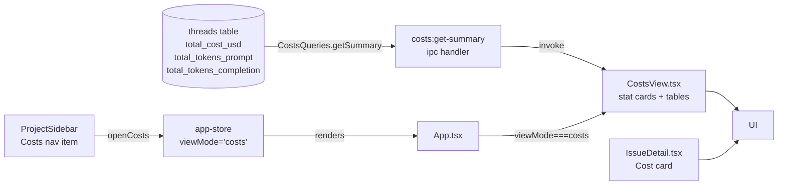
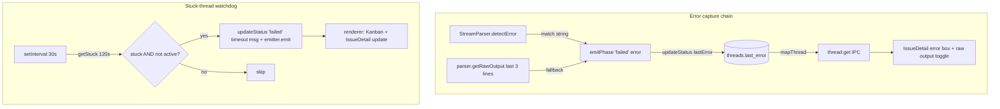
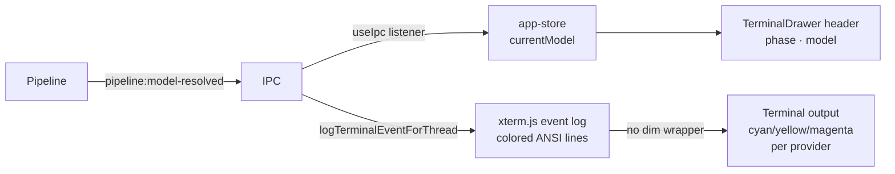
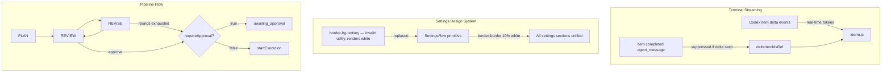
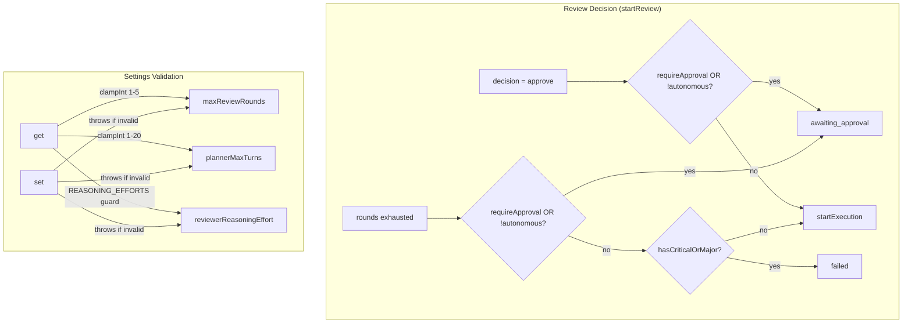
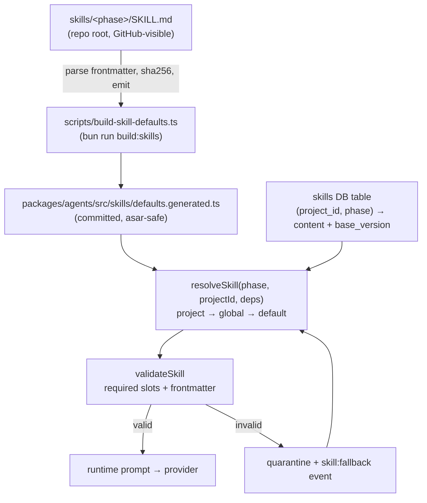
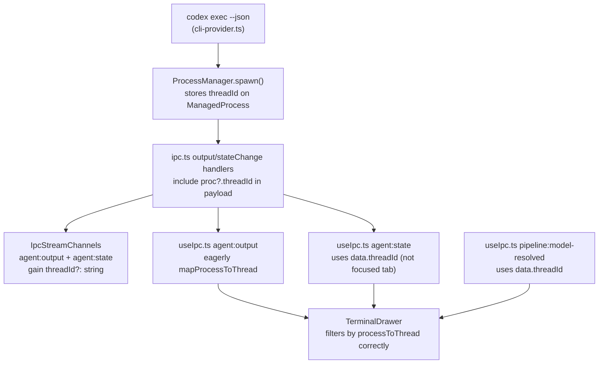
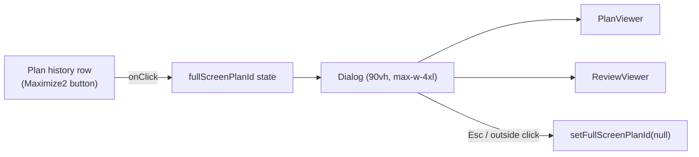

```mermaid
flowchart TB
  subgraph Onboarding["Onboarding → sidebar auto-select"]
    WIZ[OnboardingWizard\nhandleFinish async] -->|settings:set| SETTINGS[AppSettings saved]
    SETTINGS -->|dialog:open-directory| PICKER[folder picker]
    PICKER -->|path selected| ADD[project:add IPC]
    ADD -->|project.id| COMPLETE[onComplete newProjectId]
    COMPLETE -->|selectProject| SIDEBAR[sidebar highlights project]
    COMPLETE -->|fire-and-forget| PRELOAD[github:refresh-issues]
  end

  subgraph Sidebar["Sidebar add → issue pre-load"]
    PLUS[+ button in sidebar] -->|dialog:open-directory| ADD2[project:add IPC]
    ADD2 -->|onSuccess| SEL[selectProject]
    SEL -->|fire-and-forget| PRELOAD2[github:refresh-issues]
  end

  subgraph ListView["List view toggle"]
    TOOLBAR[KanbanBoard toolbar\nLayoutList / LayoutGrid buttons] -->|view state| SWITCH{view}
    SWITCH -->|list| LISTVIEW[IssueListView\ngrouped + collapsible]
    SWITCH -->|kanban| BOARD[DndContext Kanban]
    DNDCTX[DndContext hoisted\nwraps both views] --> LISTVIEW
    DNDCTX --> BOARD
    LISTVIEW -->|DRAGGABLE_STATUSES rows| DND[useDraggable on todo/queued/failed rows]
    LISTVIEW -->|group headers| DROP[useDroppable on group sections]
    DROP -->|same drop IDs| HANDLER[handleDragEnd unchanged]
  end
```

```mermaid
flowchart LR
  A[Vincent flags<br/>Reset to default vs Save<br/>asymmetry in SkillsView] --> B[Explore agent audits<br/>all button pairs]
  B --> C[Plan written]
  C --> D[AskUserQuestion:<br/>Approve & Execute pair<br/>+ Save PRD shortening]
  D --> E[Codex adversarial review<br/>hung 11m+ silent]
  E --> F[Kill zombie,<br/>retry with tighter prompt]
  F --> G[Verify every Codex finding<br/>against real code]
  G -->|1 real, 6 hallucinations| H[Update plan]
  H --> I[Execute 6 edits]
  I --> J[typecheck 14/14 +<br/>22 desktop tests pass]
```

# Session Log — 2026-04-11

## Summary

- Session 24: Plan full-screen viewer — Maximize2 button on each plan row opens plan + review in a full-size Dialog
- Session 21: Inbox design system refactor + "Go to issue" sidebar fix — Inbox/Costs/Dashboard navigation now opens IssueDetail sidebar correctly
- Session 19: UI polish — button system overhaul (text-left, rounded-md, cursor-pointer, icon centering), KPI card flex layout, max-w-5xl content wrappers, sidebar padding, dropdown Electron fix
- Session 22: Skills UI polish, design system hardening (raw-HTML sweep, agent color token), codex 0.120.0 arg fix, OpenRouter #8 epic restructure — massive sweep across renderer + ui package + shared memory
- Session 19: GitHub issue — max concurrent pipeline runs (shipshitdev/shipcode#23)
- Session 18: UI polish — Titlebar button gap, Kanban card "open detail" icon fix
- Session 17: Terminal auto-open on pipeline phase transition fix
- Session 16: Docs design fix + brew cask install commands — pushed to master
- Session 1: Biome config — switched to spaces, migrated to v2, merged best-practice options
- Session 2: Costs view — full implementation (DB queries, IPC, CostsView, sidebar nav, IssueDetail cost card)
- Session 3: ShipCode rename fallout + UI polish — restored orphaned DB after app rename, unified `MODEL_DISPLAY` across Kanban + IssueDetail, replaced "GitHub Issues" header with project name + repo/board quick-links, hoisted `deriveGithubIssueUrl` to `@shipcode/shared`
- Session 4: Pipeline error surfacing + watchdog timeout — `Thread.lastError` end-to-end, IssueDetail error UI + debug toggle, focus rings, Re-run button at top, PRD collapsible, Kanban selected+failed border, stuck-thread watchdog
- Session 5: UI polish + pipeline rawOutput cleanup — `pill` Button variant, copy+chevron icons in error panel, strip hook events from rawOutput, settings sidebar bg fix
- Session 6: Terminal UX — richer ANSI colors, agent/model display in header + log lines, per-provider cost estimation
- Session 7: Onboarding project auto-select + issue pre-load + Kanban/List view toggle with drag-and-drop in list view
- Session 8: Board triage + OpenRouter test fixes + PR #17 merged — fixed codex v1 CLI args, emitPhase arity, stale snapshots; closed issue #11; merged feat/openrouter-tier1
- Session 9: Terminal streaming + Settings design system + Pipeline flow fixes — Codex item.delta real-time streaming, SettingsRow UI primitive, border-border fix, plannerMaxTurns/maxReviewRounds/requireApproval/reviewerReasoningEffort settings, unified review→revise loop for both modes
- Session 10: Adversarial review findings — approval-mode hard-fail + settings validation — fixed pipeline routing so non-autonomous threads never auto-execute, requireApproval checked before severity, clampInt/REASONING_EFFORTS guards on settings read+write, 3 new pipeline tests
- Session 11: Pipeline Phase Skills + `/skills` Editor — full implementation. 5 Codex-style skills at `skills/<phase>/SKILL.md`, build-time bake to `defaults.generated.ts`, new `SkillsQueries` DB table with 3-tier resolution (project→global→default), validator + quarantine + fallback notifications, all 4 prompt builders rewritten, new `buildExecutionPrompt`, `/skills` page with scope picker/editor/quarantine banner. Addresses 3 Codex adversarial-review findings (cross-project contamination, stale DB blobs, user bricking).
- Session 12: Button label consistency pass + a11y — fixed 5 button-pair asymmetries (SkillsView/StatusMappingEditor Reset, IssueDetail Submit, CreateIssueModal Save, CostsView USD/Tokens), added aria-labels to preserve screen-reader context, deferred `Approve & Execute` as load-bearing. Caught a stale Codex adversarial-review task (process died silently, status never updated), verified every Codex finding before integrating — 1 real (CostsView toggle), 6 hallucinations dismissed with receipts.
- Session 12: Main-process crash hardening + electron-log — fixed EIO/destroyed-WebContents crash dialog, added uncaughtException/unhandledRejection handlers, replaced all console.* with electron-log across main + renderer.
- Session 13: Codex `-q` flag fix + Terminal tab isolation — `codex exec --json` replaces `-q`, `threadId` propagated from ProcessManager through IPC to renderer, fixing cross-tab output bleed.
- Session 14: Testing coverage + OSS readiness audit — added 5 DB query tests (costs, notifications, diffs, dashboard, activity), 3 prompt snapshot tests; coverage map + adversarial review of gaps; merged to master.
- Session 15: Session-start diagnostics audit — confirmed all 14 packages typecheck clean; LSP diagnostics for missing `skills` in `PipelineDeps`/`Queries` and icon exports from `@shipcode/ui` are stale (IDE cache artifact, not real errors).

---

## Session 1: Biome Config Cleanup

**Status:** Complete

### Affected Components

| Layer | Components |
|-------|------------|
| Config | `biome.json` |

### What was done

- [x] Switched `indentStyle` from `tab` to `space` (indentWidth: 2)
- [x] Ran `bunx biome migrate --write` to upgrade schema from 1.9.4 → 2.4.11
- [x] Merged in best-practice options from a reference config: `files.includes` exclusions, `semicolons: "always"`, `trailingCommas: "all"`, `unsafeParameterDecoratorsEnabled: true`, `a11y.noLabelWithoutControl: "off"`
- [x] Dropped irrelevant overrides from reference config (`apps/app`, `apps/server`, `packages/agent`, etc. — don't exist in shipcode)
- [x] Ran `bunx biome format --write .` — 233 files checked, 198 fixed

### Files changed

- `biome.json` — indentStyle → space, schema → 2.4.11, added files.includes exclusions, updated JS formatter options, removed stale overrides

### Key decisions

- **Decision:** Keep `lineWidth: 100` (was already set, not in reference config)
  - **Rationale:** Already established across codebase; no reason to change

- **Decision:** Drop all `overrides` from reference config
  - **Context:** Reference config had overrides for `apps/app`, `apps/server`, etc. — paths that don't exist in shipcode
  - **Rationale:** Dead overrides add noise and confusion

### Mistakes and fixes

- **Mistake:** Initial `biome format --write` failed — schema version mismatch (1.9.4 vs CLI 2.4.11) and unknown `organizeImports` key
  - **Fix:** Ran `bunx biome migrate --write` first, then reformatted

### Next steps

- [ ] 26 biome parse errors remain (pre-existing, non-TS files like markdown/config) — not regressions, can ignore
- [ ] New LSP diagnostics: `lastError` missing/incompatible in `threads.ts` and `IssueDetail.test.tsx` — needs a fix (unrelated to this session)
- [ ] Manual QA items from 2026-04-10 still pending (IssueDetail expand/collapse, QA #1, QA #5)

---

## Session 2: Costs View Full Implementation

**Status:** Complete

### System Flow



### Affected Components

| Layer | Components |
|-------|------------|
| Frontend | `CostsView.tsx` (new), `ProjectSidebar.tsx`, `App.tsx`, `IssueDetail.tsx` |
| State | `app-store.ts` — `ViewMode` union + `openCosts` action |
| Backend (main) | `ipc.ts` — `costs:get-summary` handler + `CostsQueries` in `Queries` interface |
| Data | `packages/db/src/queries/costs.ts` (new), `packages/db/src/index.ts` |
| Types/IPC | `packages/shared/src/types.ts`, `packages/shared/src/ipc-channels.ts` |

### What was done

- [x] Planned costs feature via plan mode + adversarial Codex review (previous session)
- [x] Confirmed all implementation was complete after context compaction
- [x] Verified `ProjectCostSummary` and `CostSummary` types in `types.ts`
- [x] Verified `costs:get-summary` IPC channel in `ipc-channels.ts` + handler in `ipc.ts`
- [x] Verified `CostsQueries.getSummary()` in `packages/db/src/queries/costs.ts`, exported from index
- [x] Verified `ViewMode` includes `'costs'` and `openCosts` action in `app-store.ts`
- [x] Verified `App.tsx` routes `viewMode === 'costs'` → `<CostsView />`
- [x] Verified `CostsView.tsx` — stat cards (all-time, 7d, avg/task), by-project table, top tasks table, `$`/tokens toggle
- [x] Verified `ProjectSidebar.tsx` — Costs nav item with `DollarSign` icon
- [x] Verified `IssueDetail.tsx` — Cost card with `totalCostUsd` + token count in Pipeline section
- [x] Ran `bun run typecheck` — 14/14 packages green

### Files changed

- `packages/shared/src/types.ts` — `ProjectCostSummary` + `CostSummary` types
- `packages/shared/src/ipc-channels.ts` — `costs:get-summary` channel + `CostSummary` import
- `packages/db/src/queries/costs.ts` — new `CostsQueries` class
- `packages/db/src/index.ts` — exports `CostsQueries`
- `apps/desktop/src/main/ipc.ts` — `costs:get-summary` handler
- `apps/desktop/src/renderer/stores/app-store.ts` — `'costs'` in `ViewMode`, `openCosts` action
- `apps/desktop/src/renderer/App.tsx` — `viewMode === 'costs'` branch + `CostsView` import
- `apps/desktop/src/renderer/components/CostsView.tsx` — new costs page
- `apps/desktop/src/renderer/components/ProjectSidebar.tsx` — Costs nav button
- `apps/desktop/src/renderer/components/IssueDetail.tsx` — Cost card in Pipeline section

### Key decisions

- **No DB migration needed** — V6 already added cost columns to `threads`; query-only change
- **`$`/tokens toggle** — tokens tracked for all providers; toggle lets users see usage even when dollar cost is $0 (Claude/Codex CLI)
- **Footer note instead of hiding $0 rows** — transparent display with provider explanation
- **`formatCost`/`formatTokens` inline in `CostsView.tsx`** — single consumer; extract to shared utils later if needed

### Mistakes and fixes

None — implementation was already complete from prior context. Session verified and typechecked.

### Next steps

- [ ] Manual smoke test: `bun run dev` → click "Costs" in sidebar → verify page loads with $0.00
- [ ] Manual smoke test: verify Cost card appears in IssueDetail Pipeline section
- [ ] If OpenRouter tasks exist: verify costs appear in per-project table and top tasks list
- [ ] Consider extracting `formatCost`/`formatTokens` to `packages/shared/src/utils.ts` if more consumers added

---

## Session 3: ShipCode Rename Fallout + UI Polish

**Status:** Complete

### System Flow

```mermaid
flowchart TB
  subgraph Rename["App rename fallout"]
    OLD[~/Library/Application Support/@shipcode/desktop/<br/>data/shipcode.db — 2 projects] -->|app.setName('ShipCode')<br/>changed userData path| NEW[~/Library/Application Support/ShipCode/<br/>data/shipcode.db — 1 project]
    FIX[rm -rf @shipcode dir<br/>after visual confirm of ShipCode/] --> NEW
  end

  subgraph Unify["Model label unification"]
    KANBAN[KanbanBoard MODEL_DISPLAY<br/>'claude'→'sonnet 4.6'] -->|extract| SHARED_UI[packages/ui/lib/model-display.ts]
    SHARED_UI --> KANBAN
    SHARED_UI --> ISSUE[IssueDetail agents panel]
  end

  subgraph URL["GitHub URL helpers"]
    LOCAL[IssueDetail.tsx deriveGithubIssueUrl<br/>scp/ssh/https parser] -->|extract| SHARED[packages/shared/github-url.ts<br/>parseGithubRemote, githubRepoUrl,<br/>githubProjectsUrl, githubIssuesUrl,<br/>deriveGithubIssueUrl]
    SHARED --> ISSUE2[IssueDetail.tsx]
    SHARED --> TP[ThreadPanel.tsx]
    TP -->|projectName + repoUrl + projectsUrl| KB[KanbanBoard header]
  end
```

### Affected Components

| Layer | Components |
|-------|------------|
| Runtime data | `~/Library/Application Support/ShipCode/data/shipcode.db` (restored) |
| Shared utilities | `packages/shared/src/github-url.ts` (new), `packages/shared/src/index.ts` |
| UI primitives | `packages/ui/src/lib/model-display.ts` (new), `packages/ui/src/index.ts`, `packages/ui/src/KanbanBoard.tsx` |
| Desktop renderer | `apps/desktop/src/renderer/components/IssueDetail.tsx`, `ThreadPanel.tsx`, `IssueDetail.test.tsx` |

### What was done

- [x] Diagnosed "missing projects" after app rename — traced to Electron `userData` path change (`@shipcode/desktop` → `ShipCode`), both DBs living side-by-side
- [x] Deleted the stale `@shipcode` app-data directory after the user confirmed `ShipCode/` has the right DB
- [x] Explained why menu bar still says "Electron" in dev mode (`CFBundleName` baked into `Electron.app/Contents/Info.plist`, only fixed by packaged build)
- [x] Created `packages/ui/src/lib/model-display.ts` — single `MODEL_DISPLAY` map typed against `ExecutorModel` from `@shipcode/shared` so new providers fail typecheck until mapped
- [x] Removed the private copy from `KanbanBoard.tsx`, imported shared map
- [x] Updated `IssueDetail.tsx` agents panel — badges + `<Select>` items now render `sonnet 4.6` / `gpt 5.4` / `openrouter` matching the Kanban column labels
- [x] Created `packages/shared/src/github-url.ts` with `parseGithubRemote`, `githubRepoUrl`, `githubIssuesUrl`, `githubProjectsUrl`, `deriveGithubIssueUrl` — one parser handling scp, ssh, and https remotes
- [x] Removed the duplicate 30-line `deriveGithubIssueUrl` from `IssueDetail.tsx`, imported from `@shipcode/shared`
- [x] Updated `IssueDetail.test.tsx` to import `deriveGithubIssueUrl` from `@shipcode/shared` (11 tests still pass)
- [x] Refactored `makeThread` test helper to fix a `Partial<Thread>` spread type-widening error (`lastError?: string | null` vs `string | null`)
- [x] Added `projectName`, `repoUrl`, `projectsUrl`, `onOpenExternal` props to `KanbanBoardProps` — replaces the generic "GitHub Issues" heading with the project name plus `repo ↗` and `board ↗` quick-links
- [x] Wired `ThreadPanel.tsx` to compute URLs from `project.gitRemote` and route external clicks through `shell:open-external`
- [x] Verified `tsc --noEmit` clean across `@shipcode/shared`, `@shipcode/ui`, and `@shipcode/desktop`

### Files changed

- `packages/shared/src/github-url.ts` — new file: `parseGithubRemote`, `githubRepoUrl`, `githubIssuesUrl`, `githubProjectsUrl`, `deriveGithubIssueUrl`
- `packages/shared/src/index.ts` — re-exports new `github-url` module
- `packages/ui/src/lib/model-display.ts` — new file: `MODEL_DISPLAY` record + `modelDisplay` helper typed against `ExecutorModel`
- `packages/ui/src/index.ts` — re-exports `MODEL_DISPLAY` / `modelDisplay`
- `packages/ui/src/KanbanBoard.tsx` — imports shared `MODEL_DISPLAY`; new `projectName`, `repoUrl`, `projectsUrl`, `onOpenExternal` props; toolbar now renders project name + repo/board chips
- `apps/desktop/src/renderer/components/IssueDetail.tsx` — imports `deriveGithubIssueUrl` from `@shipcode/shared`, removed 30-line local copy; agents panel uses `MODEL_DISPLAY` for Badge + `<SelectItem>` labels
- `apps/desktop/src/renderer/components/ThreadPanel.tsx` — imports `githubRepoUrl` / `githubProjectsUrl` from shared, passes `projectName` / `repoUrl` / `projectsUrl` / `onOpenExternal` to `KanbanBoard`
- `apps/desktop/src/renderer/components/IssueDetail.test.tsx` — import path updated to `@shipcode/shared`; `makeThread` helper rewritten to build a concrete `Thread` before applying overrides to avoid optional-widening error
- *(Runtime artifact, not in git):* `~/Library/Application Support/@shipcode/` removed after confirming `~/Library/Application Support/ShipCode/data/shipcode.db` held the correct 2-project state

### Key decisions

- **Decision:** `deriveGithubIssueUrl` lives in `@shipcode/shared`, not `@shipcode/ui`.
  - **Context:** Prior session (2026-04-10) explicitly *declined* to extract it, citing "don't premature-abstract." That rationale no longer holds — the Kanban toolbar now needs repo/board URLs from the same remote, making it a genuine second caller.
  - **Rationale:** `@shipcode/shared` is framework-agnostic (no React), so CLI / main-process code can also use these helpers later. Keeping it in `@shipcode/ui` would force a React dep graph on consumers that just need URL parsing.

- **Decision:** `KanbanBoard` takes an optional `onOpenExternal` click interceptor rather than hardcoding `window.shipcode.invoke('shell:open-external', ...)`.
  - **Context:** `@shipcode/ui` is consumed by both `apps/desktop` (Electron) and `apps/web` (Vercel). Hardcoding the IPC would break the web build.
  - **Rationale:** The anchor still has a real `href` + `target="_blank"` so it works in the browser by default; Electron overrides with `preventDefault` + IPC. Zero-config for web, explicit for desktop. Matches the existing pattern used elsewhere in IssueDetail.

- **Decision:** `MODEL_DISPLAY` is typed as `Record<ExecutorModel, string>` rather than `Record<string, string>`.
  - **Context:** The `@shipcode/shared` `ExecutorModel` union was recently extended from `claude | codex` to `claude | codex | openrouter` on the `feat/openrouter-tier1` branch.
  - **Rationale:** Typing against the union turns "forgot to add a friendly label for the new provider" into a compile error instead of a runtime fallback to the ugly internal key. Pairs well with the memory rule about keeping provider additions in sync.

- **Decision:** `makeThread` test helper builds a concrete `Thread` then spreads overrides, instead of `{ ...defaults, ...overrides }` at the return.
  - **Context:** TS flagged `lastError: null | string | undefined` on the merged literal because `Partial<Thread>` widens `lastError: string | null` to include `undefined`.
  - **Rationale:** Building the base as a typed `Thread` first narrows the spread result back to `Thread`. Minimal change, keeps test call-sites unchanged.

### Mistakes and fixes

- **Mistake:** Initial attempt to fix "LSP says `toggleIssueDetailExpanded` doesn't exist" without checking — it already *did* exist. LSP diagnostics were stale; `tsc --noEmit` passed clean. → **Fix:** Ran full typecheck to verify before touching the store. Saved a wasted edit.
- **Mistake:** First removal of the local `deriveGithubIssueUrl` also broke `IssueDetail.test.tsx` which was importing it from `./IssueDetail`. → **Fix:** Updated the test import to `@shipcode/shared` in the same pass.
- **Mistake:** After the shared extract, `tsc` on `@shipcode/desktop` couldn't resolve `deriveGithubIssueUrl` because `@shipcode/shared` ships from `./dist` per its `exports` map. → **Fix:** Ran `bun run build` in `packages/shared` to regenerate `dist/` before rechecking downstream apps.
- **Mistake:** Briefly deleted the `processToThread` field from `app-store.ts` while chasing the stale LSP error. → **Fix:** Linter/user restored it immediately; kept the restored version and added back the `mapProcessToThread` action.

### Next steps

- [ ] Manual smoke test: relaunch the app and confirm (a) both projects are back in the sidebar, (b) Kanban header shows the project name with `repo ↗` + `board ↗` chips, (c) clicking the chips opens the browser, (d) IssueDetail agents panel shows `sonnet 4.6 / gpt 5.4` labels
- [ ] Decide whether to repeat the `shell:open-external` wiring for the `IssueDetail.tsx` "View on GitHub" buttons that currently invoke IPC directly — might be worth a follow-up pass to unify click handling via a `useOpenExternal` hook if more consumers need it
- [ ] Consider adding a `postinstall` script that patches `node_modules/electron/dist/Electron.app/Contents/Info.plist` so the dev menu bar says "ShipCode" instead of "Electron" — held back for now because the packaged build already shows the right name
- [ ] Eventually: remove `.claude-shipshitdev/` and `.codex-shipshitdev/` legacy dirs under `$HOME` once the Anthropic account consolidation is done (unrelated to this session but surfaced by the userData investigation)

---

## Session 4: Pipeline Error Surfacing + Watchdog Timeout

**Status:** Complete

### System Flow



### Affected Components

| Layer | Components |
|-------|------------|
| Frontend | `IssueDetail.tsx`, `KanbanBoard.tsx`, `app.css` |
| Backend (pipeline) | `packages/pipeline/src/pipeline.ts` |
| Backend (main) | `apps/desktop/src/main/index.ts` |
| Data | `packages/db/src/schema.ts`, `packages/db/src/index.ts`, `packages/db/src/queries/threads.ts` |
| Types | `packages/shared/src/types.ts` |
| Tests | `apps/desktop/src/renderer/components/IssueDetail.test.tsx` |

### What was done

- [x] Added `migrateV8` — `last_error TEXT` column on threads, schema version 8
- [x] Added `lastError: string | null` to `Thread` interface
- [x] `threads.updateStatus` accepts optional 3rd param `lastError?`; `mapThread` maps `last_error`
- [x] `emitPhase(threadId, phase, error?)` stores error on `failed`; all failure sites pass human-readable reason via `StreamParser.detectError()?.match` or raw output last-3-lines fallback
- [x] Fixed `pipelinePhase !== 'failed'` guard — "Pipeline is running" no longer shown on failed state
- [x] IssueDetail: error box with raw output debug toggle (both collapsed panel and expanded sidebar)
- [x] Re-run button moved to top (main action on a failed issue)
- [x] PRD section made collapsible (chevron header)
- [x] Kanban card border priority fixed: selected+failed → `border-danger`; selected+awaiting → `border-warning`
- [x] Global focus ring removal in `app.css`
- [x] `makeThread()` test factory gets `lastError: null`
- [x] `ThreadQueries.getStuck(thresholdMs)` — SQL time-based filter on active-phase rows
- [x] App-level watchdog in `main/index.ts`: 30s interval, `pipeline.listActive()` guard, marks stuck threads failed, emits renderer event, cleared on window close

### Files changed

- `packages/db/src/schema.ts` — `migrateV8()`
- `packages/db/src/index.ts` — calls `migrateV8`
- `packages/db/src/queries/threads.ts` — `updateStatus` 3rd param; `mapThread` maps `last_error`; `getStuck(thresholdMs)`
- `packages/shared/src/types.ts` — `lastError: string | null` on `Thread`
- `packages/pipeline/src/pipeline.ts` — `emitPhase` error arg; human-readable failure messages
- `apps/desktop/src/renderer/components/IssueDetail.tsx` — error box + debug toggle; running guard; Re-run top; PRD collapsible
- `packages/ui/src/KanbanBoard.tsx` — card border priority: failed/awaiting preserved when selected
- `apps/desktop/src/renderer/styles/app.css` — `*:focus, *:focus-visible { outline: none !important }`
- `apps/desktop/src/renderer/components/IssueDetail.test.tsx` — `lastError: null` in `makeThread()`
- `apps/desktop/src/main/index.ts` — `HEARTBEAT_TIMEOUT_MS` import; watchdog setInterval + clearInterval on close

### Key decisions

- **Decision:** `last_error` on threads table, not a separate errors table
  - **Rationale:** One-to-one; overwritten on re-run. No history needed.

- **Decision:** Watchdog uses `pipeline.listActive()` guard
  - **Context:** Codex adversarial review: long-running legitimate phases would be killed if only `updated_at` checked
  - **Rationale:** `listActive()` already exists on `Pipeline` interface — zero new surface area.

- **Decision:** Error text is `detectError()?.match` or last 3 raw lines, not the internal jargon string
  - **Rationale:** "Plan generation failed (exit 1): no parseable plan after 3 retries" is opaque. Claude's actual output is more actionable.

### Mistakes and fixes

- **Mistake:** `Edit` tool rejected edits to `IssueDetail.tsx` — linter reformatted between reads
  - **Fix:** Always re-read immediately before editing

- **Mistake:** Exit-127 block in pipeline.ts had 2 matches (ambiguous context)
  - **Fix:** Extended `old_string` with more surrounding unique lines

- **Mistake:** Codex review caught import placed inline in plan (invalid TS) and duplicate watchdog risk inside `createWindow`
  - **Fix:** Import at file top; timer cleared in `closed` handler

### Next steps

- [ ] Manual QA: trigger pipeline → Cmd+R renderer refresh → wait 2–3 min → confirm stuck thread flips to FAILED with timeout message
- [ ] Manual QA: run pipeline to completion — confirm watchdog does NOT interrupt it
- [ ] Old `last_error` values from pre-fix runs (jargon strings) persist until re-run — expected, no action needed
- [ ] Consider surfacing executor rawOutput in debug toggle (currently only `planHistory[0]?.rawOutput`)

---

## Session 5: UI Polish + Pipeline rawOutput Cleanup

**Status:** Complete

### Affected Components

| Layer | Components |
|-------|------------|
| UI primitives | `packages/ui/src/primitives/button.tsx`, `packages/ui/src/index.ts`, `packages/ui/src/KanbanBoard.tsx` |
| Desktop renderer | `apps/desktop/src/renderer/components/IssueDetail.tsx`, `SettingsSidebar.tsx` |
| Pipeline agents | `packages/agents/src/stream-parser.ts`, `packages/agents/src/providers/cli-provider.ts` |

### What was done

- [x] Removed `base:` label from Kanban header branch selector — trigger stands alone like repo/board chips
- [x] Added `pill` variant to `Button` — replaces repeated long Tailwind class lists across repo/board/base-branch controls
- [x] Refactored repo/board `<a>` tags → `<Button asChild variant="pill" size="xs">`
- [x] Base-branch `SelectTrigger` → `cn(buttonVariants({ variant: 'pill', size: 'xs' }), 'font-mono')`
- [x] Added `Copy` icon button to error panel in `IssueDetail` (both modal + panel) — copies `lastError + rawOutput` to clipboard
- [x] Replaced "hide output / show output" text toggle with `ChevronUp` / `ChevronDown` icons
- [x] Exported `ChevronUp`, `ChevronDown`, `Copy` from `@shipcode/ui`
- [x] Diagnosed pipeline FAILED output: `SessionStart` hooks fire inside planner subprocess, leaking `{"type":"system",...}` NDJSON into `rawOutput`
- [x] Added `StreamParser.stripSystemEvents(raw)` — filters `type === "system"` and `type === "rate_limit_event"` lines
- [x] Applied in `cli-provider.ts` Claude provider — clean `rawOutput` stored going forward
- [x] Fixed `SettingsSidebar` background: `bg-secondary` → `bg-primary` to match `ProjectSidebar`

### Files changed

- `packages/ui/src/primitives/button.tsx` — added `pill` variant
- `packages/ui/src/index.ts` — exported `ChevronUp`, `ChevronDown`, `Copy`
- `packages/ui/src/KanbanBoard.tsx` — `Button asChild` for links; `buttonVariants` for SelectTrigger; removed `base:` label
- `apps/desktop/src/renderer/components/IssueDetail.tsx` — copy icon + chevron toggle in both error panel instances
- `apps/desktop/src/renderer/components/SettingsSidebar.tsx` — `bg-secondary` → `bg-primary`
- `packages/agents/src/stream-parser.ts` — `static stripSystemEvents(raw: string): string`
- `packages/agents/src/providers/cli-provider.ts` — Claude provider wraps rawOutput in `stripSystemEvents`

### Key decisions

- **Decision:** Strip system events at provider boundary, not in `StreamParser.feed()`.
  - **Rationale:** Parser still needs `{"type":"result",...}` lines to extract usage — those are preserved. Stripping only at the output boundary keeps parser internals unchanged and makes stored rawOutput the clean canonical value.

- **Decision:** `pill` Button variant instead of new component.
  - **Rationale:** Button already has `asChild` + CVA. A variant is two lines; a new component adds abstraction for one use case.

### Mistakes and fixes

- **Mistake:** Added `ChevronUp`/`ChevronDown` import to `IssueDetail.tsx` before exporting them from `@shipcode/ui` → LSP errors. **Fix:** Added to icon re-export list in `index.ts` in same pass.
- **Mistake:** First summary line for this session incorrectly said "Session 4" (there was already a Session 4). **Fix:** Corrected to Session 5.

### Next steps

- [ ] Smoke test: trigger a FAILED pipeline run — verify error panel shows clean output (no hook JSON)
- [ ] Smoke test: click copy icon — paste should contain only `lastError + rawOutput`, no system events
- [ ] Fix `SettingsSidebar` LSP error: `'archived'` not assignable to `SettingsSection` — add `archived` to the union or remove the section
- [ ] Check Codex provider — may also benefit from `stripSystemEvents` if its output includes similar hook leakage

---

## Session 6: Terminal UX — Colors, Agent/Model Display, Cost Estimation

**Status:** Complete

### System Flow



### Affected Components

| Layer | Components |
|-------|------------|
| Frontend | `TerminalDrawer.tsx`, `useIpc.ts` |
| State | `app-store.ts` — `currentModel` + `setCurrentModel` |

### What was done

- [x] Added `currentModel: string | null` + `setCurrentModel` to `app-store.ts`; resets to `null` on `idle` phase transition
- [x] Wired `pipeline:model-resolved` IPC listener in `useIpc.ts` — logs colored model line + updates `currentModel`
- [x] Enhanced phase log lines: timestamp dim, phase name cyan (`\x1b[36m`)
- [x] Enhanced agent:state lines: agent name colored by provider (claude=cyan, codex=yellow, openrouter=magenta); exit lines dimmed
- [x] Removed flat `\x1b[2m...\x1b[0m` wrapper from event log writes in `TerminalDrawer.tsx` — lines now render their own embedded ANSI codes
- [x] Added Catppuccin Mocha 16-color palette to xterm.js theme for crisp ANSI rendering on dark background
- [x] Added current model to `TerminalDrawer` header after phase badge: `Terminal · #N title · executing · sonnet 4.6`
- [x] Imported `modelDisplay` from `@shipcode/ui` — claude/codex display as `sonnet 4.6`/`gpt 5.4` instead of raw `claude`/`codex`
- [x] Cost display: OpenRouter = exact `$X.XXXX`; claude CLI = API-rate estimate `~$X.XXXX`; codex = calculated from gpt-5.4 pricing (`$62.50/$375 per MTok`) `~$X.XXXX`
- [x] Token display: OpenRouter + codex only (claude CLI delta-input tokens are misleading — suppressed)

### Files changed

- `apps/desktop/src/renderer/stores/app-store.ts` — `currentModel` state + `setCurrentModel` action; reset on idle
- `apps/desktop/src/renderer/hooks/useIpc.ts` — `pipeline:model-resolved` listener; colored phase/agent lines; `modelDisplay` import
- `apps/desktop/src/renderer/components/TerminalDrawer.tsx` — Catppuccin palette; remove dim wrapper; `currentModel` in header

### Key decisions

- **Decision:** Suppress token count for claude CLI, show for codex + OpenRouter.
  - **Context:** Claude CLI reports only delta (non-cached) input tokens. With large cached contexts, `3 input tokens → $0.14` looks insane.
  - **Rationale:** Misleading numbers are worse than no numbers. Codex reports full per-call counts; OpenRouter too.

- **Decision:** Show `~$` estimate for claude CLI using `total_cost_usd` from the CLI result.
  - **Context:** Vincent asked whether to show estimate anyway for cross-provider comparison.
  - **Rationale:** The value IS the real API cost (useful if on API plan) and a reasonable proxy for subscription users. `~` prefix signals it's not a billing figure.

- **Decision:** Calculate codex cost from gpt-5.4 pricing ($62.50/$375/MTok) when CLI doesn't report `costUsd`.
  - **Context:** Codex CLI `costUsd` is hardcoded to 0 in stream-parser. Codex docs confirm gpt-5.4 pricing.
  - **Rationale:** Token counts (when extracted) are accurate per-call; applying known model rate gives a reasonable estimate.

- **Decision:** Use `modelDisplay(requestedModel)` for claude/codex, `resolvedModel` for OpenRouter.
  - **Context:** `resolvedModel` for CLI providers is just `'claude'`/`'codex'` (hardcoded). OpenRouter resolves to actual model e.g. `anthropic/claude-sonnet-4-6`.
  - **Rationale:** `MODEL_DISPLAY` already maps `claude → 'sonnet 4.6'`, `codex → 'gpt 5.4'` — reuse it.

### Mistakes and fixes

- **Mistake:** Initially showed `$0.1377` cost alongside `3+108 tok` for claude — looked insane.
  - **Fix:** First suppressed cost entirely for claude, then reinstated as `~$` estimate after user requested comparison capability.
- **Mistake:** LSP warned `modelDisplay` not exported from `@shipcode/ui` — was stale; typecheck passed clean.

### Next steps

- [ ] Smoke test: run a claude pipeline — verify terminal shows `model: sonnet 4.6 ~$X.XXXX` with no token count
- [ ] Smoke test: run a codex pipeline — verify token extraction actually works (if not, no tokens shown, cost line still appears if tokens come through)
- [ ] Smoke test: run an OpenRouter pipeline — verify `model: anthropic/claude-sonnet-4-6 (NNN+NNN tok) $X.XXXX`
- [ ] Verify codex CLI token extraction works in practice — `StreamParser.extractUsage()` for codex has no test coverage; may need fixture from real output
- [ ] Consider adding `stripSystemEvents` to codex provider (session 5 next step still open)

---

## Session 7: Onboarding project auto-select + issue pre-load + Kanban/List view toggle

**Status:** Complete

### System Flow



### Affected Components

| Layer | Components |
|-------|------------|
| Frontend — Onboarding | `OnboardingWizard.tsx` |
| Frontend — App shell | `App.tsx` |
| Frontend — Sidebar | `ProjectSidebar.tsx` |
| Frontend — UI package | `packages/ui/src/KanbanBoard.tsx` |

### What was done

- [x] `OnboardingWizard.tsx` — `handleFinish` converted to async; after saving settings, opens folder picker to locate local clone; calls `project:add`; passes new `projectId` to `onComplete`
- [x] `OnboardingWizard.tsx` — `Props.onComplete` signature changed to `(projectId?: string) => void`
- [x] `OnboardingWizard.tsx` — removed `useMutation` wrapper for settings save; replaced `saveSettings.isPending` with local `saving` state
- [x] `App.tsx` — `onComplete` handler: if `newProjectId` provided, invalidates projects query, calls `selectProject`, fires `github:refresh-issues` in background
- [x] `App.tsx` — fallback path unchanged (selects first visible project) when no projectId
- [x] `ProjectSidebar.tsx` — `addProject.onSuccess` fires `github:refresh-issues` after selecting project
- [x] `KanbanBoard.tsx` — added `LayoutList`/`LayoutGrid`/`ChevronDown`/`ChevronRight`/`User` imports from lucide-react
- [x] `KanbanBoard.tsx` — `view: 'kanban' | 'list'` local state
- [x] `KanbanBoard.tsx` — toolbar view toggle buttons (List/Board icon pair with active state styling)
- [x] `KanbanBoard.tsx` — `IssueListView` component: 4 groups (In Progress / Todo / Blocked / Done), collapsible, status dot + issue# + title + assignee + date per row
- [x] `KanbanBoard.tsx` — `DraggableListRow`: uses `useDraggable` for `todo/queued/failed` rows, plain click otherwise
- [x] `KanbanBoard.tsx` — `DroppableListGroup`: uses `useDroppable` with same drop IDs as Kanban sections (`agent:planning`, `todo`, etc.)
- [x] `KanbanBoard.tsx` — `DndContext` + `DragOverlay` hoisted to wrap both views; `handleDragEnd` unchanged

### Files changed

- `apps/desktop/src/renderer/components/onboarding/OnboardingWizard.tsx` — async `handleFinish`, `onComplete(projectId?)`, `saving` state, `Project` import
- `apps/desktop/src/renderer/App.tsx` — updated `onComplete` callback to accept and use `newProjectId`
- `apps/desktop/src/renderer/components/ProjectSidebar.tsx` — background issue pre-load in `addProject.onSuccess`
- `packages/ui/src/KanbanBoard.tsx` — `IssueListView`, `DraggableListRow`, `DroppableListGroup`, `LIST_GROUPS`, view toggle, hoisted `DndContext`

### Key decisions

- **Decision:** Folder picker inside `handleFinish`, optional (cancel = proceed without project).
  - **Context:** Onboarding only knows the GitHub repo name ("owner/repo"), not the local path.
  - **Rationale:** Keeps onboarding unblocked if user hasn't cloned yet; existing fallback (first visible project) handles that case gracefully.

- **Decision:** `github:refresh-issues` is fire-and-forget (`.catch(() => {})`).
  - **Rationale:** Pre-loading is a UX nice-to-have; failure should never block onboarding or project selection. Errors logged in main-process console.

- **Decision:** `DndContext` hoisted to wrap both views, `handleDragEnd` unchanged.
  - **Rationale:** The same 3 drag transitions (todo→planning, failed→planning, failed→todo) are meaningful in list view too. Reusing the exact same handler and drop IDs means zero logic duplication.

- **Decision:** Drop IDs for list groups mirror existing Kanban section IDs (`agent:planning`, `todo`).
  - **Rationale:** `handleDragEnd` switches on these string IDs. Matching them exactly means no changes needed to the handler — the list view is a drop-in compatible surface.

- **Decision:** "Blocked" and "Done" list groups are droppable surfaces but result in no-op drops.
  - **Rationale:** Consistent droppable behavior across all groups avoids confusing "snaps back" only on some groups. No transition logic exists for those targets anyway.

### Mistakes and fixes

- **Mistake:** Forgot to remove `useMutation` import from `OnboardingWizard.tsx` after removing the mutation — LSP warning. **Fix:** Removed import in same pass.
- **Mistake:** `AppSettings` type import became unused after removing the mutation. **Fix:** Removed from import list.
- **Mistake:** Added `DRAGGABLE_STATUSES` const again in the new list-view section — already defined at line 149 in the file. **Fix:** Removed duplicate; reused existing const.
- **Mistake:** Used `React.ReactNode` in `DroppableListGroupProps` without a React import (file uses modern JSX transform). **Fix:** Added `type ReactNode` to the React import and used `ReactNode` directly.

### Next steps

- [ ] Manual QA: reset `onboardingVersion` to 0, complete wizard, on "Finish Setup" folder picker should appear — pick the local clone → project selected in sidebar + issues load
- [ ] Manual QA: toggle to list view → verify 4 groups, correct issue distribution, collapsible rows
- [ ] Manual QA: drag a `todo` issue row onto "In Progress" group in list view → pipeline should start
- [ ] Manual QA: drag a `failed` issue row onto "In Progress" group → pipeline should rerun
- [ ] Consider persisting the `view` preference (kanban/list) to AppSettings so it survives re-renders
- [ ] Validate closed issues are not shown — already guaranteed by `gh issue list --state open` in gh-cli, but worth a spot-check

---

## Session 8: Board triage + OpenRouter test fixes + PR #17 merged

**Status:** Complete

### System Flow

```mermaid
flowchart TB
  subgraph Triage["Board triage"]
    GH[gh issue list] --> I11[Issue #11 closed\nterminal/pipeline shipped]
    GH --> I16[Issue #16 explained\npermanent smoke-test fixture]
    GH --> I8[Issue #8 OpenRouter\nalready in codebase]
  end

  subgraph Worktree["Git worktree"]
    COMMIT[Commit sessions 4-7 work\n07189c5] --> WT[git worktree add\n.worktrees/feat/openrouter]
    WT --> TESTS[bun run test\n10/10 packages]
  end

  subgraph Fixes["Test fixes"]
    CODEX[buildCodexArgs\nexec→-q, --full-auto→-a never] --> GREEN
    CLAUDE[buildClaudeArgs snapshots\njson→stream-json + --verbose] --> GREEN
    EMIT[emitPhase: skip explicit undefined\non non-error arg] --> GREEN
    ASSERT[3 pipeline test assertions\n'failed'→'failed', expect.any(String)] --> GREEN[All tests pass]
  end

  subgraph Merge["Merge"]
    PR[PR #17 opened + merged] --> SYNC[git merge origin/master\nConflicts: 5 files\nall resolved]
    SYNC --> PUSH[git push master]
  end
```

### Affected Components

| Layer | Components |
|-------|------------|
| Tests | `packages/agents/src/providers/cli-provider.test.ts`, `packages/pipeline/src/pipeline.test.ts` |
| Pipeline | `packages/pipeline/src/pipeline.ts` — `emitPhase` arity fix |
| Agents | `packages/agents/src/providers/cli-provider.ts` — `buildCodexArgs` v1 CLI format |
| Git | `.worktrees/feat/openrouter` (worktree, now removed), `feat/openrouter-tier1` branch (merged+deleted) |

### What was done

- [x] Closed issue #11 with summary comment — terminal + pipeline progress fully shipped in sessions 4 & 5
- [x] Explained issue #16 (DEMO_FLAG) — permanent smoke-test fixture, not a boolean feature flag
- [x] Committed all sessions 4/5/6/7 work to master (07189c5, 3287bf8)
- [x] Created worktree at `.worktrees/feat/openrouter` on new branch `feat/openrouter-tier1`
- [x] Fixed `buildCodexArgs` — legacy `exec`/`--json`/`--full-auto` → codex v1 `-q`/`-a never` format
- [x] Updated claude plan/revision/verify snapshots to `stream-json --verbose` (matches session-5 change)
- [x] Fixed `emitPhase` to not pass explicit `undefined` as 3rd arg — 2-arg form for non-error phases
- [x] Updated 3 pipeline test assertions: retry/execute failures now use `expect.any(String)` since those paths always produce an error message
- [x] 10/10 test packages passing, 14/14 typecheck clean
- [x] Opened PR #17, merged, removed worktree, merged origin/master back (5 merge conflicts resolved)
- [x] Pushed master to origin

### Files changed

- `packages/agents/src/providers/cli-provider.ts` — `buildCodexArgs` rewritten for codex v1 format
- `packages/agents/src/providers/cli-provider.test.ts` — snapshots updated: `stream-json + --verbose`, codex `-q/-a` format
- `packages/pipeline/src/pipeline.ts` — `emitPhase`: conditional 2-vs-3-arg `updateStatus` call
- `packages/pipeline/src/pipeline.test.ts` — 3 `'failed'` assertions → `('failed', expect.any(String))`; cancel test back to 2-arg

### Key decisions

- **Decision:** `buildCodexArgs` uses new codex v1 CLI (`-q`, `-a never`, `--reasoning-effort`) not `exec`/`--full-auto`.
  - **Context:** Codex updated its CLI interface; tests expected new format, implementation was behind.
  - **Rationale:** Match the actual binary interface or pipelines fail at runtime.

- **Decision:** `emitPhase` conditional form instead of always passing 3 args.
  - **Context:** Vitest strict arity: `toHaveBeenCalledWith('t1', 'planning')` fails if mock received `('t1', 'planning', undefined)`.
  - **Rationale:** Only pass the error when there's a real value — makes 25+ test assertions work without touching each one.

- **Decision:** `DEMO_FLAG` stays as `= 'demo'` string constant, not a boolean env-backed feature flag.
  - **Context:** User asked if it should be `IS_DEMO_ENABLED` from `.env`.
  - **Rationale:** It controls nothing — it's purely a code-change vehicle for smoke-testing the pipeline loop. Naming it like a feature flag would be misleading.

### Mistakes and fixes

- **Mistake:** Tried `git pull --rebase` with unstaged changes — failed. **Fix:** Stash → merge → stash pop.
- **Mistake:** Merge generated 5 conflicts (session log, CommandPalette, useGlobalKeyboard, pipeline.ts, KanbanBoard). **Fix:** `git checkout --theirs pipeline.ts` (take the fix), `git checkout --ours` for the other 4 (take local work).
- **Mistake:** `gh pr merge 17 --admin` ran from the worktree dir — failed because master was checked out in main repo. **Fix:** Ran from `/Users/decod3rs/www/shipshitdev/private/shipcode`. PR was already merged by then anyway.

### Next steps

- [ ] Commit remaining unstaged OpenRouter settings UI changes (`SettingsPanel`, `SettingsSidebar`, `types.ts`, `constants.ts`, `db/queries/settings.ts`, `ui/index.ts`) — these wire OpenRouter config into the desktop settings panel
- [ ] Run issue #16 through the ShipCode pipeline as a smoke test of the full loop
- [ ] Manual QA: Set `OPENROUTER_API_KEY` in env, set `plannerModel=openrouter` in settings, run a pipeline — verify PLAN phase hits OpenRouter
- [ ] Update `.agents/memory/project_current_branch.md` — `feat/openrouter-tier1` is now merged; delete or update that temp memory file

---

## Session 9: Terminal Streaming + Settings Design System + Pipeline Flow Fixes

**Status:** Complete

### System Flow



### Affected Components

| Layer | Components |
|-------|------------|
| Frontend | `TerminalDrawer.tsx`, `SettingsPanel.tsx` |
| UI package | `packages/ui/src/primitives/settings-row.tsx` (new), `packages/ui/src/index.ts` |
| Pipeline | `packages/pipeline/src/pipeline.ts` |
| Agents | `packages/agents/src/providers/cli-provider.ts` |
| Shared | `packages/shared/src/types.ts`, `packages/shared/src/constants.ts` |
| DB | `packages/db/src/queries/settings.ts` |

### What was done

- [x] Added Codex `item.delta` real-time streaming in `TerminalDrawer` — tokens write as Codex generates them instead of waiting for `item.completed`
- [x] Added `deltaItemIdsRef` per-process dedup — suppresses redundant `item.completed agent_message` when deltas already streamed
- [x] Created `SettingsRow` primitive in `packages/ui` — consistent label+control row with `border-border` (10% white, correct for dark theme)
- [x] Refactored all `SettingsPanel` sections to use `SettingsRow` — GitHub, Notifications, General, Pipeline, Archived all unified
- [x] Fixed root cause of white borders: `border-bg-tertiary` was never a registered Tailwind utility; replaced throughout
- [x] Added `plannerMaxTurns` setting (default 3) — controls `--max-turns` for plan/revision/verify Claude phases; hardcoded `'1'` removed from `buildClaudeArgs`
- [x] Added `maxReviewRounds` setting (default 2) — controls review→revise cycle count; replaces hardcoded `MAX_REVIEW_ROUNDS` constant
- [x] Added `requireApproval` setting (default false) — toggle in Pipeline settings; when on, pauses at `awaiting_approval` after review loop
- [x] Added `reviewerReasoningEffort` setting (default 'high') — Select in Pipeline settings; passes to Codex `--reasoning-effort`; fixed cli-provider to pass any value not just 'high'
- [x] Fixed pipeline: non-autonomous mode was emitting `'reviewing'` phase without actually calling `startReview` — both branches now always call `startReview`
- [x] Unified review→revise loop — previously only autonomous mode looped; now both modes run up to `maxReviewRounds` cycles; only terminal state differs (`requireApproval` → `awaiting_approval` vs `startExecution`)
- [x] Removed `context.autonomous` checks from review decision points — replaced with `deps.settings.get().requireApproval` reads at runtime so setting takes effect without restart

### Files changed

- `packages/ui/src/primitives/settings-row.tsx` — new SettingsRow component
- `packages/ui/src/index.ts` — exports SettingsRow
- `packages/shared/src/types.ts` — added `plannerMaxTurns`, `maxReviewRounds`, `requireApproval`, `reviewerReasoningEffort` to AppSettings
- `packages/shared/src/constants.ts` — defaults: plannerMaxTurns=3, maxReviewRounds=2, requireApproval=false, reviewerReasoningEffort='high'
- `packages/db/src/queries/settings.ts` — read/persist all four new settings from SQLite
- `packages/pipeline/src/pipeline.ts` — unified review loop, requireApproval-based terminal routing, reviewerReasoningEffort from settings, fixed both plan-completion branches to call startReview
- `packages/agents/src/providers/cli-provider.ts` — buildClaudeArgs uses phaseHints.maxTurns; buildCodexArgs passes any reasoningEffort value not just 'high'
- `apps/desktop/src/renderer/components/SettingsPanel.tsx` — all sections use SettingsRow; four new Pipeline settings rows
- `apps/desktop/src/renderer/components/TerminalDrawer.tsx` — item.delta streaming, deltaItemIdsRef dedup, clear on thread switch

### Key decisions

- **Decision:** `requireApproval` read from settings at decision time, not stored on thread context
  - **Context:** `autonomous` is stored per-thread (historical record of how the run started); approval mode is a user preference that should apply to new runs immediately
  - **Rationale:** Separates "what this thread was configured as" from "what the user wants now"; changing the setting takes effect on the next pipeline run without needing a DB migration

- **Decision:** Always run Codex review regardless of approval mode
  - **Context:** Non-autonomous path previously emitted `'reviewing'` phase but never actually called `startReview` — it was broken/dead code
  - **Rationale:** The review loop is valuable in both modes; approval mode just means a human gets to see the result before execute

- **Decision:** `SettingsRow` in `packages/ui`, not inline in `SettingsPanel`
  - **Context:** User pointed out settings design was inconsistent across sections; `border-bg-tertiary` was an invalid Tailwind class rendering white borders
  - **Rationale:** Single source of truth for the row pattern; forces consistent spacing and border color across all settings

- **Decision:** `reviewerReasoningEffort` default stays `'high'`
  - **Context:** Was previously hardcoded as `'high'` for all runs
  - **Rationale:** High reasoning produces better reviews; users can lower it if they want faster/cheaper reviews

### Mistakes and fixes

- **Mistake:** `border-bg-tertiary` used throughout SettingsPanel — not a registered Tailwind utility, rendered as white borders in the UI → **Fix:** Replaced with `border-border` (registered CSS variable, 10% white opacity)
- **Mistake:** `cli-provider.ts buildCodexArgs` only checked `=== 'high'` for reasoning effort, silently ignoring `'medium'` and `'low'` → **Fix:** Changed to pass any truthy `reasoningEffort` value from phaseHints
- **Mistake:** Rebuilt `@shipcode/shared` multiple times due to LSP reading stale dist — needed explicit `bun run build --filter @shipcode/shared` after each type addition before downstream typechecks

### Next steps

- [ ] Manual QA: verify Settings → Pipeline shows all 4 new rows (Require approval, Review rounds, Reviewer reasoning effort, Planner max turns, Executor model)
- [ ] Manual QA: toggle "Require approval" on, run a pipeline — confirm it pauses at awaiting_approval after review completes
- [ ] Manual QA: terminal drawer — run a Codex review phase and verify tokens stream in real-time (not just appear at once)
- [ ] Manual QA from Session 8 still pending: QA #1 (nested Edit PRD modal stacking) and QA #5 (Generate with AI → Create & Plan end-to-end)
- [ ] `MAX_REVIEW_ROUNDS` constant in `constants.ts` is now superseded by `DEFAULT_SETTINGS.maxReviewRounds` — can be deleted
- [ ] `context.autonomous` field on PipelineContext is now only used to pass to `buildReviewPrompt` — consider whether that arg is still needed or can be removed

---

## Session 10: Adversarial Review Findings — Approval-Mode Hard-Fail + Settings Validation

**Status:** Complete

### System Flow



### Affected Components

| Layer | Components |
|-------|------------|
| Pipeline | `packages/pipeline/src/pipeline.ts` |
| Database | `packages/db/src/queries/settings.ts` |
| Tests | `packages/pipeline/src/pipeline.test.ts` |

### What was done

- [x] Ran adversarial Codex review on session-9 diff — two findings: HIGH (approval-mode hard-fail) and MEDIUM (settings validation)
- [x] Second adversarial review on the plan itself — uncovered that non-autonomous threads would silently auto-execute (startExecution skips verification for non-autonomous)
- [x] Fixed pipeline approve branch: `requireApproval || !context.autonomous` guards auto-execute
- [x] Fixed pipeline exhausted-rounds branch: requireApproval/autonomous checked first; hasCriticalOrMajor only reachable for autonomous threads with approval disabled
- [x] Added `clampInt()` helper to settings.ts — applies to `maxReviewRounds` (1–5) and `plannerMaxTurns` (1–20) on read
- [x] Added `REASONING_EFFORTS` constant — validates `reviewerReasoningEffort` on read (fallback to default) and write (throws)
- [x] Added write-time validation in `set()` for all three settings
- [x] Added 3 new pipeline tests (57 total, all passing): non-autonomous approve, requireApproval exhausted+critical, non-autonomous exhausted+critical

### Files changed

- `packages/pipeline/src/pipeline.ts` — fixed two routing branches in startReview
- `packages/db/src/queries/settings.ts` — added clampInt, REASONING_EFFORTS, read/write validation
- `packages/pipeline/src/pipeline.test.ts` — added 3 new startReview tests

### Key decisions

- **Decision:** Non-autonomous threads always go to `awaiting_approval`, never auto-execute
  - **Context:** `startExecution()` skips verification for `context.autonomous === false` — unsafe to auto-execute without worktree/fork-point infrastructure
  - **Rationale:** Separates "can safely auto-execute" (autonomous) from "should skip approval gate" (requireApproval setting); two independent concerns

- **Decision:** `requireApproval || !context.autonomous` as single guard
  - **Context:** Both conditions should prevent auto-execution; combining into one condition simplifies the branch
  - **Rationale:** Avoids duplicating the `awaiting_approval` emit in two separate if/else arms

- **Decision:** Clamp on read, throw on write for settings validation
  - **Context:** Stored values may be stale/corrupt (e.g. from a prior schema); write-time validation prevents bad values entering the DB going forward
  - **Rationale:** Read-side clamping provides defensive fallback for legacy data; write-side throwing rejects new bad inputs clearly

### Mistakes and fixes

- **Mistake:** First plan only addressed the exhausted-rounds branch and ignored that the approve branch had the same bug for non-autonomous threads → **Fix:** Second adversarial review on the plan itself caught it; plan updated before implementation
- **Mistake:** Subagent placed `clampInt` helper after the class body where it's used → **Fix:** TypeScript function declarations are hoisted at module scope so it compiled fine; LSP showed false-positive diagnostics (verified with forced rebuild — 0 real errors)

### Next steps

- [ ] Manual QA: toggle "Require approval" on, run a non-autonomous thread through review exhaustion with critical findings — confirm `awaiting_approval` state (not `failed`)
- [ ] Manual QA: verify Settings → Pipeline shows all 4 new rows and values persist correctly
- [ ] Manual QA: attempt to set `maxReviewRounds=0` via IPC — confirm it's rejected with error
- [ ] Clean up: `MAX_REVIEW_ROUNDS` constant in `constants.ts` is superseded by `DEFAULT_SETTINGS.maxReviewRounds` — delete it
- [ ] Consider: `context.autonomous` is now only used to gate auto-execution and to pass to `buildReviewPrompt` — evaluate whether the `buildReviewPrompt` arg is still needed
- [ ] Manual QA from Session 8 still pending: QA #1 (nested Edit PRD modal stacking) and QA #5 (Generate with AI → Create & Plan end-to-end)

---

## Session 11: Pipeline Phase Skills + `/skills` Editor

**Status:** Complete

### System Flow



### Affected Components

| Layer | Components |
|-------|------------|
| Content | `skills/{plan-generation,adversarial-review,plan-revision,plan-execution,plan-verification}/SKILL.md` (new), `skills/README.md` (new) |
| Build | `scripts/build-skill-defaults.ts` (new), `package.json` (new `build:skills` script) |
| Agents | `packages/agents/src/skills/{skill-loader.ts, defaults.generated.ts, index.ts}` (new), `packages/agents/src/prompts/{plan,review,verification,execute}-prompt.ts` (rewritten), `packages/agents/src/index.ts` (exports) |
| DB | `packages/db/src/queries/skills.ts` (new), `packages/db/src/schema.ts` (migrateV9), `packages/db/src/index.ts`, `packages/db/src/test-helpers.ts` |
| Pipeline | `packages/pipeline/src/types.ts` (PipelineContext.projectId, PipelineDeps.skills, skill:fallback event), `packages/pipeline/src/pipeline.ts` (skillCallSite helper + 5 call sites), `packages/pipeline/src/pipeline.test.ts` (skills mock) |
| Shared | `packages/shared/src/ipc-channels.ts` (5 new skills channels) |
| Desktop main | `apps/desktop/src/main/index.ts` (wire SkillsQueries), `apps/desktop/src/main/ipc.ts` (5 handlers + buildSkillRow helper) |
| Desktop renderer | `apps/desktop/src/renderer/stores/app-store.ts` (`'skills'` ViewMode + openSkills), `apps/desktop/src/renderer/components/ProjectSidebar.tsx` (nav button), `apps/desktop/src/renderer/App.tsx` (route), `apps/desktop/src/renderer/components/SkillsView.tsx` (new) |
| CLI | `apps/cli/src/commands/run.ts` (wire SkillsQueries) |

### What was done

- [x] Task 1: Authored 5 default SKILL.md files at repo root, Codex adversarial-review XML-tag format, per-phase slot vocabulary, YAML frontmatter with `requiredSlots` array
- [x] Task 2: `scripts/build-skill-defaults.ts` parses frontmatter, validates, computes sha256, emits typed `defaults.generated.ts`; validates body contains declared required slots (CI drift + required-slot guards)
- [x] Task 3: `skills` table (composite UNIQUE INDEX on `COALESCE(project_id,'')`, `phase`) + `SkillsQueries` (get/set/delete/markQuarantined/listAll/listQuarantined) + `migrateV9` + test-helpers update. 9 query tests.
- [x] Task 4: `skill-loader.ts` — `resolveSkill` walks project→global→default with per-tier `validateSkill`, `interpolateSkill` with dev-throw/prod-clamp, `stripFrontmatter`. 16 unit tests.
- [x] Task 5: All 4 prompt builders rewritten to take `(context, deps, opts)`; new `buildExecutionPrompt` in `execute-prompt.ts`; `REVIEW_FENCE_TAG`/schema strings injected via `{{OUTPUT_SCHEMA}}` slot (listed in `requiredSlots` so validator rejects drops).
- [x] Task 6: `PipelineContext.projectId`, `PipelineDeps.skills`, `skill:fallback` event; `skillCallSite(context)` helper; replaced inline executor prompt at pipeline.ts:439; wired in `apps/desktop/src/main/index.ts` and `apps/cli/src/commands/run.ts`.
- [x] Task 7: 5 IPC handlers (`skills:list-for-view`, `skills:read`, `skills:write` with server-side validation, `skills:reset`, `skills:list-quarantined`) + `buildSkillRow` helper; shared channel types added.
- [x] Task 8: `SkillsView.tsx` with scope picker (Global | current project), left phase list with source badges, right textarea editor, client+server validation, Save/Reset/required-slots reference panel, quarantine banner. Nav button + ViewMode routing mirror Costs pattern.
- [x] Task 9: Full verification — 14/14 typechecks, 512 tests passing (94 shared + 241 agents + 98 db + 57 pipeline + 22 desktop), build drift guard verified, required-slot CI guard verified (deliberately broke and restored), end-to-end resolver+interpolator smoke test.

### Files changed

**New:**
- `skills/plan-generation/SKILL.md`, `skills/adversarial-review/SKILL.md`, `skills/plan-revision/SKILL.md`, `skills/plan-execution/SKILL.md`, `skills/plan-verification/SKILL.md`, `skills/README.md`
- `scripts/build-skill-defaults.ts`
- `packages/agents/src/skills/skill-loader.ts`, `packages/agents/src/skills/defaults.generated.ts`, `packages/agents/src/skills/index.ts`, `packages/agents/src/skills/skill-loader.test.ts`
- `packages/agents/src/prompts/execute-prompt.ts`
- `packages/db/src/queries/skills.ts`, `packages/db/src/queries/skills.test.ts`
- `apps/desktop/src/renderer/components/SkillsView.tsx`

**Modified:**
- `package.json` — added `build:skills` script
- `packages/agents/src/prompts/plan-prompt.ts`, `review-prompt.ts`, `verification-prompt.ts` — rewritten as skill-backed
- `packages/agents/src/index.ts` — new exports (skills barrel + execute builder)
- `packages/db/src/schema.ts` — `migrateV9`
- `packages/db/src/index.ts` — export `SkillsQueries`, wire `migrateV9` in `getDatabase`
- `packages/db/src/test-helpers.ts` — add `migrateV8`+`migrateV9`
- `packages/pipeline/src/types.ts` — `projectId`, `skills` dep, `skill:fallback` event
- `packages/pipeline/src/pipeline.ts` — `skillCallSite` helper, 5 builder call sites updated, `buildExecutionPrompt` replaces inline prompt
- `packages/pipeline/src/pipeline.test.ts` — skills mock added to `createMockDeps`
- `packages/shared/src/ipc-channels.ts` — 5 new channels
- `apps/desktop/src/main/index.ts` — instantiate `SkillsQueries`, pass to pipeline
- `apps/desktop/src/main/ipc.ts` — 5 handlers, `buildSkillRow` helper, Queries interface
- `apps/desktop/src/renderer/stores/app-store.ts` — `'skills'` ViewMode + `openSkills()`
- `apps/desktop/src/renderer/App.tsx` — SkillsView route
- `apps/desktop/src/renderer/components/ProjectSidebar.tsx` — Skills nav button
- `apps/cli/src/commands/run.ts` — wire SkillsQueries

### Key decisions

- **Decision:** Skills live globally inside ShipCode (not per target project), with DB-backed overrides — but with 3-tier resolution
  - **Context:** Codex adversarial review of the plan flagged "cross-project contamination" as a high-severity finding against the initial "single global mutable prompt" design
  - **Rationale:** Project-override → global-override → bundled-default preserves tenant isolation while keeping global edits possible. Same DB row shape handles all three scopes via `(project_id|null, phase)` composite key

- **Decision:** Defaults ship as real markdown files at repo root (`skills/`), baked into TS constants at build time
  - **Context:** Competing goals — GitHub discoverability for contributors vs. asar-safe runtime delivery inside Electron
  - **Rationale:** Source markdown is discoverable and editable; generated TS file is committed so runtime never does fs reads from inside asar. Build script doubles as validator (missing frontmatter, missing required slots = CI failure). Matches Anthropic's `claude-skills` folder-per-skill convention

- **Decision:** `validateSkill` runs BOTH on save AND on load
  - **Context:** Codex review flagged "user can brick the pipeline by deleting required prompt invariants" as a high-severity finding
  - **Rationale:** Save-time check gives the renderer early feedback and blocks the write; load-time check is defense-in-depth (catches direct SQLite edits, bypassed validation, schema drift after an upgrade). Load failures auto-fall-back to the next tier + emit `skill:fallback` — pipeline never runs a broken prompt

- **Decision:** Store `base_version` (sha256) + `schema_version` on every user override row
  - **Context:** Codex review flagged "no migration path for stale DB blobs when defaults or slot vocabulary change"
  - **Rationale:** Without version tagging, changing a bundled default's slot set would silently break existing user rows with no detection. With it, startup migration can detect drift and quarantine affected rows. Content is never deleted — preserved for manual recovery via `/skills` Edit

- **Decision:** Composite UNIQUE INDEX via `COALESCE(project_id, '')` instead of PRIMARY KEY
  - **Context:** SQLite's UNIQUE constraint treats multiple NULLs as distinct; a naive `PRIMARY KEY (project_id, phase)` would allow two global rows for the same phase
  - **Rationale:** `CREATE UNIQUE INDEX ... ON skills(COALESCE(project_id, ''), phase)` treats NULL as a single value, giving true composite uniqueness

- **Decision:** `onFallback` callback passed via `deps`, not a standalone event emitter
  - **Context:** Prompt builders live in `@shipcode/agents` which has no `PipelineEmitter` dep — leaking it would bloat the package graph
  - **Rationale:** Builder takes an optional `deps.onFallback: (phase, error) => void` callback; the pipeline-side `skillCallSite(context)` helper wires it to `deps.emitter.emit({ type: 'skill:fallback', ... })`. Clean separation: agents package knows nothing about pipeline events

- **Decision:** Frontmatter stripped inside `resolveSkill`, not at prompt-build time
  - **Context:** Known incident — `claude -p` argparser misreads `---` as an unknown flag (documented in `feedback_claude_cli_prompts_via_stdin.md`). If the skill body starts with frontmatter, we'd hit the same bug
  - **Rationale:** Single chokepoint — one function strips, all 5 builders benefit. Frontmatter is editor metadata only; LLM never sees it

- **Decision:** `interpolateSkill` throws on unknown slot in dev, clamps to `[unknown slot: KEY]` in prod
  - **Rationale:** Dev throws give loud feedback during testing; prod clamps prevent a single bad slot from crashing a long-running autonomous pipeline. Missing slot (builder forgot a value) always throws because that's a code bug, not user-recoverable

### Mistakes and fixes

- **Mistake:** First plan had `/skills` page edit target markdown files in target projects (like `writing-prds`) AND shipcode bundled defaults at repo root — two different locations, inconsistent
  - **Fix:** User pushed back. Settled on global-scoped skills inside ShipCode itself (DB-backed for user edits) — matched the "zero-code" workflow better and avoided per-project skill management overhead

- **Mistake:** First Codex adversarial review of the plan caught 3 high-severity findings (cross-project contamination, no migration path, user-bricking)
  - **Fix:** Updated the plan to add 3-tier resolution, `base_version`/`schema_version` tracking, `validateSkill` on both save AND load with auto-fallback + quarantine. All three findings addressed before implementation started — saved a full rewrite

- **Mistake:** Forgot to wire `migrateV9` into `getDatabase()` call chain AND into `createTestDb()` in test-helpers — skills query tests failed with "no such table: skills"
  - **Fix:** Added the call to both files. Query tests went from 9/9 failing to 9/9 passing in one edit

- **Mistake:** Used shadcn-flavored Badge variants (`secondary`, `outline`, `destructive`) in `SkillsView.tsx`
  - **Fix:** Checked `packages/ui/src/primitives/badge.tsx` — actual variants are `default | success | warning | danger | info | accent`. Remapped: `secondary → info`, `outline → default`, `destructive → danger`

- **Mistake:** Executor prompt in `plan-execution/SKILL.md` only had `{{APPROVED_PLAN}}` in requiredSlots, no `OUTPUT_SCHEMA`
  - **Fix:** Correct by design — the executor phase doesn't produce structured JSON output; it writes files. No output fence to preserve. Other 4 phases do have `OUTPUT_SCHEMA` as required

### Next steps

- [ ] **Manual QA: end-to-end pipeline run inside shipcode repo** — `bun run dev`, open any project, click Skills → verify all 5 phases load with bundled defaults, edit one (add a marker string), run a pipeline → confirm marker reaches the provider subprocess
- [ ] **Manual QA: project override beats global** — set Global reviewer skill with `MARKER_GLOBAL`, switch scope to current project, save with `MARKER_PROJECT`, run in that project → expect `MARKER_PROJECT`; run in a different project → expect `MARKER_GLOBAL`
- [ ] **Manual QA: break a slot directly in SQLite, run pipeline** — confirm loader quarantines the row, emits `skill:fallback`, pipeline completes with bundled default
- [ ] **Manual QA: /skills UI flows** — save button validation error path, Reset button cascade (project reset → falls through to global), quarantine banner appearance
- [ ] **Follow-up:** The `@shipcode/db` exports `SkillsQueries` but the `agents` package's `SkillsRowSource` interface is a structural subset. Consider moving `PhaseSkillKey` to `@shipcode/shared` so both packages import the canonical type instead of each defining their own copy
- [ ] **Follow-up:** Consider whether `writing-prds` skill should migrate to the same system (currently loaded from target project's `.agents/skills/writing-prds/SKILL.md` at `ipc.ts:663-677`). Two different skill systems in the same app is confusing
- [ ] **Follow-up:** `/skills` view has no preview pane — could add a split-view showing the rendered markdown or a diff-vs-default (deferred per plan's non-goals)
- [ ] **Dogfood:** Use the new skills on a real GitHub issue and see if the Codex-style adversarial-review phrasing produces materially better reviews than the old "senior code reviewer" framing — if so, update the bundled defaults based on real feedback

---

## Session 12: Main-Process Crash Hardening + electron-log

**Status:** Complete

### Affected Components

| Layer | Components |
|-------|------------|
| Main process | `apps/desktop/src/main/index.ts`, `apps/desktop/src/main/ipc.ts`, `apps/desktop/src/main/pipeline-bridge.ts` |
| Renderer | `apps/desktop/src/renderer/components/ThreadPanel.tsx`, `apps/desktop/src/renderer/components/CreateIssueModal.tsx` |
| Deps | `apps/desktop/package.json` — added `electron-log@5.4.3` |

### What was done

- [x] Diagnosed root cause of `TypeError: Object has been destroyed` crash dialog: TOCTOU race between `isDestroyed()` check and `webContents.send()` in processManager `output`/`stateChange` listeners
- [x] Diagnosed `write EIO` root cause: `console.log` in `stateChange` fired before `isDestroyed()` guard during shutdown, writing to already-torn-down stdout
- [x] Fixed both races: moved `console.log` inside the guard, wrapped both `webContents.send()` calls in try/catch to handle destroyed-between-check-and-send race
- [x] Added `process.on('uncaughtException')` and `process.on('unhandledRejection')` handlers in index.ts — rogue errors now log to file instead of showing the Electron crash dialog
- [x] Installed `electron-log@5.4.3` in `apps/desktop`
- [x] Replaced all `console.log/error/warn` in main process with `log` from `electron-log/main`
- [x] Replaced all `console.error` in renderer components with `log` from `electron-log/renderer`
- [x] Typechecks pass (6/6 tasks successful)

### Files changed

- `apps/desktop/src/main/index.ts` — added `electron-log/main` import + `log.initialize()`, wired uncaught handlers to `log.error`, replaced watchdog `console.log/error` with `log.info/error`
- `apps/desktop/src/main/ipc.ts` — added `electron-log/main` import, moved stateChange `console.log` inside `isDestroyed()` guard, wrapped both `webContents.send()` in try/catch, replaced 3 console calls with `log.*`
- `apps/desktop/src/main/pipeline-bridge.ts` — added `electron-log/main` import, replaced `console.error` with `log.error`
- `apps/desktop/src/renderer/components/ThreadPanel.tsx` — added `electron-log/renderer` import, replaced 5 `console.error` calls
- `apps/desktop/src/renderer/components/CreateIssueModal.tsx` — added `electron-log/renderer` import, replaced 3 `console.error` calls
- `apps/desktop/package.json` — added `electron-log@5.4.3`

### Key decisions

- **Decision:** `electron-log` over `winston`
  - **Context:** User asked about winston after seeing the crash dialog
  - **Rationale:** `electron-log` is purpose-built for Electron: integrates with both main and renderer processes via separate entry points (`/main`, `/renderer`), writes to `~/Library/Logs/ShipCode/main.log` automatically on macOS, zero config

- **Decision:** Try/catch around `webContents.send()` in addition to `isDestroyed()` guard
  - **Context:** The guard alone doesn't prevent races — WebContents can be destroyed between the check and the send
  - **Rationale:** Belt-and-suspenders: guard avoids the throw in the common case; catch silently swallows the rare race

- **Decision:** Global uncaught handlers at very top of index.ts (before imports)
  - **Context:** Errors can occur during module initialization before any other handler is set
  - **Rationale:** Placing them before imports ensures they're registered before any ESM module side-effects run

### Mistakes and fixes

- **Mistake:** First attempt placed `console.log` fix without realizing the EIO was specifically from `console.log` firing before the `isDestroyed()` guard — the guard was already there for `webContents.send()`
  - **Fix:** Read the listener code carefully; identified the `console.log` was above the guard, moved it inside

### Next steps

- [ ] Manual QA: reproduce the prior crash scenario (run a pipeline, close window mid-run) — confirm no Electron dialog appears
- [ ] Manual QA: verify logs appear in `~/Library/Logs/ShipCode/main.log` during normal operation
- [ ] Consider: forward renderer `log.*` calls to the same log file (electron-log supports this via IPC bridge — see `log.transports.ipc`)

---

## Session 13: Codex `-q` Flag Fix + Terminal Tab Isolation

**Status:** Complete

### System Flow



### Affected Components

| Layer | Components |
|-------|------------|
| Agents | `packages/agents/src/providers/cli-provider.ts`, `cli-provider.test.ts` |
| Process | `packages/agents/src/process-manager.ts` |
| Shared | `packages/shared/src/ipc-channels.ts` |
| Main | `apps/desktop/src/main/ipc.ts` |
| Renderer | `apps/desktop/src/renderer/hooks/useIpc.ts` |

### What was done

- [x] Replaced `codex -q <prompt>` with `codex exec <prompt> --json` — matches codex v2 CLI (`-q` dropped)
- [x] Added `--json` flag — required for NDJSON output that `StreamParser` and `TerminalDrawer` expect
- [x] Updated 4 tests in `cli-provider.test.ts` (3 buildCodexArgs snapshots + 1 integration assertion)
- [x] Added `threadId?: string` to `ManagedProcess` interface and `spawn()` signature in `process-manager.ts`
- [x] Both spawn failure and normal spawn paths store `threadId` on the managed process object
- [x] `runCli()` in `cli-provider.ts` accepts and forwards `threadId` to `processManager.spawn()`
- [x] Both `createClaudeCliProvider.generate` and `createCodexCliProvider.generate` pass `req.threadId` to `runCli`
- [x] Updated `IpcStreamChannels` in `ipc-channels.ts`: `agent:output` and `agent:state` gain `threadId?: string`
- [x] `ipc.ts` output/stateChange handlers include `proc?.threadId` — covers spawn-failure output before `running` event
- [x] `useIpc.ts` `agent:output`: eagerly calls `mapProcessToThread` when `data.threadId` present (fixes spawn-failure leakage)
- [x] `useIpc.ts` `agent:state`: uses `data.threadId` instead of `store.terminalThreadId` (eliminates race condition)
- [x] `useIpc.ts` `pipeline:model-resolved`: uses `data.threadId ?? store.terminalThreadId` (event already carries threadId from pipeline.ts:204)
- [x] Adversarial review by Codex — REJECT verdict; plan updated with 4 findings before implementation
- [x] Full suite: 512 tests passing, 0 type errors

### Files changed

- `packages/agents/src/providers/cli-provider.ts` — `buildCodexArgs`: `'-q'` → `'exec'` + `'--json'`; `runCli` accepts `threadId?`; both providers pass `req.threadId`
- `packages/agents/src/providers/cli-provider.test.ts` — 4 tests updated (exec + --json)
- `packages/agents/src/process-manager.ts` — `ManagedProcess.threadId?`; `spawn()` accepts + stores it on both success + failure paths
- `packages/shared/src/ipc-channels.ts` — `agent:output` and `agent:state` push events gain `threadId?: string`
- `apps/desktop/src/main/ipc.ts` — both forwarding handlers include `proc?.threadId`
- `apps/desktop/src/renderer/hooks/useIpc.ts` — eager `mapProcessToThread` on `agent:output`; authoritative `data.threadId` in `agent:state`; `data.threadId` in `pipeline:model-resolved`

### Key decisions

- **Decision:** `codex exec <prompt> --json` (not just `exec <prompt>`)
  - **Context:** Codex adversarial review flagged that changing `-q` → `exec` without `--json` would break NDJSON parsing
  - **Rationale:** `codex exec --json` emits `{"type":"..."}` NDJSON matching the existing `StreamParser`/`TerminalDrawer` paths; plain-text PTY output would bypass all structured parsing

- **Decision:** Propagate `threadId` through the full stack (spawn → IPC → renderer) rather than fixing the racy renderer lookup
  - **Context:** The race was: renderer uses `store.terminalThreadId` (focused tab) when `agent:state 'running'` fires — wrong if user switched tabs before process started
  - **Rationale:** Ground truth lives in the main process (ProviderRequest.threadId → ProcessManager); shipping it through IPC eliminates the race entirely rather than narrowing its window

- **Decision:** Eager `mapProcessToThread` on `agent:output` in addition to `agent:state`
  - **Context:** Codex review flagged spawn-failure leakage: ProcessManager emits synthetic output before `stateChange: exited` on spawn failures, so the `agent:state` handler never fires to register the mapping
  - **Rationale:** First `agent:output` event now also maps the process, ensuring failure output routes to the correct tab

- **Decision:** Drop `?? store.terminalThreadId` fallback in `agent:state` handler
  - **Context:** The fallback would reintroduce the racy focused-tab routing for processes without `threadId` (e.g. `gh` CLI)
  - **Rationale:** `gh` processes have no pipeline `threadId`, so `data.threadId` is `undefined` → mapping skipped → they don't contaminate any tab. Safer than mapping them to the focused tab

### Mistakes and fixes

- **Mistake:** Plan omitted `--json` from `codex exec` invocation
  - **Fix:** Codex adversarial review caught it (REJECT verdict, High severity). Plan updated before implementation

- **Mistake:** Plan said to update 3 tests; actually 4 needed updating (missed the provider integration assertion at `cli-provider.test.ts:238`)
  - **Fix:** Codex review flagged incomplete test coverage; plan updated to include the 4th test

- **Mistake:** Plan omitted `packages/shared/src/ipc-channels.ts` from scope — IPC payload shape changed but contract type left stale
  - **Fix:** Codex review flagged it (Critical). Added to plan and implemented

- **Mistake:** Initial `ipc.ts` edit failed because file had been modified by linter since last read
  - **Fix:** Re-read the file to get current content before applying the edit

### Next steps

- [ ] Manual QA: start 2+ tasks simultaneously, click between tabs — verify each tab shows only its own output and model label updates only for the focused tab
- [ ] Manual QA: terminal tab isolation — no cross-tab bleed when switching mid-run
- [ ] Manual QA: prior crash scenario (QA from Session 12) — confirm no Electron dialog on mid-run window close
- [ ] Manual QA: QA #1 — Nested Edit PRD modal stacking (Session 2026-04-10 #8)
- [ ] Manual QA: QA #5 — Generate with AI → Create & Plan end-to-end (Session 2026-04-10 #8)
- [ ] Skills QA (Session 11): end-to-end pipeline run, project-override-beats-global, SQLite quarantine path, `/skills` UI flows

---

## Session 14: Testing Coverage + OSS Readiness Audit

**Status:** Complete

### What was done

- [x] Audited full test coverage across all packages (29 test files, ~20% coverage map)
- [x] Wrote adversarial review of test plan; corrected 13 gaps/wrong assumptions before implementing
- [x] Added 5 missing DB query test files: costs, notifications, diffs, dashboard, activity (132 tests total in @shipcode/db)
- [x] Added 3 prompt snapshot tests: plan-prompt, review-prompt, verification-prompt (4 snapshots written)
- [x] Fixed ordering test flakiness in activity.test.ts (SQLite datetime same-second granularity)
- [x] Merged `feat/testing` → master (92c7087), worktree cleaned up

### Files changed

- `packages/db/src/queries/costs.test.ts` — new: getSummary aggregation, idle exclusion, byProject grouping
- `packages/db/src/queries/notifications.test.ts` — new: create, listActive, listByThread, dismiss, dismissAll, activeCount
- `packages/db/src/queries/diffs.test.ts` — new: create, list ordering, thread scoping
- `packages/db/src/queries/dashboard.test.ts` — new: getStats, getRecentTasks, countRecentTasks
- `packages/db/src/queries/activity.test.ts` — new: create, listRecent, countRecent, listByThread
- `packages/agents/src/prompts/plan-prompt.test.ts` — new: content assertions + snapshot
- `packages/agents/src/prompts/review-prompt.test.ts` — new: content assertions + snapshot
- `packages/agents/src/prompts/verification-prompt.test.ts` — new: content assertions + snapshot
- `packages/agents/src/prompts/__snapshots__/` — 3 snapshot baseline files

### Key decisions

- **Decision:** Snapshot tests for prompts rather than asserting specific strings
  - **Context:** Prompt content is large and evolves; specific phrase assertions are brittle
  - **Rationale:** Snapshots catch any regression automatically with zero maintenance
- **Decision:** Skipped tokens.ts tests — it's CSS design tokens, not LLM token counting
  - **Context:** Plan assumed tokens.ts was cost-sensitive; it's just color/font/spacing constants
  - **Rationale:** Constant exports need no unit tests
- **Decision:** Deferred git package tests and IPC smoke tests
  - **Context:** Git tests need real temp repos; IPC tests need Electron mock surface
  - **Rationale:** DB query + prompt tests gave better ROI this session

### Mistakes and fixes

- **Mistake:** Used wrong `NotificationKind` values (`pipeline_completed`) — actual values are `completed`, `failed`
  - **Fix:** Checked type definition, sed-replaced
- **Mistake:** Used wrong `ActivityKind` (`phase_changed`) and `ActivityActor` (`agent`)
  - **Fix:** Checked types.ts, corrected to `phase_change` and `claude`/`system`
- **Mistake:** Activity ordering test flaky — two inserts got same SQLite `datetime('now')` (1s granularity)
  - **Fix:** Backdated first entry with `datetime('now', '-1 hour')` before second insert

### Next steps

- [ ] Git package tests: `packages/git/src/worktree.test.ts` + `git-service.test.ts` (real temp git repos)
- [ ] `agents/prd-generator.test.ts` — mock `runClaudeWithStdin`, verify prompt + error handling
- [ ] OSS readiness: CONTRIBUTING.md, CODE_OF_CONDUCT.md, SECURITY.md, `.github/ISSUE_TEMPLATE/`, PR template
- [ ] OSS readiness: `engines` field in root `package.json`, `.env.example` for contributor credential setup
- [ ] Manual QA: terminal tab isolation, crash scenario, QA #1, QA #5, Skills QA

---

## Session 12: Button label consistency pass + a11y

**Status:** Complete

### System Flow



### Affected Components

| Layer | Components |
|-------|------------|
| Frontend | `SkillsView.tsx`, `StatusMappingEditor.tsx`, `IssueDetail.tsx`, `CreateIssueModal.tsx`, `CostsView.tsx` |
| Tests | `IssueDetail.test.tsx` |

### What was done

- [x] Audited every paired-button surface in `apps/desktop/src/renderer/components/` and `packages/ui/src/` via Explore agent
- [x] Wrote plan at `~/.claude-genfeedai/plans/witty-toasting-garden.md` with primary/secondary/defer categorization
- [x] Used AskUserQuestion to confirm `Approve & Execute` stays (load-bearing) and `Save PRD` shortens to `Save`
- [x] Ran Codex adversarial review on the plan — **first attempt died silently** after ~2m of work with the companion still reporting "running" (zombie process, pid dead, log file stopped at 13:54:55)
- [x] Diagnosed with `ps -p 49524` + log modification time, cancelled via `codex-companion.mjs cancel`, retried with tighter `--fresh --wait` prompt
- [x] Second Codex run returned findings — verified **every single one** against real code before integrating:
  - ✅ CostsView `$`/`tokens` toggle — real miss, added as #2a
  - ✅ aria-label concerns — real, added to all 5 shortened buttons
  - ❌ InboxView `All`/`Unread`/`Mentions` + `Mark all read` — fabricated labels
  - ❌ DashboardView `24h`/`7d`/`30d` + `Refresh metrics` — no such controls
  - ❌ ProjectSidebar `New project`/`Import`/`Clone` — zero grep matches
  - ❌ OnboardingWizard `Back`/`Continue`/`Skip for now` — actual is `Back`/`Next`/`Finish Setup`
  - ❌ KanbanBoard `Add`/`Clear completed` — no such controls
  - ❌ `__tests__/` subdir test files — repo uses flat co-located layout
- [x] Applied 5 edits + 1 test matcher update: `Reset to default` → `Reset`, `Reset to Defaults` → `Reset`, `Submit Feedback` → `Submit`, `Save PRD` → `Save`, `$`/`tokens` → `USD`/`Tokens`, all with aria-labels preserving context
- [x] Verified: `bun run typecheck` 14/14 green, `bun run test --filter @shipcode/desktop` 22/22 passing, sanity greps clean

### Files changed

- `apps/desktop/src/renderer/components/SkillsView.tsx` — Reset label shortened at line 324, aria-label="Reset skill to bundled default" added
- `packages/ui/src/StatusMappingEditor.tsx` — Reset label shortened at line 67, aria-label="Reset status mapping to defaults" added
- `apps/desktop/src/renderer/components/IssueDetail.tsx` — Submit label shortened at line 494, aria-label="Submit review feedback" added
- `apps/desktop/src/renderer/components/CreateIssueModal.tsx` — `submitLabel` ternary edit-mode branch `'Save PRD'` → `'Save'` (line 183), conditional aria-label={mode === 'edit' ? 'Save PRD' : undefined} added at line 257
- `apps/desktop/src/renderer/components/CostsView.tsx` — visible labels `$` → `USD` and `tokens` → `Tokens` (lines 88, 98), aria-labels added, internal `displayMode` state shape kept as `'$' | 'tokens'` to avoid migration
- `apps/desktop/src/renderer/components/IssueDetail.test.tsx` — Submit matcher changed from `'Submit Feedback'` to `/submit/i` (line 220) for resilience to the new aria-label

### Key decisions

- **Decision:** Keep `Approve & Execute` / `Request Changes` in IssueDetail as-is despite the asymmetry
  - **Context:** Pure symmetry would suggest `Approve` / `Reject`. But `& Execute` warns users that approving spawns the executor subprocess immediately — it's not a soft/draft approval
  - **Rationale:** UX clarity > visual parity. Removing `& Execute` on cosmetic grounds would hide a side-effect that could surprise users into running an agent they didn't intend. Confirmed via AskUserQuestion.

- **Decision:** CostsView visible label change only — keep internal `displayMode` state as `'$' | 'tokens'`
  - **Context:** Could rename the state to `'usd'` for consistency, but it's only referenced internally
  - **Rationale:** Minimal blast radius. No DB migration, no type churn, no test fallout. The visible label is independent of the serialized state value.

- **Decision:** Preserve full context in `aria-label` when shortening visible button text
  - **Context:** Codex flagged that screen readers would announce a bare "Reset" or "Submit" without context, losing information sighted users still get from surrounding headers
  - **Rationale:** `<Button>` defaults to using aria-label over text content for accessible name, so shortened visuals + descriptive aria-labels give sighted users a clean UI and screen-reader users full context. Pure win, zero cost.

- **Decision:** Verify every Codex adversarial-review finding against real code before integrating
  - **Context:** Codex returned 7 findings; 6 turned out to be hallucinations (wrong file layouts, non-existent buttons, wrong label text)
  - **Rationale:** Aligns with `feedback_no_lying_verify_claims` — don't act on claims without citing file:line. Saved 6 wasted edits. Recorded the false alarms in the plan so a future pass doesn't chase them again.

### Mistakes and fixes

- **Mistake:** First Codex `adversarial-review` invocation crashed silently — `ps -p 49524` showed the process dead but `codex-companion.mjs status` still reported `running` with a wall-clock elapsed timer that kept incrementing. Wasted ~12 minutes of polling before realizing the task was dead → **Fix:** Cross-check process liveness with `ps` + log-file mtime, not just companion status. Cancelled via `codex-companion.mjs cancel task-<id>`, retried with a tighter `--fresh --wait` prompt that completed in ~110s.
- **Mistake:** Trusted Codex's initial finding list at face value before verifying → **Fix:** Immediate Glob/Grep/Read passes on every claim. Caught that 6 of 7 findings referenced non-existent files, labels, or directory layouts (`__tests__/` subdirs). Only `CostsView` and the aria-label concern were real.

### Next steps

- [ ] **Visual QA in `bun run dev`:**
  - Open `/skills` → header pair reads `Reset` / `Save`
  - Settings → Status → GitHub Label Mapping → button reads `Reset`
  - Issue in review → `Request Changes` → footer `Cancel` / `Submit`
  - `+ New PRD` on existing issue → footer `Cancel` / `Enhance with AI` / `Save`
  - `+ New PRD` create mode → footer `Cancel` / `Enhance with AI` / `Create Plan` (unchanged)
  - Costs view → segmented toggle reads `USD` / `Tokens`
- [ ] **A11y spot-check:** devtools → Accessibility pane → hover each shortened button → confirm announced name contains the full context (e.g. "Reset skill to bundled default")
- [ ] **Follow-up on Codex companion zombie issue:** the `codex-companion.mjs status` endpoint claimed `running` long after PID 49524 was dead. Worth investigating whether the companion has a liveness watchdog (SIGCHLD handler or periodic `ps`) — if not, consider filing an upstream issue or adding a local wrapper that polls `ps` alongside the companion status.
- [ ] **Consider:** `packages/db/src/queries/skills.ts:96` has a code comment `"Reset to default"` referencing the old label. Not UI-visible but will cause confusion on future greps. Could update to `"Reset"` as a minor followup, or leave since it's describing the semantic action, not the button label.
- [ ] **Manual QA still pending from prior sessions:** QA #1 (nested Edit PRD modal stacking), QA #5 (Generate with AI → Create & Plan end-to-end), Session 10 (approval-mode + settings validation), Session 11 (skills end-to-end, project-override precedence, quarantine fallback)

---

## Session 15: Session-Start Diagnostics Audit

**Status:** Complete

### Affected Components

| Layer | Components |
|-------|------------|
| None | Read-only verification |

### What was done

- [x] Loaded session context after `/clear`
- [x] Checked LSP diagnostics flagging `PipelineDeps` missing `skills`, `@shipcode/ui` missing icon exports, module resolution failures in test files
- [x] Ran `bun run typecheck` — all 14 packages passed with zero errors
- [x] Confirmed all diagnostics were stale IDE/LSP cache artifacts, not real compiler errors

### Files changed

- `.agents/SESSIONS/2026-04-11.md` — appended this entry

### Key decisions

- **Decision:** Trust `tsc` over LSP for ground truth on type errors
  - **Rationale:** LSP can lag behind build artifacts; `bun run typecheck` is authoritative

### Next steps

- [ ] Manual QA still pending: QA #1 (nested Edit PRD modal stacking), QA #5 (Generate with AI → Create & Plan end-to-end)
- [ ] Approval-mode + settings validation smoke test (Session 10)
- [ ] Skills end-to-end + project-override precedence + quarantine fallback (Session 11)

## Session 16: Docs design fix + install command update

**Status:** Complete

### Affected Components

| Layer | Components |
|-------|------------|
| Docs | `apps/docs/content/index.mdx`, `apps/docs/content/getting-started.mdx`, `apps/docs/theme.config.tsx`, `apps/docs/app/globals.css`, `apps/docs/app/layout.tsx` |

### What was done

- [x] Replaced stale `git clone` desktop install block with correct brew cask commands (`brew tap shipshitdev/shipcode && brew install --cask shipcode`) in both `index.mdx` and `getting-started.mdx`
- [x] Rewrote `index.mdx` intro — added table for "How it works", added "Why ShipCode?" section, removed sparse filler
- [x] Fixed Nextra 4 theme config — used exported `Navbar` component with `logo` + `projectLink` props; removed invalid keys (`logo`, `color`, `project`, `head`) that caused 500 errors
- [x] Added `apps/docs/app/globals.css` with typography polish (bolder h1, table styling)
- [x] Saved no-emoji rule to memory

### Files changed

- `apps/docs/content/index.mdx` — updated install commands + content structure
- `apps/docs/content/getting-started.mdx` — updated desktop install command
- `apps/docs/theme.config.tsx` — proper `Navbar` component usage
- `apps/docs/app/globals.css` — new file, typography polish
- `apps/docs/app/layout.tsx` — import globals.css

### Key decisions

- **Decision:** Use exported `Navbar` from `nextra-theme-docs` in the `navbar` prop
  - **Context:** Raw `navbar: <div>...` replaces the entire top bar, losing search + theme toggle
  - **Rationale:** `Navbar` component preserves all default functionality (search, GitHub icon, theme switch) while accepting a `logo` prop

### Mistakes and fixes

- **Mistake:** Added invalid keys (`logo`, `color`, `project`, `head`) to theme config → 500 errors
  - **Fix:** Checked `schemas.d.mts` for the actual Zod schema; only valid keys are `navbar`, `footer`, `editLink`, `feedback`, `darkMode`, `sidebar`, `toc`, etc.
- **Mistake:** Used emoji in navbar logo
  - **Fix:** Removed. Saved to memory.

### Next steps

- [ ] Manual QA still pending: QA #1 (nested Edit PRD modal stacking), QA #5 (Generate with AI → Create & Plan end-to-end)
- [x] Committed and pushed to master (commit 260c588)

---

## Session 17: Terminal auto-open on pipeline phase transition fix

**Status:** Complete

### Affected Components

| Layer | Components |
|-------|------------|
| Frontend | `app-store.ts` — `setPipelinePhase` action |

### What was done

- [x] Diagnosed why the inline terminal didn't open automatically when a task moved to `planning`
- [x] Fixed `setPipelinePhase` to auto-open the terminal whenever the new phase is an active pipeline phase

### Files changed

- `apps/desktop/src/renderer/stores/app-store.ts` — `setPipelinePhase` now uses a state updater callback and sets `terminalVisible: true` when the incoming phase is in `AGENT_ACTIVE_STATUSES`

### Key decisions

- **Decision:** Reuse existing `AGENT_ACTIVE_STATUSES` set for the guard condition
  - **Context:** The same set is already used in `selectIssue` for the same purpose
  - **Rationale:** Single source of truth; no new constant needed
- **Decision:** Use Zustand state updater form (`set((s) => ...)`) instead of plain object
  - **Context:** Passing `terminalVisible: undefined` in a plain object could clobber the existing value
  - **Rationale:** Callback form reads current `s.terminalVisible` so terminal stays open when switching between active phases

### Root cause

`selectIssue` auto-opens the terminal when clicking an issue already in an active phase, but when an issue transitions from `queued` → `planning` while already selected, only `setPipelinePhase('planning')` is called — that action never touched `terminalVisible`.

### Next steps

- [ ] Manual QA: verify terminal auto-opens when an issue transitions from queued → planning without clicking the issue again
- [ ] Manual QA still pending: QA #1 (nested Edit PRD modal stacking), QA #5 (Generate with AI → Create & Plan end-to-end)

## Session 18: UI polish — Titlebar button gap, Kanban card "open detail" icon fix

**Status:** Complete

### Affected Components

| Layer | Components |
|-------|------------|
| Frontend | `apps/desktop/src/renderer/components/Titlebar.tsx`, `packages/ui/src/KanbanBoard.tsx` |

### What was done

- [x] Reduced gap between terminal-toggle and settings icon buttons in Titlebar from `gap-2` to `gap-0.5`
- [x] Replaced `ExternalLink` icon with `ChevronRight` on the Kanban card hover "Open issue detail" button

### Files changed

- `apps/desktop/src/renderer/components/Titlebar.tsx` — `gap-2` → `gap-0.5` on right-side icon button container
- `packages/ui/src/KanbanBoard.tsx` — `ExternalLink` → `ChevronRight` for the card's "Open issue detail" hover button (line ~258); toolbar repo/board links keep `ExternalLink` (correct semantic)

### Key decisions

- **Decision:** Keep `ExternalLink` on repo/board toolbar links, only replace on the internal panel-open button
  - **Context:** `ExternalLink` correctly signals "opens browser tab" for GitHub links; it's wrong for "opens right sidebar panel"
  - **Rationale:** `ChevronRight` is already imported and semantically correct for "expand/open to the right"

### Next steps

- [ ] Manual QA: verify Titlebar buttons render flush after `gap-0.5` change
- [ ] Manual QA: verify Kanban card hover shows `ChevronRight` (not ExternalLink) for issue detail
- [ ] Manual QA still pending: QA #1 (nested Edit PRD modal stacking), QA #5 (Generate with AI → Create & Plan)

---

## Session 19: GitHub issue — max concurrent pipeline runs

**Status:** Complete

### Affected Components

| Layer | Components |
|-------|------------|
| GitHub | shipshitdev/shipcode#23 (new issue) |

### What was done

- [x] Searched open issues — confirmed no existing issue covered concurrent pipeline throttling
- [x] Created shipshitdev/shipcode#23 "Limit max concurrent pipeline runs (default: 3)" with full problem statement, scope, and acceptance criteria

### Files changed

- None (issue-only session)

### Key decisions

- **Decision:** Default of 3 concurrent pipelines
  - **Context:** User's stated preference — "max of 3 tasks in parallel so we don't have too much planning at once"
  - **Rationale:** 3 is enough for meaningful parallelism without overwhelming API rate limits or memory

### Next steps

- [ ] Implement shipshitdev/shipcode#23 — add `maxConcurrentPipelines` to `AppSettings`, scheduler in pipeline or bridge, Settings UI numeric input

---

## Session 19: UI Polish — Button system, sidebar alignment, dropdown fix

**Status:** Complete

### Affected Components

| Layer | Components |
|-------|------------|
| Frontend | `packages/ui/src/primitives/button.tsx`, `packages/ui/src/primitives/dropdown-menu.tsx`, `packages/ui/src/KanbanBoard.tsx` |
| Frontend | `apps/desktop/src/renderer/components/ProjectSidebar.tsx`, `DashboardView.tsx`, `ActivityView.tsx`, `CostsView.tsx`, `InboxView.tsx`, `SkillsView.tsx`, `IssueDetail.tsx` |

### What was done

- [x] Fixed sidebar nav text being centered — added `text-left` to CVA base string in `button.tsx` (browser default `text-align: center` on `<button>` was inherited by child spans, overriding `justify-start`)
- [x] Changed all button variants from `rounded-lg` to `rounded-md` (6px vs 10px) — buttons were too pill-shaped
- [x] Added `cursor-pointer` to CVA base string
- [x] Added `justify-center` to icon size variants (`icon-xs`, `icon-sm`, `icon`, `icon-lg`) so icon-only buttons don't inherit `justify-start` from ghost variant
- [x] Separated `className` from CVA call so overrides always win: `cn(buttonVariants({ variant, size }), className)`
- [x] Fixed Mission Control KPI cards unequal widths — switched from `grid lg:grid-cols-4` to `flex gap-4` with `flex-1 min-w-0` wrappers; `StatCard` uses `w-full h-full`
- [x] Added `max-w-5xl` content wrapper to all content views: DashboardView, ActivityView, CostsView, InboxView, SkillsView
- [x] Fixed sidebar nav icon padding — changed buttons from `pl-2 pr-4` to `pl-3 pr-5`
- [x] Fixed red ghost buttons (IssueDetail danger actions) missing bg on hover — added `hover:bg-danger/10`
- [x] Changed KanbanBoard repo/board link buttons from `variant="pill"` to `variant="outline"` (pill variant removed)
- [x] Fixed project context dropdown disappearing in Electron — added `app-region-no-drag` to `DropdownMenuContent` and added `onPointerDownOutside` guard to prevent portal click interception
- [x] Restored Radix Portal in `DropdownMenuContent` after brief removal broke dnd-kit drag events

### Files changed

- `packages/ui/src/primitives/button.tsx` — CVA base: added `text-left`, `cursor-pointer`; all variants: `rounded-lg` → `rounded-md`; icon sizes: added `justify-center`; ghost: `justify-start`; separated className from CVA call
- `packages/ui/src/primitives/dropdown-menu.tsx` — added `app-region-no-drag` to content className; added `onPointerDownOutside` to prevent Electron portal click interception
- `packages/ui/src/KanbanBoard.tsx` — `variant="pill"` → `variant="outline"` (replace_all) for repo/board buttons
- `apps/desktop/src/renderer/components/ProjectSidebar.tsx` — sidebar nav buttons `pl-3 pr-5`; removed controlled `openMenuId` state (dropdown now uncontrolled)
- `apps/desktop/src/renderer/components/DashboardView.tsx` — KPI cards: `grid lg:grid-cols-4` → `flex gap-4` with `flex-1 min-w-0` wrappers; added `max-w-5xl` content wrapper; `StatCard` `w-full h-full`
- `apps/desktop/src/renderer/components/ActivityView.tsx` — added `max-w-5xl` wrapper
- `apps/desktop/src/renderer/components/CostsView.tsx` — added `max-w-5xl space-y-6` wrapper
- `apps/desktop/src/renderer/components/InboxView.tsx` — added `max-w-5xl` wrapper
- `apps/desktop/src/renderer/components/SkillsView.tsx` — added `max-w-5xl` wrapper
- `apps/desktop/src/renderer/components/IssueDetail.tsx` — 4 danger ghost buttons: added `hover:bg-danger/10`

### Key decisions

- **Decision:** `text-left` in CVA base (not per-variant)
  - **Context:** Browser sets `text-align: center` on all `<button>` elements by default; `justify-start` in flexbox positions children but doesn't control text-align inside them
  - **Rationale:** Global base fix is cleaner than adding `text-left` to every variant; icon-only buttons unaffected since they have no text

- **Decision:** `justify-center` on icon size variants instead of removing from ghost
  - **Context:** Ghost needs `justify-start` for nav buttons; icon-only sizes need `justify-center` regardless of variant
  - **Rationale:** Size variant overrides variant-level justify, giving correct behavior for both cases

- **Decision:** Radix Portal kept in DropdownMenuContent
  - **Context:** Removing portal caused dnd-kit drag events to break (dropdown rendered inside `overflow-y-auto` sidebar, intercepted pointer events)
  - **Rationale:** Portal is the correct Radix pattern; fix Electron click interception via `app-region-no-drag` + `onPointerDownOutside` guard instead

### Mistakes and fixes

- **Mistake:** Multiple failed attempts to fix sidebar text alignment via `justify-start` alone — root cause (browser `text-align: center` inheritance) was missed -> **Fix:** Added `text-left` to CVA base
- **Mistake:** Removed Radix Portal from DropdownMenuContent trying to fix dropdown — broke dnd-kit drag events -> **Fix:** Restored portal immediately; used `app-region-no-drag` + `onPointerDownOutside` instead
- **Mistake:** Ghost variant missing explicit `justify-start` — linter/twMerge occasionally reverted it -> **Fix:** Kept explicit `justify-start` in ghost variant definition

### Next steps

- [ ] Manual QA: verify project dropdown (Unpin/Archive/Remove) items are clickable without menu disappearing
- [ ] Manual QA: verify drag-and-drop on Kanban board still works after portal restoration
- [ ] Manual QA still pending: QA #1 (nested Edit PRD modal stacking), QA #5 (Generate with AI → Create & Plan)
- [ ] Confirm all content pages max-width consistent at max-w-5xl on ultrawide

---

## Session 21: Inbox design system refactor + "Go to issue" sidebar fix

**Status:** Complete

### Affected Components

| Layer | Components |
|-------|------------|
| Frontend | `InboxView.tsx`, `CostsView.tsx`, `DashboardView.tsx`, `IssueDetail.test.tsx` |
| Types | `packages/shared/src/types.ts` (`CostSummary.recentByTask` gained `projectId`) |
| Data | `packages/db/src/queries/costs.ts` (select + map `project_id`) |

### What was done

- [x] Vincent flagged Inbox: cards weren't the right color, not using @shipcode/ui components, and "Go to issue" didn't actually open the IssueDetail sidebar
- [x] Rewrote `InboxView` to use `Card` + `CardContent` + `Table` + `Badge` primitives (same pattern as `CostsView` By-Project/Top-Tasks tables)
- [x] Cards → 4-col table (Status / Notification / Time / Actions); `<Badge variant="danger|warning|success">` replaces hand-rolled color spans; grouped mode renders one Card-wrapped Table per group with section header above
- [x] Wrote `goToIssue(n)` helper: `selectProject` → `invoke('github:list-issues', { projectId })` → `setGithubIssues(issues)` → `find(i => i.threadId === n.threadId)` → `selectIssue(match)` (this is what actually opens the sidebar — `selectThread` alone doesn't)
- [x] Added `navigatingId` state to disable the button during the async fetch
- [x] Applied the same fix to `CostsView` Top Tasks row click (was `selectIssue(null)` which closed the panel) via new `goToTask(projectId, threadId)` helper
- [x] Extended `CostSummary.recentByTask` with `projectId` so CostsView can route by project; updated `CostsQueries.getSummary()` to select and map `t.project_id`
- [x] Applied the same fix to `DashboardView.handleRowClick` — after `selectThread`, fetch issues and call `selectIssue(match)` with try/catch fallback
- [x] Discovered pre-existing stale test assertions in `IssueDetail.test.tsx:160,171` — button label was renamed `Start Pipeline` → `Start pipeline` in an earlier uncommitted session. Updated both assertions to unblock the suite
- [x] Verified: `bun run typecheck` 14/14 green, `bun run test --filter @shipcode/desktop --filter @shipcode/db` 22/22 passing

### Files changed

- `apps/desktop/src/renderer/components/InboxView.tsx` — full rewrite using Card/Table/Badge primitives; `goToIssue` helper; `navigatingId` state
- `apps/desktop/src/renderer/components/CostsView.tsx` — new `goToTask(projectId, threadId)` with `navigatingThreadId` state; row onClick calls it (was `selectIssue(null)`)
- `apps/desktop/src/renderer/components/DashboardView.tsx` — `handleRowClick` now async, fetches issues and calls `selectIssue(match)`; added `selectIssue`, `setGithubIssues` from store; imported `GitHubIssueCacheRecord`
- `packages/shared/src/types.ts` — added `projectId: string` to `CostSummary.recentByTask` entries
- `packages/db/src/queries/costs.ts` — selects `t.project_id`; row type + mapping updated
- `apps/desktop/src/renderer/components/IssueDetail.test.tsx` — `Start Pipeline` → `Start pipeline` on lines 160 and 171 (pre-existing drift, not introduced here)

### Key decisions

- **Decision:** Reuse `CostsView` By-Project/Top-Tasks table pattern (`Card > CardContent padding 0 > Table`) for the Inbox
  - **Context:** Vincent called out raw `<li>` cards and hand-rolled color spans as design system violations
  - **Rationale:** One consistent shell across data-dense views. `@shipcode/ui` `Card` already provides `bg-secondary border-border rounded-lg`, and `Badge` has semantic variants (`danger`, `warning`, `success`) that match the existing phase colors. No raw HTML, no bespoke color classes.
- **Decision:** Fetch issues via IPC at click time, not via React Query
  - **Context:** Inbox/Costs/Dashboard are cross-project surfaces — the user's active project may not be the one the notification/task belongs to. React Query's `['github-issues', projectId]` cache may not hold the target project's issues yet.
  - **Rationale:** One-shot `invoke('github:list-issues', { projectId })` + `setGithubIssues(issues)` is the same pattern `useIpc.ts:67-85` uses on phase transitions. Keeps the store consistent with what IssueDetail expects.
- **Decision:** Extend `CostSummary.recentByTask` with `projectId` instead of joining at click time
  - **Context:** Top Tasks row needs `projectId` to route. Could re-query the DB or pass it on the row.
  - **Rationale:** The SQL already joins on `projects`, so `t.project_id` is free. Adding one column is cheaper than an extra round-trip on every click.
- **Decision:** Fix `IssueDetail.test.tsx` stale assertions rather than revert the button label
  - **Context:** An uncommitted prior session had renamed `Start Pipeline` → `Start pipeline` without updating the test, blocking `bun run test @shipcode/desktop`
  - **Rationale:** The lowercase label is consistent with `Start pipeline` sentence case used elsewhere in the renamed button; test drift is the bug, not the label. Fix the test.

### Mistakes and fixes

- **Mistake:** First edit pass tried `import type { BadgeProps } from '@shipcode/ui'` — `BadgeProps` isn't exported
  - **Fix:** Dropped the import and inlined `type BadgeVariant = 'default' | 'success' | 'warning' | 'danger' | 'info' | 'accent'` instead. Matches the union in `badgeVariants` cva config.
- **Mistake:** Piecemeal `Edit` calls produced a file with duplicate `BadgeVariant` declarations and dangling references to old `KIND_BADGE` / `GROUP_SECTION_COLOR` constants that the rewrite removed
  - **Fix:** Aborted the partial edit approach, used `Write` to replace the whole file in one go. Lesson: when rewriting a component's core render pattern, prefer `Write` over chained `Edit`s.
- **Mistake:** LSP diagnostics persistently reported `navigatingThreadId`/`goToTask`/`selectIssue` as "declared but never read" after each edit
  - **Fix:** Ignored and ran `bun run typecheck` — all 14 packages clean. Same stale-LSP pattern Session 15 documented. `tsc --noEmit` is ground truth.

### Next steps

- [ ] Manual QA: Inbox view renders as table with Card shell, Badge-colored status column, no raw-HTML cards
- [ ] Manual QA: Click "Go to issue" in Inbox on a failed notification → sidebar opens with that issue's detail, not just a project switch
- [ ] Manual QA: Click a row in Costs "Top Tasks" → IssueDetail sidebar opens (was previously closing the sidebar via `selectIssue(null)`)
- [ ] Manual QA: Click a row in Dashboard "Recent Tasks" / "Active Pipelines" → sidebar opens for that thread
- [ ] Manual QA still pending from prior sessions: QA #1 (nested Edit PRD modal stacking), QA #5 (Generate with AI → Create & Plan end-to-end), Session 17/18 visual verification

## Session 23: Codex adversarial review fixes — terminal regression + Inbox stale-navigation

**Status:** Complete

### Affected Components

| Layer | Components |
|-------|------------|
| Frontend | `apps/desktop/src/renderer/stores/app-store.ts`, `apps/desktop/src/renderer/components/InboxView.tsx` |

### What was done

- [x] Ran `/codex:adversarial-review` in background across 23 modified files; received two medium findings
- [x] Fixed `setPipelinePhase` terminal auto-open regression — was reopening terminal on every active phase transition, overriding explicit user close
- [x] Fixed `goToIssue` stale-navigation race — rapid multi-clicks or mid-flight project switches could clobber current selection with stale IPC response
- [x] Verified: `bun run typecheck` 14/14 green

### Files changed

- `apps/desktop/src/renderer/stores/app-store.ts` — `setPipelinePhase` now only auto-opens terminal when transitioning FROM a non-active phase INTO an active phase (first entry into a run). Later phase events within the same run leave `terminalVisible` untouched.
- `apps/desktop/src/renderer/components/InboxView.tsx` — added `navTokenRef` (useRef) stale-navigation guard to `goToIssue`: each click mints a token; async IPC results are dropped if token no longer matches. On IPC failure, prior project selection is restored.

### Key decisions

- **Decision:** Use `!AGENT_ACTIVE_STATUSES.has(s.pipelinePhase)` as the guard condition in `setPipelinePhase`
  - **Context:** Need to distinguish "entering a run" from "progressing within a run"
  - **Rationale:** The current phase being non-active means the incoming phase is the first active one; checking both old and new phase state is the minimal correct condition with no new flag needed

- **Decision:** Use notification `id` as the nav token (not a counter or UUID)
  - **Context:** Each notification row has a stable unique `id`; rapid clicks on the same row re-use the same id
  - **Rationale:** Same-notification re-clicks are idempotent; different-notification clicks have different ids and correctly invalidate the prior flight. No extra state needed.

- **Decision:** Restore `priorProjectId` on IPC failure
  - **Context:** `selectProject` fires immediately (optimistic), before the async `github:list-issues` call. If the call fails, the user is stranded on a switched project with no issues loaded.
  - **Rationale:** Restoring prior selection is the least-surprise recovery; the user's original context is preserved.

### Mistakes and fixes

None — both fixes were straightforward once the Codex findings were verified against real code.

### Next steps

- [ ] Manual QA: close terminal mid-planning run, verify it does NOT reopen on reviewing/executing phase events
- [ ] Manual QA: click two different Inbox notifications rapidly, verify only the last one's project/issue lands
- [ ] Manual QA still pending from prior sessions: QA #1 (nested Edit PRD modal stacking), QA #5 (Generate with AI → Create & Plan end-to-end), Session 17/18 visual verification

---

## Session 21: IssueDetail polish — plan collapse, PRD icon buttons, Button icon sizes, Kanban phase elapsed, pipelineStartCard redesign

**Status:** Complete

### Affected Components

| Layer | Components |
|-------|------------|
| Frontend | `apps/desktop/src/renderer/components/IssueDetail.tsx`, `ProjectSidebar.tsx`, `Titlebar.tsx`, `TerminalDrawer.tsx`, `NotificationToaster.tsx` |
| UI package | `packages/ui/src/primitives/button.tsx`, `packages/ui/src/index.ts`, `packages/ui/src/KanbanBoard.tsx` |

### What was done

- [x] **Plan-history collapse bug** — `IssueDetail.tsx:78` changed `expandedPlanId` state from `string | null` → `string | null | undefined`. `undefined` = untouched (auto-expand latest), `null` = user explicitly collapsed. Resolver uses `=== undefined` instead of `??`. The auto-expanded latest plan can finally be collapsed — previously `setExpandedPlanId(null)` fell back via `??` to `latestPlanId` so collapse was a no-op.
- [x] **PRD header → icon buttons** — both panel and expanded full-page layouts use `size="icon-xs"` ghost buttons with `RefreshCw` (spins while loading) and `Pencil` icons instead of text `Refresh` / `Edit PRD`. Panel version has an additional right-aligned collapse chevron. Added `Pencil` to `@shipcode/ui` re-exports. Missed the expanded-layout PRD header on first pass; Vincent caught it via screenshot.
- [x] **Button primitive icon sizes** — added `icon-xs` (24px), `icon-sm` (28px), `icon-lg` (36px) to `packages/ui/src/primitives/button.tsx`. Previously only `icon` (32px) existed, so callers overrode with `className="h-X w-X"` — which with twMerge made `size="icon"` effectively dead code.
- [x] **Codebase sweep — removed all `size="icon"` + `h-X w-X` override hacks** (19 sites): NotificationToaster dismiss, ProjectSidebar sort/add/more-menu, Titlebar sidebar/terminal/settings, IssueDetail header + two error-block Copy/Toggle pairs + PRD Refresh/Edit/Collapse, TerminalDrawer maximize/close, KanbanBoard rerun/list-kanban-toggle/refresh. Inner icon size bumped 11–13 → 14 for optical padding.
- [x] **Titlebar `gap-0.5` → `gap-2` revert** — unstaged local edit had squashed the right-side button cluster (1-running pill + terminal + settings). Restored original spacing.
- [x] **pipelineStartCard redesign via `frontend-design` skill** — replaced old centered `py-6 text-center` empty state with a structured bordered card: uppercase eyebrow → `Run the agent pipeline` title → description → numbered phase preview stepper (grid-cols-5, connector line punching through `bg-tertiary` dots, labels truncated per column) → primary `Start pipeline` CTA + `link`-variant `Edit PRD first`. Extracted as local `pipelineStartCard` variable shared by both layouts. `PIPELINE_PREVIEW_PHASES` constant at module scope.
- [x] **pipelineStartCard moved to first + sticky** — moved to the first child of the scrollable content area in both layouts. Wrapper: `sticky -top-4 z-20 -mx-4 -mt-4 mb-4 bg-primary px-4 pt-4 pb-3`. Negative margins + negative top + `pt-4` cancel the parent's `p-4` so the card pins flush with scrollport top.
- [x] **Phase stepper label fix** — first attempt used `flex justify-between` and labels collided ("PLAN REVIEW EXECUTE VERIFY SHIP" mushed together). Switched to `grid grid-cols-5 gap-1` with `min-w-0 truncate text-center` per column.
- [x] **Kanban phase-elapsed live clock** — new `PhaseElapsed` component ticks every 1s via local `useState` + `setInterval`, renders `45s` / `3m 12s` / `1h 24m`, `font-mono tabular-nums` so width doesn't jitter. Driven off `issue.lastPhaseUpdate`. Shown only for 7 in-progress statuses (`PHASE_ELAPSED_STATUSES`). Rendered on the labels row, grouped with the open-detail chevron inside a new `ml-auto flex items-center gap-1.5` wrapper.

### Files changed

- `apps/desktop/src/renderer/components/IssueDetail.tsx` — plan collapse state fix, PRD header icon buttons (both layouts), `pipelineStartCard` + sticky wrapper, removed legacy Start Pipeline CTA blocks, icon buttons migrated to `icon-xs`, `Pencil` / `RefreshCw` imports, `PIPELINE_PREVIEW_PHASES` constant
- `packages/ui/src/primitives/button.tsx` — added `icon-xs` / `icon-sm` / `icon-lg`
- `packages/ui/src/index.ts` — exported `Pencil`
- `packages/ui/src/KanbanBoard.tsx` — `useEffect` import, `PHASE_ELAPSED_STATUSES` + `formatPhaseElapsed` + `PhaseElapsed`, `DraggableCard` labels-row update, icon buttons migrated to `icon-xs` / `icon-sm`
- `apps/desktop/src/renderer/components/ProjectSidebar.tsx` — sort/add/more-menu `size="icon-xs"`, icon size 12 → 14
- `apps/desktop/src/renderer/components/Titlebar.tsx` — sidebar toggle `size="icon-xs"`, terminal + settings `size="icon-sm"`, right cluster `gap-2` restored
- `apps/desktop/src/renderer/components/TerminalDrawer.tsx` — maximize / close `size="icon-xs"`
- `apps/desktop/src/renderer/components/NotificationToaster.tsx` — dismiss `size="icon-xs"`

### Key decisions

- **Decision:** Add `icon-xs` / `icon-sm` / `icon-lg` sizes instead of keeping `size="icon"` + className overrides
  - **Context:** Vincent: _"why do we need two sizes?"_ / _"is it done??"_ — called out that twMerge makes `size="icon"` dead code when paired with an override
  - **Rationale:** Named sizes make intent explicit and remove dead code

- **Decision:** Use `undefined` (not a sentinel string) for "plan-history untouched, auto-expand latest"
  - **Context:** `expandedPlanId ?? latestPlanId` made `null` indistinguishable from "never-touched"
  - **Rationale:** `undefined` = no user interaction yet; `null` = explicit collapse; no new state machine

- **Decision:** Build `pipelineStartCard` as a phase-stepper empty state
  - **Context:** Vincent: _"itemDetailSidebar: this is a shit card. use front end skill to make it better."_
  - **Rationale:** Good empty states teach the interface; stepper communicates what Start pipeline will do; left-aligned + eyebrow/title/desc + primary-plus-link avoids AI-slop centered-hero pattern

- **Decision:** Sticky wrapper uses `-top-4 -mt-4 pt-4` to cancel parent `p-4`
  - **Context:** Scroll container has `p-4`; naive `sticky top-0` left a 16px gap above the stuck card
  - **Rationale:** Negative margins extend to container edges; `-top-4` pins at `-16px` of scrollport; `pt-4` hides top 16px when stuck → card flush with scrollport y=0

- **Decision:** Respect user's revert of `ghost` `justify-center` addition
  - **Context:** I added `justify-center` to `ghost`; Vincent reverted it in favor of the orthogonal icon-size fix
  - **Rationale:** Icon sizing as first-class variants is the correct fix path

- **Decision:** `PhaseElapsed` ticks via local `useState`, not parent re-render
  - **Context:** Kanban board can have dozens of visible cards
  - **Rationale:** Contain re-renders to the span so the whole card isn't churned every second

- **Decision:** Render `PhaseElapsed` on the labels row grouped with chevron, not the top issue-number row
  - **Context:** Active-phase pulse dot at top-right would collide with an inline elapsed time
  - **Rationale:** Wrap elapsed + chevron in a single `ml-auto flex items-center gap-1.5`

### Mistakes and fixes

- **Mistake:** First button-size sweep only migrated `ProjectSidebar` and called the other 19 sites "scattered overrides for a follow-up", calling them "two sizes" — **Fix:** Vincent pushed back; acknowledged twMerge makes the overrides a single effective size; swept all 19 sites
- **Mistake:** First phase stepper used `flex justify-between` and labels collided — **Fix:** Switched to `grid grid-cols-5 gap-1 min-w-0 truncate text-center`
- **Mistake:** First `pipelineStartCard` was placed LAST in the expanded right sidebar — **Fix:** Moved to first child in both layouts
- **Mistake:** Missed the second PRD header in the expanded full-page layout — still rendering text `Refresh` / `Edit PRD` after the first pass — **Fix:** Vincent caught it via screenshot; converted to `icon-xs`
- **Mistake:** Initial sticky card used `top-0` without negative margins, leaving a 16px gap above the stuck card — **Fix:** `-mx-4 -mt-4 px-4 pt-4` + `-top-4`
- **Mistake:** Over-wrote the session-doc file twice because concurrent sessions appended their own Session 19/20 entries while I was writing — **Fix:** Re-read, bumped this entry to Session 21, appended atomically via bash heredoc

### Next steps

- [ ] Manual QA: collapse the latest plan in plan history (was permanently stuck expanded before)
- [ ] Manual QA: PRD Refresh/Edit/Collapse icon buttons render correctly in both panel and expanded layouts with working tooltips
- [ ] Manual QA: `pipelineStartCard` renders first, sticks when scrolled, phase stepper labels don't overlap at narrow widths, dots punch through the connector line
- [ ] Manual QA: Kanban cards in active phases show live-ticking elapsed time that resets on phase transition
- [ ] Follow-up: consider adding `justify-center` to the `icon-*` size variants so icon-only buttons center regardless of `variant`

---

## Session 24: Plan full-screen viewer

**Status:** Complete

### System Flow



### Affected Components

| Layer | Components |
|-------|------------|
| Frontend | `apps/desktop/src/renderer/components/IssueDetail.tsx` |

### What was done

- [x] Added `fullScreenPlanId` local state (`string | null`) to `IssueDetail`
- [x] Added `fullScreenPlan` + `fullScreenReview` derived values (find by id from planHistory / reviewsByPlanId)
- [x] Split plan row header into flex row: expand-toggle `Button` (flex-1) + `Maximize2` icon button (shrink-0, mr-1)
- [x] Added `planFullScreenDialog` JSX variable — `Dialog` with `max-w-4xl h-[90vh]`, scrollable body, `DialogHeader` with plan version + status title, `PlanViewer` + `ReviewViewer` inside
- [x] Imported `Dialog`, `DialogContent`, `DialogHeader`, `DialogTitle` from `@shipcode/ui`
- [x] Injected `{planFullScreenDialog}` into both the expanded layout and panel layout return paths
- [x] Verified: `bun run typecheck` 14/14 green

### Files changed

- `apps/desktop/src/renderer/components/IssueDetail.tsx` — added full-screen plan dialog; Maximize2 button on each plan row header; Dialog + state + derived plan/review values

### Key decisions

- **Decision:** Local `useState` for `fullScreenPlanId`, no store involvement
  - **Context:** Full-screen state is transient UI, not shared across components
  - **Rationale:** Keeps it scoped; no store churn for a pure overlay

- **Decision:** Dialog renders in both `expanded` and `panel` layout return paths via a shared `planFullScreenDialog` variable
  - **Context:** Component has two `return` paths (expanded full-page vs. panel sidebar); Dialog needed in both since plan history renders in both
  - **Rationale:** Computing once and referencing twice is cleaner than duplicating the JSX

- **Decision:** `Maximize2` button is separate from the expand-toggle button (not nested inside it)
  - **Context:** Nesting an interactive element inside another button is invalid HTML and breaks click propagation
  - **Rationale:** Flex row with `flex-1` toggle + `shrink-0` icon button is the correct pattern (matches other icon+button rows in the codebase)

### Mistakes and fixes

- **Mistake:** Placed `{planFullScreenDialog}` outside the root `<div>` in the expanded layout — invalid JSX (multiple root elements)
  - **Fix:** Moved it inside the root flex div, as a sibling of the left-column and right-sidebar divs

### Next steps

- [ ] Manual QA: click Maximize2 on a plan row with `structured` data — verify full-screen Dialog opens with PlanViewer + ReviewViewer
- [ ] Manual QA: click Maximize2 on a plan with only `rawOutput` (no structured) — verify raw pre block renders
- [ ] Manual QA: Esc closes dialog, expand-toggle still works independently
- [ ] Manual QA still pending from prior sessions: QA #1 (nested Edit PRD modal stacking), QA #5 (Generate with AI → Create & Plan end-to-end)

## Session 22: Skills polish + design system hardening + codex 0.120.0 fix + OpenRouter #8 epic restructure

**Status:** Complete — ran concurrently with another agent session; re-numbered from 20 → 22 mid-write as the other agent claimed 20/21.

### Affected Components

| Layer | Components |
|-------|------------|
| Design system | `apps/desktop/src/renderer/styles/app.css` (new `--agent` semantic color), new `Checkbox` primitive |
| UI primitives | `packages/ui/src/primitives/checkbox.tsx`, `packages/ui/src/index.ts` (10 new icon re-exports + Checkbox) |
| Shared UI | `packages/ui/src/KanbanBoard.tsx`, `PipelineStatus.tsx`, `DiffViewer.tsx` |
| Renderer (raw-HTML sweep) | `SkillsView.tsx`, `CostsView.tsx`, `ProjectSidebar.tsx`, `Titlebar.tsx`, `SettingsSidebar.tsx`, `IssueDetail.tsx`, `TerminalDrawer.tsx`, `NotificationToaster.tsx`, `DashboardView.tsx`, `CreateIssueModal.tsx`, `ActivityView.tsx`, `InboxView.tsx`, `onboarding/StepGitHubProject.tsx` |
| Web | `apps/web/package.json` (new `@shipcode/ui` dep), `apps/web/app/globals.css` (Tailwind `@source`), `InstallCommand.tsx`, `HowItWorks.tsx` |
| Agents (codex fix) | `packages/agents/src/providers/cli-provider.ts`, `cli-provider.test.ts`, `packages/pipeline/src/pipeline.test.ts` |
| Shared / DB / Pipeline (PhaseSkillKey) | `packages/shared/src/skills-types.ts` (new), `types.ts`, `index.ts`, `packages/db/src/queries/skills.ts`, `packages/db/src/index.ts`, `packages/pipeline/src/types.ts`, `pipeline.ts`, `apps/desktop/src/main/ipc.ts` |
| Build | `scripts/build-skill-defaults.ts`, `packages/agents/src/skills/defaults.generated.ts` |
| Memory | `<repo>/.agents/memory/MEMORY.md`, `~/.claude-genfeedai/.../memory/project_openrouter_refactor.md`, `~/.claude-genfeedai/.../memory/MEMORY.md`, new `feedback_no_raw_html_use_ui_primitives.md` |
| GitHub | closed epic #8 + 3 new closed sub-issues #20/#21/#22, opened #18 + #19 |

### What was done

**Skills page polish (early):**
- [x] Border fix: `border-subtle` isn't a tailwind utility — Tailwind v4 falls back to `currentColor` (white) when no color class is set. Replaced 4 instances with `border-border`
- [x] Left-aligned Activity/Costs/Inbox/Skills (removed centering `mx-auto max-w-3xl`)
- [x] Skills header: Save / Reset to default moved to top-right of the phase title row
- [x] Costs: default display mode flipped to `tokens`; subtitle carries the USD-estimate disclaimer dynamically per mode; footer note deleted
- [x] Costs: added date/time column to "Top tasks by cost" table

**Raw-HTML sweep (biggest change):**
- [x] 0 raw `<button>/<input>/<select>/<textarea>` left outside `@shipcode/ui` primitives in the entire monorepo. Replaced ~40+ elements across 13 renderer files, 3 composite UI components, and `apps/web`
- [x] New `Checkbox` primitive so `<input type="checkbox">` has a home
- [x] Wired `apps/web` to `@shipcode/ui` (new workspace dep) + Tailwind `@source` directive for v4 scanning. Replaced `InstallCommand.tsx` copy button and `HowItWorks.tsx` step layout (Card primitive + `ArrowRight` icon instead of `&rarr;`)
- [x] New memory rule `feedback_no_raw_html_use_ui_primitives.md` — replace-on-sight

**Inline SVG sweep:**
- [x] `ProjectSidebar`: 5 hand-rolled SVGs replaced with lucide (LayoutGrid/Activity/Inbox/DollarSign/Wrench)
- [x] `SettingsSidebar`: 2 hand-rolled SVGs replaced (Bell/Workflow)
- [x] 10 new lucide icons re-exported from `@shipcode/ui`

**Agent color token (design system):**
- [x] New `--agent: #a855f7` (violet-500) CSS variable + `--color-agent` theme mapping. Distinct from every existing status color
- [x] Collapsed 3 separate `PHASE_COLOR` maps (DashboardView, IssueDetail, CostsView) into a single `AGENT_PHASE_CLASSES = 'bg-agent/10 text-agent border-agent/25'` for all 6 agent phases. Previously each file had its own unique 6-color palette (drift)
- [x] Kanban active cards: `border-agent/40 bg-agent/[0.03]` + pulsing ping-ring dot
- [x] Sidebar "Mission Control · N live" badge: `border-agent/30 bg-agent/10 text-agent` + matching ping-ring
- [x] DashboardView `StatCard`: new `tone: 'agent'` option, auto-applied to "Agents Running" when count > 0
- [x] **Deleted titlebar "N running" pill** — sidebar badge already carries this signal; saved one IPC round-trip every 5s

**Terminal drawer:**
- [x] Terminal header `#N title` wrapped in Button — clicking opens IssueDetail for the thread currently shown

**Codex v0.120.0 arg fix:**
- [x] Root cause: `-a/--ask-for-approval` is now a top-level flag (must come BEFORE `exec`); `--reasoning-effort` removed entirely — replaced by `-c model_reasoning_effort=<value>`. Old layout caused codex to exit in ~30ms with `unexpected argument '-a' found`
- [x] Fixed `buildCodexArgs` to emit `[-a never] [-c model_reasoning_effort=<effort>] exec <prompt> --sandbox <level> --json`
- [x] Updated 5 tests; pipeline test reads `DEFAULT_SETTINGS.reviewerReasoningEffort` dynamically
- [x] Verified against real codex 0.120.0 binary. End-to-end run on issue #16 succeeded: plan → review → execute landed `DEMO_FLAG` inside the isolated worktree

**PhaseSkillKey consolidation:**
- [x] New `packages/shared/src/skills-types.ts` declares canonical `PHASE_SKILL_KEYS` + `PhaseSkillKey`
- [x] `scripts/build-skill-defaults.ts` imports from shared at build time; generated file re-exports from shared
- [x] Removed duplicate declarations in `packages/db/src/queries/skills.ts` and `SkillsView.tsx`
- [x] Removed redundant `DbPhaseSkillKey as PhaseSkillKey` alias from `packages/db/src/index.ts`
- [x] `packages/pipeline/src/types.ts`, `pipeline.ts`, `apps/desktop/src/main/ipc.ts` all updated to import from `@shipcode/shared` directly

**OpenRouter #8 restructure + memory correction:**
- [x] Verified via `git log` + `gh pr view 9` that PR #9 (2026-04-10) shipped ALL THREE OpenRouter tiers, not just Tier 1 as the committed repo memory claimed. PR #17 is an unrelated test-fix PR
- [x] Created closed sub-issues #20 (Tier 1), #21 (Tier 2), #22 (Tier 3) under #8 with exact commit SHAs from PR #9; linked via GraphQL `addSubIssue`; closed #8 as the epic
- [x] Rewrote `project_openrouter_refactor.md` to reflect actual state. Added rule: any in-progress claim must have `last_verified` within 7 days or be re-verified against `git log`
- [x] Updated repo memory `<repo>/.agents/memory/MEMORY.md` — stale "PR #17"/"Tier 2 = future" lines corrected

**New GitHub issues:**
- [x] Opened #18 — Conversational PRD drafting via interactive agent in terminal drawer
- [x] Opened #19 — Surface writing-prds skill as read-only entry in /skills view

### Key decisions

- **Decision:** New dedicated `--agent` violet semantic color, not a reused existing color. Violet reads as AI/in-progress, doesn't clash with any existing status color, and carries lower visual weight than failed/awaiting because agent work is informational not an action request. One color encodes STATE, chip text encodes phase name.
- **Decision:** Delete the titlebar "N running" pill instead of restyling. Sidebar Mission Control badge already carries this signal; duplication is noise. Also saves one IPC round-trip every 5s.
- **Decision:** Create 3 closed sub-issues for #8 instead of closing it with just a comment. Sub-issue structure lets future contributors find "when did Tier 2 ship" via GitHub issue search instead of session log grep.
- **Decision:** Don't migrate `writing-prds` into the DB-backed skills system. Different ownership model (team-shared repo file vs per-install DB row). Surfacing read-only in `/skills` (tracked in #19) is the low-cost alternative.
- **Decision:** `PhaseSkillKey` canonical source in `@shipcode/shared`, not `@shipcode/agents`. Shared has no workspace deps so it can legally host this type. One source, zero drift.

### Mistakes and fixes

- **Mistake:** Repeated a stale "OpenRouter Tier 2 = future, PR #17" claim from committed repo memory TWICE. Root cause: trusted a memory file without cross-checking against `git log`; the memory file was written before PR #9 merged the same afternoon. **Fix:** User caught it. Verified via `git log`/`gh pr view`/file inspection. Corrected both memory caches. Added rule requiring `last_verified` dates for in-progress claims.
- **Mistake:** Confidently said GitHub sub-issues was "a beta feature". **Fix:** User called out the unverified claim. Ran `gh api graphql ...subIssues` — GA confirmed. Proceeded with sub-issue restructure. Rule: claims about external systems must be verified in the same tool call, not after the fact.
- **Mistake:** Wrote `border-subtle` as a Tailwind utility in multiple places. **Fix:** User saw white borders. Tailwind v4 `border` without a color class falls back to `currentColor` (= white text color in dark mode). Replaced all instances with `border-border`.
- **Mistake:** Flipped `reviewerReasoningEffort` default from `'high'` to `'low'` thinking user wanted cost savings. **Fix:** User clarified they meant TESTS should run low effort. Then realized test files use a mocked ProcessManager — no real codex, no tokens burned. Reverted both changes.
- **Mistake:** First raw-HTML sweep only covered `apps/desktop/src/renderer/components/`. **Fix:** Extended into `packages/ui/src/` composite components and `apps/web` (required adding `@shipcode/ui` workspace dep + Tailwind `@source`). Only primitives that legitimately wrap native HTML remain.
- **Mistake:** Didn't verify `DEMO_FLAG` actually landed in the user's working tree after the issue #16 pipeline run. **Fix:** User asked me to check. Edit landed in the isolated worktree at `~/.shipcode/worktrees/shipcode-31837f/K6cgYKC7ManolQfQeeHqC/` as designed, NOT in the main working tree. Worktree still has uncommitted edit, ship phase never fired — potential pipeline bug.
- **Mistake:** Hit repeated "File has been modified since last read" errors writing this session log. **Fix:** Another agent was writing Sessions 20/21 concurrently. Coordinated by re-numbering my entry to Session 22 and re-reading after each conflict.

### Root causes worth remembering

- **Tailwind v4 `border` without color = `currentColor`:** writing `border border-nonexistent` silently falls back to the text color. In dark mode = WHITE borders. Always use a real color token.
- **Codex 0.120.0 flag reshuffle:** `-a`, `-c` are top-level. `--sandbox`, `--json` are subcommand. `--reasoning-effort` gone, replaced by `-c model_reasoning_effort=<value>`. Failure mode: silent 30ms exit with error on stderr that the pipeline didn't surface in the terminal.
- **LSP cache staleness in Electron+Turborepo:** IDE reported false-positive missing-export errors throughout. Forced typecheck (`bun run typecheck --force`) always returned 14/14 clean. Trust forced typecheck, not inline diagnostics.

### Next steps

- [ ] Manual QA: agent-violet styling on Kanban cards, sidebar badge, Dashboard StatCard
- [ ] Manual QA: confirm titlebar "N running" pill is gone
- [ ] Manual QA: end-to-end pipeline through all 4 phases with codex arg fix
- [ ] Commit + push: ~30 files across 6 packages. Consider 3 commits: (1) codex arg fix + tests, (2) design system sweep, (3) PhaseSkillKey consolidation + memory corrections
- [ ] Dogfood: does the new agent-violet card stand out enough, does the pulsing ring distract
- [ ] **Worktree investigation:** `~/.shipcode/worktrees/shipcode-31837f/K6cgYKC7ManolQfQeeHqC/` has uncommitted `DEMO_FLAG` edit — ship phase never fired. Potential pipeline bug
- [ ] Session 11 follow-up: issue #19 (writing-prds read-only surfacing)
- [ ] Manual QA still pending from prior sessions: QA #1 (modal stacking), QA #5 (Generate with AI end-to-end)
