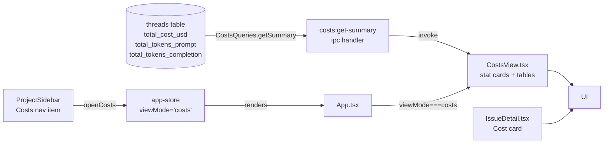
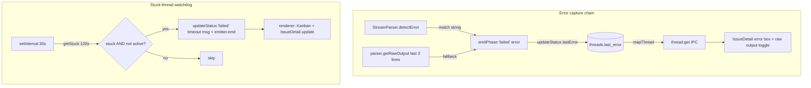

# Session Log — 2026-04-11

## Summary

- Session 1: Biome config — switched to spaces, migrated to v2, merged best-practice options
- Session 2: Costs view — full implementation (DB queries, IPC, CostsView, sidebar nav, IssueDetail cost card)
- Session 3: ShipCode rename fallout + UI polish — restored orphaned DB after app rename, unified `MODEL_DISPLAY` across Kanban + IssueDetail, replaced "GitHub Issues" header with project name + repo/board quick-links, hoisted `deriveGithubIssueUrl` to `@shipcode/shared`
- Session 4: Pipeline error surfacing + watchdog timeout — `Thread.lastError` end-to-end, IssueDetail error UI + debug toggle, focus rings, Re-run button at top, PRD collapsible, Kanban selected+failed border, stuck-thread watchdog
- Session 5: UI polish + pipeline rawOutput cleanup — `pill` Button variant, copy+chevron icons in error panel, strip hook events from rawOutput, settings sidebar bg fix

---

## Session 1: Biome Config Cleanup

**Status:** Complete

### Affected Components

| Layer | Components |
|-------|------------|
| Config | `biome.json` |

### What was done

- [x] Switched `indentStyle` from `tab` to `space` (indentWidth: 2)
- [x] Ran `bunx biome migrate --write` to upgrade schema from 1.9.4 → 2.4.11
- [x] Merged in best-practice options from a reference config: `files.includes` exclusions, `semicolons: "always"`, `trailingCommas: "all"`, `unsafeParameterDecoratorsEnabled: true`, `a11y.noLabelWithoutControl: "off"`
- [x] Dropped irrelevant overrides from reference config (`apps/app`, `apps/server`, `packages/agent`, etc. — don't exist in shipcode)
- [x] Ran `bunx biome format --write .` — 233 files checked, 198 fixed

### Files changed

- `biome.json` — indentStyle → space, schema → 2.4.11, added files.includes exclusions, updated JS formatter options, removed stale overrides

### Key decisions

- **Decision:** Keep `lineWidth: 100` (was already set, not in reference config)
  - **Rationale:** Already established across codebase; no reason to change

- **Decision:** Drop all `overrides` from reference config
  - **Context:** Reference config had overrides for `apps/app`, `apps/server`, etc. — paths that don't exist in shipcode
  - **Rationale:** Dead overrides add noise and confusion

### Mistakes and fixes

- **Mistake:** Initial `biome format --write` failed — schema version mismatch (1.9.4 vs CLI 2.4.11) and unknown `organizeImports` key
  - **Fix:** Ran `bunx biome migrate --write` first, then reformatted

### Next steps

- [ ] 26 biome parse errors remain (pre-existing, non-TS files like markdown/config) — not regressions, can ignore
- [ ] New LSP diagnostics: `lastError` missing/incompatible in `threads.ts` and `IssueDetail.test.tsx` — needs a fix (unrelated to this session)
- [ ] Manual QA items from 2026-04-10 still pending (IssueDetail expand/collapse, QA #1, QA #5)

---

## Session 2: Costs View Full Implementation

**Status:** Complete

### System Flow



### Affected Components

| Layer | Components |
|-------|------------|
| Frontend | `CostsView.tsx` (new), `ProjectSidebar.tsx`, `App.tsx`, `IssueDetail.tsx` |
| State | `app-store.ts` — `ViewMode` union + `openCosts` action |
| Backend (main) | `ipc.ts` — `costs:get-summary` handler + `CostsQueries` in `Queries` interface |
| Data | `packages/db/src/queries/costs.ts` (new), `packages/db/src/index.ts` |
| Types/IPC | `packages/shared/src/types.ts`, `packages/shared/src/ipc-channels.ts` |

### What was done

- [x] Planned costs feature via plan mode + adversarial Codex review (previous session)
- [x] Confirmed all implementation was complete after context compaction
- [x] Verified `ProjectCostSummary` and `CostSummary` types in `types.ts`
- [x] Verified `costs:get-summary` IPC channel in `ipc-channels.ts` + handler in `ipc.ts`
- [x] Verified `CostsQueries.getSummary()` in `packages/db/src/queries/costs.ts`, exported from index
- [x] Verified `ViewMode` includes `'costs'` and `openCosts` action in `app-store.ts`
- [x] Verified `App.tsx` routes `viewMode === 'costs'` → `<CostsView />`
- [x] Verified `CostsView.tsx` — stat cards (all-time, 7d, avg/task), by-project table, top tasks table, `$`/tokens toggle
- [x] Verified `ProjectSidebar.tsx` — Costs nav item with `DollarSign` icon
- [x] Verified `IssueDetail.tsx` — Cost card with `totalCostUsd` + token count in Pipeline section
- [x] Ran `bun run typecheck` — 14/14 packages green

### Files changed

- `packages/shared/src/types.ts` — `ProjectCostSummary` + `CostSummary` types
- `packages/shared/src/ipc-channels.ts` — `costs:get-summary` channel + `CostSummary` import
- `packages/db/src/queries/costs.ts` — new `CostsQueries` class
- `packages/db/src/index.ts` — exports `CostsQueries`
- `apps/desktop/src/main/ipc.ts` — `costs:get-summary` handler
- `apps/desktop/src/renderer/stores/app-store.ts` — `'costs'` in `ViewMode`, `openCosts` action
- `apps/desktop/src/renderer/App.tsx` — `viewMode === 'costs'` branch + `CostsView` import
- `apps/desktop/src/renderer/components/CostsView.tsx` — new costs page
- `apps/desktop/src/renderer/components/ProjectSidebar.tsx` — Costs nav button
- `apps/desktop/src/renderer/components/IssueDetail.tsx` — Cost card in Pipeline section

### Key decisions

- **No DB migration needed** — V6 already added cost columns to `threads`; query-only change
- **`$`/tokens toggle** — tokens tracked for all providers; toggle lets users see usage even when dollar cost is $0 (Claude/Codex CLI)
- **Footer note instead of hiding $0 rows** — transparent display with provider explanation
- **`formatCost`/`formatTokens` inline in `CostsView.tsx`** — single consumer; extract to shared utils later if needed

### Mistakes and fixes

None — implementation was already complete from prior context. Session verified and typechecked.

### Next steps

- [ ] Manual smoke test: `bun run dev` → click "Costs" in sidebar → verify page loads with $0.00
- [ ] Manual smoke test: verify Cost card appears in IssueDetail Pipeline section
- [ ] If OpenRouter tasks exist: verify costs appear in per-project table and top tasks list
- [ ] Consider extracting `formatCost`/`formatTokens` to `packages/shared/src/utils.ts` if more consumers added

---

## Session 3: ShipCode Rename Fallout + UI Polish

**Status:** Complete

### System Flow

```mermaid
flowchart TB
  subgraph Rename["App rename fallout"]
    OLD[~/Library/Application Support/@shipcode/desktop/<br/>data/shipcode.db — 2 projects] -->|app.setName('ShipCode')<br/>changed userData path| NEW[~/Library/Application Support/ShipCode/<br/>data/shipcode.db — 1 project]
    FIX[rm -rf @shipcode dir<br/>after visual confirm of ShipCode/] --> NEW
  end

  subgraph Unify["Model label unification"]
    KANBAN[KanbanBoard MODEL_DISPLAY<br/>'claude'→'sonnet 4.6'] -->|extract| SHARED_UI[packages/ui/lib/model-display.ts]
    SHARED_UI --> KANBAN
    SHARED_UI --> ISSUE[IssueDetail agents panel]
  end

  subgraph URL["GitHub URL helpers"]
    LOCAL[IssueDetail.tsx deriveGithubIssueUrl<br/>scp/ssh/https parser] -->|extract| SHARED[packages/shared/github-url.ts<br/>parseGithubRemote, githubRepoUrl,<br/>githubProjectsUrl, githubIssuesUrl,<br/>deriveGithubIssueUrl]
    SHARED --> ISSUE2[IssueDetail.tsx]
    SHARED --> TP[ThreadPanel.tsx]
    TP -->|projectName + repoUrl + projectsUrl| KB[KanbanBoard header]
  end
```

### Affected Components

| Layer | Components |
|-------|------------|
| Runtime data | `~/Library/Application Support/ShipCode/data/shipcode.db` (restored) |
| Shared utilities | `packages/shared/src/github-url.ts` (new), `packages/shared/src/index.ts` |
| UI primitives | `packages/ui/src/lib/model-display.ts` (new), `packages/ui/src/index.ts`, `packages/ui/src/KanbanBoard.tsx` |
| Desktop renderer | `apps/desktop/src/renderer/components/IssueDetail.tsx`, `ThreadPanel.tsx`, `IssueDetail.test.tsx` |

### What was done

- [x] Diagnosed "missing projects" after app rename — traced to Electron `userData` path change (`@shipcode/desktop` → `ShipCode`), both DBs living side-by-side
- [x] Deleted the stale `@shipcode` app-data directory after the user confirmed `ShipCode/` has the right DB
- [x] Explained why menu bar still says "Electron" in dev mode (`CFBundleName` baked into `Electron.app/Contents/Info.plist`, only fixed by packaged build)
- [x] Created `packages/ui/src/lib/model-display.ts` — single `MODEL_DISPLAY` map typed against `ExecutorModel` from `@shipcode/shared` so new providers fail typecheck until mapped
- [x] Removed the private copy from `KanbanBoard.tsx`, imported shared map
- [x] Updated `IssueDetail.tsx` agents panel — badges + `<Select>` items now render `sonnet 4.6` / `gpt 5.4` / `openrouter` matching the Kanban column labels
- [x] Created `packages/shared/src/github-url.ts` with `parseGithubRemote`, `githubRepoUrl`, `githubIssuesUrl`, `githubProjectsUrl`, `deriveGithubIssueUrl` — one parser handling scp, ssh, and https remotes
- [x] Removed the duplicate 30-line `deriveGithubIssueUrl` from `IssueDetail.tsx`, imported from `@shipcode/shared`
- [x] Updated `IssueDetail.test.tsx` to import `deriveGithubIssueUrl` from `@shipcode/shared` (11 tests still pass)
- [x] Refactored `makeThread` test helper to fix a `Partial<Thread>` spread type-widening error (`lastError?: string | null` vs `string | null`)
- [x] Added `projectName`, `repoUrl`, `projectsUrl`, `onOpenExternal` props to `KanbanBoardProps` — replaces the generic "GitHub Issues" heading with the project name plus `repo ↗` and `board ↗` quick-links
- [x] Wired `ThreadPanel.tsx` to compute URLs from `project.gitRemote` and route external clicks through `shell:open-external`
- [x] Verified `tsc --noEmit` clean across `@shipcode/shared`, `@shipcode/ui`, and `@shipcode/desktop`

### Files changed

- `packages/shared/src/github-url.ts` — new file: `parseGithubRemote`, `githubRepoUrl`, `githubIssuesUrl`, `githubProjectsUrl`, `deriveGithubIssueUrl`
- `packages/shared/src/index.ts` — re-exports new `github-url` module
- `packages/ui/src/lib/model-display.ts` — new file: `MODEL_DISPLAY` record + `modelDisplay` helper typed against `ExecutorModel`
- `packages/ui/src/index.ts` — re-exports `MODEL_DISPLAY` / `modelDisplay`
- `packages/ui/src/KanbanBoard.tsx` — imports shared `MODEL_DISPLAY`; new `projectName`, `repoUrl`, `projectsUrl`, `onOpenExternal` props; toolbar now renders project name + repo/board chips
- `apps/desktop/src/renderer/components/IssueDetail.tsx` — imports `deriveGithubIssueUrl` from `@shipcode/shared`, removed 30-line local copy; agents panel uses `MODEL_DISPLAY` for Badge + `<SelectItem>` labels
- `apps/desktop/src/renderer/components/ThreadPanel.tsx` — imports `githubRepoUrl` / `githubProjectsUrl` from shared, passes `projectName` / `repoUrl` / `projectsUrl` / `onOpenExternal` to `KanbanBoard`
- `apps/desktop/src/renderer/components/IssueDetail.test.tsx` — import path updated to `@shipcode/shared`; `makeThread` helper rewritten to build a concrete `Thread` before applying overrides to avoid optional-widening error
- *(Runtime artifact, not in git):* `~/Library/Application Support/@shipcode/` removed after confirming `~/Library/Application Support/ShipCode/data/shipcode.db` held the correct 2-project state

### Key decisions

- **Decision:** `deriveGithubIssueUrl` lives in `@shipcode/shared`, not `@shipcode/ui`.
  - **Context:** Prior session (2026-04-10) explicitly *declined* to extract it, citing "don't premature-abstract." That rationale no longer holds — the Kanban toolbar now needs repo/board URLs from the same remote, making it a genuine second caller.
  - **Rationale:** `@shipcode/shared` is framework-agnostic (no React), so CLI / main-process code can also use these helpers later. Keeping it in `@shipcode/ui` would force a React dep graph on consumers that just need URL parsing.

- **Decision:** `KanbanBoard` takes an optional `onOpenExternal` click interceptor rather than hardcoding `window.shipcode.invoke('shell:open-external', ...)`.
  - **Context:** `@shipcode/ui` is consumed by both `apps/desktop` (Electron) and `apps/web` (Vercel). Hardcoding the IPC would break the web build.
  - **Rationale:** The anchor still has a real `href` + `target="_blank"` so it works in the browser by default; Electron overrides with `preventDefault` + IPC. Zero-config for web, explicit for desktop. Matches the existing pattern used elsewhere in IssueDetail.

- **Decision:** `MODEL_DISPLAY` is typed as `Record<ExecutorModel, string>` rather than `Record<string, string>`.
  - **Context:** The `@shipcode/shared` `ExecutorModel` union was recently extended from `claude | codex` to `claude | codex | openrouter` on the `feat/openrouter-tier1` branch.
  - **Rationale:** Typing against the union turns "forgot to add a friendly label for the new provider" into a compile error instead of a runtime fallback to the ugly internal key. Pairs well with the memory rule about keeping provider additions in sync.

- **Decision:** `makeThread` test helper builds a concrete `Thread` then spreads overrides, instead of `{ ...defaults, ...overrides }` at the return.
  - **Context:** TS flagged `lastError: null | string | undefined` on the merged literal because `Partial<Thread>` widens `lastError: string | null` to include `undefined`.
  - **Rationale:** Building the base as a typed `Thread` first narrows the spread result back to `Thread`. Minimal change, keeps test call-sites unchanged.

### Mistakes and fixes

- **Mistake:** Initial attempt to fix "LSP says `toggleIssueDetailExpanded` doesn't exist" without checking — it already *did* exist. LSP diagnostics were stale; `tsc --noEmit` passed clean. → **Fix:** Ran full typecheck to verify before touching the store. Saved a wasted edit.
- **Mistake:** First removal of the local `deriveGithubIssueUrl` also broke `IssueDetail.test.tsx` which was importing it from `./IssueDetail`. → **Fix:** Updated the test import to `@shipcode/shared` in the same pass.
- **Mistake:** After the shared extract, `tsc` on `@shipcode/desktop` couldn't resolve `deriveGithubIssueUrl` because `@shipcode/shared` ships from `./dist` per its `exports` map. → **Fix:** Ran `bun run build` in `packages/shared` to regenerate `dist/` before rechecking downstream apps.
- **Mistake:** Briefly deleted the `processToThread` field from `app-store.ts` while chasing the stale LSP error. → **Fix:** Linter/user restored it immediately; kept the restored version and added back the `mapProcessToThread` action.

### Next steps

- [ ] Manual smoke test: relaunch the app and confirm (a) both projects are back in the sidebar, (b) Kanban header shows the project name with `repo ↗` + `board ↗` chips, (c) clicking the chips opens the browser, (d) IssueDetail agents panel shows `sonnet 4.6 / gpt 5.4` labels
- [ ] Decide whether to repeat the `shell:open-external` wiring for the `IssueDetail.tsx` "View on GitHub" buttons that currently invoke IPC directly — might be worth a follow-up pass to unify click handling via a `useOpenExternal` hook if more consumers need it
- [ ] Consider adding a `postinstall` script that patches `node_modules/electron/dist/Electron.app/Contents/Info.plist` so the dev menu bar says "ShipCode" instead of "Electron" — held back for now because the packaged build already shows the right name
- [ ] Eventually: remove `.claude-shipshitdev/` and `.codex-shipshitdev/` legacy dirs under `$HOME` once the Anthropic account consolidation is done (unrelated to this session but surfaced by the userData investigation)

---

## Session 4: Pipeline Error Surfacing + Watchdog Timeout

**Status:** Complete

### System Flow



### Affected Components

| Layer | Components |
|-------|------------|
| Frontend | `IssueDetail.tsx`, `KanbanBoard.tsx`, `app.css` |
| Backend (pipeline) | `packages/pipeline/src/pipeline.ts` |
| Backend (main) | `apps/desktop/src/main/index.ts` |
| Data | `packages/db/src/schema.ts`, `packages/db/src/index.ts`, `packages/db/src/queries/threads.ts` |
| Types | `packages/shared/src/types.ts` |
| Tests | `apps/desktop/src/renderer/components/IssueDetail.test.tsx` |

### What was done

- [x] Added `migrateV8` — `last_error TEXT` column on threads, schema version 8
- [x] Added `lastError: string | null` to `Thread` interface
- [x] `threads.updateStatus` accepts optional 3rd param `lastError?`; `mapThread` maps `last_error`
- [x] `emitPhase(threadId, phase, error?)` stores error on `failed`; all failure sites pass human-readable reason via `StreamParser.detectError()?.match` or raw output last-3-lines fallback
- [x] Fixed `pipelinePhase !== 'failed'` guard — "Pipeline is running" no longer shown on failed state
- [x] IssueDetail: error box with raw output debug toggle (both collapsed panel and expanded sidebar)
- [x] Re-run button moved to top (main action on a failed issue)
- [x] PRD section made collapsible (chevron header)
- [x] Kanban card border priority fixed: selected+failed → `border-danger`; selected+awaiting → `border-warning`
- [x] Global focus ring removal in `app.css`
- [x] `makeThread()` test factory gets `lastError: null`
- [x] `ThreadQueries.getStuck(thresholdMs)` — SQL time-based filter on active-phase rows
- [x] App-level watchdog in `main/index.ts`: 30s interval, `pipeline.listActive()` guard, marks stuck threads failed, emits renderer event, cleared on window close

### Files changed

- `packages/db/src/schema.ts` — `migrateV8()`
- `packages/db/src/index.ts` — calls `migrateV8`
- `packages/db/src/queries/threads.ts` — `updateStatus` 3rd param; `mapThread` maps `last_error`; `getStuck(thresholdMs)`
- `packages/shared/src/types.ts` — `lastError: string | null` on `Thread`
- `packages/pipeline/src/pipeline.ts` — `emitPhase` error arg; human-readable failure messages
- `apps/desktop/src/renderer/components/IssueDetail.tsx` — error box + debug toggle; running guard; Re-run top; PRD collapsible
- `packages/ui/src/KanbanBoard.tsx` — card border priority: failed/awaiting preserved when selected
- `apps/desktop/src/renderer/styles/app.css` — `*:focus, *:focus-visible { outline: none !important }`
- `apps/desktop/src/renderer/components/IssueDetail.test.tsx` — `lastError: null` in `makeThread()`
- `apps/desktop/src/main/index.ts` — `HEARTBEAT_TIMEOUT_MS` import; watchdog setInterval + clearInterval on close

### Key decisions

- **Decision:** `last_error` on threads table, not a separate errors table
  - **Rationale:** One-to-one; overwritten on re-run. No history needed.

- **Decision:** Watchdog uses `pipeline.listActive()` guard
  - **Context:** Codex adversarial review: long-running legitimate phases would be killed if only `updated_at` checked
  - **Rationale:** `listActive()` already exists on `Pipeline` interface — zero new surface area.

- **Decision:** Error text is `detectError()?.match` or last 3 raw lines, not the internal jargon string
  - **Rationale:** "Plan generation failed (exit 1): no parseable plan after 3 retries" is opaque. Claude's actual output is more actionable.

### Mistakes and fixes

- **Mistake:** `Edit` tool rejected edits to `IssueDetail.tsx` — linter reformatted between reads
  - **Fix:** Always re-read immediately before editing

- **Mistake:** Exit-127 block in pipeline.ts had 2 matches (ambiguous context)
  - **Fix:** Extended `old_string` with more surrounding unique lines

- **Mistake:** Codex review caught import placed inline in plan (invalid TS) and duplicate watchdog risk inside `createWindow`
  - **Fix:** Import at file top; timer cleared in `closed` handler

### Next steps

- [ ] Manual QA: trigger pipeline → Cmd+R renderer refresh → wait 2–3 min → confirm stuck thread flips to FAILED with timeout message
- [ ] Manual QA: run pipeline to completion — confirm watchdog does NOT interrupt it
- [ ] Old `last_error` values from pre-fix runs (jargon strings) persist until re-run — expected, no action needed
- [ ] Consider surfacing executor rawOutput in debug toggle (currently only `planHistory[0]?.rawOutput`)

---

## Session 5: UI Polish + Pipeline rawOutput Cleanup

**Status:** Complete

### Affected Components

| Layer | Components |
|-------|------------|
| UI primitives | `packages/ui/src/primitives/button.tsx`, `packages/ui/src/index.ts`, `packages/ui/src/KanbanBoard.tsx` |
| Desktop renderer | `apps/desktop/src/renderer/components/IssueDetail.tsx`, `SettingsSidebar.tsx` |
| Pipeline agents | `packages/agents/src/stream-parser.ts`, `packages/agents/src/providers/cli-provider.ts` |

### What was done

- [x] Removed `base:` label from Kanban header branch selector — trigger stands alone like repo/board chips
- [x] Added `pill` variant to `Button` — replaces repeated long Tailwind class lists across repo/board/base-branch controls
- [x] Refactored repo/board `<a>` tags → `<Button asChild variant="pill" size="xs">`
- [x] Base-branch `SelectTrigger` → `cn(buttonVariants({ variant: 'pill', size: 'xs' }), 'font-mono')`
- [x] Added `Copy` icon button to error panel in `IssueDetail` (both modal + panel) — copies `lastError + rawOutput` to clipboard
- [x] Replaced "hide output / show output" text toggle with `ChevronUp` / `ChevronDown` icons
- [x] Exported `ChevronUp`, `ChevronDown`, `Copy` from `@shipcode/ui`
- [x] Diagnosed pipeline FAILED output: `SessionStart` hooks fire inside planner subprocess, leaking `{"type":"system",...}` NDJSON into `rawOutput`
- [x] Added `StreamParser.stripSystemEvents(raw)` — filters `type === "system"` and `type === "rate_limit_event"` lines
- [x] Applied in `cli-provider.ts` Claude provider — clean `rawOutput` stored going forward
- [x] Fixed `SettingsSidebar` background: `bg-secondary` → `bg-primary` to match `ProjectSidebar`

### Files changed

- `packages/ui/src/primitives/button.tsx` — added `pill` variant
- `packages/ui/src/index.ts` — exported `ChevronUp`, `ChevronDown`, `Copy`
- `packages/ui/src/KanbanBoard.tsx` — `Button asChild` for links; `buttonVariants` for SelectTrigger; removed `base:` label
- `apps/desktop/src/renderer/components/IssueDetail.tsx` — copy icon + chevron toggle in both error panel instances
- `apps/desktop/src/renderer/components/SettingsSidebar.tsx` — `bg-secondary` → `bg-primary`
- `packages/agents/src/stream-parser.ts` — `static stripSystemEvents(raw: string): string`
- `packages/agents/src/providers/cli-provider.ts` — Claude provider wraps rawOutput in `stripSystemEvents`

### Key decisions

- **Decision:** Strip system events at provider boundary, not in `StreamParser.feed()`.
  - **Rationale:** Parser still needs `{"type":"result",...}` lines to extract usage — those are preserved. Stripping only at the output boundary keeps parser internals unchanged and makes stored rawOutput the clean canonical value.

- **Decision:** `pill` Button variant instead of new component.
  - **Rationale:** Button already has `asChild` + CVA. A variant is two lines; a new component adds abstraction for one use case.

### Mistakes and fixes

- **Mistake:** Added `ChevronUp`/`ChevronDown` import to `IssueDetail.tsx` before exporting them from `@shipcode/ui` → LSP errors. **Fix:** Added to icon re-export list in `index.ts` in same pass.
- **Mistake:** First summary line for this session incorrectly said "Session 4" (there was already a Session 4). **Fix:** Corrected to Session 5.

### Next steps

- [ ] Smoke test: trigger a FAILED pipeline run — verify error panel shows clean output (no hook JSON)
- [ ] Smoke test: click copy icon — paste should contain only `lastError + rawOutput`, no system events
- [ ] Fix `SettingsSidebar` LSP error: `'archived'` not assignable to `SettingsSection` — add `archived` to the union or remove the section
- [ ] Check Codex provider — may also benefit from `stripSystemEvents` if its output includes similar hook leakage
