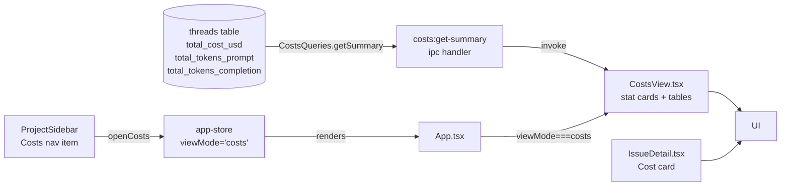
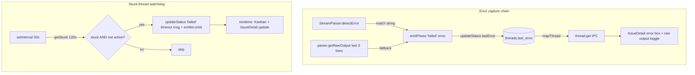
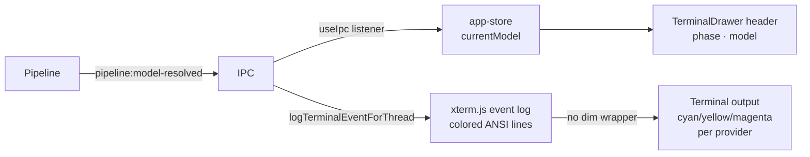
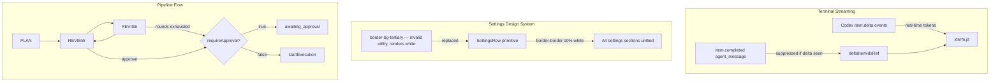
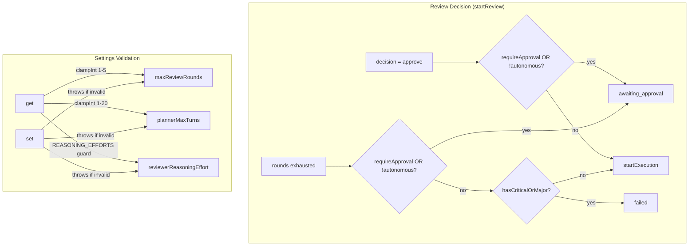

```mermaid
flowchart TB
  subgraph Onboarding["Onboarding → sidebar auto-select"]
    WIZ[OnboardingWizard\nhandleFinish async] -->|settings:set| SETTINGS[AppSettings saved]
    SETTINGS -->|dialog:open-directory| PICKER[folder picker]
    PICKER -->|path selected| ADD[project:add IPC]
    ADD -->|project.id| COMPLETE[onComplete newProjectId]
    COMPLETE -->|selectProject| SIDEBAR[sidebar highlights project]
    COMPLETE -->|fire-and-forget| PRELOAD[github:refresh-issues]
  end

  subgraph Sidebar["Sidebar add → issue pre-load"]
    PLUS[+ button in sidebar] -->|dialog:open-directory| ADD2[project:add IPC]
    ADD2 -->|onSuccess| SEL[selectProject]
    SEL -->|fire-and-forget| PRELOAD2[github:refresh-issues]
  end

  subgraph ListView["List view toggle"]
    TOOLBAR[KanbanBoard toolbar\nLayoutList / LayoutGrid buttons] -->|view state| SWITCH{view}
    SWITCH -->|list| LISTVIEW[IssueListView\ngrouped + collapsible]
    SWITCH -->|kanban| BOARD[DndContext Kanban]
    DNDCTX[DndContext hoisted\nwraps both views] --> LISTVIEW
    DNDCTX --> BOARD
    LISTVIEW -->|DRAGGABLE_STATUSES rows| DND[useDraggable on todo/queued/failed rows]
    LISTVIEW -->|group headers| DROP[useDroppable on group sections]
    DROP -->|same drop IDs| HANDLER[handleDragEnd unchanged]
  end
```

# Session Log — 2026-04-11

## Summary

- Session 1: Biome config — switched to spaces, migrated to v2, merged best-practice options
- Session 2: Costs view — full implementation (DB queries, IPC, CostsView, sidebar nav, IssueDetail cost card)
- Session 3: ShipCode rename fallout + UI polish — restored orphaned DB after app rename, unified `MODEL_DISPLAY` across Kanban + IssueDetail, replaced "GitHub Issues" header with project name + repo/board quick-links, hoisted `deriveGithubIssueUrl` to `@shipcode/shared`
- Session 4: Pipeline error surfacing + watchdog timeout — `Thread.lastError` end-to-end, IssueDetail error UI + debug toggle, focus rings, Re-run button at top, PRD collapsible, Kanban selected+failed border, stuck-thread watchdog
- Session 5: UI polish + pipeline rawOutput cleanup — `pill` Button variant, copy+chevron icons in error panel, strip hook events from rawOutput, settings sidebar bg fix
- Session 6: Terminal UX — richer ANSI colors, agent/model display in header + log lines, per-provider cost estimation
- Session 7: Onboarding project auto-select + issue pre-load + Kanban/List view toggle with drag-and-drop in list view
- Session 8: Board triage + OpenRouter test fixes + PR #17 merged — fixed codex v1 CLI args, emitPhase arity, stale snapshots; closed issue #11; merged feat/openrouter-tier1
- Session 9: Terminal streaming + Settings design system + Pipeline flow fixes — Codex item.delta real-time streaming, SettingsRow UI primitive, border-border fix, plannerMaxTurns/maxReviewRounds/requireApproval/reviewerReasoningEffort settings, unified review→revise loop for both modes
- Session 10: Adversarial review findings — approval-mode hard-fail + settings validation — fixed pipeline routing so non-autonomous threads never auto-execute, requireApproval checked before severity, clampInt/REASONING_EFFORTS guards on settings read+write, 3 new pipeline tests
- Session 11: Pipeline Phase Skills + `/skills` Editor — full implementation. 5 Codex-style skills at `skills/<phase>/SKILL.md`, build-time bake to `defaults.generated.ts`, new `SkillsQueries` DB table with 3-tier resolution (project→global→default), validator + quarantine + fallback notifications, all 4 prompt builders rewritten, new `buildExecutionPrompt`, `/skills` page with scope picker/editor/quarantine banner. Addresses 3 Codex adversarial-review findings (cross-project contamination, stale DB blobs, user bricking).

---

## Session 1: Biome Config Cleanup

**Status:** Complete

### Affected Components

| Layer | Components |
|-------|------------|
| Config | `biome.json` |

### What was done

- [x] Switched `indentStyle` from `tab` to `space` (indentWidth: 2)
- [x] Ran `bunx biome migrate --write` to upgrade schema from 1.9.4 → 2.4.11
- [x] Merged in best-practice options from a reference config: `files.includes` exclusions, `semicolons: "always"`, `trailingCommas: "all"`, `unsafeParameterDecoratorsEnabled: true`, `a11y.noLabelWithoutControl: "off"`
- [x] Dropped irrelevant overrides from reference config (`apps/app`, `apps/server`, `packages/agent`, etc. — don't exist in shipcode)
- [x] Ran `bunx biome format --write .` — 233 files checked, 198 fixed

### Files changed

- `biome.json` — indentStyle → space, schema → 2.4.11, added files.includes exclusions, updated JS formatter options, removed stale overrides

### Key decisions

- **Decision:** Keep `lineWidth: 100` (was already set, not in reference config)
  - **Rationale:** Already established across codebase; no reason to change

- **Decision:** Drop all `overrides` from reference config
  - **Context:** Reference config had overrides for `apps/app`, `apps/server`, etc. — paths that don't exist in shipcode
  - **Rationale:** Dead overrides add noise and confusion

### Mistakes and fixes

- **Mistake:** Initial `biome format --write` failed — schema version mismatch (1.9.4 vs CLI 2.4.11) and unknown `organizeImports` key
  - **Fix:** Ran `bunx biome migrate --write` first, then reformatted

### Next steps

- [ ] 26 biome parse errors remain (pre-existing, non-TS files like markdown/config) — not regressions, can ignore
- [ ] New LSP diagnostics: `lastError` missing/incompatible in `threads.ts` and `IssueDetail.test.tsx` — needs a fix (unrelated to this session)
- [ ] Manual QA items from 2026-04-10 still pending (IssueDetail expand/collapse, QA #1, QA #5)

---

## Session 2: Costs View Full Implementation

**Status:** Complete

### System Flow



### Affected Components

| Layer | Components |
|-------|------------|
| Frontend | `CostsView.tsx` (new), `ProjectSidebar.tsx`, `App.tsx`, `IssueDetail.tsx` |
| State | `app-store.ts` — `ViewMode` union + `openCosts` action |
| Backend (main) | `ipc.ts` — `costs:get-summary` handler + `CostsQueries` in `Queries` interface |
| Data | `packages/db/src/queries/costs.ts` (new), `packages/db/src/index.ts` |
| Types/IPC | `packages/shared/src/types.ts`, `packages/shared/src/ipc-channels.ts` |

### What was done

- [x] Planned costs feature via plan mode + adversarial Codex review (previous session)
- [x] Confirmed all implementation was complete after context compaction
- [x] Verified `ProjectCostSummary` and `CostSummary` types in `types.ts`
- [x] Verified `costs:get-summary` IPC channel in `ipc-channels.ts` + handler in `ipc.ts`
- [x] Verified `CostsQueries.getSummary()` in `packages/db/src/queries/costs.ts`, exported from index
- [x] Verified `ViewMode` includes `'costs'` and `openCosts` action in `app-store.ts`
- [x] Verified `App.tsx` routes `viewMode === 'costs'` → `<CostsView />`
- [x] Verified `CostsView.tsx` — stat cards (all-time, 7d, avg/task), by-project table, top tasks table, `$`/tokens toggle
- [x] Verified `ProjectSidebar.tsx` — Costs nav item with `DollarSign` icon
- [x] Verified `IssueDetail.tsx` — Cost card with `totalCostUsd` + token count in Pipeline section
- [x] Ran `bun run typecheck` — 14/14 packages green

### Files changed

- `packages/shared/src/types.ts` — `ProjectCostSummary` + `CostSummary` types
- `packages/shared/src/ipc-channels.ts` — `costs:get-summary` channel + `CostSummary` import
- `packages/db/src/queries/costs.ts` — new `CostsQueries` class
- `packages/db/src/index.ts` — exports `CostsQueries`
- `apps/desktop/src/main/ipc.ts` — `costs:get-summary` handler
- `apps/desktop/src/renderer/stores/app-store.ts` — `'costs'` in `ViewMode`, `openCosts` action
- `apps/desktop/src/renderer/App.tsx` — `viewMode === 'costs'` branch + `CostsView` import
- `apps/desktop/src/renderer/components/CostsView.tsx` — new costs page
- `apps/desktop/src/renderer/components/ProjectSidebar.tsx` — Costs nav button
- `apps/desktop/src/renderer/components/IssueDetail.tsx` — Cost card in Pipeline section

### Key decisions

- **No DB migration needed** — V6 already added cost columns to `threads`; query-only change
- **`$`/tokens toggle** — tokens tracked for all providers; toggle lets users see usage even when dollar cost is $0 (Claude/Codex CLI)
- **Footer note instead of hiding $0 rows** — transparent display with provider explanation
- **`formatCost`/`formatTokens` inline in `CostsView.tsx`** — single consumer; extract to shared utils later if needed

### Mistakes and fixes

None — implementation was already complete from prior context. Session verified and typechecked.

### Next steps

- [ ] Manual smoke test: `bun run dev` → click "Costs" in sidebar → verify page loads with $0.00
- [ ] Manual smoke test: verify Cost card appears in IssueDetail Pipeline section
- [ ] If OpenRouter tasks exist: verify costs appear in per-project table and top tasks list
- [ ] Consider extracting `formatCost`/`formatTokens` to `packages/shared/src/utils.ts` if more consumers added

---

## Session 3: ShipCode Rename Fallout + UI Polish

**Status:** Complete

### System Flow

```mermaid
flowchart TB
  subgraph Rename["App rename fallout"]
    OLD[~/Library/Application Support/@shipcode/desktop/<br/>data/shipcode.db — 2 projects] -->|app.setName('ShipCode')<br/>changed userData path| NEW[~/Library/Application Support/ShipCode/<br/>data/shipcode.db — 1 project]
    FIX[rm -rf @shipcode dir<br/>after visual confirm of ShipCode/] --> NEW
  end

  subgraph Unify["Model label unification"]
    KANBAN[KanbanBoard MODEL_DISPLAY<br/>'claude'→'sonnet 4.6'] -->|extract| SHARED_UI[packages/ui/lib/model-display.ts]
    SHARED_UI --> KANBAN
    SHARED_UI --> ISSUE[IssueDetail agents panel]
  end

  subgraph URL["GitHub URL helpers"]
    LOCAL[IssueDetail.tsx deriveGithubIssueUrl<br/>scp/ssh/https parser] -->|extract| SHARED[packages/shared/github-url.ts<br/>parseGithubRemote, githubRepoUrl,<br/>githubProjectsUrl, githubIssuesUrl,<br/>deriveGithubIssueUrl]
    SHARED --> ISSUE2[IssueDetail.tsx]
    SHARED --> TP[ThreadPanel.tsx]
    TP -->|projectName + repoUrl + projectsUrl| KB[KanbanBoard header]
  end
```

### Affected Components

| Layer | Components |
|-------|------------|
| Runtime data | `~/Library/Application Support/ShipCode/data/shipcode.db` (restored) |
| Shared utilities | `packages/shared/src/github-url.ts` (new), `packages/shared/src/index.ts` |
| UI primitives | `packages/ui/src/lib/model-display.ts` (new), `packages/ui/src/index.ts`, `packages/ui/src/KanbanBoard.tsx` |
| Desktop renderer | `apps/desktop/src/renderer/components/IssueDetail.tsx`, `ThreadPanel.tsx`, `IssueDetail.test.tsx` |

### What was done

- [x] Diagnosed "missing projects" after app rename — traced to Electron `userData` path change (`@shipcode/desktop` → `ShipCode`), both DBs living side-by-side
- [x] Deleted the stale `@shipcode` app-data directory after the user confirmed `ShipCode/` has the right DB
- [x] Explained why menu bar still says "Electron" in dev mode (`CFBundleName` baked into `Electron.app/Contents/Info.plist`, only fixed by packaged build)
- [x] Created `packages/ui/src/lib/model-display.ts` — single `MODEL_DISPLAY` map typed against `ExecutorModel` from `@shipcode/shared` so new providers fail typecheck until mapped
- [x] Removed the private copy from `KanbanBoard.tsx`, imported shared map
- [x] Updated `IssueDetail.tsx` agents panel — badges + `<Select>` items now render `sonnet 4.6` / `gpt 5.4` / `openrouter` matching the Kanban column labels
- [x] Created `packages/shared/src/github-url.ts` with `parseGithubRemote`, `githubRepoUrl`, `githubIssuesUrl`, `githubProjectsUrl`, `deriveGithubIssueUrl` — one parser handling scp, ssh, and https remotes
- [x] Removed the duplicate 30-line `deriveGithubIssueUrl` from `IssueDetail.tsx`, imported from `@shipcode/shared`
- [x] Updated `IssueDetail.test.tsx` to import `deriveGithubIssueUrl` from `@shipcode/shared` (11 tests still pass)
- [x] Refactored `makeThread` test helper to fix a `Partial<Thread>` spread type-widening error (`lastError?: string | null` vs `string | null`)
- [x] Added `projectName`, `repoUrl`, `projectsUrl`, `onOpenExternal` props to `KanbanBoardProps` — replaces the generic "GitHub Issues" heading with the project name plus `repo ↗` and `board ↗` quick-links
- [x] Wired `ThreadPanel.tsx` to compute URLs from `project.gitRemote` and route external clicks through `shell:open-external`
- [x] Verified `tsc --noEmit` clean across `@shipcode/shared`, `@shipcode/ui`, and `@shipcode/desktop`

### Files changed

- `packages/shared/src/github-url.ts` — new file: `parseGithubRemote`, `githubRepoUrl`, `githubIssuesUrl`, `githubProjectsUrl`, `deriveGithubIssueUrl`
- `packages/shared/src/index.ts` — re-exports new `github-url` module
- `packages/ui/src/lib/model-display.ts` — new file: `MODEL_DISPLAY` record + `modelDisplay` helper typed against `ExecutorModel`
- `packages/ui/src/index.ts` — re-exports `MODEL_DISPLAY` / `modelDisplay`
- `packages/ui/src/KanbanBoard.tsx` — imports shared `MODEL_DISPLAY`; new `projectName`, `repoUrl`, `projectsUrl`, `onOpenExternal` props; toolbar now renders project name + repo/board chips
- `apps/desktop/src/renderer/components/IssueDetail.tsx` — imports `deriveGithubIssueUrl` from `@shipcode/shared`, removed 30-line local copy; agents panel uses `MODEL_DISPLAY` for Badge + `<SelectItem>` labels
- `apps/desktop/src/renderer/components/ThreadPanel.tsx` — imports `githubRepoUrl` / `githubProjectsUrl` from shared, passes `projectName` / `repoUrl` / `projectsUrl` / `onOpenExternal` to `KanbanBoard`
- `apps/desktop/src/renderer/components/IssueDetail.test.tsx` — import path updated to `@shipcode/shared`; `makeThread` helper rewritten to build a concrete `Thread` before applying overrides to avoid optional-widening error
- *(Runtime artifact, not in git):* `~/Library/Application Support/@shipcode/` removed after confirming `~/Library/Application Support/ShipCode/data/shipcode.db` held the correct 2-project state

### Key decisions

- **Decision:** `deriveGithubIssueUrl` lives in `@shipcode/shared`, not `@shipcode/ui`.
  - **Context:** Prior session (2026-04-10) explicitly *declined* to extract it, citing "don't premature-abstract." That rationale no longer holds — the Kanban toolbar now needs repo/board URLs from the same remote, making it a genuine second caller.
  - **Rationale:** `@shipcode/shared` is framework-agnostic (no React), so CLI / main-process code can also use these helpers later. Keeping it in `@shipcode/ui` would force a React dep graph on consumers that just need URL parsing.

- **Decision:** `KanbanBoard` takes an optional `onOpenExternal` click interceptor rather than hardcoding `window.shipcode.invoke('shell:open-external', ...)`.
  - **Context:** `@shipcode/ui` is consumed by both `apps/desktop` (Electron) and `apps/web` (Vercel). Hardcoding the IPC would break the web build.
  - **Rationale:** The anchor still has a real `href` + `target="_blank"` so it works in the browser by default; Electron overrides with `preventDefault` + IPC. Zero-config for web, explicit for desktop. Matches the existing pattern used elsewhere in IssueDetail.

- **Decision:** `MODEL_DISPLAY` is typed as `Record<ExecutorModel, string>` rather than `Record<string, string>`.
  - **Context:** The `@shipcode/shared` `ExecutorModel` union was recently extended from `claude | codex` to `claude | codex | openrouter` on the `feat/openrouter-tier1` branch.
  - **Rationale:** Typing against the union turns "forgot to add a friendly label for the new provider" into a compile error instead of a runtime fallback to the ugly internal key. Pairs well with the memory rule about keeping provider additions in sync.

- **Decision:** `makeThread` test helper builds a concrete `Thread` then spreads overrides, instead of `{ ...defaults, ...overrides }` at the return.
  - **Context:** TS flagged `lastError: null | string | undefined` on the merged literal because `Partial<Thread>` widens `lastError: string | null` to include `undefined`.
  - **Rationale:** Building the base as a typed `Thread` first narrows the spread result back to `Thread`. Minimal change, keeps test call-sites unchanged.

### Mistakes and fixes

- **Mistake:** Initial attempt to fix "LSP says `toggleIssueDetailExpanded` doesn't exist" without checking — it already *did* exist. LSP diagnostics were stale; `tsc --noEmit` passed clean. → **Fix:** Ran full typecheck to verify before touching the store. Saved a wasted edit.
- **Mistake:** First removal of the local `deriveGithubIssueUrl` also broke `IssueDetail.test.tsx` which was importing it from `./IssueDetail`. → **Fix:** Updated the test import to `@shipcode/shared` in the same pass.
- **Mistake:** After the shared extract, `tsc` on `@shipcode/desktop` couldn't resolve `deriveGithubIssueUrl` because `@shipcode/shared` ships from `./dist` per its `exports` map. → **Fix:** Ran `bun run build` in `packages/shared` to regenerate `dist/` before rechecking downstream apps.
- **Mistake:** Briefly deleted the `processToThread` field from `app-store.ts` while chasing the stale LSP error. → **Fix:** Linter/user restored it immediately; kept the restored version and added back the `mapProcessToThread` action.

### Next steps

- [ ] Manual smoke test: relaunch the app and confirm (a) both projects are back in the sidebar, (b) Kanban header shows the project name with `repo ↗` + `board ↗` chips, (c) clicking the chips opens the browser, (d) IssueDetail agents panel shows `sonnet 4.6 / gpt 5.4` labels
- [ ] Decide whether to repeat the `shell:open-external` wiring for the `IssueDetail.tsx` "View on GitHub" buttons that currently invoke IPC directly — might be worth a follow-up pass to unify click handling via a `useOpenExternal` hook if more consumers need it
- [ ] Consider adding a `postinstall` script that patches `node_modules/electron/dist/Electron.app/Contents/Info.plist` so the dev menu bar says "ShipCode" instead of "Electron" — held back for now because the packaged build already shows the right name
- [ ] Eventually: remove `.claude-shipshitdev/` and `.codex-shipshitdev/` legacy dirs under `$HOME` once the Anthropic account consolidation is done (unrelated to this session but surfaced by the userData investigation)

---

## Session 4: Pipeline Error Surfacing + Watchdog Timeout

**Status:** Complete

### System Flow



### Affected Components

| Layer | Components |
|-------|------------|
| Frontend | `IssueDetail.tsx`, `KanbanBoard.tsx`, `app.css` |
| Backend (pipeline) | `packages/pipeline/src/pipeline.ts` |
| Backend (main) | `apps/desktop/src/main/index.ts` |
| Data | `packages/db/src/schema.ts`, `packages/db/src/index.ts`, `packages/db/src/queries/threads.ts` |
| Types | `packages/shared/src/types.ts` |
| Tests | `apps/desktop/src/renderer/components/IssueDetail.test.tsx` |

### What was done

- [x] Added `migrateV8` — `last_error TEXT` column on threads, schema version 8
- [x] Added `lastError: string | null` to `Thread` interface
- [x] `threads.updateStatus` accepts optional 3rd param `lastError?`; `mapThread` maps `last_error`
- [x] `emitPhase(threadId, phase, error?)` stores error on `failed`; all failure sites pass human-readable reason via `StreamParser.detectError()?.match` or raw output last-3-lines fallback
- [x] Fixed `pipelinePhase !== 'failed'` guard — "Pipeline is running" no longer shown on failed state
- [x] IssueDetail: error box with raw output debug toggle (both collapsed panel and expanded sidebar)
- [x] Re-run button moved to top (main action on a failed issue)
- [x] PRD section made collapsible (chevron header)
- [x] Kanban card border priority fixed: selected+failed → `border-danger`; selected+awaiting → `border-warning`
- [x] Global focus ring removal in `app.css`
- [x] `makeThread()` test factory gets `lastError: null`
- [x] `ThreadQueries.getStuck(thresholdMs)` — SQL time-based filter on active-phase rows
- [x] App-level watchdog in `main/index.ts`: 30s interval, `pipeline.listActive()` guard, marks stuck threads failed, emits renderer event, cleared on window close

### Files changed

- `packages/db/src/schema.ts` — `migrateV8()`
- `packages/db/src/index.ts` — calls `migrateV8`
- `packages/db/src/queries/threads.ts` — `updateStatus` 3rd param; `mapThread` maps `last_error`; `getStuck(thresholdMs)`
- `packages/shared/src/types.ts` — `lastError: string | null` on `Thread`
- `packages/pipeline/src/pipeline.ts` — `emitPhase` error arg; human-readable failure messages
- `apps/desktop/src/renderer/components/IssueDetail.tsx` — error box + debug toggle; running guard; Re-run top; PRD collapsible
- `packages/ui/src/KanbanBoard.tsx` — card border priority: failed/awaiting preserved when selected
- `apps/desktop/src/renderer/styles/app.css` — `*:focus, *:focus-visible { outline: none !important }`
- `apps/desktop/src/renderer/components/IssueDetail.test.tsx` — `lastError: null` in `makeThread()`
- `apps/desktop/src/main/index.ts` — `HEARTBEAT_TIMEOUT_MS` import; watchdog setInterval + clearInterval on close

### Key decisions

- **Decision:** `last_error` on threads table, not a separate errors table
  - **Rationale:** One-to-one; overwritten on re-run. No history needed.

- **Decision:** Watchdog uses `pipeline.listActive()` guard
  - **Context:** Codex adversarial review: long-running legitimate phases would be killed if only `updated_at` checked
  - **Rationale:** `listActive()` already exists on `Pipeline` interface — zero new surface area.

- **Decision:** Error text is `detectError()?.match` or last 3 raw lines, not the internal jargon string
  - **Rationale:** "Plan generation failed (exit 1): no parseable plan after 3 retries" is opaque. Claude's actual output is more actionable.

### Mistakes and fixes

- **Mistake:** `Edit` tool rejected edits to `IssueDetail.tsx` — linter reformatted between reads
  - **Fix:** Always re-read immediately before editing

- **Mistake:** Exit-127 block in pipeline.ts had 2 matches (ambiguous context)
  - **Fix:** Extended `old_string` with more surrounding unique lines

- **Mistake:** Codex review caught import placed inline in plan (invalid TS) and duplicate watchdog risk inside `createWindow`
  - **Fix:** Import at file top; timer cleared in `closed` handler

### Next steps

- [ ] Manual QA: trigger pipeline → Cmd+R renderer refresh → wait 2–3 min → confirm stuck thread flips to FAILED with timeout message
- [ ] Manual QA: run pipeline to completion — confirm watchdog does NOT interrupt it
- [ ] Old `last_error` values from pre-fix runs (jargon strings) persist until re-run — expected, no action needed
- [ ] Consider surfacing executor rawOutput in debug toggle (currently only `planHistory[0]?.rawOutput`)

---

## Session 5: UI Polish + Pipeline rawOutput Cleanup

**Status:** Complete

### Affected Components

| Layer | Components |
|-------|------------|
| UI primitives | `packages/ui/src/primitives/button.tsx`, `packages/ui/src/index.ts`, `packages/ui/src/KanbanBoard.tsx` |
| Desktop renderer | `apps/desktop/src/renderer/components/IssueDetail.tsx`, `SettingsSidebar.tsx` |
| Pipeline agents | `packages/agents/src/stream-parser.ts`, `packages/agents/src/providers/cli-provider.ts` |

### What was done

- [x] Removed `base:` label from Kanban header branch selector — trigger stands alone like repo/board chips
- [x] Added `pill` variant to `Button` — replaces repeated long Tailwind class lists across repo/board/base-branch controls
- [x] Refactored repo/board `<a>` tags → `<Button asChild variant="pill" size="xs">`
- [x] Base-branch `SelectTrigger` → `cn(buttonVariants({ variant: 'pill', size: 'xs' }), 'font-mono')`
- [x] Added `Copy` icon button to error panel in `IssueDetail` (both modal + panel) — copies `lastError + rawOutput` to clipboard
- [x] Replaced "hide output / show output" text toggle with `ChevronUp` / `ChevronDown` icons
- [x] Exported `ChevronUp`, `ChevronDown`, `Copy` from `@shipcode/ui`
- [x] Diagnosed pipeline FAILED output: `SessionStart` hooks fire inside planner subprocess, leaking `{"type":"system",...}` NDJSON into `rawOutput`
- [x] Added `StreamParser.stripSystemEvents(raw)` — filters `type === "system"` and `type === "rate_limit_event"` lines
- [x] Applied in `cli-provider.ts` Claude provider — clean `rawOutput` stored going forward
- [x] Fixed `SettingsSidebar` background: `bg-secondary` → `bg-primary` to match `ProjectSidebar`

### Files changed

- `packages/ui/src/primitives/button.tsx` — added `pill` variant
- `packages/ui/src/index.ts` — exported `ChevronUp`, `ChevronDown`, `Copy`
- `packages/ui/src/KanbanBoard.tsx` — `Button asChild` for links; `buttonVariants` for SelectTrigger; removed `base:` label
- `apps/desktop/src/renderer/components/IssueDetail.tsx` — copy icon + chevron toggle in both error panel instances
- `apps/desktop/src/renderer/components/SettingsSidebar.tsx` — `bg-secondary` → `bg-primary`
- `packages/agents/src/stream-parser.ts` — `static stripSystemEvents(raw: string): string`
- `packages/agents/src/providers/cli-provider.ts` — Claude provider wraps rawOutput in `stripSystemEvents`

### Key decisions

- **Decision:** Strip system events at provider boundary, not in `StreamParser.feed()`.
  - **Rationale:** Parser still needs `{"type":"result",...}` lines to extract usage — those are preserved. Stripping only at the output boundary keeps parser internals unchanged and makes stored rawOutput the clean canonical value.

- **Decision:** `pill` Button variant instead of new component.
  - **Rationale:** Button already has `asChild` + CVA. A variant is two lines; a new component adds abstraction for one use case.

### Mistakes and fixes

- **Mistake:** Added `ChevronUp`/`ChevronDown` import to `IssueDetail.tsx` before exporting them from `@shipcode/ui` → LSP errors. **Fix:** Added to icon re-export list in `index.ts` in same pass.
- **Mistake:** First summary line for this session incorrectly said "Session 4" (there was already a Session 4). **Fix:** Corrected to Session 5.

### Next steps

- [ ] Smoke test: trigger a FAILED pipeline run — verify error panel shows clean output (no hook JSON)
- [ ] Smoke test: click copy icon — paste should contain only `lastError + rawOutput`, no system events
- [ ] Fix `SettingsSidebar` LSP error: `'archived'` not assignable to `SettingsSection` — add `archived` to the union or remove the section
- [ ] Check Codex provider — may also benefit from `stripSystemEvents` if its output includes similar hook leakage

---

## Session 6: Terminal UX — Colors, Agent/Model Display, Cost Estimation

**Status:** Complete

### System Flow



### Affected Components

| Layer | Components |
|-------|------------|
| Frontend | `TerminalDrawer.tsx`, `useIpc.ts` |
| State | `app-store.ts` — `currentModel` + `setCurrentModel` |

### What was done

- [x] Added `currentModel: string | null` + `setCurrentModel` to `app-store.ts`; resets to `null` on `idle` phase transition
- [x] Wired `pipeline:model-resolved` IPC listener in `useIpc.ts` — logs colored model line + updates `currentModel`
- [x] Enhanced phase log lines: timestamp dim, phase name cyan (`\x1b[36m`)
- [x] Enhanced agent:state lines: agent name colored by provider (claude=cyan, codex=yellow, openrouter=magenta); exit lines dimmed
- [x] Removed flat `\x1b[2m...\x1b[0m` wrapper from event log writes in `TerminalDrawer.tsx` — lines now render their own embedded ANSI codes
- [x] Added Catppuccin Mocha 16-color palette to xterm.js theme for crisp ANSI rendering on dark background
- [x] Added current model to `TerminalDrawer` header after phase badge: `Terminal · #N title · executing · sonnet 4.6`
- [x] Imported `modelDisplay` from `@shipcode/ui` — claude/codex display as `sonnet 4.6`/`gpt 5.4` instead of raw `claude`/`codex`
- [x] Cost display: OpenRouter = exact `$X.XXXX`; claude CLI = API-rate estimate `~$X.XXXX`; codex = calculated from gpt-5.4 pricing (`$62.50/$375 per MTok`) `~$X.XXXX`
- [x] Token display: OpenRouter + codex only (claude CLI delta-input tokens are misleading — suppressed)

### Files changed

- `apps/desktop/src/renderer/stores/app-store.ts` — `currentModel` state + `setCurrentModel` action; reset on idle
- `apps/desktop/src/renderer/hooks/useIpc.ts` — `pipeline:model-resolved` listener; colored phase/agent lines; `modelDisplay` import
- `apps/desktop/src/renderer/components/TerminalDrawer.tsx` — Catppuccin palette; remove dim wrapper; `currentModel` in header

### Key decisions

- **Decision:** Suppress token count for claude CLI, show for codex + OpenRouter.
  - **Context:** Claude CLI reports only delta (non-cached) input tokens. With large cached contexts, `3 input tokens → $0.14` looks insane.
  - **Rationale:** Misleading numbers are worse than no numbers. Codex reports full per-call counts; OpenRouter too.

- **Decision:** Show `~$` estimate for claude CLI using `total_cost_usd` from the CLI result.
  - **Context:** Vincent asked whether to show estimate anyway for cross-provider comparison.
  - **Rationale:** The value IS the real API cost (useful if on API plan) and a reasonable proxy for subscription users. `~` prefix signals it's not a billing figure.

- **Decision:** Calculate codex cost from gpt-5.4 pricing ($62.50/$375/MTok) when CLI doesn't report `costUsd`.
  - **Context:** Codex CLI `costUsd` is hardcoded to 0 in stream-parser. Codex docs confirm gpt-5.4 pricing.
  - **Rationale:** Token counts (when extracted) are accurate per-call; applying known model rate gives a reasonable estimate.

- **Decision:** Use `modelDisplay(requestedModel)` for claude/codex, `resolvedModel` for OpenRouter.
  - **Context:** `resolvedModel` for CLI providers is just `'claude'`/`'codex'` (hardcoded). OpenRouter resolves to actual model e.g. `anthropic/claude-sonnet-4-6`.
  - **Rationale:** `MODEL_DISPLAY` already maps `claude → 'sonnet 4.6'`, `codex → 'gpt 5.4'` — reuse it.

### Mistakes and fixes

- **Mistake:** Initially showed `$0.1377` cost alongside `3+108 tok` for claude — looked insane.
  - **Fix:** First suppressed cost entirely for claude, then reinstated as `~$` estimate after user requested comparison capability.
- **Mistake:** LSP warned `modelDisplay` not exported from `@shipcode/ui` — was stale; typecheck passed clean.

### Next steps

- [ ] Smoke test: run a claude pipeline — verify terminal shows `model: sonnet 4.6 ~$X.XXXX` with no token count
- [ ] Smoke test: run a codex pipeline — verify token extraction actually works (if not, no tokens shown, cost line still appears if tokens come through)
- [ ] Smoke test: run an OpenRouter pipeline — verify `model: anthropic/claude-sonnet-4-6 (NNN+NNN tok) $X.XXXX`
- [ ] Verify codex CLI token extraction works in practice — `StreamParser.extractUsage()` for codex has no test coverage; may need fixture from real output
- [ ] Consider adding `stripSystemEvents` to codex provider (session 5 next step still open)

---

## Session 7: Onboarding project auto-select + issue pre-load + Kanban/List view toggle

**Status:** Complete

### System Flow



### Affected Components

| Layer | Components |
|-------|------------|
| Frontend — Onboarding | `OnboardingWizard.tsx` |
| Frontend — App shell | `App.tsx` |
| Frontend — Sidebar | `ProjectSidebar.tsx` |
| Frontend — UI package | `packages/ui/src/KanbanBoard.tsx` |

### What was done

- [x] `OnboardingWizard.tsx` — `handleFinish` converted to async; after saving settings, opens folder picker to locate local clone; calls `project:add`; passes new `projectId` to `onComplete`
- [x] `OnboardingWizard.tsx` — `Props.onComplete` signature changed to `(projectId?: string) => void`
- [x] `OnboardingWizard.tsx` — removed `useMutation` wrapper for settings save; replaced `saveSettings.isPending` with local `saving` state
- [x] `App.tsx` — `onComplete` handler: if `newProjectId` provided, invalidates projects query, calls `selectProject`, fires `github:refresh-issues` in background
- [x] `App.tsx` — fallback path unchanged (selects first visible project) when no projectId
- [x] `ProjectSidebar.tsx` — `addProject.onSuccess` fires `github:refresh-issues` after selecting project
- [x] `KanbanBoard.tsx` — added `LayoutList`/`LayoutGrid`/`ChevronDown`/`ChevronRight`/`User` imports from lucide-react
- [x] `KanbanBoard.tsx` — `view: 'kanban' | 'list'` local state
- [x] `KanbanBoard.tsx` — toolbar view toggle buttons (List/Board icon pair with active state styling)
- [x] `KanbanBoard.tsx` — `IssueListView` component: 4 groups (In Progress / Todo / Blocked / Done), collapsible, status dot + issue# + title + assignee + date per row
- [x] `KanbanBoard.tsx` — `DraggableListRow`: uses `useDraggable` for `todo/queued/failed` rows, plain click otherwise
- [x] `KanbanBoard.tsx` — `DroppableListGroup`: uses `useDroppable` with same drop IDs as Kanban sections (`agent:planning`, `todo`, etc.)
- [x] `KanbanBoard.tsx` — `DndContext` + `DragOverlay` hoisted to wrap both views; `handleDragEnd` unchanged

### Files changed

- `apps/desktop/src/renderer/components/onboarding/OnboardingWizard.tsx` — async `handleFinish`, `onComplete(projectId?)`, `saving` state, `Project` import
- `apps/desktop/src/renderer/App.tsx` — updated `onComplete` callback to accept and use `newProjectId`
- `apps/desktop/src/renderer/components/ProjectSidebar.tsx` — background issue pre-load in `addProject.onSuccess`
- `packages/ui/src/KanbanBoard.tsx` — `IssueListView`, `DraggableListRow`, `DroppableListGroup`, `LIST_GROUPS`, view toggle, hoisted `DndContext`

### Key decisions

- **Decision:** Folder picker inside `handleFinish`, optional (cancel = proceed without project).
  - **Context:** Onboarding only knows the GitHub repo name ("owner/repo"), not the local path.
  - **Rationale:** Keeps onboarding unblocked if user hasn't cloned yet; existing fallback (first visible project) handles that case gracefully.

- **Decision:** `github:refresh-issues` is fire-and-forget (`.catch(() => {})`).
  - **Rationale:** Pre-loading is a UX nice-to-have; failure should never block onboarding or project selection. Errors logged in main-process console.

- **Decision:** `DndContext` hoisted to wrap both views, `handleDragEnd` unchanged.
  - **Rationale:** The same 3 drag transitions (todo→planning, failed→planning, failed→todo) are meaningful in list view too. Reusing the exact same handler and drop IDs means zero logic duplication.

- **Decision:** Drop IDs for list groups mirror existing Kanban section IDs (`agent:planning`, `todo`).
  - **Rationale:** `handleDragEnd` switches on these string IDs. Matching them exactly means no changes needed to the handler — the list view is a drop-in compatible surface.

- **Decision:** "Blocked" and "Done" list groups are droppable surfaces but result in no-op drops.
  - **Rationale:** Consistent droppable behavior across all groups avoids confusing "snaps back" only on some groups. No transition logic exists for those targets anyway.

### Mistakes and fixes

- **Mistake:** Forgot to remove `useMutation` import from `OnboardingWizard.tsx` after removing the mutation — LSP warning. **Fix:** Removed import in same pass.
- **Mistake:** `AppSettings` type import became unused after removing the mutation. **Fix:** Removed from import list.
- **Mistake:** Added `DRAGGABLE_STATUSES` const again in the new list-view section — already defined at line 149 in the file. **Fix:** Removed duplicate; reused existing const.
- **Mistake:** Used `React.ReactNode` in `DroppableListGroupProps` without a React import (file uses modern JSX transform). **Fix:** Added `type ReactNode` to the React import and used `ReactNode` directly.

### Next steps

- [ ] Manual QA: reset `onboardingVersion` to 0, complete wizard, on "Finish Setup" folder picker should appear — pick the local clone → project selected in sidebar + issues load
- [ ] Manual QA: toggle to list view → verify 4 groups, correct issue distribution, collapsible rows
- [ ] Manual QA: drag a `todo` issue row onto "In Progress" group in list view → pipeline should start
- [ ] Manual QA: drag a `failed` issue row onto "In Progress" group → pipeline should rerun
- [ ] Consider persisting the `view` preference (kanban/list) to AppSettings so it survives re-renders
- [ ] Validate closed issues are not shown — already guaranteed by `gh issue list --state open` in gh-cli, but worth a spot-check

---

## Session 8: Board triage + OpenRouter test fixes + PR #17 merged

**Status:** Complete

### System Flow

```mermaid
flowchart TB
  subgraph Triage["Board triage"]
    GH[gh issue list] --> I11[Issue #11 closed\nterminal/pipeline shipped]
    GH --> I16[Issue #16 explained\npermanent smoke-test fixture]
    GH --> I8[Issue #8 OpenRouter\nalready in codebase]
  end

  subgraph Worktree["Git worktree"]
    COMMIT[Commit sessions 4-7 work\n07189c5] --> WT[git worktree add\n.worktrees/feat/openrouter]
    WT --> TESTS[bun run test\n10/10 packages]
  end

  subgraph Fixes["Test fixes"]
    CODEX[buildCodexArgs\nexec→-q, --full-auto→-a never] --> GREEN
    CLAUDE[buildClaudeArgs snapshots\njson→stream-json + --verbose] --> GREEN
    EMIT[emitPhase: skip explicit undefined\non non-error arg] --> GREEN
    ASSERT[3 pipeline test assertions\n'failed'→'failed', expect.any(String)] --> GREEN[All tests pass]
  end

  subgraph Merge["Merge"]
    PR[PR #17 opened + merged] --> SYNC[git merge origin/master\nConflicts: 5 files\nall resolved]
    SYNC --> PUSH[git push master]
  end
```

### Affected Components

| Layer | Components |
|-------|------------|
| Tests | `packages/agents/src/providers/cli-provider.test.ts`, `packages/pipeline/src/pipeline.test.ts` |
| Pipeline | `packages/pipeline/src/pipeline.ts` — `emitPhase` arity fix |
| Agents | `packages/agents/src/providers/cli-provider.ts` — `buildCodexArgs` v1 CLI format |
| Git | `.worktrees/feat/openrouter` (worktree, now removed), `feat/openrouter-tier1` branch (merged+deleted) |

### What was done

- [x] Closed issue #11 with summary comment — terminal + pipeline progress fully shipped in sessions 4 & 5
- [x] Explained issue #16 (DEMO_FLAG) — permanent smoke-test fixture, not a boolean feature flag
- [x] Committed all sessions 4/5/6/7 work to master (07189c5, 3287bf8)
- [x] Created worktree at `.worktrees/feat/openrouter` on new branch `feat/openrouter-tier1`
- [x] Fixed `buildCodexArgs` — legacy `exec`/`--json`/`--full-auto` → codex v1 `-q`/`-a never` format
- [x] Updated claude plan/revision/verify snapshots to `stream-json --verbose` (matches session-5 change)
- [x] Fixed `emitPhase` to not pass explicit `undefined` as 3rd arg — 2-arg form for non-error phases
- [x] Updated 3 pipeline test assertions: retry/execute failures now use `expect.any(String)` since those paths always produce an error message
- [x] 10/10 test packages passing, 14/14 typecheck clean
- [x] Opened PR #17, merged, removed worktree, merged origin/master back (5 merge conflicts resolved)
- [x] Pushed master to origin

### Files changed

- `packages/agents/src/providers/cli-provider.ts` — `buildCodexArgs` rewritten for codex v1 format
- `packages/agents/src/providers/cli-provider.test.ts` — snapshots updated: `stream-json + --verbose`, codex `-q/-a` format
- `packages/pipeline/src/pipeline.ts` — `emitPhase`: conditional 2-vs-3-arg `updateStatus` call
- `packages/pipeline/src/pipeline.test.ts` — 3 `'failed'` assertions → `('failed', expect.any(String))`; cancel test back to 2-arg

### Key decisions

- **Decision:** `buildCodexArgs` uses new codex v1 CLI (`-q`, `-a never`, `--reasoning-effort`) not `exec`/`--full-auto`.
  - **Context:** Codex updated its CLI interface; tests expected new format, implementation was behind.
  - **Rationale:** Match the actual binary interface or pipelines fail at runtime.

- **Decision:** `emitPhase` conditional form instead of always passing 3 args.
  - **Context:** Vitest strict arity: `toHaveBeenCalledWith('t1', 'planning')` fails if mock received `('t1', 'planning', undefined)`.
  - **Rationale:** Only pass the error when there's a real value — makes 25+ test assertions work without touching each one.

- **Decision:** `DEMO_FLAG` stays as `= 'demo'` string constant, not a boolean env-backed feature flag.
  - **Context:** User asked if it should be `IS_DEMO_ENABLED` from `.env`.
  - **Rationale:** It controls nothing — it's purely a code-change vehicle for smoke-testing the pipeline loop. Naming it like a feature flag would be misleading.

### Mistakes and fixes

- **Mistake:** Tried `git pull --rebase` with unstaged changes — failed. **Fix:** Stash → merge → stash pop.
- **Mistake:** Merge generated 5 conflicts (session log, CommandPalette, useGlobalKeyboard, pipeline.ts, KanbanBoard). **Fix:** `git checkout --theirs pipeline.ts` (take the fix), `git checkout --ours` for the other 4 (take local work).
- **Mistake:** `gh pr merge 17 --admin` ran from the worktree dir — failed because master was checked out in main repo. **Fix:** Ran from `/Users/decod3rs/www/shipshitdev/private/shipcode`. PR was already merged by then anyway.

### Next steps

- [ ] Commit remaining unstaged OpenRouter settings UI changes (`SettingsPanel`, `SettingsSidebar`, `types.ts`, `constants.ts`, `db/queries/settings.ts`, `ui/index.ts`) — these wire OpenRouter config into the desktop settings panel
- [ ] Run issue #16 through the ShipCode pipeline as a smoke test of the full loop
- [ ] Manual QA: Set `OPENROUTER_API_KEY` in env, set `plannerModel=openrouter` in settings, run a pipeline — verify PLAN phase hits OpenRouter
- [ ] Update `.agents/memory/project_current_branch.md` — `feat/openrouter-tier1` is now merged; delete or update that temp memory file

---

## Session 9: Terminal Streaming + Settings Design System + Pipeline Flow Fixes

**Status:** Complete

### System Flow



### Affected Components

| Layer | Components |
|-------|------------|
| Frontend | `TerminalDrawer.tsx`, `SettingsPanel.tsx` |
| UI package | `packages/ui/src/primitives/settings-row.tsx` (new), `packages/ui/src/index.ts` |
| Pipeline | `packages/pipeline/src/pipeline.ts` |
| Agents | `packages/agents/src/providers/cli-provider.ts` |
| Shared | `packages/shared/src/types.ts`, `packages/shared/src/constants.ts` |
| DB | `packages/db/src/queries/settings.ts` |

### What was done

- [x] Added Codex `item.delta` real-time streaming in `TerminalDrawer` — tokens write as Codex generates them instead of waiting for `item.completed`
- [x] Added `deltaItemIdsRef` per-process dedup — suppresses redundant `item.completed agent_message` when deltas already streamed
- [x] Created `SettingsRow` primitive in `packages/ui` — consistent label+control row with `border-border` (10% white, correct for dark theme)
- [x] Refactored all `SettingsPanel` sections to use `SettingsRow` — GitHub, Notifications, General, Pipeline, Archived all unified
- [x] Fixed root cause of white borders: `border-bg-tertiary` was never a registered Tailwind utility; replaced throughout
- [x] Added `plannerMaxTurns` setting (default 3) — controls `--max-turns` for plan/revision/verify Claude phases; hardcoded `'1'` removed from `buildClaudeArgs`
- [x] Added `maxReviewRounds` setting (default 2) — controls review→revise cycle count; replaces hardcoded `MAX_REVIEW_ROUNDS` constant
- [x] Added `requireApproval` setting (default false) — toggle in Pipeline settings; when on, pauses at `awaiting_approval` after review loop
- [x] Added `reviewerReasoningEffort` setting (default 'high') — Select in Pipeline settings; passes to Codex `--reasoning-effort`; fixed cli-provider to pass any value not just 'high'
- [x] Fixed pipeline: non-autonomous mode was emitting `'reviewing'` phase without actually calling `startReview` — both branches now always call `startReview`
- [x] Unified review→revise loop — previously only autonomous mode looped; now both modes run up to `maxReviewRounds` cycles; only terminal state differs (`requireApproval` → `awaiting_approval` vs `startExecution`)
- [x] Removed `context.autonomous` checks from review decision points — replaced with `deps.settings.get().requireApproval` reads at runtime so setting takes effect without restart

### Files changed

- `packages/ui/src/primitives/settings-row.tsx` — new SettingsRow component
- `packages/ui/src/index.ts` — exports SettingsRow
- `packages/shared/src/types.ts` — added `plannerMaxTurns`, `maxReviewRounds`, `requireApproval`, `reviewerReasoningEffort` to AppSettings
- `packages/shared/src/constants.ts` — defaults: plannerMaxTurns=3, maxReviewRounds=2, requireApproval=false, reviewerReasoningEffort='high'
- `packages/db/src/queries/settings.ts` — read/persist all four new settings from SQLite
- `packages/pipeline/src/pipeline.ts` — unified review loop, requireApproval-based terminal routing, reviewerReasoningEffort from settings, fixed both plan-completion branches to call startReview
- `packages/agents/src/providers/cli-provider.ts` — buildClaudeArgs uses phaseHints.maxTurns; buildCodexArgs passes any reasoningEffort value not just 'high'
- `apps/desktop/src/renderer/components/SettingsPanel.tsx` — all sections use SettingsRow; four new Pipeline settings rows
- `apps/desktop/src/renderer/components/TerminalDrawer.tsx` — item.delta streaming, deltaItemIdsRef dedup, clear on thread switch

### Key decisions

- **Decision:** `requireApproval` read from settings at decision time, not stored on thread context
  - **Context:** `autonomous` is stored per-thread (historical record of how the run started); approval mode is a user preference that should apply to new runs immediately
  - **Rationale:** Separates "what this thread was configured as" from "what the user wants now"; changing the setting takes effect on the next pipeline run without needing a DB migration

- **Decision:** Always run Codex review regardless of approval mode
  - **Context:** Non-autonomous path previously emitted `'reviewing'` phase but never actually called `startReview` — it was broken/dead code
  - **Rationale:** The review loop is valuable in both modes; approval mode just means a human gets to see the result before execute

- **Decision:** `SettingsRow` in `packages/ui`, not inline in `SettingsPanel`
  - **Context:** User pointed out settings design was inconsistent across sections; `border-bg-tertiary` was an invalid Tailwind class rendering white borders
  - **Rationale:** Single source of truth for the row pattern; forces consistent spacing and border color across all settings

- **Decision:** `reviewerReasoningEffort` default stays `'high'`
  - **Context:** Was previously hardcoded as `'high'` for all runs
  - **Rationale:** High reasoning produces better reviews; users can lower it if they want faster/cheaper reviews

### Mistakes and fixes

- **Mistake:** `border-bg-tertiary` used throughout SettingsPanel — not a registered Tailwind utility, rendered as white borders in the UI → **Fix:** Replaced with `border-border` (registered CSS variable, 10% white opacity)
- **Mistake:** `cli-provider.ts buildCodexArgs` only checked `=== 'high'` for reasoning effort, silently ignoring `'medium'` and `'low'` → **Fix:** Changed to pass any truthy `reasoningEffort` value from phaseHints
- **Mistake:** Rebuilt `@shipcode/shared` multiple times due to LSP reading stale dist — needed explicit `bun run build --filter @shipcode/shared` after each type addition before downstream typechecks

### Next steps

- [ ] Manual QA: verify Settings → Pipeline shows all 4 new rows (Require approval, Review rounds, Reviewer reasoning effort, Planner max turns, Executor model)
- [ ] Manual QA: toggle "Require approval" on, run a pipeline — confirm it pauses at awaiting_approval after review completes
- [ ] Manual QA: terminal drawer — run a Codex review phase and verify tokens stream in real-time (not just appear at once)
- [ ] Manual QA from Session 8 still pending: QA #1 (nested Edit PRD modal stacking) and QA #5 (Generate with AI → Create & Plan end-to-end)
- [ ] `MAX_REVIEW_ROUNDS` constant in `constants.ts` is now superseded by `DEFAULT_SETTINGS.maxReviewRounds` — can be deleted
- [ ] `context.autonomous` field on PipelineContext is now only used to pass to `buildReviewPrompt` — consider whether that arg is still needed or can be removed

---

## Session 10: Adversarial Review Findings — Approval-Mode Hard-Fail + Settings Validation

**Status:** Complete

### System Flow



### Affected Components

| Layer | Components |
|-------|------------|
| Pipeline | `packages/pipeline/src/pipeline.ts` |
| Database | `packages/db/src/queries/settings.ts` |
| Tests | `packages/pipeline/src/pipeline.test.ts` |

### What was done

- [x] Ran adversarial Codex review on session-9 diff — two findings: HIGH (approval-mode hard-fail) and MEDIUM (settings validation)
- [x] Second adversarial review on the plan itself — uncovered that non-autonomous threads would silently auto-execute (startExecution skips verification for non-autonomous)
- [x] Fixed pipeline approve branch: `requireApproval || !context.autonomous` guards auto-execute
- [x] Fixed pipeline exhausted-rounds branch: requireApproval/autonomous checked first; hasCriticalOrMajor only reachable for autonomous threads with approval disabled
- [x] Added `clampInt()` helper to settings.ts — applies to `maxReviewRounds` (1–5) and `plannerMaxTurns` (1–20) on read
- [x] Added `REASONING_EFFORTS` constant — validates `reviewerReasoningEffort` on read (fallback to default) and write (throws)
- [x] Added write-time validation in `set()` for all three settings
- [x] Added 3 new pipeline tests (57 total, all passing): non-autonomous approve, requireApproval exhausted+critical, non-autonomous exhausted+critical

### Files changed

- `packages/pipeline/src/pipeline.ts` — fixed two routing branches in startReview
- `packages/db/src/queries/settings.ts` — added clampInt, REASONING_EFFORTS, read/write validation
- `packages/pipeline/src/pipeline.test.ts` — added 3 new startReview tests

### Key decisions

- **Decision:** Non-autonomous threads always go to `awaiting_approval`, never auto-execute
  - **Context:** `startExecution()` skips verification for `context.autonomous === false` — unsafe to auto-execute without worktree/fork-point infrastructure
  - **Rationale:** Separates "can safely auto-execute" (autonomous) from "should skip approval gate" (requireApproval setting); two independent concerns

- **Decision:** `requireApproval || !context.autonomous` as single guard
  - **Context:** Both conditions should prevent auto-execution; combining into one condition simplifies the branch
  - **Rationale:** Avoids duplicating the `awaiting_approval` emit in two separate if/else arms

- **Decision:** Clamp on read, throw on write for settings validation
  - **Context:** Stored values may be stale/corrupt (e.g. from a prior schema); write-time validation prevents bad values entering the DB going forward
  - **Rationale:** Read-side clamping provides defensive fallback for legacy data; write-side throwing rejects new bad inputs clearly

### Mistakes and fixes

- **Mistake:** First plan only addressed the exhausted-rounds branch and ignored that the approve branch had the same bug for non-autonomous threads → **Fix:** Second adversarial review on the plan itself caught it; plan updated before implementation
- **Mistake:** Subagent placed `clampInt` helper after the class body where it's used → **Fix:** TypeScript function declarations are hoisted at module scope so it compiled fine; LSP showed false-positive diagnostics (verified with forced rebuild — 0 real errors)

### Next steps

- [ ] Manual QA: toggle "Require approval" on, run a non-autonomous thread through review exhaustion with critical findings — confirm `awaiting_approval` state (not `failed`)
- [ ] Manual QA: verify Settings → Pipeline shows all 4 new rows and values persist correctly
- [ ] Manual QA: attempt to set `maxReviewRounds=0` via IPC — confirm it's rejected with error
- [ ] Clean up: `MAX_REVIEW_ROUNDS` constant in `constants.ts` is superseded by `DEFAULT_SETTINGS.maxReviewRounds` — delete it
- [ ] Consider: `context.autonomous` is now only used to gate auto-execution and to pass to `buildReviewPrompt` — evaluate whether the `buildReviewPrompt` arg is still needed
- [ ] Manual QA from Session 8 still pending: QA #1 (nested Edit PRD modal stacking) and QA #5 (Generate with AI → Create & Plan end-to-end)
