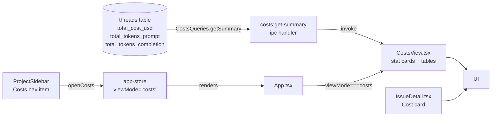

# Session Log — 2026-04-11

## Summary

- Session 1: Biome config — switched to spaces, migrated to v2, merged best-practice options
- Session 2: Costs view — full implementation (DB queries, IPC, CostsView, sidebar nav, IssueDetail cost card)
- Session 3: ShipCode rename fallout + UI polish — restored orphaned DB after app rename, unified `MODEL_DISPLAY` across Kanban + IssueDetail, replaced "GitHub Issues" header with project name + repo/board quick-links, hoisted `deriveGithubIssueUrl` to `@shipcode/shared`

---

## Session 1: Biome Config Cleanup

**Status:** Complete

### Affected Components

| Layer | Components |
|-------|------------|
| Config | `biome.json` |

### What was done

- [x] Switched `indentStyle` from `tab` to `space` (indentWidth: 2)
- [x] Ran `bunx biome migrate --write` to upgrade schema from 1.9.4 → 2.4.11
- [x] Merged in best-practice options from a reference config: `files.includes` exclusions, `semicolons: "always"`, `trailingCommas: "all"`, `unsafeParameterDecoratorsEnabled: true`, `a11y.noLabelWithoutControl: "off"`
- [x] Dropped irrelevant overrides from reference config (`apps/app`, `apps/server`, `packages/agent`, etc. — don't exist in shipcode)
- [x] Ran `bunx biome format --write .` — 233 files checked, 198 fixed

### Files changed

- `biome.json` — indentStyle → space, schema → 2.4.11, added files.includes exclusions, updated JS formatter options, removed stale overrides

### Key decisions

- **Decision:** Keep `lineWidth: 100` (was already set, not in reference config)
  - **Rationale:** Already established across codebase; no reason to change

- **Decision:** Drop all `overrides` from reference config
  - **Context:** Reference config had overrides for `apps/app`, `apps/server`, etc. — paths that don't exist in shipcode
  - **Rationale:** Dead overrides add noise and confusion

### Mistakes and fixes

- **Mistake:** Initial `biome format --write` failed — schema version mismatch (1.9.4 vs CLI 2.4.11) and unknown `organizeImports` key
  - **Fix:** Ran `bunx biome migrate --write` first, then reformatted

### Next steps

- [ ] 26 biome parse errors remain (pre-existing, non-TS files like markdown/config) — not regressions, can ignore
- [ ] New LSP diagnostics: `lastError` missing/incompatible in `threads.ts` and `IssueDetail.test.tsx` — needs a fix (unrelated to this session)
- [ ] Manual QA items from 2026-04-10 still pending (IssueDetail expand/collapse, QA #1, QA #5)

---

## Session 2: Costs View Full Implementation

**Status:** Complete

### System Flow

### Affected Components

| Layer | Components |
|-------|------------|
| Frontend | `CostsView.tsx` (new), `ProjectSidebar.tsx`, `App.tsx`, `IssueDetail.tsx` |
| State | `app-store.ts` — `ViewMode` union + `openCosts` action |
| Backend (main) | `ipc.ts` — `costs:get-summary` handler + `CostsQueries` in `Queries` interface |
| Data | `packages/db/src/queries/costs.ts` (new), `packages/db/src/index.ts` |
| Types/IPC | `packages/shared/src/types.ts`, `packages/shared/src/ipc-channels.ts` |

### What was done

- [x] Planned costs feature via plan mode + adversarial Codex review (previous session)
- [x] Confirmed all implementation was complete after context compaction
- [x] Verified `ProjectCostSummary` and `CostSummary` types in `types.ts`
- [x] Verified `costs:get-summary` IPC channel in `ipc-channels.ts` + handler in `ipc.ts`
- [x] Verified `CostsQueries.getSummary()` in `packages/db/src/queries/costs.ts`, exported from index
- [x] Verified `ViewMode` includes `'costs'` and `openCosts` action in `app-store.ts`
- [x] Verified `App.tsx` routes `viewMode === 'costs'` → `<CostsView />`
- [x] Verified `CostsView.tsx` — stat cards (all-time, 7d, avg/task), by-project table, top tasks table, `$`/tokens toggle
- [x] Verified `ProjectSidebar.tsx` — Costs nav item with `DollarSign` icon
- [x] Verified `IssueDetail.tsx` — Cost card with `totalCostUsd` + token count in Pipeline section
- [x] Ran `bun run typecheck` — 14/14 packages green

### Files changed

- `packages/shared/src/types.ts` — `ProjectCostSummary` + `CostSummary` types
- `packages/shared/src/ipc-channels.ts` — `costs:get-summary` channel + `CostSummary` import
- `packages/db/src/queries/costs.ts` — new `CostsQueries` class
- `packages/db/src/index.ts` — exports `CostsQueries`
- `apps/desktop/src/main/ipc.ts` — `costs:get-summary` handler
- `apps/desktop/src/renderer/stores/app-store.ts` — `'costs'` in `ViewMode`, `openCosts` action
- `apps/desktop/src/renderer/App.tsx` — `viewMode === 'costs'` branch + `CostsView` import
- `apps/desktop/src/renderer/components/CostsView.tsx` — new costs page
- `apps/desktop/src/renderer/components/ProjectSidebar.tsx` — Costs nav button
- `apps/desktop/src/renderer/components/IssueDetail.tsx` — Cost card in Pipeline section

### Key decisions

- **No DB migration needed** — V6 already added cost columns to `threads`; query-only change
- **`$`/tokens toggle** — tokens tracked for all providers; toggle lets users see usage even when dollar cost is $0 (Claude/Codex CLI)
- **Footer note instead of hiding $0 rows** — transparent display with provider explanation
- **`formatCost`/`formatTokens` inline in `CostsView.tsx`** — single consumer; extract to shared utils later if needed

### Mistakes and fixes

None — implementation was already complete from prior context. Session verified and typechecked.

### Next steps

- [ ] Manual smoke test: `bun run dev` → click "Costs" in sidebar → verify page loads with $0.00
- [ ] Manual smoke test: verify Cost card appears in IssueDetail Pipeline section
- [ ] If OpenRouter tasks exist: verify costs appear in per-project table and top tasks list
- [ ] Consider extracting `formatCost`/`formatTokens` to `packages/shared/src/utils.ts` if more consumers added
