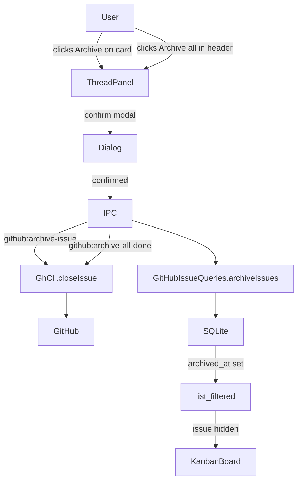
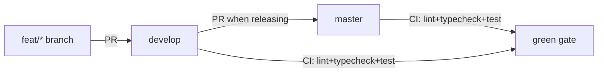
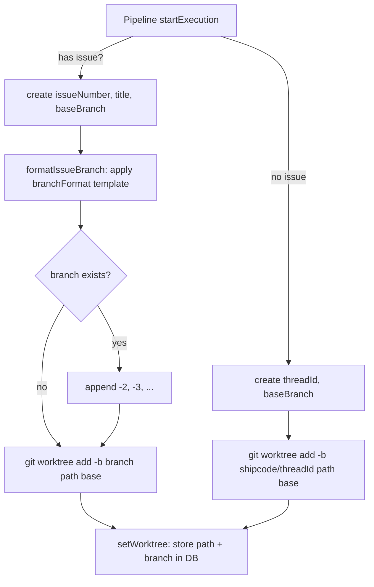
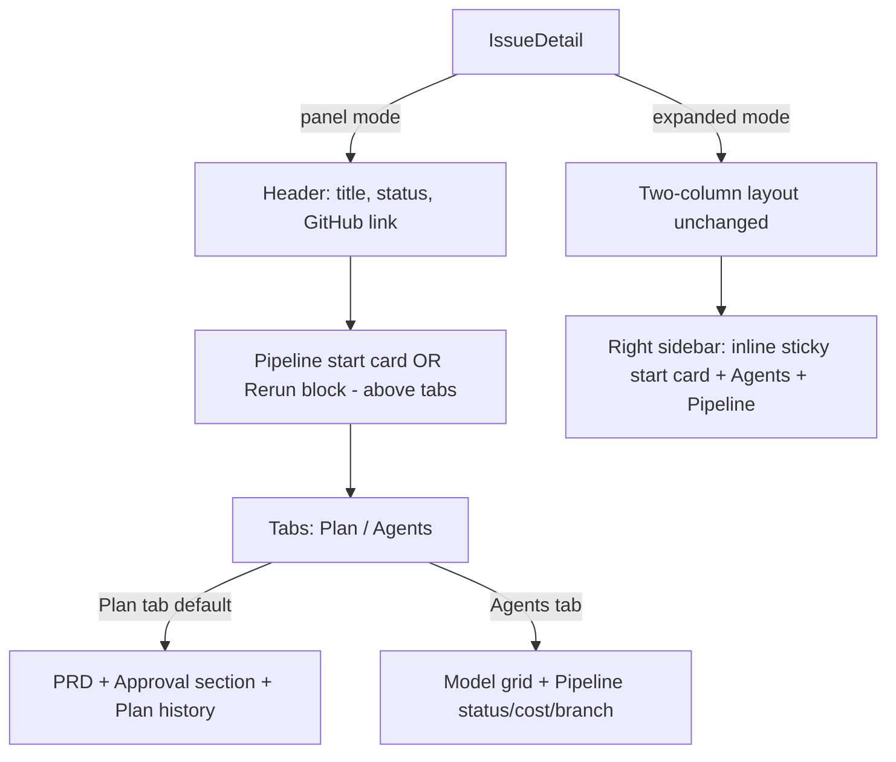
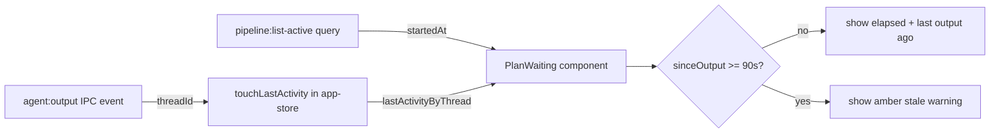

# Sessions: 2026-04-12

## Summary
Session 14: Pipeline liveness indicator — replaced static "Pipeline is running..." message with live elapsed timer + last-output tracker + 90s stale warning in IssueDetail.

Session 12: IssueDetail UX fixes (Plan History collapse, Confirm button unlock, STATUS card removal), Inbox View fix, sidebar cleanup, approve error visibility, agent loop color → sky-blue, Kanban card timer relocation, active card progress bar + glow. Session 13: Refresh button spin animation + toast, rerun button spin animation.

Session 11: Aligned Kanban column colors with GitHub Projects board -- green (Todo), yellow (Agent Loop), amber (Human), purple (Done). Changed `--agent` token from purple to yellow, added `--done` token. Colored dots on all column headers. Dimmed Done cards. Filed #33 for dynamic color sync.

Session 10: Sidebar reorg (Mission Control -> Overview, reorder), `ship/` branch prefix, branch format validation, worktree collision retry.

Session 9: "View all" label consistency + capitalize class on OverviewView header buttons.

Session 8: IssueDetail tabs reorganization — Plan tab (PRD + approval + history) + Agents tab (models + pipeline status). Pipeline start card and rerun block live above tabs. pipelineStartCard sticky wrapper moved into expanded branch only. 4 new tests, all 17 passing.

Session 7: Fixed GitHub Projects v2 board not archiving items when issues are closed. Added `archiveProjectItems()` to GhCli using issue-centric GraphQL (no project URL required). Two commits to develop.

Session 6: Kanban card "View" text button (replaced tiny chevron icon) + Inbox UX cleanup (removed Group button, renamed Dismiss all to Read all, reordered columns, icon actions, fixed "Go to issue" to stay on Inbox view with sidebar).

Session 5: UI polish — confirm-cancel button style fix, plan display fix for extended-thinking stream format, CSP worker-src fix for blob: workers.

Session 4: Implemented human-readable worktree branch naming (`feat/{id}-{slug}` instead of `shipcode/{nanoid}`), with configurable format via settings UI. Added collision guard for re-runs, dual-prefix branch filtering, and `githubIssueTitle` to pipeline context. All 14 packages typecheck clean, 10 test suites pass.

Previous sessions (2026-04-11 carryover): Shipped archive-done-issues, approval dropdown + plan editor modal, develop-first branching model, CI/lint fixes (PRs #27-#32).

---

## Session 1: Archive Done Issues + Branch Cleanup

**Status:** Complete

### System Flow

### Affected Components

| Layer | Components |
|-------|------------|
| Frontend | `KanbanBoard.tsx` (board + list view), `ThreadPanel.tsx` |
| Backend | `ipc.ts` (2 new handlers + refresh amendment), `gh-cli.ts` |
| Data | `schema.ts` (migrateV11), `github-issues.ts` (archiveIssues, clearArchivedAt, listCompleted, list filter) |
| Shared | `ipc-channels.ts` (2 new channels) |

### What was done

- [x] Continued session from previous context — list view archive gap still needed
- [x] Ran typecheck (14/14 green) on KanbanBoard list view changes
- [x] Committed list view gap fix: archive button on DraggableListRow + Archive all in IssueListView Done header
- [x] Merged feat/archive-done-issues into develop (merge commit, conflict in ipc-channels.ts resolved)
- [x] Fast-forwarded master to develop, pushed both
- [x] Confirmed origin/master = origin/develop = local master = local develop (all at same SHA)
- [x] Opened PR #32 for feat/openrouter-tier1 (1 unmerged commit: codex v0.120.0 CLI args fix)
- [x] Resolved conflict in cli-provider.ts (kept develop's v0.120.0 arg layout)
- [x] Merged PRs #30, #31, #32 into develop with --admin --squash
- [x] Fast-forwarded master again to pick up all three fixes
- [x] Cleaned up local branches: deleted develop, feat/archive-done-issues, worktree-agent-* + removed worktree
- [x] Restored develop branch (was needed, shouldn't have deleted it)

### Files changed

- `packages/ui/src/KanbanBoard.tsx` - Archive button on DraggableListRow (completed cards, hover-reveal); Archive all button in IssueListView Done column header; onArchiveIssue/onArchiveAllDone props wired through IssueListView
- `packages/agents/src/providers/cli-provider.ts` - Conflict resolved keeping develop's codex v0.120.0 arg layout (top-level flags before `exec`, `-c model_reasoning_effort=`)

### Key decisions

- **Decision:** Keep develop's version of `buildCodexArgs` when resolving merge conflict
  - **Context:** feat/openrouter-tier1 had an older v1 format (`-q <prompt>`); develop had already fixed this to v0.120.0 layout
  - **Rationale:** develop's version is correct and newer; the tier1 branch fix was superseded

- **Decision:** Deleted local `develop` branch during cleanup — then had to restore it
  - **Context:** Only intended to delete stale worktree/feature branches
  - **Rationale:** develop is an integration branch and must always exist locally

### Mistakes and fixes

- **Mistake:** Deleted local `develop` branch during `git branch -d` cleanup sweep -> **Fix:** `git checkout -t origin/develop` restored it immediately
- **Mistake:** Merged feat/archive-done-issues into `develop` while checked out on develop in the worktree, producing a merge commit on `develop` instead of `master` -> **Fix:** Checked out master, fast-forwarded from develop

### Next steps

- [ ] No open fix branches remain — all clean
- [ ] Consider enabling branch protection CI requirement so `--admin` bypasses are not needed for merges
- [ ] Pick next feature from backlog

---

## Session 2: Approval Dropdown + Plan Editor in Modal

**Status:** Complete

### Affected Components

| Layer | Components |
|-------|------------|
| Frontend | `apps/desktop/src/renderer/components/IssueDetail.tsx` |

### What was done

- [x] Replaced the 3-button approval layout (Approve & Execute / Request Changes / Cancel pipeline) with a `Select` dropdown + contextual confirm button
- [x] "Request Changes" selection reveals feedback textarea inline (same UX, less visual noise at rest)
- [x] "Cancel pipeline" selection shows a danger-styled confirm button
- [x] Added "Edit" button in the full-screen plan modal header — only visible when plan is structured/parseable
- [x] Edit mode renders a JSON `Textarea` pre-populated with the current plan; Save validates JSON then schema via `shipCodePlanSchema` before calling `plan:update` IPC
- [x] Inline error message on invalid JSON or schema mismatch; modal stays open
- [x] Edit state resets on dialog close (Esc, X button, or onOpenChange)
- [x] `bun run typecheck --filter @shipcode/desktop` — green
- [x] Committed as `2d5db55`

### Files changed

- `apps/desktop/src/renderer/components/IssueDetail.tsx` — approval section rewritten to dropdown pattern; plan dialog header gets Edit button + edit/save flow via `plan:update`

### Key decisions

- **Decision:** `Select` dropdown (Approve / Request Changes / Cancel) + one contextual confirm button, not separate buttons
  - **Context:** Vincent asked why the sidebar still has extra buttons instead of a dropdown
  - **Rationale:** Fewer visible actions at rest, less cognitive load; destructive cancel now requires two steps (select + confirm)

- **Decision:** Edit plan as raw JSON textarea, validated via `shipCodePlanSchema` before save
  - **Context:** Vincent asked for an edit button inside the plan modal
  - **Rationale:** `plan:update` IPC already exists and takes `{ planId, structured }`. JSON edit gives full control without a custom form. Schema validation prevents corrupt structured data reaching the executor.

### Mistakes and fixes

- **Mistake:** First `Edit` on state declarations (`pendingAction`, `isEditingPlan`, etc.) appeared to succeed but the changes weren't visible — `showRejectForm` was still referenced later in the file
  - **Fix:** The tool had edited the file but a second `approvalSection` block with the old code still existed. Replaced the old block explicitly and removed the stale `setShowRejectForm` call in `handleReject`.

### Next steps

- [x] Push master/develop to origin — done in Session 3
- [ ] Manual QA #1–7 from session 33: close/reopen sync, in-flight guard, board attach scenarios
- [ ] Manual QA: approval dropdown — verify all 3 actions work from the sidebar
- [ ] Manual QA: plan edit — edit a plan JSON in the modal, save, verify PlanViewer re-renders

---

## Session 3: Branching Model + IssueDetail/Pipeline Fixes

**Status:** Complete

### System Flow

### Affected Components

| Layer | Components |
|-------|------------|
| Frontend | `IssueDetail.tsx` (hook order fix), `IssueDetail.test.tsx` (tests updated for dropdown UI) |
| Backend | `ipc.ts` (pipeline:approve rawOutput fallback via StreamParser) |
| CI | `ci.yml` (develop branches + lint step), `publish.yml` (renamed from release.yml) |
| Config | `biome.json` (tailwindDirectives + web/public/docs exclusion), branch protection rules |

### What was done

- [x] Identified local master had 2 unpushed commits (`4279e9c`, `2d5db55`) not on origin
- [x] Cherry-picked those commits to develop, fixed test breakage from approval dropdown refactor
- [x] Reset local master to match origin/master (clean state)
- [x] Pushed develop with all cherry-picked + fixed commits
- [x] PR #30: moved 2 useEffect hooks above early return in IssueDetail.tsx (useHookAtTopLevel fix) — merged to develop, CI green
- [x] PR #31: added `tryParsePlan` fallback in pipeline:approve IPC handler using StreamParser — merged to develop, CI green
- [x] Both PRs created in isolated worktrees against develop, verified independently

**Also done earlier in this session (carried from 2026-04-11):**
- [x] PR #27: batch sprint — UTC timestamps, Projects v2 attach, pipeline polish (merged to master)
- [x] PR #28: lint cleanup across entire repo — biome auto-fix + manual fixes in packages/ui (merged to master)
- [x] PR #29: CI workflow fixes — renamed release.yml to publish.yml, added develop to CI triggers, added lint step (merged to master)
- [x] Set up branch protection: master requires CI check + conversation resolution + linear history; develop requires CI check, allows force push
- [x] Disabled publish.yml workflow (manual-dispatch only, was generating ghost failure runs)

### Files changed

- `apps/desktop/src/renderer/components/IssueDetail.tsx` — moved useEffect hooks above early return (PR #30)
- `apps/desktop/src/renderer/components/IssueDetail.test.tsx` — rewrote approval tests for Select dropdown UI (3 buttons -> dropdown + Confirm)
- `apps/desktop/src/main/ipc.ts` — added `tryParsePlan()` helper using StreamParser; pipeline:approve now tries rawOutput parsing before failing (PR #31)
- `.github/workflows/ci.yml` — added `develop` to push/PR branches, added `bun run lint` step (PR #29)
- `.github/workflows/publish.yml` — renamed from release.yml, updated npm TP reference (PR #29)
- `biome.json` — enabled `css.parser.tailwindDirectives`, excluded `apps/web/public/docs` (PR #28)
- `packages/ui/src/` — 23 files auto-fixed by biome (import organization, type imports) + manual fixes: IssueCard div->button, KanbanBoard non-null assertion, PlanViewer dead props, select.tsx SVGs->lucide (PR #28)

### Key decisions

- **Decision:** Develop-first branching model — all feature work targets develop, master only receives PRs from develop
  - **Context:** Vincent asked for master to stay clean and only receive PRs
  - **Rationale:** Standard integration branch model; develop is the working line, master is the release line

- **Decision:** Reuse `StreamParser` from `@shipcode/agents` for server-side plan parsing fallback instead of duplicating `resolveClientSidePlan`
  - **Context:** PR #31 needed to parse rawOutput on the server when structured is null
  - **Rationale:** StreamParser already handles stream-json unwrapping + fenced-block extraction; no code duplication

- **Decision:** Drop review requirement from master branch protection (solo dev)
  - **Context:** PRs were blocked by "1 approving review required" but Vincent is the sole developer
  - **Rationale:** CI check + conversation resolution (must resolve CodeRabbit/Codex threads) provides sufficient gating

- **Decision:** Disable publish.yml workflow rather than live with ghost failure runs
  - **Context:** GitHub kept recording 0-job "failure" runs on every push despite no push trigger
  - **Rationale:** Workflow is manual-dispatch-only and not in active use; enable/dispatch/disable dance is documented

### Mistakes and fixes

- **Mistake:** Yesterday's session PR'd everything against master instead of develop -> **Fix:** Cherry-picked the 2 stale local-master commits to develop, reset local master to origin
- **Mistake:** Cherry-picked commits broke IssueDetail tests (approval section refactored from buttons to dropdown in a prior session) -> **Fix:** Rewrote tests to match dropdown UI: assert on "Confirm" button instead of "Approve & Execute" / "Request Changes" / "Cancel pipeline"
- **Mistake:** Worktree cleanup confused LSP — massive phantom "JSX.IntrinsicElements not found" diagnostics -> **Fix:** `git worktree prune`; diagnostics are LSP-only, actual `tsc --noEmit` runs clean; TS server restart clears them

### Next steps

- [ ] PR develop -> master when ready to release (develop is 7 commits ahead)
- [ ] Manual QA checklist (full list in conversation above):
  - [ ] Approval dropdown: all 3 actions work from sidebar
  - [ ] Plan edit: edit JSON in modal, save, PlanViewer re-renders
  - [ ] Projects v2 board attach on issue creation
  - [ ] Close/reopen sync from GitHub web UI
  - [ ] UTC timestamps display correctly
  - [ ] Stream parser handles nested code blocks
  - [ ] Notification cleanup on pipeline re-run
- [ ] Update npm Trusted Publisher workflow filename from release.yml to publish.yml at npmjs.com
- [ ] Consider: server-side `pipeline:approve` now has the fallback — remove the client-side `canApprove` disabled state? Or keep belt-and-suspenders

---

## Session 4: Human-Readable Worktree Branch Naming

**Status:** Complete (pending manual QA)

### System Flow

### Affected Components

| Layer | Components |
|-------|------------|
| Frontend | `SettingsPanel.tsx` (new "Branch format" input field) |
| Backend | `worktree.ts` (overloaded create/getBranchName/getWorktreePath, collision guard, slugify, list filter), `pipeline.ts` (context seeding, branched create call) |
| Data | `types.ts` (PipelineContext + AppSettings), `constants.ts` (default format), `settings.ts` (DB read) |
| Shared | `branches.ts` (dual-prefix regex filter), `branches.test.ts` (3 new tests) |

### What was done

- [x] Planned the feature with adversarial review via Codex (5 issues found and addressed)
- [x] Added `worktreeBranchFormat` to `AppSettings` (default: `feat/{id}-{slug}`)
- [x] Added `githubIssueTitle: string | null` to `PipelineContext` interface
- [x] Seeded `githubIssueTitle` in `ensureContext()` and `startFromGitHubIssue()`
- [x] Rewrote `WorktreeManager` with overloaded `create()`: `(number, title, base?)` for issues, `(string, base?)` for legacy threads
- [x] Added `slugify()` helper (lowercase, collapse non-alnum to dashes, cap at 48 chars)
- [x] Added collision guard: `branchExists()` + `resolveUniqueBranch()` appends `-2`, `-3`, etc.
- [x] Overloaded `getBranchName()` and `getWorktreePath()` for both issue-based and threadId-based paths
- [x] Changed `merge()` to accept branch name directly instead of reconstructing from threadId
- [x] Updated `list()` to match both `shipcode/` and `feat/\d+-` prefixes
- [x] Replaced `INTERNAL_PREFIX` string filter with `SHIPCODE_BRANCH_RE` regex in `branches.ts`
- [x] Added `worktreeBranchFormat` read in `settings.ts` DB query
- [x] Added "Branch format" input in SettingsPanel under Worktree Location section
- [x] Updated pipeline test mock branch name + added `githubIssueTitle` assertion
- [x] Added 3 new branch filter tests (feat/42-* filtered, feat/my-feature not filtered, remote feat/42-* filtered)
- [x] Verified: 14/14 typecheck, 10/10 test suites (360 tests)

### Files changed

- `packages/git/src/worktree.ts` — full rewrite: overloaded create/getBranchName/getWorktreePath, collision guard, slugify, branchFormat option, list() dual-prefix filter, merge() takes branch directly
- `packages/pipeline/src/types.ts` — added `githubIssueTitle: string | null` to PipelineContext
- `packages/pipeline/src/pipeline.ts` — seed githubIssueTitle in context, pass branchFormat to WorktreeManager, branch on issue presence in startExecution()
- `packages/shared/src/types.ts` — added `worktreeBranchFormat: string` to AppSettings
- `packages/shared/src/constants.ts` — added default `worktreeBranchFormat: 'feat/{id}-{slug}'`
- `packages/shared/src/branches.ts` — replaced INTERNAL_PREFIX with SHIPCODE_BRANCH_RE regex
- `packages/shared/src/branches.test.ts` — 3 new tests for dual-prefix filtering
- `packages/db/src/queries/settings.ts` — added worktreeBranchFormat read from DB
- `apps/desktop/src/renderer/components/SettingsPanel.tsx` — added Branch format input field
- `packages/pipeline/src/pipeline.test.ts` — updated mock branch name, added githubIssueTitle assertion

### Key decisions

- **Decision:** Overloaded `create()` instead of separate methods
  - **Context:** Codex adversarial review flagged that changing the API would break the manual (non-issue) thread flow
  - **Rationale:** TypeScript overloads give type safety for both paths while keeping a single entry point

- **Decision:** Collision guard via `git rev-parse --verify` + suffix increment
  - **Context:** Codex flagged that deterministic `feat/{id}-{slug}` names collide on re-runs when prior worktrees aren't cleaned up
  - **Rationale:** Checking branch existence before creation is cheap and prevents `git worktree add` failures

- **Decision:** Keep branch-prefix filtering in `list()`, not path-prefix
  - **Context:** Codex flagged that worktreeRoot is mutable, so path-prefix heuristic misses worktrees created under older settings
  - **Rationale:** Branch names are immutable after creation; path depends on current settings

- **Decision:** Filter `feat/\d+-` but NOT `feat/anything` from base-branch selector
  - **Context:** Codex flagged that removing all filtering would let users accidentally set a worktree branch as their project default
  - **Rationale:** Regex `feat/\d+-` matches ShipCode-created branches specifically; user's own `feat/my-feature` branches pass through

- **Decision:** User-configurable `worktreeBranchFormat` setting with `{id}` and `{slug}` tokens
  - **Context:** Vincent asked for it during planning
  - **Rationale:** Simple string template interpolation. Default `feat/{id}-{slug}` works for most users.

### Mistakes and fixes

- **Mistake:** Initial plan missed `packages/pipeline/src/types.ts` and `packages/db/src/queries/settings.ts` -> **Fix:** Codex adversarial review caught both; added to plan before implementation
- **Mistake:** Initial plan proposed removing all branch filtering from the base-branch selector -> **Fix:** Codex flagged the risk; changed to regex that filters ShipCode patterns while preserving user branches

### Next steps

- [ ] Manual QA: run a pipeline on a GitHub issue, verify branch is `feat/{N}-{slug}` in `git branch`
- [ ] Manual QA: re-run same issue without cleanup, verify collision guard appends `-2`
- [ ] Manual QA: Settings > General > Branch format field renders and saves correctly
- [ ] Commit and push changes (uncommitted, on master)

---

## Session 6: Kanban Card View Button + Inbox UX Cleanup

**Status:** Complete (pending manual QA)

### Affected Components

| Layer | Components |
|-------|------------|
| Frontend | `packages/ui/src/KanbanBoard.tsx` (card View button), `apps/desktop/src/renderer/components/InboxView.tsx` (full UX overhaul) |
| State | `apps/desktop/src/renderer/stores/app-store.ts` (viewMode preservation via `setViewMode`) |

### What was done

- [x] Replaced tiny `ChevronRight` icon (size 10) on Kanban cards with a "View" text button for better click target
- [x] Removed "Group" button and all grouped-rendering logic from Inbox (groupBy state, GROUP_ORDER, GROUP_SECTION_LABEL)
- [x] Renamed "Dismiss all" to "Read all" in Inbox header
- [x] Reordered Inbox table columns: STATUS | TIME | NOTIFICATION | ACTIONS (time adjacent to status)
- [x] Replaced "Go to issue" and "Dismiss" text buttons with icon buttons (ExternalLink -> "View" text button, X icon for dismiss)
- [x] Fixed "Go to issue" to stay on Inbox view — `selectProject()` was resetting `viewMode` to `'project'`, now restored to `'inbox'` via `setViewMode('inbox')`
- [x] Fixed catch block in goToIssue to also restore viewMode on error
- [x] Cleaned up unused imports (Layers, ExternalLink)
- [x] Typecheck passes (pre-existing errors in IssueDetail and tabs.tsx are unrelated)

### Files changed

- `packages/ui/src/KanbanBoard.tsx` — DraggableCard: replaced `<ChevronRight size={10} />` icon button with "View" text button (`h-5 px-1.5 text-[10px]`), kept same color logic and click handler
- `apps/desktop/src/renderer/components/InboxView.tsx` — full UX overhaul: removed Group button/state/logic, renamed Dismiss all to Read all, reordered columns (STATUS|TIME|NOTIFICATION|ACTIONS), replaced text action buttons with View text button + X icon, fixed goToIssue to preserve inbox viewMode

### Key decisions

- **Decision:** "View" text button instead of icon for the open-issue action (both Kanban and Inbox)
  - **Context:** Vincent flagged that the ChevronRight icon was too small on Kanban cards, and the ExternalLink icon didn't match the Kanban design in Inbox
  - **Rationale:** Text buttons are easier to click and visually consistent across both surfaces

- **Decision:** Preserve `viewMode: 'inbox'` when opening sidebar from Inbox
  - **Context:** `selectProject()` in the store resets `viewMode` to `'project'`, causing navigation away from Inbox to Kanban
  - **Rationale:** The IssueDetail sidebar already renders alongside any view in App.tsx (line 138), so staying on Inbox is correct — the sidebar opens in the right panel

### Mistakes and fixes

- **Mistake:** Initial implementation used ExternalLink icon for "Go to issue" — didn't match Kanban card design -> **Fix:** Replaced with "View" text button matching KanbanBoard DraggableCard style
- **Mistake:** goToIssue catch block called selectProject(priorProjectId) which also resets viewMode to 'project' -> **Fix:** Added `setViewMode('inbox')` in catch block too

### Next steps

- [ ] Manual QA: Inbox — click View on a notification, verify IssueDetail sidebar opens without leaving Inbox
- [ ] Manual QA: Inbox — verify Read all button dismisses all notifications
- [ ] Manual QA: Inbox — verify column order is STATUS | TIME | NOTIFICATION | ACTIONS
- [ ] Manual QA: Kanban — verify "View" button on cards works and is easy to click
- [ ] Commit and push all Session 4 + Session 5 changes
- [ ] Fix pre-existing typecheck errors: `setEditPlanError` in IssueDetail.tsx, missing `@radix-ui/react-tabs` module

---

## Session 5: UI Polish + Plan Display Fix + CSP Fix

**Status:** Complete

### Affected Components

| Layer | Components |
|-------|------------|
| Frontend | `IssueDetail.tsx` (button style, margin, plan display) |
| Backend | `stream-parser.ts` (extended thinking result extraction) |
| Electron | `apps/desktop/src/main/index.ts` (CSP worker-src) |

### What was done

- [x] Fixed "Confirm cancel" button — was `variant="ghost"` with manual red text classes, now `variant="destructive"` matching the "Confirm" button shape for approve
- [x] Cleaned up card margin — `mb-3` on approval flex row now conditional on `request_changes` only (was adding dead space for approve/cancel)
- [x] Fixed plan display for extended-thinking runs — both `StreamParser.resolveBuffer()` and `resolveRawPlanText` now handle `result` as array of content blocks (extract `type:"text"` blocks)
- [x] Added `worker-src 'self' blob:` to Electron CSP — blob: workers blocked because `worker-src` was absent, causing fallback to `script-src` which lacked `blob:`

### Files changed

- `apps/desktop/src/renderer/components/IssueDetail.tsx` — destructive variant on cancel confirm button; conditional mb-3; resolveRawPlanText extended-thinking fix
- `packages/agents/src/stream-parser.ts` — resolveBuffer handles array result (extended thinking)
- `apps/desktop/src/main/index.ts` — added `worker-src 'self' blob:` to CSP header

### Key decisions

- **Decision:** Extract only `type:"text"` blocks from result array, ignore `type:"thinking"` blocks
  - **Context:** Extended thinking produces `[{"type":"thinking","thinking":"..."},{"type":"text","text":"..."}]`
  - **Rationale:** Only the text block contains the LLM's output (plan/review fenced block); thinking is internal reasoning not needed for parsing

- **Decision:** `worker-src blob:` in both dev and prod
  - **Context:** Some renderer library (likely syntax highlighter) spawns a Web Worker via blob: URL
  - **Rationale:** Blob workers are safe — the code comes from our own renderer bundle, not a remote origin

### Mistakes and fixes

None — all three issues were clean targeted fixes.

### Next steps

- [ ] Restart app to pick up CSP main-process change (`bun run dev`)
- [ ] Re-run issue #25 pipeline to verify plan displays with proper formatting post fix
- [ ] Commit and push all session 4 + session 5 changes (currently uncommitted on develop)
- [ ] Manual QA backlog from session 3: approval dropdown, plan edit, Projects v2 attach, UTC timestamps

---

## Session 7: Fix GitHub Projects v2 Board Archiving

**Status:** Complete

### Affected Components

| Layer | Components |
|-------|------------|
| Backend | `packages/agents/src/github/gh-cli.ts`, `apps/desktop/src/main/ipc.ts` |

### What was done

- [x] Diagnosed root cause: `gh issue close` only changes issue state; Projects v2 board items require a separate `archiveProjectV2Item` GraphQL mutation
- [x] Initial fix: `archiveProjectItem()` queried via project-owner approach — required `githubProjectUrl` to be set in settings
- [x] Improved fix: replaced with `archiveProjectItems(issueNumber)` — issue-centric GraphQL, fetches `projectItems` directly from the issue, no project URL needed
- [x] Archives from all boards the issue appears on (handles multi-project scenarios)
- [x] Wired into both `github:archive-issue` and `github:archive-all-done` IPC handlers (best-effort, fire-and-forget)
- [x] Typechecks clean (agents + desktop)
- [x] Two commits pushed to develop: `9995937`, `0b228b6`

### Files changed

- `packages/agents/src/github/gh-cli.ts` — added `archiveProjectItems(issueNumber)`: gets owner/repo from `gh repo view`, fetches issue's linked project items via GraphQL, archives all in parallel
- `apps/desktop/src/main/ipc.ts` — replaced `parsedProject`-gated `archiveProjectItem` calls with unconditional `archiveProjectItems` in both archive handlers

### Key decisions

- **Decision:** Issue-centric GraphQL query (`projectItems` on the issue) instead of project-list scan
  - **Context:** Initial approach required `githubProjectUrl` configured in settings; Vincent asked if we could fix the caveat
  - **Rationale:** Querying from the issue's perspective needs no project metadata, handles multiple boards, and avoids the 100-item pagination cliff of scanning all project items

- **Decision:** Archive unconditionally (all boards), no column/status filtering
  - **Context:** Vincent asked about filtering by column status; we have the mapping
  - **Rationale:** User explicitly clicked archive — intent is to remove it everywhere. Column filtering adds complexity for a solo-project workflow where all boards should agree. Defer if multi-board divergence becomes a real problem.

### Mistakes and fixes

- **Mistake:** First implementation required `parsedProject` (project URL in settings) — incomplete fix
  - **Fix:** Replaced with issue-centric approach in the follow-up commit

### Next steps

- [ ] Manual QA: archive an issue, verify it disappears from the GitHub Projects v2 board
- [ ] PR develop → master when ready to release

---

## Session 8: IssueDetail Tabs Reorganization

**Status:** Complete (pending commit + manual QA)

### System Flow

### Affected Components

| Layer | Components |
|-------|------------|
| Frontend | `apps/desktop/src/renderer/components/IssueDetail.tsx`, `apps/desktop/src/renderer/components/IssueDetail.test.tsx` |
| UI package | `packages/ui/src/primitives/tabs.tsx` (new), `packages/ui/src/index.ts`, `packages/ui/package.json` |

### What was done

- [x] Added `@radix-ui/react-tabs: 1.1.13` to `packages/ui/package.json` (1.1.15 doesn't exist — latest is 1.1.13)
- [x] Created `packages/ui/src/primitives/tabs.tsx` — thin Radix wrapper with underline active indicator
- [x] Exported Tabs primitives from `packages/ui/src/index.ts`
- [x] Ran adversarial review via Codex — dropped Files tab (false affordance), confirmed no `forceMount` needed
- [x] Refactored IssueDetail.tsx panel mode return to tabs layout
- [x] Extracted `pipelineStartCardInner` (inner card, no sticky) for above-tabs placement in panel mode
- [x] Extracted `rerunSection` shared variable — replaces duplicated inline rerun blocks in both modes
- [x] Fixed `approvalSection` Tailwind fragment with `cn()` (was concatenating class strings directly)
- [x] Removed dead state: `isEditingPlan`, `editPlanText`, `editPlanError`
- [x] Added 4 new tests: tab triggers present, Plan tab active by default, Agents tab inactive, start card above tab bar
- [x] Fixed `fireEvent.click` Radix tab switching issue — Radix uses pointer events in jsdom, not onClick; tests use data-state assertions only
- [x] All 17 tests passing
- [x] Moved `pipelineStartCard` sticky wrapper declaration into `if (expanded)` branch — avoids constructing unused JSX in panel mode

### Files changed

- `packages/ui/package.json` — added `@radix-ui/react-tabs: 1.1.13`
- `packages/ui/src/primitives/tabs.tsx` — created: Tabs, TabsList, TabsTrigger, TabsContent with accent underline on active
- `packages/ui/src/index.ts` — added Tabs exports (between Switch and Table)
- `apps/desktop/src/renderer/components/IssueDetail.tsx` — panel mode rewritten with 2-tab layout; pipelineStartCardInner + pipelineStartCard split; rerunSection extracted; dead edit state removed; cn() import added
- `apps/desktop/src/renderer/components/IssueDetail.test.tsx` — 4 new tests for tab layout

### Key decisions

- **Decision:** 2 tabs only (Plan + Agents), no Files tab
  - **Context:** Plan originally included a Files tab
  - **Rationale:** Codex adversarial review flagged it as false affordance — no data source exists for file changes yet

- **Decision:** `forceMount` not added to TabsContent
  - **Context:** Radix Tabs unmounts inactive tab content by default
  - **Rationale:** PRD collapse state (prdCollapsed) resets on tab switch — acceptable tradeoff vs. keeping all tab content mounted. If state preservation becomes important, add `forceMount` later.

- **Decision:** `fireEvent.click` doesn't trigger Radix Tabs switching in jsdom
  - **Context:** Tab switching test was expected to show Agents content after clicking the Agents tab trigger
  - **Rationale:** Radix uses internal pointer/mouse event listeners, not React onClick. Tests changed to verify initial `data-state` attributes only — sufficient for the tab structure assertion.

- **Decision:** `pipelineStartCard` sticky wrapper inlined into `if (expanded)` branch
  - **Context:** Code reviewer flagged it as Important — sticky wrapper was constructed on every render even in panel mode where it's never used
  - **Rationale:** Simple move, no behavioral change; avoids unnecessary JSX construction in panel mode path

### Mistakes and fixes

- **Mistake:** Specified `@radix-ui/react-tabs: 1.1.15` in plan — version doesn't exist -> **Fix:** Checked npm, latest stable is 1.1.13; used that
- **Mistake:** New tests inserted outside the `describe('IssueDetail')` block -> **Fix:** Adjusted `old_string` anchor to include the closing `});` of the prior last test
- **Mistake:** `cn` was used in `approvalSection` but never imported -> **Fix:** Added `cn` to the `@shipcode/ui` import list
- **Mistake:** Agents tab test tried `getByText('Planner')` — inactive tab content unmounted by Radix -> **Fix:** Changed to `data-state` attribute assertion

### Next steps

- [ ] Commit all changes on develop branch
- [ ] Manual QA (`bun run dev`):
  - [ ] Plan tab (default): PRD renders with refresh/edit/collapse controls
  - [ ] Agents tab: model grid + pipeline status visible
  - [ ] Start card appears above tabs for unclaimed issues
  - [ ] Rerun/error block appears above tabs for failed issues
  - [ ] Expanded mode (Maximize) — two-column layout unchanged
- [ ] PR develop → master when ready to release

---

## Session 9: "View all" Label Consistency

**Status:** Complete

### Affected Components

| Layer | Components |
|-------|------------|
| Frontend | `apps/desktop/src/renderer/components/OverviewView.tsx` |

### What was done

- [x] Renamed "Inbox →" button label to "View all →" on Recent Tasks card (matches Recent Activity card)
- [x] Changed hardcoded "View All" back to lowercase "View all" and applied `capitalize` Tailwind class instead
- [x] Audited all desktop + packages/ui source files — no other instances needing capitalize

### Files changed

- `apps/desktop/src/renderer/components/OverviewView.tsx` — both header buttons now use lowercase text + `capitalize` class

### Key decisions

- **Decision:** Use `capitalize` CSS class rather than hardcoded capital letters
  - **Context:** Vincent asked why we weren't using the class
  - **Rationale:** CSS handles presentation, source stays lowercase — consistent with standard practice

### Mistakes and fixes

- **Mistake:** First pass hardcoded "View All" with capital A -> **Fix:** Reverted to "view all" + `capitalize` class

### Next steps

- [ ] Commit all uncommitted changes from sessions 4–9 (branch naming, UI polish, plan display fix, CSP fix, label fix)
- [ ] Manual QA: approval dropdown, plan edit, branch naming, collision guard, Projects v2 attach
- [ ] Re-run issue #25 to verify plan displays formatted after extended-thinking fix

---

## Session 10: Sidebar Reorg + Adversarial Review Fixes

**Status:** Complete

### Affected Components

| Layer | Components |
|-------|------------|
| Frontend | `ProjectSidebar.tsx`, `OverviewView.tsx` (renamed from `DashboardView.tsx`), `CommandPalette.tsx`, `App.tsx`, `app-store.ts` |
| Backend | `packages/db/src/queries/settings.ts` (branch format validation) |
| Git | `packages/git/src/worktree.ts` (ship/ prefix, collision retry) |
| Shared | `branches.ts`, `branches.test.ts`, `constants.ts`, `types.ts` |

### What was done

- [x] Renamed "Mission Control" to "Overview" across sidebar, command palette, and page heading
- [x] Renamed `DashboardView.tsx` -> `OverviewView.tsx` (file + component export)
- [x] Renamed `openDashboard()` -> `openOverview()` in store + all callers
- [x] Renamed `ViewMode: 'dashboard'` -> `'overview'` throughout
- [x] Renamed `showDashboard` -> `showOverview` in App.tsx
- [x] Updated comment references from DashboardView to OverviewView in IssueDetail.tsx and CostsView.tsx
- [x] Reordered sidebar: Overview, Inbox, Activity, Skills, Costs (was: Mission Control, Activity, Inbox, Costs, Skills)
- [x] Ran Codex adversarial review (3 findings)
- [x] Changed default branch format from `feat/{id}-{slug}` to `ship/{id}-{slug}`
- [x] Updated `SHIPCODE_BRANCH_RE` regex from `feat/\d+-` to `ship/\d+-` in branches.ts and worktree.ts
- [x] Added `validateBranchFormat()` in settings.ts: requires `{id}` token, rejects git-illegal characters
- [x] Added retry loop (max 3) in `WorktreeManager.create()` for concurrent branch collisions
- [x] Updated branch filter tests for `ship/` prefix, verified `feat/*` user branches pass through
- [x] All 15 branch tests passing

### Files changed

- `apps/desktop/src/renderer/components/ProjectSidebar.tsx` — renamed + reordered nav items
- `apps/desktop/src/renderer/components/DashboardView.tsx` -> `OverviewView.tsx` — renamed file + component
- `apps/desktop/src/renderer/components/CommandPalette.tsx` — Overview label + openOverview
- `apps/desktop/src/renderer/App.tsx` — import + showOverview + component ref
- `apps/desktop/src/renderer/stores/app-store.ts` — ViewMode 'overview', openOverview()
- `apps/desktop/src/renderer/components/IssueDetail.tsx` — comment ref update
- `apps/desktop/src/renderer/components/CostsView.tsx` — comment ref update
- `packages/shared/src/constants.ts` — default branch format `ship/{id}-{slug}`
- `packages/shared/src/types.ts` — comment update
- `packages/shared/src/branches.ts` — regex updated to `ship/\d+-`
- `packages/shared/src/branches.test.ts` — tests updated for ship/ prefix
- `packages/db/src/queries/settings.ts` — added `validateBranchFormat()`
- `packages/git/src/worktree.ts` — ship/ prefix, retry loop on collision

### Key decisions

- **Decision:** Use `ship/` as the ShipCode-managed branch prefix instead of `feat/`
  - **Context:** Codex adversarial review flagged that `feat/\d+-` collides with common user branch conventions (e.g. `feat/42-api-hardening`)
  - **Rationale:** `ship/` is short, unambiguous, and won't conflict with any standard branching convention

- **Decision:** Validate branch format at settings write time, not at pipeline start
  - **Context:** Codex flagged that an invalid format bricks all future pipeline starts persistently
  - **Rationale:** Fail-fast at the settings boundary prevents bad values from reaching the DB

- **Decision:** Retry on collision at `git worktree add` rather than relying solely on pre-check
  - **Context:** Codex flagged TOCTOU race between `branchExists()` check and `worktree add` execution
  - **Rationale:** Catching the actual git error and retrying is atomic; pre-check is still useful for the common case but retry handles the race

### Mistakes and fixes

None — clean execution.

### Next steps

- [ ] Commit all uncommitted changes from sessions 4-10
- [ ] Manual QA: sidebar shows Overview, Inbox, Activity, Skills, Costs in order
- [ ] Manual QA: run a pipeline, verify branch is `ship/{N}-{slug}`
- [ ] Manual QA: enter invalid branch format in settings, verify rejection
- [ ] PR develop -> master when ready to release

---

## Session 11: Kanban Column Colors Aligned with GitHub Projects Board

**Status:** Complete

### Affected Components

| Layer | Components |
|-------|------------|
| Frontend | `packages/ui/src/KanbanBoard.tsx` (column dots, card dimming, list view dots) |
| Theme | `apps/desktop/src/renderer/styles/app.css` (agent + done tokens), `apps/web/app/globals.css` (agent + done tokens) |

### What was done

- [x] Changed `--agent` CSS token from `#a855f7` (purple) to `#facc15` (yellow-400) to match GH Projects "In Progress"
- [x] Added `--done: #a855f7` CSS token (reclaimed old purple for Done column)
- [x] Added `--color-done` to Tailwind `@theme` block in both desktop and web CSS
- [x] Added `COLUMN_DOT_CLASS` map: todo=green, agent=yellow, human=amber, done=purple
- [x] Added colored header dots to DroppableColumn, StackedColumn, and IssueListView headers
- [x] Changed completed list-row dots from `bg-success` to `bg-done`
- [x] Dimmed Done cards with `opacity-60` in Kanban view (DroppableColumn body)
- [x] Dimmed completed rows with `opacity-60` in List view (DraggableListRow)
- [x] Updated stale comments referencing "purple"/"violet" agent tone to "yellow"
- [x] TypeScript builds clean (`tsc --noEmit` for both ui and desktop)
- [x] Filed shipshitdev/shipcode#33 for future dynamic color sync from GH Projects v2 API

### Files changed

- `apps/desktop/src/renderer/styles/app.css` — `--agent` purple->yellow, added `--done` token + theme mapping
- `apps/web/app/globals.css` — added `--color-agent` and `--color-done` theme entries
- `packages/ui/src/KanbanBoard.tsx` — `COLUMN_DOT_CLASS` map, colored dots in 3 header locations, `columnKey` prop on DroppableColumn, opacity-60 on Done cards/rows, `bg-done` for completed list dots, updated comments

### Key decisions

- **Decision:** Static colors matching GitHub Projects defaults, not dynamic fetch
  - **Context:** GH Projects v2 API can provide column colors but ShipCode doesn't fetch board metadata
  - **Rationale:** Quick win; filed #33 as P3 for future dynamic sync

- **Decision:** `--agent: #facc15` (yellow-400) distinct from `--warning: #f59e0b` (amber-500)
  - **Context:** Both yellow-ish but agent (active pipeline) and warning (awaiting approval) appear in different columns
  - **Rationale:** Yellow-400 is brighter, clearly distinct from amber-500

- **Decision:** Reclaim old purple as `--done` token
  - **Context:** GitHub Projects Done column uses purple; the old agent purple is the exact match
  - **Rationale:** Keeps the palette tight; no new colors introduced

### Next steps

- [ ] Manual QA: verify column header dots in both Kanban and List views
- [ ] Manual QA: verify active agent cards pulse yellow instead of purple
- [ ] Manual QA: verify Done cards are dimmed
- [ ] Commit and push all uncommitted changes on develop

---

## Session 12: IssueDetail UX + Kanban Card Polish

**Status:** Complete

### Affected Components

| Layer | Components |
|-------|------------|
| Frontend | `IssueDetail.tsx`, `InboxView.tsx`, `ProjectSidebar.tsx`, `KanbanBoard.tsx` |
| Styles | `app.scss` |

### What was done

- [x] Plan History section: added section-level collapse button (ChevronUp/Down in header, matching PRD section pattern)
- [x] Approval Confirm button: unlocked when `rawOutput` exists (was blocked by missing `structured` parse)
- [x] Agents tab Pipeline section: removed redundant STATUS card; only COST, Branch, PR remain
- [x] Inbox "View" button: after `selectIssue`, now uncolllapses detail panel if `issueDetailCollapsed` was true
- [x] Sidebar: removed hardcoded "ShipCode" `<h1>` header (already in titlebar)
- [x] `handleApprove`: added catch block — error clamped to first line + 280 chars, shown inline with devtools hint
- [x] `--agent` color: changed from yellow `#facc15` to sky-blue `#38bdf8` to differentiate Agent Loop from amber Human column
- [x] Kanban card timer: moved from bottom-right (orphaned next to hidden View button) to top-right beside issue number
- [x] Active card dot: replaced pulsing dot with thin indeterminate sliding progress bar at card bottom
- [x] Active card glow: added `box-shadow: 0 0 12px rgba(56,189,248,0.18)` outer glow on active pipeline cards

### Files changed

- `apps/desktop/src/renderer/components/IssueDetail.tsx` — Plan History collapse state + header, canApprove rawOutput fallback, STATUS card removal, approveError state + display, PHASE_COLOR/AGENT_PHASE_CLASSES cleanup
- `apps/desktop/src/renderer/components/InboxView.tsx` — uncollapse detail panel after selectIssue in goToIssue
- `apps/desktop/src/renderer/components/ProjectSidebar.tsx` — removed hardcoded ShipCode h1 header
- `apps/desktop/src/renderer/styles/app.scss` — `--agent` #facc15 → #38bdf8, added `slide-progress` keyframe
- `packages/ui/src/KanbanBoard.tsx` — timer moved to top row, pulsing dot → progress bar, outer glow on active cards

### Key decisions

- **Decision:** Sky-blue (`#38bdf8`) for `--agent` instead of yellow
  - **Context:** Agent Loop and Human columns were both yellow/amber, hard to distinguish
  - **Rationale:** Sky-blue reads as "automated/machine", amber stays as "needs human attention"

- **Decision:** Indeterminate sliding bar instead of pulsing dot
  - **Context:** Dot was clashing with the timer after moving timer to top-right
  - **Rationale:** Bar communicates directionality/progress; doesn't collide with any other element

- **Decision:** `canApprove` accepts `rawOutput` as fallback
  - **Context:** Plans that fail structured parse were permanently unapprovable
  - **Rationale:** The IPC handler already handles rawOutput fallback; blocking the button was too strict

### Mistakes and fixes

- **Mistake:** Plan History conditional `{!planHistoryCollapsed && 
` wasn't closed — missing `}` after closing `
` → **Fix:** Added `
}` to close the expression

- **Mistake:** Removing STATUS card also orphaned `PHASE_COLOR` and `AGENT_PHASE_CLASSES` constants → **Fix:** Removed both unused constants

### Next steps

- [ ] Investigate why `pipeline:approve` doesn't transition to executing (worktree collision? silent throw in `startExecution`?) — error banner in UI will now surface the actual message
- [ ] Manual QA: verify Inbox "View" opens detail panel correctly (was broken by collapsed panel state)
- [ ] Manual QA: active card glow + progress bar visible in running pipeline
- [ ] Verify `--agent` sky-blue renders correctly in section labels, card borders, and progress bar

## Session 13: Refresh & Rerun Button Spin Animations

**Status:** Complete

### Affected Components

| Layer | Components |
|-------|------------|
| Frontend | `packages/ui/src/KanbanBoard.tsx` |

### What was done

- [x] Added spinning animation to the KanbanBoard refresh button (RefreshCw icon) when clicked, with a 600ms minimum spin duration
- [x] Added a "Board refreshed" toast notification at the bottom-center of the board that auto-dismisses after 2 seconds with fade+slide-up animation
- [x] Added spinning animation to the rerun button (RotateCcw icon) on failed issue cards when clicked, with 800ms spin duration
- [x] Threaded `rerunningId` state through StackedColumn -> SectionBlock -> DraggableCard to track which card's rerun is active
- [x] Disabled rerun button during spin to prevent double-clicks

### Files changed

- `packages/ui/src/KanbanBoard.tsx` - Added `refreshing`, `showRefreshToast`, `rerunningId` state; `handleRefresh` and `handleRerun` callbacks; spinning icon classes on RefreshCw and RotateCcw; inline toast overlay; added `relative` to root div for toast positioning; threaded `rerunningId` and `isRerunning` props through intermediate components

### Key decisions

- **Decision:** Used inline toast in KanbanBoard instead of the app's NotificationToaster system
  - **Context:** The NotificationToaster uses `NotificationRecord` from the main process (IPC-based), which is heavyweight for a simple UI feedback
  - **Rationale:** A lightweight local toast with auto-dismiss is more appropriate for ephemeral "action confirmed" feedback

- **Decision:** Minimum spin duration (600ms refresh, 800ms rerun) via setTimeout
  - **Rationale:** Without a minimum, fast network responses would make the animation invisible, defeating the purpose of the visual feedback

### Next steps

- [ ] Consider extracting the inline toast into a reusable lightweight toast component if more ephemeral notifications are needed across the app
- [ ] The changes are uncommitted on `develop` branch

---

## Session 14: Pipeline Liveness Indicator

**Status:** Complete

### System Flow

### Affected Components

| Layer | Components |
|-------|------------|
| Frontend | `apps/desktop/src/renderer/components/IssueDetail.tsx`, `apps/desktop/src/renderer/hooks/useIpc.ts` |
| State | `apps/desktop/src/renderer/stores/app-store.ts` |

### What was done

- [x] Added `lastActivityByThread: Record<string, number>` state + `touchLastActivity(threadId)` action to app-store
- [x] Called `touchLastActivity(data.threadId)` in the `agent:output` IPC handler in `useIpc.ts`
- [x] Created `PlanWaiting` component that replaces the static "Pipeline is running..." message in both IssueDetail layouts (expanded + panel)
- [x] `PlanWaiting` shows live elapsed time using the pipeline's real `startedAt` from `pipeline:list-active` (shared React Query cache `['dashboard', 'running']`)
- [x] Shows "Last output: Xs ago" when output is flowing and not stale
- [x] Shows amber warning after 90s of no output: "No output in Xm Ys — the model may be slow or stalled"
- [x] All 14 packages typecheck clean

### Files changed

- `apps/desktop/src/renderer/stores/app-store.ts` — added `lastActivityByThread` state field, `touchLastActivity` action and initial value
- `apps/desktop/src/renderer/hooks/useIpc.ts` — destructured `touchLastActivity`, called on every `agent:output` chunk with a threadId
- `apps/desktop/src/renderer/components/IssueDetail.tsx` — added `ActivePipelineSummary` import, added `PlanWaiting` component before `IssueDetail`, replaced both static waiting blocks (expanded layout ~line 1000, panel layout ~line 1128) with `<PlanWaiting threadId={activeThreadId} />`

### Key decisions

- **Decision:** Used `pipeline:list-active` React Query cache for `startedAt` instead of `useRef(Date.now())`
  - **Context:** `mountedAt` would show 0s if user opens the panel 3 minutes into a running pipeline
  - **Rationale:** `['dashboard', 'running']` is the same cache key OverviewView already polls every 2s — no extra IPC, always accurate

- **Decision:** `sinceOutput` falls back to `sinceStart` when `lastActivity` is undefined (no output received yet)
  - **Rationale:** Handles the case where claude hasn't produced any output at all yet — stale warning still fires at 90s from pipeline start

- **Decision:** `text-warning` CSS class for the amber alert
  - **Rationale:** `--color-warning: var(--warning)` already defined in `app.scss:70` with value `#f59e0b`; Tailwind v4 auto-exposes it

### Mistakes and fixes

- **Mistake:** Initial plan used `useRef(Date.now())` for elapsed timing
  - **Fix:** Adversarial review caught this; switched to `pipeline:list-active` for the real pipeline `startedAt`

### Next steps

- [ ] Manual QA: start a planning pipeline, verify elapsed timer ticks correctly from pipeline start (not from when panel opened)
- [ ] Manual QA: temporarily lower stale threshold to 10s, verify amber warning appears, restore to 90s
- [ ] Changes uncommitted on `develop` branch
