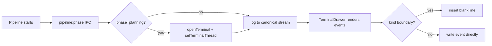
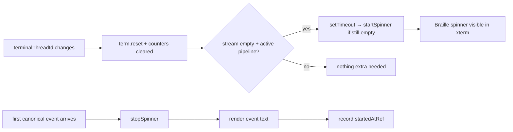
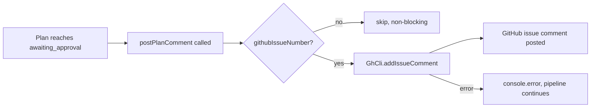

# 2026-04-13 Sessions

UI polish: progress bar shimmer, sidebar badges, terminal auto-open, terminal spacing, sidebar resize, phase stepper animation. Clickable action banners in terminal. Terminal blank-after-hot-reload bug fixed with immediate xterm spinner. Production build tested -- fixed black screen caused by wrong renderer HTML path. Plan posted as GitHub issue comment on awaiting_approval. Kanban card UX: PLAN/CANCEL/RETRY hover actions, View button tinted hover. Pipeline bug fixes: raw JSON in error panel, wrong raw output in expand, dirty worktree false-positive, executor commit flow. Quit confirmation dialog when pipelines are running.

---

## Session 1: UI Polish -- Progress Bar, Terminal, Sidebar

**Status:** Complete

### System Flow

### Affected Components

| Layer | Components |
|-------|------------|
| Frontend | `ProjectSidebar.tsx`, `KanbanBoard.tsx`, `PipelineStatus.tsx`, `TerminalDrawer.tsx`, `useIpc.ts`, `app.scss` |
| State | `app-store.ts` (terminal auto-open logic) |

### What was done

- [x] Sidebar badge consistency -- project row badges now match Overview badge (ping dot + "N live" text)
- [x] Progress bar shimmer animation fix -- `--animate-slide-progress` theme token wasn't generating utility; switched to `@utility animate-slide-progress` directive
- [x] Progress bar shimmer visibility -- shimmer now sweeps across full track (bg), fill bar shows actual progress independently
- [x] Progress bar height increased from 2px to 3px for visibility
- [x] Terminal auto-open on pipeline start -- opens terminal and switches thread even when user views a different thread
- [x] Phase events always logged to canonical stream regardless of active thread (fixes blank terminal)
- [x] Terminal blank line spacing between event groups (lifecycle vs content, before turn separators)
- [x] Phase stepper animation -- active phase circle gets a pulsing ring border
- [x] Sidebar resizable -- drag right edge, min 180px / max 256px

### Files changed

- `apps/desktop/src/renderer/components/ProjectSidebar.tsx` -- resizable sidebar (drag handle, state, min/max), badge consistency with ping dot
- `apps/desktop/src/renderer/styles/app.scss` -- `@utility animate-slide-progress` replacing broken `--animate-*` theme token
- `packages/ui/src/KanbanBoard.tsx` -- shimmer on full track, 3px bar, removed rounded-full from fill
- `packages/ui/src/PipelineStatus.tsx` -- pulsing ring on active phase circle
- `apps/desktop/src/renderer/components/TerminalDrawer.tsx` -- blank lines between event groups via `lastKindRef`, skeleton fix for race condition
- `apps/desktop/src/renderer/hooks/useIpc.ts` -- auto-open terminal on planning phase regardless of active thread, always log phase events to canonical stream

### Key decisions

- **Decision:** Shimmer sweeps full track width, not just the fill
  - **Context:** At 12% planning phase, the fill is ~30px wide -- shimmer was invisible on such a narrow bar
  - **Rationale:** The fill bar shows progress, the shimmer on the track shows "active" -- two independent visual signals

- **Decision:** `@utility` instead of `--animate-*` theme token
  - **Context:** Tailwind v4 `@theme inline` with `--animate-slide-progress` was not generating the `.animate-slide-progress` utility class
  - **Rationale:** `@utility` explicitly defines the CSS rule, bypassing any Tailwind v4 theme token resolution issues

- **Decision:** Phase events logged to canonical stream regardless of activeThreadId
  - **Context:** Terminal was blank when pipeline started on a non-focused thread because event logging was gated on `activeThreadId` match
  - **Rationale:** The canonical stream is per-thread, not per-view -- events belong to the thread that owns them

### Mistakes and fixes

- **Mistake:** Initially made progress bar full-width (100%) for active cards, hiding progress indication -> **Fix:** Separated shimmer onto the track layer and kept fill bar at actual progress width
- **Mistake:** Used `--animate-slide-progress` in `@theme inline` which didn't generate utility -> **Fix:** Used `@utility animate-slide-progress` directive instead

### Next steps

- [ ] Verify sidebar resize persists across sessions (currently in-memory state only, may want to persist to settings)
- [ ] Test terminal auto-open with multiple concurrent pipelines
- [ ] Verify shimmer animation is visible in production build after restart
- [ ] Consider double-click on sidebar edge to reset to default width

---

## Session 2: Clickable Action Banners in Terminal

**Status:** Complete

### Affected Components

| Layer | Components |
|-------|------------|
| Shared | `packages/agents/src/terminal-events.ts` |
| Normalizers | `packages/agents/src/providers/normalizers/claude-normalizer.ts`, `codex-normalizer.ts` |
| Frontend | `apps/desktop/src/renderer/components/TerminalDrawer.tsx` |

### What was done

- [x] Added `action` event kind to `TerminalEvent` union type (label + action fields)
- [x] Changed both Claude and Codex normalizers to emit `action` events instead of plain `text` for fence sentinels (shipcode-plan, shipcode-review, shipcode-verification)
- [x] TerminalDrawer intercepts `action` events -- renders clickable React buttons pinned at bottom of terminal instead of dead xterm text
- [x] Click opens Issue Detail via existing `selectIssue` store action
- [x] Action banners clear on thread switch
- [x] Typecheck passes across all 14 packages

### Files changed

- `packages/agents/src/terminal-events.ts` -- added `{ kind: 'action'; label: string; action: 'open-issue-detail' }` to union
- `packages/agents/src/providers/normalizers/claude-normalizer.ts` -- `FENCE_TAGS` -> `FENCE_ACTIONS`, emits `action` events
- `packages/agents/src/providers/normalizers/codex-normalizer.ts` -- same refactor as claude-normalizer
- `apps/desktop/src/renderer/components/TerminalDrawer.tsx` -- `actionBanners` state, intercept in event loop, render clickable buttons with accent styling

### Key decisions

- **Decision:** Render actions as React elements overlaid on terminal, not xterm text
  - **Context:** xterm is a terminal emulator -- no native clickable buttons, only WebLinksAddon for URLs
  - **Rationale:** React overlay gives proper click handling, hover states, and access to store actions

- **Decision:** New `action` event kind rather than special-casing text content
  - **Context:** Could have detected "[Plan ready" substring in the renderer
  - **Rationale:** Clean separation -- normalizers know about sentinels, renderer knows about event kinds. No fragile string matching in the UI layer

### Next steps

- [ ] QA: run a pipeline and verify the clickable banner appears and opens Issue Detail
- [ ] Consider auto-dismissing banners after click
- [ ] OpenRouter provider path -- verify it doesn't emit these sentinels to terminal (it doesn't currently)

---

## Session 3: Terminal Blank After Hot-Reload Bug Fix

**Status:** Complete

### Root Cause Analysis

Terminal was blank for 19+ minutes on a running pipeline because:

1. **Invisible skeleton overlay** -- `isTransitioning = true` showed `bg-white/5` (5% opacity) skeleton bars on a near-black background -- effectively invisible but covering the xterm canvas
2. **Hot-reload gap** -- `pipeline:phase` 'planning' fires once per pipeline start. After Vite hot-reloads `useIpc.ts` mid-pipeline, the historical event is gone. `canonicalTerminalStream` starts empty, `isTransitioning` stays `true` forever
3. **Extended thinking** -- Claude may also be in `--max-thinking-tokens 32000` deep-think mode, producing no NDJSON output for 20+ minutes

The compounding issue: even if Claude was producing output, the invisible skeleton overlay covered the xterm terminal, making it appear blank regardless.

### System Flow

### Affected Components

| Layer | Components |
|-------|------------|
| Frontend | `apps/desktop/src/renderer/components/TerminalDrawer.tsx` |

### What was done

- [x] Diagnosed root cause: invisible skeleton overlay + hot-reload losing `pipeline:phase` event = permanently blank terminal
- [x] Removed `isTransitioning` state and the invisible skeleton overlay entirely
- [x] When `terminalThreadId` switches to a thread with empty stream + active pipeline, immediately start xterm spinner with the phase label ("Thinking...", "Working...", etc.)
- [x] Guard the spinner start with `canonicalWrittenRef.current === 0` check to prevent double-starting if events arrive before the `setTimeout` fires

### Files changed

- `apps/desktop/src/renderer/components/TerminalDrawer.tsx` -- removed `isTransitioning` state + skeleton overlay; added immediate spinner start on thread switch for active-pipeline threads with empty streams

### Key decisions

- **Decision:** Remove skeleton overlay entirely, rely on xterm spinner
  - **Context:** The skeleton was `bg-white/5` = near-invisible. The xterm already has a proper braille spinner. Two loading mechanisms fighting each other, with the overlay covering the spinner
  - **Rationale:** Single signal is cleaner. The braille spinner in xterm is already present and provides real visual feedback

- **Decision:** `setTimeout(..., 0)` + `canonicalWrittenRef.current === 0` guard for spinner start
  - **Context:** `term.reset()` clears xterm synchronously. Spinner must write after the reset. Events in the canonical stream render via a separate useEffect that runs in the same render cycle
  - **Rationale:** Defer past the reset, then check if events already rendered before writing the spinner

### Mistakes and fixes

- **Mistake:** Left `isTransitioning` state but removed its only consumer (the overlay) -- TS flagged "declared but never read" -> **Fix:** Removed the state declaration and all `setIsTransitioning` calls

### Next steps

- [ ] To see spinner on current blank terminal: switch away from issue #16 and click back, OR restart the app
- [ ] Longer term: investigate why Claude CLI produces no output for 20+ minutes during planning (possibly extended thinking mode exhausting token budget before first response)
- [ ] Consider adding a "waiting" timeout indicator if spinner runs longer than N minutes (e.g., "Still thinking... 25m")
- [ ] Verify fix works correctly with multiple concurrent pipelines switching between terminal tabs

---

## Session 4: Production Build -- Black Screen Fix

**Status:** Complete

### Affected Components

| Layer | Components |
|-------|------------|
| Main process | `apps/desktop/src/main/index.ts` |

### What was done

- [x] Built production `.app` via `bun run build --filter @shipcode/desktop`
- [x] Diagnosed black screen: main process was loading `dist/renderer/index.html` but Vite outputs renderer to `dist/index.html`
- [x] Fixed path: `path.join(DIST, 'renderer', 'index.html')` → `path.join(DIST, 'index.html')`

### Files changed

- `apps/desktop/src/main/index.ts` -- `RENDERER_HTML` path corrected from `dist/renderer/index.html` to `dist/index.html`

### Key decisions

- **Decision:** Fix the path rather than change Vite output dir
  - **Context:** Vite renderer builds to `dist/index.html` by default (no `outDir` override in renderer config). The path in main was simply wrong.
  - **Rationale:** Least invasive fix -- Vite config is correct, main process had a stale path assumption.

### Mistakes and fixes

- **Mistake:** Shipped a broken production build path -- renderer HTML was never being found, causing permanent black screen in `.app` but not in `bun run dev` (which uses `RENDERER_URL` / Vite dev server instead)

### Next steps

- [ ] Rebuild and verify the fix: `bun run build --filter @shipcode/desktop`, then `open apps/desktop/out/mac-arm64/ShipCode.app`
- [ ] Fix TypeScript diagnostics: `@types/node` missing in `packages/shared` tsconfig (affects `worktree-path.ts`, `types.ts`, `constants.ts`)

---

## Session 5: Plan as GitHub Issue Comment + Kanban Card UX

**Status:** Complete

### System Flow

### Affected Components

| Layer | Components |
|-------|------------|
| Agents | `packages/agents/src/prompts/plan-comment.ts` (new), `packages/agents/src/index.ts` |
| Pipeline | `packages/pipeline/src/pipeline.ts` |
| UI | `packages/ui/src/KanbanBoard.tsx`, `apps/desktop/src/renderer/components/ThreadPanel.tsx` |

### What was done

- [x] Created `formatPlanComment(plan: ShipCodePlan): string` formatter in `packages/agents/src/prompts/plan-comment.ts`
- [x] Exported `formatPlanComment` from `packages/agents/src/index.ts`
- [x] Added `postPlanComment` helper to `pipeline.ts` -- fires after the two `awaiting_approval` transitions where structured plan exists (lines 407 and 432); third site at line 354 (no structured plan) left unchanged
- [x] Added `GhCli` import to `pipeline.ts` (was not previously imported; shipping used inline `execFileSync`)
- [x] PR #39 opened, merged to `develop`, pulled
- [x] Kanban PLAN badge: todo/queued cards show badge, hover reveals PLAN button → starts pipeline
- [x] Kanban CANCEL badge: active cards show phase badge, hover reveals CANCEL → fires `pipeline:cancel` IPC
- [x] Kanban RETRY badge: failed cards show FAILED badge, hover reveals RETRY → reruns pipeline
- [x] Removed standalone RotateCcw retry icon button (was top-right of failed cards)
- [x] View button hover bg now matches card tint per status (danger/warning/agent/neutral)

### Files changed

- `packages/agents/src/prompts/plan-comment.ts` -- new file: `formatPlanComment` with GFM markdown, empty-array guards, dependencies block, 65KB truncation guard
- `packages/agents/src/index.ts` -- +1 export line for `formatPlanComment`
- `packages/pipeline/src/pipeline.ts` -- added `GhCli`, `formatPlanComment` imports; added `postPlanComment` helper; called at 2 `awaiting_approval` sites
- `packages/ui/src/KanbanBoard.tsx` -- PLAN/CANCEL/RETRY hover badges; View button tinted hover; removed RotateCcw icon; `onCancel` and `onStartPipeline` props threaded through `StackedColumn`, `SectionBlock`, `DroppableColumn`, `DraggableCard`
- `apps/desktop/src/renderer/components/ThreadPanel.tsx` -- `onCancel` wired to `pipeline:cancel` IPC

### Key decisions

- **Decision:** `void postPlanComment(...)` fire-and-forget before `emitPhase`
  - **Context:** Comment post can take 1-3s (network). Pipeline must not block on it.
  - **Rationale:** Matches existing fire-and-forget pattern used throughout pipeline.ts. Errors are swallowed with console.error.

- **Decision:** Hover-swap pattern for PLAN/CANCEL/RETRY (badge fades, button fades in)
  - **Context:** Vincent wanted inline action without adding new UI chrome
  - **Rationale:** The badge IS the action affordance -- no extra buttons cluttering the card

- **Decision:** FAILED badge stays visible by default, RETRY appears on hover
  - **Context:** Vincent's explicit correction -- "FAILED then on hover replace with RETRY"
  - **Rationale:** FAILED is informational status; RETRY is destructive action -- hover gate prevents accidental triggers

### Mistakes and fixes

- **Mistake:** First RETRY implementation rendered as always-visible button, not hover-swap -> **Fix:** Wrapped in same `relative inline-flex` + fade pattern as CANCEL
- **Mistake:** `GhCli` not added to import snippet in plan -- adversarial review caught it before implementation
- **Mistake:** `pipeline.ts` `@shipcode/agents` import was missing `GhCli` (shipping uses inline `execFileSync`) -> **Fix:** Added both `GhCli` and `formatPlanComment` to import

### Next steps

- [ ] QA: trigger pipeline on real GitHub issue → verify plan comment appears on issue at awaiting_approval
- [ ] QA: hover active card → CANCEL; hover failed card → RETRY; hover todo card → PLAN
- [ ] Verify worktree cleanup: `git worktree remove .worktrees/feat-plan-comment`
- [ ] Sidebar resize persistence (in-memory only, from Session 1 next steps)

---

## Session 6: Pipeline Error Display + Executor Commit Flow

**Status:** Complete

### Affected Components

| Layer | Components |
|-------|------------|
| Frontend | `apps/desktop/src/renderer/components/IssueDetail.tsx` |
| Pipeline | `packages/pipeline/src/pipeline.ts` |
| Skills | `skills/plan-execution/SKILL.md` |

### What was done

- [x] Fixed raw JSON appearing in error panel — `safeErrorMessage` now handles `errors[]` array from Claude `error_max_turns` result type
- [x] Fixed `<pre>` expand showing wrong content — was hardcoded to `planHistory[0].rawOutput` instead of `failingPhaseOutput`
- [x] Fixed `showRawOutput` persisting across thread switches — reset on `activeThreadId` change
- [x] Removed dirty worktree check from `startVerification` — it fired before verification on expected uncommitted executor output, wrongly marking runs as failed
- [x] Added safety-net commit in `startVerification` — if executor left uncommitted changes, pipeline commits them with issue title before diffing
- [x] Updated execution skill to instruct agent to commit its own changes with a meaningful message
- [x] Removed stale clean-worktree check from `startCommitAndPush` (redundant after above)
- [x] Pipeline plan-failure path: now scans CLI result JSON for `errors[0]` (e.g. max_turns) before falling back to raw snippet

### Files changed

- `apps/desktop/src/renderer/components/IssueDetail.tsx` — `safeErrorMessage` handles `errors[]`, `<pre>` uses `failingPhaseOutput`, reset `showRawOutput` on thread switch
- `packages/pipeline/src/pipeline.ts` — removed dirty-worktree guard from `startVerification`, added safety-net commit before diff, removed stale clean check from `startCommitAndPush`, improved plan-failure error extraction
- `skills/plan-execution/SKILL.md` — changed "do not commit" to "commit your changes when done with a meaningful message"

### Key decisions

- **Decision:** Executor commits, pipeline just pushes
  - **Context:** "Do not commit" skill + pipeline-owned commit produced generic messages and a broken dirty-worktree guard
  - **Rationale:** Executor understands the change semantics and can write a meaningful commit message; pipeline just validates and pushes

- **Decision:** Keep safety-net commit in `startVerification`
  - **Context:** Old runs pre-skill-change (and edge cases) may not have committed
  - **Rationale:** Better to auto-commit with generic title than to fail with "No changes detected" when work was actually done

- **Decision:** Remove `startVerification` dirty-worktree check entirely
  - **Context:** Dirty worktree is the expected state after execution (executor made changes but didn't commit yet)
  - **Rationale:** The check was a false positive by design — committed diff check is the right gate, not dirty-tree check

### Mistakes and fixes

- **Mistake:** `safeErrorMessage` only checked `obj.error` (string), missed `obj.errors` (array) from Claude max_turns → **Fix:** Added `errors[0]` check
- **Mistake:** `<pre>` was hardcoded to `planHistory[0].rawOutput` regardless of which phase failed → **Fix:** Changed to `failingPhaseOutput`
- **Mistake:** First attempt to fix dirty-worktree added staging+commit to `startVerification` before understanding the full commit flow → **Fix:** Moved safety net to before the diff, removed both stale worktree guards

### Next steps

- [ ] QA: run a full pipeline on a real issue and verify the executor commits with a good message
- [ ] QA: confirm error panel shows human-readable text (not JSON) for max_turns and dirty-worktree failures
- [ ] Consider: if executor commit fails (e.g. nothing to commit, hooks fail), surface a clearer error than silent catch
