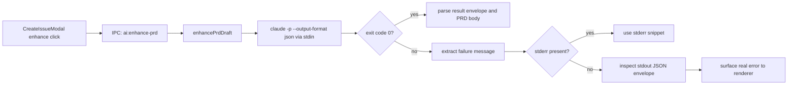
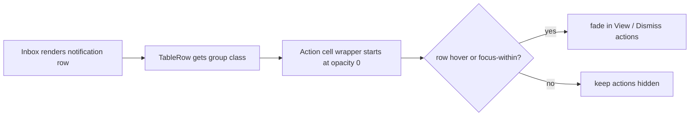
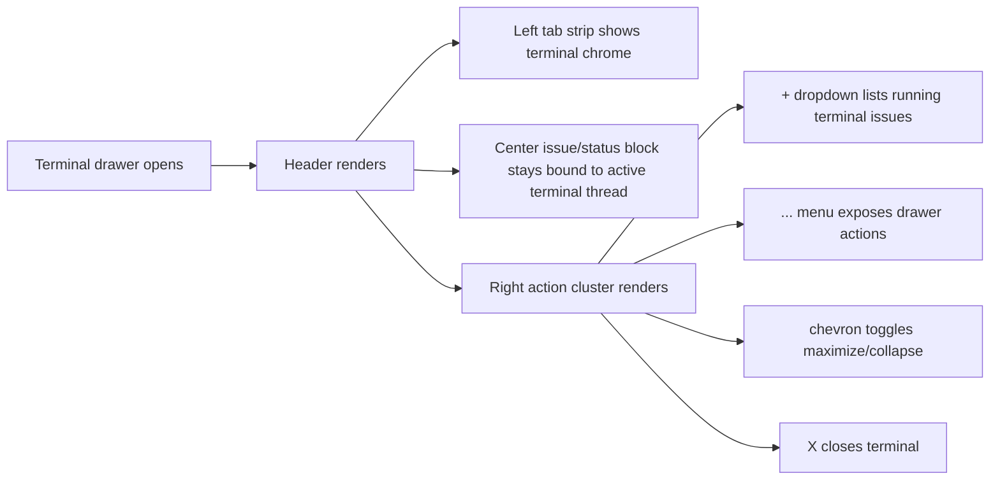

# 2026-04-16 Sessions

Claude PRD/context error handling fixed: non-zero Claude CLI exits were being reported as `no stderr` because newer Claude Code builds emit some failures on `stdout` as structured JSON. Added a shared extractor, patched both PRD enhancement and context generation, and added focused tests. Verified the real failure in this environment was rate-limit exhaustion: `You've hit your limit · resets 6am (Europe/Malta)`. Inbox actions UI adjusted to match existing app hover behavior: row actions are now hidden until row hover or keyboard focus.

---

## Session 1: Claude PRD Enhance Failure Investigation and Fix

**Status:** Complete

### System Flow

### Affected Components

| Layer | Components |
|-------|------------|
| Main agent helpers | `packages/agents/src/prd-generator.ts`, `packages/agents/src/context-generator.ts`, `packages/agents/src/cli-error.ts` |
| Tests | `packages/agents/src/prd-generator.test.ts`, `packages/agents/src/context-generator.test.ts` |
| Frontend impact | `CreateIssueModal` now receives the real Claude failure reason instead of `no stderr` |

### What was done

- [x] Traced `ai:enhance-prd` from the desktop IPC handler into the Claude subprocess helper
- [x] Reproduced the installed Claude CLI behavior locally with the real command flags
- [x] Confirmed the CLI was exiting non-zero while putting the actual error in `stdout` JSON, not `stderr`
- [x] Added `extractCliFailureMessage(stdout, stderr)` as a shared helper for CLI subprocess failure handling
- [x] Patched both `runClaudeWithStdin` and `runContextCliWithStdin` to use the shared extractor
- [x] Added focused tests covering the real Claude failure envelope shape
- [x] Verified package tests and typecheck pass

### Key decisions

- **Decision:** Fix both PRD enhancement and context generation, not just `ai:enhance-prd`
  - **Context:** Both codepaths used the same stale assumption that non-zero exits only explain themselves on `stderr`
  - **Rationale:** Same failure mode, same fix surface. Leaving context generation unfixed would preserve the bug in another feature

- **Decision:** Prefer stderr, then parse stdout JSON, then fall back to raw trailing stdout text
  - **Context:** Some tools still emit real errors to stderr; Claude now sometimes emits structured failures to stdout
  - **Rationale:** Preserves existing behavior where correct, while making newer Claude CLI output legible

- **Decision:** Keep the renderer error clamp as-is
  - **Context:** The renderer already clamps remote IPC errors to one short line
  - **Rationale:** The bug was upstream message extraction, not renderer presentation

### Files changed

- `packages/agents/src/cli-error.ts` -- shared helper to extract a short failure message from stderr or stdout JSON
- `packages/agents/src/prd-generator.ts` -- replaced `stderr || no stderr` logic with shared extraction
- `packages/agents/src/context-generator.ts` -- same shared extraction for context generation
- `packages/agents/src/prd-generator.test.ts` -- regression test for Claude stdout-only failure envelope
- `packages/agents/src/context-generator.test.ts` -- regression test for the same failure mode in context generation

### Mistakes and fixes

- **Mistake:** Initial test invocation used `bun test`, which bypassed the package’s Vitest setup and failed on `vi.hoisted`
  - **Fix:** Re-ran through the package script with `bun run --filter @shipcode/agents test -- src/prd-generator.test.ts src/context-generator.test.ts`

### Verification

- `claude --version` → `2.1.92 (Claude Code)`
- Reproduced failing command shape and observed stdout JSON result: `You've hit your limit · resets 6am (Europe/Malta)`
- `bun run --filter @shipcode/agents test -- src/prd-generator.test.ts src/context-generator.test.ts`
- `bun run --filter @shipcode/agents typecheck`

### Next steps

- [ ] Retry PRD enhancement after the Claude rate limit resets
- [ ] Consider moving other Claude subprocess callers onto the same shared failure extractor if more are added

---

## Session 2: Inbox Hover-Only Actions Consistency Fix

**Status:** Complete

### System Flow

### Affected Components

| Layer | Components |
|-------|------------|
| Frontend | `apps/desktop/src/renderer/components/InboxView.tsx` |

### What was done

- [x] Located the Inbox table action column from the screenshot/context
- [x] Compared it to existing repo patterns in `IssueListView`, `ProjectSidebar`, and `IssueDetail`
- [x] Updated Inbox rows to use the same `group-hover` / `group-focus-within` reveal pattern
- [x] Verified desktop typecheck passes

### Key decisions

- **Decision:** Use row-level `group-hover` and `group-focus-within`, not a custom CSS rule
  - **Context:** The rest of the app already uses that pattern for hover-reveal controls
  - **Rationale:** Matches existing interaction design and keeps keyboard accessibility intact

### Files changed

- `apps/desktop/src/renderer/components/InboxView.tsx` -- row actions hidden by default, revealed on hover/focus

### Mistakes and fixes

- None in implementation; change was minimal and type-safe on first pass

### Verification

- `bun run --filter @shipcode/desktop typecheck`

### Next steps

- [ ] QA visually in the running desktop app to confirm hover reveal timing feels consistent with sidebar and kanban controls

---

## Branch Notes

- There were pre-existing unrelated local changes before this session in desktop renderer, terminal drawer, app store, styles, and UI packages
- This session only added/changed:
  - `packages/agents/src/cli-error.ts`
  - `packages/agents/src/prd-generator.ts`
  - `packages/agents/src/context-generator.ts`
  - `packages/agents/src/prd-generator.test.ts`
  - `packages/agents/src/context-generator.test.ts`
  - `apps/desktop/src/renderer/components/InboxView.tsx`

---

## Session 3: Cursor-Style Terminal Header Chrome

**Status:** Complete

### System Flow

### Affected Components

| Layer | Components |
|-------|------------|
| Frontend | `apps/desktop/src/renderer/components/terminal-drawer/TerminalDrawerHeader.tsx` |
| Test coverage | `apps/desktop/src/renderer/components/TerminalDrawer.test.tsx` (existing tests exercised updated header behavior) |

### What was done

- [x] Compared the existing ShipCode terminal header to the Cursor terminal chrome in the provided screenshot
- [x] Reworked the terminal header into a Cursor-style layout with:
  - tab strip on the left: `Terminal`, `Problems`, `Output`, `Debug Console`
  - issue/status/model metadata retained in the center
  - action icon cluster on the right: `+`, dropdown caret, overflow menu, chevron, close
- [x] Preserved current ShipCode behavior for issue switching, expand/collapse, and terminal close
- [x] Reused existing `DropdownMenu`, `Button`, and icon primitives instead of introducing new bespoke controls
- [x] Verified desktop typecheck and terminal drawer tests pass

### Key decisions

- **Decision:** Keep the running-issue dropdown behavior and wrap it in Cursor-like chrome instead of making the header purely decorative
  - **Context:** ShipCode’s terminal header already includes useful issue-switching behavior tied to active threads
  - **Rationale:** Matching Cursor visually should not regress the workflow the drawer already supports

- **Decision:** Use existing UI primitives and icon exports for the Cursor-style actions
  - **Context:** The repo already has `Button`, `DropdownMenu`, and lucide re-exports via `@shipcode/ui`
  - **Rationale:** Keeps the header consistent with the rest of the app and avoids one-off DOM/styling patterns

- **Decision:** Map maximize/collapse to chevron icons and move secondary actions into an overflow menu
  - **Context:** The screenshot shows Cursor using a compact icon-only action cluster, not labeled utility buttons
  - **Rationale:** Closer visual match while still preserving accessible labels and existing handler wiring

### Files changed

- `apps/desktop/src/renderer/components/terminal-drawer/TerminalDrawerHeader.tsx` -- terminal header restyled to a Cursor-like tab strip and icon action bar

### Mistakes and fixes

- None in implementation; the existing test suite for the terminal drawer passed without additional test changes

### Verification

- `bun run --filter @shipcode/desktop typecheck`
- `bun run --filter @shipcode/desktop test -- src/renderer/components/TerminalDrawer.test.tsx`

### Next steps

- [ ] If desired, match Cursor more closely in the terminal body chrome too (panel background, process list treatment, separators)
- [ ] QA the header visually in the running desktop app against the provided screenshot

---

## Branch Notes

- There were pre-existing unrelated local changes before this session in desktop renderer, terminal drawer, app store, styles, and UI packages
- This session added/changed:
  - `packages/agents/src/cli-error.ts`
  - `packages/agents/src/prd-generator.ts`
  - `packages/agents/src/context-generator.ts`
  - `packages/agents/src/prd-generator.test.ts`
  - `packages/agents/src/context-generator.test.ts`
  - `apps/desktop/src/renderer/components/InboxView.tsx`
  - `apps/desktop/src/renderer/components/terminal-drawer/TerminalDrawerHeader.tsx`
