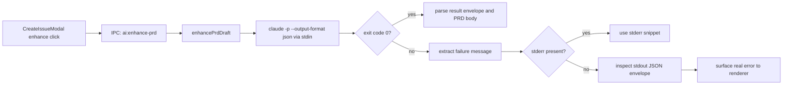
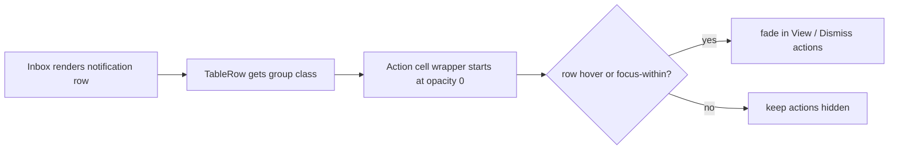
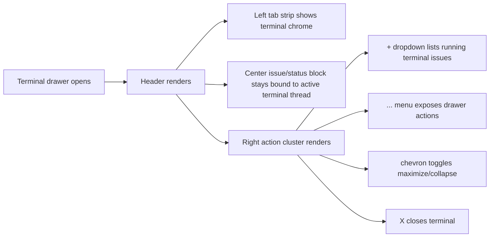
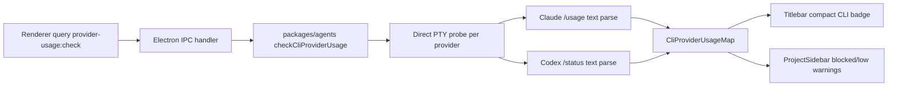
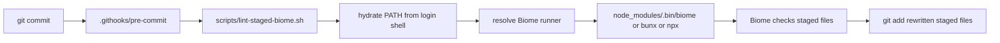
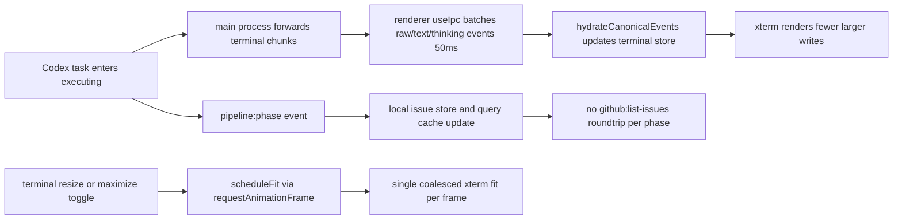
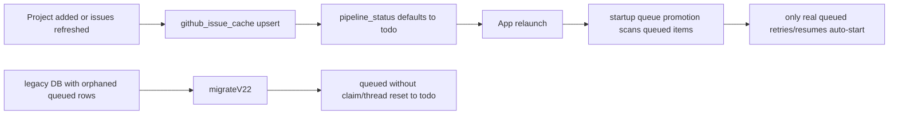
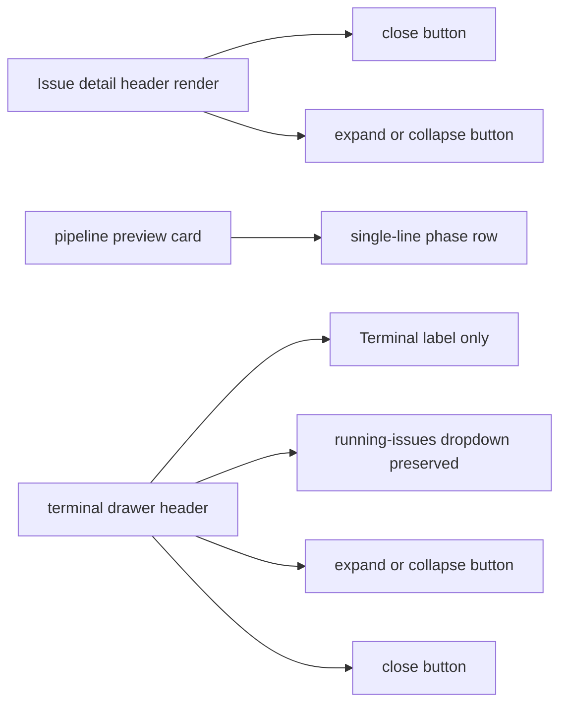

# 2026-04-16 Sessions

Claude PRD/context error handling fixed: non-zero Claude CLI exits were being reported as `no stderr` because newer Claude Code builds emit some failures on `stdout` as structured JSON. Added a shared extractor, patched both PRD enhancement and context generation, and added focused tests. Verified the real failure in this environment was rate-limit exhaustion: `You've hit your limit · resets 6am (Europe/Malta)`. Inbox actions UI adjusted to match existing app hover behavior: row actions are now hidden until row hover or keyboard focus.

---

## Session 1: Claude PRD Enhance Failure Investigation and Fix

**Status:** Complete

### System Flow

### Affected Components

| Layer | Components |
|-------|------------|
| Main agent helpers | `packages/agents/src/prd-generator.ts`, `packages/agents/src/context-generator.ts`, `packages/agents/src/cli-error.ts` |
| Tests | `packages/agents/src/prd-generator.test.ts`, `packages/agents/src/context-generator.test.ts` |
| Frontend impact | `CreateIssueModal` now receives the real Claude failure reason instead of `no stderr` |

### What was done

- [x] Traced `ai:enhance-prd` from the desktop IPC handler into the Claude subprocess helper
- [x] Reproduced the installed Claude CLI behavior locally with the real command flags
- [x] Confirmed the CLI was exiting non-zero while putting the actual error in `stdout` JSON, not `stderr`
- [x] Added `extractCliFailureMessage(stdout, stderr)` as a shared helper for CLI subprocess failure handling
- [x] Patched both `runClaudeWithStdin` and `runContextCliWithStdin` to use the shared extractor
- [x] Added focused tests covering the real Claude failure envelope shape
- [x] Verified package tests and typecheck pass

### Key decisions

- **Decision:** Fix both PRD enhancement and context generation, not just `ai:enhance-prd`
  - **Context:** Both codepaths used the same stale assumption that non-zero exits only explain themselves on `stderr`
  - **Rationale:** Same failure mode, same fix surface. Leaving context generation unfixed would preserve the bug in another feature

- **Decision:** Prefer stderr, then parse stdout JSON, then fall back to raw trailing stdout text
  - **Context:** Some tools still emit real errors to stderr; Claude now sometimes emits structured failures to stdout
  - **Rationale:** Preserves existing behavior where correct, while making newer Claude CLI output legible

- **Decision:** Keep the renderer error clamp as-is
  - **Context:** The renderer already clamps remote IPC errors to one short line
  - **Rationale:** The bug was upstream message extraction, not renderer presentation

### Files changed

- `packages/agents/src/cli-error.ts` -- shared helper to extract a short failure message from stderr or stdout JSON
- `packages/agents/src/prd-generator.ts` -- replaced `stderr || no stderr` logic with shared extraction
- `packages/agents/src/context-generator.ts` -- same shared extraction for context generation
- `packages/agents/src/prd-generator.test.ts` -- regression test for Claude stdout-only failure envelope
- `packages/agents/src/context-generator.test.ts` -- regression test for the same failure mode in context generation

### Mistakes and fixes

- **Mistake:** Initial test invocation used `bun test`, which bypassed the package’s Vitest setup and failed on `vi.hoisted`
  - **Fix:** Re-ran through the package script with `bun run --filter @shipcode/agents test -- src/prd-generator.test.ts src/context-generator.test.ts`

### Verification

- `claude --version` → `2.1.92 (Claude Code)`
- Reproduced failing command shape and observed stdout JSON result: `You've hit your limit · resets 6am (Europe/Malta)`
- `bun run --filter @shipcode/agents test -- src/prd-generator.test.ts src/context-generator.test.ts`
- `bun run --filter @shipcode/agents typecheck`

### Next steps

- [ ] Retry PRD enhancement after the Claude rate limit resets
- [ ] Consider moving other Claude subprocess callers onto the same shared failure extractor if more are added

---

## Session 2: Inbox Hover-Only Actions Consistency Fix

**Status:** Complete

### System Flow

### Affected Components

| Layer | Components |
|-------|------------|
| Frontend | `apps/desktop/src/renderer/components/InboxView.tsx` |

### What was done

- [x] Located the Inbox table action column from the screenshot/context
- [x] Compared it to existing repo patterns in `IssueListView`, `ProjectSidebar`, and `IssueDetail`
- [x] Updated Inbox rows to use the same `group-hover` / `group-focus-within` reveal pattern
- [x] Verified desktop typecheck passes

### Key decisions

- **Decision:** Use row-level `group-hover` and `group-focus-within`, not a custom CSS rule
  - **Context:** The rest of the app already uses that pattern for hover-reveal controls
  - **Rationale:** Matches existing interaction design and keeps keyboard accessibility intact

### Files changed

- `apps/desktop/src/renderer/components/InboxView.tsx` -- row actions hidden by default, revealed on hover/focus

### Mistakes and fixes

- None in implementation; change was minimal and type-safe on first pass

### Verification

- `bun run --filter @shipcode/desktop typecheck`

### Next steps

- [ ] QA visually in the running desktop app to confirm hover reveal timing feels consistent with sidebar and kanban controls

---

## Branch Notes

- There were pre-existing unrelated local changes before this session in desktop renderer, terminal drawer, app store, styles, and UI packages
- This session only added/changed:
  - `packages/agents/src/cli-error.ts`
  - `packages/agents/src/prd-generator.ts`
  - `packages/agents/src/context-generator.ts`
  - `packages/agents/src/prd-generator.test.ts`
  - `packages/agents/src/context-generator.test.ts`
  - `apps/desktop/src/renderer/components/InboxView.tsx`

---

## Session 3: Cursor-Style Terminal Header Chrome

**Status:** Complete

### System Flow

### Affected Components

| Layer | Components |
|-------|------------|
| Frontend | `apps/desktop/src/renderer/components/terminal-drawer/TerminalDrawerHeader.tsx` |
| Test coverage | `apps/desktop/src/renderer/components/TerminalDrawer.test.tsx` (existing tests exercised updated header behavior) |

### What was done

- [x] Compared the existing ShipCode terminal header to the Cursor terminal chrome in the provided screenshot
- [x] Reworked the terminal header into a Cursor-style layout with:
  - tab strip on the left: `Terminal`, `Problems`, `Output`, `Debug Console`
  - issue/status/model metadata retained in the center
  - action icon cluster on the right: `+`, dropdown caret, overflow menu, chevron, close
- [x] Preserved current ShipCode behavior for issue switching, expand/collapse, and terminal close
- [x] Reused existing `DropdownMenu`, `Button`, and icon primitives instead of introducing new bespoke controls
- [x] Verified desktop typecheck and terminal drawer tests pass

### Key decisions

- **Decision:** Keep the running-issue dropdown behavior and wrap it in Cursor-like chrome instead of making the header purely decorative
  - **Context:** ShipCode’s terminal header already includes useful issue-switching behavior tied to active threads
  - **Rationale:** Matching Cursor visually should not regress the workflow the drawer already supports

- **Decision:** Use existing UI primitives and icon exports for the Cursor-style actions
  - **Context:** The repo already has `Button`, `DropdownMenu`, and lucide re-exports via `@shipcode/ui`
  - **Rationale:** Keeps the header consistent with the rest of the app and avoids one-off DOM/styling patterns

- **Decision:** Map maximize/collapse to chevron icons and move secondary actions into an overflow menu
  - **Context:** The screenshot shows Cursor using a compact icon-only action cluster, not labeled utility buttons
  - **Rationale:** Closer visual match while still preserving accessible labels and existing handler wiring

### Files changed

- `apps/desktop/src/renderer/components/terminal-drawer/TerminalDrawerHeader.tsx` -- terminal header restyled to a Cursor-like tab strip and icon action bar

### Mistakes and fixes

- None in implementation; the existing test suite for the terminal drawer passed without additional test changes

### Verification

- `bun run --filter @shipcode/desktop typecheck`
- `bun run --filter @shipcode/desktop test -- src/renderer/components/TerminalDrawer.test.tsx`

### Next steps

- [ ] If desired, match Cursor more closely in the terminal body chrome too (panel background, process list treatment, separators)
- [ ] QA the header visually in the running desktop app against the provided screenshot

---

## Session 7: Direct CLI Quota Signal in Titlebar and Project Warnings

**Status:** Complete

### System Flow

### Affected Components

| Layer | Components |
|-------|------------|
| Shared types/helpers | `packages/shared/src/types.ts`, `packages/shared/src/ipc-channels.ts`, `packages/shared/src/provider-usage.ts`, `packages/shared/src/index.ts` |
| Agent health probes | `packages/agents/src/health-check.ts`, `packages/agents/src/index.ts` |
| Agent tests | `packages/agents/src/health-check.test.ts`, `packages/shared/src/provider-usage.test.ts` |
| Desktop UI | `apps/desktop/src/main/ipc/register-project-handlers.ts`, `apps/desktop/src/renderer/components/Titlebar.tsx`, `apps/desktop/src/renderer/components/ProjectSidebar.tsx` |

### What was done

- [x] Added a shared `CliProviderUsageMap` contract and provider warning assessment helper
- [x] Added `provider-usage:check` IPC so renderer code can request live CLI quota state
- [x] Added a compact combined `CLI` badge in the titlebar with hover details for Codex and Claude
- [x] Added project-level `Blocked` / `Low` badges in the sidebar when the selected provider is exhausted or nearly exhausted
- [x] Initially wired the feature through CodexBar, then replaced that implementation with direct local CLI probing after verifying the dependency concern
- [x] Implemented direct PTY probing:
  - Claude via `/usage` with trust-prompt auto-confirm in a scratch probe directory
  - Codex via `/status`
- [x] Kept the signal soft: on probe/parsing failure, return `unknown` instead of falsely blocking projects
- [x] Rewrote tests from CodexBar JSON fixtures to direct CLI text fixtures
- [x] Verified affected packages with typecheck and focused tests

### Key decisions

- **Decision:** Treat CLI quota as a soft readiness signal, not a hard source of truth
  - **Context:** Both Claude and Codex expose quota state through interactive terminal UIs rather than stable structured APIs
  - **Rationale:** Install/auth is reliable; quota parsing is inherently brittle and should degrade to `unknown`, not block work on parser failure

- **Decision:** Keep the project warning logic separate from the titlebar badge
  - **Context:** The topbar needs a one-glance global signal, while project warnings depend on each repo’s resolved provider/model settings
  - **Rationale:** Prevents overloading the titlebar and keeps repo-specific warnings where selection context already exists

- **Decision:** Distinguish CLI usage from API billing/usage
  - **Context:** The user explicitly called out that CLI usage and API usage are different products with different limits
  - **Rationale:** Avoids mixing OpenAI/Anthropic API billing with whether local Claude/Codex CLI sessions are currently usable

### Files changed

- `packages/shared/src/types.ts` -- added CLI provider usage types
- `packages/shared/src/ipc-channels.ts` -- added `provider-usage:check` IPC contract
- `packages/shared/src/provider-usage.ts` -- added shared blocked/low warning assessment
- `packages/shared/src/provider-usage.test.ts` -- focused warning logic tests
- `packages/shared/src/index.ts` -- exported provider usage helpers
- `packages/agents/src/health-check.ts` -- added direct Claude/Codex PTY quota probes and parsers
- `packages/agents/src/health-check.test.ts` -- direct CLI text parsing tests plus PTY probe mocking
- `packages/agents/src/index.ts` -- exported the new usage helpers
- `apps/desktop/src/main/ipc/register-project-handlers.ts` -- registered the provider usage IPC handler
- `apps/desktop/src/renderer/components/Titlebar.tsx` -- added grouped CLI badge and hover detail panel
- `apps/desktop/src/renderer/components/ProjectSidebar.tsx` -- added project-level warning badges

### Mistakes and fixes

- **Mistake:** First implementation depended on CodexBar being installed locally
  - **Fix:** Replaced it with direct CLI probing inside ShipCode using PTY-driven `/usage` and `/status`

- **Mistake:** Assumed Claude quota probing could run from an arbitrary cwd
  - **Fix:** Matched CodexBar’s approach by probing from a dedicated scratch directory and auto-confirming the trust prompt before scraping `/usage`

### Verification

- `bun run typecheck` in `packages/agents`
- `bun run typecheck` in `packages/shared`
- `bun run typecheck` in `apps/desktop`
- `bun run test -- health-check.test.ts` in `packages/agents`
- `bun run test -- provider-usage.test.ts` in `packages/shared`
- `bun run test -- ProjectSidebar.test.tsx` in `apps/desktop`

### Next steps

- [ ] Dogfood the titlebar badge against real exhausted/low CLI sessions to confirm the TUI parsers hold up across more local environments
- [ ] If Claude/Codex add stable structured quota commands later, replace the PTY scraping path with those commands

---

## Session 4: Git Pre-Commit Hook PATH Recovery for Staged Linting

**Status:** Complete

### System Flow

### Affected Components

| Layer | Components |
|-------|------------|
| Git hooks | `.githooks/pre-commit` |
| Repo scripts | `scripts/lint-staged-biome.sh` |

### What was done

- [x] Reproduced the failing commit-hook behavior from the user report
- [x] Confirmed the first failure was `.githooks/pre-commit` invoking `bun run lint:staged` when `bun` was not on the hook PATH
- [x] Swapped the hook to call `sh scripts/lint-staged-biome.sh` directly instead of depending on the package-manager hop
- [x] Confirmed the second failure was Biome's local wrapper using `#!/usr/bin/env node` while Git's PATH also omitted Homebrew `node`
- [x] Patched `scripts/lint-staged-biome.sh` to hydrate PATH from the user's login shell before resolving the runner
- [x] Kept runner resolution layered: local `node_modules/.bin/biome` first, then `bunx`, then `npx`
- [x] Verified the hook succeeds under a restricted PATH that excludes the usual interactive-shell paths

### Key decisions

- **Decision:** Call the staged-lint shell script directly from the hook instead of `bun run lint:staged`
  - **Context:** The script already contains the real staged-file logic; `bun run` was just an extra indirection layer that could fail in the non-interactive hook environment
  - **Rationale:** Same behavior, fewer assumptions about how Git launches hooks

- **Decision:** Recover PATH from a login shell inside the script
  - **Context:** Git hooks were not seeing `~/.bun/bin` or Homebrew `node`, while the repo already uses login-shell env hydration in process-spawning code
  - **Rationale:** More robust than hardcoding `/opt/homebrew/bin` or a user-specific Bun path into hook scripts

- **Decision:** Prefer the local installed Biome binary before `bunx` or `npx`
  - **Context:** Dependencies are already installed in the repo and the local binary keeps the hook pinned to the checked-in version
  - **Rationale:** Reduces network/tooling variance and matches the repo's locked dependency graph

### Files changed

- `.githooks/pre-commit` -- removed hard dependency on `bun run lint:staged`
- `scripts/lint-staged-biome.sh` -- added login-shell PATH hydration and resilient Biome runner resolution

### Mistakes and fixes

- **Mistake:** The first patch removed the `bun` dependency but still relied on the local Biome wrapper without accounting for its `node` shebang
  - **Fix:** Reproduced the hook under `PATH=/usr/bin:/bin`, confirmed the missing `node`, then added PATH hydration before runner selection

### Verification

- `sh -n .githooks/pre-commit`
- `sh -n scripts/lint-staged-biome.sh`
- `PATH=/usr/bin:/bin:/opt/homebrew/bin sh .githooks/pre-commit`
- `PATH=/usr/bin:/bin SHELL=/bin/zsh sh .githooks/pre-commit`

### Next steps

- [ ] Retry the original `git commit` flow in the normal shell to confirm the hook is stable in the exact user path
- [ ] If more repo scripts are meant to run from Git hooks, consider extracting the login-shell PATH hydration into a shared helper script

---

## Branch Notes

- There were pre-existing unrelated local changes before this session in desktop renderer, terminal drawer, app store, styles, and UI packages
- This session added/changed:
  - `packages/agents/src/cli-error.ts`
  - `packages/agents/src/prd-generator.ts`
  - `packages/agents/src/context-generator.ts`
  - `packages/agents/src/prd-generator.test.ts`
  - `packages/agents/src/context-generator.test.ts`
  - `apps/desktop/src/renderer/components/InboxView.tsx`
  - `apps/desktop/src/renderer/components/terminal-drawer/TerminalDrawerHeader.tsx`

---

## Session 5: Terminal UX Polish and Execution-Start CPU Stabilization

**Status:** Complete

### System Flow

### Affected Components

| Layer | Components |
|-------|------------|
| UI package | `packages/ui/src/kanban-board/IssueCardParts.tsx`, `packages/ui/src/kanban-board/IssuePrLinks.test.tsx`, `packages/ui/src/index.ts` |
| Desktop renderer | `apps/desktop/src/renderer/App.tsx`, `apps/desktop/src/renderer/styles/app.scss`, `apps/desktop/src/renderer/hooks/useIpc.ts`, `apps/desktop/src/renderer/hooks/useIpc.test.tsx` |
| Terminal drawer | `apps/desktop/src/renderer/components/terminal-drawer/TerminalDrawerHeader.tsx`, `apps/desktop/src/renderer/components/terminal-drawer/useTerminalDrawer.ts`, `apps/desktop/src/renderer/components/TerminalDrawer.test.tsx` |
| State | `apps/desktop/src/renderer/stores/app-store.ts`, `apps/desktop/src/renderer/stores/app-store.test.ts` |
| Investigation inputs | `apps/desktop/logs/events.log`, `/Users/decod3rs/Library/Logs/ShipCode/main.log` |

### What was done

- [x] Expanded the active kanban execution card animation from a thin footer progress bar into a full-surface animated background sweep behind the card content
- [x] Changed the terminal maximize behavior so the control actually moves the terminal into the main content region instead of leaving it as a half-height bottom split
- [x] Fixed the broken maximize follow-up where the main pane disappeared and the terminal was still mounted in the drawer slot, producing a large empty black area
- [x] Updated terminal chrome polish:
  - maximize/collapse action now swaps icons based on state
  - phase label now uses the shared colored `PhaseChip` instead of plain text
- [x] Investigated the reported crash/CPU spike during execution start by reading renderer/main-process logs and tracing the terminal event path
- [x] Confirmed the loud `health:check completed` lines are normal 60s polling noise, not the crash cause
- [x] Identified the real hot path as dense terminal output bursts plus repeated renderer work during execution start
- [x] Batched renderer-side terminal hydration so raw/text/thinking chunks are buffered briefly before hitting Zustand/xterm
- [x] Removed unnecessary per-phase `github:list-issues` refetches and replaced them with local issue status updates in the renderer cache/store
- [x] Coalesced repeated xterm `fit()` calls behind `requestAnimationFrame` so resize/maximize/thread-switch events do not trigger a fit storm
- [x] Added focused regression tests for terminal batching, store behavior, and terminal drawer interactions
- [x] Verified targeted tests and desktop typecheck pass

### Key decisions

- **Decision:** Stabilize in the renderer first instead of immediately rewriting the main-process IPC bridge
  - **Context:** Logs showed no fatal main-process crash in the reported window; the strongest signal was renderer overload from many small terminal updates
  - **Rationale:** Batching and deduping on the renderer side is the fastest low-risk cut and directly addresses the observed pressure

- **Decision:** Treat `pipeline:phase` as a local state update, not a reason to re-run `github:list-issues`
  - **Context:** Every execution/review/verify phase change was causing extra list refresh work in the same hot path as terminal streaming
  - **Rationale:** The renderer already has enough context to update issue status locally; the network/db roundtrip was wasted churn

- **Decision:** Render maximized terminal in the main content region, not by hiding the main pane while keeping the drawer mounted below
  - **Context:** The first maximize implementation matched state but not layout ownership, which produced a blank area instead of a true full-size terminal
  - **Rationale:** The maximize icon should change placement semantics, not just toggle a height flag

- **Decision:** Keep terminal header visual polish aligned with existing shared UI primitives
  - **Context:** The user wanted the header state to read like kanban, not custom one-off text treatment
  - **Rationale:** Reusing `PhaseChip` and shared lucide exports keeps the drawer visually coherent with the rest of ShipCode

### Files changed

- `packages/ui/src/kanban-board/IssueCardParts.tsx` -- active kanban card now renders a full animated background layer while executing
- `apps/desktop/src/renderer/styles/app.scss` -- added supporting animated background utility and motion guard styling
- `packages/ui/src/kanban-board/IssuePrLinks.test.tsx` -- regression coverage for active-card-only animated background behavior
- `apps/desktop/src/renderer/stores/app-store.ts` -- added shared maximize state for the terminal pane
- `apps/desktop/src/renderer/stores/app-store.test.ts` -- store coverage for maximize state transitions
- `apps/desktop/src/renderer/App.tsx` -- maximized terminal now owns the main content region instead of leaving an empty pane
- `apps/desktop/src/renderer/components/terminal-drawer/useTerminalDrawer.ts` -- coalesced xterm `fit()` scheduling and terminal layout behavior
- `apps/desktop/src/renderer/components/TerminalDrawer.test.tsx` -- updated terminal drawer regression coverage
- `apps/desktop/src/renderer/components/terminal-drawer/TerminalDrawerHeader.tsx` -- stateful maximize/collapse icon swap and shared phase badge
- `packages/ui/src/index.ts` -- exported the panel-open/panel-close icons used by terminal chrome
- `apps/desktop/src/renderer/hooks/useIpc.ts` -- terminal event batching, throttled activity updates, and local phase status updates
- `apps/desktop/src/renderer/hooks/useIpc.test.tsx` -- tests for terminal batching and local pipeline status updates

### Mistakes and fixes

- **Mistake:** The first maximize implementation hid the main content but still left the terminal mounted in the bottom drawer area
  - **Fix:** Moved maximized rendering into `App.tsx` so the terminal takes over the main content region when maximized

- **Mistake:** The first version of the terminal phase badge kept plain text styling, which looked detached from the kanban status treatment the user expected
  - **Fix:** Swapped it to the shared `PhaseChip`

- **Mistake:** Initial typecheck after the renderer status-localization change widened the mapped phase value to plain `string`
  - **Fix:** Tightened the mapped value to `IssuePipelineStatus` before writing into the issue store/query cache

### Investigation notes

- `apps/desktop/logs/events.log` showed a dense stream of `terminal:event` payloads during execution
- `/Users/decod3rs/Library/Logs/ShipCode/main.log` showed heavy Codex output and normal support-process churn, but no fatal main-process crash at the reported `15:48`-`15:50` window
- The repeating `health:check completed` entries are expected support polling noise, not the root cause
- There were older `write EIO` lines in `main.log`, but they did not line up with the execution-start crash report and were treated as likely unrelated

### Verification

- `bun run test src/kanban-board/IssuePrLinks.test.tsx` in `packages/ui`
- `bun run typecheck` in `packages/ui`
- `bun run test src/renderer/components/TerminalDrawer.test.tsx src/renderer/stores/app-store.test.ts` in `apps/desktop`
- `bun run test src/renderer/components/TerminalDrawer.test.tsx` in `apps/desktop`
- `bun run test src/renderer/hooks/useIpc.test.tsx src/renderer/components/TerminalDrawer.test.tsx src/renderer/stores/app-store.test.ts` in `apps/desktop`
- `bun run typecheck` in `apps/desktop`

### Next steps

- [ ] Re-run a heavy Codex execution in the desktop app and confirm CPU stays stable when the terminal starts streaming
- [ ] If the spike is reduced but still present, batch/coalesce terminal IPC in the main process before events reach the renderer
- [ ] QA the terminal maximize path and phase badge visually in the running app after a few real execution cycles

---

## Branch Notes

- This session built on earlier terminal/header work already in progress on the branch
- The terminal/crash investigation session added or changed:
  - `packages/ui/src/kanban-board/IssueCardParts.tsx`
  - `apps/desktop/src/renderer/styles/app.scss`
  - `packages/ui/src/kanban-board/IssuePrLinks.test.tsx`
  - `apps/desktop/src/renderer/stores/app-store.ts`
  - `apps/desktop/src/renderer/stores/app-store.test.ts`
  - `apps/desktop/src/renderer/App.tsx`
  - `apps/desktop/src/renderer/components/terminal-drawer/useTerminalDrawer.ts`
  - `apps/desktop/src/renderer/components/TerminalDrawer.test.tsx`
  - `apps/desktop/src/renderer/components/terminal-drawer/TerminalDrawerHeader.tsx`
  - `packages/ui/src/index.ts`
  - `apps/desktop/src/renderer/hooks/useIpc.ts`
  - `apps/desktop/src/renderer/hooks/useIpc.test.tsx`

---

## Session 6: Prevent Imported GitHub Issues from Auto-Starting on Reload

**Status:** Complete

### System Flow

### Affected Components

| Layer | Components |
|-------|------------|
| DB schema | `packages/db/src/schema.ts`, `packages/db/src/index.ts`, `packages/db/src/test-helpers.ts` |
| DB query tests | `packages/db/src/queries/github-issues.test.ts`, `packages/db/src/schema.test.ts` |
| UI primitive | `packages/ui/src/primitives/tabs.tsx` |
| Investigation inputs | `apps/desktop/logs/events.log`, `apps/desktop/src/main/index.ts`, `apps/desktop/src/main/ipc/register-github-handlers.ts` |

### What was done

- [x] Investigated the report that reloading after adding a new project started every board task
- [x] Confirmed the startup path auto-promotes `queued` issues on launch from `apps/desktop/src/main/index.ts`
- [x] Confirmed imported GitHub issues were entering the cache with `pipeline_status = 'queued'`
- [x] Changed the schema default for imported issues from `queued` to `todo`
- [x] Added `migrateV22` to rewrite orphaned legacy `queued` rows back to `todo`
- [x] Wired the new migration into normal DB init and test DB init
- [x] Updated regression tests to reflect `todo` as the default imported state
- [x] Added a migration test to protect the legacy queued-row repair path
- [x] Fixed the Tabs primitive cursor treatment so tab triggers show pointer/not-allowed cursor states like the rest of `packages/ui`

### Key decisions

- **Decision:** Fix the issue at the DB default and migration layer, not by weakening startup queue promotion
  - **Context:** Queue promotion on startup is still needed for real resumed/released work
  - **Rationale:** Imported issues were incorrectly classified as runnable; the correct fix is to classify them as `todo`, not to remove legitimate queue recovery

- **Decision:** Migrate existing orphaned queued rows back to `todo`
  - **Context:** Changing the schema default alone would only protect new databases or new inserts
  - **Rationale:** Existing users already have bad state persisted locally; startup needs to repair that state automatically

- **Decision:** Keep claimed/linked queued rows untouched in the migration
  - **Context:** Some queued rows represent real resumed work
  - **Rationale:** The migration should only repair the false-positive queued rows that have no claim and no thread

### Files changed

- `packages/db/src/schema.ts` -- changed imported issue default state to `todo` and added `migrateV22`
- `packages/db/src/index.ts` -- runs `migrateV22` in app DB initialization
- `packages/db/src/test-helpers.ts` -- runs `migrateV22` in test DB setup
- `packages/db/src/queries/github-issues.test.ts` -- updated default-state and requeue expectations
- `packages/db/src/schema.test.ts` -- added migration coverage for orphaned queued issue repair
- `packages/ui/src/primitives/tabs.tsx` -- added pointer/disabled cursor states to tab triggers

### Mistakes and fixes

- **Mistake:** First test run used `bun test`, which cannot run these `node:sqlite` tests in this repo setup
  - **Fix:** Switched to `node node_modules/vitest/vitest.mjs run ...` for the targeted DB test slice

### Verification

- `node node_modules/vitest/vitest.mjs run packages/db/src/queries/github-issues.test.ts packages/db/src/schema.test.ts`

### Next steps

- [ ] Relaunch the desktop app once so `migrateV22` runs against the local app database
- [ ] Re-add or refresh a GitHub-backed project and confirm imported issues stay in `todo`
- [ ] QA that legitimate queued retries/resumes still auto-promote on startup

---

## Session 6: Issue Detail Header Cleanup and Terminal Chrome Simplification

**Status:** Complete

### System Flow

### Affected Components

| Layer | Components |
|-------|------------|
| Issue detail | `apps/desktop/src/renderer/components/IssueDetail.tsx`, `apps/desktop/src/renderer/components/issue-detail/IssueDetailActions.tsx` |
| Terminal drawer | `apps/desktop/src/renderer/components/terminal-drawer/TerminalDrawerHeader.tsx`, `apps/desktop/src/renderer/components/TerminalDrawer.test.tsx` |
| Session docs | `.agents/SESSIONS/2026-04-16.md` |

### What was done

- [x] Reordered the issue detail header controls so close renders before expand or collapse
- [x] Flattened the pipeline preview phases into a single compact row instead of a stacked stepper
- [x] Removed the redundant terminal `...` actions menu because expand or collapse and close already exist as direct buttons
- [x] Removed the fake `Problems`, `Output`, and `Debug Console` labels from the terminal header
- [x] Kept the real running-issues dropdowns intact:
  - issue-title dropdown on the left when multiple running issues exist
  - `+` issue list dropdown on the right
- [x] Reverted the mistaken DevTools interpretation before commit so no unrelated main-process behavior change ships
- [x] Verified the terminal drawer tests still pass after the header cleanup

### Key decisions

- **Decision:** Keep only controls backed by real data or real actions in the terminal header
  - **Context:** `Problems`, `Output`, and `Debug Console` were decorative labels with no state, feed, or switching logic behind them
  - **Rationale:** The header should not imply views the app does not actually support

- **Decision:** Preserve issue-switching affordances while removing redundant terminal actions
  - **Context:** The `...` menu duplicated the direct expand or collapse and close buttons, but the issue dropdowns serve a separate purpose
  - **Rationale:** Keep the useful navigation, drop the duplicated chrome

- **Decision:** Revert the accidental DevTools change before committing
  - **Context:** The screenshot in question was the in-app terminal, not docked Chromium DevTools
  - **Rationale:** Avoid shipping a behavior change that came from a bad read of the UI

### Files changed

- `apps/desktop/src/renderer/components/IssueDetail.tsx` -- swapped close and expand or collapse icon order in the issue detail header
- `apps/desktop/src/renderer/components/issue-detail/IssueDetailActions.tsx` -- collapsed the pipeline preview into a one-line phase row
- `apps/desktop/src/renderer/components/terminal-drawer/TerminalDrawerHeader.tsx` -- removed fake tab labels and the redundant `...` actions menu while preserving issue dropdowns
- `.agents/SESSIONS/2026-04-16.md` -- documented the session

### Mistakes and fixes

- **Mistake:** I misread the screenshot and treated the in-app terminal chrome as docked DevTools
  - **Fix:** Re-checked the terminal drawer code path, removed only the actual in-app redundant controls, and reverted the stray DevTools edit before commit

### Verification

- `bun --filter @shipcode/desktop test TerminalDrawer.test.tsx`

### Next steps

- [ ] If we want split terminal views later, add real state-backed tabs instead of decorative labels
- [ ] If `Problems` becomes a real view, derive it from canonical terminal events instead of inventing a second fake feed
