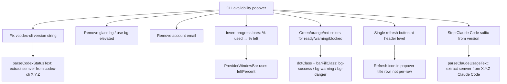
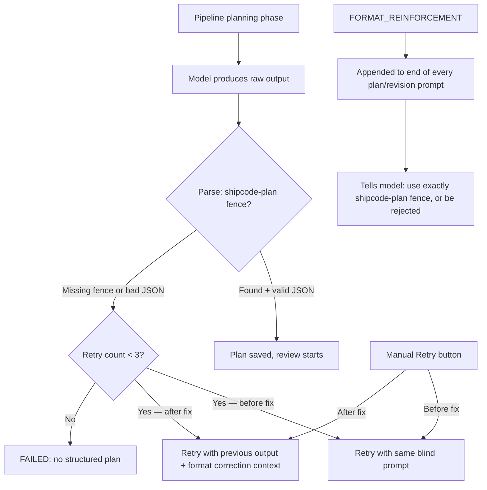
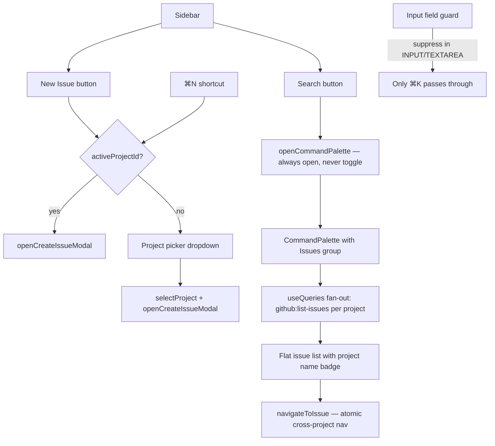

# 2026-04-18 Sessions

CLI availability popover polish: version string normalization, glass removal, email removal, progress bar inversion, green/orange/red status colors, refresh button at header level, alignment fix, and `(Claude Code)` suffix strip.

---

## Session 1: CLI Availability Popover Polish

**Status:** Complete

### System flow diagram



### Affected Components

| Layer | Components |
|-------|------------|
| Agents health check | `packages/agents/src/health-check.ts` |
| Agents tests | `packages/agents/src/health-check.test.ts` |
| Desktop renderer | `apps/desktop/src/renderer/components/Titlebar.tsx` |
| Desktop renderer | `apps/desktop/src/renderer/components/ProjectProviderWarningPopover.tsx` |
| Desktop tests | `apps/desktop/src/renderer/components/Titlebar.test.tsx` |

### What was done

- [x] Fixed `vcodex-cli 0.121.0` display bug — `codex --version` outputs `codex-cli X.Y.Z` (npm package name + version); extracted semver only in `parseCodexStatusText`
- [x] Fixed `v2.1.92 (Claude Code)` display — `claude --version` outputs `X.Y.Z (Claude Code)`; extracted semver only in `parseClaudeUsageText`
- [x] Removed glass bg (`bg-primary/98 backdrop-blur-sm shadow-2xl`) from CLI popover and project warning popover; replaced with `bg-elevated shadow-lg` to match dialogs/select/command palette
- [x] Removed account email row from `ProviderDetailRow`
- [x] Inverted progress bars: `usedPercent` → `leftPercent` (full bar = 100% allocation, drains to zero)
- [x] Updated label from `X% used` → `X% left`
- [x] Changed ready-state colors: dots and bars are now `bg-success` (green) when ready, `bg-warning` (orange) for warning, `bg-danger` (red) for blocked — removed codex-specific `bg-agent` teal
- [x] Added refresh button at CLI availability header level (single button, refreshes both CLIs) with `RefreshCw` / `Loader2 animate-spin` spinner
- [x] Fixed alignment: version `vX.Y.Z` stays right-aligned per row; refresh icon lives in popover header next to title
- [x] Updated tests: `% used` → `% left` assertions, email assertion flipped to `not.toBeInTheDocument()`
- [x] Added test coverage for codex and claude version normalization

### Key decisions

- **Decision:** Single refresh at header level, not per-row
  - **Context:** User asked if codex refresh should only check codex — considered per-provider refresh but only one IPC channel exists (`provider-usage:check` checks both)
  - **Rationale:** Single button is simpler; both CLIs refresh together matches the IPC contract

- **Decision:** Invert bar to show remaining allocation (% left), not consumption (% used)
  - **Context:** Bar starts full (100%) and should drain toward zero as quota is used
  - **Rationale:** More intuitive mental model — green full bar = lots of quota, shrinking bar = running low

- **Decision:** Use `bg-success` / `bg-warning` / `bg-danger` for all providers regardless of tone
  - **Context:** Previously codex ready = `bg-agent` (teal), claude ready = `bg-warning/80` (orange) — both wrong for a "ready/healthy" state
  - **Rationale:** Green = healthy is universal; warning/danger semantics apply to both providers equally

- **Decision:** Strip version suffix in the parser (health-check.ts), not the UI
  - **Context:** Could strip in the Titlebar render, but the raw version string is also in `CliProviderUsageStatus` used by other components
  - **Rationale:** Cleaner to normalize at source so all consumers get a clean semver

### Files changed

- `packages/agents/src/health-check.ts` — `parseCodexStatusText`: strip `codex-cli` prefix from version; `parseClaudeUsageText`: strip `(Claude Code)` suffix from version
- `packages/agents/src/health-check.test.ts` — added `strips binary name prefix` test for codex; added `strips parenthetical suffix` test for claude
- `apps/desktop/src/renderer/components/Titlebar.tsx`:
  - Added `Loader2`, `RefreshCw` imports; `refetch`/`isFetching` from provider usage query
  - `dotClass` + `barFillClass`: state-based colors only (removed tone-based ready colors)
  - `ProviderWindowBar`: uses `leftPercent`, label `% left`
  - `ProviderDetailRow`: removed `onRefresh`/`isRefreshing` props and per-row button; removed email row; version right-aligned with no button next to it
  - `ProviderStatusBadge`: accepts `onRefresh`/`isRefreshing`; refresh button in popover header
  - `PopoverContent`: `bg-elevated shadow-lg` (was `bg-primary/98 backdrop-blur-sm shadow-2xl`)
- `apps/desktop/src/renderer/components/ProjectProviderWarningPopover.tsx` — `bg-elevated shadow-lg`
- `apps/desktop/src/renderer/components/Titlebar.test.tsx` — `% used` → `% left` in assertions; `getByText(email)` → `queryByText(email) not.toBeInTheDocument()`

### Mistakes and fixes

- **Mistake:** Refresh button added per-row with both rows getting the same `onRefresh` callback — refreshed both CLIs regardless of which row was clicked
  - **Fix:** Moved single refresh button to the popover header; per-row buttons removed entirely

- **Mistake:** Version and refresh button both used `ml-auto` independently, misaligning them
  - **Fix:** Wrapped in a `ml-auto flex items-center gap-1` container (later removed when button moved to header)

- **Mistake:** `normalizedVersion` computed in both parsers but initially still returned raw `version` in the result object
  - **Fix:** Changed return value to use `normalizedVersion` in both `parseCodexStatusText` and `parseClaudeUsageText`

### Verification

- `bun run test --filter @shipcode/desktop` → 198 passed
- `bun run test --filter @shipcode/agents` → 303 passed (+1 new claude version test, +3 codex version tests)

### Next steps

- [ ] QA: verify CLI popover shows `v0.121.0` for Codex (not `vcodex-cli 0.121.0`)
- [ ] QA: verify Claude shows `v2.1.92` (not `v2.1.92 (Claude Code)`)
- [ ] QA: verify progress bars drain from full-green → orange → red as quota is consumed
- [ ] QA: verify single refresh button in header triggers spinner and updates both rows
- [ ] QA: verify popover background matches modal/dialog bg (no glass effect)

---

## Session 2 — CI Fixes + UI Layout Polish (PR #53)

### System Flow

```
PR #53 (develop → master) — CI failing
  → Fix all GitHub Actions test failures
  → UI layout: titles/pagination outside cards, costs column order
  → Dev: default dev = desktop only, no auto devtools
  → Terminal: remove redundant in-terminal toast
```

### Affected Components

- **CI / Tests**: `apps/desktop` (notification-service, health-check)
- **Frontend**: `OverviewView`, `InboxView`, `ActivityView`, `CostsView`, `SkillsView`, `TerminalDrawer`
- **Build/Dev**: `package.json` (root), `apps/desktop/src/main/index.ts`

---

### What Was Done

- [x] Fixed `notification-service.test.ts` — `listActive` not mocked, crashed on `.filter`. Seeded `[]` in `beforeEach`
- [x] Fixed `refreshBadge` test — darwin-only; skipped on Linux CI with `it.skipIf`
- [x] Removed auto-open DevTools on Electron startup
- [x] Scoped root `bun run dev` to desktop only; added `dev:all`
- [x] Reordered Costs table columns: Phase → Date → Task → Provider → Model → Tokens → Cost
- [x] Moved card titles + pagination outside Card borders across all views
- [x] Running Agents redesigned as individual flex cards (not single big list)
- [x] Removed Inbox table column headers (STATUS / TIME / NOTIFICATION / ACTIONS)
- [x] Added ActivityView pagination — 25 entries/page, grouped by day, fetch 500 total
- [x] Removed in-terminal `TerminalDrawerActionBanner` toast

### Key Decisions

| Decision | Rationale |
|----------|-----------|
| `it.skipIf(platform !== 'darwin')` for badge tests | `app.dock.setBadge` unavailable on Linux CI |
| `listActive: []` in `beforeEach` | `vi.clearAllMocks()` resets to `undefined`; `filter` on undefined crashes |
| `bun run dev` → desktop only | Web app caused `EADDRINUSE :3000` noise in terminal |
| Titles outside Card | Visual separation: title = nav context, not card content |
| Running agents as individual cards | Card-per-agent makes status + stop button clearer |
| Remove terminal banner | App-level notification bell covers same info; was duplicate |

### Files Changed

| File | Change |
|------|--------|
| `apps/desktop/src/main/notification-service.test.ts` | Seed `listActive: []`; skip badge on non-darwin |
| `apps/desktop/src/main/index.ts` | Remove `openDevTools()` |
| `package.json` (root) | `dev` → desktop only; `dev:all` added |
| `apps/desktop/src/renderer/components/CostsView.tsx` | Column reorder; titles/pagination outside cards; no page header |
| `apps/desktop/src/renderer/components/OverviewView.tsx` | Titles+pagination outside cards; running agents as cards |
| `apps/desktop/src/renderer/components/InboxView.tsx` | Remove page header + table column headers |
| `apps/desktop/src/renderer/components/ActivityView.tsx` | Remove page header; 25/page pagination |
| `apps/desktop/src/renderer/components/SkillsView.tsx` | Remove page header |
| `apps/desktop/src/renderer/components/TerminalDrawer.tsx` | Remove `TerminalDrawerActionBanner` |

### Mistakes & Fixes

| Mistake | Fix |
|---------|-----|
| Raw `<button>` in running agents card | Replaced with `Button` from `@shipcode/ui` |
| Stale TS diagnostic for `CardFooter` | Verified no actual usage; stale from pre-edit state |

### Next Steps

- [ ] Merge PR #53 once CI goes green
- [ ] Clean up orphaned `TerminalDrawerActionBanner` component + test
- [ ] Clean up unused `actionBanner`/`dismissActionBanner`/`handleActionBannerClick` from `useTerminalDrawer.ts`
- [ ] Verify `SkillsView` page header was fully removed

---

## Session 3 — Plan Parse Failure Visibility Fix

**Status:** Complete

### System Flow

```
Issue #48 "Add Gemini CLI provider" (GPT-5.4 / OpenRouter)
  → Planning phase runs, produces raw output
  → Server-side parse fails (structured = null)
  → Client-side re-parse also fails
  → UI: resolveRawPlanText(raw) === raw (OpenRouter plain text unchanged)
  → Condition resolved === fallbackRaw fires → hides output, shows generic error
```

**Two bugs fixed:**

1. **UI hides raw OpenRouter output** — `resolved === fallbackRaw` gate in `PlanHistoryTab.tsx` was always true for OpenRouter (plain text IS the output), hiding the model's actual response
2. **No diagnostic reason** — `resolveClientSidePlan` silently swallowed all errors, no info on whether failure was missing fence / bad JSON / Zod schema mismatch

### Affected Components

| Layer | File |
|-------|------|
| Renderer helpers | `apps/desktop/src/renderer/components/issue-detail/helpers.ts` |
| Renderer component | `apps/desktop/src/renderer/components/issue-detail/PlanHistoryTab.tsx` |
| Tests | `apps/desktop/src/renderer/components/issue-detail/helpers.test.ts` |

### What Was Done

- [x] Added `diagnosePlanParseFailure(rawOutput: string): string` to `helpers.ts` — returns specific reason: no fence / invalid JSON / schema validation failed with first Zod issue path+message
- [x] Added `isZodError()` duck-type guard (no direct `zod` import — not a direct dep of desktop app)
- [x] Replaced `resolved === fallbackRaw` gate in `PlanHistoryTab.tsx` with `displayText = resolved.trim() || fallbackRaw.trim()` — always shows non-empty output
- [x] All three providers now show: diagnostic reason + raw output in `<pre>` (was: OpenRouter showed nothing; Claude/Codex showed raw text but no reason)
- [x] Added 6 tests for `diagnosePlanParseFailure` covering: empty input, no fence, Claude NDJSON without fence, malformed JSON, wrong enum, missing required field
- [x] 204/204 tests passing (+6 new)

### Key Decisions

- **Decision:** Duck-type ZodError instead of importing from `zod`
  - **Rationale:** `zod` is not a direct dependency of `apps/desktop`; importing it would add an undeclared dep. Duck typing `'issues' in e && Array.isArray(...)` is sufficient.

- **Decision:** Show raw output whenever non-empty, not gated by transformation
  - **Rationale:** The original `resolved !== fallbackRaw` gate was designed to detect "meaningful extraction" vs "no extraction". For OpenRouter plain text this is always false. Simpler to just show anything non-empty.

### Files Changed

- `apps/desktop/src/renderer/components/issue-detail/helpers.ts` — added `ZodIssue` type, `isZodError()` guard, `diagnosePlanParseFailure()` export
- `apps/desktop/src/renderer/components/issue-detail/PlanHistoryTab.tsx` — updated import; replaced fallback render block
- `apps/desktop/src/renderer/components/issue-detail/helpers.test.ts` — added `VALID_PLAN_JSON` fixture, `wrapInFence()` helper, 6 new tests

### Mistakes and Fixes

- **Mistake:** Initially imported `ZodError` from `zod` directly
  - **Fix:** Discovered `zod` is not a direct dep of desktop app (TS error); switched to duck-type guard

### Verification

- `bun run test --filter @shipcode/desktop` → 204 passed

### Next Steps

- [ ] QA: verify issue #48 plan history now shows raw GPT-5.4 output and diagnostic reason when expanded
- [ ] Investigate why GPT-5.4 failed to produce a valid plan (use the now-visible raw output to diagnose)

---

## Session 4 — Instant Fix + Execution Concurrency Gate + Per-Issue Reasoning Effort Overrides

**Status:** Complete (in-progress at session documentation time)

### System Flow

```
Three parallel tracks shipped:

1. Instant Fix — direct CLI run without pipeline
   → New 'instant' ThreadKind stored in threads table
   → Hidden __instant__ project in projects table (not shown in sidebar)
   → IPC: instant:run / instant:cancel / instant:list / instant:cleanup
   → InstantView with multi-pane grid (1/2/4 panes, H/V split)
   → InstantFixModal (not yet visible in diff — referenced from App.tsx)
   → Keyboard shortcut ⇧⌘I + Command Palette entry

2. Execution Concurrency Gate (maxConcurrentExecutions)
   → New AppSettings field maxConcurrentExecutions (default 1)
   → EXECUTION_PHASES constant: executing/testing/verifying/shipping
   → Pipeline.listActiveInPhases() to count active execution-phase threads
   → startExecution() checks gate; if full → emits awaiting_approval (stays queued)
   → onExecutionSlotFreed callback in pipeline-bridge: fires when pipeline reaches
     completed/failed/idle; promotes next awaiting_approval+approved thread
   → getAwaitingWithApprovedPlan() DB query finds FIFO candidate
   → Startup drain loop for both planning and execution slots
   → PipelineSettingsSection: new "Max concurrent executions" input (1–10)

3. Per-Issue Reasoning Effort Overrides
   → DB schema v23: four new columns on github_issue_cache
     (planner/reviewer/executor/verifier_reasoning_effort_override)
   → resolvePhaseReasoningEffortForIssue() — issue override → project override → global setting
   → Bug fix: resolvePhaseReasoningEffort used truthy check (skipped 'none'), fixed to != null
   → IPC: github:set-phase-reasoning-effort-override / github:clear-phase-reasoning-effort-override
   → PipelineTab: per-phase effort <Select> with inherit / explicit values
   → Amber warning badge when configured effort maps to a different effective effort
```

### Affected Components

| Layer | File |
|-------|------|
| DB schema | `packages/db/src/schema.ts` (v23: per-issue effort cols; v24: threads.kind + projects.hidden) |
| DB queries | `packages/db/src/queries/github-issues.ts` — `updatePhaseReasoningEffortOverride` |
| DB queries | `packages/db/src/queries/threads.ts` — `create(kind)`, `list()` pipeline-only filter, `listInstant()`, `deleteOlderThan()`, `getAwaitingWithApprovedPlan()` |
| DB queries | `packages/db/src/queries/projects.ts` — `getOrCreateInstantProject()`, `listVisible()` hides `hidden=1` |
| DB queries | `packages/db/src/queries/settings.ts` — `maxConcurrentExecutions` + `instantDefaultPanes` |
| Shared types | `packages/shared/src/types.ts` — `ThreadKind`, `InstantFixScope`, `Thread.kind`, `Project.hidden`, `AppSettings` fields |
| Shared constants | `packages/shared/src/constants.ts` — `DEFAULT_SETTINGS` + `EXECUTION_PHASES` |
| Shared IPC | `packages/shared/src/ipc-channels.ts` — reasoning effort override channels + instant:* channels |
| Model resolution | `packages/shared/src/model-resolution.ts` — `resolvePhaseReasoningEffortForIssue()`, issue override key on descriptors, truthy→null bug fix |
| Model resolution tests | `packages/shared/src/model-resolution.test.ts` — issue-level + project-level 'none' override tests |
| Pipeline | `packages/pipeline/src/pipeline/context.ts` — `listActiveInPhases()` |
| Pipeline | `packages/pipeline/src/pipeline/shared.ts` — `listActiveInPhases` on `PipelineContextHelpers` |
| Pipeline | `packages/pipeline/src/pipeline/execution-phases.ts` — concurrency gate in `startExecution` |
| Pipeline | `packages/pipeline/src/pipeline.ts` — expose `listActiveInPhases` on `Pipeline` |
| Pipeline | `packages/pipeline/src/types.ts` — `listActiveInPhases` on `Pipeline` interface |
| Pipeline tests | `packages/pipeline/src/pipeline.test.ts` — `listActiveInPhases` + execution gate tests |
| Main IPC | `apps/desktop/src/main/ipc/register-github-handlers.ts` — two new reasoning effort handlers |
| Main IPC | `apps/desktop/src/main/ipc/register-instant-handlers.ts` (new) — `instant:run/cancel/list/cleanup` |
| Main IPC | `apps/desktop/src/main/ipc.ts` — register instant handlers |
| Main process | `apps/desktop/src/main/index.ts` — `onExecutionSlotFreed` callback + startup drain |
| Main process | `apps/desktop/src/main/pipeline-bridge.ts` — fires `onExecutionSlotFreed` on terminal phases |
| Renderer store | `apps/desktop/src/renderer/stores/app-store.ts` — `instant` ViewMode + instant state/actions |
| Renderer | `apps/desktop/src/renderer/App.tsx` — `InstantView` + `InstantFixModal` routing |
| Renderer | `apps/desktop/src/renderer/components/InstantView.tsx` (new) — multi-pane grid view |
| Renderer | `apps/desktop/src/renderer/components/instant-terminal/InstantTerminalPane.tsx` (new) |
| Renderer | `apps/desktop/src/renderer/components/instant-terminal/useInstantTerminalPane.ts` (new) |
| Renderer | `apps/desktop/src/renderer/components/ProjectSidebar.tsx` — Instant nav entry |
| Renderer | `apps/desktop/src/renderer/components/CommandPalette.tsx` — Quick Actions group with Instant Fix |
| Renderer | `apps/desktop/src/renderer/data/shortcuts.ts` — `instant-fix` shortcut ⇧⌘I |
| Renderer | `apps/desktop/src/renderer/hooks/useGlobalKeyboard.ts` — wire `instant-fix` shortcut |
| Renderer | `apps/desktop/src/renderer/components/IssueDetail.tsx` — effort select values + handlers |
| Renderer | `apps/desktop/src/renderer/components/issue-detail/PipelineTab.tsx` — per-phase effort selector |
| Renderer | `apps/desktop/src/renderer/components/settings-panel/PipelineSettingsSection.tsx` — `maxConcurrentExecutions` input |
| UI package | `packages/ui/src/index.ts` — new icon exports (`Zap`, `Plus` etc.) |

### What Was Done

- [x] **DB schema v23** — added `planner/reviewer/executor/verifier_reasoning_effort_override` columns to `github_issue_cache`
- [x] **DB schema v24** — added `threads.kind TEXT DEFAULT 'pipeline'` and `projects.hidden INTEGER DEFAULT 0`
- [x] `ThreadKind = 'pipeline' | 'instant'` + `InstantFixScope = 'user' | 'project' | 'custom'` types
- [x] `Project.hidden` field; `listVisible()` excludes `hidden=1` rows
- [x] Hidden `__instant__` project created on startup via `getOrCreateInstantProject()` — stores instant fix threads with no sidebar presence
- [x] `threads.list()` scoped to `kind = 'pipeline'` so existing pipeline queries unaffected
- [x] `threads.create()` accepts optional `kind` param (default `'pipeline'`)
- [x] `threads.listInstant()` + `threads.deleteOlderThan(kind, days)` for instant lifecycle management
- [x] `threads.getAwaitingWithApprovedPlan()` — FIFO query for execution queue promotion
- [x] `registerInstantHandlers` — full `instant:run/cancel/list/cleanup` IPC handler; startup cleanup of 7-day-old instant threads; scope-based cwd/projectId resolution; read-only tool set for `user` scope
- [x] `resolvePhaseReasoningEffortForIssue()` — new function with issue → project → global cascade
- [x] Bug fix: `resolvePhaseReasoningEffort` used `if (projectOverride)` which skipped `'none'`; fixed to `if (projectOverride != null)`
- [x] `resolveEffectivePhaseReasoningEffortForIssue()` now uses issue-level overrides (was using project-level only)
- [x] `issueReasoningEffortOverrideKey` added to each `PHASE_DESCRIPTORS` entry
- [x] New IPC channels `github:set-phase-reasoning-effort-override` + `github:clear-phase-reasoning-effort-override`
- [x] `PipelineTab` per-phase effort `<Select>` — inherit / explicit efforts; amber warning when effort maps to a different effective effort (e.g. 'xhigh' → 'high' for a model that doesn't support xhigh)
- [x] `AppSettings.maxConcurrentExecutions` (default 1) + `instantDefaultPanes` (default 1)
- [x] `EXECUTION_PHASES` constant exported from `@shipcode/shared`
- [x] `Pipeline.listActiveInPhases(phases)` — filter active pipelines by current thread status phase set
- [x] Execution concurrency gate in `startExecution`: checks `listActiveInPhases(EXECUTION_PHASES).length >= maxConcurrentExecutions`; if full → emits `awaiting_approval` and returns (slot queued)
- [x] `onExecutionSlotFreed` callback wired through `createElectronEmitter` → fires on `completed/failed/idle` pipeline events → promotes next FIFO `awaiting_approval+approved` thread
- [x] Startup drain loop: runs both `onPipelineTerminal` (planning slots) and `onExecutionSlotFreed` (execution slots) to pick up pre-restart queued threads
- [x] `PipelineSettingsSection` — new "Max concurrent executions" row (1–10 numeric input)
- [x] `InstantView` — multi-pane grid (empty state + 1/2/4 pane layouts, H/V split directions)
- [x] `InstantFixModal` referenced from `App.tsx` (modal for prompt entry + scope/CLI selection)
- [x] `instant` ViewMode added to `app-store`; `openInstant()` action; `instantPaneThreadIds`, `instantSplitDirection` state; add/remove/set actions
- [x] Sidebar "Instant" nav entry with `Zap` icon
- [x] Command Palette "Quick Actions" group with "Instant Fix..." entry
- [x] Keyboard shortcut `⇧⌘I` wired through `shortcuts.ts` + `useGlobalKeyboard`

### Key Decisions

- **Decision:** Instant fix threads stored in a hidden `__instant__` project rather than null projectId
  - **Rationale:** DB foreign key + existing queries assume a valid project. Hidden project keeps the schema clean without a nullable FK.

- **Decision:** `user` scope in instant:run maps to `$HOME` cwd with read-only tools (`Read,Glob,Grep` only)
  - **Rationale:** Writing to home dir is dangerous for claude; codex gets `--sandbox read-only`. Project scope gets full edit access.

- **Decision:** Execution gate returns to `awaiting_approval` (not a new status) when slot is full
  - **Rationale:** `awaiting_approval` already means "approved, not yet running". No new state machine state needed. The `getAwaitingWithApprovedPlan()` query finds only those with an approved plan to distinguish them from user-unapproved threads.

- **Decision:** `resolvePhaseReasoningEffort` bug fix: `if (projectOverride)` → `if (projectOverride != null)`
  - **Context:** `'none'` is a falsy string in JS; the old guard silently ignored `'none'` project-level overrides
  - **Rationale:** `'none'` is a valid explicit override that must win over the global default

### Mistakes and Fixes

- **Mistake:** `resolvePhaseReasoningEffort` used truthy check `if (projectOverride)` — skipped `'none'` as a valid override value
  - **Fix:** Changed to `if (projectOverride != null)` and added regression test

### Files Changed

- `packages/db/src/schema.ts` — v23 + v24 migrations
- `packages/db/src/queries/github-issues.ts` — effort override columns + `updatePhaseReasoningEffortOverride`
- `packages/db/src/queries/threads.ts` — `kind` support throughout, `listInstant`, `deleteOlderThan`, `getAwaitingWithApprovedPlan`
- `packages/db/src/queries/projects.ts` — `hidden` field, `listVisible` filter, `getOrCreateInstantProject`
- `packages/db/src/queries/settings.ts` — `maxConcurrentExecutions` + `instantDefaultPanes` + duplicate `validateBranchFormat` call removed
- `packages/db/src/test-helpers.ts` — test fixture updates
- `packages/shared/src/types.ts` — `ThreadKind`, `InstantFixScope`, `Thread.kind`, `Project.hidden`, `AppSettings` fields
- `packages/shared/src/constants.ts` — `DEFAULT_SETTINGS` extensions + `EXECUTION_PHASES`
- `packages/shared/src/ipc-channels.ts` — new channels for reasoning effort overrides + instant
- `packages/shared/src/model-resolution.ts` — `resolvePhaseReasoningEffortForIssue`, descriptor keys, null-safe fix
- `packages/shared/src/model-resolution.test.ts` — 2 new override tests
- `packages/pipeline/src/pipeline/context.ts` — `listActiveInPhases`
- `packages/pipeline/src/pipeline/shared.ts` — interface extension
- `packages/pipeline/src/pipeline/execution-phases.ts` — concurrency gate
- `packages/pipeline/src/pipeline.ts` — export `listActiveInPhases`
- `packages/pipeline/src/types.ts` — interface extension
- `packages/pipeline/src/pipeline.test.ts` — `listActiveInPhases` + execution gate tests + fixture updates
- `packages/pipeline/src/pipeline.github-issue.smoke.test.ts` — fixture updates
- `apps/desktop/src/main/ipc/register-github-handlers.ts` — 2 new reasoning effort handlers
- `apps/desktop/src/main/ipc/register-instant-handlers.ts` (new)
- `apps/desktop/src/main/ipc.ts` — register instant handlers
- `apps/desktop/src/main/index.ts` — `onExecutionSlotFreed` + startup drain
- `apps/desktop/src/main/pipeline-bridge.ts` — fire `onExecutionSlotFreed` on terminal phases
- `apps/desktop/src/renderer/stores/app-store.ts` — instant view state
- `apps/desktop/src/renderer/App.tsx` — `InstantView` + `InstantFixModal`
- `apps/desktop/src/renderer/components/InstantView.tsx` (new)
- `apps/desktop/src/renderer/components/instant-terminal/InstantTerminalPane.tsx` (new)
- `apps/desktop/src/renderer/components/instant-terminal/useInstantTerminalPane.ts` (new)
- `apps/desktop/src/renderer/components/ProjectSidebar.tsx` — Instant nav
- `apps/desktop/src/renderer/components/CommandPalette.tsx` — Quick Actions group
- `apps/desktop/src/renderer/data/shortcuts.ts` — `instant-fix` shortcut
- `apps/desktop/src/renderer/hooks/useGlobalKeyboard.ts` — shortcut wiring
- `apps/desktop/src/renderer/components/IssueDetail.tsx` — effort select values + handlers
- `apps/desktop/src/renderer/components/issue-detail/PipelineTab.tsx` — per-phase effort selector
- `apps/desktop/src/renderer/components/settings-panel/PipelineSettingsSection.tsx` — `maxConcurrentExecutions` input
- `packages/ui/src/index.ts` — icon exports

### Next Steps

- [ ] QA: verify ⇧⌘I opens Instant Fix modal
- [ ] QA: verify instant run spawns CLI in correct cwd with correct tools
- [ ] QA: verify user-scope instant uses $HOME + read-only tools
- [ ] QA: verify execution gate holds second pipeline at awaiting_approval until first completes
- [ ] QA: verify per-issue reasoning effort override is saved and respected by pipeline
- [ ] QA: verify 'none' project-level effort override correctly suppresses thinking (regression: was ignored before fix)
- [ ] QA: `maxConcurrentExecutions` setting visible in Settings → Pipeline section

---

## Session 5 — PR Review Triage + InstantFixModal UX + Rename

**Status:** Complete

### System Flow

```
PR reviews (#53–#58, Codex bot) triaged
  → 7 unique comments → 4 real bugs, 2 already fixed, 1 intentional
  → 4 fixes applied: regex, validator, commit error, retry reset

InstantFixModal UX overhaul
  → Removed scope dropdown (always project-scoped)
  → Textarea = dropzone (images inline with thumbnails + X)
  → Removed labels from CLI/Project dropdowns
  → Fixed storedPath → stagedPath TS error

Rename: "New PRD" → "New Issue" (kanban toolbar + command palette)
```

### Affected Components

| Layer | File |
|-------|------|
| Git package | `packages/git/src/worktree.ts` |
| DB queries | `packages/db/src/queries/settings.ts` |
| Pipeline | `packages/pipeline/src/pipeline/execution-phases.ts` |
| Renderer | `apps/desktop/src/renderer/components/InstantFixModal.tsx` |
| Renderer | `apps/desktop/src/renderer/components/CommandPalette.tsx` |
| UI package | `packages/ui/src/kanban-board/BoardToolbar.tsx` |

### What Was Done

- [x] Triaged 11 PR review comments across PRs #53–#58 (7 unique after dedup)
- [x] **Fix:** `SHIPCODE_BRANCH_RE` regex — removed trailing `-` requirement so `ship/123` (slugless) matches
- [x] **Fix:** `validateBranchFormat` — added `sample.startsWith('/')` rejection for leading-slash formats
- [x] **Fix:** Pre-verification `git commit` failure — replaced empty `catch {}` with error surfacing + pipeline fail
- [x] **Fix:** `testRetries` / `testOutput` reset to 0/null after successful test pass before `startVerification`
- [x] **Skip:** `canApprove` gated on `rawOutput` — intentional, `pipeline:approve` handler does server-side `tryParsePlan`
- [x] **Skip:** `failingPhaseOutput` not rendered — already fixed in `IssueDetailActions`
- [x] **Skip:** Archived projects in scheduler — `getNextQueued()` SQL already has `AND archived_at IS NULL`
- [x] Removed scope dropdown from InstantFixModal (always project-scoped)
- [x] Removed custom system prompt section and user-scope read-only warning
- [x] Made textarea the image dropzone — thumbnails appear inline with X to delete
- [x] Removed "Attach images" button, labels on CLI/Project dropdowns
- [x] Fixed `storedPath` → `stagedPath` TS error
- [x] Renamed "New PRD" → "New Issue" in kanban toolbar + command palette

### Key Decisions

- **Decision:** Skip `canApprove` rawOutput gating (PR #57)
  - **Rationale:** Intentional design — `pipeline:approve` handler at line 118 does `tryParsePlan(rawOutput)` as server-side fallback. Test at line 468 explicitly documents this.

- **Decision:** Remove scope from InstantFixModal entirely
  - **Context:** User feedback: "confusing AF, why is it not scoped with the project?"
  - **Rationale:** Project scope gives full access anyway; user/custom scopes added complexity without clear value at this stage

- **Decision:** Surface commit failures in verification instead of swallowing
  - **Context:** Original code had `catch { // diff check below will catch it }` but diff uses `forkPoint..HEAD` which ignores uncommitted changes
  - **Rationale:** A failed commit means the diff will falsely report "no changes" — better to fail explicitly

### Files Changed

- `packages/git/src/worktree.ts` — `SHIPCODE_BRANCH_RE`: `/ship\/\d+-/` → `/ship\/\d+/`
- `packages/db/src/queries/settings.ts` — `validateBranchFormat`: added `sample.startsWith('/')` check
- `packages/pipeline/src/pipeline/execution-phases.ts` — replaced empty catch with error surfacing; added `testRetries=0` + `testOutput=null` before `startVerification`
- `apps/desktop/src/renderer/components/InstantFixModal.tsx` — removed scope/custom system prompt/user warning, textarea=dropzone, inline thumbnails, removed labels, fixed `stagedPath`
- `apps/desktop/src/renderer/components/CommandPalette.tsx` — "New PRD..." → "New Issue..."
- `packages/ui/src/kanban-board/BoardToolbar.tsx` — "+ New PRD" → "+ New Issue"

### Mistakes and Fixes

- **Mistake:** Used `storedPath` on `StagedPrdAttachment` (doesn't exist)
  - **Fix:** Changed to `stagedPath` (correct property name)

### Verification

- `bun run test --filter @shipcode/git` → 8 passed
- `bun run test --filter @shipcode/db` → 192 passed
- `bun run test --filter @shipcode/pipeline` → 75 passed
- `bun run test --filter @shipcode/desktop` → 203 passed

### Next Steps

- [ ] Commit all changes on `develop`
- [ ] QA: verify InstantFixModal — drop image on textarea, see thumbnail, X to remove
- [ ] QA: verify kanban shows "+ New Issue" not "+ New PRD"
- [ ] QA: verify branch format `/{id}` is rejected in settings
- [ ] QA: verify pipeline fails explicitly when pre-verification commit fails

---

## Session 5 — Instant Fix: Test Fixes + Verification

**Status:** Complete

### What Was Done

- [x] Removed unused `Trash2` import from `InstantFixModal.tsx`
- [x] Added `hidden: false` to all Project mock objects across 13 test files (15 occurrences) — required after `Project.hidden` became a required field
- [x] Added `kind: 'pipeline' as const` to all Thread mock objects across 8 test files — required after `Thread.kind` became a required field
- [x] Added `migrateV24` to `packages/db/src/test-helpers.ts` — DB tests were failing because in-memory test DBs didn't run the v24 migration (adding `kind` and `hidden` columns)
- [x] Added `enabled: instantFixModalOpen` to `useQuery` in `InstantFixModal.tsx` — prevented query from firing when modal is closed, which caused uncaught exceptions in App.test.tsx (test env doesn't mock `project:list-visible`)

### Verification

All tests green:

| Package | Tests | Status |
|---------|-------|--------|
| `@shipcode/shared` | 172 | Pass |
| `@shipcode/db` | 192 | Pass |
| `@shipcode/pipeline` | 75 | Pass |
| `@shipcode/ui` | 35 | Pass |
| `@shipcode/desktop` | 204 | Pass |

### Files Changed

- `apps/desktop/src/renderer/components/InstantFixModal.tsx` — removed `Trash2` import; added `enabled: instantFixModalOpen` to useQuery
- `packages/db/src/test-helpers.ts` — added `migrateV24` import and call
- 13 test files — added `hidden: false` to Project mocks
- 8 test files — added `kind: 'pipeline' as const` to Thread mocks

### Mistakes and Fixes

- **Mistake:** `migrateV24` was missing from `test-helpers.ts` — test DB schema didn't match production migration sequence
  - **Fix:** Added `migrateV24(db)` to `createTestDb()` alongside all prior migrations

- **Mistake:** `InstantFixModal` query fired on mount even when modal was closed — caused `window.shipcode.invoke` to throw in test environments without full IPC mock
  - **Fix:** Added `enabled: instantFixModalOpen` to the useQuery config

---

## Session 6 — Plan Parse Failure: Format Reinforcement + Retry Resume

**Status:** Complete

### System Flow



### Problem

GPT-5.4 via Codex CLI was failing to produce `\`\`\`shipcode-plan` fenced JSON. All 9 plan versions across 3 runs hit the same parsing failure. On retry, the pipeline started from scratch with the exact same prompt — no learning from previous failures.

### What Was Done

- [x] **Format reinforcement** — Added `FORMAT_REINFORCEMENT` constant appended to the **end** of every plan and revision prompt. Explicitly requires `\`\`\`shipcode-plan` fence and warns responses without it will be rejected. End-of-prompt placement is more reliably followed by models.
- [x] **Previous attempt context** — Added `buildPreviousAttemptContext()` that wraps a truncated snippet (last 2000 chars) of previous failed output in `<previous_attempt_failed>` tags with format-correction instructions
- [x] **Auto-retry carries context** — On automatic retry (exit code != 0, no plan parsed), `context.previousPlanRawOutput` is set to `response.rawOutput` before the recursive call
- [x] **Manual retry carries context** — On `pipeline:retry` IPC handler, both the `getRetryAction === 'plan'` branch and the fallback branch capture `latestPlan.rawOutput` onto context
- [x] **PipelineContext extended** — Added `previousPlanRawOutput: string | null` field, initialized in `ensureContext` and `rehydrateContext`
- [x] Updated snapshot tests for changed prompt output
- [x] All tests green: agents 303, pipeline 75, desktop 203, shared 172, db 192, ui 35

### Key Decisions

- **Decision:** Append format reinforcement at end of prompt, not beginning
  - **Rationale:** Models (especially GPT-5.x) follow end-of-prompt instructions more reliably than mid-prompt ones. The structured_output_contract section in the skill template is mid-prompt — the reinforcement at the end acts as a "last word wins" safeguard.

- **Decision:** Truncate previous output to last 2000 chars
  - **Rationale:** Full raw output (especially Codex NDJSON) can be huge. The model's plan attempt is typically at the end. 2000 chars is enough to show the format mistake without blowing up context.

- **Decision:** Consume `previousPlanRawOutput` after use (set to null)
  - **Rationale:** The context is only relevant for the immediate next attempt. If that also fails and auto-retries, it captures the new failure's output instead.

### Files Changed

| File | Change |
|------|--------|
| `packages/agents/src/prompts/plan-prompt.ts` | Added `FORMAT_REINFORCEMENT` constant, `buildPreviousAttemptContext()` export, appended reinforcement to `buildPlanPrompt` and `buildRevisionPrompt` |
| `packages/agents/src/index.ts` | Export `buildPreviousAttemptContext` |
| `packages/pipeline/src/types.ts` | Added `previousPlanRawOutput: string \| null` to `PipelineContext` |
| `packages/pipeline/src/pipeline/context.ts` | Initialize `previousPlanRawOutput` in `ensureContext` and `rehydrateContext` |
| `packages/pipeline/src/pipeline/planning-phases.ts` | Import `buildPreviousAttemptContext`, consume+append in `startPlanGeneration`, set on auto-retry |
| `apps/desktop/src/main/ipc/register-pipeline-handlers.ts` | Set `previousPlanRawOutput` on manual retry (both plan branches) |
| `packages/agents/src/prompts/__snapshots__/plan-prompt.test.ts.snap` | Updated snapshots for new prompt suffix |

### Mistakes and Fixes

_None — clean implementation._

### Verification

| Package | Tests | Status |
|---------|-------|--------|
| `@shipcode/agents` | 303 | Pass (snapshots updated) |
| `@shipcode/pipeline` | 75 | Pass |
| `@shipcode/desktop` | 203 | Pass |
| `@shipcode/shared` | 172 | Pass |
| `@shipcode/db` | 192 | Pass |
| `@shipcode/ui` | 35 | Pass |

### Next Steps

- [ ] QA: Re-run pipeline on status.shipshit.dev issue #1 with GPT-5.4 planner — verify `shipcode-plan` fence is now produced
- [ ] QA: Verify retry shows format-correction context in terminal output
- [ ] QA: Verify "Rerun setup commands before verification" checkbox is checked in project setup

---

## Session 8 — Sidebar Action Buttons + Cross-Project Search + TS Fixture Fixes

**Status:** Complete

### System Flow



### Affected Components

| Layer | File |
|-------|------|
| UI package | `packages/ui/src/index.ts` |
| Shortcuts | `apps/desktop/src/renderer/data/shortcuts.ts` |
| Store | `apps/desktop/src/renderer/stores/app-store.ts` |
| Keyboard handler | `apps/desktop/src/renderer/hooks/useGlobalKeyboard.ts` |
| Sidebar | `apps/desktop/src/renderer/components/ProjectSidebar.tsx` |
| Command palette | `apps/desktop/src/renderer/components/CommandPalette.tsx` |
| Test fixtures (7 files) | `notification-service.test.ts`, `SettingsLeafSections.test.tsx`, `IssueDetail.test.tsx`, `TerminalDrawerHeader.test.tsx`, `TerminalDrawer.test.tsx`, `useIpc.test.tsx`, `app-store.test.ts` |

### What Was Done

**Feature: Sidebar Action Buttons + Cross-Project Search**

- [x] Exported `FilePlus` and `Search` icons from `@shipcode/ui`
- [x] Added `'new-issue'` shortcut (`⌘N`, Navigation category) to `shortcuts.ts`
- [x] Added `navigateToIssue(projectId, issue)` — atomic cross-project navigation action (single Zustand `set` call, no flash render between project switch and issue select)
- [x] Added `openCommandPalette()` — explicit open action (not toggle) for Search button
- [x] Wired `⌘N` shortcut in `useGlobalKeyboard`, guarded by `activeProjectId`
- [x] Added input field guard to suppress ALL shortcuts (except `⌘K`) when typing in INPUT/TEXTAREA/contentEditable
- [x] Added "New Issue" + "Search" buttons at top of `ProjectSidebar` — "New Issue" shows project picker dropdown when no project selected
- [x] Enhanced `CommandPalette` with cross-project issue search via `useQueries` fan-out (gated by `enabled: commandPaletteOpen`)
- [x] Issues group shows `#number title [project]` with unique `value` per item (prevents cmdk dedup)
- [x] Added `⌘N` glyph to "New Issue..." palette item
- [x] Added Skills + Instant to "Go to" group in palette

**Fix: Pre-existing TS test fixture errors (8 errors across 7 files)**

- [x] Added `kind: 'pipeline'` to `makeThread()` in `notification-service.test.ts`
- [x] Added `hidden: false` to `makeProject()` in `SettingsLeafSections.test.tsx`
- [x] Added 4 `*ReasoningEffortOverride: null` fields to `makeIssue()` in 6 test files

### Key Decisions

- **Decision:** Atomic `navigateToIssue` store action instead of `selectProject` + `selectIssue` sequence
  - **Context:** Adversarial review found `selectProject` clears `activeIssue` then `selectIssue` sets it — two Zustand `set` calls with a render gap that flashes empty state
  - **Rationale:** Single `set` call eliminates the intermediate render where IssueDetail unmounts

- **Decision:** `openCommandPalette()` (explicit open) instead of `toggleCommandPalette()` for Search button
  - **Context:** Toggle could close the palette if user clicks Search while palette is already open
  - **Rationale:** A "Search" button should always open, never close

- **Decision:** Input field guard in `useGlobalKeyboard` suppresses all shortcuts except `⌘K` when typing
  - **Context:** `⌘N` would fire while typing in CreateIssueModal textarea; existing shortcuts had same latent bug
  - **Rationale:** `⌘K` is universally expected to work from anywhere; all other shortcuts should yield to text input

- **Decision:** `useQueries` fan-out gated by `enabled: commandPaletteOpen`
  - **Context:** `CommandPalette` is always mounted in the DOM; ungated queries would fire N IPC calls every staleTime cycle
  - **Rationale:** Only fetch when palette is visible — SQLite reads are fast, no need for background polling

- **Decision:** cmdk `value` includes project name + issue number + title
  - **Context:** Two projects could have issue `#1` with similar titles; cmdk deduplicates by normalized `value`
  - **Rationale:** Including project name in `value` ensures uniqueness while still being searchable

### Files Changed

| File | Change |
|------|--------|
| `packages/ui/src/index.ts` | Added `FilePlus`, `Search` icon exports |
| `apps/desktop/src/renderer/data/shortcuts.ts` | Added `'new-issue'` to `ShortcutId` union + `SHORTCUTS` array |
| `apps/desktop/src/renderer/stores/app-store.ts` | Added `navigateToIssue`, `openCommandPalette` to interface + implementation |
| `apps/desktop/src/renderer/hooks/useGlobalKeyboard.ts` | Wired `new-issue` action; added input field guard; added `activeProjectId` to deps |
| `apps/desktop/src/renderer/components/ProjectSidebar.tsx` | Two action buttons at top (New Issue with project picker + Search) |
| `apps/desktop/src/renderer/components/CommandPalette.tsx` | Cross-project issue search group; `⌘N` glyph; Skills + Instant in Go to |
| `apps/desktop/src/main/notification-service.test.ts` | Added `kind: 'pipeline'` to `makeThread()` |
| `apps/desktop/src/renderer/components/settings-panel/SettingsLeafSections.test.tsx` | Added `hidden: false` to `makeProject()`; effort overrides to `makeIssue()` |
| `apps/desktop/src/renderer/components/IssueDetail.test.tsx` | Added effort overrides to `makeIssue()` |
| `apps/desktop/src/renderer/components/terminal-drawer/TerminalDrawerHeader.test.tsx` | Added effort overrides to `makeIssue()` |
| `apps/desktop/src/renderer/components/TerminalDrawer.test.tsx` | Added effort overrides to `makeIssue()` |
| `apps/desktop/src/renderer/hooks/useIpc.test.tsx` | Added effort overrides to `makeIssue()` |
| `apps/desktop/src/renderer/stores/app-store.test.ts` | Added effort overrides to `makeIssue()` |

### Mistakes and Fixes

- None — adversarial review was run before implementation, catching 16 issues (3 critical, 4 high, 6 medium, 3 low) that were addressed in the plan before any code was written.

### Verification

- `npx tsc --noEmit -p apps/desktop/tsconfig.json` — **0 errors** (was 8)
- `npx tsc --noEmit -p packages/pipeline/tsconfig.json` — **0 errors**
- `bun run test --filter @shipcode/desktop` — **203/203 passed**
- `bun run test --filter @shipcode/ui` — **35/35 passed**
- `bun run test --filter @shipcode/shared` — **172/172 passed**

### Next Steps

- [ ] QA: `⌘K` opens palette with Issues group showing all synced issues across projects
- [ ] QA: typing in palette filters issues by title/number
- [ ] QA: clicking an issue from a different project navigates atomically (no flash)
- [ ] QA: `⌘N` with project selected opens CreateIssueModal
- [ ] QA: `⌘N` while typing in a textarea does NOT trigger
- [ ] QA: sidebar "New Issue" button without project shows project picker dropdown
- [ ] QA: sidebar "Search" button always opens (never closes) command palette
- [ ] QA: Skills and Instant appear in "Go to" palette group
