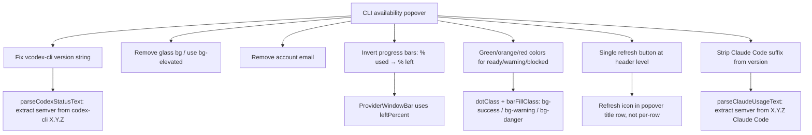

# 2026-04-18 Sessions

CLI availability popover polish: version string normalization, glass removal, email removal, progress bar inversion, green/orange/red status colors, refresh button at header level, alignment fix, and `(Claude Code)` suffix strip.

---

## Session 1: CLI Availability Popover Polish

**Status:** Complete

### System flow diagram



### Affected Components

| Layer | Components |
|-------|------------|
| Agents health check | `packages/agents/src/health-check.ts` |
| Agents tests | `packages/agents/src/health-check.test.ts` |
| Desktop renderer | `apps/desktop/src/renderer/components/Titlebar.tsx` |
| Desktop renderer | `apps/desktop/src/renderer/components/ProjectProviderWarningPopover.tsx` |
| Desktop tests | `apps/desktop/src/renderer/components/Titlebar.test.tsx` |

### What was done

- [x] Fixed `vcodex-cli 0.121.0` display bug — `codex --version` outputs `codex-cli X.Y.Z` (npm package name + version); extracted semver only in `parseCodexStatusText`
- [x] Fixed `v2.1.92 (Claude Code)` display — `claude --version` outputs `X.Y.Z (Claude Code)`; extracted semver only in `parseClaudeUsageText`
- [x] Removed glass bg (`bg-primary/98 backdrop-blur-sm shadow-2xl`) from CLI popover and project warning popover; replaced with `bg-elevated shadow-lg` to match dialogs/select/command palette
- [x] Removed account email row from `ProviderDetailRow`
- [x] Inverted progress bars: `usedPercent` → `leftPercent` (full bar = 100% allocation, drains to zero)
- [x] Updated label from `X% used` → `X% left`
- [x] Changed ready-state colors: dots and bars are now `bg-success` (green) when ready, `bg-warning` (orange) for warning, `bg-danger` (red) for blocked — removed codex-specific `bg-agent` teal
- [x] Added refresh button at CLI availability header level (single button, refreshes both CLIs) with `RefreshCw` / `Loader2 animate-spin` spinner
- [x] Fixed alignment: version `vX.Y.Z` stays right-aligned per row; refresh icon lives in popover header next to title
- [x] Updated tests: `% used` → `% left` assertions, email assertion flipped to `not.toBeInTheDocument()`
- [x] Added test coverage for codex and claude version normalization

### Key decisions

- **Decision:** Single refresh at header level, not per-row
  - **Context:** User asked if codex refresh should only check codex — considered per-provider refresh but only one IPC channel exists (`provider-usage:check` checks both)
  - **Rationale:** Single button is simpler; both CLIs refresh together matches the IPC contract

- **Decision:** Invert bar to show remaining allocation (% left), not consumption (% used)
  - **Context:** Bar starts full (100%) and should drain toward zero as quota is used
  - **Rationale:** More intuitive mental model — green full bar = lots of quota, shrinking bar = running low

- **Decision:** Use `bg-success` / `bg-warning` / `bg-danger` for all providers regardless of tone
  - **Context:** Previously codex ready = `bg-agent` (teal), claude ready = `bg-warning/80` (orange) — both wrong for a "ready/healthy" state
  - **Rationale:** Green = healthy is universal; warning/danger semantics apply to both providers equally

- **Decision:** Strip version suffix in the parser (health-check.ts), not the UI
  - **Context:** Could strip in the Titlebar render, but the raw version string is also in `CliProviderUsageStatus` used by other components
  - **Rationale:** Cleaner to normalize at source so all consumers get a clean semver

### Files changed

- `packages/agents/src/health-check.ts` — `parseCodexStatusText`: strip `codex-cli` prefix from version; `parseClaudeUsageText`: strip `(Claude Code)` suffix from version
- `packages/agents/src/health-check.test.ts` — added `strips binary name prefix` test for codex; added `strips parenthetical suffix` test for claude
- `apps/desktop/src/renderer/components/Titlebar.tsx`:
  - Added `Loader2`, `RefreshCw` imports; `refetch`/`isFetching` from provider usage query
  - `dotClass` + `barFillClass`: state-based colors only (removed tone-based ready colors)
  - `ProviderWindowBar`: uses `leftPercent`, label `% left`
  - `ProviderDetailRow`: removed `onRefresh`/`isRefreshing` props and per-row button; removed email row; version right-aligned with no button next to it
  - `ProviderStatusBadge`: accepts `onRefresh`/`isRefreshing`; refresh button in popover header
  - `PopoverContent`: `bg-elevated shadow-lg` (was `bg-primary/98 backdrop-blur-sm shadow-2xl`)
- `apps/desktop/src/renderer/components/ProjectProviderWarningPopover.tsx` — `bg-elevated shadow-lg`
- `apps/desktop/src/renderer/components/Titlebar.test.tsx` — `% used` → `% left` in assertions; `getByText(email)` → `queryByText(email) not.toBeInTheDocument()`

### Mistakes and fixes

- **Mistake:** Refresh button added per-row with both rows getting the same `onRefresh` callback — refreshed both CLIs regardless of which row was clicked
  - **Fix:** Moved single refresh button to the popover header; per-row buttons removed entirely

- **Mistake:** Version and refresh button both used `ml-auto` independently, misaligning them
  - **Fix:** Wrapped in a `ml-auto flex items-center gap-1` container (later removed when button moved to header)

- **Mistake:** `normalizedVersion` computed in both parsers but initially still returned raw `version` in the result object
  - **Fix:** Changed return value to use `normalizedVersion` in both `parseCodexStatusText` and `parseClaudeUsageText`

### Verification

- `bun run test --filter @shipcode/desktop` → 198 passed
- `bun run test --filter @shipcode/agents` → 303 passed (+1 new claude version test, +3 codex version tests)

### Next steps

- [ ] QA: verify CLI popover shows `v0.121.0` for Codex (not `vcodex-cli 0.121.0`)
- [ ] QA: verify Claude shows `v2.1.92` (not `v2.1.92 (Claude Code)`)
- [ ] QA: verify progress bars drain from full-green → orange → red as quota is consumed
- [ ] QA: verify single refresh button in header triggers spinner and updates both rows
- [ ] QA: verify popover background matches modal/dialog bg (no glass effect)

---

## Session 2 — CI Fixes + UI Layout Polish (PR #53)

### System Flow

```
PR #53 (develop → master) — CI failing
  → Fix all GitHub Actions test failures
  → UI layout: titles/pagination outside cards, costs column order
  → Dev: default dev = desktop only, no auto devtools
  → Terminal: remove redundant in-terminal toast
```

### Affected Components

- **CI / Tests**: `apps/desktop` (notification-service, health-check)
- **Frontend**: `OverviewView`, `InboxView`, `ActivityView`, `CostsView`, `SkillsView`, `TerminalDrawer`
- **Build/Dev**: `package.json` (root), `apps/desktop/src/main/index.ts`

---

### What Was Done

- [x] Fixed `notification-service.test.ts` — `listActive` not mocked, crashed on `.filter`. Seeded `[]` in `beforeEach`
- [x] Fixed `refreshBadge` test — darwin-only; skipped on Linux CI with `it.skipIf`
- [x] Removed auto-open DevTools on Electron startup
- [x] Scoped root `bun run dev` to desktop only; added `dev:all`
- [x] Reordered Costs table columns: Phase → Date → Task → Provider → Model → Tokens → Cost
- [x] Moved card titles + pagination outside Card borders across all views
- [x] Running Agents redesigned as individual flex cards (not single big list)
- [x] Removed Inbox table column headers (STATUS / TIME / NOTIFICATION / ACTIONS)
- [x] Added ActivityView pagination — 25 entries/page, grouped by day, fetch 500 total
- [x] Removed in-terminal `TerminalDrawerActionBanner` toast

### Key Decisions

| Decision | Rationale |
|----------|-----------|
| `it.skipIf(platform !== 'darwin')` for badge tests | `app.dock.setBadge` unavailable on Linux CI |
| `listActive: []` in `beforeEach` | `vi.clearAllMocks()` resets to `undefined`; `filter` on undefined crashes |
| `bun run dev` → desktop only | Web app caused `EADDRINUSE :3000` noise in terminal |
| Titles outside Card | Visual separation: title = nav context, not card content |
| Running agents as individual cards | Card-per-agent makes status + stop button clearer |
| Remove terminal banner | App-level notification bell covers same info; was duplicate |

### Files Changed

| File | Change |
|------|--------|
| `apps/desktop/src/main/notification-service.test.ts` | Seed `listActive: []`; skip badge on non-darwin |
| `apps/desktop/src/main/index.ts` | Remove `openDevTools()` |
| `package.json` (root) | `dev` → desktop only; `dev:all` added |
| `apps/desktop/src/renderer/components/CostsView.tsx` | Column reorder; titles/pagination outside cards; no page header |
| `apps/desktop/src/renderer/components/OverviewView.tsx` | Titles+pagination outside cards; running agents as cards |
| `apps/desktop/src/renderer/components/InboxView.tsx` | Remove page header + table column headers |
| `apps/desktop/src/renderer/components/ActivityView.tsx` | Remove page header; 25/page pagination |
| `apps/desktop/src/renderer/components/SkillsView.tsx` | Remove page header |
| `apps/desktop/src/renderer/components/TerminalDrawer.tsx` | Remove `TerminalDrawerActionBanner` |

### Mistakes & Fixes

| Mistake | Fix |
|---------|-----|
| Raw `<button>` in running agents card | Replaced with `Button` from `@shipcode/ui` |
| Stale TS diagnostic for `CardFooter` | Verified no actual usage; stale from pre-edit state |

### Next Steps

- [ ] Merge PR #53 once CI goes green
- [ ] Clean up orphaned `TerminalDrawerActionBanner` component + test
- [ ] Clean up unused `actionBanner`/`dismissActionBanner`/`handleActionBannerClick` from `useTerminalDrawer.ts`
- [ ] Verify `SkillsView` page header was fully removed
