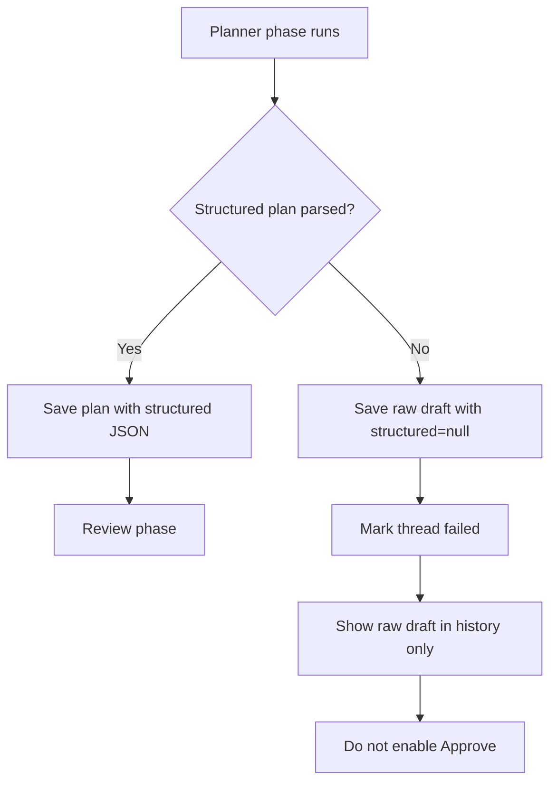
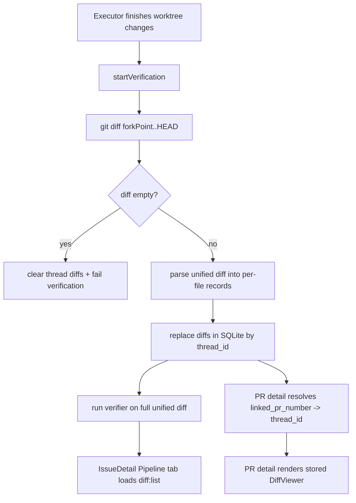

# Sessions — 2026-04-20

## Session 1 — IssueDetail UI Polish (Tab Icons, Pipeline Card, Sidebar, Cleanup)

**Status:** Complete (uncommitted)

### Context

Visual and UX cleanup batch for the IssueDetail panel. No new features — all removals and constraints.

### System Flow — Tab Bar Icon Visibility

```
User is on any tab
         |
         v
  IssueDetailTabs renders tab bar
         |
  [activeTab === 'prd'?]
         |
        Yes ──→ Render refresh (↺) + edit (✏) icon buttons in tab bar
         |
        No  ──→ Tab bar ends cleanly after last tab trigger
```

### Affected Components

| Layer | File | Change |
|-------|------|--------|
| Renderer | `issue-detail/IssueDetailTabs.tsx` | Wrap icon group in `{activeTab === 'prd' && (...)}` |
| Renderer | `issue-detail/IssueDetailActions.tsx` | Hide scrollbar on phase chips ol; rename "Edit PRD first" → "Edit"; remove Rewrite button + `Wand2` import + 3 props from interface |
| Renderer | `IssueDetail.tsx` | Remove `isRewriting` state, `rewriteError` state, `handleRewriteIssue` fn, `clampError` import, 3 props from IssueDetailActions call |
| Renderer | `ProjectSidebar.tsx` | `SIDEBAR_MIN` 180 → 220 |

### What Was Done

- [x] Refresh/Edit icons conditionally rendered only on "Issue" (prd) tab
- [x] Pipeline card phase chips `<ol>`: replaced `overflow-x-auto pb-1 whitespace-nowrap` with `overflow-x-auto whitespace-nowrap [&::-webkit-scrollbar]:hidden` — scrollable but no visible bar
- [x] "Edit PRD first" button label → "Edit"
- [x] Removed Rewrite button and `rewriteError` display from pipeline start card
- [x] Removed `Wand2` import (dead after button removal)
- [x] Removed 3 props from `IssueDetailActionsProps` interface: `isRewriting`, `rewriteError`, `onRewriteIssue`
- [x] Removed dead code from `IssueDetail.tsx`: `isRewriting`/`rewriteError` state, `handleRewriteIssue` fn, `clampError` import
- [x] `SIDEBAR_MIN` increased 180 → 220 in `ProjectSidebar.tsx`
- [x] Ran adversarial review (codex:adversarial-review) — caught `Wand2` dead import + `flex-wrap` separator breakage risk → addressed both
- [x] Typecheck clean (8/12 packages pass; 4 failures in `@shipcode/web` are pre-existing stale fixtures)

### Key Decisions

| Decision | Rationale |
|----------|-----------|
| Hide icons on non-prd tabs (not remove) | Icons are still meaningful on Issue tab; other tabs have no need for GitHub refresh or PRD edit |
| `[&::-webkit-scrollbar]:hidden` not `flex-wrap` | `flex-wrap` would orphan `/` separator spans mid-row at narrow widths; webkit suppression keeps scroll without the visual noise |
| Remove Rewrite button entirely (not just hide) | User confirmed it's redundant — Format button in the edit modal covers the use case; removed dead state too |
| `SIDEBAR_MIN` 180 → 220 | 180 was too narrow to read sidebar nav items comfortably; 220 is still within the 256 max |

### Files Changed

- `apps/desktop/src/renderer/components/issue-detail/IssueDetailTabs.tsx`
- `apps/desktop/src/renderer/components/issue-detail/IssueDetailActions.tsx`
- `apps/desktop/src/renderer/components/IssueDetail.tsx`
- `apps/desktop/src/renderer/components/ProjectSidebar.tsx`

### Mistakes and Fixes

- **Adversarial review caught `Wand2` dead import** — plan initially forgot to list the import removal; added to plan before execution, removed correctly.
- **Adversarial review caught `flex-wrap` separator breakage** — original plan used `flex-wrap` for the phase chips; switched to `[&::-webkit-scrollbar]:hidden` to keep scroll without the broken separator layout.

### Next Steps

- [ ] Commit this session's changes
- [ ] Push develop to remote
- [ ] QA: verify Issue tab shows ↺ ✏ icons; all other tabs show clean tab bar
- [ ] QA: verify pipeline start card has no scrollbar under phase chips
- [ ] QA: verify pipeline start card buttons are "Start pipeline" + "Edit" (no Rewrite)
- [ ] QA: verify sidebar cannot be dragged below 220px
- [ ] Carry forward all QA items from 2026-04-19 sessions

---

## Session 2 — Codex Auth Check, Settings Tab Reorder, Stale Queue Cleanup

**Status:** Complete (uncommitted)

### Context

Three independent improvements: CLI onboard now verifies Codex authentication, project settings tabs reordered for better UX, and DB startup resets stale queued issues.

### System Flow — Startup Queue Cleanup

```
App launches → getDatabase(dataDir)
         |
         v
   Run migrations (if needed)
         |
         v
   UPDATE github_issue_cache
     SET pipeline_status = 'todo'
     WHERE pipeline_status = 'queued'
       AND claimed_at IS NULL
         |
         v
   Return db handle (clean state)
```

### Affected Components

| Layer | File | Change |
|-------|------|--------|
| CLI | `apps/cli/src/commands/onboard.ts` | Replace static codex warning with `checkCodexAuth()` call + conditional messaging |
| CLI | `apps/cli/src/commands/onboard.test.ts` | Add `checkCodexAuthMock`, test happy path + unauthenticated warning |
| CLI | `apps/cli/README.md` | Fix "Codex env vars" → `codex login` |
| Renderer | `ProjectSettingsModal.tsx` | Reorder TabsTrigger + TabsContent: notifications moved last (after github, context) |
| Renderer | `project-settings-modal/shared.ts` | `PROJECT_TABS` array: notifications moved to end |
| Renderer | `ProjectSettingsNotificationsTab.tsx` | GitHub @mention section wrapped in card with header; label → "Additional recipient"; tighter copy |
| DB | `packages/db/src/index.ts` | Startup cleanup: reset unclaimed queued issues to `todo` on every launch |

### What Was Done

- [x] `onboard.ts`: replaced hardcoded codex warning with `checkCodexAuth()` — shows `✓ authenticated` or `⚠ not authenticated … Run: codex login`
- [x] `onboard.test.ts`: added mock for `checkCodexAuth`, updated happy-path setup, added test for unauthenticated codex warning
- [x] `README.md`: corrected "Codex env vars" → `codex login`
- [x] Settings modal tabs reordered: General → Setup → Models → GitHub → Context → Notifications (was: …Models → Notifications → GitHub → Context)
- [x] `PROJECT_TABS` constant updated to match new order
- [x] Notifications tab: @mention input wrapped in bordered card with "Issue rewrite @mention" header; label shortened to "Additional recipient"; placeholder simplified
- [x] `getDatabase()`: added startup SQL to reset unclaimed queued issues (`pipeline_status = 'queued' AND claimed_at IS NULL`) back to `todo`

### Key Decisions

| Decision | Rationale |
|----------|-----------|
| Move notifications tab to last | Least-used tab; GitHub and Context are more commonly accessed during setup |
| Reset unclaimed queued on every startup (not just migration) | V22 migration only caught issues without `thread_id`; this catches any stale state from crashes/restarts on every launch |
| Card wrapper for @mention section | Visually groups the @mention config as a distinct concern within the notifications tab |

### Files Changed

- `apps/cli/src/commands/onboard.ts`
- `apps/cli/src/commands/onboard.test.ts`
- `apps/cli/README.md`
- `apps/desktop/src/renderer/components/ProjectSettingsModal.tsx`
- `apps/desktop/src/renderer/components/project-settings-modal/ProjectSettingsNotificationsTab.tsx`
- `apps/desktop/src/renderer/components/project-settings-modal/shared.ts`
- `packages/db/src/index.ts`

### Mistakes and Fixes

None this session.

### Next Steps

- [ ] Commit all uncommitted changes (Session 1 + Session 2)
- [ ] Push develop to remote
- [ ] QA: run `shipcode onboard` and verify codex auth check output
- [ ] QA: open project settings, confirm tab order is General/Setup/Models/GitHub/Context/Notifications
- [ ] QA: verify @mention section in notifications tab has card styling
- [ ] QA: confirm queued issues without `claimed_at` reset to `todo` on app restart
- [ ] Carry forward QA items from Session 1 and 2026-04-19

---

## Session 3 — Repo Skill Frontmatter Repair (`github-label-sync`)

**Status:** Complete (uncommitted)

### Context

ShipCode reported that one repo-scoped skill was skipped during load because its `SKILL.md` file did not start with YAML frontmatter delimited by `---`.

### System Flow — Repo Skill Validation

```
Skill loader reads repo-local SKILL.md
         |
         v
validateSkill(content)
         |
  [starts with --- frontmatter block?]
         |
   No ──→ reject skill with "missing YAML frontmatter delimited by ---"
         |
  Yes ──→ skill remains loadable
```

### Affected Components

| Layer | File | Change |
|-------|------|--------|
| Repo skill | `.agents/skills/github-label-sync/SKILL.md` | Added required YAML frontmatter with `name` and `description` |

### What Was Done

- [x] Inspected `.agents/skills/github-label-sync/SKILL.md` and confirmed it started directly with a markdown heading instead of YAML frontmatter
- [x] Compared it against working skill files to match the repo-local shape
- [x] Verified loader behavior in `packages/agents/src/skills/skill-loader.ts` — repo skills are rejected when they do not begin with a `--- ... ---` block
- [x] Added valid frontmatter to `.agents/skills/github-label-sync/SKILL.md`
- [x] Re-checked the file header after the patch

### Key Decisions

| Decision | Rationale |
|----------|-----------|
| Patch only the frontmatter, leave the body untouched | The warning was a schema/load issue, not a content issue |
| Use minimal repo-local frontmatter (`name`, `description`) | Matches existing repo-local skill pattern without inventing extra metadata |

### Files Changed

- `.agents/skills/github-label-sync/SKILL.md`

### Mistakes and Fixes

- **Initial example lookup assumed more repo-local skills existed** — there were only two repo-scoped skills in this repo, so validation was completed by comparing against `writing-prds` plus the loader implementation itself.

### Next Steps

- [ ] Reload the skill loader path in the app and confirm the warning is gone
- [ ] Commit this skill-file fix with the other uncommitted work if desired

---

## Session 4 — ShipCode CLI Live Validation and Onboarding Verification

**Status:** Complete (local onboarding applied)

### Context

Validated whether the ShipCode CLI was actually runnable on this machine, then investigated why onboarding printed a misleading Codex API-key warning even though Codex CLI login is the real auth path.

### System Flow — CLI Onboarding Verification

```
Run shipcode onboard
         |
         v
Check local prerequisites (node/bun/gh/claude/codex)
         |
         v
Check auth (gh, claude, codex)
         |
         v
Verify current git repo resolves on GitHub
         |
         v
Create/reuse ~/.shipcode/data/shipcode.db
         |
         v
Register project + sync ShipCode labels
         |
         v
Print "ShipCode is ready!" and allow run <issue-number>
```

### Affected Components

| Layer | File / State | Change |
|-------|--------------|--------|
| CLI runtime | `apps/cli/dist/index.js` | Rebuilt and executed live onboarding path |
| CLI source (verified) | `apps/cli/src/commands/onboard.ts` | Confirmed Codex auth uses `checkCodexAuth()` and reports CLI auth correctly |
| CLI docs (verified) | `apps/cli/README.md` | Confirmed docs now say `codex login`, not API-key-only auth |

---

## Session 5 — Desktop Stability Pass (Biome, Instant Sessions, Approval Gate Fix)

**Status:** Complete (uncommitted)

### Context

Stability and UX repair batch across the Electron desktop app. This session fixed staged Biome failures, made git hook setup automatic, removed an infinite render loop in instant terminal panes, expanded the New Terminal Session modal to expose project/cli/model/effort, and corrected a broken pipeline state where unparsable planner output was shown as approvable despite no executable plan existing.

### System Flow — Invalid Plan Output Handling



### Affected Components

| Layer | File | Change |
|-------|------|--------|
| Renderer | `apps/desktop/src/renderer/components/IssueDetail.tsx` | Removed unused import, tightened approve gating to require a real parseable plan |
| Renderer | `apps/desktop/src/renderer/components/issue-detail/CostsTab.tsx` | Removed non-null assertion in model display |
| Renderer | `apps/desktop/src/renderer/components/issue-detail/helpers.ts` | Removed non-null assertion in failure-count label |
| Renderer | `apps/desktop/src/renderer/components/terminal-drawer/TerminalDrawerHeader.tsx` | Removed unused prop from component signature |
| Renderer | `apps/desktop/src/renderer/App.tsx` | Marked decorative SVG as `aria-hidden` |
| Renderer | `apps/desktop/src/renderer/components/ErrorBoundary.tsx` | Marked decorative/copy-state SVGs as `aria-hidden` |
| Renderer | `apps/desktop/src/renderer/components/instant-terminal/useInstantTerminalPane.ts` | Replaced unstable selector fallback `[]` with stable `EMPTY_STREAM` constant to stop max-depth rerender loop |
| Renderer | `apps/desktop/src/renderer/components/InstantFixModal.tsx` | Reworked modal controls to `project`, `cli`, `model`, `effort`; defaulted from executor settings; passed model/effort to instant runs |
| Main IPC | `apps/desktop/src/main/ipc/register-instant-handlers.ts` | Accepted `modelId` + `reasoningEffort` for instant runs and translated them to Claude/Codex CLI args |
| Shared IPC | `packages/shared/src/ipc-channels.ts` | Added `modelId` and `reasoningEffort` to `instant:run` payload |
| Pipeline | `packages/pipeline/src/pipeline/planning-phases.ts` | Changed exit-0 parse-failure behavior from `awaiting_approval` to `failed` |
| Tests | `packages/pipeline/src/pipeline.test.ts` | Updated regression expectations for invalid plan output |
| Tooling | `package.json` | `postinstall` now also runs git hook setup |
| Tooling | `scripts/setup-git-hooks.sh` | Ensures `.githooks/*` are executable before configuring `core.hooksPath` |

### What Was Done

- [x] Fixed staged Biome errors blocking commit
- [x] Confirmed repo uses `.githooks` via `core.hooksPath`, not `.git/hooks`
- [x] Made hook setup automatic on `postinstall`
- [x] Ran the staged Biome script directly and validated it passes
- [x] Investigated `Maximum update depth exceeded` from `InstantTerminalPane`
- [x] Identified unstable Zustand selector snapshot caused by `?? []` in `useInstantTerminalPane`
- [x] Replaced the selector fallback with a stable module-level `EMPTY_STREAM`
- [x] Reworked the New Terminal Session modal to expose `project`, `cli`, `model`, and `effort`
- [x] Threaded instant-session model/effort choices through IPC and into Claude/Codex CLI invocation
- [x] Investigated mismatch between approval UI and plan history on failed/planned runs
- [x] Identified that exit-0 planner parse failures were incorrectly entering `awaiting_approval`
- [x] Changed planner parse-failure handling to fail the run while still preserving raw draft output in history
- [x] Tightened renderer approval logic so only structured or client-parseable plans can be approved
- [x] Re-ran focused validation on pipeline tests and desktop typecheck

### Key Decisions

| Decision | Rationale |
|----------|-----------|
| Treat planner parse-failure as `failed`, not `awaiting_approval` | Approval without an executable plan is a false affordance and creates exactly the broken state the user hit |
| Preserve raw draft rows in plan history even when failing | Keeps the underlying AI output inspectable for debugging without pretending it is runnable |
| Use renderer-side `resolveClientSidePlan()` for approval gating | Keeps renderer parsing local and avoids coupling renderer code to main-process helper imports |
| Default instant-session modal from executor settings | Maintains consistency with project-level executor defaults instead of inventing a separate instant-run config surface |
| Pass provider-specific model/effort into instant CLI args | Makes the new modal fields operational, not decorative |
| Auto-run git hook setup on `postinstall` | Prevents “hooks exist but were never configured” drift on fresh installs |

### Files Changed

- `apps/desktop/src/renderer/components/IssueDetail.tsx`
- `apps/desktop/src/renderer/components/issue-detail/CostsTab.tsx`
- `apps/desktop/src/renderer/components/issue-detail/helpers.ts`
- `apps/desktop/src/renderer/components/terminal-drawer/TerminalDrawerHeader.tsx`
- `apps/desktop/src/renderer/App.tsx`
- `apps/desktop/src/renderer/components/ErrorBoundary.tsx`
- `apps/desktop/src/renderer/components/instant-terminal/useInstantTerminalPane.ts`
- `apps/desktop/src/renderer/components/InstantFixModal.tsx`
- `apps/desktop/src/main/ipc/register-instant-handlers.ts`
- `packages/shared/src/ipc-channels.ts`
- `packages/pipeline/src/pipeline/planning-phases.ts`
- `packages/pipeline/src/pipeline.test.ts`
- `package.json`
- `scripts/setup-git-hooks.sh`

### Mistakes and Fixes

- **Approval UI trusted any `rawOutput`** — fixed by requiring a real structured or client-parseable plan before enabling approve.
- **Planner parse-failure path emitted `awaiting_approval` on exit code 0** — fixed by failing the thread instead and preserving the raw draft only in history.
- **Instant terminal hook used `?? []` inside a Zustand selector** — fixed by switching to a stable shared empty-array constant.
- **Initial desktop test invocation used raw `bun test`** — corrected to use the package’s Vitest runner / package scripts instead.

### Validation

- `sh scripts/lint-staged-biome.sh` ✅
- `sh scripts/setup-git-hooks.sh` ✅
- `bunx biome check ...` on touched files ✅
- `bun run test` in `packages/pipeline` ✅
- `bun run typecheck` in `apps/desktop` ✅

### Known Gaps

- `bun run --cwd apps/desktop test` still has pre-existing failures in main-process IPC tests due to incomplete `mainWindow.isDestroyed()` mocks (`register-github-handlers.test.ts`, `helpers.test.ts`). These were not introduced by this session.

### Next Steps

- [ ] Reload the desktop app and verify the invalid-plan case now fails cleanly without an approval affordance
- [ ] QA the instant session modal layout/order and provider-specific model/effort behavior
- [ ] Commit the desktop stability batch
- [ ] Fix the pre-existing desktop IPC test mocks for `mainWindow.isDestroyed()` if a clean full-suite run is needed
| Local state | `~/.shipcode/data/shipcode.db` | Created and populated by onboarding |
| GitHub repo state | `shipshitdev/shipcode` labels | ShipCode labels created / verified present |

### What Was Done

- [x] Confirmed the CLI package exists and starts: `node apps/cli/dist/index.js --help`
- [x] Verified local prerequisites: Node `v25.9.0`, Bun `1.3.12`, `gh`, `claude`, and `codex` all on `PATH`
- [x] Verified auth state: `gh auth status` passed, `claude auth status` passed, `~/.codex/auth.json` exists
- [x] Ran CLI package validation: `bun run --filter @shipshitdev/shipcode test`, `typecheck`, and `build`
- [x] Ran `node apps/cli/dist/index.js onboard` successfully against `shipshitdev/shipcode`
- [x] Verified onboarding side effects: local DB created at `~/.shipcode/data/shipcode.db`, repo registered, ShipCode labels created, `status` now lists this project
- [x] Traced the Codex warning path and confirmed the correct auth model is Codex CLI login, not a required API key
- [x] Re-ran onboarding and verified current output now reports `✓ codex — authenticated`

### Key Decisions

| Decision | Rationale |
|----------|-----------|
| Treat `onboard` as a real mutation, not a harmless smoke test | It writes local ShipCode state and creates GitHub labels |
| Verify the built CLI path, not just the source tree | The user asked whether it works *right now* on this machine |
| Use Codex CLI auth artifact as truth (`~/.codex/auth.json`) | Matches the actual Codex CLI workflow and ShipCode shared health-check logic |

### Files Changed

- `.agents/SESSIONS/2026-04-20.md`

### External Side Effects

- `~/.shipcode/data/shipcode.db` created
- Project `shipcode` registered in local ShipCode DB
- Missing ShipCode labels created on `shipshitdev/shipcode`

### Mistakes and Fixes

- **The original onboard output implied Codex needed an API key** — investigation showed that assumption was wrong for this workflow; the correct path is Codex CLI login, and the current onboarding behavior was verified live against that model.

### Next Steps

- [ ] Run `node apps/cli/dist/index.js run <issue-number>` for a full end-to-end pipeline test
- [ ] Decide whether to commit the session logs with the other current uncommitted work

---

## Session 5 — Persist Execution Diffs for PR Detail and Kanban

**Status:** Complete (uncommitted)

### Context

Implemented the PR/kanban diff plan: ShipCode now persists execution diffs locally, shows them in the Pull Requests detail view and the kanban IssueDetail Pipeline tab, hides review actions for closed PRs, and renames the action from `AI Review` to `Review`.

### System Flow — Local Execution Diff Lifecycle



### Affected Components

| Layer | File | Change |
|-------|------|--------|
| DB | `packages/db/src/queries/diffs.ts` | Added thread-level diff replacement API; normalized diff actions to shared enum shape |
| DB | `packages/db/src/queries/github-issues.ts` | Added lookup by `project_id + linked_pr_number` to map PR detail back to ShipCode issue/thread |
| Pipeline | `packages/pipeline/src/pipeline/diff-parser.ts` | Added unified git diff parser -> per-file diff rows |
| Pipeline | `packages/pipeline/src/pipeline/execution-phases.ts` | Persist diff rows before verification; clear rows when no diff exists |
| Pipeline wiring | `packages/pipeline/src/types.ts`, `apps/desktop/src/main/index.ts`, `apps/cli/src/commands/run.ts` | Added `diffs` dependency to pipeline construction |
| Main IPC | `apps/desktop/src/main/ipc/register-pr-handlers.ts` | PR detail now returns live GH metadata plus `linkedThreadId` and persisted `diffs` |
| Shared types | `packages/shared/src/types.ts`, `packages/shared/src/ipc-channels.ts` | Added `PullRequestDetailResponse` carrying diff/thread linkage |
| Renderer | `apps/desktop/src/renderer/components/pull-requests/PullRequestDetailPanel.tsx` | Added `DiffViewer` and empty states for linked/unlinked PRs |
| Renderer | `apps/desktop/src/renderer/components/pull-requests/PullRequestDetailActions.tsx` | Hide review action unless PR is open; label changed to `Review` |
| Renderer | `apps/desktop/src/renderer/components/IssueDetail.tsx`, `issue-detail/IssueDetailTabs.tsx`, `issue-detail/PipelineTab.tsx` | Pipeline tab now loads and renders persisted execution diffs in kanban issue detail |

### What Was Done

- [x] Confirmed the repo already had a `diffs` table and `DiffViewer`, but no active pipeline persistence path
- [x] Added `DiffQueries.replaceForThread()` so each rerun replaces stale diff rows for the same thread
- [x] Added `GitHubIssueQueries.getByLinkedPrNumber()` so PR detail can resolve a ShipCode-linked issue/thread without introducing a new PR cache table
- [x] Added `parseUnifiedDiff()` to split a unified git diff into per-file records with action + blob hashes
- [x] Persisted parsed diff rows during verification startup, before verifier execution
- [x] Cleared thread diff rows when verification sees no diff
- [x] Extended PR detail IPC/types to return `linkedThreadId` plus stored diff rows
- [x] Rendered `DiffViewer` in Pull Request detail using persisted local execution diffs
- [x] Added explicit empty states for unlinked/manual PRs and linked PRs with no stored diff
- [x] Renamed the PR action from `AI Review` to `Review`
- [x] Hid review actions for non-open PRs
- [x] Wired the same persisted diff into the kanban IssueDetail `Pipeline` tab so it appears before and after PR creation
- [x] Added DB, pipeline, and renderer tests for the new behavior
- [x] Ran targeted test suites, full monorepo typecheck, and Biome on touched files

### Key Decisions

| Decision | Rationale |
|----------|-----------|
| Persist execution diffs in SQLite, not in a transient renderer cache | The diff is local pipeline output and needs to survive navigation/restarts and feed multiple views |
| Keep PR metadata/checks/comments live-fetched from GitHub | Those are remote mutable state; no need to mirror them fully into ShipCode DB for this feature |
| Resolve PR -> thread through `github_issue_cache.linked_pr_number` | Reuses the existing source of truth instead of inventing a second PR persistence model |
| Show diff in kanban IssueDetail Pipeline tab, not inline on board cards | Keeps the board compact while still satisfying “see code diff in kanban” |
| Hide `Review` for closed/merged PRs | Closed PRs don’t need a new review session and the previous action was misleading |
| Normalize diff actions to shared enum values (`create/modify/delete/rename`) | Aligns DB rows, UI rendering, and shared types; removes the previous `added/modified/deleted` mismatch |

### Files Changed

- `apps/cli/src/commands/run.ts`
- `apps/desktop/src/main/index.ts`
- `apps/desktop/src/main/ipc/register-pr-handlers.ts`
- `apps/desktop/src/renderer/components/IssueDetail.tsx`
- `apps/desktop/src/renderer/components/issue-detail/IssueDetailTabs.tsx`
- `apps/desktop/src/renderer/components/issue-detail/PipelineTab.tsx`
- `apps/desktop/src/renderer/components/issue-detail/PipelineTab.test.tsx`
- `apps/desktop/src/renderer/components/pull-requests/PullRequestDetailActions.tsx`
- `apps/desktop/src/renderer/components/pull-requests/PullRequestDetailPanel.tsx`
- `apps/desktop/src/renderer/components/pull-requests/PullRequestDetailPanel.test.tsx`
- `packages/db/src/index.ts`
- `packages/db/src/queries/diffs.ts`
- `packages/db/src/queries/diffs.test.ts`
- `packages/db/src/queries/github-issues.ts`
- `packages/db/src/queries/github-issues.test.ts`
- `packages/pipeline/src/pipeline.github-issue.smoke.test.ts`
- `packages/pipeline/src/pipeline.test.ts`
- `packages/pipeline/src/pipeline/diff-parser.ts`
- `packages/pipeline/src/pipeline/execution-phases.ts`
- `packages/pipeline/src/types.ts`
- `packages/shared/src/ipc-channels.ts`
- `packages/shared/src/types.ts`

### Validation

- [x] `bun run --cwd packages/db test -- src/queries/diffs.test.ts src/queries/github-issues.test.ts`
- [x] `bun run --cwd packages/pipeline test -- src/pipeline.test.ts src/pipeline.github-issue.smoke.test.ts`
- [x] `bun run --cwd apps/desktop test -- src/renderer/components/pull-requests/PullRequestDetailPanel.test.tsx src/renderer/components/issue-detail/PipelineTab.test.tsx`
- [x] `bun run typecheck`
- [x] `bunx biome check ...` on touched files

### Mistakes and Fixes

- **Initial assumption was that diffs were already persisted** — investigation showed the table/query existed but nothing wrote to it; fixed by wiring `diffs` into pipeline deps and persisting during verification startup.
- **First validation pass used Bun’s raw test runner on some packages** — that produced environment noise (`node:sqlite`, jsdom, `vi.hoisted`); reran with package-level `vitest` commands to get the real signal.
- **Typecheck caught nullable `filePath` from the diff parser fallback** — fixed by forcing a non-null patch filename fallback (`changes.patch`).
- **Renderer tests leaked DOM between cases** — fixed by adding explicit `cleanup()` between tests.

### Next Steps

- [ ] QA in the app: open a ShipCode-linked PR and verify `Code Changes` renders the persisted diff
- [ ] QA in the app: select a kanban issue after execution and verify the `Pipeline` tab shows the same diff before PR creation
- [ ] QA in the app: confirm merged/closed PRs show no `Review` action
- [ ] Consider whether manual/unlinked PRs should later fetch GitHub patch text as a secondary fallback
- [ ] Commit this session’s code with the rest of the current branch work if desired
