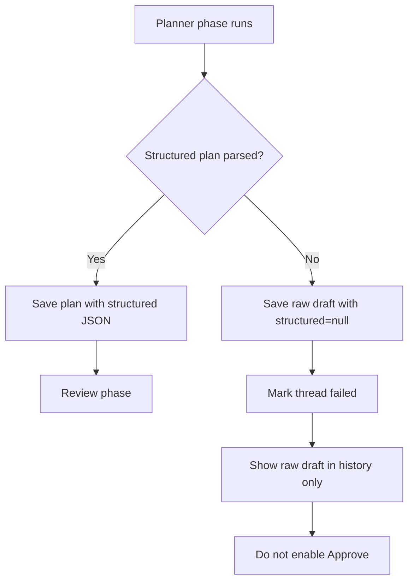
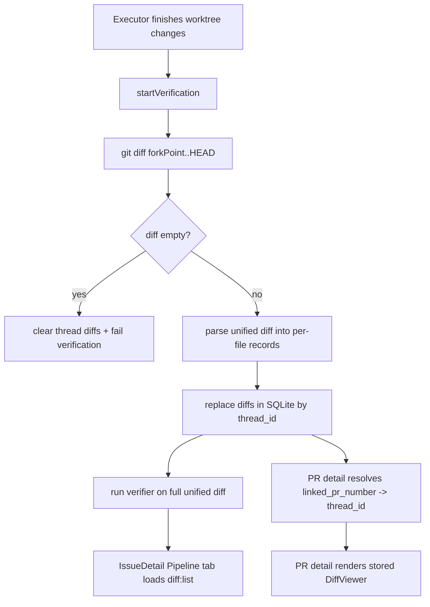
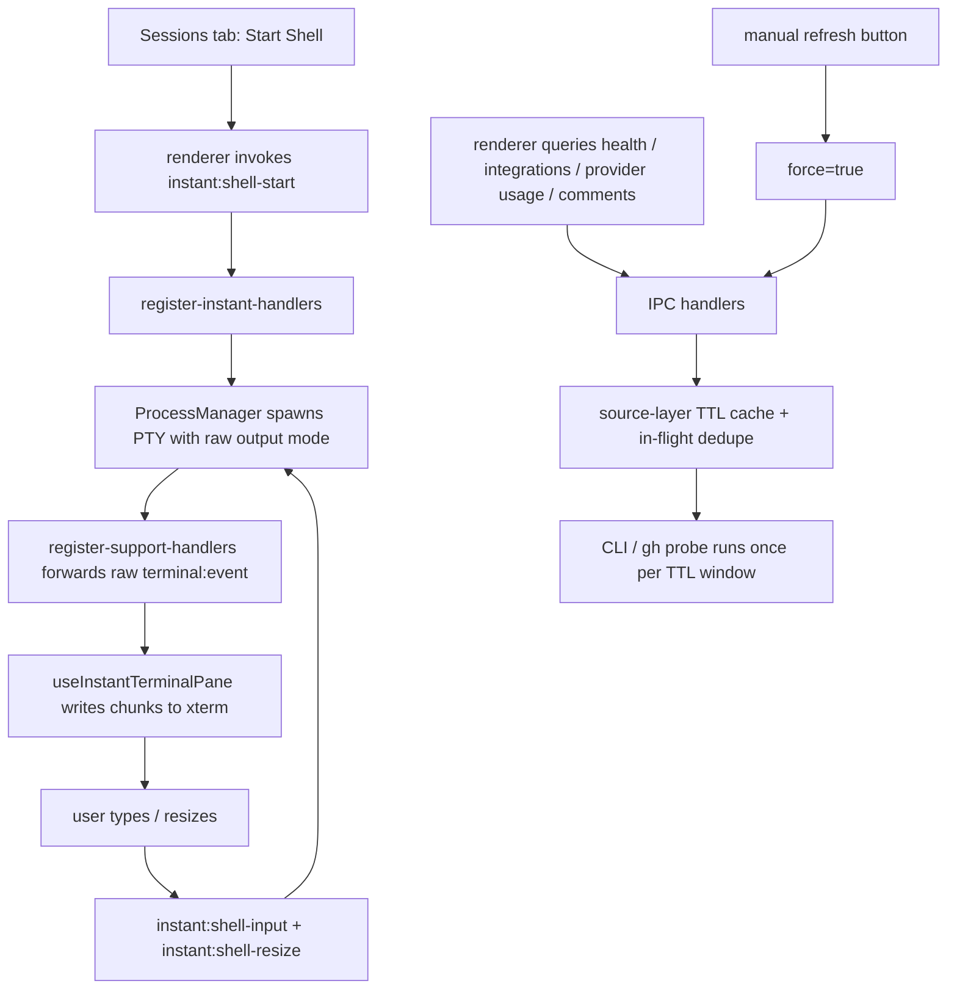
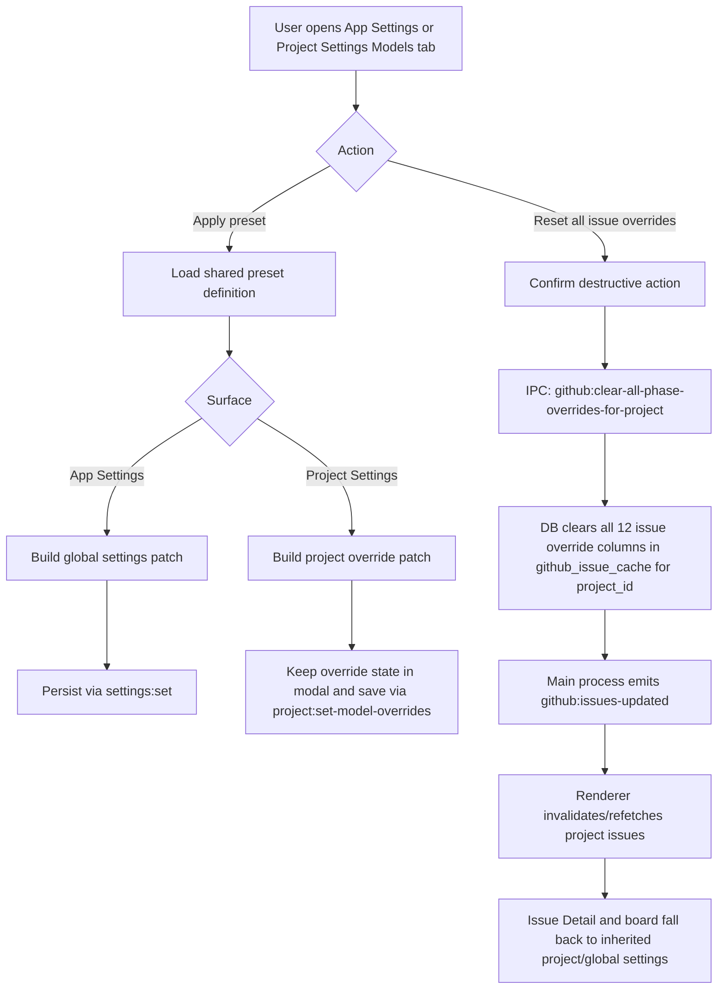
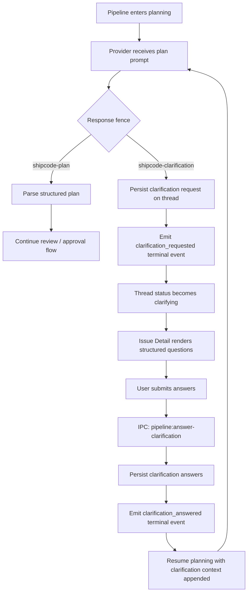
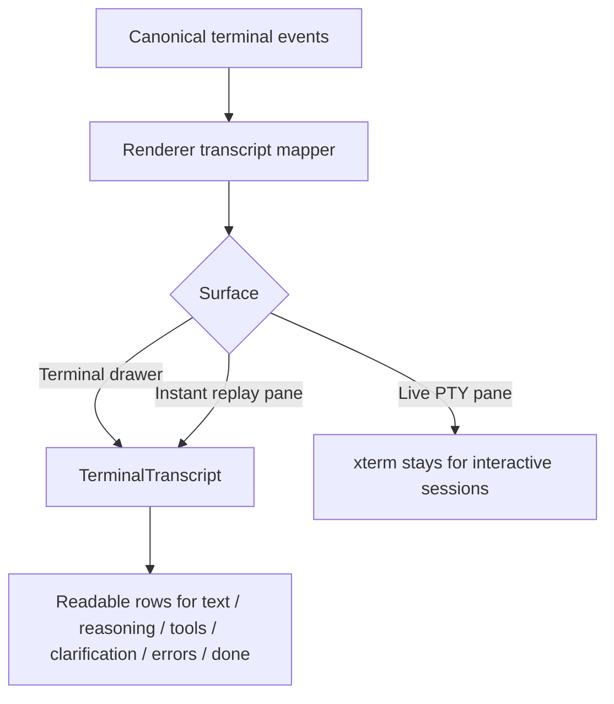

# Sessions — 2026-04-20

## Session 1 — IssueDetail UI Polish (Tab Icons, Pipeline Card, Sidebar, Cleanup)

**Status:** Complete (uncommitted)

### Context

Visual and UX cleanup batch for the IssueDetail panel. No new features — all removals and constraints.

### System Flow — Tab Bar Icon Visibility

```
User is on any tab
         |
         v
  IssueDetailTabs renders tab bar
         |
  [activeTab === 'prd'?]
         |
        Yes ──→ Render refresh (↺) + edit (✏) icon buttons in tab bar
         |
        No  ──→ Tab bar ends cleanly after last tab trigger
```

### Affected Components

| Layer | File | Change |
|-------|------|--------|
| Renderer | `issue-detail/IssueDetailTabs.tsx` | Wrap icon group in `{activeTab === 'prd' && (...)}` |
| Renderer | `issue-detail/IssueDetailActions.tsx` | Hide scrollbar on phase chips ol; rename "Edit PRD first" → "Edit"; remove Rewrite button + `Wand2` import + 3 props from interface |
| Renderer | `IssueDetail.tsx` | Remove `isRewriting` state, `rewriteError` state, `handleRewriteIssue` fn, `clampError` import, 3 props from IssueDetailActions call |
| Renderer | `ProjectSidebar.tsx` | `SIDEBAR_MIN` 180 → 220 |

### What Was Done

- [x] Refresh/Edit icons conditionally rendered only on "Issue" (prd) tab
- [x] Pipeline card phase chips `<ol>`: replaced `overflow-x-auto pb-1 whitespace-nowrap` with `overflow-x-auto whitespace-nowrap [&::-webkit-scrollbar]:hidden` — scrollable but no visible bar
- [x] "Edit PRD first" button label → "Edit"
- [x] Removed Rewrite button and `rewriteError` display from pipeline start card
- [x] Removed `Wand2` import (dead after button removal)
- [x] Removed 3 props from `IssueDetailActionsProps` interface: `isRewriting`, `rewriteError`, `onRewriteIssue`
- [x] Removed dead code from `IssueDetail.tsx`: `isRewriting`/`rewriteError` state, `handleRewriteIssue` fn, `clampError` import
- [x] `SIDEBAR_MIN` increased 180 → 220 in `ProjectSidebar.tsx`
- [x] Ran adversarial review (codex:adversarial-review) — caught `Wand2` dead import + `flex-wrap` separator breakage risk → addressed both
- [x] Typecheck clean (8/12 packages pass; 4 failures in `@shipcode/web` are pre-existing stale fixtures)

### Key Decisions

| Decision | Rationale |
|----------|-----------|
| Hide icons on non-prd tabs (not remove) | Icons are still meaningful on Issue tab; other tabs have no need for GitHub refresh or PRD edit |
| `[&::-webkit-scrollbar]:hidden` not `flex-wrap` | `flex-wrap` would orphan `/` separator spans mid-row at narrow widths; webkit suppression keeps scroll without the visual noise |
| Remove Rewrite button entirely (not just hide) | User confirmed it's redundant — Format button in the edit modal covers the use case; removed dead state too |
| `SIDEBAR_MIN` 180 → 220 | 180 was too narrow to read sidebar nav items comfortably; 220 is still within the 256 max |

### Files Changed

- `apps/desktop/src/renderer/components/issue-detail/IssueDetailTabs.tsx`
- `apps/desktop/src/renderer/components/issue-detail/IssueDetailActions.tsx`
- `apps/desktop/src/renderer/components/IssueDetail.tsx`
- `apps/desktop/src/renderer/components/ProjectSidebar.tsx`

### Mistakes and Fixes

- **Adversarial review caught `Wand2` dead import** — plan initially forgot to list the import removal; added to plan before execution, removed correctly.
- **Adversarial review caught `flex-wrap` separator breakage** — original plan used `flex-wrap` for the phase chips; switched to `[&::-webkit-scrollbar]:hidden` to keep scroll without the broken separator layout.

### Next Steps

- [ ] Commit this session's changes
- [ ] Push develop to remote
- [ ] QA: verify Issue tab shows ↺ ✏ icons; all other tabs show clean tab bar
- [ ] QA: verify pipeline start card has no scrollbar under phase chips
- [ ] QA: verify pipeline start card buttons are "Start pipeline" + "Edit" (no Rewrite)
- [ ] QA: verify sidebar cannot be dragged below 220px
- [ ] Carry forward all QA items from 2026-04-19 sessions

---

## Session 2 — Codex Auth Check, Settings Tab Reorder, Stale Queue Cleanup

**Status:** Complete (uncommitted)

### Context

Three independent improvements: CLI onboard now verifies Codex authentication, project settings tabs reordered for better UX, and DB startup resets stale queued issues.

### System Flow — Startup Queue Cleanup

```
App launches → getDatabase(dataDir)
         |
         v
   Run migrations (if needed)
         |
         v
   UPDATE github_issue_cache
     SET pipeline_status = 'todo'
     WHERE pipeline_status = 'queued'
       AND claimed_at IS NULL
         |
         v
   Return db handle (clean state)
```

### Affected Components

| Layer | File | Change |
|-------|------|--------|
| CLI | `apps/cli/src/commands/onboard.ts` | Replace static codex warning with `checkCodexAuth()` call + conditional messaging |
| CLI | `apps/cli/src/commands/onboard.test.ts` | Add `checkCodexAuthMock`, test happy path + unauthenticated warning |
| CLI | `apps/cli/README.md` | Fix "Codex env vars" → `codex login` |
| Renderer | `ProjectSettingsModal.tsx` | Reorder TabsTrigger + TabsContent: notifications moved last (after github, context) |
| Renderer | `project-settings-modal/shared.ts` | `PROJECT_TABS` array: notifications moved to end |
| Renderer | `ProjectSettingsNotificationsTab.tsx` | GitHub @mention section wrapped in card with header; label → "Additional recipient"; tighter copy |
| DB | `packages/db/src/index.ts` | Startup cleanup: reset unclaimed queued issues to `todo` on every launch |

### What Was Done

- [x] `onboard.ts`: replaced hardcoded codex warning with `checkCodexAuth()` — shows `✓ authenticated` or `⚠ not authenticated … Run: codex login`
- [x] `onboard.test.ts`: added mock for `checkCodexAuth`, updated happy-path setup, added test for unauthenticated codex warning
- [x] `README.md`: corrected "Codex env vars" → `codex login`
- [x] Settings modal tabs reordered: General → Setup → Models → GitHub → Context → Notifications (was: …Models → Notifications → GitHub → Context)
- [x] `PROJECT_TABS` constant updated to match new order
- [x] Notifications tab: @mention input wrapped in bordered card with "Issue rewrite @mention" header; label shortened to "Additional recipient"; placeholder simplified
- [x] `getDatabase()`: added startup SQL to reset unclaimed queued issues (`pipeline_status = 'queued' AND claimed_at IS NULL`) back to `todo`

### Key Decisions

| Decision | Rationale |
|----------|-----------|
| Move notifications tab to last | Least-used tab; GitHub and Context are more commonly accessed during setup |
| Reset unclaimed queued on every startup (not just migration) | V22 migration only caught issues without `thread_id`; this catches any stale state from crashes/restarts on every launch |
| Card wrapper for @mention section | Visually groups the @mention config as a distinct concern within the notifications tab |

### Files Changed

- `apps/cli/src/commands/onboard.ts`
- `apps/cli/src/commands/onboard.test.ts`
- `apps/cli/README.md`
- `apps/desktop/src/renderer/components/ProjectSettingsModal.tsx`
- `apps/desktop/src/renderer/components/project-settings-modal/ProjectSettingsNotificationsTab.tsx`
- `apps/desktop/src/renderer/components/project-settings-modal/shared.ts`
- `packages/db/src/index.ts`

### Mistakes and Fixes

None this session.

### Next Steps

- [ ] Commit all uncommitted changes (Session 1 + Session 2)
- [ ] Push develop to remote
- [ ] QA: run `shipcode onboard` and verify codex auth check output
- [ ] QA: open project settings, confirm tab order is General/Setup/Models/GitHub/Context/Notifications
- [ ] QA: verify @mention section in notifications tab has card styling
- [ ] QA: confirm queued issues without `claimed_at` reset to `todo` on app restart
- [ ] Carry forward QA items from Session 1 and 2026-04-19

---

## Session 3 — Repo Skill Frontmatter Repair (`github-label-sync`)

**Status:** Complete (uncommitted)

### Context

ShipCode reported that one repo-scoped skill was skipped during load because its `SKILL.md` file did not start with YAML frontmatter delimited by `---`.

### System Flow — Repo Skill Validation

```
Skill loader reads repo-local SKILL.md
         |
         v
validateSkill(content)
         |
  [starts with --- frontmatter block?]
         |
   No ──→ reject skill with "missing YAML frontmatter delimited by ---"
         |
  Yes ──→ skill remains loadable
```

### Affected Components

| Layer | File | Change |
|-------|------|--------|
| Repo skill | `.agents/skills/github-label-sync/SKILL.md` | Added required YAML frontmatter with `name` and `description` |

### What Was Done

- [x] Inspected `.agents/skills/github-label-sync/SKILL.md` and confirmed it started directly with a markdown heading instead of YAML frontmatter
- [x] Compared it against working skill files to match the repo-local shape
- [x] Verified loader behavior in `packages/agents/src/skills/skill-loader.ts` — repo skills are rejected when they do not begin with a `--- ... ---` block
- [x] Added valid frontmatter to `.agents/skills/github-label-sync/SKILL.md`
- [x] Re-checked the file header after the patch

### Key Decisions

| Decision | Rationale |
|----------|-----------|
| Patch only the frontmatter, leave the body untouched | The warning was a schema/load issue, not a content issue |
| Use minimal repo-local frontmatter (`name`, `description`) | Matches existing repo-local skill pattern without inventing extra metadata |

### Files Changed

- `.agents/skills/github-label-sync/SKILL.md`

### Mistakes and Fixes

- **Initial example lookup assumed more repo-local skills existed** — there were only two repo-scoped skills in this repo, so validation was completed by comparing against `writing-prds` plus the loader implementation itself.

### Next Steps

- [ ] Reload the skill loader path in the app and confirm the warning is gone
- [ ] Commit this skill-file fix with the other uncommitted work if desired

---

## Session 4 — ShipCode CLI Live Validation and Onboarding Verification

**Status:** Complete (local onboarding applied)

### Context

Validated whether the ShipCode CLI was actually runnable on this machine, then investigated why onboarding printed a misleading Codex API-key warning even though Codex CLI login is the real auth path.

### System Flow — CLI Onboarding Verification

```
Run shipcode onboard
         |
         v
Check local prerequisites (node/bun/gh/claude/codex)
         |
         v
Check auth (gh, claude, codex)
         |
         v
Verify current git repo resolves on GitHub
         |
         v
Create/reuse ~/.shipcode/data/shipcode.db
         |
         v
Register project + sync ShipCode labels
         |
         v
Print "ShipCode is ready!" and allow run <issue-number>
```

### Affected Components

| Layer | File / State | Change |
|-------|--------------|--------|
| CLI runtime | `apps/cli/dist/index.js` | Rebuilt and executed live onboarding path |
| CLI source (verified) | `apps/cli/src/commands/onboard.ts` | Confirmed Codex auth uses `checkCodexAuth()` and reports CLI auth correctly |
| CLI docs (verified) | `apps/cli/README.md` | Confirmed docs now say `codex login`, not API-key-only auth |

---

## Session 5 — Plans Tab Stabilization, Planner Artifact Compaction, Live DB Cleanup

**Status:** Complete (uncommitted code changes; local ShipCode DB repaired)

### Context

The `Plan History` UI was slow, unstable, and rendering raw planner garbage. Root cause was not the GitHub issue body itself: Issue `#48` (`Add Gemini CLI provider`) had a normal body size (`6993` chars), but its saved plan artifacts were huge malformed planner transcripts:

- v1 `raw_output`: `1,898,200` chars
- v2 `raw_output`: `1,013,067` chars
- v3 `raw_output`: `1,737,201` chars
- all three `structured` columns were `NULL`

Those blobs contained hundreds of shell lines (`/bin/zsh -lc`), multiple ` ```shipcode-plan ` fences, and repo file dumps, so the UI had to chew through megabytes of junk and the parser often matched the wrong fence.

### System Flow — Compact Plan Artifacts + Lazy Plans UI

```text
Provider returns raw subprocess transcript
         |
         v
  StreamParser resolves assistant/model text
         |
  Scan all matching fences from the END
         |
  [last valid fence found?]
         |
   Yes ──→ persist normalized fenced artifact (<= 16000 chars)
   No  ──→ persist clamped failure snippet (<= 16000 chars)
         |
         v
  Issue opens → default tab = Issue
         |
         v
  User clicks Plans
         |
  Load latest/current run only
         |
  Click version row → lazy-load full plan by id
         |
  Click "View all runs" → fetch issue-wide summaries for older runs
```

### Affected Components

| Layer | File | Change |
|-------|------|--------|
| Renderer | `apps/desktop/src/renderer/components/IssueDetail.tsx` | Default tab fixed to Issue; latest-run-only plan loading; gated review fetches; stable reset behavior |
| Renderer | `apps/desktop/src/renderer/components/IssueDetail.test.tsx` | Updated plans/activity behavior and lazy-loading expectations |
| Renderer | `apps/desktop/src/renderer/components/issue-detail/IssueDetailTabs.tsx` | Stable tab ordering; renamed `Plan History` → `Plans`, `Issue History` → `Activity` |
| Renderer | `apps/desktop/src/renderer/components/issue-detail/PlanHistoryTab.tsx` | Current-run-first behavior; `View all runs` toggle; no raw transcript dump on parse failure |
| Renderer | `apps/desktop/src/renderer/components/issue-detail/IssueHistoryTab.tsx` | Renamed heading to `Activity` |
| Renderer | `apps/desktop/src/renderer/components/issue-detail/helpers.ts` | Client fallback parser now scans fences from the end |
| Renderer | `apps/desktop/src/renderer/components/issue-detail/helpers.test.ts` | Added invalid-first-fence regression coverage |
| Agents | `packages/agents/src/stream-parser.ts` | Last-valid-fence parsing; compact artifact storage; bounded failure snippets |
| Agents | `packages/agents/src/stream-parser.test.ts` | Added multi-fence + compaction regression tests |
| DB | `packages/db/src/queries/plans.ts` | Issue-wide list returns summary rows; insert path clamps `raw_output` |
| DB | `packages/db/src/queries/reviews.ts` | Batched review lookup + insert path clamps `raw_output` |
| DB | `packages/db/src/queries/verifications.ts` | Insert path clamps `raw_output` |
| DB | `packages/db/src/schema.ts` | Added `migrateV27` to normalize/truncate historical raw artifacts |
| DB | `packages/db/src/index.ts`, `packages/db/src/test-helpers.ts` | Registered `migrateV27` |
| Shared | `packages/shared/src/constants.ts`, `packages/shared/src/errors.ts` | Added `MAX_PIPELINE_RAW_OUTPUT_CHARS` and multiline clamp helper |

### What Was Done

- [x] Renamed tabs to one-word labels: `Plans` and `Activity`
- [x] Removed tab reordering based on plan count; tab order is now stable
- [x] Stopped defaulting into history-like tabs; Issue detail now opens on `Issue`
- [x] Changed Plans tab to load the latest/current run first instead of all issue runs
- [x] Added `View all runs` / `Latest run only` toggle for cross-run history
- [x] Changed issue-wide plan history query to return summary rows only
- [x] Lazy-loaded full plan detail only when a version row is expanded/opened
- [x] Batched review fetches and limited them to visible/expanded plans
- [x] Root-caused Issue `#48` by querying the live DB and measuring raw artifact sizes and fence counts
- [x] Fixed parser behavior to choose the last valid `shipcode-plan` fence instead of the first match
- [x] Stopped persisting full planner transcripts into `plans.raw_output`
- [x] Added DB-side `raw_output` caps (`16000` chars) for plans, reviews, and verifications
- [x] Added migration `V27` to normalize structured rows into compact fences and truncate oversized historical artifacts
- [x] Applied the historical cleanup to the live desktop DB and verified schema version `27`
- [x] Ran `VACUUM` after cleanup; DB shrank from `44,851,200` bytes to `8,687,616` bytes
- [x] Verified live DB now has `0` rows over the `16000` char cap across `plans`, `reviews`, and `verifications`
- [x] Ran focused tests and typechecks across agents, DB, shared, and desktop

### Key Decisions

| Decision | Rationale |
|----------|-----------|
| Parse the last valid fence, not the first | Planner prompts/repo context can mention `shipcode-plan` earlier in the transcript; the final answer is usually the last valid block |
| Keep compact `raw_output` instead of deleting it entirely | Approval/retry fallback paths still need something parseable/debuggable when `structured` is absent |
| Cap `raw_output` at `16000` chars in the DB layer too | Prevents future regressions even if a caller hands the DB a giant blob again |
| Use latest-run-only by default in `Plans` | Most useful/most recent plan first; avoids loading older runs unless the user asks |
| Hide malformed raw transcript dumps in the UI | Terminal junk belongs in terminal/debug surfaces (`terminal_events`), not inline in the plans history panel |

### Files Changed

- `apps/desktop/src/main/ipc/register-project-handlers.ts`
- `apps/desktop/src/renderer/components/IssueDetail.tsx`
- `apps/desktop/src/renderer/components/IssueDetail.test.tsx`
- `apps/desktop/src/renderer/components/issue-detail/IssueDetailDialogs.tsx`
- `apps/desktop/src/renderer/components/issue-detail/IssueDetailTabs.tsx`
- `apps/desktop/src/renderer/components/issue-detail/PlanHistoryTab.tsx`
- `apps/desktop/src/renderer/components/issue-detail/IssueHistoryTab.tsx`
- `apps/desktop/src/renderer/components/issue-detail/IssueDetailLeafComponents.test.tsx`
- `apps/desktop/src/renderer/components/issue-detail/helpers.ts`
- `apps/desktop/src/renderer/components/issue-detail/helpers.test.ts`
- `packages/shared/src/ipc-channels.ts`
- `packages/shared/src/constants.ts`
- `packages/shared/src/errors.ts`
- `packages/agents/src/stream-parser.ts`
- `packages/agents/src/stream-parser.test.ts`
- `packages/db/src/queries/plans.ts`
- `packages/db/src/queries/plans.test.ts`
- `packages/db/src/queries/reviews.ts`
- `packages/db/src/queries/reviews.test.ts`
- `packages/db/src/queries/verifications.ts`
- `packages/db/src/queries/verifications.test.ts`
- `packages/db/src/schema.ts`
- `packages/db/src/schema.test.ts`
- `packages/db/src/index.ts`
- `packages/db/src/test-helpers.ts`

### Mistakes and Fixes

- **Initial focus was too UI-local** — early fixes cut the Plans tab from ~5s to ~2s, but the real source of the pain was megabyte-scale `raw_output` rows persisted by the parser. Fixed by changing the write path and cleaning historical rows.
- **Parser was matching the wrong fence** — when transcripts contained multiple `shipcode-plan` mentions, it grabbed the first candidate. Fixed by scanning from the end and accepting the last valid fence.
- **First live SQL cleanup used the wrong tail length** — historical rows landed at `16002` chars instead of `16000`. Re-ran the cleanup with the correct tail size and confirmed all oversized rows were gone.
- **One-off migration via Bun/Node package entrypoints hit runtime/module-resolution junk** — `node:sqlite` support and extensionless ESM imports got in the way, so the same migration logic was applied directly via `sqlite3` to repair the live DB immediately.

### Validation

- [x] `bun --cwd packages/agents test src/stream-parser.test.ts`
- [x] `bun --cwd packages/db test src/queries/plans.test.ts src/queries/reviews.test.ts src/queries/verifications.test.ts src/schema.test.ts`
- [x] `bun --cwd apps/desktop test src/renderer/components/IssueDetail.test.tsx src/renderer/components/issue-detail/IssueDetailLeafComponents.test.tsx src/renderer/components/issue-detail/helpers.test.ts`
- [x] `bunx turbo run typecheck --filter=@shipcode/agents --filter=@shipcode/desktop --filter=@shipcode/db --filter=@shipcode/shared`
- [x] `VACUUM` run on `~/Library/Application Support/ShipCode/data/shipcode.db`

### Next Steps

- [ ] Restart the desktop app if Issue `#48` is still open, so the renderer drops any stale in-memory history state
- [ ] QA: re-open `Add Gemini CLI provider` and verify `Plans` now opens quickly, shows latest run first, and does not dump raw transcript garbage
- [ ] Consider a follow-up simplification: stop storing `raw_output` for successful structured plan/review rows entirely and rely on `terminal_events` for transcript/debug history
- [ ] Commit the session’s code changes
| Local state | `~/.shipcode/data/shipcode.db` | Created and populated by onboarding |
| GitHub repo state | `shipshitdev/shipcode` labels | ShipCode labels created / verified present |

### What Was Done

- [x] Confirmed the CLI package exists and starts: `node apps/cli/dist/index.js --help`
- [x] Verified local prerequisites: Node `v25.9.0`, Bun `1.3.12`, `gh`, `claude`, and `codex` all on `PATH`
- [x] Verified auth state: `gh auth status` passed, `claude auth status` passed, `~/.codex/auth.json` exists
- [x] Ran CLI package validation: `bun run --filter @shipshitdev/shipcode test`, `typecheck`, and `build`
- [x] Ran `node apps/cli/dist/index.js onboard` successfully against `shipshitdev/shipcode`
- [x] Verified onboarding side effects: local DB created at `~/.shipcode/data/shipcode.db`, repo registered, ShipCode labels created, `status` now lists this project
- [x] Traced the Codex warning path and confirmed the correct auth model is Codex CLI login, not a required API key
- [x] Re-ran onboarding and verified current output now reports `✓ codex — authenticated`

### Key Decisions

| Decision | Rationale |
|----------|-----------|
| Treat `onboard` as a real mutation, not a harmless smoke test | It writes local ShipCode state and creates GitHub labels |
| Verify the built CLI path, not just the source tree | The user asked whether it works *right now* on this machine |
| Use Codex CLI auth artifact as truth (`~/.codex/auth.json`) | Matches the actual Codex CLI workflow and ShipCode shared health-check logic |

### Files Changed

- `.agents/SESSIONS/2026-04-20.md`

### External Side Effects

- `~/.shipcode/data/shipcode.db` created
- Project `shipcode` registered in local ShipCode DB
- Missing ShipCode labels created on `shipshitdev/shipcode`

### Mistakes and Fixes

- **The original onboard output implied Codex needed an API key** — investigation showed that assumption was wrong for this workflow; the correct path is Codex CLI login, and the current onboarding behavior was verified live against that model.

### Next Steps

- [ ] Run `node apps/cli/dist/index.js run <issue-number>` for a full end-to-end pipeline test
- [ ] Decide whether to commit the session logs with the other current uncommitted work

---

## Session 5 — Desktop Stability Pass (Biome, Instant Sessions, Approval Gate Fix)

**Status:** Complete (uncommitted)

### Context

Stability and UX repair batch across the Electron desktop app. This session fixed staged Biome failures, made git hook setup automatic, removed an infinite render loop in instant terminal panes, expanded the New Terminal Session modal to expose project/cli/model/effort, and corrected a broken pipeline state where unparsable planner output was shown as approvable despite no executable plan existing.

### System Flow — Invalid Plan Output Handling



### Affected Components

| Layer | File | Change |
|-------|------|--------|
| Renderer | `apps/desktop/src/renderer/components/IssueDetail.tsx` | Removed unused import, tightened approve gating to require a real parseable plan |
| Renderer | `apps/desktop/src/renderer/components/issue-detail/CostsTab.tsx` | Removed non-null assertion in model display |
| Renderer | `apps/desktop/src/renderer/components/issue-detail/helpers.ts` | Removed non-null assertion in failure-count label |
| Renderer | `apps/desktop/src/renderer/components/terminal-drawer/TerminalDrawerHeader.tsx` | Removed unused prop from component signature |
| Renderer | `apps/desktop/src/renderer/App.tsx` | Marked decorative SVG as `aria-hidden` |
| Renderer | `apps/desktop/src/renderer/components/ErrorBoundary.tsx` | Marked decorative/copy-state SVGs as `aria-hidden` |
| Renderer | `apps/desktop/src/renderer/components/instant-terminal/useInstantTerminalPane.ts` | Replaced unstable selector fallback `[]` with stable `EMPTY_STREAM` constant to stop max-depth rerender loop |
| Renderer | `apps/desktop/src/renderer/components/InstantFixModal.tsx` | Reworked modal controls to `project`, `cli`, `model`, `effort`; defaulted from executor settings; passed model/effort to instant runs |
| Main IPC | `apps/desktop/src/main/ipc/register-instant-handlers.ts` | Accepted `modelId` + `reasoningEffort` for instant runs and translated them to Claude/Codex CLI args |
| Shared IPC | `packages/shared/src/ipc-channels.ts` | Added `modelId` and `reasoningEffort` to `instant:run` payload |
| Pipeline | `packages/pipeline/src/pipeline/planning-phases.ts` | Changed exit-0 parse-failure behavior from `awaiting_approval` to `failed` |
| Tests | `packages/pipeline/src/pipeline.test.ts` | Updated regression expectations for invalid plan output |
| Tooling | `package.json` | `postinstall` now also runs git hook setup |
| Tooling | `scripts/setup-git-hooks.sh` | Ensures `.githooks/*` are executable before configuring `core.hooksPath` |

### What Was Done

- [x] Fixed staged Biome errors blocking commit
- [x] Confirmed repo uses `.githooks` via `core.hooksPath`, not `.git/hooks`
- [x] Made hook setup automatic on `postinstall`
- [x] Ran the staged Biome script directly and validated it passes
- [x] Investigated `Maximum update depth exceeded` from `InstantTerminalPane`
- [x] Identified unstable Zustand selector snapshot caused by `?? []` in `useInstantTerminalPane`
- [x] Replaced the selector fallback with a stable module-level `EMPTY_STREAM`
- [x] Reworked the New Terminal Session modal to expose `project`, `cli`, `model`, and `effort`
- [x] Threaded instant-session model/effort choices through IPC and into Claude/Codex CLI invocation
- [x] Investigated mismatch between approval UI and plan history on failed/planned runs
- [x] Identified that exit-0 planner parse failures were incorrectly entering `awaiting_approval`
- [x] Changed planner parse-failure handling to fail the run while still preserving raw draft output in history
- [x] Tightened renderer approval logic so only structured or client-parseable plans can be approved
- [x] Re-ran focused validation on pipeline tests and desktop typecheck

### Key Decisions

| Decision | Rationale |
|----------|-----------|
| Treat planner parse-failure as `failed`, not `awaiting_approval` | Approval without an executable plan is a false affordance and creates exactly the broken state the user hit |
| Preserve raw draft rows in plan history even when failing | Keeps the underlying AI output inspectable for debugging without pretending it is runnable |
| Use renderer-side `resolveClientSidePlan()` for approval gating | Keeps renderer parsing local and avoids coupling renderer code to main-process helper imports |
| Default instant-session modal from executor settings | Maintains consistency with project-level executor defaults instead of inventing a separate instant-run config surface |
| Pass provider-specific model/effort into instant CLI args | Makes the new modal fields operational, not decorative |
| Auto-run git hook setup on `postinstall` | Prevents “hooks exist but were never configured” drift on fresh installs |

### Files Changed

- `apps/desktop/src/renderer/components/IssueDetail.tsx`
- `apps/desktop/src/renderer/components/issue-detail/CostsTab.tsx`
- `apps/desktop/src/renderer/components/issue-detail/helpers.ts`
- `apps/desktop/src/renderer/components/terminal-drawer/TerminalDrawerHeader.tsx`
- `apps/desktop/src/renderer/App.tsx`
- `apps/desktop/src/renderer/components/ErrorBoundary.tsx`
- `apps/desktop/src/renderer/components/instant-terminal/useInstantTerminalPane.ts`
- `apps/desktop/src/renderer/components/InstantFixModal.tsx`
- `apps/desktop/src/main/ipc/register-instant-handlers.ts`
- `packages/shared/src/ipc-channels.ts`
- `packages/pipeline/src/pipeline/planning-phases.ts`
- `packages/pipeline/src/pipeline.test.ts`
- `package.json`
- `scripts/setup-git-hooks.sh`

### Mistakes and Fixes

- **Approval UI trusted any `rawOutput`** — fixed by requiring a real structured or client-parseable plan before enabling approve.
- **Planner parse-failure path emitted `awaiting_approval` on exit code 0** — fixed by failing the thread instead and preserving the raw draft only in history.
- **Instant terminal hook used `?? []` inside a Zustand selector** — fixed by switching to a stable shared empty-array constant.
- **Initial desktop test invocation used raw `bun test`** — corrected to use the package’s Vitest runner / package scripts instead.

### Validation

- `sh scripts/lint-staged-biome.sh` ✅
- `sh scripts/setup-git-hooks.sh` ✅
- `bunx biome check ...` on touched files ✅
- `bun run test` in `packages/pipeline` ✅
- `bun run typecheck` in `apps/desktop` ✅

### Known Gaps

- `bun run --cwd apps/desktop test` still has pre-existing failures in main-process IPC tests due to incomplete `mainWindow.isDestroyed()` mocks (`register-github-handlers.test.ts`, `helpers.test.ts`). These were not introduced by this session.

### Next Steps

- [ ] Reload the desktop app and verify the invalid-plan case now fails cleanly without an approval affordance
- [ ] QA the instant session modal layout/order and provider-specific model/effort behavior
- [ ] Commit the desktop stability batch
- [ ] Fix the pre-existing desktop IPC test mocks for `mainWindow.isDestroyed()` if a clean full-suite run is needed

---

## Session 6 — Agent UI Consistency (Model Labels, Terminal Follow, Overview Card Unification)

**Status:** Complete (uncommitted)

### Context

Investigated two related UI consistency bugs in the desktop app:

1. Kanban/terminal surfaces disagreed about which provider/model was running.
2. Overview "Running Agents" cards did not follow the kanban active-card design and were missing the animated overlay, progress rail, issue number, and model pill.

### System Flow — Active Pipeline Presentation

```text
Pipeline has active thread
         |
         v
Main IPC builds active summary from:
  pipeline context + thread row + project settings
         |
         v
resolveThreadPhasePresentation(...)
  -> current phase
  -> provider
  -> effective model label
  -> effective reasoning effort
         |
         v
Renderer receives enriched running summary
         |
         +--> Overview renders ActivePipelineCard
         |      -> animated overlay
         |      -> progress rail
         |      -> issue number
         |      -> provider/model pill
         |
         +--> terminal header + lifecycle lines use same model formatter
         |
         +--> terminal hydration replays history and scrolls to newest output
```

### Affected Components

| Layer | File | Change |
|-------|------|--------|
| Shared | `packages/shared/src/model-display.ts` | New single source of truth for provider/model display labels |
| Shared | `packages/shared/src/model-resolution.ts` | Added live phase presentation resolver for active pipeline cards |
| Shared | `packages/shared/src/types.ts` | Expanded `ActivePipelineSummary` with issue/model/effort metadata |
| UI | `packages/ui/src/kanban-board/IssueCardParts.tsx` | Kanban active card now uses shared provider/model formatter |
| UI | `packages/ui/src/ActivePipelineCard.tsx` | New reusable active-card surface for Overview |
| Renderer | `apps/desktop/src/renderer/components/OverviewView.tsx` | Replaced bespoke running cards with kanban-style active cards |
| Renderer | `apps/desktop/src/renderer/components/terminal-drawer/useTerminalDrawer.ts` | Scroll to newest output after history hydration |
| Renderer | `apps/desktop/src/renderer/hooks/useIpc.ts` | Terminal header model text now uses shared formatter |
| Main | `apps/desktop/src/main/pipeline-bridge.ts` | Canonical terminal `model:` lifecycle line now uses shared formatter |
| Main | `apps/desktop/src/main/ipc/register-support-handlers.ts` | Process lifecycle lines now use proper provider labels (`Claude CLI`, `Codex CLI`) |
| Main | `apps/desktop/src/main/ipc/register-pipeline-handlers.ts` | Overview/dashboard running summaries now include issue/model/effort data |

### What Was Done

- [x] Traced the mismatch between kanban labels, terminal lifecycle lines, and terminal header model text
- [x] Confirmed the terminal drawer was opening on hydrated history without explicitly snapping to the newest output
- [x] Added shared model-display helpers so provider/model formatting is centralized instead of duplicated across UI surfaces
- [x] Updated kanban phase chips to render `Provider / Model` labels consistently
- [x] Updated terminal header model labels and pipeline lifecycle model lines to use the same shared formatter
- [x] Updated process lifecycle lines to use proper provider labels instead of raw lowercase process names
- [x] Fixed terminal hydration so replayed history scrolls to the latest output
- [x] Confirmed Overview’s card drift was not just CSS; the running-summary payload lacked issue/model metadata required to match kanban
- [x] Expanded `ActivePipelineSummary` with `githubIssueNumber`, `modelProvider`, `model`, and `reasoningEffort`
- [x] Added `resolveThreadPhasePresentation()` to derive live provider/model/effort from active thread state + settings
- [x] Added `ActivePipelineCard` and switched Overview running cards to that component
- [x] Added/updated targeted tests for shared model resolution, terminal behavior, and Overview card rendering
- [x] Rebuilt `@shipcode/shared` after introducing new exports
- [x] Ran focused validation across shared, UI, and desktop packages

### Key Decisions

| Decision | Rationale |
|----------|-----------|
| Centralize provider/model display in `@shipcode/shared` | Prevents kanban, terminal header, and lifecycle output from drifting again |
| Fix terminal replay by scrolling to bottom after hydration | The user-visible bug was stale early-phase output being shown as if it were current |
| Enrich `ActivePipelineSummary` instead of recomputing in the renderer | Overview needed real issue/model metadata to match kanban; styling alone was insufficient |
| Create `ActivePipelineCard` for Overview instead of copying Tailwind inline again | Keeps the Overview active-card treatment reusable and aligned with the kanban anatomy |
| Keep nested action buttons inside a clickable card wrapper | Matches existing card UX while preserving cancel/view actions without invalid nested `<button>` markup |

### Files Changed

- `packages/shared/src/model-display.ts`
- `packages/shared/src/model-display.test.ts`
- `packages/shared/src/index.ts`
- `packages/shared/src/types.ts`
- `packages/shared/src/model-resolution.ts`
- `packages/shared/src/model-resolution.test.ts`
- `packages/ui/src/lib/model-display.ts`
- `packages/ui/src/lib/model-display.test.ts`
- `packages/ui/src/index.ts`
- `packages/ui/src/kanban-board/types.ts`
- `packages/ui/src/kanban-board/utils.ts`
- `packages/ui/src/kanban-board/utils.test.ts`
- `packages/ui/src/kanban-board/IssueCardParts.tsx`
- `packages/ui/src/ActivePipelineCard.tsx`
- `apps/desktop/src/main/pipeline-bridge.ts`
- `apps/desktop/src/main/ipc/register-support-handlers.ts`
- `apps/desktop/src/main/ipc/register-pipeline-handlers.ts`
- `apps/desktop/src/renderer/hooks/useIpc.ts`
- `apps/desktop/src/renderer/hooks/useIpc.test.tsx`
- `apps/desktop/src/renderer/components/terminal-drawer/useTerminalDrawer.ts`
- `apps/desktop/src/renderer/components/TerminalDrawer.test.tsx`
- `apps/desktop/src/renderer/components/OverviewView.tsx`
- `apps/desktop/src/renderer/components/OverviewView.test.tsx`
- `apps/desktop/src/renderer/components/issue-detail/IssueDetailLeafComponents.test.tsx`

### Validation

- [x] `bun run --filter @shipcode/shared build`
- [x] `bun x vitest run src/model-display.test.ts src/model-resolution.test.ts` in `packages/shared`
- [x] `bun x vitest run src/lib/model-display.test.ts src/kanban-board/utils.test.ts` in `packages/ui`
- [x] `bun x vitest run src/renderer/components/OverviewView.test.tsx src/renderer/components/issue-detail/IssueDetailLeafComponents.test.tsx src/renderer/hooks/useIpc.test.tsx src/renderer/components/TerminalDrawer.test.tsx` in `apps/desktop`
- [x] `bun run typecheck` in `packages/shared`
- [x] `bun run typecheck` in `packages/ui`
- [x] `bun run typecheck` in `apps/desktop`
- [x] `bun x biome check` on all touched files

### Mistakes and Fixes

- **Ran `bun test` directly on renderer tests at first** — that bypassed the desktop package Vitest/jsdom setup and produced `window is not defined`; reran with package-local `vitest` commands.
- **Forgot that `@shipcode/shared` is consumed from `dist`** — new shared exports were invisible to dependents until `@shipcode/shared` was rebuilt.
- **Initially treated the Overview drift as a pure styling mismatch** — the real blocker was the thin running-summary payload, so the fix expanded the data contract first and then swapped the card component.
- **Dropped a `PhaseChip` import while replacing Overview cards** — restored it after desktop typecheck caught the remaining use in the recent-tasks table.

### Next Steps

- [ ] QA the Overview "Running Agents" section against kanban in the live desktop app
- [ ] Confirm the terminal drawer always opens on the latest output for active threads after hydration
- [ ] Decide whether to also extract a deeper shared base between kanban `DraggableCard` and `ActivePipelineCard`
- [ ] Commit the current uncommitted desktop/shared/UI changes if the live visual QA looks right

---

## Session 7 — Persist Execution Diffs for PR Detail and Kanban

**Status:** Complete (uncommitted)

### Context

Implemented the PR/kanban diff plan: ShipCode now persists execution diffs locally, shows them in the Pull Requests detail view and the kanban IssueDetail Pipeline tab, hides review actions for closed PRs, and renames the action from `AI Review` to `Review`.

### System Flow — Local Execution Diff Lifecycle



### Affected Components

| Layer | File | Change |
|-------|------|--------|
| DB | `packages/db/src/queries/diffs.ts` | Added thread-level diff replacement API; normalized diff actions to shared enum shape |
| DB | `packages/db/src/queries/github-issues.ts` | Added lookup by `project_id + linked_pr_number` to map PR detail back to ShipCode issue/thread |
| Pipeline | `packages/pipeline/src/pipeline/diff-parser.ts` | Added unified git diff parser -> per-file diff rows |
| Pipeline | `packages/pipeline/src/pipeline/execution-phases.ts` | Persist diff rows before verification; clear rows when no diff exists |
| Pipeline wiring | `packages/pipeline/src/types.ts`, `apps/desktop/src/main/index.ts`, `apps/cli/src/commands/run.ts` | Added `diffs` dependency to pipeline construction |
| Main IPC | `apps/desktop/src/main/ipc/register-pr-handlers.ts` | PR detail now returns live GH metadata plus `linkedThreadId` and persisted `diffs` |
| Shared types | `packages/shared/src/types.ts`, `packages/shared/src/ipc-channels.ts` | Added `PullRequestDetailResponse` carrying diff/thread linkage |
| Renderer | `apps/desktop/src/renderer/components/pull-requests/PullRequestDetailPanel.tsx` | Added `DiffViewer` and empty states for linked/unlinked PRs |
| Renderer | `apps/desktop/src/renderer/components/pull-requests/PullRequestDetailActions.tsx` | Hide review action unless PR is open; label changed to `Review` |
| Renderer | `apps/desktop/src/renderer/components/IssueDetail.tsx`, `issue-detail/IssueDetailTabs.tsx`, `issue-detail/PipelineTab.tsx` | Pipeline tab now loads and renders persisted execution diffs in kanban issue detail |

### What Was Done

- [x] Confirmed the repo already had a `diffs` table and `DiffViewer`, but no active pipeline persistence path
- [x] Added `DiffQueries.replaceForThread()` so each rerun replaces stale diff rows for the same thread
- [x] Added `GitHubIssueQueries.getByLinkedPrNumber()` so PR detail can resolve a ShipCode-linked issue/thread without introducing a new PR cache table
- [x] Added `parseUnifiedDiff()` to split a unified git diff into per-file records with action + blob hashes
- [x] Persisted parsed diff rows during verification startup, before verifier execution
- [x] Cleared thread diff rows when verification sees no diff
- [x] Extended PR detail IPC/types to return `linkedThreadId` plus stored diff rows
- [x] Rendered `DiffViewer` in Pull Request detail using persisted local execution diffs
- [x] Added explicit empty states for unlinked/manual PRs and linked PRs with no stored diff
- [x] Renamed the PR action from `AI Review` to `Review`
- [x] Hid review actions for non-open PRs
- [x] Wired the same persisted diff into the kanban IssueDetail `Pipeline` tab so it appears before and after PR creation
- [x] Added DB, pipeline, and renderer tests for the new behavior
- [x] Ran targeted test suites, full monorepo typecheck, and Biome on touched files

### Key Decisions

| Decision | Rationale |
|----------|-----------|
| Persist execution diffs in SQLite, not in a transient renderer cache | The diff is local pipeline output and needs to survive navigation/restarts and feed multiple views |
| Keep PR metadata/checks/comments live-fetched from GitHub | Those are remote mutable state; no need to mirror them fully into ShipCode DB for this feature |
| Resolve PR -> thread through `github_issue_cache.linked_pr_number` | Reuses the existing source of truth instead of inventing a second PR persistence model |
| Show diff in kanban IssueDetail Pipeline tab, not inline on board cards | Keeps the board compact while still satisfying “see code diff in kanban” |
| Hide `Review` for closed/merged PRs | Closed PRs don’t need a new review session and the previous action was misleading |
| Normalize diff actions to shared enum values (`create/modify/delete/rename`) | Aligns DB rows, UI rendering, and shared types; removes the previous `added/modified/deleted` mismatch |

### Files Changed

- `apps/cli/src/commands/run.ts`
- `apps/desktop/src/main/index.ts`
- `apps/desktop/src/main/ipc/register-pr-handlers.ts`
- `apps/desktop/src/renderer/components/IssueDetail.tsx`
- `apps/desktop/src/renderer/components/issue-detail/IssueDetailTabs.tsx`
- `apps/desktop/src/renderer/components/issue-detail/PipelineTab.tsx`
- `apps/desktop/src/renderer/components/issue-detail/PipelineTab.test.tsx`
- `apps/desktop/src/renderer/components/pull-requests/PullRequestDetailActions.tsx`
- `apps/desktop/src/renderer/components/pull-requests/PullRequestDetailPanel.tsx`
- `apps/desktop/src/renderer/components/pull-requests/PullRequestDetailPanel.test.tsx`
- `packages/db/src/index.ts`
- `packages/db/src/queries/diffs.ts`
- `packages/db/src/queries/diffs.test.ts`
- `packages/db/src/queries/github-issues.ts`
- `packages/db/src/queries/github-issues.test.ts`
- `packages/pipeline/src/pipeline.github-issue.smoke.test.ts`
- `packages/pipeline/src/pipeline.test.ts`
- `packages/pipeline/src/pipeline/diff-parser.ts`
- `packages/pipeline/src/pipeline/execution-phases.ts`
- `packages/pipeline/src/types.ts`
- `packages/shared/src/ipc-channels.ts`
- `packages/shared/src/types.ts`

### Validation

- [x] `bun run --cwd packages/db test -- src/queries/diffs.test.ts src/queries/github-issues.test.ts`
- [x] `bun run --cwd packages/pipeline test -- src/pipeline.test.ts src/pipeline.github-issue.smoke.test.ts`
- [x] `bun run --cwd apps/desktop test -- src/renderer/components/pull-requests/PullRequestDetailPanel.test.tsx src/renderer/components/issue-detail/PipelineTab.test.tsx`
- [x] `bun run typecheck`
- [x] `bunx biome check ...` on touched files

### Mistakes and Fixes

- **Initial assumption was that diffs were already persisted** — investigation showed the table/query existed but nothing wrote to it; fixed by wiring `diffs` into pipeline deps and persisting during verification startup.
- **First validation pass used Bun’s raw test runner on some packages** — that produced environment noise (`node:sqlite`, jsdom, `vi.hoisted`); reran with package-level `vitest` commands to get the real signal.
- **Typecheck caught nullable `filePath` from the diff parser fallback** — fixed by forcing a non-null patch filename fallback (`changes.patch`).
- **Renderer tests leaked DOM between cases** — fixed by adding explicit `cleanup()` between tests.

### Next Steps

- [ ] QA in the app: open a ShipCode-linked PR and verify `Code Changes` renders the persisted diff
- [ ] QA in the app: select a kanban issue after execution and verify the `Pipeline` tab shows the same diff before PR creation
- [ ] QA in the app: confirm merged/closed PRs show no `Review` action
- [ ] Consider whether manual/unlinked PRs should later fetch GitHub patch text as a secondary fallback
- [ ] Commit this session’s code with the rest of the current branch work if desired

---

## Session 8 — Live Shell Sessions, Kanban Scroll Repair, IPC Probe Caching, and Issue State Color Fix

**Status:** Complete (uncommitted)

### Context

This session bundled four concrete desktop fixes:

1. Replaced the fake one-shot Sessions terminal with a real PTY-backed live Claude/Codex shell.
2. Fixed kanban column scroll containment so each column gets its own vertical scrollbar.
3. Reduced long IPC timings by caching expensive health/integration/provider probes and deduping in-flight work.
4. Corrected the issue-state `Open` pill to use green success semantics instead of the purple `done` token, and fixed the approval-gate regression introduced during that pass.

### System Flow



### Affected Components

| Layer | File | Change |
|-------|------|--------|
| Agents | `packages/agents/src/process-manager.ts` | Added raw-output mode support for PTY-backed live shells |
| Agents | `packages/agents/src/health-check.ts` | Added TTL caching, in-flight dedupe, faster PTY probe timings, force-refresh support |
| Agents | `packages/agents/src/health-check.test.ts` | Added cache regression coverage |
| Agents | `packages/agents/src/index.ts` | Re-exported `CacheOptions` so dependent package types stay correct |
| Shared | `packages/shared/src/ipc-channels.ts` | Added `instant:shell-start`, `instant:shell-input`, and `instant:shell-resize` IPC contracts |
| UI | `packages/ui/src/KanbanBoard.tsx` | Added `min-h-0` / overflow containment for board scroll behavior |
| UI | `packages/ui/src/kanban-board/BoardColumns.tsx` | Fixed per-column scroll containers and scrollbar gutters |
| Main | `apps/desktop/src/main/ipc/register-instant-handlers.ts` | Added live shell session lifecycle and per-thread session mode tracking |
| Main | `apps/desktop/src/main/ipc/register-support-handlers.ts` | Forward raw PTY output for live sessions |
| Main | `apps/desktop/src/main/ipc/register-project-handlers.ts` | Added `force` passthrough for health / integrations / provider usage checks |
| Main | `apps/desktop/src/main/ipc/register-github-handlers.ts` | Added short-lived comment caching + in-flight dedupe |
| Renderer | `apps/desktop/src/renderer/stores/app-store.ts` | Added instant pane `mode`, `cli`, `title`, and running-state metadata |
| Renderer | `apps/desktop/src/renderer/hooks/useIpc.ts` | Kept instant pane running state in sync from agent events |
| Renderer | `apps/desktop/src/renderer/components/InstantView.tsx` | Handles live session close/cancel semantics |
| Renderer | `apps/desktop/src/renderer/components/InstantFixModal.tsx` | “Start Shell” now launches a live session instead of one-shot execution |
| Renderer | `apps/desktop/src/renderer/components/instant-terminal/useInstantTerminalPane.ts` | Sends stdin + resize to PTY, handles raw output mode |
| Renderer | `apps/desktop/src/renderer/components/ProjectView.tsx` | Added missing `min-h-0` so kanban can actually scroll |
| Renderer | `apps/desktop/src/renderer/components/ThreadPanel.tsx` | Added missing `min-h-0` and kept kanban layout bounded |
| Renderer | `apps/desktop/src/renderer/components/Titlebar.tsx` | Manual provider refresh now bypasses cache |
| Renderer | `apps/desktop/src/renderer/components/SettingsPanel.tsx` | Manual integrations refresh now bypasses cache |
| Renderer | `apps/desktop/src/renderer/components/issue-detail/CommentsTab.tsx` | Added stale time, disabled focus refetch, explicit forced refresh |
| Renderer | `apps/desktop/src/renderer/components/IssueDetail.tsx` | `Open` issue state pill now uses success green; restored raw-output approval eligibility |
| PR/Terminal UI | `apps/desktop/src/renderer/components/pull-requests/PullRequestDetailActions.tsx`, `InstantTerminalPane.tsx` | Replay sessions remain one-shot; live sessions are true shells |

### What Was Done

- [x] Added PTY-backed live shells for Claude and Codex inside the Sessions view.
- [x] Added shell stdin and resize IPC so the embedded terminal behaves like a real terminal.
- [x] Preserved one-shot PR review/comment sessions as replay-only panes rather than converting every session type to PTY.
- [x] Added live/replay pane metadata so both session types can coexist cleanly in the store and UI.
- [x] Fixed kanban height containment so columns scroll independently instead of expanding the page.
- [x] Added stable scrollbar gutters in the actual overflow containers.
- [x] Traced slow IPC timings to repeated shell/network probes rather than the IPC logger itself.
- [x] Added source-layer TTL caches and in-flight dedupe for `health:check`, `integrations:check`, and `provider-usage:check`.
- [x] Added short-lived cache + in-flight dedupe for `github:list-comments`.
- [x] Kept manual refresh buttons truthful by routing them through `force: true` instead of silently serving cached data.
- [x] Trimmed Claude/Codex PTY probe wait timings so cold provider-usage checks exit faster when quota/status output is already visible.
- [x] Fixed the issue-state `Open` pill to use green success styling instead of purple `done`.
- [x] Reverted the accidental approval-gate tightening so raw plan output is still enough to approve an awaiting-approval run.

### Key Decisions

| Decision | Rationale |
|----------|-----------|
| Sessions tab should host a real PTY shell, not a disguised `claude -p` / one-shot run | The user explicitly wanted a live shell, including typing and resize behavior |
| Model live and replay sessions as separate pane modes | PR review/comment replays still fit the old one-shot pattern; forcing everything through PTY would add complexity for no gain |
| Cache expensive probe work in the source/main layer, not just with React Query stale times | Multiple renderer surfaces were legitimately sharing query keys, but main-process probes were still recomputing the same work |
| Manual refresh must bypass TTL caches explicitly | “Refresh” should mean “hit the real source now,” not “re-read whatever is cached for 30s–60s” |
| Issue GitHub state (`open/closed`) should not reuse pipeline `done` coloring | Purple is the pipeline’s `done` semantic; issue openness is a GitHub state and should read as green/open vs muted/closed |
| Approval eligibility should follow the existing server-side raw-output fallback | The main process already accepts raw plan output; the renderer should not artificially disable approval first |

### Files Changed

- `.agents/SPECS/live-shell-sessions.md`
- `.agents/TODOS/live-shell-sessions.md`
- `.agents/DECISIONS/live-shell-sessions.md`
- `packages/agents/src/process-manager.ts`
- `packages/agents/src/health-check.ts`
- `packages/agents/src/health-check.test.ts`
- `packages/agents/src/index.ts`
- `packages/shared/src/ipc-channels.ts`
- `packages/ui/src/KanbanBoard.tsx`
- `packages/ui/src/kanban-board/BoardColumns.tsx`
- `apps/desktop/src/main/ipc/register-instant-handlers.ts`
- `apps/desktop/src/main/ipc/register-support-handlers.ts`
- `apps/desktop/src/main/ipc/register-project-handlers.ts`
- `apps/desktop/src/main/ipc/register-github-handlers.ts`
- `apps/desktop/src/main/ipc/helpers.test.ts`
- `apps/desktop/src/main/ipc/register-github-handlers.test.ts`
- `apps/desktop/src/renderer/stores/app-store.ts`
- `apps/desktop/src/renderer/stores/app-store.test.ts`
- `apps/desktop/src/renderer/hooks/useIpc.ts`
- `apps/desktop/src/renderer/hooks/useIpc.test.tsx`
- `apps/desktop/src/renderer/components/InstantView.tsx`
- `apps/desktop/src/renderer/components/InstantFixModal.tsx`
- `apps/desktop/src/renderer/components/instant-terminal/InstantTerminalPane.tsx`
- `apps/desktop/src/renderer/components/instant-terminal/useInstantTerminalPane.ts`
- `apps/desktop/src/renderer/components/pull-requests/PullRequestDetailActions.tsx`
- `apps/desktop/src/renderer/components/ProjectView.tsx`
- `apps/desktop/src/renderer/components/ThreadPanel.tsx`
- `apps/desktop/src/renderer/components/Titlebar.tsx`
- `apps/desktop/src/renderer/components/SettingsPanel.tsx`
- `apps/desktop/src/renderer/components/IssueDetail.tsx`
- `apps/desktop/src/renderer/components/issue-detail/CommentsTab.tsx`

### Validation

- [x] `bun run --filter @shipcode/shared typecheck`
- [x] `bun run --filter @shipcode/agents typecheck`
- [x] `bun run --filter @shipcode/agents build`
- [x] `bun run --filter @shipcode/agents test -- health-check`
- [x] `bun run --filter @shipcode/ui typecheck`
- [x] `bun run --filter @shipcode/desktop test`
- [x] `bun run --filter @shipcode/desktop test -- ThreadPanel`
- [x] `bun run --filter @shipcode/desktop test -- Titlebar SettingsPanel CommentsTab register-github-handlers`
- [x] `bun run --filter @shipcode/desktop test -- IssueDetail`
- [ ] `bun run --filter @shipcode/desktop typecheck` — still blocked by an existing `@shipcode/shared` export mismatch (`providerDisplay`, `formatResolvedModelDisplay`, etc.) outside this session’s diff

### Mistakes and Fixes

- **First performance instinct focused on renderer query duplication** -> **Fix:** traced the real cost to repeated main/agent probes and moved dedupe + caching to the source layer.
- **Added `force` support in agents but kept the options type private** -> **Fix:** exported `CacheOptions` so downstream TS consumers see the new function signatures correctly.
- **Tightened `canApprove` too aggressively during the issue-state pass** -> **Fix:** reverted to the existing `structured || rawOutput` behavior after `IssueDetail.test.tsx` caught the regression.
- **The purple `Open` report initially looked like a kanban/DONE-column bleed** -> **Fix:** traced it to the issue-detail GitHub state button, which was explicitly using the `done` color token.

### Next Steps

- [ ] Manual Electron QA: open Sessions, start Claude/Codex shell, type commands, resize pane, and confirm raw PTY behavior feels native.
- [ ] Manual Electron QA: reload the app and confirm the IPC log no longer shows repeated multi-second probe calls on the same interval.
- [ ] Manual Electron QA: confirm each kanban column scrolls independently with visible scrollbar gutter.
- [ ] Manual Electron QA: verify the issue-detail `Open` pill is green in the running app, not purple.
- [ ] Decide whether to split commits into: (1) live shells, (2) kanban scrollbar fix, (3) IPC perf caching, (4) issue-state color fix.

---

## Session 9 — Model Presets + Project-Wide Issue Override Reset

**Status:** Complete (uncommitted)

### Context

Implemented the approved plan to make model configuration faster and less repetitive:

- one-click `Claude`, `Codex`, and `Hybrid` presets in App Settings
- the same presets in Project Settings
- a project-scoped bulk reset that clears all per-issue phase overrides so issues inherit project/global settings again

### System Flow — Preset Apply and Bulk Reset



### Affected Components

| Layer | File | Change |
|-------|------|--------|
| Shared | `packages/shared/src/model-config-presets.ts` | Added central preset definitions + builders for app settings and project overrides |
| Shared | `packages/shared/src/index.ts` | Re-exported preset helpers |
| Shared | `packages/shared/src/ipc-channels.ts` | Added `github:clear-all-phase-overrides-for-project` IPC contract |
| DB | `packages/db/src/queries/github-issues.ts` | Added project-scoped bulk clear of all issue phase override columns |
| Main | `apps/desktop/src/main/ipc/register-github-handlers.ts` | Added handler for project-wide issue override reset |
| Renderer | `apps/desktop/src/renderer/components/settings-panel/PipelineSettingsSection.tsx` | Added preset action buttons to App Settings |
| Renderer | `apps/desktop/src/renderer/components/project-settings-modal/ProjectSettingsModelsTab.tsx` | Added preset buttons, reset button, and reset result/error UI |
| Renderer | `apps/desktop/src/renderer/components/ProjectSettingsModal.tsx` | Added preset apply logic, reset mutation, confirmation, and invalidation |
| Tests | `packages/shared/src/model-config-presets.test.ts`, `packages/db/src/queries/github-issues.test.ts`, `apps/desktop/src/main/ipc/register-github-handlers.test.ts`, `apps/desktop/src/renderer/components/settings-panel/PipelineSettingsSection.test.tsx`, `apps/desktop/src/renderer/components/project-settings-modal/ProjectSettingsLeafTabs.test.tsx`, `apps/desktop/src/renderer/components/MiscLeafComponents.test.tsx` | Added/updated coverage for presets, reset path, and required props |

### What Was Done

- [x] Added a single shared preset source of truth for `Claude`, `Codex`, and `Hybrid`.
- [x] Added app-level preset application in Settings → Pipeline → Models.
- [x] Added project-level preset application in Project Settings → Models.
- [x] Added a destructive project-level `Reset All Issue Overrides` action.
- [x] Added a DB query to null out all issue-level provider/model-id/reasoning override fields for one project only.
- [x] Added a main-process IPC handler to execute that reset and broadcast fresh issue data.
- [x] Invalidated the project’s `github-issues` query after reset so the UI immediately reflects inherited values.
- [x] Added shared/db/main/renderer tests for the new behavior.
- [x] Kept unrelated dirty files in the worktree untouched.

### Key Decisions

| Decision | Rationale |
|----------|-----------|
| Use one shared preset definition module for both settings surfaces | Avoid drift between App Settings and Project Settings and keep the preset logic decision-complete in one place |
| Put bulk reset in Project Settings, not App Settings | Issue overrides live in `github_issue_cache` per project; reset scope is naturally project-local |
| Reset only issue-level phase overrides, not pipeline status or thread metadata | The user asked to reset assigned modes/config; changing status/thread linkage would be overreach and risky |
| Preserve current hierarchy: `global -> project -> issue` | New feature should accelerate existing behavior, not replace the resolver model |
| Keep global App Settings constrained to the existing repo shape | Global settings only pin per-phase model IDs for OpenRouter today; Claude/Codex explicit model IDs stay project/issue-level until the schema changes |
| Keep `Hybrid` aligned with the repo’s current default intent | `planner=claude`, `reviewer=codex`, `executor=claude`, `verifier=claude` matches the current defaults and minimizes surprise |

### Files Changed

- `packages/shared/src/model-config-presets.ts`
- `packages/shared/src/model-config-presets.test.ts`
- `packages/shared/src/index.ts`
- `packages/shared/src/ipc-channels.ts`
- `packages/db/src/queries/github-issues.ts`
- `packages/db/src/queries/github-issues.test.ts`
- `apps/desktop/src/main/ipc/register-github-handlers.ts`
- `apps/desktop/src/main/ipc/register-github-handlers.test.ts`
- `apps/desktop/src/renderer/components/settings-panel/PipelineSettingsSection.tsx`
- `apps/desktop/src/renderer/components/settings-panel/PipelineSettingsSection.test.tsx`
- `apps/desktop/src/renderer/components/ProjectSettingsModal.tsx`
- `apps/desktop/src/renderer/components/project-settings-modal/ProjectSettingsModelsTab.tsx`
- `apps/desktop/src/renderer/components/project-settings-modal/ProjectSettingsLeafTabs.test.tsx`
- `apps/desktop/src/renderer/components/MiscLeafComponents.test.tsx`

### Validation

- [x] `bunx biome check packages/shared/src/model-config-presets.ts packages/shared/src/model-config-presets.test.ts packages/shared/src/index.ts packages/shared/src/ipc-channels.ts packages/db/src/queries/github-issues.ts packages/db/src/queries/github-issues.test.ts apps/desktop/src/main/ipc/register-github-handlers.ts apps/desktop/src/main/ipc/register-github-handlers.test.ts apps/desktop/src/renderer/components/MiscLeafComponents.test.tsx apps/desktop/src/renderer/components/settings-panel/PipelineSettingsSection.tsx apps/desktop/src/renderer/components/settings-panel/PipelineSettingsSection.test.tsx apps/desktop/src/renderer/components/ProjectSettingsModal.tsx apps/desktop/src/renderer/components/project-settings-modal/ProjectSettingsModelsTab.tsx apps/desktop/src/renderer/components/project-settings-modal/ProjectSettingsLeafTabs.test.tsx --formatter-enabled=false --assist-enabled=false --files-ignore-unknown=true`
- [x] `bunx vitest run packages/shared/src/model-config-presets.test.ts packages/db/src/queries/github-issues.test.ts`
- [x] `bunx vitest run src/main/ipc/register-github-handlers.test.ts src/renderer/components/MiscLeafComponents.test.tsx src/renderer/components/project-settings-modal/ProjectSettingsLeafTabs.test.tsx src/renderer/components/settings-panel/PipelineSettingsSection.test.tsx` (from `apps/desktop`)
- [x] `bunx turbo run typecheck --filter=@shipcode/shared --filter=@shipcode/db --filter=@shipcode/desktop`

### Mistakes and Fixes

- **Imported `MODEL_CONFIG_PRESETS` via `import type` path in `ProjectSettingsModelsTab.tsx`** -> **Fix:** split value import and type imports so Vite/TS could use the preset array at runtime.
- **Wrote the new GitHub handler test with `.resolves` against a sync return value** -> **Fix:** switched to direct `expect(...).toEqual(...)`.
- **Renderer test for the new App Settings preset buttons initially didn’t activate the `Models` tab correctly** -> **Fix:** matched the repo’s Radix tab interaction pattern with `mouseDown` + `click`.
- **Running renderer tests from repo root missed the desktop package setup file and jest-dom matchers** -> **Fix:** reran the renderer tests from `apps/desktop` so the package’s Vitest config loaded the standard setup.

### Next Steps

- [ ] Manual Electron QA: verify App Settings preset buttons update the visible phase rows exactly as expected.
- [ ] Manual Electron QA: verify Project Settings preset buttons save explicit project overrides correctly.
- [ ] Manual Electron QA: verify `Reset All Issue Overrides` updates the board and Issue Detail immediately after confirmation.
- [ ] Decide whether global settings should eventually support explicit Claude/Codex per-phase model IDs, not just provider + reasoning + OpenRouter model IDs.
- [ ] Commit this session’s preset/reset changes separately from the other unrelated dirty files in the worktree.

---

## Session 10 — Transcript Console Harmonization + Pre-Plan Clarification Loop

**Status:** Complete (uncommitted)

### Context

Implemented the approved plan to do two things together:

- replace the ANSI-heavy replay console with a readable transcript UI shared across Claude, Codex, and OpenRouter
- add a proper clarification phase before planning so the model can ask structured questions, the user can answer them in the Issue Detail UI, and planning resumes with those answers persisted

### System Flow — Clarify Before Planning



### System Flow — Console Replay Rendering



### Affected Components

| Layer | File | Change |
|-------|------|--------|
| Shared | `packages/shared/src/types.ts`, `schemas.ts`, `constants.ts`, `ipc-channels.ts` | Added clarification request/answer types, `clarifying` phase, clarification terminal events, IPC contract |
| DB | `packages/db/src/schema.ts`, `queries/threads.ts` | Added persisted clarification state and helpers to store/clear requests and answers |
| Agents | `packages/agents/src/prompts/plan-prompt.ts`, `stream-parser.ts`, `providers/*` | Prompt contract now allows `shipcode-plan` or `shipcode-clarification`; parser/provider layer extracts clarification fences; OpenRouter replay parity updated |
| Pipeline | `packages/pipeline/src/pipeline/planning-phases.ts`, `types.ts`, `context.ts`, `runtime.ts`, `shared.ts`, `pipeline.ts` | Added `clarifying` phase handling, persistence, resume path, and clarification-aware plan prompt generation |
| Main / IPC | `apps/desktop/src/main/ipc/register-pipeline-handlers.ts`, `pipeline-bridge.ts`, `pipeline-scheduler.ts` | Added `pipeline:answer-clarification`, treated `clarifying` as a human-blocked state, freed scheduler slot while waiting |
| Renderer | `apps/desktop/src/renderer/components/IssueDetail.tsx`, `issue-detail/IssueDetailActions.tsx` | Added clarification question UI and answer submission path |
| Renderer | `apps/desktop/src/renderer/components/terminal-transcript/TerminalTranscript.tsx`, `TerminalDrawer.tsx`, `terminal-drawer/useTerminalDrawer.ts`, `instant-terminal/InstantTerminalPane.tsx` | Replaced replay xterm rendering with transcript UI while preserving live PTY xterm mode |
| UI | `packages/ui/src/PhaseChip.tsx`, `PipelineStatus.tsx`, `ActivePipelineCard.tsx`, `kanban-board/*`, `lib/status-variant.ts` | Added explicit `clarifying` presentation throughout the app |
| Skills / Prompts | `skills/plan-generation/SKILL.md`, `packages/agents/src/skills/defaults.generated.ts`, prompt snapshots | Updated planner guidance to request clarification instead of guessing when missing info materially changes the plan |
| Tests | renderer/main/agents/shared tests | Added and updated coverage for clarification state, replay transcript behavior, and prompt/schema changes |

### What Was Done

- [x] Added a first-class `clarifying` pipeline phase and persisted clarification request/answer fields on `Thread`
- [x] Added shared clarification schemas and terminal event variants
- [x] Extended the planning prompt contract so planners can return either `shipcode-plan` or `shipcode-clarification`
- [x] Updated Claude, Codex, and OpenRouter provider parsing to extract clarification fences from structured output
- [x] Added shared fence-suppression logic so replay UI does not show raw plan/review/verification/clarification fences as transcript noise
- [x] Implemented clarification persistence and resume logic in the pipeline planning phase
- [x] Added `pipeline:answer-clarification` IPC and resumed plan generation from stored thread context
- [x] Added Issue Detail clarification UI with structured choices, optional freeform text, and submission handling
- [x] Introduced `TerminalTranscript` and switched replay surfaces in the drawer and instant replay panes away from ANSI/xterm rendering
- [x] Kept xterm for live PTY panes only
- [x] Propagated `clarifying` status styling and grouping across board cards, chips, costs, scheduler, and attention logic
- [x] Regenerated skill defaults and updated prompt snapshots after the planner contract changed
- [x] Added/updated targeted tests for stream parsing, prompt snapshots, IPC handler behavior, Issue Detail clarification flow, and terminal drawer replay

### Key Decisions

| Decision | Rationale |
|----------|-----------|
| Use canonical terminal events as the replay source of truth | Keeps Claude, Codex, and OpenRouter on one renderer path instead of adding provider-specific UI branches |
| Keep xterm only for live PTY panes | Interactive sessions still need cursor/stdin/resize semantics; replay views do not |
| Treat `clarifying` as a human-blocked phase like `awaiting_approval` | Scheduler capacity and dashboard state should reflect that the agent is waiting, not actively consuming a slot |
| Persist clarification requests/answers on the thread | Survives reloads and lets resumed planning include the exact Q/A context |
| Make clarification structured, not free-form chat | Easier to validate across providers and easier to render consistently in the app |
| Fix provider parity upstream, not in the renderer | The UI should consume normalized canonical events; provider quirks belong in normalizers/providers |

### Files Changed

- `packages/shared/src/types.ts`
- `packages/shared/src/schemas.ts`
- `packages/shared/src/constants.ts`
- `packages/shared/src/ipc-channels.ts`
- `packages/db/src/schema.ts`
- `packages/db/src/queries/threads.ts`
- `packages/db/src/queries/costs.ts`
- `packages/agents/src/prompts/plan-prompt.ts`
- `packages/agents/src/prompts/__snapshots__/plan-prompt.test.ts.snap`
- `packages/agents/src/stream-parser.ts`
- `packages/agents/src/providers/cli-provider.ts`
- `packages/agents/src/providers/openrouter-provider.ts`
- `packages/agents/src/providers/openrouter-http.ts`
- `packages/agents/src/providers/normalizers/fence-suppression.ts`
- `packages/pipeline/src/pipeline/planning-phases.ts`
- `packages/pipeline/src/pipeline/context.ts`
- `packages/pipeline/src/pipeline/runtime.ts`
- `packages/pipeline/src/pipeline/shared.ts`
- `packages/pipeline/src/types.ts`
- `apps/desktop/src/main/ipc/register-pipeline-handlers.ts`
- `apps/desktop/src/main/pipeline-bridge.ts`
- `apps/desktop/src/main/pipeline-scheduler.ts`
- `apps/desktop/src/renderer/components/IssueDetail.tsx`
- `apps/desktop/src/renderer/components/issue-detail/IssueDetailActions.tsx`
- `apps/desktop/src/renderer/components/terminal-transcript/TerminalTranscript.tsx`
- `apps/desktop/src/renderer/components/TerminalDrawer.tsx`
- `apps/desktop/src/renderer/components/terminal-drawer/useTerminalDrawer.ts`
- `apps/desktop/src/renderer/components/instant-terminal/InstantTerminalPane.tsx`
- `packages/ui/src/PhaseChip.tsx`
- `packages/ui/src/PipelineStatus.tsx`
- `packages/ui/src/ActivePipelineCard.tsx`
- `packages/ui/src/kanban-board/constants.ts`
- `packages/ui/src/kanban-board/utils.ts`
- `packages/ui/src/lib/status-variant.ts`
- `skills/plan-generation/SKILL.md`
- representative targeted tests across `packages/agents`, `apps/desktop`, `apps/desktop/src/main/ipc`, and `packages/shared`

### Validation

- [x] `bun run build:skills`
- [x] `bun run --cwd packages/shared build`
- [x] `bun run --cwd packages/agents build`
- [x] `bun run --cwd packages/db build`
- [x] `bun run --cwd packages/pipeline build`
- [x] `bun run --cwd apps/desktop typecheck`
- [x] `bunx vitest run packages/agents/src/stream-parser.test.ts packages/agents/src/prompts/plan-prompt.test.ts apps/desktop/src/main/ipc/register-pipeline-handlers.test.ts apps/desktop/src/renderer/components/TerminalDrawer.test.tsx apps/desktop/src/renderer/components/IssueDetail.test.tsx`
- [x] `bunx biome check --formatter-enabled=false --assist-enabled=false apps/desktop/src/renderer/components/terminal-transcript/TerminalTranscript.tsx apps/desktop/src/renderer/components/TerminalDrawer.tsx apps/desktop/src/renderer/components/terminal-drawer/useTerminalDrawer.ts apps/desktop/src/renderer/components/terminal-drawer/constants.ts apps/desktop/src/renderer/components/IssueDetail.tsx apps/desktop/src/renderer/components/issue-detail/IssueDetailActions.tsx apps/desktop/src/main/ipc/register-pipeline-handlers.ts packages/agents/src/prompts/plan-prompt.ts packages/agents/src/providers/normalizers/fence-suppression.ts packages/agents/src/stream-parser.ts packages/pipeline/src/pipeline/planning-phases.ts packages/db/src/queries/costs.ts packages/shared/src/types.ts packages/shared/src/schemas.ts`

### Mistakes and Fixes

- **Initial focused tests used `bun test` directly** -> **Fix:** switched to `vitest`/package-aware runs so jsdom setup and workspace config were actually loaded.
- **Shared runtime exports were stale after adding clarification types/schemas** -> **Fix:** rebuilt `@shipcode/shared` and downstream packages before rerunning tests.
- **`packages/db/src/queries/costs.ts` missed the new `clarifying` phase in a switch** -> **Fix:** mapped `clarifying` to planner/provider resolution.
- **Shared fence suppression helper used an over-broad string type** -> **Fix:** tightened it to the exact supported suppressed fence union.
- **Issue Detail clarification test queried the choice button by an exact short label** -> **Fix:** matched the real accessible name, which includes the option description.
- **Transcript auto-scroll effect had noisy dependencies** -> **Fix:** changed it to a single `scrollAnchor` dependency so Biome passes cleanly.

### Next Steps

- [ ] Manual Electron QA: run a real planning clarification round against `claude`, `codex`, and `openrouter`
- [ ] Manual Electron QA: verify transcript density, spacing, and contrast in the drawer and instant replay panes
- [ ] Run broader repo validation if desired; this session only ran targeted tests plus desktop typecheck
- [ ] Split/commit this session separately from the many unrelated dirty files already in the worktree
