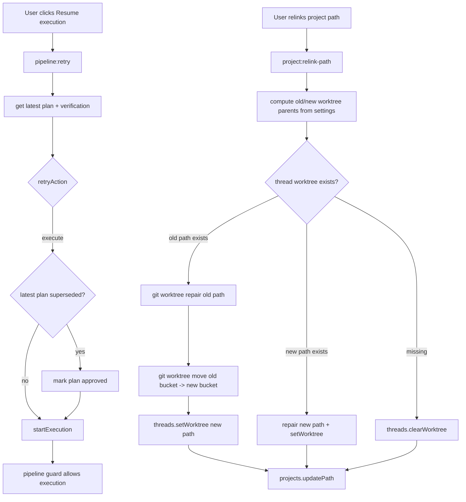
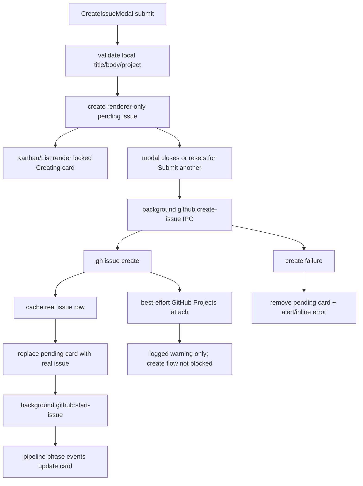
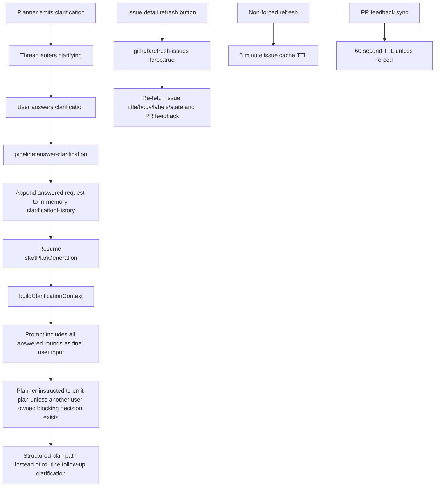
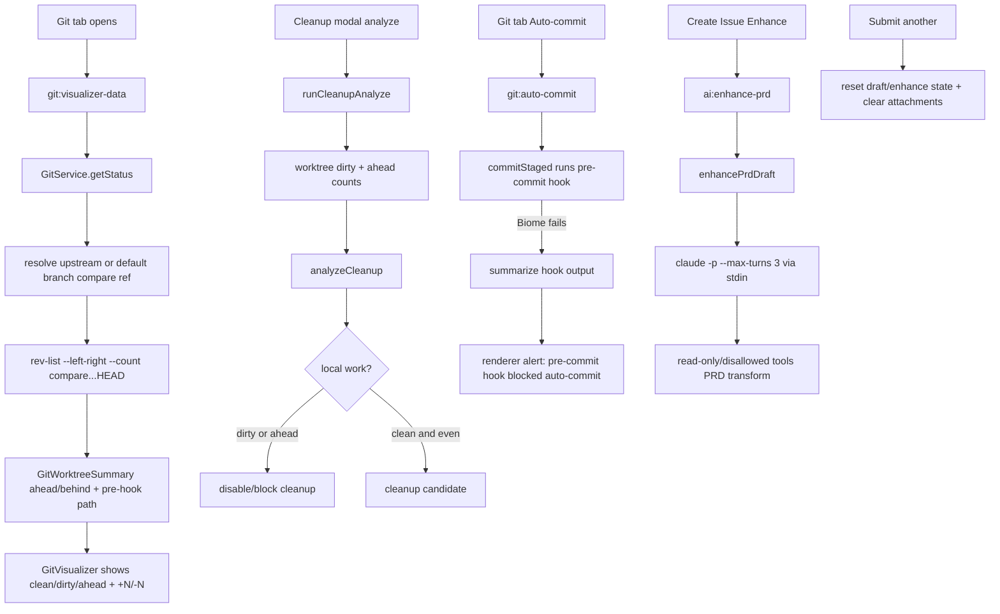
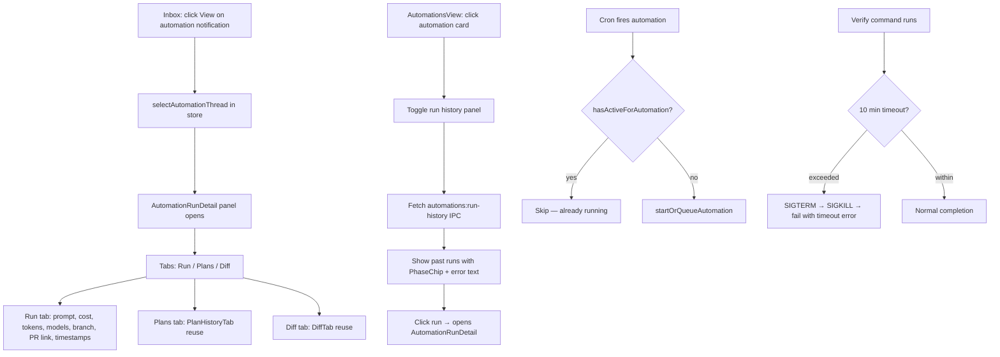

# Session 2026-04-29

## Session 1: Hunk-surgery split aborted; develop verified clean

### Context

Inherited mid-flight task: split a fat working tree (Quick Mode + Automations + Heatmap + Code Browser) into 4 pure feature commits via hunk surgery on cross-cut files (`packages/db/src/index.ts`, `apps/desktop/src/main/ipc/types.ts`, `apps/desktop/src/main/index.ts`, `packages/shared/src/types.ts`, `packages/shared/src/ipc-channels.ts`, schema files, etc.).

Mid-execution Vincent flagged that another agent was committing the same scope. Stopped, did not unwind. Other agent landed 5 commits cleanly. Verified develop is in good state and mapped QA gates from develop → master.

### System Flow

```
fat working tree
      │
      ├─► my hunk-surgery attempt (partial-staged db/index.ts, ipc/types.ts, main/index.ts)
      │   └─► WIPED by other agent's `git reset` before my commit landed
      │
      └─► other agent's pipeline:
           38a648a  shared: isRealGithubIssueNumber helper + workpad null-guard
           6e70e60  kanban: pulse yellow ring when any pipeline active
           195b8b1  costs: activity heatmap
           ae7f057  desktop: read-only Code browser tab
           f6c4a19  automations + quick-task (combined, not split)
           32de99b  chore: package version bumps + pipeline phase handling

verification on develop:
   bun run lint:fix    → 0 errors / 10 warnings   (exit 0)
   bun run typecheck   → 15/15 packages clean      (exit 0)

QA gates develop → master:
   PR opens          ─► .github/workflows/ci.yml
                         format:check + lint:repo + lint + typecheck + test
   merge to master   ─► coverage job (post-merge only)
   release           ─► publish.yml workflow_dispatch (manual)
```

### Affected Components

- **Git history:** 5 new commits on develop from collaborating agent
- **Working tree:** drained (5 minor dirty files remain — package version bumps + this session log)
- **No code authored by me this session** — surgery wiped before staging finalized
- **CI workflow understanding:** mapped and recorded

### What Was Done

- [x] Backed up full diff to `/tmp/full.patch` (3779 lines) + `/tmp/wt-backup/` for 13 cross-cut files
- [x] Started partial-staging via Edit-on-working-tree pattern: removed automations imports from `db/index.ts`, `ipc/types.ts`, `main/index.ts`
- [x] Halted on user interrupt (other agent collision)
- [x] Reported state honestly to user — confirmed no destructive unwind attempted
- [x] After other agent done: diffed HEAD vs my staging plan; concluded same content shipped through their commits
- [x] `bun run lint:fix` on develop — 0 errors, 10 warnings, exit 0
- [x] `bun run typecheck` on develop — 15/15 packages clean, exit 0
- [x] Read `.github/workflows/ci.yml` + `publish.yml` — mapped quality gates
- [x] Confirmed develop ready for PR to master

### Key Decisions

- **Stop on collision, don't unwind.** When user said another agent was committing same scope, froze immediately. Trying to reverse staged hunks while other agent ran `git reset` would corrupt history. Cost of pause < cost of double-write.
- **Accept other agent's split shape.** They combined automations + quick-task into one commit (`f6c4a19`) instead of the 4-pure-feature split Vincent originally wanted. Final tree consistent and tests pass — not worth re-splitting via revert+re-commit dance.
- **Lint:fix before typecheck.** Auto-fixed style first so typecheck output reflects only real type drift.
- **No new fixes this session.** Pre-existing LSP noise in `ProductMockup.tsx` and `TerminalDrawerHeader.test.tsx` flagged as out-of-scope per Quick Mode plan.

### Files Changed

None this session (my edits wiped before commit, all final commits authored by collaborating agent).

Working tree dirty (uncommitted):
- `apps/desktop/package.json` — version bump
- `apps/docs/package.json` — version bump
- `apps/web/package.json` — version bump
- `packages/ui/package.json` — version bump
- `bun.lock` — lockfile drift
- `.agents/SESSIONS/2026-04-28.md` — yesterday's session entry

### Mistakes and Fixes

- **Mistake:** Started hunk surgery without coordinating with team or checking for parallel agent activity. **Fix:** User caught it via own observation; halted on signal.
- **Mistake:** Edited `apps/desktop/src/main/index.ts` working-tree state to make staging tractable, leaving partial state when interrupted. **Fix:** Other agent's `git reset` cleaned it; no orphaned edits survived.
- **No data lost** — full diff snapshot at `/tmp/full.patch` plus `/tmp/wt-backup/` were never needed but stayed available throughout.

### Next Steps

- Open PR develop → master when Vincent is ready. CI runs format:check + lint:repo + lint + typecheck + test automatically.
- Optional pre-PR local run: `bun run lint` + `bun run test` (full turbo) for parity with CI.
- Decide whether to commit the version-bump dirty files standalone or fold into next feature commit.
- Pre-existing test-fixture drift (`automationId` in `utils.test.ts` / `pipeline.test.ts`, `ProductMockup.tsx`) is still unfixed — Vincent flagged out-of-scope; tackle as separate PR.

## Session 2: Retry superseded plans + project relink worktree repair

### Context

Vincent reported two ShipCode desktop failures:

1. Clicking `Resume execution` on a failed issue immediately failed with `Refusing to execute: latest plan is superseded.`
2. After renaming a project folder from `vitayai` to `verefwork`, the Git tab failed with `fatal: not a git repository` against old worktree paths under `~/.shipcode/worktrees/vitayai-0cd2bd`.

Root cause: retry chose the right action (`execute`) but passed a structured plan whose persisted latest plan row was still `superseded`, tripping the pipeline guard. Separately, `project:relink-path` only updated `projects.path`; it did not repair Git worktree `.git` pointers, move worktrees into the new project slug bucket, or clear DB worktree paths for directories that no longer existed.

### System Flow



### Affected Components

- **Desktop IPC:** retry routing and project relink handling
- **Git package:** `WorktreeManager` now exposes concrete-path `repair()` and `move()` helpers
- **DB records:** live ShipCode DB repaired for renamed `veref.work` worktrees
- **Tests:** added IPC regressions and WorktreeManager command coverage

### What Was Done

- [x] Diagnosed retry failure path from renderer copy → `pipeline:retry` → `getRetryAction` → `startExecution` guard.
- [x] Updated `pipeline:retry` so an execute retry re-activates a latest structured `superseded` plan by marking it `approved` before calling `startExecution`.
- [x] Added regression test for failed structured verification + latest superseded plan.
- [x] Inspected live ShipCode DB at `~/Library/Application Support/ShipCode/data/shipcode.db`.
- [x] Repaired live `veref.work` issue `#56` worktree:
  - `git worktree repair`
  - moved from `~/.shipcode/worktrees/vitayai-0cd2bd/...` to `~/.shipcode/worktrees/verefwork-8d53af/...`
  - updated `threads.worktree_path`
- [x] Cleared stale missing worktree pointers for old failed `veref.work` issues `#12`, `#16`, `#17`, `#18`, `#19`.
- [x] Added automatic relink repair in `project:relink-path`:
  - repair existing worktrees
  - move worktrees between old/new slug buckets
  - update persisted `threads.worktree_path`
  - clear missing stale paths
- [x] Added `WorktreeManager.repair()` and `WorktreeManager.move()` as concrete-path wrappers around Git.
- [x] Added focused tests for relink repair, missing stale worktrees, and WorktreeManager commands.

### Key Decisions

- **Keep the pipeline execution guard.** The guard correctly blocks stale/rejected plan execution. The bug was the desktop retry handler failing to make the selected persisted plan current before execution.
- **Mark superseded retry plans as `approved`, not `awaiting_approval`.** The user explicitly clicked `Resume execution`; resetting to approval would create another unnecessary pause.
- **Repair before `projects.updatePath`.** The handler needs both the old saved path and the new selected path to compute old/new worktree parents.
- **Use persisted thread worktree path as input, then update only after Git move succeeds.** This preserves the path-as-truth invariant and avoids pretending a worktree moved if Git refused it.
- **Clear missing stale paths.** If the old worktree directory is gone and the computed new one does not exist, keeping the DB pointer is worse than clearing it; future retry can create or rehydrate from a clean state instead of failing inside a dead path.

### Files Changed

- `apps/desktop/src/main/ipc/register-pipeline-handlers.ts`
- `apps/desktop/src/main/ipc/register-pipeline-handlers.test.ts`
- `apps/desktop/src/main/ipc/register-project-handlers.ts`
- `apps/desktop/src/main/ipc/register-project-handlers.test.ts`
- `packages/git/src/worktree.ts`
- `packages/git/src/worktree.test.ts`
- `.agents/SESSIONS/2026-04-29.md`

Live DB backup before manual repair:

- `~/Library/Application Support/ShipCode/data/shipcode.db.backup-20260429-111518`

### Verification

- `bunx vitest run src/main/ipc/register-pipeline-handlers.test.ts src/main/ipc/retry-phase.test.ts --config vitest.config.ts` in `apps/desktop` — passed.
- `bunx vitest run src/main/ipc/register-project-handlers.test.ts src/main/ipc/register-pipeline-handlers.test.ts src/main/ipc/retry-phase.test.ts --config vitest.config.ts` in `apps/desktop` — passed, 26 tests.
- `bun run typecheck` in `apps/desktop` — passed.
- `bunx vitest run src/worktree.test.ts --config vitest.config.ts` in `packages/git` — passed, 6 tests.
- `bun run typecheck` in `packages/git` — passed.
- `bun run build` in `packages/git` — passed.
- `bunx biome check --write ...` on touched files — no fixes needed.

### Mistakes and Fixes

- **Initial test command mistake:** Running the desktop IPC test with raw `bun test` failed because Electron mocks were not applied under that runner. **Fix:** reran through the package Vitest config from `apps/desktop`.
- **Type declaration mismatch:** Desktop typecheck initially failed because `@shipcode/git` declarations in ignored `dist/` did not include new `WorktreeManager` methods. **Fix:** ran `bun run build` in `packages/git` before desktop typecheck.
- **Manual DB repair was necessary once.** The code now handles future relinks, but the existing broken local state was repaired directly with a DB backup first.

### Next Steps

- Restart/reload the desktop app if the Git tab still shows a cached old error.
- Consider a small UI toast for `project:relink-path` summarizing how many worktrees were moved, repaired, or cleared.
- Broader local dirty tree still contains unrelated changes from other sessions; keep this fix scoped when committing.

## Session 3: Fix setup command PATH hydration for repo setup contracts

### Context

Vincent reported a failed ShipCode pipeline for issue `#48` ("Add Gemini CLI provider"). The UI showed:

`Setup failed: command failed (127): bun install — /bin/sh: bun: command not found`

Question to answer: whether the generated setup contract failed to detect Bun, or whether ShipCode executed the detected setup command incorrectly.

### System Flow

```mermaid
flowchart TD
    A[Project .shipcode/setup.json] --> B[Pipeline prepareWorktree]
    B --> C[runShellCommand]
    C -->|before fix: shell true, no env| D[/bin/sh with Electron PATH]
    D --> E[bun not found: exit 127]

    C -->|after fix: env shellExecEnv| F[/bin/sh with login-shell PATH]
    F --> G[~/.bun/bin/bun resolves]
    G --> H[setup continues]
```

### Affected Components

- **Pipeline runtime:** setup and verification shell command execution environment
- **Repo setup contracts:** existing `.shipcode/setup.json` detection behavior validated
- **Tests:** pipeline regression coverage for commands only available through hydrated PATH

### What Was Done

- [x] Inspected `.shipcode/setup.json`; confirmed setup was generated/detected correctly with `setupCommands: ["bun install"]`
- [x] Verified local login shell resolves Bun at `/Users/decod3rs/.bun/bin/bun`
- [x] Traced failure to `packages/pipeline/src/pipeline/runtime.ts` using `spawn(command, { cwd, shell: true, signal })` without `shellExecEnv()`
- [x] Patched `runShellCommand` to pass `env: shellExecEnv()` so repo setup and verify commands inherit the hydrated login-shell PATH
- [x] Added a focused regression test that puts a probe binary only on the hydrated PATH and proves setup can run it
- [x] Verified with targeted Vitest, package typecheck, and Biome

### Key Decisions

- **Fix execution environment, not detection.** The setup contract was correct. The runtime shell had the wrong PATH, so changing detection would only mask the real bug.
- **Reuse existing helper.** `@shipcode/agents` already exposes `shellExecEnv()` and health checks/GitHub CLI use it. Reusing it keeps setup command behavior consistent with the rest of ShipCode.
- **Cover generic PATH hydration.** The test uses a synthetic `shipcode-setup-probe` binary instead of Bun, so it proves the failure mode without depending on a local Bun install.

### Files Changed

- `packages/pipeline/src/pipeline/runtime.ts` — imports `shellExecEnv` and passes it into shell command spawns
- `packages/pipeline/src/pipeline.test.ts` — adds PATH hydration regression test
- `.agents/SESSIONS/2026-04-29.md` — documents this session

### Mistakes and Fixes

- **Mistake:** First tried `bun test packages/pipeline/src/pipeline.test.ts`; this suite is Vitest-specific and uses `vi.hoisted`, so Bun's native runner failed before running tests. **Fix:** reran with `bunx vitest run packages/pipeline/src/pipeline.test.ts`.
- **Potential confusion clarified:** The agent did detect Bun setup. The failure was not setup generation; it was command execution under Electron's stripped PATH.

### Verification

- `bunx vitest run packages/pipeline/src/pipeline.test.ts` — 85 tests passed
- `bun run --filter @shipcode/pipeline typecheck` — passed
- `bunx biome check packages/pipeline/src/pipeline/runtime.ts packages/pipeline/src/pipeline.test.ts` — passed

### Next Steps

- Restart the ShipCode desktop main process so the patched runtime is loaded.

## Session 4: Optimistic GitHub issue creation with locked Kanban cards

### Context

Vincent reported that creating GitHub issues from the desktop app felt slow because the modal blocked on `gh issue create`, GitHub Projects attachment, and pipeline start before the UI let him keep creating tasks. Desired behavior: validate and reflect the action immediately in the Kanban, while GitHub finishes in the background.

### System Flow



### Affected Components

- **Renderer modal:** create issue submit path is now optimistic and non-blocking
- **Renderer store:** tracks pending GitHub-created issues separately from persisted cache rows
- **Kanban UI package:** supports a renderer-only locked `Creating` state
- **GitHub IPC:** Project board attachment no longer blocks `github:create-issue`
- **Shared IPC/types:** create issue result typed as `{ issue, projectAttachWarning }`; issue records allow optional `syncState`

### What Was Done

- [x] Added optional `syncState?: 'creating'` to `GitHubIssueCacheRecord`
- [x] Added `pendingCreatedIssues` plus add/remove actions to the renderer app store
- [x] Created pending issue records in `CreateIssueModal` immediately after local validation
- [x] Let `Submit another` reset instantly while the background create continues
- [x] Reconciled pending cards to real GitHub issues once `gh issue create` returns
- [x] Started the pipeline after reconcile without keeping the modal blocked
- [x] Made Kanban/List cards with `syncState: 'creating'` visually locked and non-interactive
- [x] Disabled click, drag, keyboard open/start/comment, branch copy, and detail button for creating cards
- [x] Sorted creating cards to the top of their column
- [x] Changed GitHub Projects attachment to fire-and-forget after issue creation
- [x] Added a regression test proving the pending card appears while GitHub is still pending

### Key Decisions

- **Use renderer-only state, not a DB status.** This is a short-lived UI acknowledgement before GitHub assigns a real issue number. Persisting it would create cleanup/retry complexity for app restarts without much value.
- **Reuse `queued` as the pipeline column and `syncState` for the lock.** Adding a new persisted `IssuePipelineStatus` would ripple through DB queries, scheduler logic, filters, progress mapping, and docs. The board needed a UI lock, not a durable pipeline phase.
- **Do not block on GitHub Projects attachment.** The issue URL exists after `gh issue create`; adding it to the configured board can lag or fail independently. A warning in logs is enough for this best-effort operation.
- **Reconcile to `planning` optimistically before `github:start-issue` completes.** The user's intent after creating a full PRD issue is to start planning; showing that immediately keeps the board responsive while the actual phase events catch up.

### Files Changed

- `apps/desktop/src/renderer/components/CreateIssueModal.tsx`
- `apps/desktop/src/renderer/components/CreateIssueModal.test.tsx`
- `apps/desktop/src/renderer/components/ThreadPanel.tsx`
- `apps/desktop/src/renderer/stores/app-store.ts`
- `apps/desktop/src/main/ipc/register-github-handlers.ts`
- `packages/shared/src/types.ts`
- `packages/shared/src/ipc-channels.ts`
- `packages/ui/src/KanbanBoard.tsx`
- `packages/ui/src/kanban-board/IssueCardParts.tsx`
- `packages/ui/src/kanban-board/IssueListView.tsx`
- `packages/ui/src/kanban-board/utils.ts`
- `.agents/SESSIONS/2026-04-29.md`

### Verification

- `bun run typecheck` in `packages/shared` — passed
- `bun run typecheck` in `packages/ui` — passed
- `bun run typecheck` in `apps/desktop` — passed
- `bun vitest run src/renderer/components/CreateIssueModal.test.tsx` in `apps/desktop` — 9 tests passed
- `bun vitest run src/kanban-board/utils.test.ts src/kanban-board/KanbanBoard.keyboard.test.tsx` in `packages/ui` — 27 tests passed
- `bunx biome check ... --formatter-enabled=false --assist-enabled=false --files-ignore-unknown=true` on touched files — passed

### Mistakes and Fixes

- **Mistake:** First ran `bun --cwd <pkg> run typecheck`, which is not the valid Bun invocation shape. **Fix:** reran from each package directory with `bun run typecheck`.
- **Type declaration mismatch:** `packages/ui` and `apps/desktop` initially saw stale `@shipcode/shared` declarations from `packages/shared/dist`, so `syncState` and the `github:create-issue` return shape were missing. **Fix:** ran `bun run build` in `packages/shared`, then reran typechecks.
- **Test typing issue:** Optional-calling the deferred promise resolver narrowed to `never` in the new regression test. **Fix:** used a definite-assignment resolver with the concrete result type.

### Next Steps

- Manually smoke the desktop create flow after app reload: create normal issue, create with `Submit another`, and verify the pending card reconciles to the real GitHub issue number.
- Consider a small toast or notification for background GitHub create failures instead of `window.alert`, if failures become common.

## Session 4: Packaged ShipCode setup runner fixed and installed

### Context

Vincent retried after Session 3 and still saw:

`Setup failed: command failed (127): bun install — /bin/sh: bun: command not found`

The important clue was still `/bin/sh`. That proved the running app was not actually using the intended fix, or the setup runner was still delegating to Node's default shell. Investigation showed the active app was the packaged `/Applications/ShipCode.app`, loading `/Applications/ShipCode.app/Contents/Resources/app.asar`, not the local repo source.

### System Flow

```mermaid
flowchart TD
  A[Packaged ShipCode.app running from /Applications] --> B[app.asar main bundle]
  B --> C[old setup runner: spawn(command, shell: true)]
  C --> D[/bin/sh]
  D --> E[bun not found]

  F[Source patch] --> G[setup runner: spawn(loginShell, ['-ilc', command])]
  G --> H[Build agents + pipeline + desktop]
  H --> I[electron-builder --mac --dir]
  I --> J[Replace /Applications/ShipCode.app]
  J --> K[Force-stop stale ShipCode processes]
  K --> L[Launch rebuilt packaged app]
```

### Affected Components

- `packages/agents` — shared execution environment now hydrates PATH from the login shell and appends standard Bun/Homebrew/local paths.
- `packages/pipeline` — setup commands now execute through a trusted login shell directly instead of `shell: true`.
- `apps/desktop` packaged app — rebuilt and replaced `/Applications/ShipCode.app`.
- Local machine state — removed temporary `/Applications/ShipCode.app.backup-20260429-125520` after user requested cleanup.

### What Was Done

- [x] Confirmed the packaged desktop bundle still had the old setup runner even after source changes.
- [x] Changed `packages/pipeline/src/pipeline/runtime.ts` to resolve a trusted login shell (`$SHELL`, `/bin/zsh`, `/bin/bash`) and spawn it with `-ilc <setupCommand>`.
- [x] Kept `shellExecEnv()` but made it more robust:
  - reads login-shell PATH using `printf "%s" "$PATH"`
  - merges `~/.bun/bin`, `~/bin`, `~/.local/bin`, Homebrew, and system defaults
  - sets `BUN_INSTALL` when missing
  - invalidates cache when `SHELL`, `PATH`, or `BUN_INSTALL` changes
- [x] Added/updated tests for hydrated PATH and setup command execution.
- [x] Built `@shipcode/agents` and `@shipcode/pipeline`.
- [x] Ran `bun --filter @shipcode/desktop build:code`.
- [x] Ran `bunx electron-builder --mac --dir` in `apps/desktop`.
- [x] Verified new packaged `app.asar` contains `resolveSetupShell` / `TRUSTED_LOGIN_SHELLS` and no longer uses the setup `shell: true` path.
- [x] Replaced `/Applications/ShipCode.app` with the rebuilt app.
- [x] Force-stopped stale ShipCode processes that macOS kept alive from the old app and relaunched the rebuilt app.
- [x] Deleted `/Applications/ShipCode.app.backup-20260429-125520` when Vincent asked to clean it up.

### Key Decisions

- **Use the login shell directly for setup commands.** Passing a hydrated env to `shell: true` still left Node choosing `/bin/sh`, which made the failure text and runtime behavior harder to reason about. Spawning `$SHELL -ilc` makes setup behavior match the user's terminal.
- **Patch the installed packaged app, not only source.** Vincent was using `/Applications/ShipCode.app`; local package builds would not affect retries until the app bundle was replaced.
- **No backup retention after explicit cleanup request.** The installed app was already replaced successfully and verified; backup was deleted immediately when requested.

### Files Changed

- `packages/agents/src/health-check.ts`
- `packages/agents/src/health-check.test.ts`
- `packages/pipeline/src/pipeline/runtime.ts`
- `packages/pipeline/src/pipeline.test.ts`
- `.agents/SESSIONS/2026-04-29.md`

Generated/rebuilt artifacts (not shown as source edits in `git status`):

- `packages/agents/dist/**`
- `packages/pipeline/dist/**`
- `apps/desktop/dist/**`
- `apps/desktop/out/mac-arm64/ShipCode.app`
- `/Applications/ShipCode.app`

### Verification

- `bun --filter @shipcode/agents test -- health-check.test.ts` — passed, 53 tests.
- `bun --filter @shipcode/pipeline test -- pipeline.test.ts` — passed, 86 tests.
- `bun --filter @shipcode/agents typecheck` — passed.
- `bun --filter @shipcode/pipeline typecheck` — passed.
- `bunx biome check packages/pipeline/src/pipeline/runtime.ts packages/pipeline/src/pipeline.test.ts packages/agents/src/health-check.ts packages/agents/src/health-check.test.ts --files-ignore-unknown=true` — passed.
- `bun --filter @shipcode/agents build` — passed.
- `bun --filter @shipcode/pipeline build` — passed.
- `bun --filter @shipcode/desktop build:code` — passed.
- `cd apps/desktop && bunx electron-builder --mac --dir` — passed.
- `strings /Applications/ShipCode.app/Contents/Resources/app.asar | rg "resolveSetupShell|TRUSTED_LOGIN_SHELLS"` — confirmed rebuilt bundle includes the new runner.

### Mistakes and Fixes

- **Mistake:** Session 3 stopped at source/package tests and told Vincent to restart, but the app he was using was the installed packaged app with stale `app.asar`. **Fix:** rebuilt the packaged desktop app, replaced `/Applications/ShipCode.app`, and force-stopped old processes.
- **Mistake:** Initial env-only fix still allowed Node to report `/bin/sh` because `shell: true` delegates shell selection. **Fix:** replaced `shell: true` with explicit login-shell spawn.
- **Process gotcha:** `osascript quit app "ShipCode"` left old ShipCode processes alive. **Fix:** used `pkill -f '/Applications/ShipCode.app/Contents'` before relaunching.

### Next Steps

- Retry the failed task in ShipCode. The exact `/bin/sh: bun: command not found` path should be gone from the active app.
- When committing, keep this scoped to the four source/test files above; generated package/app build outputs should not be committed unless the repo normally tracks them.

## Session 4: Planner clarification loop guardrail + stale issue action check

### Context

Vincent shared a failed issue detail screenshot:

`Planning clarification limit reached after 2 rounds.`

The failing issue was `feat(credits): topbar pill for Genfeed + connected provider balances`. The planner had already asked two clarification rounds, then asked again and tripped `MAX_CLARIFICATION_ROUNDS`. Vincent also asked whether ShipCode has actions to check whether a GitHub issue is stale.

### System Flow



### Affected Components

- **Planner prompt:** default plan-generation skill and format reinforcement now treat clarification as a last resort.
- **Pipeline context:** added in-memory `clarificationHistory` so multiple answered rounds are preserved for the next planner pass.
- **Desktop IPC:** `pipeline:answer-clarification` now appends answered clarification into the active context before resuming planning.
- **GitHub issue freshness:** confirmed existing forced refresh path; no dedicated stale-check IPC exists.

### What Was Done

- [x] Traced clarification cap to `packages/pipeline/src/pipeline/planning-phases.ts` `enterClarifying`.
- [x] Found planner prompt was too broad: "missing information that would materially change the plan" encouraged clarification for routine implementation choices.
- [x] Added `clarificationHistory` to `PipelineContext` and context hydration.
- [x] Preserved answered clarification rounds in `pipeline:answer-clarification`.
- [x] Built a combined clarification context block that tells the planner prior answers are final user input.
- [x] Tightened `skills/plan-generation/SKILL.md` so clarification is reserved for incompatible product/security/legal/destructive-data/billing/external-provider decisions.
- [x] Regenerated `packages/agents/src/skills/defaults.generated.ts` with `bun run build:skills`.
- [x] Updated prompt snapshots and added a regression test proving prior clarification answers reach the next planning prompt.
- [x] Checked issue freshness actions:
  - `github:refresh-issues` exists and supports `force`.
  - Issue detail refresh button calls it with `force: true`.
  - Normal refresh has `ISSUE_REFRESH_TTL_MS = 5 * 60_000`.
  - PR feedback sync has `PR_FEEDBACK_SYNC_TTL_MS = 60_000`.
  - Startup cleanup resets unclaimed queued issues, but there is no explicit per-issue stale-check action.

### Key Decisions

- **Prompt guardrail instead of increasing the cap.** Raising `MAX_CLARIFICATION_ROUNDS` would make the UX failure slower. The better fix is to stop routine planner indecision after the user already answered.
- **Keep clarification possible for truly blocking user-owned decisions.** The planner can still ask when there are incompatible choices with real product/security/data/billing consequences.
- **In-memory history is enough for live clarification chains.** Persisted DB stores the latest answered clarification snapshot for display/rehydration; active multi-round history only needs to survive the live planning loop.
- **Fresh runs clear clarification history.** `startFromGitHubIssue`, quick tasks, manual `pipeline:start`, automation runs, and successful plan parsing reset the history to avoid leaking old answers into new attempts.

### Files Changed

- `skills/plan-generation/SKILL.md`
- `packages/agents/src/prompts/plan-prompt.ts`
- `packages/agents/src/prompts/__snapshots__/plan-prompt.test.ts.snap`
- `packages/agents/src/skills/defaults.generated.ts`
- `packages/pipeline/src/types.ts`
- `packages/pipeline/src/pipeline/context.ts`
- `packages/pipeline/src/pipeline/planning-phases.ts`
- `packages/pipeline/src/pipeline.ts`
- `packages/pipeline/src/pipeline.test.ts`
- `apps/desktop/src/main/ipc/register-pipeline-handlers.ts`
- `apps/desktop/src/main/pipeline-scheduler.ts`
- `.agents/SESSIONS/2026-04-29.md`

### Verification

- `bun run build:skills` — passed.
- `bunx vitest run packages/agents/src/prompts/plan-prompt.test.ts` — passed, 7 tests.
- `bunx vitest run packages/pipeline/src/pipeline.test.ts -t "carries prior clarification answers"` — passed.
- `bunx vitest run apps/desktop/src/main/ipc/register-pipeline-handlers.test.ts -t "pipeline:answer-clarification"` — passed.
- `bun --filter @shipcode/pipeline typecheck` — passed.
- `bun --filter @shipcode/desktop typecheck` — passed.
- `bun --filter @shipcode/agents typecheck` — passed.
- `bunx biome check --write ...` on touched files — clean after formatting.

Full `packages/pipeline/src/pipeline.test.ts` still has one unrelated failing test when run alone:

- `keeps successful test output in the verification prompt after autonomous execution`
- Failure: expected provider spawn count 2, got 1.
- This was not introduced by the clarification changes; the new focused regression passes independently.

### Mistakes and Fixes

- **Snapshot mismatch expected:** Prompt text changed, so `plan-prompt` snapshots failed on first run. Fixed by updating snapshots with Vitest `-u`.
- **Initial type/lint drift avoided:** Adding `clarificationHistory` required initializing it in every fresh context path; added explicit resets after reviewing the diff.
- **Observed unrelated dirty state:** Worktree already had many uncommitted changes from prior sessions/agents. This session stayed scoped and did not revert unrelated files.

### Next Steps

- Restart/reload ShipCode desktop before retrying the failed Genfeed credits issue, so the main process loads the updated planner/pipeline code.
- Retry the failed issue with `Re-plan`; the answered clarification context should now push the planner toward a concrete plan.
- Consider adding a dedicated `github:refresh-issue` or `github:check-issue-stale` action if per-issue freshness becomes important; current action refreshes the whole project issue cache.
- Investigate the unrelated autonomous test-output handoff test failure separately.
- Resume execution on issue `#48`; setup should now find `bun`.
- Consider a follow-up hardening pass for other direct `spawn(..., shell: true)` sites so all user-facing shell commands consistently use the hydrated env.

---

## Session 4: Fix "Open in" launching Cursor + simplify to single-click

### Context

Two bugs reported by Vincent via screenshot:
1. Opening project context menu "Open in" submenu auto-launched Cursor IDE — `osascript 'path to application "Cursor"'` activates apps as macOS side effect. Runs every ~30s via integration check.
2. "Open in" showed submenu with all editors per-project — Vincent wanted single-click using global default (already in Settings > Integrations).

### System Flow

```
BEFORE:
  ProjectSidebar mount → useQuery('integrations') every 30s
    → checkDesktopApps() → osascript 'path to application "Cursor"' ← LAUNCHES APP
  Context menu: "Open in >" → submenu with 5 targets

AFTER:
  ProjectSidebar mount → useQuery('integrations') every 30s
    → checkDesktopApps() → fileExists('/Applications/Cursor.app') ← NO SIDE EFFECTS
  Context menu: "Open in Cursor" → single click, uses global default
```

### What Was Done

- [x] Replaced `osascript` with `fileExists()` on `/Applications/{App}.app` + `~/Applications/{App}.app`
- [x] Made Finder and Terminal always-available (system apps)
- [x] Replaced `<DropdownMenuSub>` submenu with single `<DropdownMenuItem>` using global default
- [x] Cleaned up unused imports and constants
- [x] Updated tests for single-item UX
- [x] Typecheck: 15/15 clean | Tests: 13/13 pass

### Files Changed

- `packages/agents/src/health-check.ts` — osascript → fileExists, added `ALWAYS_AVAILABLE_APPS`, `DESKTOP_APP_BUNDLE_NAMES`
- `apps/desktop/src/renderer/components/ProjectSidebar.tsx` — submenu → single item, removed `DropdownMenuSub*`, `PROJECT_OPEN_TARGETS`
- `apps/desktop/src/renderer/components/ProjectSidebar.test.tsx` — rewrote helper + tests

### Mistakes and Fixes

- Removed `Check` import thinking only used in submenu — LSP caught it used elsewhere. Restored immediately.

### Next Steps

- Test in running app: verify single "Open in Cursor" item, no app launch side effect
- Commit when ready

---

## Session 7: UI primitive cleanup, syntax highlighting fix, spacing alignment, stale dist discovery

### Context

Continuation of production build testing. Multiple UI issues found during manual QA of the DMG:
1. Raw HTML `<select>` in Code browser tab instead of `@shipshitdev/ui` Select
2. No syntax highlighting colors in Code browser (all white text)
3. Raw HTML `<input>` and `<input type="checkbox">` in Settings > Integrations
4. Settings sidebar spacing mismatched with ProjectSidebar
5. Setup contract `bun install` failing with `command not found` (stale package dist)

### System Flow

```
Code browser worktree picker:
  BEFORE: raw <select> + <option>
  AFTER:  Select + SelectTrigger + SelectValue + SelectContent + SelectItem

Syntax highlighting:
  BEFORE: codeToTokensBase() → silently fails → tokens=null → plain white text
  AFTER:  codeToTokens() → returns { tokens } → colors render

Integrations settings:
  BEFORE: 3x raw <input type="checkbox"> + 3x raw <input>
  AFTER:  3x Switch + 3x Input from @shipshitdev/ui

Settings sidebar spacing:
  BEFORE: pt-2, px-3, no space-y
  AFTER:  pt-3, pl-3 pr-5, space-y-0.5 (matches ProjectSidebar)

Stale dist issue:
  Pipeline runtime.ts source had env: shellExecEnv() fix
  But packages/pipeline/dist/ was stale (built from old source)
  Vite bundled from dist/ not source → fix not in DMG
  Fix: rebuild packages/pipeline + packages/agents before desktop build
```

### What Was Done

- [x] Replaced raw `<select>` in code-browser.tsx with `@shipshitdev/ui` Select primitives
- [x] Fixed syntax highlighting: `codeToTokensBase` → `codeToTokens` (shiki v4 higher-level API)
- [x] Replaced 3x raw `<input type="checkbox">` with `Switch` in IntegrationsSettingsSection
- [x] Replaced 3x raw `<input>` with `Input` in IntegrationsSettingsSection
- [x] Replaced raw reload `<button>` with `Button variant="destructive"` in App.tsx
- [x] Aligned SettingsNavigation spacing to match ProjectSidebar
- [x] Full audit: no remaining raw `<select>`, `<input>`, or `<textarea>` in renderer
- [x] Discovered stale dist issue: workspace packages resolve to pre-built dist/
- [x] Rebuilt packages/pipeline + packages/agents, verified shellExecEnv in final bundle
- [x] Built DMG 3 times (last build includes all fixes)

### Key Decisions

- **`codeToTokens` over `codeToTokensBase`:** shiki v4 `codeToTokensBase` silently failing. `codeToTokens` is proper high-level API.
- **Switch over Checkbox:** Settings toggles → Switch primitive with `onCheckedChange`.
- **Keep raw `<button>` for resize handles:** No `unstyled` variant in `@shipshitdev/ui`.
- **Rebuild workspace packages before desktop build:** Vite resolves from `dist/`, not source.

### Files Changed

- `packages/ui/src/SyntaxHighlightedCode.tsx` — codeToTokensBase → codeToTokens
- `apps/desktop/src/renderer/features/project/code-browser.tsx` — raw select → UI Select
- `apps/desktop/src/renderer/components/settings-panel/IntegrationsSettingsSection.tsx` — raw inputs → Input/Switch
- `apps/desktop/src/renderer/App.tsx` — Button import, reload → Button destructive
- `apps/desktop/src/renderer/components/SettingsNavigation.tsx` — spacing aligned
- `packages/pipeline/dist/` — rebuilt (shellExecEnv fix)
- `packages/agents/dist/` — rebuilt

### Mistakes and Fixes

- **Mistake:** Tried adding `unstyled` variant to `packages/ui/src/primitives/button.tsx` thinking it was `@shipshitdev/ui`. It's `@shipcode/ui`. **Fix:** Reverted.
- **Mistake:** Built DMG without rebuilding workspace package dists. **Fix:** Rebuilt both packages first.
- **Lesson:** Always `bun run build` in modified workspace packages before desktop build.

### Package structure (for future sessions)

- `@shipshitdev/ui` = external npm, source at `/Users/decod3rs/www/shipshitdev/public/packages/ui`
- `@shipcode/ui` = internal workspace at `packages/ui/`
- `@shipcode/agents`, `@shipcode/pipeline` = internal workspace, resolve to `dist/` in builds

### Next Steps

- Test DMG: syntax highlighting, worktree Select, Switch toggles, settings spacing
- Test pipeline: setup contract `bun install` should succeed now
- Commit all changes when QA passes

---

## Session 8: Re-detect button spin icon

### Context

Vincent wanted the "Re-detect" button in Project Settings > Setup tab to show a spinning icon while re-detecting project profiles, matching the pattern used across the app (Git tab refresh, Kanban refresh, terminal restart, etc.).

### What Was Done

- [x] Replaced `LoadingButtonContent` wrapper with `RefreshCw` icon + `animate-spin` class on `detectPending`
- [x] Swapped `LoadingButtonContent` import for `RefreshCw` from `@shipshitdev/ui`

### Files Changed

- `apps/desktop/src/renderer/components/project-settings-modal/ProjectSettingsSetupTab.tsx` — `LoadingButtonContent` → `RefreshCw` icon with conditional `animate-spin`

### Key Decisions

- **Match existing pattern.** `RefreshCw` + `animate-spin` is used in 10+ places across the app (`ProjectSettingsGeneralTab`, `BoardToolbar`, `InstantTerminalPane`, `GitVisualizer`, `PrdTab`, etc.). Consistent UX.
- **Keep `detectPending` wiring as-is.** Already bound to react-query `isFetching` from the setup refetch — no backend changes needed.

### Next Steps

- Reload app and verify spinning icon on Re-detect click
- Commit when ready

---

## Session 9: Git safety visibility, auto-commit hook alerts, PRD enhance retry reset

### Context

Vincent reported three linked ShipCode desktop problems while validating the Git tab and Create Issue flow:

1. Git Visualizer only showed `clean` / `dirty`, so a worktree with committed local work could look safe to delete.
2. Auto-commit surfaced a huge Biome pre-commit failure wall instead of a clear hook alert.
3. Create Issue `Submit another` followed by PRD enhancement failed on the second issue with `Claude CLI exited 1: Reached maximum number of turns (1)`.

The first issue was a safety problem: dirty state alone does not capture local commits ahead of the compare branch. The third issue was not React retry state; the PRD enhancer had a stale Claude CLI invocation path capped at one turn.

### System Flow



### Affected Components

- **Git package:** branch divergence and pre-commit hook detection in `GitService`
- **Desktop main IPC:** Git visualizer payload, cleanup analysis, auto-commit failure shaping
- **Shared types:** ahead/behind fields on git state, worktree summaries, cleanup items, and auto-commit results
- **UI package:** Git Visualizer worktree cards now show local commit divergence and pre-hook badge
- **Desktop renderer:** cleanup modal blocks ahead branches, auto-commit alert is concise, Create Issue reset is explicit
- **Agents package:** PRD enhancer Claude invocation restored to `--max-turns 3` with hydrated shell env

### What Was Done

- [x] Added `aheadCount`, `behindCount`, `compareRef`, and `preCommitHookPath` to git status/worktree summaries.
- [x] Rendered Git Visualizer divergence as `+N ahead / -N behind vs <ref>`.
- [x] Changed clean worktrees with local commits to show an `ahead` warning badge instead of `clean`.
- [x] Added a `pre-hook` badge when a pre-commit hook is configured.
- [x] Extended cleanup analysis so local commits ahead of the compare ref count as unsafe local work.
- [x] Disabled cleanup selection for branches/worktrees with local commits ahead.
- [x] Added backend cleanup guards that refuse deletion if ahead counts slip through the UI.
- [x] Summarized auto-commit failures to the first 8 useful lines / 800 chars.
- [x] Marked likely pre-commit hook failures in `AutoCommitResult` so the renderer can say the hook blocked auto-commit.
- [x] Fixed Biome errors from `AutomationRunDetail.tsx` by removing non-null assertions.
- [x] Fixed Biome dependency warning in `OnboardingWizard.tsx`.
- [x] Restored PRD enhancement Claude invocation to `--max-turns 3` and kept it read-only via disallowed tools.
- [x] Added explicit `Submit another` draft reset for body, metadata, error, enhancing state, quick text, focus, and attachment cleanup path.
- [x] Fixed PRD generator test mock so Vitest covers the child-process args.

### Key Decisions

- **Ahead commits are local work.** A clean working tree can still contain valuable unpushed/unmerged commits. Cleanup should block on `aheadCount > 0`, not only `isDirty`.
- **Compare against upstream when available, otherwise the project default branch.** This gives useful divergence for normal branches and ShipCode worktrees without requiring every branch to have an upstream.
- **Keep cleanup defense in both UI and main process.** The modal disables unsafe candidates, but `runCleanupApply` also refuses deletion if ahead counts are present.
- **Clamp hook output, preserve full main-process logs.** The renderer needs an actionable alert; the full hook output already goes to logs.
- **Fix PRD enhancer turn cap instead of adding a UI retry hack.** The failure was `--max-turns 1`, not a modal retry counter.
- **Continue piping Claude prompts over stdin.** Preserves the repo rule that frontmatter prompts must not be passed as argv.

### Files Changed

- `packages/shared/src/types.ts`
- `packages/git/src/git-service.ts`
- `packages/git/src/git-service.test.ts`
- `packages/git/src/cleanup-analyzer.ts`
- `packages/git/src/cleanup-analyzer.test.ts`
- `apps/desktop/src/main/git-workflows.ts`
- `apps/desktop/src/main/ipc/register-project-handlers.ts`
- `packages/ui/src/GitVisualizer.tsx`
- `packages/ui/src/component-regression.test.tsx`
- `apps/desktop/src/renderer/components/CleanupModal.tsx`
- `apps/desktop/src/renderer/features/project/project-git-visualizer.tsx`
- `apps/desktop/src/renderer/components/AutomationRunDetail.tsx`
- `apps/desktop/src/renderer/components/onboarding/OnboardingWizard.tsx`
- `apps/desktop/src/renderer/components/CreateIssueModal.tsx`
- `packages/agents/src/prd-generator.ts`
- `packages/agents/src/prd-generator.test.ts`
- `.agents/SESSIONS/2026-04-29.md`

### Verification

- `bunx biome check --write ...` on touched files — passed.
- `bun test packages/git/src/git-service.test.ts packages/git/src/cleanup-analyzer.test.ts` — passed, 12 tests.
- `bunx vitest run packages/ui/src/component-regression.test.tsx --environment jsdom` — passed, 9 tests.
- `bunx vitest run apps/desktop/src/main/ipc/register-project-handlers.test.ts` — passed, 7 tests.
- `bunx turbo run typecheck --filter=@shipcode/desktop --filter=@shipcode/git --filter=@shipcode/ui --filter=@shipcode/shared` — passed.
- `bunx vitest run packages/agents/src/prd-generator.test.ts apps/desktop/src/renderer/components/CreateIssueModal.test.tsx` — passed, 11 tests.
- `bunx turbo run typecheck --filter=@shipcode/agents --filter=@shipcode/desktop` — passed.

### Mistakes and Fixes

- **Test runner mismatch:** `bun test packages/ui/src/component-regression.test.tsx` failed because `document` is unavailable without the DOM environment. **Fix:** reran with `bunx vitest ... --environment jsdom`.
- **Test runner mismatch:** `bun test packages/agents/src/prd-generator.test.ts` failed because Bun's runner does not support `vi.hoisted`. **Fix:** reran under Vitest and repaired the child-process mock.
- **Biome validator script issue:** the standalone `biome-validator` helper reported invalid JSON on `biome.json`, while Biome itself accepted and checked the config. Treated as skill-script incompatibility, not repo failure.
- **Existing dirty worktree:** many unrelated files were already modified by other sessions/agents. This session stayed scoped and did not revert unrelated changes.

### Next Steps

- Restart/reload the Electron main process so `dist/main/index.js` picks up the PRD enhancer and Git workflow changes.
- In the Git tab, refresh and verify worktree cards show `ahead` / `+N ahead` before using Cleanup.
- Re-run auto-commit on a known dirty worktree and confirm Biome hook failures show as concise pre-commit alerts.
- Re-test Create Issue with `Submit another` and PRD Enhance on the second issue; it should no longer fail from `--max-turns 1`.

---

## Session 10: Unified PageHeader component across all views

### Context

Vincent noticed inconsistent page headers across the desktop app. Automations had a bordered header with title + subtitle + action button; Overview had a slightly different styled header; Inbox/Activity/Costs had inline `h2` headers inside the scrollable area with no border or subtitle. Vincent wanted all pages to use the same header component with consistent styling.

### System Flow

```
BEFORE:
  Automations: <header> border-b, text-lg, subtitle text-[13px], action button
  Overview:    <div> border-b, text-base, subtitle text-xs text-muted
  Inbox:       inline <h2> text-sm inside scroll area, action buttons inline
  Activity:    standalone <h2> text-sm inside scroll area, no actions
  Costs:       inline <h2> text-sm inside scroll area, USD/tokens toggle
  Skills:      no page header, just section headers
  Terminal:    <div> border-b, text-sm font-medium, action buttons

AFTER:
  All pages:   <PageHeader title subtitle? actions?/>
               border-b, text-lg font-semibold, subtitle text-[13px] text-secondary
               action buttons in right-aligned flex container
```

### Affected Components

- **New component:** `PageHeader.tsx` — reusable page header with title, subtitle, actions slot
- **All top-level views:** Overview, Inbox, Activity, Skills, Automations, Costs, Terminal Sessions

### What Was Done

- [x] Created `apps/desktop/src/renderer/components/PageHeader.tsx` with `title`, `subtitle`, and `actions` props
- [x] Replaced custom header in `AutomationsView` with `PageHeader`
- [x] Replaced custom header in `OverviewView` with `PageHeader`
- [x] Moved Inbox inline header + action buttons into `PageHeader` above scroll area
- [x] Moved Activity inline header into `PageHeader` above scroll area, added subtitle
- [x] Moved Costs inline header + USD/tokens toggle into `PageHeader` above scroll area, added subtitle
- [x] Added `PageHeader` to `SkillsView` (had no page header), wrapped two-panel layout
- [x] Replaced Terminal Sessions custom header with `PageHeader`
- [x] Full typecheck — clean
- [x] Full desktop build — passed (DMG produced)

### Files Changed

- `apps/desktop/src/renderer/components/PageHeader.tsx` (new)
- `apps/desktop/src/renderer/features/automations/automations-view.tsx`
- `apps/desktop/src/renderer/components/OverviewView.tsx`
- `apps/desktop/src/renderer/components/InboxView.tsx`
- `apps/desktop/src/renderer/components/ActivityView.tsx`
- `apps/desktop/src/renderer/components/CostsView.tsx`
- `apps/desktop/src/renderer/components/SkillsView.tsx`
- `apps/desktop/src/renderer/components/InstantView.tsx`

### Key Decisions

- **Standardized on Automations header style.** `text-lg font-semibold`, `text-[13px] text-secondary` subtitle, `border-b border-border`, `px-6 py-4`. This was the most complete existing pattern.
- **Moved headers above scroll area.** Inbox/Activity/Costs previously had headers inside `overflow-y-auto`. Now headers are fixed above content, consistent with Overview/Automations.
- **Actions as ReactNode slot.** Flexible enough for single buttons, button groups, and toggle controls without over-engineering.

### Verification

- `bunx tsc --noEmit` in `apps/desktop` — no errors for any modified files
- `bun run build --filter=@shipcode/desktop` — 7/7 tasks passed, DMG produced

### Next Steps

- Reload app and verify all pages show consistent header with border separator
- Consider adding PageHeader to any future views as they're created

---

## Session 11: Automation detail view, run history, PR link, shell timeout + dedup guard

### Context

Vincent reported multiple issues with automations:
1. Automated tasks ("[Auto] clean") in Inbox had no detail view — clicking "View" did nothing because `IssueDetail` requires `GitHubIssueCacheRecord`.
2. Automation detail panel had no retry button for failed runs.
3. Automation cards showed "7 total" runs but no way to browse past runs.
4. Automation runs stuck in TESTING for 4+ hours — three concurrent "[Auto] clean" at 82% for 4h3m, 3h14m, 2h15m.
5. Automation detail panel missing PR link and diff info.

### System Flow



### Affected Components

- **Renderer store:** `activeAutomationThreadId` + `selectAutomationThread` action, mutually exclusive with `activeIssue`
- **Renderer InboxView:** automation thread routing when clicking "View" on automation notifications
- **AutomationRunDetail (new):** full detail panel with tabs (Run/Plans/Diff), retry, cancel, PR link
- **AutomationsView:** expandable run history on automation cards with click-to-detail
- **App.tsx:** layout wiring for AutomationRunDetail in both expanded and right-panel modes
- **Pipeline runtime:** 10-minute timeout on `runShellCommand` for verify commands
- **Pipeline scheduler:** dedup guard — skip automation if thread already active
- **DB threads:** `hasActiveForAutomation` query + `listByAutomationId` query
- **IPC channels:** `automations:run-history` channel
- **Automation handlers:** `run-history` handler

### What Was Done

- [x] Added `activeAutomationThreadId` and `selectAutomationThread` to Zustand store
- [x] Updated all navigation actions to clear `activeAutomationThreadId` (mutually exclusive with `activeIssue`)
- [x] Added automation thread routing in InboxView `goToIssue`
- [x] Created `AutomationRunDetail.tsx` component with Run/Plans/Diff tabs
- [x] Added retry button for failed automation runs (`pipeline:retry` IPC)
- [x] Added cancel button for active runs
- [x] Added PR link section (constructs URL from `thread.githubPrNumber` + `thread.githubRepo`)
- [x] Wired `AutomationRunDetail` into `App.tsx` layout (expanded mode + right panel)
- [x] Added expandable run history to automation cards in `AutomationsView`
- [x] Added `listByAutomationId` query to `packages/db/src/queries/threads.ts`
- [x] Added `hasActiveForAutomation` query to prevent concurrent duplicate automation runs
- [x] Added `automations:run-history` IPC channel and handler
- [x] Added 10-minute timeout to `runShellCommand` in pipeline runtime (SIGTERM → 5s grace → SIGKILL)
- [x] Added dedup guard in `startOrQueueAutomation` — checks for active thread before launching
- [x] Fixed unused `Badge` import in `automations-view.tsx`
- [x] Updated pipeline-scheduler test mock with `hasActiveForAutomation`

### Key Decisions

- **Separate component, not IssueDetail refactor.** `IssueDetail` is 1500 lines deeply coupled to `GitHubIssueCacheRecord`. Clean boundary avoids refactor risk.
- **Mutually exclusive panels.** `selectAutomationThread` clears `activeIssue` and vice versa. Only one detail panel open at a time.
- **10-minute timeout is aggressive enough.** Most verify commands should finish in minutes. A stuck test suite running for hours wastes money and blocks slots.
- **DB-level dedup over in-memory guard.** The `inFlight` Map in `AutomationScheduler` only tracked the brief `startOrQueueAutomation` call, not actual pipeline execution. Checking `threads.hasActiveForAutomation` catches any thread in a non-terminal phase.
- **Reuse existing tab components.** `DiffTab` and `PlanHistoryTab` work with just `threadId` — no `GitHubIssueCacheRecord` dependency.
- **Construct PR URL from Thread fields.** Thread has `githubPrNumber` and `githubRepo` — enough for `https://github.com/{repo}/pull/{number}`.

### Files Changed

- `apps/desktop/src/renderer/stores/app-store.ts`
- `apps/desktop/src/renderer/components/InboxView.tsx`
- `apps/desktop/src/renderer/components/AutomationRunDetail.tsx` (new)
- `apps/desktop/src/renderer/App.tsx`
- `apps/desktop/src/renderer/features/automations/automations-view.tsx`
- `apps/desktop/src/main/ipc/register-automation-handlers.ts`
- `apps/desktop/src/main/pipeline-scheduler.ts`
- `apps/desktop/src/main/pipeline-scheduler.test.ts`
- `packages/db/src/queries/threads.ts`
- `packages/shared/src/ipc-channels.ts`
- `packages/pipeline/src/pipeline/runtime.ts`

### Verification

- `bun run --filter @shipcode/db typecheck` — passed
- `bun run --filter @shipcode/db test` — 274 tests passed
- `bun run --filter @shipcode/pipeline typecheck` — passed
- `bun run --filter @shipcode/pipeline test` — 122 tests passed
- `bun run --filter @shipcode/desktop typecheck` — passed (pre-existing errors in `register-project-handlers.ts` from other uncommitted work, zero errors in automation files)
- `bunx vitest run src/main/pipeline-scheduler.test.ts src/main/automation-scheduler.test.ts` — 25 tests passed

### Mistakes and Fixes

- **`lucide-react` import error:** Desktop renderer imports icons from `@shipshitdev/ui`, not `lucide-react` directly.
- **Badge `variant="secondary"` doesn't exist:** Changed to `variant="default"`.
- **`thread` variable scoping in InboxView:** Initial edit placed automation check outside the block where `thread` was declared. Moved inside `if (!match)` block.
- **LSP `hasActiveForAutomation` not found:** LSP hadn't picked up DB change. Fixed by running `bun run --filter @shipcode/db build`.
- **Pipeline scheduler test mock missing `hasActiveForAutomation`:** Added `vi.fn(() => false)`.

### Next Steps

- Cancel the 3 stuck "[Auto] clean" tasks from the UI (or restart the app)
- Rebuild and reinstall the packaged app so the timeout and dedup guard take effect
- Verify automation detail opens from Inbox "View" and shows error, prompt, plans, diffs
- Verify run history expands on automation cards and clicking a run opens detail
- Consider making the 10-minute timeout configurable per project or in settings
