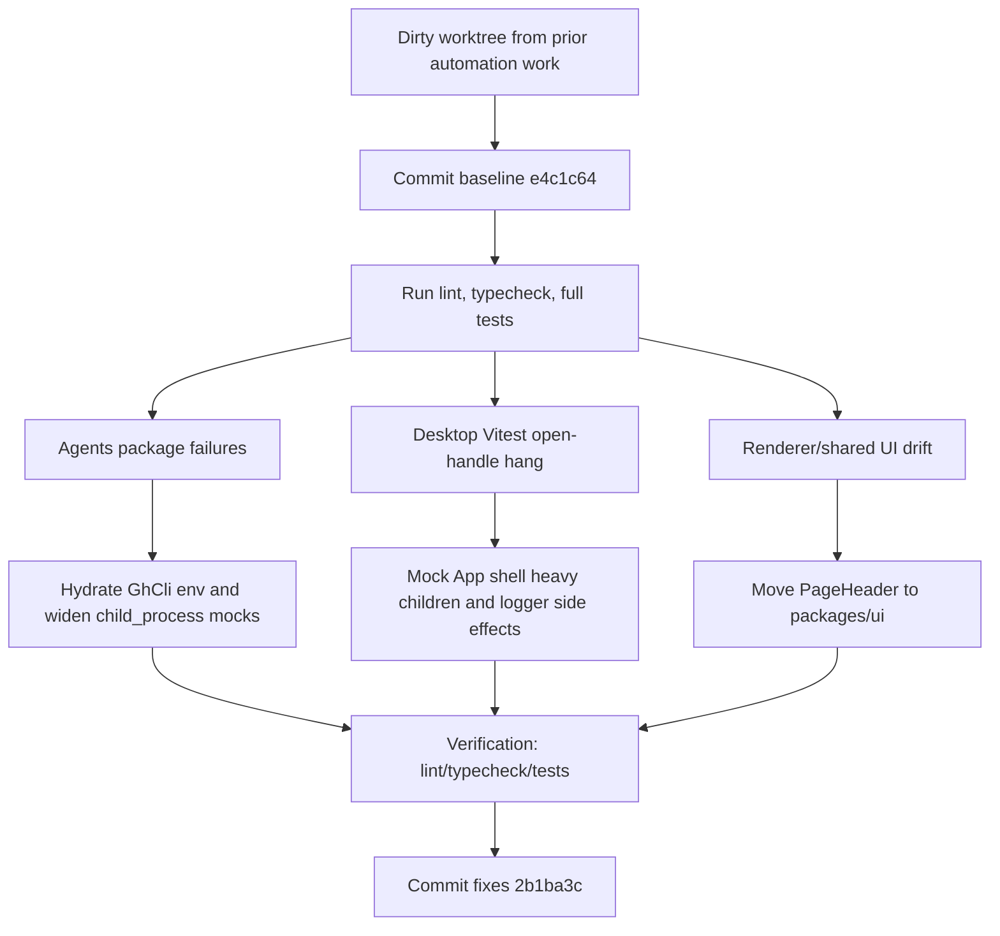
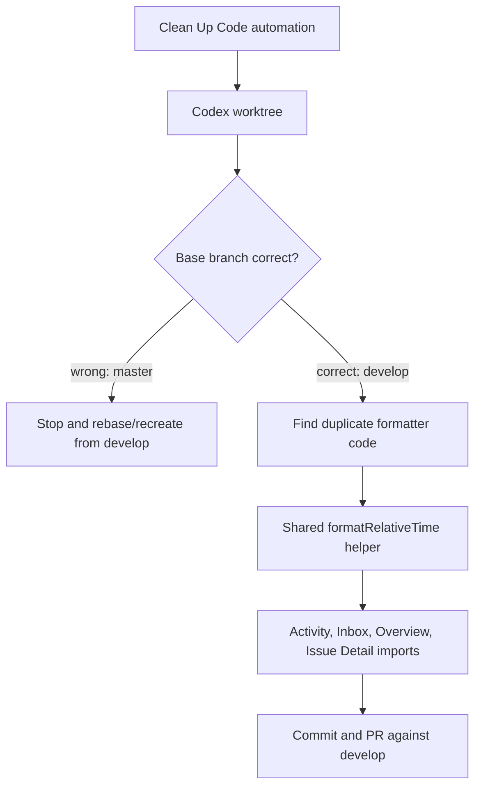

# Session 2026-04-30

## Session 1: Session start and continuity check

### Context

Started a new session after context reset. The session-start skill expected older paths under `.agents/SYSTEM/ai/` and `.agents/TASKS/`; this checkout uses `.agents/SYSTEM/SESSION-QUICK-START.md` and has no committed inbox/task file.

### What Was Loaded

- `.agents/SYSTEM/SESSION-QUICK-START.md`
- `.agents/SESSIONS/2026-04-29.md`
- `.agents/SESSIONS/2026-04-28.md`
- `git status --short`
- `git diff --stat`

### Current Continuity

- Latest documented work before this session: automation detail view, automation run history, PR link/diff detail, 10-minute shell timeout, and duplicate automation run guard.
- Working tree is still heavily dirty from prior sessions and collaborators; do not assume all changes are mine.
- No `.agents/TASKS/INBOX.md` exists in this checkout.

### Open Manual QA From Quick Start

- Nested Edit PRD modal stacking.
- Generate with AI -> Create & Plan end-to-end.

## Session 2: Commit baseline, find issues, fix regressions

### System Flow Diagram

### Affected Components

- `packages/agents`: `GhCli` env handling and child process mocks.
- `packages/ui`: shared `PageHeader` component and regression coverage.
- `apps/desktop` renderer: imports, app-shell tests, automation detail accessibility, automation test isolation.
- `apps/desktop` main IPC tests: logger/test double coverage for GitHub refresh and quick task failure flows.
- `packages/pipeline`: async wait bound in verification prompt regression coverage.
- `.agents/SESSIONS`: session continuity documentation.

### Baseline Commit

- Committed the preexisting worktree as `e4c1c64 feat(desktop): harden automation and issue workflows`.
- Pre-commit Biome fixed 10 staged files during that commit.

### What Was Done

- [x] Committed the preexisting dirty worktree before making new fixes.
- [x] Ran lint, typecheck, and test discovery to find current failures.
- [x] Fixed `GhCli` calls that bypassed the hydrated shell env.
- [x] Stabilized agent test mocks around `health-check` imports.
- [x] Moved app-local `PageHeader` into `packages/ui` and updated renderer call sites.
- [x] Added accessibility labels to automation run detail icon buttons.
- [x] Fixed desktop Vitest open-handle behavior in `App.test.tsx`.
- [x] Removed noisy passing-test stderr from desktop IPC and developer settings tests.
- [x] Re-ran root verification and committed the fix pass.

### Issues Found And Fixed

- `GhCli` had several `gh` calls that bypassed the hydrated login-shell env; `getRepoMetadata`, repo coordinate lookup, label sync, and status label edits now pass `this.env`.
- Agent tests mocked `node:child_process` too narrowly after `shellExecEnv` imports pulled in `health-check`; mocks now include the needed child process exports and deterministic env assertions.
- Desktop renderer kept an app-local `PageHeader` despite the shared UI rule; moved it to `packages/ui`, exported it, updated renderer imports, and added regression coverage.
- `AutomationRunDetail` icon-only controls had no accessible names; close and expand/collapse buttons now have explicit `aria-label`s.
- `automations-view.test.tsx` relied on another file to install jest-dom matchers; it now imports `@testing-library/jest-dom/vitest` directly.
- `App.test.tsx` imported real child modules that initialized `electron-log/renderer`, leaving Vitest open after all assertions passed; the app-shell test now mocks the newer heavy children and logger side effect.
- Desktop IPC tests emitted swallowed error noise because test doubles omitted logger mocks and `reconcileCompletedFromEvidence`; mocks now cover the production calls.
- `DeveloperSettingsSection.test.tsx` returned `undefined` for `update:get-status`, which React Query correctly warned about; it now returns a valid idle update status.
- The pipeline verification prompt regression test had a too-tight async wait after login-shell setup/verify execution; the bounded wait was increased.

### Key Decisions

- Keep the initial large preexisting change isolated as a baseline commit, then commit the discovered fixes separately for review clarity.
- Move `PageHeader` to `packages/ui` instead of keeping renderer-local markup, matching the repo rule that shared renderer UI primitives belong in the shared UI package.
- Fix the desktop Vitest hang at the test boundary by mocking side-effectful children in `App.test.tsx`; this preserves the test as an app-shell test and avoids importing real `electron-log/renderer`.
- Treat stderr from passing tests as a real quality issue when it hides missing mocks or invalid query return values.

### Files Changed

- `.agents/SESSIONS/2026-04-30.md`
- `packages/agents/src/github/gh-cli.ts`
- `packages/agents/src/github/gh-cli.test.ts`
- `packages/agents/src/context-generator.test.ts`
- `packages/ui/src/PageHeader.tsx`
- `packages/ui/src/index.ts`
- `packages/ui/src/component-regression.test.tsx`
- `apps/desktop/src/renderer/components/*View.tsx` page header imports
- `apps/desktop/src/renderer/features/automations/automations-view.tsx`
- `apps/desktop/src/renderer/components/AutomationRunDetail.tsx`
- `apps/desktop/src/renderer/App.test.tsx`
- `apps/desktop/src/main/ipc/register-github-handlers.test.ts`
- `apps/desktop/src/main/ipc/register-quick-task-handlers.test.ts`
- `apps/desktop/src/renderer/components/settings-panel/DeveloperSettingsSection.test.tsx`
- `apps/desktop/src/renderer/features/automations/automations-view.test.tsx`
- `packages/pipeline/src/pipeline.test.ts`

### Mistakes And Fixes

- Initial full root test run revealed one failure at a time; after fixing the first agent failures, the desktop runner still hung after assertions passed. The hang was isolated by splitting desktop main tests, renderer component tests, and entrypoint tests, then fixed in `App.test.tsx`.
- Passing desktop tests were still emitting React Query and IPC/logging noise. The missing mocks were added so future failures are easier to see.
- Biome surfaced existing non-null assertions in a touched quick-task test file; those were replaced with a `getHandler` helper.

### Verification

- `bunx biome check --write <touched files>` passed.
- `bun run lint` passed.
- `bun run typecheck` passed (`15 successful, 15 total`).
- `bunx vitest run --reporter=dot` in `apps/desktop` passed (`62 files`, `352 tests`) and exited cleanly.
- `bun run test` passed (`16 successful, 16 total`).

### Commits

- `e4c1c64 feat(desktop): harden automation and issue workflows`
- `2b1ba3c fix: harden workflow tests and shared page header`

### Next Steps

- Manual QA still open from the quick-start note: nested Edit PRD modal stacking.
- Manual QA still open from the quick-start note: Generate with AI -> Create & Plan end-to-end.

## Session 3: Cleanup automation branch fix and relative time dedupe

### System Flow

### Affected Components

- `packages/shared`: new reusable relative-time formatter.
- Desktop renderer: Activity, Inbox, Overview, and issue-detail relative time display.
- Automation setup: clean-up automations now require `develop` except the Veref master-only exception.

### What Was Done

- Diagnosed the failed commit hook as a branch-base mismatch: the run started from `master`, but the shared hook expected a script present on `develop`.
- Audited local clean-up automations and documented the Veref exception.
- Reset the cleanup run onto current `origin/develop`.
- Replaced four duplicate `timeAgo` implementations with one shared `formatRelativeTime` export.
- Opened PR #92 against `develop`.

### Key Decisions

- Use `origin/develop` as the PR base so the cleanup PR does not carry unrelated local `develop` commits.
- Keep the issue-detail `timeAgo` export as a compatibility alias to avoid touching the nested issue-detail tab imports.
- Do not run full package typechecks in this worktree because `node_modules` is not installed; use Biome, hook validation, and a focused helper smoke check instead.

### Files Changed

- `packages/shared/src/format-relative-time.ts`
- `packages/shared/src/index.ts`
- `apps/desktop/src/renderer/components/ActivityView.tsx`
- `apps/desktop/src/renderer/components/InboxView.tsx`
- `apps/desktop/src/renderer/components/OverviewView.tsx`
- `apps/desktop/src/renderer/components/issue-detail/helpers.ts`
- `.agents/SESSIONS/2026-04-30.md`

### Mistakes And Fixes

- Mistake: the first cleanup commit was created from a master-based Codex worktree.
- Fix: changed the automation source/default branch behavior, reset this branch onto `origin/develop`, and recreated the cleanup patch there.
- Mistake: the first PR view temporarily included unrelated local develop commits while `origin/develop` was behind.
- Fix: updated the branch after `origin/develop` advanced so the PR only carries this cleanup/session work.

### Next Steps

- Review PR #92.
- Discard any stale master-based cleanup worktrees instead of continuing them.
