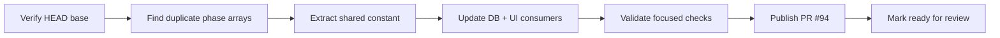

# Session 2026-04-30

## Session 1: Session start and continuity check

### Context

Started a new session after context reset. The session-start skill expected older paths under `.agents/SYSTEM/ai/` and `.agents/TASKS/`; this checkout uses `.agents/SYSTEM/SESSION-QUICK-START.md` and has no committed inbox/task file.

### What Was Loaded

- `.agents/SYSTEM/SESSION-QUICK-START.md`
- `.agents/SESSIONS/2026-04-29.md`
- `.agents/SESSIONS/2026-04-28.md`
- `git status --short`
- `git diff --stat`

### Current Continuity

- Latest documented work before this session: automation detail view, automation run history, PR link/diff detail, 10-minute shell timeout, and duplicate automation run guard.
- Working tree is still heavily dirty from prior sessions and collaborators; do not assume all changes are mine.
- No `.agents/TASKS/INBOX.md` exists in this checkout.

### Open Manual QA From Quick Start

- Nested Edit PRD modal stacking.
- Generate with AI -> Create & Plan end-to-end.

## Session 2: Commit baseline, find issues, fix regressions

### Baseline Commit

- Committed the preexisting worktree as `e4c1c64 feat(desktop): harden automation and issue workflows`.
- Pre-commit Biome fixed 10 staged files during that commit.

### Issues Found And Fixed

- `GhCli` had several `gh` calls that bypassed the hydrated login-shell env; `getRepoMetadata`, repo coordinate lookup, label sync, and status label edits now pass `this.env`.
- Agent tests mocked `node:child_process` too narrowly after `shellExecEnv` imports pulled in `health-check`; mocks now include the needed child process exports and deterministic env assertions.
- Desktop renderer kept an app-local `PageHeader` despite the shared UI rule; moved it to `packages/ui`, exported it, updated renderer imports, and added regression coverage.
- `AutomationRunDetail` icon-only controls had no accessible names; close and expand/collapse buttons now have explicit `aria-label`s.
- `automations-view.test.tsx` relied on another file to install jest-dom matchers; it now imports `@testing-library/jest-dom/vitest` directly.
- `App.test.tsx` imported real child modules that initialized `electron-log/renderer`, leaving Vitest open after all assertions passed; the app-shell test now mocks the newer heavy children and logger side effect.
- Desktop IPC tests emitted swallowed error noise because test doubles omitted logger mocks and `reconcileCompletedFromEvidence`; mocks now cover the production calls.
- `DeveloperSettingsSection.test.tsx` returned `undefined` for `update:get-status`, which React Query correctly warned about; it now returns a valid idle update status.
- The pipeline verification prompt regression test had a too-tight async wait after login-shell setup/verify execution; the bounded wait was increased.

### Verification

- `bunx biome check --write <touched files>` passed.
- `bun run lint` passed.
- `bun run typecheck` passed (`15 successful, 15 total`).
- `bunx vitest run --reporter=dot` in `apps/desktop` passed (`62 files`, `352 tests`) and exited cleanly.
- `bun run test` passed (`16 successful, 16 total`).

## Session 3: Clean-up automation PR

### Context

Ran the `clean-up-code` automation task to minimize LOC by removing duplication without deleting features. The automation was required to run from a `develop` base, so the first gate was verifying branch ancestry before editing.

### Flow

### Affected Components

- Shared constants: exported a single `AGENT_RUNNING_PHASES` list.
- DB queries: dashboard metrics and thread active/stuck queries now reuse the shared list.
- UI package: `ActivePipelineCard` now uses the shared list for agent-active rendering.
- GitHub: opened PR #94 against `develop`.

### What Was Done

- Confirmed the work was based on `origin/develop`, not `master`.
- Centralized duplicate agent-running phase arrays into `packages/shared/src/constants.ts`.
- Removed local copies from `packages/db/src/queries/dashboard.ts`, `packages/db/src/queries/threads.ts`, and `packages/ui/src/ActivePipelineCard.tsx`.
- Created branch `codex/dedupe-agent-running-phases`.
- Rebased onto current `origin/develop` (`2b1ba3c`).
- Committed `eab7ed2 refactor(shared): dedupe agent running phases`.
- Pushed the branch and opened PR #94: https://github.com/shipshitdev/shipcode/pull/94
- Marked the PR ready for review after correcting the too-conservative draft default.

### Key Decisions

- Used `@shipcode/shared` for the phase list because both `packages/db` and `packages/ui` already depend on shared contracts.
- Kept the cleanup narrow: one duplicate concept, four files, net LOC reduction.
- Did not apply labels to PR #94 because the repo does not currently have `codex` or `codex-automation` labels.

### Files Changed

- `packages/shared/src/constants.ts`
- `packages/db/src/queries/dashboard.ts`
- `packages/db/src/queries/threads.ts`
- `packages/ui/src/ActivePipelineCard.tsx`
- `.agents/SESSIONS/2026-04-30.md`

### Validation

- `bunx biome check packages/shared/src/constants.ts packages/db/src/queries/dashboard.ts packages/db/src/queries/threads.ts packages/ui/src/ActivePipelineCard.tsx --files-ignore-unknown=true`
- `git diff --check origin/develop..HEAD`
- `bun run typecheck --filter=@shipcode/shared --filter=@shipcode/db --filter=@shipcode/ui`

### Mistakes And Fixes

- The initial checkout was detached and an earlier local `develop` commit was ahead of `origin/develop`; the cleanup commit was cherry-picked and then rebased onto the live `origin/develop` base before pushing.
- PR #94 was opened as a draft due to the publish skill default. Vincent asked why; the PR was immediately marked ready for review.

### Next Steps

- Review and merge PR #94.
- Consider adding `codex` and `codex-automation` labels if automation-created PRs should be labelable by future runs.
