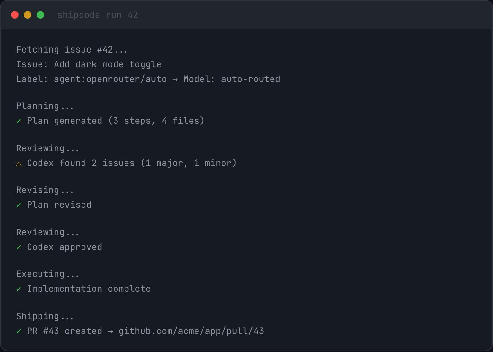

# ShipCode

AI Agents that ship working code. GitHub issue in, reviewed PR out.

<p align="center">
  
</p>

> [Watch the launch video (MP4)](https://github.com/shipshitdev/shipcode/releases/download/v0.1.0/shipcode-launch.mp4)

Label a GitHub issue with `shipcode:agent:claude`, `shipcode:agent:codex`, `shipcode:agent:openrouter`, `shipcode:agent:openrouter/auto`, or `shipcode:agent:openrouter/free`, and ShipCode handles the rest: plan, adversarial review, implement, verify, and ship a PR. Approval gates are configurable globally, per project, and per issue.

## Install

```bash
brew install --cask shipshitdev/tap/shipcode   # macOS desktop app
npx @shipshitdev/shipcode                      # CLI
```

> macOS users: the v0.1.0 build is unsigned. After install, run
> `xattr -cr "/Applications/ShipCode.app"` once to clear the Gatekeeper quarantine.

## How it works

```
GitHub Issue (labeled shipcode:agent:claude / codex / openrouter)
       |
       v
    PLAN (Opus 4.6) --- rewrite issue into spec + structured plan
       |
       v
    REVIEW (configured model) --- adversarial critique
       |
       +-- APPROVE --> EXECUTE
       +-- REVISE (max 2 rounds) --> re-review
       +-- REJECT --> FAILED
       |
       v
    EXECUTE (routed model) --- implement in isolated git worktree
       |
       v
    VERIFY (configured model) --- test, runtime QA, check diff against acceptance criteria
       |
       v
    SHIP --- push branch, create PR, link to issue
```

## Architecture

Turborepo monorepo with Electron desktop app:

```
apps/
  web/              Marketing site (Next.js + Tailwind)
  desktop/          Electron + Vite + React 19
  cli/              CLI tool (published as '@shipshitdev/shipcode' on npm)
  docs/             Documentation (Nextra)
packages/
  pipeline/         Pipeline state machine
  shared/           Types, schemas, constants
  agents/           Process manager, prompts, GitHub CLI wrapper
  db/               SQLite persistence (node:sqlite)
  git/              Git operations + worktree manager
  ui/               React components (kanban board, viewers)
```

## Prerequisites

- [Bun](https://bun.sh) >= 1.2
- [Claude Code CLI](https://claude.ai/claude-code) (`claude`)
- [Codex CLI](https://github.com/openai/codex) (`codex`)
- [GitHub CLI](https://cli.github.com) (`gh`) with auth configured
- Git

## Install

**Desktop app (macOS, Homebrew):**

```bash
brew tap shipshitdev/tap
brew install --cask shipcode
```

> macOS warning: the v0.1.0 desktop build is unsigned and not notarized yet.
> If macOS blocks the app after Homebrew installs it, run:
>
> ```bash
> xattr -cr "/Applications/ShipCode.app"
> ```
>
> This is a temporary pre-release workaround until ShipCode ships with Developer ID signing and notarization.

**CLI (Node.js >= 22.5.0):**

```bash
npx @shipshitdev/shipcode onboard
npx @shipshitdev/shipcode run 42

# Optional global install (exposes `shipcode` on $PATH)
npm install -g @shipshitdev/shipcode
```

**From source:**

```bash
git clone https://github.com/shipshitdev/shipcode
cd shipcode
bun install
bun run dev:desktop
```

## GitHub integration

ShipCode uses the `gh` CLI for all GitHub operations. Make sure you're authenticated:

```bash
gh auth status
```

### Labels

| Label | Effect |
|-------|--------|
| `shipcode:agent:claude` | Claude implements the issue |
| `shipcode:agent:codex` | Codex implements the issue |
| `shipcode:agent:openrouter` | OpenRouter implements the issue with the configured executor model |
| `shipcode:agent:openrouter/auto` | OpenRouter chooses the model through its auto router |
| `shipcode:agent:openrouter/free` | OpenRouter stays on the configured free-tier model |

### Pipeline state labels (set automatically)

| Label | Meaning |
|-------|---------|
| `shipcode:pipeline:queued` | Issue picked up, waiting for pipeline slot |
| `shipcode:pipeline:planning` | Planner is generating a plan |
| `shipcode:pipeline:reviewing` | Reviewer is critiquing the plan |
| `shipcode:pipeline:executing` | Executor is implementing changes |
| `shipcode:pipeline:testing` | Test/runtime QA commands are running |
| `shipcode:pipeline:verifying` | Verifier is checking the result |
| `shipcode:pipeline:shipping` | Branch push and PR creation are running |
| `shipcode:pipeline:failed` | Pipeline failed |

## Key design decisions

- **`gh` CLI over GitHub API** -- no OAuth, no token management, uses existing auth
- **Adversarial review** -- configurable planner/reviewer models catch different blind spots before execution
- **Configurable review rounds** -- default is fast-path zero revisions, with project and issue overrides up to 5
- **Optional approval gates** -- stay fully autonomous by default, or pause before execution when the task needs a human checkpoint
- **Fork-point SHA for diffs** -- stable diffs even when base branch moves

## License

MIT
